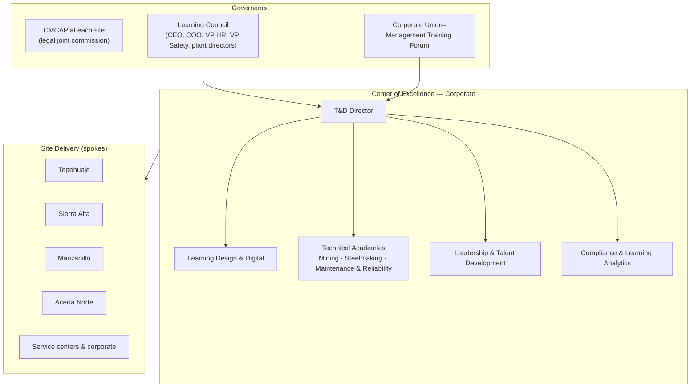
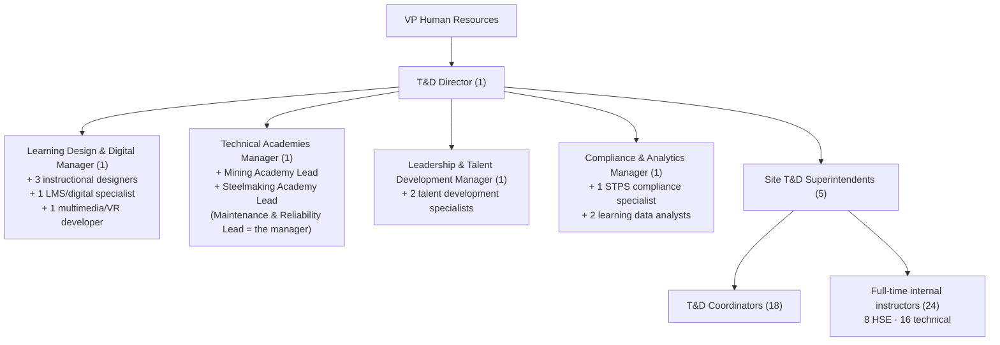

# T&D Department Design — "Academia GASM"

## 1. Purpose, mission and vision

**Name:** Gerencia Corporativa de Capacitación y Desarrollo, branded internally as **Academia GASM**.

**Mission:** Make sure every person who works at GASM, employee or contractor, is **competent, certified and safe** in their job. Develop the talent the business needs to operate at world-class level today and to lead the steel industry's transformation tomorrow.

**Vision (2029):** Be the reference learning organization in Mexico's mining and steel sector, recognized for zero fatalities, certified technical excellence and a strong internal pipeline of leaders.

**Values in action:**
- *Safety first*: no production pressure justifies an uncertified worker in a critical task.
- *Competence, not attendance*: we measure what people can do, not the hours they sat in a class.
- *Learning from those who know*: our experts teach, and we recognize them.
- *Everyone has a path*: every job family has a visible development path.
- *Impact*: every program has a business owner and a measurable goal.

## 2. Operating model

Academia GASM uses a **hub-and-spoke** model: a central Center of Excellence (CoE) sets the rules, and site teams deliver. Three layers:

| Layer | Owns | Does not own |
|---|---|---|
| **CoE (corporate)** | Standards, policy, competency framework, program design, LMS, vendor strategy, analytics, budget consolidation, leadership programs | Day-to-day scheduling at the sites |
| **Site T&D teams** | Site needs analysis (DNC), scheduling, delivery, OJT coordination, DC-3 issuance, CMCAP secretariat, contractor induction | Designing new corporate programs (they request them from the CoE) |
| **Line management** | Releasing people for training, OJT, sign-off of competence, coaching, level-3 follow-up | Deciding alone to skip critical-risk certification |
| **Subject-matter experts (SMEs) / internal instructors** | Technical content, delivery, assessment | Administration |

### Reporting lines
- The **T&D Director** reports to the **VP of Human Resources**, with a dotted line to the **COO** for the technical academies and to the **VP of Safety** for the critical-risk program.
- **Site T&D Superintendents** report *solid line* to the T&D Director (for standards and budget) and *dotted line* to the Site Director / Site HR Manager (for operational priorities). This removes the fragmentation found in the diagnosis.

## 3. Organization chart and headcount

| Unit | Positions | Headcount |
|---|---|---|
| Direction | T&D Director | 1 |
| Learning Design & Digital | Manager, instructional designers (3), LMS specialist (1), multimedia/VR developer (1) | 6 |
| Technical Academies | Manager (who also leads Maintenance & Reliability), Mining Academy Lead, Steelmaking Academy Lead | 3 |
| Leadership & Talent Development | Manager, talent development specialists (2) | 3 |
| Compliance & Analytics | Manager, STPS compliance specialist (1), learning data analysts (2) | 4 |
| Site T&D teams | Superintendents (5) + coordinators (Tepehuaje 4, Sierra Alta 4, Manzanillo 2, Acería Norte 8, Service & corporate 0 — covered by corporate) | 23 |
| Full-time internal instructors | HSE / critical-risk (8), mining (5), steelmaking (5), maintenance (6) | 24 |
| **Total structure** | | **64** |
| Part-time certified SME instructors (internal, not headcount) | Paid an instructor allowance | ≈ 150 |

**Transition:** today the six site "Capacitación" offices have 27 people. About 20 of them move into the new structure after a competency assessment. The rest of the headcount (≈ 44) is hired in phases over 18 months (see the roadmap).

## 4. Key roles (summary job descriptions)

| Role | Purpose | Key responsibilities | Profile | KPIs |
|---|---|---|---|---|
| **T&D Director** | Lead the learning strategy aligned to the business | Strategy, budget (≈ MXN 139 M opex), Learning Council, union relations on training, vendor strategy, ROI | 12+ years in T&D/HR, 5+ in heavy industry; union environment; English | Plan execution, safety impact, ROI, internal fill rate |
| **Learning Design & Digital Manager** | Design effective, scalable learning | ADDIE/SAM standards, LMS, content library, VR/simulation, microlearning | Instructional design (EC0301), e-learning, project management | Design lead time, learner satisfaction, digital adoption |
| **Technical Academies Manager** | Build technical competence in mining, steelmaking and maintenance | Competency frameworks for 120 critical roles, certification scheme, simulators, OEM partnerships | Engineer with 10+ years of operations/maintenance experience | Time to competency, % certified, availability/reliability impact |
| **Leadership & Talent Development Manager** | Build the leadership pipeline and critical-role succession | Supervisor school, leadership programs, succession, talent review, mentoring, high-potential programs | Organizational psychology/HR, assessment centers, coaching certification | Internal fill rate, bench strength, engagement |
| **Compliance & Analytics Manager** | Keep the organization compliant and prove impact | STPS (DC-2/3/4/5, SIRCE), CMCAP support, audits, dashboards, Kirkpatrick/Phillips | Labor law knowledge, data analytics (Power BI/SQL) | 100% compliance, zero STPS findings, dashboard adoption |
| **Site T&D Superintendent** | Run T&D at the site | Site needs analysis and annual plan, delivery, CMCAP secretariat, contractor induction, site budget | Degree + 7 years in T&D in industry, EC0217/EC0301 | Plan compliance, critical certification coverage |
| **T&D Coordinator** | Plan and administer training | Scheduling, logistics, LMS records, DC-3 issuance, OJT tracking | Degree, LMS/Excel skills, EC0217 | Records accuracy, DC-3 lead time |
| **Internal Instructor (full-time)** | Deliver and assess | Classroom, field and simulator delivery; competence assessment; content updates | Operational expert + EC0217; assessor certification | Learner results, assessment quality |
| **SME Instructor (part-time)** | Share expert knowledge | 60–120 h/year of instruction and mentoring | Recognized expert, EC0217 | Hours taught, evaluation |

## 5. RACI matrix — main processes

R = Responsible · A = Accountable · C = Consulted · I = Informed

| Process | T&D Director | CoE | Site T&D | Line manager | Safety (HSE) | CMCAP / Union | Employee |
|---|---|---|---|---|---|---|---|
| T&D strategy & budget | A/R | C | C | C | C | I | – |
| Competency frameworks | A | R | C | C | C | C | I |
| Training needs analysis (DNC) | I | C | A/R | R | C | C | C |
| Annual plan (DC-2) | A | C | R | C | C | R (approves) | I |
| Program design | A | R | C | C | C | I | – |
| Delivery & logistics | I | C | A/R | R (releases people) | C | I | R (attends) |
| Critical-risk certification | A | R (standard) | R (delivers) | R (field sign-off) | A (control owner) | I | R |
| DC-3 / DC-4 compliance | I | A (Compliance) | R | I | I | R (signs) | I |
| Evaluation & ROI | A | R | R | R (L3) | C | I | C |
| Leadership & succession | A | R | C | R | – | – | R |
| Contractor induction | I | C | A/R | C | R | – | R (contractor) |
| Knowledge capture | A | R | R | R | C | I | R (experts) |

## 6. Governance forums

| Forum | Members | Frequency | Decisions |
|---|---|---|---|
| **Learning Council** | CEO (chair), COO, VP HR, VP Safety, CFO, plant directors, T&D Director (secretary) | Quarterly | Priorities, budget, flagship programs, capex, KPI review |
| **Academy Boards** (one each for Mining, Steelmaking, Maintenance) | Business sponsor (plant director), academy lead, senior SMEs, safety | Bimonthly | Curriculum, certification standards, simulator use |
| **Corporate Union–Management Training Forum** | Union training secretaries, VP HR, T&D Director | Semiannual | Alignment with the CCT, escalafón paths, training outside working hours |
| **CMCAP (per site)** — legal requirement | Equal worker and employer representatives | At least quarterly | Approving the DC-2 plan, signing DC-3s, monitoring |
| **T&D Operations Review** | T&D Director, CoE managers, site superintendents | Monthly | Plan execution, compliance, budget, issues |
