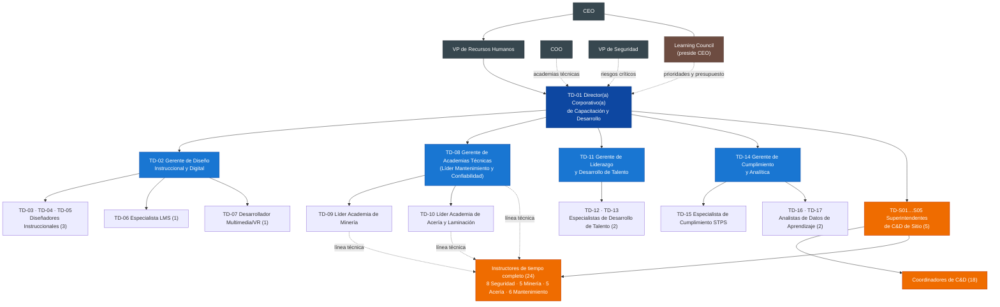
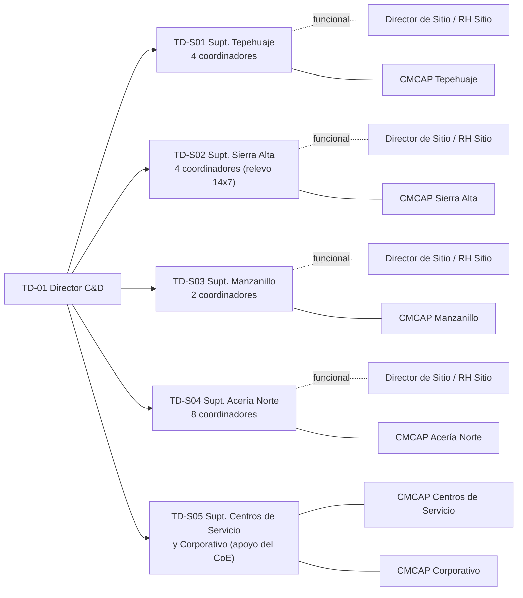

# Organigrama General — Academia GASM (64 plazas)

> ⚠️ **Estructura vigente: híbrida (decisión D-001).** Las descripciones de puesto de esta carpeta siguen siendo válidas en cuanto a funciones. Las **líneas de reporte y la pertenencia a las células** cambiaron: ver [`equipo-director/estructura-hibrida.md`](../../equipo-director/estructura-hibrida.md). Este documento se conserva como referencia del diseño anterior.

> Este documento es el índice del organigrama. El detalle de las funciones de **cada miembro del equipo** está en los documentos por área:
>
> | # | Documento | Plazas |
> |---|---|---|
> | 01 | [Dirección y Diseño Instruccional y Digital](01-direccion-y-diseno-instruccional.md) | 7 |
> | 02 | [Academias Técnicas e Instructores de Tiempo Completo](02-academias-tecnicas-e-instructores.md) | 27 |
> | 03 | [Liderazgo, Talento, Cumplimiento y Analítica](03-liderazgo-talento-y-cumplimiento.md) | 7 |
> | 04 | [Equipos de C&D de Sitio](04-equipos-de-sitio.md) | 23 (+ ~150 instructores SME de medio tiempo) |
> | | **Total** | **64** |

## 1. Organigrama de nivel 1 y 2

**Convención:** línea continua = reporte jerárquico (sólido); línea punteada = reporte funcional/técnico.

## 2. Organigrama por sitio (equipos de entrega)

Hay 6 CMCAP (una por centro de trabajo del scorecard). TD-S05 atiende dos: Centros de Servicio y Corporativo. Jurídico Laboral debe confirmar si cada centro de servicio (Monterrey, Querétaro, Silao) requiere su propia CMCAP.

La asignación individual de los 24 instructores de tiempo completo por sitio está en el documento [02](02-academias-tecnicas-e-instructores.md). La de los 18 coordinadores está en el documento [04](04-equipos-de-sitio.md).

## 3. Inventario de plazas

| Área | Código | Puesto | Plazas | Reporta a (sólido) | Punteado a |
|---|---|---|---|---|---|
| Dirección | TD-01 | Director(a) Corporativo(a) de C&D | 1 | VP de RH | COO, VP de Seguridad |
| Diseño Instruccional y Digital | TD-02 | Gerente de Diseño Instruccional y Digital | 1 | TD-01 | – |
| | TD-03 a TD-05 | Diseñador(a) Instruccional | 3 | TD-02 | Líder de Academia del portafolio |
| | TD-06 | Especialista LMS y Plataformas Digitales | 1 | TD-02 | TI corporativa |
| | TD-07 | Desarrollador(a) Multimedia / VR | 1 | TD-02 | – |
| Academias Técnicas | TD-08 | Gerente de Academias Técnicas (Líder Mantenimiento y Confiabilidad) | 1 | TD-01 | COO / VP Operaciones |
| | TD-09 | Líder de Academia de Minería | 1 | TD-08 | Director de Minería |
| | TD-10 | Líder de Academia de Acería y Laminación | 1 | TD-08 | Director Acería Norte |
| Liderazgo y Talento | TD-11 | Gerente de Liderazgo y Desarrollo de Talento | 1 | TD-01 | VP de RH |
| | TD-12, TD-13 | Especialista de Desarrollo de Talento | 2 | TD-11 | – |
| Cumplimiento y Analítica | TD-14 | Gerente de Cumplimiento y Analítica | 1 | TD-01 | Jurídico Laboral |
| | TD-15 | Especialista de Cumplimiento STPS | 1 | TD-14 | – |
| | TD-16, TD-17 | Analista de Datos de Aprendizaje | 2 | TD-14 | – |
| Sitios | TD-S01 a TD-S05 | Superintendente de C&D de Sitio | 5 | TD-01 | Director de Sitio / Gerente RH de Sitio |
| | TD-C-… | Coordinador(a) de C&D | 18 | Superintendente del sitio | – |
| Instructores | TD-IS-01 a 08 | Instructor(a) de Seguridad y Riesgos Críticos | 8 | Superintendente del sitio | VP de Seguridad (estándar técnico) |
| | TD-IM-01 a 05 | Instructor(a) de Minería | 5 | Superintendente del sitio | TD-09 |
| | TD-IA-01 a 05 | Instructor(a) de Acería y Laminación | 5 | Superintendente del sitio | TD-10 |
| | TD-IN-01 a 06 | Instructor(a) de Mantenimiento | 6 | Superintendente del sitio | TD-08 |
| **Total** | | | **64** | | |

## 4. Tramos de control

| Jefe | Reportes directos | Comentario |
|---|---|---|
| TD-01 Director | 9 (4 gerentes + 5 superintendentes) | Amplio pero manejable: los superintendentes tienen alta autonomía operativa |
| TD-02 | 5 | |
| TD-08 | 2 líderes + línea técnica de 16 instructores técnicos | Gestión técnica, no administrativa |
| TD-11 | 2 | Se apoya en ~40 mentores/coaches internos |
| TD-14 | 3 | |
| Superintendente Acería Norte | 8 coordinadores + instructores asignados | El sitio más grande; se recomienda que un coordinador senior sea su suplente |

## 5. Contratación por fases (vinculada al roadmap)

| Fase | Mes | Plazas que se cubren |
|---|---|---|
| 0. Movilización | 0–3 | TD-01 (búsqueda externa); 5 superintendentes (transición del personal actual); TD-15 (urgente para la auditoría) |
| 1. Fundamentos | 3–12 | TD-02, TD-06, TD-08, TD-11, TD-14; 8 instructores de Seguridad; 18 coordinadores (≈ 15 por transición interna); TD-03, TD-16 |
| 2. Academias | 12–24 | TD-09, TD-10, TD-04, TD-05, TD-07, TD-12, TD-13, TD-17; 16 instructores técnicos |
| 3. Escala | 24–36 | Revisión del tamaño de la estructura según KPIs y carga real |
