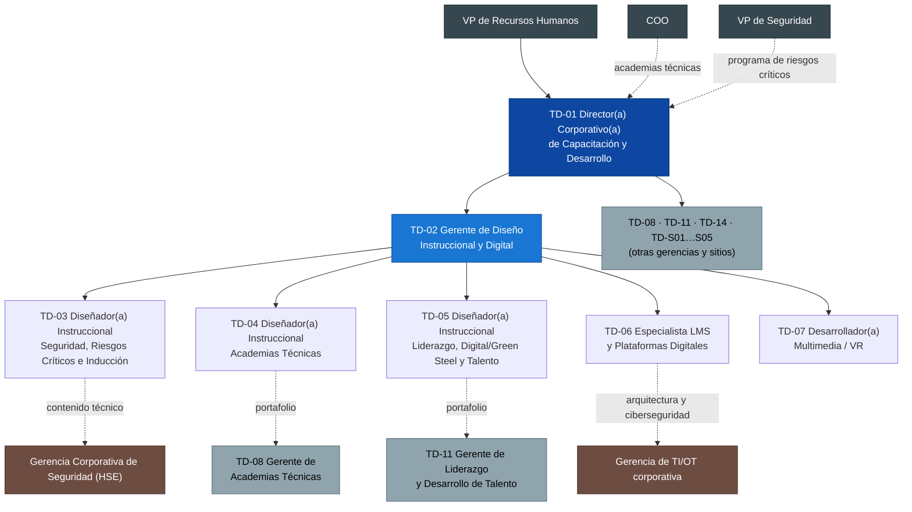

# Dirección y Gerencia de Diseño Instruccional y Digital — Descripciones de Puesto (7 plazas)

> **Alcance:** TD-01 a TD-07 del [organigrama general](00-organigrama-general.md): la Dirección Corporativa de Capacitación y Desarrollo (Academia GASM) y la Gerencia de Diseño Instruccional y Digital.
>
> **Fuentes (este documento no las cambia):**
> - [`department-design.md`](../department-design.md): estructura de 64 plazas, roles, RACI y foros de gobierno.
> - [`process-manual.md`](../../04-processes/process-manual.md): procesos TD-P01 a TD-P12.
> - [`program-portfolio.md`](../../05-programs/program-portfolio.md): escuelas y academias.
> - [`kpi-scorecard.md`](../../08-kpis/kpi-scorecard.md): KPIs y metas.
> - [`implementation-roadmap.md`](../../06-implementation/implementation-roadmap.md) y [`budget-and-business-case.md`](../../07-business-case/budget-and-business-case.md): fechas y montos.
>
> **Convenciones:**
> - **Año 1** es el año 1 del scorecard (2027, meses 0–12 del roadmap).
> - Las plazas que se cubren en la fase 2 del [organigrama general](00-organigrama-general.md#5-contratación-por-fases-vinculada-al-roadmap) son TD-04, TD-05 y TD-07. Para ellas se muestra la meta del año 1 y la del **año 2**, que es su primer año completo en el puesto.
> - Si una meta dice *"propuesta"*, no está en el scorecard. Es una meta interna del área, y la Dirección la valida al cerrar el primer trimestre.
> - **Bandas relativas** (escala interna de personal de confianza): **N1** Dirección corporativa · **N2** Gerencia corporativa · **N3** Profesional especialista. No se dan cifras salariales.

---

## 1. Mini-organigrama del área

Una línea continua es el reporte jerárquico. Una línea punteada es el reporte funcional o técnico: define prioridades y contenido, pero no evalúa el desempeño ni aprueba gastos.

## 2. Resumen de plazas

| Código | Puesto | Plazas | Reporta a (sólida / punteada) | Sede base | Banda | Portafolio / foco | Contratación |
|---|---|---|---|---|---|---|---|
| TD-01 | Director(a) Corporativo(a) de Capacitación y Desarrollo | 1 | VP de RH / COO y VP de Seguridad | Corporativo, San Pedro Garza García, N.L. | N1 | Toda la Academia GASM (64 plazas, ≈ 150 SMEs) | Fase 0 (mes 0–3) |
| TD-02 | Gerente de Diseño Instruccional y Digital | 1 | TD-01 / – | Corporativo, San Pedro Garza García | N2 | Estándares de diseño, portafolio de desarrollo, LMS, VR y contenido digital | Fase 1 (mes 3–12) |
| TD-03 | Diseñador(a) Instruccional — Seguridad, Riesgos Críticos e Inducción | 1 | TD-02 / HSE corporativo (VP de Seguridad) | Corporativo, San Pedro Garza García | N3 | Escuela de Seguridad (S-01 a S-08, sin S-04); 10 módulos transversales de S-03; inducción de empleados y contratistas | Fase 1 |
| TD-04 | Diseñador(a) Instruccional — Academias Técnicas | 1 | TD-02 / TD-08 | Complejo Acería Norte, Salinas Victoria, N.L. | N3 | Academias de Minería, Acería y Laminación, y Mantenimiento y Confiabilidad; 6 módulos de proceso de S-03; Legado Experto | Fase 2 (mes 12–24) |
| TD-05 | Diseñador(a) Instruccional — Liderazgo, Digital/Green Steel y Talento | 1 | TD-02 / TD-11 | Corporativo, San Pedro Garza García | N3 | Escuela de Liderazgo (L-1 a L-4, más S-04); Escuela Digital y Habilidades del Futuro; Programas de Talento; Formación de Instructores | Fase 2 |
| TD-06 | Especialista LMS y Plataformas Digitales | 1 | TD-02 / TI corporativa | Corporativo, con estancia en Acería Norte durante el piloto | N3 | LMS (≈ 12,500 usuarios), integraciones, DC-3 automático, datos | Fase 1 |
| TD-07 | Desarrollador(a) Multimedia / VR | 1 | TD-02 / – | Complejo Acería Norte (sala VR del Centro Técnico) | N3 | Laboratorios VR, video SOP, microlearning, animación 3D, escenarios de simulador | Fase 2 |
| | **Total** | **7** | | | | | |

**Por qué se dividió así el portafolio.** La división sigue la propuesta base, con dos ajustes.

**Ajuste 1: los módulos S-03 se reparten por tipo de riesgo.** S-03 tiene 16 módulos de Estándares de Riesgo Crítico. Los 10 transversales, que aplican en todos los sitios, quedan con **TD-03**:
- aislamiento/LOTO
- espacios confinados
- trabajo en alturas
- cargas suspendidas/izaje
- trabajo eléctrico
- trabajo en caliente
- sistemas a presión
- gas e hidrógeno
- bandas transportadoras
- interacción vehículo–peatón

Los 6 módulos ligados a un proceso y a un simulador quedan con **TD-04**:
- grúa viajera
- equipo móvil de mina
- explosivos y voladura
- metal fundido y ollas
- operación de HEA
- control de terreno subterráneo

**Ajuste 2: S-04 Liderazgo en Seguridad pasa a TD-05.** Se integra con L-1 "Líder de Turno" porque es la misma población, el mismo formato de cohorte y el mismo año de lanzamiento.

**Cómo se cubre el año 1.** TD-04, TD-05 y TD-07 entran en la fase 2. En el año 1:
- **TD-03** diseña los 16 módulos S-03, con SMEs de TD-08 y proveedores. Los 6 módulos de proceso pasan a TD-04 cuando entra.
- **TD-02** dirige el diseño de L-1, junto con TD-11 y un proveedor.
- **Proveedores de producción** entregan los primeros escenarios VR, con especificaciones de TD-02.

Ver la [sección 11](#11-interfaces-con-otras-áreas-de-la-academia) y las inconsistencias señaladas al final.

## 3. Matriz de división del trabajo del área

R = Responsable (ejecuta) · A = Aprobador (rinde cuentas; uno por fila) · C = Consultado · I = Informado

| # | Entregable / actividad | Proceso | TD-01 | TD-02 | TD-03 | TD-04 | TD-05 | TD-06 | TD-07 |
|---|---|---|---|---|---|---|---|---|---|
| 1 | Estrategia, plan maestro de 36 meses y presupuesto de la Academia | RACI "Estrategia y presupuesto" | **A/R** | C | I | I | I | I | I |
| 2 | Presupuesto de diseño y digital (LMS SaaS, bibliotecas, licencias VR, capex de laboratorios VR) | TD-P03 | **A** | R | I | I | I | C | C |
| 3 | Estándar de diseño: Design Brief, ADDIE/SAM, guía de estilo operativa, matriz de modalidades | TD-P04 | **A** | R | C | C | C | C | C |
| 4 | Priorización del portafolio anual de proyectos de diseño (P1/P2/P3) | TD-P02 / TD-P04 | **A** | R | C | C | C | I | C |
| 5 | Catálogo corporativo de cursos: código, duración, modalidad, vigencia, área del catálogo STPS | TD-P03 | I | **A** | R | R | R | R | I |
| 6 | Plantilla de estándar de módulo S-03 y lista de verificación de pasos críticos | TD-P04 / TD-P07 | I | **A** | R | C | I | C | C |
| 7 | 10 módulos S-03 transversales | TD-P04 / TD-P07 | I | **A** | R | C | I | C | C |
| 8 | 6 módulos S-03 de proceso (en el año 1 los diseña TD-03) | TD-P04 / TD-P07 | I | **A** | C | R | I | C | C |
| 9 | S-01, S-02, S-05 a S-08; inducción "Bienvenida GASM" y de contratistas (4 h + 2 h + examen) | TD-P08 | I | **A** | R | I | C | C | C |
| 10 | Rutas de aprendizaje de las Academias Técnicas, OJT estructurado y bitácoras | TD-P04 / TD-P07 | I | **A** | C | R | I | C | C |
| 11 | Vinculación de los perfiles de 120 roles críticos con soluciones de aprendizaje y método de evaluación | TD-P01 | I | **A** | R (roles HSE) | R | C | R (carga en LMS) | I |
| 12 | L-1 "Líder de Turno" con S-04 integrado; L-2, L-3 y L-4 | TD-P04 | C | **A** | C | I | R | C | C |
| 13 | Formación de Instructores GASM (40 h) y de Evaluadores (16 h) | TD-P12 | I | **A** | C | C | R | I | C |
| 14 | Programas de Talento: currícula dual CONALEP/UT, Ingenieros en Desarrollo, Mujeres que Forjan | TD-P04 | I | **A** | C | C | R | I | C |
| 15 | Escuela Digital y Habilidades del Futuro; Green Steel y Energía | TD-P04 | I | **A** | C | C | R | C | C |
| 16 | Captura de conocimiento "Legado Experto": método, entrevistas, video SOP | TD-P10 | I | **A** | I | R | I | C | R |
| 17 | Laboratorios VR de riesgo crítico (4 sitios) y escenarios de simulador | TD-P04 | I | **A** | C | C | I | C | R |
| 18 | Microlearning, video y animación 3D | TD-P04 | I | **A** | C | C | C | C | R |
| 19 | Selección del LMS (RFP), implementación y despliegue en 6 sitios | TD-P05 / TD-P09 | **A** | R | C | C | C | R | I |
| 20 | Integraciones del LMS: SAP/HRIS, permisos de trabajo, control de acceso, portal de contratistas, gafete QR | TD-P07 / TD-P08 | I | **A** | C | C | I | R | I |
| 21 | Generación automática de DC-3 y datos para DC-4 (configuración técnica)¹ | TD-P09 | I | **A** | I | I | I | R | I |
| 22 | Publicación en el LMS, control de versiones y revisión de vigencia (cada 2 años) | TD-P04 / TD-P09 | I | **A** | C | C | C | R | C |
| 23 | Filtro de calidad: firmas SME y HSE, piloto con 8 o más participantes, expediente para el Academy Board | TD-P04 | I | **A** | R | R | R | C | C |
| 24 | Instrumentos de evaluación L1–L3 del plan de evaluación de cada programa | TD-P06 | I | **A** | R | R | R | C | I |
| 25 | Proveedores de contenido, VR y plataforma (bases técnicas, evaluación) | TD-P12 | **A** | R | C | C | C | C | C |
| 26 | Informes al Learning Council y al Foro Sindicato–Empresa | Gobierno | **A/R** | C | I | I | I | C | I |

¹ En el proceso completo de DC-3/DC-4, el **A** es la Gerencia de Cumplimiento y Analítica (TD-14), según el RACI de `department-design.md`. Aquí TD-02 solo rinde cuentas de la configuración técnica.

**Nota sobre la A del diseño.** En el RACI corporativo, el **A de "Diseño de programas" es el Director**. En esta matriz, TD-01 delega en TD-02 la aprobación de cada curso (filas 5–24) y conserva el A del estándar y del portafolio anual (filas 3 y 4). Además, el Academy Board aprueba cada programa después del piloto, como exige el filtro de calidad de TD-P04.

---

## 4. TD-01 — Director(a) Corporativo(a) de Capacitación y Desarrollo

### 4.1 Identificación
| Campo | Detalle |
|---|---|
| Código | TD-01 |
| Título | Director(a) Corporativo(a) de Capacitación y Desarrollo (Academia GASM) |
| Área | Dirección de la Gerencia Corporativa de Capacitación y Desarrollo, Vicepresidencia de Recursos Humanos |
| Reporta a | **Línea sólida:** VP de Recursos Humanos. **Punteada:** COO (academias técnicas) y VP de Seguridad (programa de riesgos críticos "Cero Fatalidades"). |
| Supervisa a | **9 directos:** TD-02, TD-08, TD-11, TD-14 y los Superintendentes de C&D de Sitio TD-S01 a TD-S05. **Indirectos:** los otros 54 puestos de la estructura de 64, más ≈ 150 instructores SME de medio tiempo (fuera de plantilla). |
| Ubicación | Corporativo, San Pedro Garza García, N.L., con presencia frecuente en los 6 sitios |
| Nivel / banda | N1 — Dirección corporativa (un nivel debajo de VP) |
| Tipo de personal | Confianza (LFT Art. 9) |
| Número de plazas | 1 |

### 4.2 Propósito del puesto
Dirigir la Academia GASM para que cada empleado y contratista sea **competente, esté certificado y trabaje seguro**, y para desarrollar el talento que necesitan la operación y la transición a Green Steel. Rinde cuentas del presupuesto de la Academia, del cumplimiento STPS y del impacto medible en seguridad, disponibilidad y talento.

### 4.3 Funciones principales
| # | Función | % tiempo | Proceso |
|---|---|---|---|
| 1 | Definir y ejecutar la estrategia y el plan maestro de 36 meses de la Academia, alineados con los 6 impulsores del negocio: Cero Fatalidades, excelencia operativa, nearshoring/IATF, descarbonización, relevo generacional y licencia social | 12% | RACI "Estrategia y presupuesto"; TD-P02 (consolidación) |
| 2 | Formular y controlar el presupuesto: ≈ MXN 123 M de opex en el año 1 (78 de base + 45 incrementales) y MXN 139 M en régimen (año 3). También el capex de centros, simuladores (MXN 40 M) y laboratorios VR (MXN 8 M). Meta de variación: ±5% | 12% | TD-P03 |
| 3 | Fungir como secretario(a) del Learning Council (trimestral) y presidir la Revisión Operativa de C&D (mensual) | 10% | Gobierno; TD-P06 |
| 4 | Conducir la relación con el sindicato en temas de capacitación: Foro Corporativo Sindicato–Empresa (semestral), cláusulas del CCT, rutas de escalafón y capacitación fuera de jornada. Asegurar CMCAP activas en los 6 sitios | 10% | TD-P11 |
| 5 | Asegurar, junto con el VP de Seguridad, el programa de certificación de tareas críticas (16 riesgos) y la inducción de contratistas ligada al acceso | 12% | TD-P07, TD-P08 |
| 6 | Garantizar el cumplimiento de la LFT (Cap. III Bis) y de la STPS: DC-2, DC-3, DC-4, DC-5 y SIRCE. Mantener el kit de preparación para inspecciones | 6% | TD-P09 |
| 7 | Aprobar los marcos de competencia, el estándar de diseño y el portafolio anual de programas insignia | 8% | TD-P01, TD-P04 |
| 8 | Dirigir la estrategia de proveedores con Compras: licitaciones, acuerdos marco y consolidación de 140 a ≤ 40 proveedores | 7% | TD-P12 |
| 9 | Patrocinar la evaluación de impacto (L4/L5) y los estudios de ROI de Phillips | 6% | TD-P06 |
| 10 | Construir y dirigir el equipo: evaluar las competencias de las 27 personas actuales, contratar por fases ≈ 44 plazas y desarrollar a gerentes y superintendentes | 12% | Gestión interna (roadmap, fase 1) |
| 11 | Gestionar alianzas externas: CONOCER (Centro de Evaluación, fase 3), CONALEP/UT, universidades, OEMs, cámaras (CAMIMEX, CANACERO) y la STPS estatal | 5% | TD-P12; Programas de Talento |
| | **Total** | **100%** | |

### 4.4 Responsabilidades específicas de esta plaza
- Es la **única plaza con el A** de la estrategia, del presupuesto, del plan anual DC-2 a nivel corporativo, del diseño de programas, de la evaluación y ROI, de liderazgo y sucesión, y de la captura de conocimiento (RACI de `department-design.md`).
- Es dueño(a) en el scorecard de: **horas por empleado**, **costo por hora de capacitación** y **variación presupuestal**.
- Entregables del año 1 (fase 1 del roadmap):
  - estructura de 64 plazas cubierta por etapas
  - 120 perfiles de rol
  - 16 Estándares de Riesgo Crítico con certificación
  - LMS en los 6 sitios
  - 80 instructores con EC0217.01
  - inducción de contratistas ligada al acceso
  - 6 cohortes de la Escuela de Supervisores
- Relevar al líder interino designado por el VP de RH en las semanas 1–2 del plan de 90 días del roadmap.
- **No puede eximir** a nadie de la certificación de una tarea crítica. Asignar a una persona no certificada es falta grave (Política, sección 7).

### 4.5 Autoridad y decisiones
| Decide solo(a) | Propone (aprueba otra instancia) | Escala |
|---|---|---|
| Reasignar partidas dentro del presupuesto aprobado de la Academia, sin exceder el total | Presupuesto anual, capex y opción mínima viable → VP de RH, CFO y Learning Council | Producción no libera personal y pone en riesgo el cumplimiento P1 o de certificaciones que vencen → COO y Director de Sitio |
| Contratar, promover y dar de baja dentro de la plantilla autorizada de 64 plazas (con RH) | Cambios a la estructura o a la plantilla → VP de RH | Una persona realiza una tarea crítica sin certificación vigente → VP de Seguridad **de inmediato** (paro de la tarea) |
| Aprobar el estándar de diseño, el catálogo corporativo y los Design Briefs de programas insignia | Cambios a la Política de C&D → VP de RH y Comité de Dirección | Riesgo de hallazgo o de multa STPS → VP de RH y Jurídico Laboral |
| Dar de baja a proveedores con calificación L1 < 4.0 en dos ocasiones (TD-P12) | Adjudicación de acuerdos marco → Compras y Comité de Adquisiciones | Conflicto con el sindicato sobre capacitación, escalafón o jornada → VP de RH y Relaciones Laborales |
| Priorizar el portafolio de diseño y el calendario de lanzamientos | Cambios a las definiciones o metas de los KPI → solo el Learning Council | Variación presupuestal mayor a ±5% → VP de RH y CFO |

### 4.6 Indicadores de desempeño
| KPI (scorecard) | Meta año 1 | Tipo |
|---|---|---|
| Horas por empleado | 44 | Dueño(a) |
| Costo por hora de capacitación | ≤ MXN 330 | Dueño(a) |
| Variación presupuestal | ±5% | Dueño(a) |
| Certificación de tareas críticas | 100% | Rinde cuentas (con Sitios y HSE) |
| Cumplimiento de capacitación obligatoria (P1) | 95% | Rinde cuentas |
| Hallazgos STPS en capacitación | 0 | Rinde cuentas (con TD-14) |
| CMCAP activas | 6/6 | Rinde cuentas (con RH de sitio) |
| Inducción de contratistas antes del acceso | 100% | Rinde cuentas |
| Proporción de impartición interna | 50% | Rinde cuentas |
| Proveedores activos | 70 | Rinde cuentas (con Compras) |
| Estudios de ROI | 1 | Rinde cuentas (con TD-14) |
| Cobertura interna de puestos de liderazgo | 45% | Rinde cuentas (con TD-11) |
| Fatalidades / LTIFR | 0 / 2.9 | Contribuye (dueño: VP de Seguridad) |

### 4.7 Interacciones clave
- **Internas:** VP de RH (jefe); COO, VP de Seguridad y CFO; Directores de Sitio (Tepehuaje, Sierra Alta, Manzanillo, Acería Norte, Centros de Servicio); Relaciones Laborales; Compras; TI/OT; HRBP de sitio; sus 9 reportes directos; Academy Boards.
- **Externas:**
  - comités ejecutivos del sindicato y secretarios de capacitación
  - STPS (inspecciones, SIRCE) y CONOCER
  - CONALEP y Universidades Tecnológicas de Colima, Coahuila y Nuevo León
  - universidades para el Programa Ejecutivo L-3
  - OEMs de flota de acarreo, HEA y grúas
  - proveedores estratégicos (LMS, VR)
  - CAMIMEX y CANACERO

### 4.8 Perfil
| Rubro | Requisito |
|---|---|
| Escolaridad | Licenciatura en Psicología Organizacional, Administración, Relaciones Industriales o Ingeniería (Industrial, Minas, Metalúrgica). Maestría deseable (Desarrollo Organizacional, MBA, Educación). |
| Experiencia | 12 años o más en C&D o RH, de ellos **5 o más en industria pesada** (minería, siderurgia, cemento, energía) con **sindicato**. Haber dirigido equipos multisitio y presupuestos de capacitación de gran escala. Haber vivido inspecciones STPS. |
| Certificaciones | Deseables: EC0301 y EC0217.01 (conocer el estándar que exigirá al equipo), CPTD (ATD), certificación en ROI (ROI Institute), auditor interno ISO 45001 o ISO 10015. |
| Conocimientos técnicos | LFT Cap. III Bis (Art. 153-A a 153-X); formatos DC-2 a DC-5 y SIRCE; REPSE; NOM-030, NOM-019, NOM-023, NOM-009, NOM-033, NOM-029 y NOM-006-STPS; NOM-035-STPS; ISO 10015:2019; Kirkpatrick/Phillips; gestión presupuestal; modelos de academia corporativa; nociones de procesos mina–peletizado–DRI–HEA. |
| Competencias conductuales | Visión estratégica; influencia con la alta dirección y con la operación; negociación con el sindicato; orientación a resultados medibles; firmeza en seguridad; desarrollo de equipos; gestión del cambio. |
| Idiomas | Español nativo; inglés avanzado (B2/C1) para OEMs, benchmarking y proveedores. |

### 4.9 Condiciones de trabajo
- **Viajes:** 30–40% del tiempo a los 6 sitios (Colima–Jalisco, Coahuila, Manzanillo, Salinas Victoria, Monterrey/Querétaro/Silao). Cada sitio minero y la acería se visitan al menos una vez por trimestre.
- **EPP en campo:** casco, lentes, calzado de seguridad con casquillo y dieléctrico, protección auditiva y chaleco reflejante. En la acería, ropa ignífuga. En la mina subterránea de Sierra Alta, lámpara y autorrescatador. Debe tener la inducción de sitio (NOM-023 en minas).
- **Horario:** administrativo, con disponibilidad para visitar los turnos nocturnos (rol 4×4 de 12 h en planta; 14×7 en Sierra Alta) y para atender eventos críticos las 24 horas, los 7 días.

### 4.10 Plan de 90 días
| Periodo | Hito |
|---|---|
| Días 1–15 | Recibir la Academia del líder interino. Validar el informe de la auditoría de cumplimiento (DC-2/3/4/5; NOM-009/029/033/006) y el avance para resolver el rezago de DC-3. Visitar Tepehuaje y Acería Norte, donde ocurrieron las 2 fatalidades. |
| Días 16–45 | Confirmar que las **6 CMCAP** están constituidas o reactivadas, con actas. Reunirse con el Comité Ejecutivo del sindicato. Lanzar la contratación de TD-02, TD-06, TD-08, TD-11 y TD-14. Realizar la evaluación de competencias del personal actual de los sitios. |
| Días 46–75 | Aprobar el fallo del RFP del LMS (TD-P05/TD-P09). Aprobar la licitación de las 10 mayores categorías de gasto. Instalar la Revisión Operativa mensual con los 5 superintendentes. |
| Días 76–90 | Presentar el **plan DC-2 2027** con el nuevo estándar y la línea base de KPIs en la **primera sesión del Learning Council**. Obtener la aprobación del calendario de los 16 Estándares de Riesgo Crítico y de las cohortes 1–6 de L-1. |

---

## 5. TD-02 — Gerente de Diseño Instruccional y Digital

### 5.1 Identificación
| Campo | Detalle |
|---|---|
| Código | TD-02 |
| Título | Gerente de Diseño Instruccional y Digital |
| Área | Diseño Instruccional y Digital, Centro de Excelencia (CoE) de la Academia GASM |
| Reporta a | **Línea sólida:** TD-01. **Punteada:** ninguna. |
| Supervisa a | TD-03, TD-04, TD-05, TD-06 y TD-07 (5 directos). Además coordina a proveedores de contenido, de VR y de la plataforma LMS. |
| Ubicación | Corporativo, San Pedro Garza García, N.L. Estancias en Acería Norte durante el piloto del LMS. |
| Nivel / banda | N2 — Gerencia corporativa |
| Tipo de personal | Confianza |
| Número de plazas | 1 |

### 5.2 Propósito del puesto
Garantizar que cada solución de aprendizaje de la Academia se diseñe con un estándar común, sea práctica y en español llano para el personal operativo, se entregue en el tiempo comprometido y se escale con el LMS, la VR y el microlearning. Todo eso con un KPI de negocio definido desde el Design Brief.

### 5.3 Funciones principales
| # | Función | % tiempo | Proceso |
|---|---|---|---|
| 1 | Emitir y mantener el estándar de diseño: ADDIE/SAM, Design Brief, objetivos observables (Bloom), guía de estilo operativa (50% o más de práctica, bloques de teoría de 2 h o menos, imágenes del sitio real) y matriz de modalidades | 10% | TD-P04 |
| 2 | Gestionar el portafolio de proyectos de diseño: recibir solicitudes de sitios y academias, estimar la capacidad, priorizar P1/P2/P3 y controlar los SLA (6–8, 8–10 y 1–2 semanas según el tipo de solución) | 14% | TD-P04, TD-P03 |
| 3 | Operar el filtro de calidad: revisar los diseños, conseguir las firmas SME y HSE, validar pilotos con 8 o más participantes y armar el expediente para el Academy Board | 12% | TD-P04 |
| 4 | Construir y mantener el catálogo corporativo de cursos (código, duración, modalidad, prerrequisitos, vigencia, área del catálogo STPS) | 8% | TD-P03 |
| 5 | Dirigir la estrategia digital: RFP, selección e implementación del LMS con TI, piloto en Acería Norte, despliegue en los 6 sitios y gobierno de la plataforma | 14% | TD-P05, TD-P09 |
| 6 | Definir el roadmap de VR, simulación y microlearning: laboratorios VR en 4 sitios, especificación didáctica de los simuladores (con TD-08) y kioscos | 8% | TD-P04 |
| 7 | Asegurar que cada programa tenga su plan de evaluación L1–L4 desde el diseño, coordinado con TD-14 y los analistas | 6% | TD-P06 |
| 8 | Administrar la biblioteca de contenidos: versiones, revisión cada 2 años o tras un cambio o incidente, y retiro de contenido obsoleto | 6% | TD-P04, TD-P09 |
| 9 | Gestionar a los proveedores de contenido, VR y LMS SaaS (≈ MXN 9 M/año en régimen): bases técnicas, aceptación de entregables y evaluación | 7% | TD-P12 |
| 10 | Fijar el estándar pedagógico de la Formación de Instructores y asegurar la certificación EC0301 del equipo de diseño | 5% | TD-P12 |
| 11 | Dirigir al equipo: objetivos, carga de trabajo, desarrollo y contratación de las plazas de la fase 2 | 10% | Gestión interna |
| | **Total** | **100%** | |

### 5.4 Responsabilidades específicas de esta plaza
- Es **A** de cada curso, por delegación de TD-01 (ver la nota de la sección 3).
- En el año 1 también es **diseñador(a) hands-on** de L-1 "Líder de Turno", junto con TD-11 y un proveedor, mientras entra TD-05. Las cohortes 1–6 arrancan en julio de 2027.
- En el año 1 especifica y recibe de proveedores los primeros escenarios VR (LOTO, espacios confinados, alturas, metal fundido) y el primer lote de video SOP de Legado Experto (desde octubre de 2027), mientras entran TD-07 y TD-04.
- Dueño(a) funcional del KPI **Adopción del LMS**, asignado a "Digital" en el scorecard.
- Coordina con TD-14 la **congelación anual** de las definiciones de KPI que vienen del LMS.

### 5.5 Autoridad y decisiones
| Decide solo(a) | Propone | Escala |
|---|---|---|
| Aprobar Design Briefs, diseños y pilotos de cursos no insignia | Estándar de diseño y portafolio anual → TD-01 | Un SME o HSE no firma y eso bloquea un módulo de riesgo crítico → TD-01 y VP de Seguridad |
| Asignar proyectos y prioridades dentro del equipo | Fallo del LMS y de proveedores de VR o contenido → TD-01 y Compras | Retraso del LMS que pone en riesgo "LMS como registro único" al mes 12 → TD-01 |
| Aceptar o rechazar entregables de proveedores de contenido | Presupuesto de diseño y digital → TD-01 | Incidente de datos personales en el LMS → TD-01, TI y Jurídico |
| Retirar o poner en revisión contenido vencido o desalineado con un estándar actualizado | Nuevas plazas o cambios en el orden de contratación → TD-01 | Un cambio de NOM o del CCT exige rediseño masivo → TD-01 |

### 5.6 Indicadores de desempeño
| KPI | Meta año 1 | Fuente |
|---|---|---|
| Adopción del LMS | 80% | Scorecard ("Digital") |
| Satisfacción L1 | 4.2 | Scorecard (CoE) |
| Aprobación L2 al primer intento | 80% | Scorecard (CoE) |
| Proporción de horas enfocadas en desempeño | 40% | Scorecard (CoE) |
| Proporción de impartición interna | 50% | Scorecard (CoE); contribuye con la Formación de Instructores y el contenido listo para instructores internos |
| LMS operando en los 6 sitios como registro único | Mes 12 | Roadmap, fase 1 |
| Módulos S-03 publicados y aprobados por el Academy Board | 16/16 al mes 12 | Roadmap, fase 1 |
| Satisfacción en pilotos | ≥ 4.3 | TD-P04 |
| Proyectos entregados dentro del SLA de TD-P04 | ≥ 85% | Propuesta |
| Contenido crítico dentro de su vigencia | 100% | TD-P04 (propuesta de meta) |

### 5.7 Interacciones clave
- **Internas:** TD-01; TD-08, TD-09 y TD-10 (academias); TD-11; TD-14, TD-16 y TD-17 (evaluación y datos); superintendentes y coordinadores de sitio (solicitudes y despliegue); HSE corporativo; TI/OT; Compras; Academy Boards.
- **Externas:** proveedores de LMS, de VR y de bibliotecas de contenido; OEMs de simuladores; entidades de certificación CONOCER (EC0301, EC0366); universidades para L-3.

### 5.8 Perfil
| Rubro | Requisito |
|---|---|
| Escolaridad | Licenciatura en Pedagogía, Ciencias de la Educación, Psicología o Ingeniería. Maestría deseable en Tecnología Educativa o Diseño Instruccional. |
| Experiencia | 8 años o más en diseño instruccional y e-learning, de ellos 3 o más dirigiendo equipos, y al menos 2 en industria o en capacitación técnica y de seguridad. Haber implementado un LMS corporativo (5,000 usuarios o más). |
| Certificaciones | **EC0301** (obligatoria); EC0366 (desarrollo de cursos en línea) deseable; EC0217.01; PMP o equivalente en gestión de proyectos, deseable. |
| Conocimientos técnicos | ADDIE/SAM, Bloom, andragogía; SCORM, xAPI y cmi5; LMS/LXP; herramientas de autor (Articulate, iSpring o similares); VR y simulación; accesibilidad (WCAG 2.1 AA); catálogo de áreas STPS y DC-3; Kirkpatrick. |
| Competencias conductuales | Orientación al usuario operativo; gestión de portafolio y de prioridades; rigor en calidad; negociación con SMEs y producción; liderazgo de equipos creativos y técnicos. |
| Idiomas | Español nativo con redacción impecable en lenguaje llano; inglés B2 (proveedores, documentación técnica). |

### 5.9 Condiciones de trabajo
- **Viajes:** 20–25% del tiempo. Mayor durante el piloto del LMS en Acería Norte y durante los pilotos de módulos en campo.
- **EPP:** el básico de sitio y la inducción de sitio. Ropa ignífuga en las naves de la acería.
- **Horario:** administrativo. Asiste a los pilotos en los turnos rotativos (4×4) cuando se requiere validar con la población real.

### 5.10 Plan de 90 días
| Periodo | Hito |
|---|---|
| Días 1–30 | Hacer el inventario del contenido existente (2 LMS heredados, 4 hojas de cálculo, 1 sitio en papel; ≈ 140 proveedores). Publicar la **versión 1 del estándar de diseño** y la plantilla del Design Brief. |
| Días 31–60 | Cerrar el fallo del LMS con TD-06 y TI. Aprobar la plantilla del módulo S-03 y el calendario de los 16 módulos con HSE. Arrancar el diseño de L-1 con TD-11. |
| Días 61–90 | Lanzar el piloto del LMS en Acería Norte. Validar los primeros 3 módulos S-03 en piloto (alturas, LOTO, vehículo–peatón). Presentar a TD-01 el plan de contratación de TD-04, TD-05 y TD-07, con una propuesta para adelantar TD-05. |

---

## 6. TD-03 — Diseñador(a) Instruccional: Seguridad, Riesgos Críticos e Inducción

### 6.1 Identificación
| Campo | Detalle |
|---|---|
| Código | TD-03 |
| Título | Diseñador(a) Instruccional — Seguridad, Riesgos Críticos e Inducción |
| Área | Diseño Instruccional y Digital, CoE |
| Reporta a | **Línea sólida:** TD-02. **Punteada:** Gerencia Corporativa de Seguridad (HSE), bajo el VP de Seguridad, patrocinador de la Escuela de Seguridad y dueño técnico de los Estándares de Riesgo Crítico. |
| Supervisa a | Nadie. Coordina funcionalmente a los SMEs de seguridad y a los 8 instructores de Seguridad (TD-IS-01 a TD-IS-08) en la fase de diseño y piloto. |
| Ubicación | Corporativo, San Pedro Garza García, con viajes frecuentes a los 6 sitios |
| Nivel / banda | N3 — Profesional especialista |
| Tipo de personal | Confianza |
| Número de plazas | 1 (una de las 3 plazas de Diseñador Instruccional) |

### 6.2 Propósito del puesto
Diseñar la formación y los instrumentos de certificación que permiten que **solo personas competentes** realicen tareas críticas, y que todo empleado y contratista entre a operar con una inducción eficaz. Es el diseño instruccional detrás de "Cero Fatalidades".

### 6.3 Funciones principales
| # | Función | % tiempo | Proceso |
|---|---|---|---|
| 1 | Analizar las tareas críticas con SMEs y HSE: talleres DACUM, pasos críticos, controles, y lecciones de investigaciones ICAM y de hallazgos de VCC | 12% | TD-P01, TD-P04 |
| 2 | Diseñar los **10 módulos S-03 transversales**: LOTO, espacios confinados (NOM-033), alturas (NOM-009), izaje/cargas suspendidas (NOM-006), eléctrico (NOM-029), trabajo en caliente (NOM-027), sistemas a presión (NOM-020), gas e hidrógeno, bandas transportadoras (NOM-004) y vehículo–peatón. Mantener la plantilla común de los 16 | 22% | TD-P04, TD-P07 |
| 3 | Construir los instrumentos de certificación: listas de verificación con pasos críticos (todos obligatorios), preguntas orales y criterios para condiciones reales o simuladas | 12% | TD-P07 |
| 4 | Diseñar la inducción "Bienvenida GASM": días 1–2 corporativos (valores, Cero Fatalidades, Código de Conducta, NOM-035, protocolo de hostigamiento, nociones del CCT) y días 3–5 de sitio | 8% | TD-P08 |
| 5 | Diseñar la inducción de contratistas: 4 h generales + 2 h de sitio, examen con 80% o más, versión para el portal de contratistas y el kiosco de acceso, renovación anual | 10% | TD-P08 |
| 6 | Diseñar S-01 (inducción de seguridad corporativa, con VR) y S-02 (inducción de sitio conforme a NOM-023 en minas), con versiones por sitio | 8% | TD-P04, TD-P08 |
| 7 | Diseñar o actualizar S-05 Brigadas (NOM-002; rescate minero), S-06 Salud (NOM-015, NOM-011, fatiga en turnos de 12 h), S-07 NOM-035 y S-08 Liderazgo de Seguridad para Contratistas | 8% | TD-P04 |
| 8 | Conducir los pilotos y el train-the-trainer de cada módulo con los 8 instructores de Seguridad de tiempo completo | 8% | TD-P04, TD-P05 |
| 9 | Actualizar el contenido después de incidentes, de cambios en un estándar o de hallazgos de VCC, dentro de los 15 días del SLA de TD-P01 | 6% | TD-P07, TD-P01 |
| 10 | Mapear cada módulo a su NOM, al área del catálogo STPS y a los datos del DC-3, para que el registro sea defendible en una inspección | 6% | TD-P09 |
| | **Total** | **100%** | |

### 6.4 Responsabilidades específicas de esta plaza
- **Portafolio:** Escuela de Seguridad y Riesgos Críticos (140,000 h/año en el año 3, la escuela más grande), sin S-04 (que pasa a TD-05). Incluye TD-P08 completo en su parte de diseño.
- **Año 1 (plaza de la fase 1):** es el único diseñador en funciones. Diseña **los 16 módulos S-03** con apoyo de SMEs de TD-08, de proveedores y de TD-02. Al entrar TD-04, le transfiere los 6 módulos de proceso con su expediente de diseño.
- **Prioridad por fatalidades:** trabajo en alturas (caída en el tren de laminación) e interacción vehículo–peatón (atropellamiento en el tajo de Tepehuaje) son los primeros módulos que se pilotean.
- **Por sitio:** versiones de S-02 para Tepehuaje (tajo, voladura), Sierra Alta (subterránea: refugios, escape, autorrescatador), Manzanillo (puerto, filtrado, horno de parrilla), Acería Norte (metal fundido, DRI/hidrógeno, grúas) y Centros de Servicio (montacargas, corte).
- Diseña la parte de **hidrógeno** de S-03 "Gas e hidrógeno". Coordina con TD-05 para que no se duplique con los fundamentos de Green Steel.

### 6.5 Autoridad y decisiones
| Decide solo(a) | Propone | Escala |
|---|---|---|
| Estrategia instruccional, actividades y secuencia dentro de un módulo aprobado | Pasos críticos y criterios de certificación → HSE (dueño del control) y TD-02 | Desacuerdo con HSE o SMEs sobre un paso crítico → TD-02 y la Gerencia HSE |
| Reactivos, casos y ejercicios de evaluación L2 | Modalidad (VR, campo, e-learning) y duración → TD-02 | Una práctica de campo no puede hacerse con seguridad → TD-02 y el Superintendente de sitio |
| Ajustes menores de un módulo después del piloto | Versión final → Academy Board | Contenido de un proveedor o del sitio que contradice un Estándar de Riesgo Crítico → TD-02 |

### 6.6 Indicadores de desempeño
| KPI | Meta año 1 | Fuente |
|---|---|---|
| Módulos S-03 publicados y aprobados (en el año 1, los 16) | 16/16 al mes 12 | Roadmap |
| Certificación de tareas críticas | 100% | Scorecard; contribuye con el diseño de rutas e instrumentos |
| Inducción de contratistas antes del acceso | 100% | Scorecard; contribuye con la inducción lista en el portal y el kiosco |
| Cumplimiento P1 | 95% | Scorecard; contribuye |
| Satisfacción L1 en su portafolio | 4.2 | Scorecard |
| Aprobación L2 al primer intento en su portafolio | 80% | Scorecard |
| Actualización de contenido después de un incidente | ≤ 15 días | SLA de TD-P01 |
| Proyectos dentro del SLA de TD-P04 | ≥ 85% | Propuesta |

### 6.7 Interacciones clave
- **Internas:** TD-02; HSE corporativo y de sitio; los 8 instructores de Seguridad; TD-08, TD-09 y TD-10 (SMEs técnicos); superintendentes y coordinadores (logística de pilotos); Seguridad Patrimonial (control de acceso); TD-06 (portal y LMS); TD-07 (VR y video); CMCAP (vía el sitio).
- **Externas:** empresas contratistas REPSE; proveedores de brigadas y rescate; unidades de verificación y organismos de NOM cuando aplique.

### 6.8 Perfil
| Rubro | Requisito |
|---|---|
| Escolaridad | Licenciatura en Pedagogía, Psicología o Ingeniería (Industrial, Seguridad e Higiene, Ambiental). |
| Experiencia | 5 años o más en diseño instruccional, de ellos 2 o más en seguridad industrial (minería, acero, petroquímica, construcción pesada). Haber diseñado evaluaciones prácticas en campo. |
| Certificaciones | **EC0301** (obligatoria, o en proceso durante los primeros 6 meses); EC0217.01; deseable EC0076 (evaluación de competencias) y formación en ICAM o análisis causa raíz. |
| Conocimientos técnicos | NOM-STPS de seguridad (009, 033, 029, 006, 004, 017, 020, 027, 002, 023, 035); jerarquía de controles; permisos de trabajo; gestión de riesgos críticos (controles críticos, VCC); diseño de listas de verificación de desempeño; herramientas de autor. |
| Competencias conductuales | Rigor y cero tolerancia a atajos; comunicación clara con operadores de secundaria y bachillerato; trabajo con SMEs veteranos; manejo de temas sensibles (fatalidades). |
| Idiomas | Español nativo; inglés B1 (estándares ICMM, documentación de proveedores). |

### 6.9 Condiciones de trabajo
- **Viajes:** 35–45% del tiempo, principalmente a Tepehuaje, Sierra Alta y Acería Norte para análisis de tareas y pilotos.
- **EPP completo** según el área: arnés y línea de vida solo como observador certificado; ropa ignífuga en la acería; autorrescatador en el interior de la mina. Debe aprobar la inducción de sitio antes de cada visita.
- **Turnos:** asiste a pilotos y observaciones en los turnos rotativos 4×4 (día y noche) y en los relevos 14×7 de Sierra Alta.

### 6.10 Plan de 90 días
| Periodo | Hito |
|---|---|
| Días 1–30 | Completar la inducción de sitio en Tepehuaje y Acería Norte. Revisar las investigaciones de las 2 fatalidades y los Estándares de Riesgo Crítico de HSE. Proponer a TD-02 y HSE la plantilla del módulo S-03 y la lista de verificación de pasos críticos. |
| Días 31–60 | Pilotear 3 módulos (alturas, LOTO y vehículo–peatón) con 8 o más participantes cada uno. Estandarizar la inducción de contratistas de 4 h + 2 h (quick win 2 del roadmap) y cargarla en el LMS o portal. |
| Días 61–90 | Obtener la aprobación del Academy Board para los primeros módulos. Entregar a TD-02 el calendario de los 13 módulos restantes, con los SMEs asignados. Publicar la versión 1 de "Bienvenida GASM" (días 1–5). |

---

## 7. TD-04 — Diseñador(a) Instruccional: Academias Técnicas

### 7.1 Identificación
| Campo | Detalle |
|---|---|
| Código | TD-04 |
| Título | Diseñador(a) Instruccional — Academias Técnicas (Minería · Acería y Laminación · Mantenimiento y Confiabilidad) |
| Área | Diseño Instruccional y Digital, CoE |
| Reporta a | **Línea sólida:** TD-02. **Punteada:** TD-08, Gerente de Academias Técnicas (prioridades y contenido del portafolio). |
| Supervisa a | Nadie. Coordina funcionalmente a los SMEs técnicos y a los 16 instructores técnicos de tiempo completo en diseño y piloto. |
| Ubicación | Complejo Acería Norte, Salinas Victoria, N.L.: la mayor población (3,900) y sede del Centro Técnico de Capacitación, con sala VR y laboratorios |
| Nivel / banda | N3 — Profesional especialista |
| Tipo de personal | Confianza |
| Número de plazas | 1 (una de las 3 plazas de Diseñador Instruccional) |

### 7.2 Propósito del puesto
Convertir el conocimiento de operación y mantenimiento de mina, planta y acería en rutas de aprendizaje, OJT estructurado y evaluaciones prácticas que reducen el tiempo a competencia y mejoran disponibilidad, confiabilidad y productividad.

### 7.3 Funciones principales
| # | Función | % tiempo | Proceso |
|---|---|---|---|
| 1 | Vincular los perfiles de competencia de los roles críticos técnicos con soluciones de aprendizaje, método de evaluación y NOM, estándar CONOCER o cláusula ISO relacionada. Paso 4 de TD-P01, hasta completar 120 roles | 12% | TD-P01 |
| 2 | Mantener y actualizar los **6 módulos S-03 de proceso**: grúa viajera (NOM-006), equipo móvil de mina, explosivos y voladura (permiso SEDENA), metal fundido y ollas, operación de HEA y control de terreno subterráneo | 15% | TD-P04, TD-P07 |
| 3 | Diseñar las rutas de la **Academia de Minería**: operador de equipo pesado (camión de 240 t, pala, cargador, tractor, motoconformadora), perforación y voladura, subterránea (Sierra Alta), planta de beneficio y peletizado | 14% | TD-P04 |
| 4 | Diseñar las rutas de la **Academia de Acería y Laminación**: DRI, HEA y horno olla, colada continua, laminación en caliente, grúas, calidad IATF 16949 y chatarra | 14% | TD-P04 |
| 5 | Diseñar la **Academia de Mantenimiento y Confiabilidad**: Fundamentos (80 h), especialista mecánico y eléctrico/instrumentación (160 h), automatización (120 h), confiabilidad (120 h) y planeación (40 h) | 12% | TD-P04 |
| 6 | Diseñar el OJT estructurado: bitácoras, horas mínimas (80–200 h en equipo pesado), guías para tutores y firmas de avance en el LMS | 8% | TD-P07, TD-P05 |
| 7 | Especificar las currículas y los escenarios de los simuladores (2 de camión de acarreo, 1 de pala/cargador, 2 de grúa viajera, 1 de proceso HEA/colada) con OEMs y TD-07 | 7% | TD-P04 |
| 8 | Aplicar el método de captura "Legado Experto": entrevistas "¿cómo sabes cuándo…?", guiones de video SOP, guías de diagnóstico y fallas. Enlazar con el CMMS | 10% | TD-P10 |
| 9 | Preparar los expedientes de aprobación para los 3 Academy Boards (bimestrales) | 4% | TD-P04 |
| 10 | Diseñar evaluaciones prácticas L2 e instrumentos L3 con datos de CMMS/MES (paros, MTBF, órdenes de trabajo) | 4% | TD-P06 |
| | **Total** | **100%** | |

### 7.4 Responsabilidades específicas de esta plaza
- **Portafolio:** Academias de Minería (75,000 h), Acería y Laminación (105,000 h) y Mantenimiento y Confiabilidad (65,000 h), en el año 3. Es el mayor volumen de horas, pero con alta reutilización (simuladores de OEM, contenido de SMEs e instructores técnicos).
- **Entrada en la fase 2 (meses 12–24),** cuando llegan los simuladores (enero de 2028) y arrancan las 3 academias. Recibe de TD-03 los 6 módulos S-03 de proceso y de TD-02 el método de Legado Experto que se inició en octubre de 2027.
- **Por sitio:** Tepehuaje (tajo, flota de 240 t, voladura), Sierra Alta (subterránea, galería de entrenamiento), Manzanillo (peletizado y puerto), Acería Norte (DRI, HEA, colada, laminación). Mantenimiento cubre a ≈ 2,100 mantenedores en todos los sitios.
- Tiene la meta de negocio del **tiempo a competencia del operador de camión de acarreo** (de 9 a 6 meses en 3 años) y apoya el KPI de disponibilidad del HEA.

### 7.5 Autoridad y decisiones
| Decide solo(a) | Propone | Escala |
|---|---|---|
| Estructura modular, secuencia y actividades de las rutas técnicas aprobadas | Rutas y niveles de certificación → Academy Board (vía TD-08 y TD-02) | Un OEM o proveedor no entrega contenido en español o con los formatos GASM → TD-02 y Compras |
| Formato de bitácora de OJT y guías del tutor | Horas mínimas de OJT y criterios de competencia → TD-08, TD-09 y TD-10 | El sitio no libera a SMEs para la captura de conocimiento → TD-08 y el Superintendente |
| Guiones de video SOP y guías de entrevista | Escenarios de simulador → TD-08 y el OEM | Diferencias con el escalafón del CCT en rutas sindicalizadas → TD-02 y Relaciones Laborales |

### 7.6 Indicadores de desempeño
| KPI | Meta año 1 (2027) | Meta año 2 (2028) — primer año completo en el puesto | Fuente |
|---|---|---|---|
| Tiempo a competencia del operador de camión de acarreo | 8 meses | 7 meses | Scorecard; contribuye (dueño: Academia de Minería) |
| Transferencia de conocimiento (expertos en riesgo con plan activo) | 50% | 90% | Scorecard; contribuye (dueño: Academias) |
| Roles críticos con perfil validado y soluciones vinculadas | 100% al mes 12 | Revisión anual al 100% | TD-P01 |
| Satisfacción L1 en su portafolio | 4.2 | 4.3 | Scorecard |
| Aprobación L2 al primer intento en su portafolio | 80% | 85% | Scorecard |
| Disponibilidad del HEA | 87% | 88% | Scorecard; contribuye (dueño: Director de Acería) |
| Proyectos dentro del SLA de TD-P04 | – | ≥ 85% | Propuesta |

### 7.7 Interacciones clave
- **Internas:** TD-02; TD-08, TD-09 y TD-10; los 16 instructores técnicos; ingenieros de procesos y de confiabilidad; planeación de mantenimiento (CMMS); Calidad (IATF); HSE; TD-03 (interfaz con S-03); TD-07 (video, VR, simuladores); TD-06 (bitácoras OJT en el LMS).
- **Externas:** OEMs de flota de acarreo, palas, HEA, grúas y PLC; proveedores de simuladores; CONALEP/UT (laboratorios compartidos); proveedores de certificación ISO 18436 (vibraciones).

### 7.8 Perfil
| Rubro | Requisito |
|---|---|
| Escolaridad | Ingeniería (Minas, Metalúrgica, Mecánica, Eléctrica, Mecatrónica, Industrial). También Pedagogía, con experiencia técnica demostrable. |
| Experiencia | 5 años o más en capacitación técnica o diseño instruccional en minería, siderurgia o manufactura pesada, de preferencia con experiencia previa en operación o mantenimiento. Haber diseñado OJT estructurado. |
| Certificaciones | **EC0301** (obligatoria); EC0217.01; deseables EC0366 y formación en DACUM o análisis de tareas. |
| Conocimientos técnicos | Proceso mina–beneficio–peletizado–DRI–HEA–colada–laminación; mantenimiento (RCM, FMEA, RCA); CMMS (SAP PM o similar); NOM-006, NOM-023, NOM-029 y NOM-004; requisitos de SEDENA para explosivos; diseño para simuladores; herramientas de autor. |
| Competencias conductuales | Credibilidad con técnicos y operadores veteranos; pensamiento sistémico; escucha y síntesis (captura de expertos); organización multi-proyecto. |
| Idiomas | Español nativo; **inglés B2** (manuales de OEM, simuladores). |

### 7.9 Condiciones de trabajo
- **Viajes:** 30–40% del tiempo, a Tepehuaje, Sierra Alta y Manzanillo.
- **EPP:** completo según el área. Ropa ignífuga y careta en la nave de la acería. Autorrescatador y lámpara en el interior de la mina. Protección auditiva y respiratoria en la planta de beneficio.
- **Turnos:** trabaja en campo en el rol 4×4 y en el 14×7 de Sierra Alta para observar tareas y validar el OJT en los turnos nocturnos. No opera equipos; observa bajo permiso y con acompañante.

### 7.10 Plan de 90 días
| Periodo | Hito |
|---|---|
| Días 1–30 | Recibir de TD-03 los 6 módulos S-03 de proceso y de TD-02 el método de Legado Experto. Hacer la inducción de sitio en Acería Norte, Tepehuaje y Sierra Alta. Levantar el inventario de contenido de OEM y de SMEs. |
| Días 31–60 | Diseñar la ruta de **operador de camión de acarreo** integrada con el simulador (simulador → OJT de 80–200 h → certificación), con TD-09 y el OEM. |
| Días 61–90 | Pilotear el nivel **Fundamentos de Mantenimiento (80 h)** en Acería Norte. Lanzar 10 capturas "Legado Experto" (HEA, confiabilidad, voladura) con TD-07. Llevar los expedientes a los 3 Academy Boards. |

---

## 8. TD-05 — Diseñador(a) Instruccional: Liderazgo, Digital/Green Steel y Talento

### 8.1 Identificación
| Campo | Detalle |
|---|---|
| Código | TD-05 |
| Título | Diseñador(a) Instruccional — Liderazgo, Digital/Green Steel y Talento |
| Área | Diseño Instruccional y Digital, CoE |
| Reporta a | **Línea sólida:** TD-02. **Punteada:** TD-11, Gerente de Liderazgo y Desarrollo de Talento (Escuela de Liderazgo y Programas de Talento). Para la Escuela Digital coordina con los patrocinadores CIO/CTO y Sustentabilidad. |
| Supervisa a | Nadie. Coordina a facilitadores internos, coaches y proveedores académicos en la fase de diseño. |
| Ubicación | Corporativo, San Pedro Garza García |
| Nivel / banda | N3 — Profesional especialista |
| Tipo de personal | Confianza |
| Número de plazas | 1 (una de las 3 plazas de Diseñador Instruccional) |

### 8.2 Propósito del puesto
Diseñar las experiencias de aprendizaje que forman a los líderes, a los instructores y al talento futuro de GASM: supervisores, gerentes, altos potenciales, aprendices, ingenieros y mujeres en operación. También las habilidades digitales y de descarbonización que exige la estrategia Green Steel.

### 8.3 Funciones principales
| # | Función | % tiempo | Proceso |
|---|---|---|---|
| 1 | Rediseñar y mantener **L-1 "Líder de Turno"** (96 h, cohortes de 20 durante 6 meses), con **S-04 Liderazgo en Seguridad** (32 h) integrado: VCC, análisis de riesgo antes de la tarea, ICAM, relaciones laborales y CCT, NOM-035, coaching a operadores | 20% | TD-P04 |
| 2 | Diseñar L-2 "Líder de Líderes" (120 h con proyecto de acción), coordinar el diseño de L-3 con la universidad aliada y el de L-4 "Talento Sierra Madre" (centro de evaluación, rotaciones, proyecto) | 12% | TD-P04 |
| 3 | Diseñar la **Formación de Instructores GASM** (40 h) y la de Evaluadores (16 h), alineadas a EC0217.01 y a las reglas de evaluación de TD-P07 | 12% | TD-P12 |
| 4 | Diseñar la alfabetización digital para operadores (tableta o móvil, LMS, permisos digitales, e-SOP) como soporte de la adopción del LMS | 8% | TD-P04, TD-P05 |
| 5 | Diseñar la Escuela Digital y Habilidades del Futuro: datos, analítica e IA (incluido el uso responsable de IA generativa), Industria 4.0, ciberseguridad OT (IEC 62443), Lean (cinta amarilla, verde, negra) y Green Steel y Energía (ISO 50001, fundamentos de hidrógeno, huella de carbono, circularidad) | 8% | TD-P04 |
| 6 | Diseñar los Programas de Talento: currícula del **Modelo Mexicano de Formación Dual** con CONALEP/UT (60 aprendices por año), guías de tutores, Ingenieros en Desarrollo (25 por año) y materiales incluyentes de "Mujeres que Forjan" | 12% | TD-P04, TD-P01 |
| 7 | Diseñar instrumentos L3 de liderazgo (360°, observación del supervisor) y apoyar el estudio de ROI de un programa insignia | 8% | TD-P06 |
| 8 | Crear toolkits de mentoring y coaching y recursos para los Planes Individuales de Desarrollo (modelo 70-20-10) | 6% | TD-P10 |
| 9 | Diseñar módulos transversales de liderazgo con Relaciones Laborales y Salud: CCT, disciplina justa, NOM-035, entrevistas difíciles | 6% | TD-P04 |
| 10 | Pilotear cohortes, preparar a facilitadores y ajustar contenidos | 8% | TD-P04, TD-P05 |
| | **Total** | **100%** | |

### 8.4 Responsabilidades específicas de esta plaza
- **Portafolio:** Escuela de Liderazgo (36,000 h), Escuela Digital y Habilidades del Futuro (25,000 h) y Programas de Talento (30,000 h), en el año 3. También S-04 y la Formación de Instructores.
- **Entrada en la fase 2:** recibe la versión 1 de L-1 diseñada por TD-02 y TD-11 (cohortes 1–6 del año 1) y produce la **versión 2**, basada en datos L1–L3. Tiene listo el diseño de la Escuela Digital y Green Steel para su lanzamiento en julio de 2028.
- **Población:** ≈ 650 supervisores (L-1), ≈ 200 superintendentes y gerentes (L-2), ≈ 50 directores y VPs (L-3) y ≈ 60 altos potenciales por año (L-4).
- **Diseño incluyente:** materiales de "Mujeres que Forjan" y de la cohorte dual con la meta de 30% o más de mujeres, en apoyo a la certificación NMX-R-025.
- No diseña contenido de **seguridad técnica del hidrógeno**; eso es de TD-03, en S-03. TD-05 cubre los fundamentos de proceso y energía.

### 8.5 Autoridad y decisiones
| Decide solo(a) | Propone | Escala |
|---|---|---|
| Arquitectura de cada cohorte: presencial, virtual, proyecto de acción y coaching | Contenidos de L-1 a L-4 y del Programa Dual → TD-11 y TD-02; plan de formación dual → CONALEP/UT | Contenido de relaciones laborales que contradice el CCT o la postura de Relaciones Laborales → TD-02, TD-11 y Relaciones Laborales |
| Actividades, casos y dinámicas | Instrumentos 360° y L3 → TD-11 y TD-14 | Una universidad o proveedor académico no se ajusta al estándar GASM → TD-02 y Compras |
| Materiales para tutores y mentores | Currícula de la Escuela Digital → patrocinadores CIO/CTO y Sustentabilidad | Baja liberación de supervisores para las cohortes → TD-11 y el Superintendente de sitio |

### 8.6 Indicadores de desempeño
| KPI | Meta año 1 (2027) | Meta año 2 (2028) — primer año completo en el puesto | Fuente |
|---|---|---|---|
| Supervisores formados en la Escuela de Supervisores | 40% | 75% | Scorecard; contribuye (dueño: Desarrollo de Talento) |
| Aplicación L3 (liderazgo) | 60% | 70% | Scorecard; contribuye |
| Cobertura interna de puestos de liderazgo | 45% | 55% | Scorecard; contribuye |
| Satisfacción L1 en su portafolio | 4.2 | 4.3 | Scorecard |
| Aprobación L2 al primer intento | 80% | 85% | Scorecard |
| Instructores certificados en EC0217.01 | 80 (roadmap) | – | Roadmap; contribuye con el diseño de la Formación de Instructores |
| Proporción de impartición interna | 50% | 60% | Scorecard; contribuye |
| Currícula de la Escuela Digital y Green Steel aprobada | – | Antes de julio de 2028 | Roadmap |

### 8.7 Interacciones clave
- **Internas:** TD-02; TD-11, TD-12 y TD-13; Relaciones Laborales; RH de sitio (HRBP); CIO/CTO y Sustentabilidad; Excelencia Operativa (Lean); TD-14 (L3 y ROI); TD-06 (rutas en el LMS); TD-03 (S-04 y seguridad del hidrógeno); TD-04 (interfaz técnica del programa dual).
- **Externas:** CONALEP y Universidades Tecnológicas cercanas a cada sitio; universidad aliada para L-3; proveedores de centros de evaluación y coaching; INEA (terminación de estudios); servicios estatales de empleo (programas comunitarios).

### 8.8 Perfil
| Rubro | Requisito |
|---|---|
| Escolaridad | Licenciatura en Psicología Organizacional, Pedagogía o Administración. Maestría deseable en Desarrollo Organizacional o en Educación. |
| Experiencia | 5 años o más en diseño de programas de liderazgo o talento, de preferencia en entornos industriales sindicalizados. Haber diseñado programas blended por cohortes con proyecto de acción. |
| Certificaciones | **EC0301** (obligatoria); EC0217.01; deseables certificación de coaching (ICF) y conocimiento del Modelo Mexicano de Formación Dual. |
| Conocimientos técnicos | Andragogía y aprendizaje experiencial; 70-20-10; evaluación 360°; competencias de liderazgo; NOM-035; nociones de LFT y CCT; alfabetización digital y de datos; conceptos de descarbonización y energía. |
| Competencias conductuales | Empatía con el supervisor operativo; facilitación; pensamiento de diseño; gestión de actores académicos; sensibilidad de género e inclusión. |
| Idiomas | Español nativo; inglés B2 (literatura de liderazgo, proveedores internacionales). |

### 8.9 Condiciones de trabajo
- **Viajes:** 25–30% del tiempo, a pilotos de cohortes en los sitios y a planteles CONALEP/UT.
- **EPP:** el básico de sitio en las visitas a planta.
- **Horario:** administrativo. Asiste a sesiones de cohortes programadas en los días protegidos del rol 4×4.

### 8.10 Plan de 90 días
| Periodo | Hito |
|---|---|
| Días 1–30 | Revisar los resultados L1, L2 y L3 de las cohortes 1–6 de L-1. Entrevistar a 10 supervisores graduados y a sus jefes. Levantar las necesidades digitales con los patrocinadores de la Escuela Digital. |
| Días 31–60 | Proponer la **versión 2 de L-1**, con S-04 integrado y mayor práctica en campo. Diseñar la versión 2 de la Formación de Instructores y Evaluadores, con base en las observaciones de los instructores del año 1. |
| Días 61–90 | Obtener la aprobación de la arquitectura de la Escuela Digital y Green Steel para el lanzamiento de julio de 2028. Entregar a CONALEP/UT las guías de tutor para la cohorte dual. Pilotear el módulo de alfabetización digital para operadores con TD-06. |

---

## 9. TD-06 — Especialista LMS y Plataformas Digitales

### 9.1 Identificación
| Campo | Detalle |
|---|---|
| Código | TD-06 |
| Título | Especialista LMS y Plataformas Digitales |
| Área | Diseño Instruccional y Digital, CoE |
| Reporta a | **Línea sólida:** TD-02. **Punteada:** Gerencia de TI/OT corporativa (arquitectura, integraciones, ciberseguridad, datos personales). |
| Supervisa a | Nadie. Coordina funcionalmente la **red de superusuarios** (uno por turno en cada sitio) y a los 18 Coordinadores de C&D como administradores de sitio del LMS. |
| Ubicación | Corporativo, San Pedro Garza García. Estancia en Acería Norte durante el piloto y soporte presencial en el despliegue en cada sitio. |
| Nivel / banda | N3 — Profesional especialista |
| Tipo de personal | Confianza |
| Número de plazas | 1 |

### 9.2 Propósito del puesto
Hacer que el LMS sea la **fuente única de verdad** de la capacitación de ≈ 12,500 usuarios (empleados y contratistas): disponible en móvil, sin conexión y en kiosco, integrado con SAP/HRIS, permisos de trabajo y control de acceso, y capaz de producir DC-3 y datos STPS sin errores.

### 9.3 Funciones principales
| # | Función | % tiempo | Proceso |
|---|---|---|---|
| 1 | Levantar los requisitos del LMS, redactar el RFP y conducir las demos: móvil, modo sin conexión, español, kioscos, SCORM, xAPI y cmi5, integraciones y cumplimiento STPS | 12% | TD-P05, TD-P09 |
| 2 | Configurar e implementar el LMS: migrar los 2 LMS heredados, las 4 hojas de cálculo y los registros en papel; hacer el piloto en Acería Norte y el despliegue en los 6 sitios | 18% | TD-P09 |
| 3 | Especificar y probar las integraciones con TI: SAP/HRIS (plantilla y puestos), **sistema de permisos de trabajo** (sin certificación vigente no se emite el permiso), **control de acceso y portal de contratistas REPSE**, asistencia por QR o biometría, y gafete QR de certificaciones | 14% | TD-P07, TD-P08 |
| 4 | Automatizar el cumplimiento STPS: campos obligatorios (CURP, curso, fechas, duración, agente DC-5, resultado, área del catálogo), generación automática de DC-3 con firma, y extracción para DC-4 en SIRCE | 10% | TD-P09 |
| 5 | Administrar el catálogo, las rutas y las matrices de competencia en el LMS. Configurar vigencias y alertas de vencimiento a 30, 60 y 90 días | 12% | TD-P01, TD-P07 |
| 6 | Dar soporte y capacitación a usuarios: coordinadores, superusuarios por turno, instructores (registro de resultados en 48 h o menos) y kioscos en comedores y casetas | 10% | TD-P05 |
| 7 | Publicar contenidos (pruebas de SCORM y xAPI, versiones, prerrequisitos) | 6% | TD-P04 |
| 8 | Cuidar la calidad de los datos: cierre mensual al 5.º día hábil y apoyo a la autoauditoría trimestral del 5% de los registros | 8% | TD-P09 |
| 9 | Alimentar el tablero de Learning Analytics (Power BI) con TD-16 y TD-17: vistas ejecutiva, de sitio, de supervisor y de empleado | 5% | TD-P06 |
| 10 | Gestionar al proveedor SaaS: SLA de disponibilidad, licencias, seguridad, privacidad (LFPDPPP, aviso de privacidad GASM) y conservación de registros (duración del empleo más 5 años) | 5% | TD-P12, TD-P09 |
| | **Total** | **100%** | |

### 9.4 Responsabilidades específicas de esta plaza
- Es la **única plaza técnica de plataforma** de la Academia. Diseña y documenta el plan de continuidad: respaldo, superusuarios y proveedor.
- Responde operativamente por el KPI **Adopción del LMS**. TD-02 es el dueño funcional.
- **Riesgo del roadmap:** implementación tardía o baja adopción en minas. Mitigaciones: modo sin conexión, kioscos y superusuarios por turno, incluidos los relevos 14×7 de Sierra Alta y los turnos nocturnos del rol 4×4.
- Es el custodio técnico del **registro único**. Ningún sitio mantiene registros paralelos después del despliegue.

### 9.5 Autoridad y decisiones
| Decide solo(a) | Propone | Escala |
|---|---|---|
| Configuración funcional del LMS: rutas, reglas de vigencia, notificaciones, roles de administrador de sitio | Fallo del LMS → TD-02, TD-01 y Compras | Caída del LMS o de la integración con permisos que detiene la emisión de permisos → TI, TD-02 y el Superintendente de sitio (activar el procedimiento de contingencia en papel) |
| Alta y baja de administradores y superusuarios | Cambios de integración o de arquitectura → TI/OT | Brecha o incidente de datos personales → TI, TD-02 y Jurídico (de inmediato) |
| Rechazar la publicación de un paquete que no pasa las pruebas técnicas | Nuevas funciones o módulos del proveedor → TD-02 | Datos de SAP/HRIS inconsistentes que afectan DC-3 → TD-14 y RH Nómina |

### 9.6 Indicadores de desempeño
| KPI | Meta año 1 | Fuente |
|---|---|---|
| Adopción del LMS | 80% | Scorecard ("Digital") |
| LMS operando en los 6 sitios como registro único | Mes 12 | Roadmap |
| DC-3 a tiempo (10 días hábiles o menos) | 90% | Scorecard; contribuye (dueño: Cumplimiento) con la generación automática |
| Registros en el LMS después de la sesión o la certificación | ≤ 48 h | SLA de TD-P05 y TD-P07 |
| Precisión en la autoauditoría | ≥ 98% | TD-P09 |
| Cierre mensual de datos | Al 5.º día hábil, los 12 meses | Scorecard, sección 3 |
| Integración con permisos de trabajo operando | Acería Norte al mes 12; otros sitios en el año 2 | Propuesta |
| Disponibilidad de la plataforma | ≥ 99.5% | Propuesta (SLA contractual) |

### 9.7 Interacciones clave
- **Internas:** TD-02; TI/OT (arquitectura, SAP, ciberseguridad); HSE (sistema de permisos); Seguridad Patrimonial (control de acceso); RH/Nómina (HRIS); TD-14, TD-15, TD-16 y TD-17; coordinadores y superusuarios de sitio; TD-03, TD-04, TD-05 y TD-07 (publicación de contenido).
- **Externas:** proveedor del LMS SaaS; integradores; proveedores de biometría y kioscos; contratistas REPSE (usuarios del portal); soporte de SIRCE/STPS en lo técnico.

### 9.8 Perfil
| Rubro | Requisito |
|---|---|
| Escolaridad | Ingeniería en Sistemas, Informática, Tecnologías de la Información o afín. |
| Experiencia | 4 años o más administrando un LMS corporativo (1,000 usuarios o más; de preferencia más de 5,000), con al menos una implementación completa. Haber hecho integraciones con SAP u otro HRIS. |
| Certificaciones | Certificación de administrador del LMS elegido (en los primeros 6 meses); deseables ITIL Foundation y EC0366. Conocer EC0301 es deseable (lenguaje común con los diseñadores). |
| Conocimientos técnicos | SCORM 1.2/2004, xAPI/LRS, cmi5; API REST, SSO/SAML; SQL y Power BI; LFPDPPP; formatos DC-3 y DC-4 y SIRCE; gestión de datos maestros; operación en baja conectividad (sin conexión, kioscos). |
| Competencias conductuales | Orientación al servicio; rigor en datos; capacidad de explicar lo técnico a coordinadores y operadores; gestión de proveedores; resolución de problemas bajo presión. |
| Idiomas | Español nativo; **inglés B2** (documentación y soporte del proveedor). |

### 9.9 Condiciones de trabajo
- **Viajes:** 25–35% del tiempo durante el despliegue (año 1) y 10–15% en régimen.
- **EPP:** el básico de sitio en visitas a casetas, comedores y cuartos de control.
- **Horario:** administrativo, con **guardias de soporte** en ventanas de despliegue y en las integraciones críticas (permisos y acceso), que operan las 24 horas.

### 9.10 Plan de 90 días
| Periodo | Hito |
|---|---|
| Días 1–30 | Cerrar la matriz de requisitos y los casos de demo con TI, HSE, Seguridad Patrimonial y TD-14. Revisar la calidad de los datos de los 2 LMS heredados y de las hojas de cálculo. |
| Días 31–60 | Apoyar el fallo del LMS. Firmar el plan de implementación con el proveedor. Diseñar el modelo de datos (catálogo STPS, CURP, vigencias) y la plantilla del DC-3 con TD-15. |
| Días 61–90 | Lanzar el **piloto en Acería Norte** con 1 área y 1 turno completo. Emitir los primeros DC-3 automáticos. Formar a los primeros 20 superusuarios. Entregar el diseño técnico de la integración con permisos de trabajo. |

---

## 10. TD-07 — Desarrollador(a) Multimedia / VR

### 10.1 Identificación
| Campo | Detalle |
|---|---|
| Código | TD-07 |
| Título | Desarrollador(a) Multimedia / VR |
| Área | Diseño Instruccional y Digital, CoE |
| Reporta a | **Línea sólida:** TD-02. **Punteada:** ninguna formal. Coordina con TD-08 los escenarios de simulador. |
| Supervisa a | Nadie. Coordina a proveedores externos de producción (video, 3D, VR). |
| Ubicación | Complejo Acería Norte, Salinas Victoria, N.L. (sala VR y estudio del Centro Técnico de Capacitación) |
| Nivel / banda | N3 — Profesional especialista. Talento digital con referencia de mercado competida en Monterrey. |
| Tipo de personal | Confianza |
| Número de plazas | 1 |

### 10.2 Propósito del puesto
Producir la experiencia inmersiva y visual de la Academia: VR para eventos de alto riesgo o poco frecuentes, video SOP filmado en el sitio real, microlearning para móvil y animaciones de proceso. Así el personal practica sin exponerse y el conocimiento de los expertos queda documentado.

### 10.3 Funciones principales
| # | Función | % tiempo | Proceso |
|---|---|---|---|
| 1 | Desarrollar y mantener los escenarios de los **laboratorios VR de riesgo crítico** (LOTO, espacios confinados, alturas, metal fundido) en 4 sitios. Incluye integrar las evaluaciones con el LMS | 22% | TD-P04, TD-P07 |
| 2 | Producir **video SOP** y capturas de "Legado Experto" en el sitio real: guion con TD-04, grabación, edición y subtitulado | 15% | TD-P10 |
| 3 | Producir **microlearning** en 1–2 semanas (móvil, kiosco, charlas de seguridad) | 12% | TD-P04 |
| 4 | Crear animaciones 2D y 3D de procesos y emergencias: fuga de acero en el HEA, explosión por agua con metal fundido, control de terreno, reformador DRI | 10% | TD-P04 |
| 5 | Producir los componentes audiovisuales y VR de S-01 y de la inducción de contratistas (video del sitio, recorridos 360°) | 8% | TD-P08 |
| 6 | Dar soporte al hardware VR: inventario de visores, actualización, higiene entre usuarios, y preparación de instructores en su uso | 8% | TD-P05 |
| 7 | Especificar y adaptar escenarios de simulador con OEMs y TD-04 (acarreo, pala, grúa, HEA/colada) | 5% | TD-P04 |
| 8 | Aplicar el estándar gráfico y de accesibilidad: subtítulos, pictogramas, colores y señales NOM-026-STPS, lenguaje visual para baja escolaridad | 5% | TD-P04 |
| 9 | Administrar la biblioteca de medios: versiones, metadatos y **consentimiento de imagen** de los trabajadores filmados (LFPDPPP) | 6% | TD-P04, TD-P09 |
| 10 | Explorar tecnologías: realidad aumentada, video 360°, voz sintética e IA generativa con revisión humana | 4% | TD-P04 |
| 11 | Gestionar a los proveedores de producción externa: especificación, supervisión y aceptación | 5% | TD-P12 |
| | **Total** | **100%** | |

### 10.4 Responsabilidades específicas de esta plaza
- **Única plaza de producción** del área. Da servicio a los 3 diseñadores. TD-02 prioriza sus pedidos según la matriz P1/P2/P3.
- **Entrada en la fase 2:** recibe los escenarios VR y los videos que proveedores produjeron en el año 1 (capex de laboratorios VR de MXN 8 M, años 1–2). Asume el mantenimiento y los nuevos escenarios.
- **Sitios VR:** Acería Norte, Tepehuaje, Sierra Alta y Manzanillo, alineados con el capex de "VR critical-risk labs at 4 sites". Base en Acería Norte, junto al Centro Técnico.
- La VR **no sustituye** la evaluación práctica de TD-P07. Es preparación y simulacro. La certificación se hace en condiciones reales o simuladas con un evaluador certificado.

### 10.5 Autoridad y decisiones
| Decide solo(a) | Propone | Escala |
|---|---|---|
| Solución técnica y estética de cada pieza, dentro del estándar gráfico | Nuevos escenarios VR o compra de hardware → TD-02 | No hay permiso o condiciones seguras para filmar en un área → TD-02 y el Superintendente de sitio |
| Planeación de la grabación con el área (horario, tomas) | Contratación de proveedores de producción → TD-02 y Compras | Un trabajador no firma el consentimiento de imagen → se retira el material y se informa a TD-02 |
| Retirar de uso un visor dañado o sin higiene | Estándar gráfico y de accesibilidad → TD-02 | Un escenario VR contiene un paso crítico incorrecto → retirarlo y avisar a TD-03 o TD-04 y a HSE |

### 10.6 Indicadores de desempeño
| KPI | Meta año 1 (2027) | Meta año 2 (2028) — primer año completo en el puesto | Fuente |
|---|---|---|---|
| Laboratorios VR de riesgo crítico operando (4 escenarios) | ≥ 2 sitios (por proveedor) | 4 sitios | Propuesta, con base en el capex del business case |
| Satisfacción L1 en módulos VR y microlearning | 4.2 | 4.3 | Scorecard |
| Microlearning entregado dentro del SLA de 1–2 semanas | – | ≥ 90% | TD-P04 (propuesta de meta) |
| Transferencia de conocimiento (expertos en riesgo con plan activo) | 50% | 90% | Scorecard; contribuye con la captura en video |
| Material filmado con consentimiento de imagen documentado | – | 100% | Propuesta |
| Adopción del LMS | 80% | 90% | Scorecard; contribuye con contenido móvil atractivo |

### 10.7 Interacciones clave
- **Internas:** TD-02; TD-03, TD-04 y TD-05; TD-06 (publicación, xAPI); TD-08, TD-09 y TD-10 (simuladores); instructores de tiempo completo (uso de VR); HSE y Superintendentes (permisos para filmar); Comunicación Interna (identidad visual); Jurídico o Privacidad (consentimientos).
- **Externas:** proveedores de VR, estudios de producción y modelado 3D; OEMs de simuladores; fabricantes de visores.

### 10.8 Perfil
| Rubro | Requisito |
|---|---|
| Escolaridad | Licenciatura en Animación Digital, Diseño Multimedia, Ingeniería en Sistemas o Desarrollo de Videojuegos. |
| Experiencia | 4 años o más en producción multimedia o desarrollo de experiencias VR, con portafolio demostrable. Deseable experiencia en contenido industrial o de capacitación. |
| Certificaciones | Deseables: certificaciones de Unity o Unreal y EC0366. Obtiene el conocimiento de EC0301 en su primer año. |
| Conocimientos técnicos | Unity o Unreal, C#; modelado 3D (Blender, 3ds Max); edición de video y posproducción; video 360°; empaquetado SCORM/xAPI; accesibilidad; nociones de seguridad industrial; manejo de dron **solo si está registrado ante la autoridad aeronáutica y conforme a NOM-107-SCT3-2019, con autorización del sitio**. |
| Competencias conductuales | Creatividad al servicio del aprendizaje; cumplimiento estricto de reglas de seguridad al filmar; colaboración con SMEs; gestión de tiempos. |
| Idiomas | Español nativo; inglés B2 (documentación de motores y hardware). |

### 10.9 Condiciones de trabajo
- **Viajes:** 30–40% del tiempo, para filmar en los 6 sitios.
- **Filmación en campo:** siempre con permiso de trabajo del área y acompañante.
  - En zonas clasificadas (DRI, gas e hidrógeno) solo se usa **equipo intrínsecamente seguro** o se filma con permiso de trabajo en caliente.
  - En la mina subterránea: autorrescatador, lámpara y registro de entrada y salida.
  - EPP completo: ropa ignífuga en la acería, protección auditiva, casco y lentes.
- **Turnos:** filma en los turnos 4×4 de día y de noche y en los relevos 14×7 cuando la tarea real ocurre en ese horario.

### 10.10 Plan de 90 días
| Periodo | Hito |
|---|---|
| Días 1–30 | Recibir los escenarios VR y los activos de video del año 1. Auditar el estado del hardware en los sitios VR. Publicar el estándar gráfico y de accesibilidad y el formato de consentimiento de imagen. |
| Días 31–60 | Actualizar un escenario VR con la retroalimentación de instructores (por ejemplo, metal fundido). Producir 5 piezas de microlearning para la campaña de adopción del LMS. |
| Días 61–90 | Filmar las primeras capturas "Legado Experto" con TD-04 (HEA, confiabilidad, voladura). Entregar al OEM la especificación de escenarios del simulador de grúa viajera. Poner en operación el laboratorio VR del siguiente sitio. |

---

## 11. Interfaces con otras áreas de la Academia

| Área / plazas | Qué entrega el área de Diseño y Digital | Qué recibe | Foro / frecuencia | Regla o SLA clave |
|---|---|---|---|---|
| **Academias Técnicas** (TD-08, TD-09, TD-10) | Rutas de aprendizaje, OJT estructurado, módulos S-03 de proceso, currícula de simuladores, método y producción de "Legado Experto" (TD-04, TD-07) | Perfiles de competencia de 120 roles (TD-P01), SMEs, criterios de certificación, prioridades de cada academia | Academy Boards (bimestral); revisión semanal de portafolio entre TD-04 y TD-08 | Perfil nuevo en 30 días y actualización después de un incidente en 15 días (TD-P01). Filtro de calidad antes de publicar (TD-P04). |
| **Liderazgo y Desarrollo de Talento** (TD-11, TD-12, TD-13) | Diseño de L-1 a L-4 y S-04, Formación de Instructores, currícula dual, toolkits de mentoring (TD-05); rutas en el LMS (TD-06) | Modelo de liderazgo, resultados de la revisión de talento (9-box), IDPs, población objetivo | Reunión quincenal de TD-05 con TD-11; comité de cohortes | El L3 de liderazgo se mide a los 60–90 días (TD-P06). |
| **Cumplimiento y Analítica** (TD-14, TD-15, TD-16, TD-17) | Plan de evaluación en cada diseño; datos del LMS; DC-3 automático; campos del catálogo STPS (TD-06) | Reglas STPS y de conservación, resultados de la autoauditoría, tableros, estudios de ROI y retroalimentación L1–L4 | Cierre mensual de datos; revisión trimestral de calidad de datos | DC-3 en 10 días hábiles o menos; cierre al 5.º día hábil; autoauditoría del 5% trimestral (TD-P09). |
| **Superintendentes de sitio** (TD-S01 a TD-S05) y **Coordinadores** (18) | Catálogo corporativo, cursos listos para impartir, kit del instructor, LMS configurado, soporte de primer nivel a través de superusuarios | Solicitudes de diseño con DNC (TD-P02), logística para pilotos y filmación, retroalimentación de campo, registros en 48 h | Revisión Operativa mensual de C&D; mesa de servicio del LMS | Los sitios **no diseñan** programas corporativos: los solicitan al CoE. Programación con 3 semanas de anticipación (TD-P05). |
| **Instructores de tiempo completo** (24) y **SMEs** (≈ 150) | Planes de sesión, instrumentos de evaluación, train-the-trainer por módulo, Formación de Instructores y Evaluadores, visores VR | Contenido técnico, revisión técnica (firma SME), observaciones de piloto, propuestas de mejora | Pilotos por módulo; observación semestral del instructor (TD-P12) | EC0217.01 obligatoria para instructores internos (Política 6.7). Máximo 12 certificaciones por evaluador por día y tarea (TD-P07). |
| **CMCAP de cada sitio y sindicato** (vía sitios y TD-01) | Contenido del catálogo con área STPS para el DC-2; formato DC-3; materiales de L-1 sobre el CCT revisados con Relaciones Laborales | Aprobación del plan DC-2, firma de DC-3, alineación con el escalafón del CCT | CMCAP (trimestral o más frecuente); Foro Sindicato–Empresa (semestral) | Plan DC-2 aprobado antes del 31 de enero (TD-P03). |
| **Gobierno** (Learning Council, VP de Seguridad, COO) | Avance del portafolio, adopción digital, pruebas de impacto (a través de TD-01) | Prioridades, presupuesto, capex (VR, simuladores, centros) | Learning Council (trimestral) | Las definiciones de KPI se congelan cada año y solo el Learning Council las cambia. |
