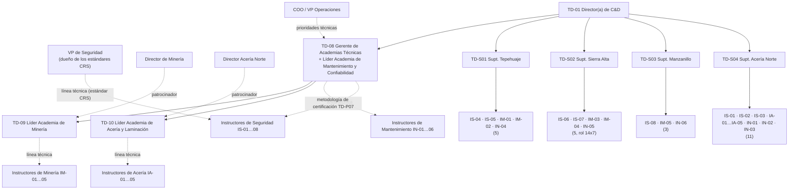

# Academias Técnicas e Instructores de Tiempo Completo — Academia GASM (27 plazas)

> **Alcance.** Este documento describe las 27 plazas de la Gerencia de Academias Técnicas y de los instructores de tiempo completo: **TD-08**, **TD-09**, **TD-10** y los **24 instructores** (TD-IS-01 a 08, TD-IM-01 a 05, TD-IA-01 a 05, TD-IN-01 a 06).
>
> **Documentos base con los que es consistente:** `03-department-design/department-design.md` (estructura de 64 plazas, RACI, foros), `04-processes/process-manual.md` (en especial TD-P01, TD-P07, TD-P10 y TD-P12), `05-programs/program-portfolio.md` (escuelas, rutas y horas del año 3), `08-kpis/kpi-scorecard.md` (metas del año 1), `07-business-case/budget-and-business-case.md` (simuladores y capex) y el índice `00-organigrama-general.md`.
>
> **Convención de códigos de riesgo crítico.** Los 16 Estándares de Riesgo Crítico (CRS) siguen el orden de la lista de TD-P07. El CRS-01 (LOTO) coincide con `templates/critical-task-certification-checklist.md`:
>
> | CRS | Riesgo crítico | NOM / referencia principal | CRS | Riesgo crítico | NOM / referencia principal |
> |---|---|---|---|---|---|
> | 01 | Aislamiento y bloqueo (LOTO) | NOM-004-STPS-1999, NOM-029-STPS-2011 | 09 | Operación de horno de arco eléctrico (EAF) | Estándar GASM + OEM |
> | 02 | Entrada a espacios confinados | NOM-033-STPS-2015 | 10 | Sistemas de gas e hidrógeno | NOM-020-STPS-2011, NFPA 2, ASME B31.12 |
> | 03 | Trabajo en alturas | NOM-009-STPS-2011 | 11 | Trabajo eléctrico | NOM-029-STPS-2011, NFPA 70E |
> | 04 | Cargas suspendidas e izaje (maniobras) | NOM-006-STPS-2014 | 12 | Trabajo en caliente (soldadura y corte) | NOM-027-STPS-2008 |
> | 05 | Operación de grúa viajera | NOM-006-STPS-2014, ASME B30.2 | 13 | Control de terreno (subterránea) | NOM-023-STPS-2012 |
> | 06 | Equipo móvil (camión, cargador, tractor, vehículo ligero en mina) | NOM-023-STPS-2012 | 14 | Sistemas a presión | NOM-020-STPS-2011 |
> | 07 | Manejo de explosivos y voladura | NOM-023-STPS-2012, LFAFE y permiso general SEDENA | 15 | Trabajo en bandas transportadoras | NOM-004-STPS-1999 |
> | 08 | Metal fundido y manejo de ollas | Estándar GASM | 16 | Interacción vehículo–peatón | NOM-023-STPS-2012 + reglamento de tránsito interno |
>
> **Supuestos marcados.** El repositorio no define bandas salariales. Las bandas de este documento (B-xx) son **propuestas para validar con Compensación**. Los simuladores son capex del **año 2** (roadmap: enero 2028, 9 meses). Por eso las metas del año 1 se apoyan en los laboratorios de realidad virtual (VR), en el equipo real y en simuladores rentados a OEM.

---

## 1. Organigrama del área

**Convención:** línea continua = reporte jerárquico. Línea punteada = reporte técnico o funcional (contenido, estándar, calidad de la evaluación). Los instructores dependen **administrativamente** del Superintendente de C&D de su sitio: jornada, vacaciones, evaluación de desempeño, programación y viáticos. Dependen **técnicamente** de su Líder de Academia, o de la VP de Seguridad para los instructores de Seguridad: contenido, estándares de evaluación, calibración y aprobación ante el Consejo de Academia. La evaluación anual de desempeño del instructor la firma el Superintendente con **40% de peso técnico** que aporta la línea punteada.

## 2. Tabla resumen de plazas

| Código | Puesto | Plazas | Sitio base | Reporta a (sólido) | Punteado a | Banda (propuesta) | Tipo de personal | Contratación (fase) |
|---|---|---|---|---|---|---|---|---|
| TD-08 | Gerente de Academias Técnicas (Líder Academia de Mantenimiento y Confiabilidad) | 1 | Acería Norte (Centro de Entrenamiento Técnico) | TD-01 | COO / VP Operaciones | B-G2 Gerencia | Confianza | 1 (meses 3–12) |
| TD-09 | Líder de Academia de Minería | 1 | Tepehuaje (Centro de Entrenamiento Minero) | TD-08 | Director de Minería | B-J1 Jefatura/Especialista sr. | Confianza | 2 (meses 12–24) |
| TD-10 | Líder de Academia de Acería y Laminación | 1 | Acería Norte | TD-08 | Director Acería Norte | B-J1 | Confianza | 2 (meses 12–24) |
| TD-IS-01 a 08 | Instructor(a) de Seguridad y Riesgos Críticos | 8 | Acería 3 · Tepehuaje 2 · Sierra Alta 2 · Manzanillo 1 | Supt. del sitio | VP de Seguridad (+ TD-08 en metodología TD-P07) | B-E2 Especialista | Confianza | 1 (meses 3–12) |
| TD-IM-01 a 05 | Instructor(a) de Minería | 5 | Tepehuaje 2 · Sierra Alta 2 · Manzanillo 1 | Supt. del sitio | TD-09 | B-E2 | Confianza | 2 |
| TD-IA-01 a 05 | Instructor(a) de Acería y Laminación | 5 | Acería Norte 5 | TD-S04 | TD-10 | B-E2 | Confianza | 2 |
| TD-IN-01 a 06 | Instructor(a) de Mantenimiento | 6 | Acería 3 · Tepehuaje 1 · Sierra Alta 1 · Manzanillo 1 | Supt. del sitio | TD-08 | B-E2 | Confianza | 2 |
| | **Total** | **27** | | | | | | |

**Lógica de distribución de los 24 instructores.** Se asignan según la población, el perfil de riesgo y el número de contratistas de cada sitio:

| Sitio | Empleados | Seguridad | Minería | Acería | Mant. | Total | Empleados por instructor | Justificación |
|---|---|---|---|---|---|---|---|---|
| Acería Norte | 3,900 | 3 | – | 5 | 3 | **11** | 355 | 46% de la población operativa. Concentra 7 de los 16 CRS (metal fundido, EAF, grúas, gas/H₂, alturas: la fatalidad del laminador). Tiene los simuladores de grúa y de EAF/colada. |
| Tepehuaje | 1,450 | 2 | 2 | – | 1 | **5** | 290 | Flota de 240 t, voladura. Fatalidad por atropellamiento en el tajo. Tiene los simuladores de camión y de pala. |
| Sierra Alta | 1,100 | 2 | 2 | – | 1 | **5** | 220 | Tajo + subterránea (control de terreno, ventilación, rescate minero). El rol 14x7 exige dos instructores de cada disciplina crítica para cubrir las cuadrillas. |
| Manzanillo | 800 | 1 | 1 | – | 1 | **3** | 267 | Peletizado grate-kiln, bandas, espacios confinados (silos y tolvas), puerto. |
| Centros de servicio y corporativo | 1,250 | – | – | – | – | **0** | – | Riesgo menor (grúas de nave, montacargas, corte). Los atienden de forma itinerante IS-03, IA-04 e IN-06, con las 2 unidades móviles de entrenamiento. |
| **Total** | **8,500** | **8** | **5** | **5** | **6** | **24** | | |

Los sitios mineros tienen menos empleados por instructor porque su riesgo por persona es mayor y porque tienen más contratistas (voladura, servicios mineros).

## 3. Matriz de división del trabajo (R/A/C/I)

R = Responsable (ejecuta) · A = Aprobador/rinde cuentas (uno por fila) · C = Consultado · I = Informado. "IS/IM/IA/IN" se refiere a toda la familia. Las plazas concretas se detallan en las tablas de asignación.

| # | Entregable | Proceso | TD-08 | TD-09 | TD-10 | IS | IM | IA | IN | Supt. sitio | HSE (VP Seg.) |
|---|---|---|---|---|---|---|---|---|---|---|---|
| 1 | Perfiles de competencia de los ~120 roles críticos (45 minería/planta · 45 acería · 30 mantenimiento) | TD-P01 | A | R (minería) | R (acería) | C | C | C | R (mant., con TD-08) | C | C |
| 2 | Actualización de perfil tras un incidente (≤ 15 días) | TD-P01 | A | R | R | R | C | C | C | I | C |
| 3 | Estándar de evaluación y lista de verificación por CRS (16) | TD-P07 | R (metodología) | R (CRS-06, 07, 13) | R (CRS-05, 08, 09, 10) | R (resto) | C | C | C | I | **A** (dueño del control) |
| 4 | Banco de evaluadores certificados y calibración semestral | TD-P07 | A/R | R | R | R | R | R | R | C | C |
| 5 | Evaluación práctica y emisión de la certificación (≤ 15 días tras el OJT, registro ≤ 48 h) | TD-P07 | I | C | C | R | R | R | R | A | C |
| 6 | Rutas de aprendizaje de cada academia (diseño con TD-02) | TD-P04 | A | R | R | C | C | C | R | I | C |
| 7 | Plan anual de cada academia (entrada al DC-2 del sitio) | TD-P02/P03 | A | R | R | C | C | C | C | R (DC-2 del sitio) | C |
| 8 | Impartición en aula, campo, taller y simulador | TD-P05 | I | C | C | R | R | R | R | A | I |
| 9 | Programación y utilización de simuladores (meta ≥ 70% de uso) | TD-P05 | A | R (camión, pala) | R (grúa, EAF/colada) | – | R | R | – | C | I |
| 10 | Alianzas OEM y proveedores técnicos (acuerdos marco) | TD-P12 | A | R | R | C | C | C | R | I | C |
| 11 | Formación de instructores SME (formación de formadores de 40 h, EC0217.01) y observación 2 veces al año | TD-P12 | A | R | R | R | R | R | R | C | I |
| 12 | Planes Legado Experto (captura de conocimiento, mentoría) | TD-P10 | A | R | R | C | R | R | R | C | I |
| 13 | Comunidades de práctica (EAF, confiabilidad, voladura, hidráulica) | TD-P10 | A | R (voladura) | R (EAF) | I | R | R | R (confiab., hidráulica) | I | I |
| 14 | Secretaría técnica de los 3 Consejos de Academia (bimestral) | Foros | A (Mant.) | R (Minería) | R (Acería) | I | C | C | C | I | C |
| 15 | Evaluación N3 de los programas técnicos y estudio ROI anual | TD-P06 | A | R | R | R (N3 CRS) | R | R | R | C | C |
| 16 | Revisión del contenido cada 2 años o tras un cambio | TD-P04 | A | R | R | R | R | R | R | I | C |
| 17 | Firma del instructor en la DC-3 y cierre de registros en el LMS | TD-P09 | I | I | I | R | R | R | R | A | I |
| 18 | Formación de aprendices del modelo dual (horas fuera del portafolio) | Talento | C | C | C | – | C | C | R | A | I |

---

## 4. TD-08 — Gerente de Academias Técnicas (Líder de la Academia de Mantenimiento y Confiabilidad)

### 4.1 Identificación
| Campo | Valor |
|---|---|
| Código | TD-08 |
| Título | Gerente de Academias Técnicas. También es Líder de la Academia de Mantenimiento y Confiabilidad |
| Reporta a (sólido) | TD-01 Director(a) Corporativo(a) de C&D |
| Reporta a (punteado) | COO / VP de Operaciones (prioridades técnicas y confiabilidad) |
| Supervisa a | Directos: TD-09 y TD-10. Línea técnica: 6 instructores de Mantenimiento (TD-IN-01 a 06). Metodología de certificación (TD-P07) para los 24 instructores. ≈ 45 SME de mantenimiento de medio tiempo |
| Ubicación | Complejo Acería Norte, Centro de Entrenamiento Técnico (Salinas Victoria, N.L.). Viaja ≈ 30% a Tepehuaje, Sierra Alta, Manzanillo y al corporativo (San Pedro) |
| Nivel / banda | Gerencia, B-G2 (propuesta) |
| Tipo de personal | Confianza |
| Plazas | 1 |

### 4.2 Propósito del puesto
Construir y operar las tres academias técnicas (Minería, Acería y Laminación, Mantenimiento y Confiabilidad) y el esquema corporativo de **certificación de competencia en tareas críticas (TD-P07)**. El objetivo es que cada rol crítico tenga un perfil validado, una ruta de aprendizaje y una certificación vigente, y que eso se note en seguridad, en la disponibilidad del EAF, en la confiabilidad de los activos y en el tiempo a competencia. Además, lidera directamente la Academia de Mantenimiento y Confiabilidad, para pasar del mantenimiento reactivo al predictivo.

### 4.3 Funciones principales
| # | Función | % tiempo | Proceso |
|---|---|---|---|
| 1 | Dirigir el modelo de las 3 academias: estrategia, catálogo técnico, presidencia operativa de los Consejos de Academia y reporte al Learning Council | 12% | TD-P03 / foros |
| 2 | Gestionar el marco de competencias técnicas: 120 perfiles de roles críticos validados al mes 12, talleres DACUM y alineación con el escalafón del CCT | 12% | TD-P01 |
| 3 | Diseñar y cuidar el esquema de certificación: lista de verificación por CRS con pasos críticos, reglas de evaluador (≤ 12 personas/día/tarea), vigencia ≤ 24 meses, integración LMS–permisos de trabajo, calibración de evaluadores | 14% | TD-P07 |
| 4 | Liderar la Academia de Mantenimiento y Confiabilidad: rutas Fundamentos (80 h), Mecánico, E&I (160 h), Automatización (120 h), Confiabilidad (120 h) y Planeación (40 h) | 14% | TD-P04 / TD-P05 |
| 5 | Dirigir el programa de simuladores y centros de entrenamiento (capex MXN 40 M en simuladores + MXN 60 M Centro Acería + MXN 20 M Centro Minero): especificación, compra o arrendamiento, utilización | 8% | TD-P05 |
| 6 | Gestionar alianzas con OEM y proveedores técnicos: acuerdos marco de 2–3 años, entrenamiento como servicio y consolidación de proveedores técnicos | 8% | TD-P12 |
| 7 | Gestionar la calidad de los instructores técnicos: selección, certificación EC0217.01, formación de evaluadores, observación 2 veces al año, premio *Mejor Instructor* | 8% | TD-P12 |
| 8 | Dirigir el programa *Legado Experto*: mapa de conocimiento en riesgo (41% de técnicos sr. de mantenimiento pueden jubilarse), acuerdos de mentoría, validación | 10% | TD-P10 |
| 9 | Medir el impacto técnico: N3 y N4 (disponibilidad, MTBF, tiempo a competencia) y el estudio ROI del año 1 junto con Analítica | 6% | TD-P06 |
| 10 | Consolidar la DNC técnica de los sitios y definir la entrega corporativa o de sitio, interna o externa | 5% | TD-P02 / TD-P03 |
| 11 | Gestionar el presupuesto de las academias y del equipo (desempeño, desarrollo) | 3% | Gestión |
| | **Total** | **100%** | |

### 4.4 Responsabilidades específicas de esta plaza
- **Rutas propias (Mantenimiento):** Fundamentos (LOTO, NOM-029, trabajo en caliente, mantenimiento de precisión, lubricación, torque, alineación); Mecánico (hidráulica, neumática, reductores, rodamientos, bombas, bandas, soldadura NOM-027/AWS); E&I (media y alta tensión, motores, VFD, arco eléctrico NFPA 70E, calibración); Automatización (PLC de las marcas en sitio, SCADA/HMI, redes industriales, ciberseguridad OT IEC 62443 básica); Confiabilidad (RCM, FMEA, RCA, vibraciones ISO 18436-2 cat. I–II, termografía, análisis de aceite, CMMS); Planeación y programación.
- **Consejos de Academia:** preside operativamente el Consejo de Mantenimiento y Confiabilidad (patrocinador: VP Operaciones/Confiabilidad). Asiste a los de Minería y Acería como garante de la metodología. Todos son bimestrales.
- **Laboratorios:** hidráulica, eléctrico, PLC y taller de soldadura del Centro de Entrenamiento Técnico de Acería Norte (2,400 m²), más las 2 unidades móviles de entrenamiento (año 2–3).
- **OEM y aliados:** fabricantes de PLC y variadores usados en sitio, OEM de EAF y de laminación (con TD-10), OEM de flota (con TD-09), organismo certificador ISO 18436, CONALEP/UT (laboratorios compartidos).
- **Certificación corporativa:** es dueño del **procedimiento** TD-P07. La VP de Seguridad es dueña del **control** de cada CRS (A en la RACI). Firma la liberación de cada lista de verificación CRS antes de su piloto.

### 4.5 Autoridad y decisiones
| Decide solo | Propone / co-decide | No decide |
|---|---|---|
| Asignar instructores técnicos a programas y evaluaciones (junto con el Superintendente) | Contenido de los CRS (con la VP de Seguridad) | Omitir una certificación crítica (nadie puede, política 7) |
| Aprobar a evaluadores internos y suspender a un evaluador tras la calibración | Capex de simuladores y centros (Learning Council) | Plazas adicionales (TD-01 / VP RH) |
| Proveedor técnico dentro del presupuesto aprobado y del acuerdo marco | Alta o baja de rutas en el catálogo (Consejo de Academia) | Cambios al escalafón del CCT (Foro Sindicato–Empresa) |
| Retirar de la impartición a un instructor con L1 < 4.0 dos veces (TD-P12) | Presupuesto anual de academias (TD-01) | |

### 4.6 KPIs (meta del año 1, del scorecard)
| KPI | Meta año 1 | Fuente |
|---|---|---|
| Certificación en tareas críticas | 100% | Scorecard |
| Certificaciones vigentes | 95% | Scorecard |
| Transferencia de conocimiento (expertos en riesgo con plan activo) | 50% (año 2: 90%) | Scorecard (dueño: Academias) |
| Disponibilidad del EAF (contribución vía confiabilidad) | 87% | Scorecard |
| Participación de horas enfocadas en desempeño | 40% | Scorecard |
| Aprobación N2 al primer intento | 80% | Scorecard |
| Aplicación N3 (programas técnicos) | 60% | Scorecard |
| Participación de entrega interna | 50% | Scorecard |
| Costo por hora de capacitación | ≤ MXN 330 | Scorecard |
| Roles críticos con perfil validado | 100% al mes 12 | TD-P01 |
| Mantenimiento planeado (portafolio, horizonte de 3 años) | 55% → 75% | Portafolio |

### 4.7 Interacciones clave
- **Internas:** TD-01 (estrategia, presupuesto); TD-02 y diseñadores (TD-P04); TD-07 (escenarios VR y simuladores); TD-14/TD-16/TD-17 (N3/N4, ROI, tablero); TD-11 (sucesión de roles técnicos, Legado Experto); Superintendentes (asignación de instructores).
- **Negocio:** COO, VP Operaciones/Confiabilidad, gerentes de mantenimiento de los 4 sitios (CMMS, MTBF), VP de Seguridad (CRS).
- **Externas:** OEM, CONOCER (EC0217.01, EC0076), organismos ISO 18436, CONALEP/UT, Compras.

### 4.8 Perfil
| Rubro | Requisito |
|---|---|
| Escolaridad | Ingeniería mecánica, eléctrica, mecatrónica o industrial. Maestría deseable (confiabilidad, administración) |
| Experiencia | 10+ años en operaciones o mantenimiento en minería, siderurgia o industria pesada. 4+ años dirigiendo equipos. Experiencia en programas de confiabilidad o certificación técnica |
| Certificaciones | EC0217.01 (o en proceso, ≤ 6 meses). EC0076 (evaluador) o formación de evaluador de 16 h. ISO 18436-2 cat. II deseable. CMRP deseable |
| Conocimientos técnicos | RCM, FMEA, RCA, CMMS (SAP PM), NOM-004, NOM-029, NOM-027, NOM-020. Diseño de sistemas de certificación de competencias, ISO 10015, ADDIE |
| Competencias | Liderazgo de expertos, pensamiento sistémico, orientación a resultados medibles, negociación con operaciones y sindicato, rigor en seguridad |
| Idiomas | Español nativo. Inglés técnico avanzado (manuales OEM, negociación con proveedores) |

### 4.9 Condiciones de trabajo
- **EPP:** casco, lentes, botas con casquillo y dieléctricas, ropa ignífuga (FR) en la nave de acería, protección auditiva (NOM-011), arnés para visitas en altura (NOM-009). Lámpara, autorrescatador y detector multigás en la mina subterránea.
- **Sitios:** base en Acería Norte, viajes ≈ 30% (mina Sierra Alta en rol de visita, Tepehuaje, Manzanillo).
- **Horario:** administrativo (lunes a viernes). Asiste a paros programados y a turnos nocturnos para observar evaluaciones.

### 4.10 Plan de primeros 90 días
| Periodo | Acciones | Entregable |
|---|---|---|
| Días 1–30 | Recorrer los 4 sitios. Inventariar competencias, perfiles y certificaciones existentes. Revisar los dos incidentes fatales y el 23% de DC-3 faltantes en tareas críticas. Conocer a los gerentes de mantenimiento | Diagnóstico técnico de academias |
| Días 31–60 | Lanzar DACUM de los 30 primeros perfiles (roles de las fatalidades: equipo móvil, alturas). Acordar con la VP de Seguridad la plantilla de 16 CRS. Especificar los simuladores (RFI) | 30 perfiles en borrador. Plantilla CRS aprobada. RFI de simuladores |
| Días 61–90 | Instalar el Consejo de Mantenimiento y Confiabilidad. Definir los perfiles de puesto de TD-09, TD-10 e instructores técnicos (búsqueda en fase 2). Mapear el conocimiento en riesgo de mantenimiento. Definir el programa de formación de evaluadores | Consejo instalado. Mapa Legado Experto v1. Plan de formación de 80 instructores y evaluadores |

---

## 5. TD-09 — Líder de Academia de Minería

### 5.1 Identificación
| Campo | Valor |
|---|---|
| Código | TD-09 |
| Título | Líder de Academia de Minería |
| Reporta a (sólido) | TD-08 Gerente de Academias Técnicas |
| Reporta a (punteado) | Director de Minería (patrocinador de la academia) |
| Supervisa a | Línea técnica: 5 instructores de Minería (TD-IM-01 a 05). ≈ 40 SME mineros de medio tiempo, tutores de OJT |
| Ubicación | Unidad Minera Cerro Tepehuaje, Centro de Entrenamiento Minero (Colima). Viaja ≈ 35% a Sierra Alta (Coahuila) y a Manzanillo |
| Nivel / banda | Jefatura / especialista sénior, B-J1 (propuesta) |
| Tipo de personal | Confianza |
| Plazas | 1 |

### 5.2 Propósito del puesto
Formar y certificar operadores, técnicos y profesionales de mina y de planta de beneficio y peletizado para una extracción segura, productiva y eficiente, en tajo abierto y en subterránea. Es dueño del tiempo a competencia del operador de acarreo, de la eficiencia de combustible de la flota y de la certificación en equipo móvil, voladura y control de terreno.

### 5.3 Funciones principales
| # | Función | % tiempo | Proceso |
|---|---|---|---|
| 1 | Diseñar y mantener las 6 rutas de la Academia de Minería junto con Diseño Instruccional | 14% | TD-P04 |
| 2 | Elaborar y validar ≈ 45 perfiles de roles críticos de mina, beneficio y peletizado, alineados al escalafón | 12% | TD-P01 |
| 3 | Definir las listas de verificación de certificación de CRS-06, CRS-07 y CRS-13 y supervisar la certificación en mina | 14% | TD-P07 |
| 4 | Operar el programa de simuladores de camión de 240 t y de pala o cargador: escenarios, agenda, métricas | 10% | TD-P05 |
| 5 | Coordinar técnicamente a los 5 instructores de minería: calibración, observación, desarrollo | 10% | TD-P12 |
| 6 | Reducir el tiempo a competencia del operador de acarreo (9 → 6 meses): ruta de ingreso, OJT, reconocimiento de saberes (Art. 153-U) | 8% | TD-P08 / TD-P07 |
| 7 | Capturar el conocimiento de voladuristas, geotecnistas y mineros de subterránea (Legado Experto) y dirigir la comunidad de práctica de voladura | 10% | TD-P10 |
| 8 | Llevar la secretaría técnica del Consejo de Academia de Minería (bimestral) | 5% | Foros / TD-P01 |
| 9 | Impartir directamente y dar formación de formadores a SME y tutores de OJT | 7% | TD-P05 / TD-P12 |
| 10 | Gestionar proveedores: OEM de flota, fabricante y distribuidor de explosivos, software de planeación minera | 5% | TD-P12 |
| 11 | Medir N3 y N4 (combustible, daños a equipo, vida de llantas) y el estudio ROI de eficiencia de flota | 5% | TD-P06 |
| | **Total** | **100%** | |

### 5.4 Responsabilidades específicas de esta plaza
- **Rutas:** Operador de equipo móvil pesado (camión 240 t, pala, cargador, tractor, motoconformadora; OJT supervisado de 80–200 h); Perforación y voladura; Operación subterránea (Sierra Alta: control de terreno, amacice, anclaje, ventilación, refugios, escape); Planta de proceso (trituración, molienda, separación magnética, filtrado, peletizado grate-kiln); Planeación minera y geotecnia; Comunidad y medio ambiente.
- **Simuladores (a partir del año 2):** camión de acarreo #1 fijo en Tepehuaje; camión de acarreo #2 en Sierra Alta (en una de las unidades móviles de entrenamiento del sitio); pala/cargador en Tepehuaje. Escenarios obligatorios: interacción con vehículo ligero (CRS-16), falla de frenos, visibilidad reducida, conducción eficiente con el sistema de despacho.
- **Galería de entrenamiento de Sierra Alta:** práctica de amacice, anclaje y refugio con VR previa.
- **Regulatorio:** NOM-023-STPS-2012 (inducción y brigadas mineras). Permiso general SEDENA (Ley Federal de Armas de Fuego y Explosivos): lista del personal autorizado para manejar explosivos, al día con las certificaciones CRS-07.
- **Consejo de Academia de Minería:** Director de Minería (patrocinador), gerentes de mina de Tepehuaje y Sierra Alta, gerente de planta de Manzanillo, SME sénior, HSE.

### 5.5 Autoridad y decisiones
| Decide solo | Propone / co-decide | No decide |
|---|---|---|
| Escenarios y agenda de simuladores | Horas mínimas de OJT por equipo (Consejo de Academia) | Liberar a un operador sin certificación |
| Aprobar tutores de OJT y SME de minería (con el Superintendente) | Listas de verificación de CRS-06, 07 y 13 (con HSE) | Compra de simuladores (TD-08 / Learning Council) |
| Re-evaluar a un operador tras un incidente o una alerta de telemetría | Proveedores de minería (TD-08 + Compras) | Cambios al escalafón |

### 5.6 KPIs (meta del año 1)
| KPI | Meta año 1 | Fuente |
|---|---|---|
| Tiempo a competencia del operador de camión de acarreo | 8 meses (base 9) | Scorecard (dueño: Academia de Minería) |
| Eficiencia de combustible de la flota (L/t-km vs. base 100) | 99 | Scorecard |
| Certificación en tareas críticas (roles de mina) | 100% | Scorecard |
| Certificaciones vigentes | 95% | Scorecard |
| Transferencia de conocimiento (voladura, geotecnia, subterránea) | 50% | Scorecard |
| Aplicación N3 | 60% | Scorecard |
| Incidentes con daño a equipo / vida de llantas (a 3 años) | −25% / +8% | Portafolio |

### 5.7 Interacciones clave
Director de Minería, gerentes de mina y de planta, jefes de despacho y de perforación y voladura, geotecnia, HSE de mina, TD-S01/S02/S03, TD-08, TD-10 (grúas en Manzanillo), IS-04 a IS-07, contratistas de voladura (REPSE), OEM de flota, SEDENA (a través del responsable del permiso general).

### 5.8 Perfil
| Rubro | Requisito |
|---|---|
| Escolaridad | Ingeniería de minas y metalurgia, geología o afín |
| Experiencia | 8+ años en operación de mina de tajo abierto. Deseable experiencia subterránea. 3+ años como jefe de turno o de área. Experiencia en capacitación de operadores |
| Certificaciones | EC0217.01. EC0076 o formación de evaluador. Voladurista con registro vigente en el permiso SEDENA (deseable). Instructor OEM de equipo móvil (deseable) |
| Conocimientos técnicos | NOM-023, diseño de voladura, sistemas de despacho, telemetría de flota, control de terreno, ventilación, conminución y peletizado |
| Competencias | Liderazgo en campo, credibilidad con operadores sindicalizados, análisis de datos operativos, enseñanza práctica |
| Idiomas | Español. Inglés técnico intermedio (manuales OEM) |

### 5.9 Condiciones de trabajo
- **EPP:** casco con lámpara, lentes, botas mineras, chaleco reflejante, protección auditiva, respirador para polvo. En subterránea: autorrescatador, detector multigás y tarjeta de control de acceso.
- **Sitios:** Tepehuaje (base). Sierra Alta: estancias de 1–2 semanas alineadas al rol **14x7**. Manzanillo mensual.
- **Horario:** mixto. Cubre los 4 turnos de 12 h para observar evaluaciones y OJT, incluido el nocturno.

### 5.10 Plan de primeros 90 días
| Periodo | Acciones | Entregable |
|---|---|---|
| Días 1–30 | Revisar el caso de la fatalidad por atropellamiento en Tepehuaje. Diagnosticar el tiempo a competencia (9 meses). Auditar las certificaciones vigentes en equipo móvil y voladura. Conocer a los 5 instructores | Línea base de minería |
| Días 31–60 | Cerrar los perfiles de minería pendientes. Validar las listas de verificación de CRS-06, 07 y 13 con HSE. Rediseñar la ruta del operador de acarreo (aula 16 h + simulador 24 h + OJT 120 h) | Ruta rediseñada. 3 listas de verificación piloteadas |
| Días 61–90 | Instalar el Consejo de Minería. Preparar la puesta en marcha de los simuladores (escenarios, agenda). Mapear el conocimiento en riesgo en voladura y subterránea | Consejo instalado. Plan de simuladores. 10 planes Legado Experto |

---

## 6. TD-10 — Líder de Academia de Acería y Laminación

### 6.1 Identificación
| Campo | Valor |
|---|---|
| Código | TD-10 |
| Título | Líder de Academia de Acería y Laminación |
| Reporta a (sólido) | TD-08 Gerente de Academias Técnicas |
| Reporta a (punteado) | Director de Acería Norte (patrocinador) |
| Supervisa a | Línea técnica: 5 instructores de Acería y Laminación (TD-IA-01 a 05). ≈ 45 SME de acería de medio tiempo |
| Ubicación | Complejo Acería Norte (Salinas Victoria, N.L.). Viaja ≈ 10% a los centros de servicio (grúas, calidad) |
| Nivel / banda | Jefatura / especialista sénior, B-J1 (propuesta) |
| Tipo de personal | Confianza |
| Plazas | 1 |

### 6.2 Propósito del puesto
Formar y certificar al personal de DRI, EAF y horno olla, colada continua, laminación en caliente, grúas y calidad para operar con seguridad y a nivel de clase mundial. Es dueño de la contribución de la capacitación a la disponibilidad del EAF (86% → 89%), al rendimiento metálico y a la calidad automotriz (IATF 16949).

### 6.3 Funciones principales
| # | Función | % tiempo | Proceso |
|---|---|---|---|
| 1 | Diseñar y mantener las 7 rutas: DRI, EAF/LF, colada, laminación, grúas y ollas, calidad IATF, chatarra | 14% | TD-P04 |
| 2 | Elaborar y validar ≈ 45 perfiles de roles críticos de acería y laminación | 12% | TD-P01 |
| 3 | Definir las listas de verificación y supervisar la certificación de CRS-05, 08, 09 y 10 | 14% | TD-P07 |
| 4 | Operar el simulador de proceso EAF/colada y los 2 simuladores de grúa viajera | 10% | TD-P05 |
| 5 | Coordinar técnicamente a los 5 instructores de acería | 10% | TD-P12 |
| 6 | Legado Experto del EAF, colada y laminación, y comunidad de práctica EAF | 10% | TD-P10 |
| 7 | Programa de disponibilidad del EAF: N3/N4 con Confiabilidad y Operación, y estudio ROI | 7% | TD-P06 |
| 8 | Secretaría técnica del Consejo de Academia de Acería | 5% | Foros / TD-P01 |
| 9 | Competencias IATF 16949 (core tools, 8D, auditor interno) con Calidad | 5% | TD-P01 / TD-P04 |
| 10 | Impartición directa y formación de formadores | 6% | TD-P05 / TD-P12 |
| 11 | Proveedores: OEM de EAF y laminación, refractarios, IATF | 4% | TD-P12 |
| 12 | Contenidos de hidrógeno y descarbonización (Green Steel) con la Escuela Digital | 3% | TD-P04 |
| | **Total** | **100%** | |

### 6.4 Responsabilidades específicas de esta plaza
- **Rutas:** DRI (reformador y reactor, gas, **seguridad del hidrógeno**); EAF y horno olla (carga, mezcla de chatarra, perfil de potencia, escoria espumosa, refractarios, emergencias con metal líquido: perforaciones y explosiones por agua); Colada continua (tundish, molde, enfriamiento secundario, prevención de perforaciones); Laminación en caliente (horno de recalentamiento, laminado, enfriamiento, bobinado, taller de rodillos); Grúas y ollas (NOM-006, maniobras, señalización); Calidad IATF 16949; Chatarra (clasificación, detección de radiación).
- **Simuladores (a partir del año 2):** 1 simulador de proceso EAF/colada y 2 simuladores de grúa viajera en el Centro de Entrenamiento Técnico. VR de emergencias con metal fundido en el laboratorio de riesgos críticos.
- **Consejo de Academia de Acería:** Director de Acería Norte (patrocinador), gerentes de DRI, acería, colada y laminación, Calidad, SME sénior, HSE.
- **OEM:** fabricante del EAF y de la colada, proveedores de refractarios y electrodos, proveedor del simulador de grúa.

### 6.5 Autoridad y decisiones
| Decide solo | Propone / co-decide | No decide |
|---|---|---|
| Escenarios de simulador EAF y grúa. Horas mínimas de simulador por rol | Listas de verificación de CRS-05, 08, 09 y 10 (con HSE) | Liberar a un operador sin certificación |
| Re-evaluar a un operador tras un incidente o una no conformidad de calidad | Ruta IATF (con el Gerente de Calidad) | Compras fuera del acuerdo marco |
| Aprobar SME y tutores de OJT de acería | Proveedores OEM (TD-08 + Compras) | Cambios al escalafón |

### 6.6 KPIs (meta del año 1)
| KPI | Meta año 1 | Fuente |
|---|---|---|
| Disponibilidad del EAF | 87% | Scorecard |
| Certificación en tareas críticas (acería) | 100% | Scorecard |
| Certificaciones vigentes | 95% | Scorecard |
| Transferencia de conocimiento (expertos EAF) | 50% | Scorecard |
| Aplicación N3 | 60% | Scorecard |
| Incidentes con grúas / reclamaciones de clientes (a 3 años) | −30% / −20% | Portafolio |
| Rendimiento metálico (a 3 años) | +0.1 pp | Portafolio |

### 6.7 Interacciones clave
Director de Acería Norte, gerentes de DRI, acería, colada y laminación, Calidad (IATF), Confiabilidad, HSE de acería, TD-S04, TD-S05 (centros de servicio), TD-08, TD-02/TD-07 (VR), IS-01 a IS-03, OEM.

### 6.8 Perfil
| Rubro | Requisito |
|---|---|
| Escolaridad | Ingeniería metalúrgica, química o de materiales. Maestría en metalurgia deseable |
| Experiencia | 8+ años en acería eléctrica (EAF, LF, colada) o laminación. 3+ años como jefe de turno o de área |
| Certificaciones | EC0217.01. EC0076 o formación de evaluador. Auditor interno IATF 16949 (deseable) |
| Conocimientos técnicos | Metalurgia secundaria, refractarios, DRI y seguridad del hidrógeno, NOM-006, NOM-020, core tools IATF |
| Competencias | Liderazgo técnico, gestión del cambio con operadores sénior, análisis de datos MES, pedagogía práctica |
| Idiomas | Español. Inglés técnico avanzado (OEM) |

### 6.9 Condiciones de trabajo
- **EPP:** ropa aluminizada o FR en la plataforma del EAF, careta con filtro, casco, polainas, protección auditiva, respirador. Calor radiante: aplica el protocolo de estrés térmico (NOM-015).
- **Sitio:** Acería Norte. Visitas a los centros de servicio (Monterrey, Querétaro, Silao).
- **Horario:** administrativo con presencia en los turnos 4x4 de 12 h para evaluaciones y simulacros.

### 6.10 Plan de primeros 90 días
| Periodo | Acciones | Entregable |
|---|---|---|
| Días 1–30 | Revisar la fatalidad por caída en el laminador. Analizar la línea base del EAF (86%) y las causas humanas de paros. Inventariar el conocimiento en riesgo del EAF | Línea base de acería |
| Días 31–60 | Validar las listas de verificación de CRS-05, 08, 09 y 10 con HSE. Especificar los escenarios de los simuladores de grúa y EAF. Diseñar la ruta de grúas y ollas | 4 listas de verificación piloteadas. Especificación de escenarios |
| Días 61–90 | Instalar el Consejo de Acería. Lanzar la comunidad de práctica EAF. Arrancar 10 planes Legado Experto. Diseñar el programa N4 de disponibilidad con Confiabilidad | Consejo instalado. Plan N4 del EAF |

---

## 7. Instructores de tiempo completo — plantilla genérica por familia

Elementos comunes a las 4 familias:
- **Reporte sólido:** Superintendente de C&D del sitio asignado (TD-S01 a S04). **Punteado:** Líder de Academia, o VP de Seguridad para la familia IS (ver §1).
- **Tipo:** confianza. Si viene de un puesto sindicalizado, el cambio de categoría se hace conforme al CCT y queda documentado ante el Foro Sindicato–Empresa. **Banda B-E2 (propuesta).**
- **Carga:** 1,100–1,300 h frente a grupo por año en estado estable, sobre ≈ 2,200 h disponibles (55%). Incluye aula, campo, taller, simulador, coaching de OJT y evaluación práctica. El 45% restante cubre preparación, registros, actualización de contenido, captura de conocimiento, desarrollo de SME y desarrollo propio.
- **Requisitos comunes:** competencia **Nivel 4 (Experto/Instructor)** en su especialidad; **EC0217.01** (o en proceso, ≤ 6 meses); **formación de formadores (40 h)**; **formación de evaluador (16 h)** y, de preferencia, **EC0076**; aprobación del Consejo de Academia o de HSE; historial de seguridad limpio.
- **Reglas TD-P07 que aplican a todos:** máximo **12 personas por día por tarea** como evaluador; evaluación ≤ **15 días** tras completar el OJT; registro en el LMS ≤ **48 h**; firma de DC-3 para que se emita en ≤ 10 días hábiles; nunca evaluar a quien el instructor capacitó en el mismo ciclo sin un segundo evaluador (buena práctica de imparcialidad).
- **KPIs comunes (año 1):** calificación del instructor ≥ 4.5/5 (TD-P12) y L1 del curso ≥ 4.2; aprobación N2 al primer intento ≥ 80%; asistencia ≥ 95%; registros en ≤ 48 h (100%); horas frente a grupo vs. meta (≥ 90%); 2 observaciones al año con resultado satisfactorio.
- **Año de ingreso:** los 8 IS entran en la fase 1 (meses 3–12) y los 16 técnicos en la fase 2 (meses 12–24). En su primer año la meta es ≈ 800–900 h, porque dedican tiempo a certificarse (EC0217.01, evaluador, OEM) y a construir los contenidos.

### 7.1 Familia Seguridad y Riesgos Críticos (TD-IS-01 a 08)

**Propósito.** Hacer que cada empleado y contratista conozca los controles de los riesgos críticos, y que solo personas certificadas realicen tareas críticas. Es el núcleo de *Cero Fatalidades* (Escuela de Seguridad, programas S-01, S-02, S-03, S-05 y S-08).

**Funciones principales**
| # | Función | % | Proceso |
|---|---|---|---|
| 1 | Impartir S-01 (inducción corporativa 8 h), S-02 (inducción de sitio NOM-023 8–16 h) y módulos S-03 CRS (4–24 h) | 32% | TD-P05 |
| 2 | Evaluación práctica y certificación CRS en condiciones reales o con VR | 14% | TD-P07 |
| 3 | Inducción de contratistas (4 h general + 2 h de sitio) y S-08 para supervisores de contratistas | 6% | TD-P08 |
| 4 | Apoyar simulacros y brigadas (S-05) con el Coordinador de Emergencias | 3% | TD-P05 |
| 5 | Preparar prácticas, escenarios VR y equipos (arneses, detectores, candados) | 10% | TD-P05 |
| 6 | Acompañar la Verificación de Controles Críticos (VCC) y convertir los hallazgos en reentrenamiento | 6% | TD-P07 |
| 7 | Actualizar contenidos tras incidentes (≤ 15 días) y cada 2 años | 8% | TD-P01 / TD-P04 |
| 8 | Registros en el LMS, bitácoras y firma de DC-3 | 5% | TD-P05 / TD-P09 |
| 9 | Desarrollar y observar a SME y supervisores-evaluadores | 6% | TD-P12 |
| 10 | Seguimiento N3 de programas CRS (lista de verificación a 60–90 días) | 5% | TD-P06 |
| 11 | Desarrollo propio (recertificaciones, benchmarking) | 5% | TD-P12 |
| | **Total** (frente a grupo = 1+2+3+4 = 55%) | **100%** | |

**Responsabilidades específicas.** Cada IS es **referente corporativo** (responsable pedagógico) de 1–2 CRS: mantiene la lista de verificación, el banco de preguntas y el escenario VR, y calibra a los demás evaluadores. El dueño del control sigue siendo HSE. Los CRS operativos (05, 06, 07, 08, 09, 10, 13) se imparten **en pareja** con el instructor técnico, que es referente de esos CRS.

**Autoridad.** Declarar "aún no competente" y bloquear la certificación. Suspender una práctica insegura. Proponer una re-evaluación tras un hallazgo de VCC. No puede exentar requisitos.

**Perfil.** Ingeniería o técnico superior en seguridad industrial o afín. 5+ años en seguridad operativa en minería o siderurgia. Certificaciones: EC0217.01, formación de evaluador y EC0076; instructor de trabajo en alturas (NOM-009) y de espacios confinados (NOM-033); primeros auxilios / BLS (instructor); NFPA 70E para quien imparte CRS-11. Conocimiento de NOM-004, 006, 009, 017, 020, 023, 027, 029 y 033; ICAM. Competencias: comunicación clara con operadores de baja escolaridad, firmeza, empatía, trabajo en campo. Idiomas: español. Inglés técnico básico.

**Condiciones.** EPP completo del área que atiende (FR/aluminizado en acería, equipo minero, arnés y línea de vida). Horario mixto para cubrir los 4 turnos 4x4. En Sierra Alta, rol 14x7. Trabajo en altura, espacios confinados y cerca de metal fundido durante las prácticas.

**90 días.** D1–30: certificarse en los CRS que impartirá; observar las inducciones actuales; conocer el mapa de riesgos del sitio. D31–60: pilotear los módulos CRS de los que es referente (≥ 8 participantes); formación de evaluador. D61–90: impartir a carga plena; certificar al primer grupo; primer reporte de hallazgos VCC → reentrenamiento.

**Tabla de asignación individual — Seguridad**
| Plaza | Sitio (reporta a) | Especialidad / CRS que imparte (★ = referente corporativo) | Simuladores / medios | Certificaciones requeridas (además de las comunes) | Horas/año (estable) |
|---|---|---|---|---|---|
| TD-IS-01 | Acería Norte (TD-S04) | ★CRS-01 LOTO, ★CRS-11 eléctrico (NOM-029, arco eléctrico), CRS-14 presión; LOTO para mantenimiento de EAF y laminación | VR LOTO; tableros didácticos de aislamiento; laboratorio eléctrico | NFPA 70E (instructor), NOM-029 | 1,250 |
| TD-IS-02 | Acería Norte (TD-S04) | ★CRS-03 alturas (caso de la fatalidad en el laminador), CRS-02 espacios confinados, rescate en alturas y espacios confinados (S-05) | VR alturas y espacios confinados; torre de prácticas | Instructor NOM-009 y NOM-033; rescate técnico | 1,250 |
| TD-IS-03 | Acería Norte (TD-S04), itinerante a centros de servicio | ★CRS-04 izaje (con IA-04), ★CRS-12 trabajo en caliente (NOM-027); CRS-08 y CRS-10 (lado HSE, con IA-03 e IA-01); inducción de contratistas de Acería; S-01/S-02 en Monterrey, Querétaro y Silao | VR metal fundido; unidad móvil | Maniobrista / rigger certificado; NOM-006, NOM-027 | 1,100 |
| TD-IS-04 | Tepehuaje (TD-S01) | ★CRS-16 vehículo–peatón (caso de la fatalidad en el tajo), CRS-06 (lado HSE, con IM-01); inducción NOM-023 de mina | Co-uso del simulador de camión 240 t (escenarios con peatones y vehículos ligeros); VR | Instructor de manejo defensivo; NOM-023 | 1,250 |
| TD-IS-05 | Tepehuaje (TD-S01) | ★CRS-15 bandas; CRS-07 (lado HSE, con IM-02); CRS-01 y CRS-03 en mina; inducción de contratistas mineros y S-08 | VR bandas; banco didáctico de guardas | NOM-004, NOM-023 | 1,200 |
| TD-IS-06 | Sierra Alta (TD-S02), rol 14x7 | CRS-13 (lado HSE, con IM-03), CRS-02 (atmósferas y ventilación subterránea); brigada de **rescate minero** (S-05, NOM-023); refugios y escape | Galería de entrenamiento; VR subterránea; equipos de respiración autónoma | Instructor de rescate minero; detección de gases | 1,150 |
| TD-IS-07 | Sierra Alta (TD-S02), rol 14x7 (turno opuesto a IS-06) | CRS-06 y CRS-16 en tajo; CRS-07 (lado HSE); CRS-01, CRS-11; inducción de contratistas | Co-uso del simulador de camión #2; VR | Manejo defensivo; NFPA 70E básico | 1,150 |
| TD-IS-08 | Manzanillo (TD-S03) | ★CRS-02 espacios confinados (silos, tolvas, horno grate-kiln), ★CRS-14 presión (aire comprimido, calderas NOM-020); CRS-15, CRS-01, CRS-03, CRS-12, CRS-04 (maniobras en puerto) | VR espacios confinados; detectores multigás | Instructor NOM-033; NOM-020 | 1,250 |
| | **Subtotal Seguridad** | | | | **9,600** |

### 7.2 Familia Minería (TD-IM-01 a 05)

**Propósito.** Formar, acompañar en OJT y certificar a operadores de equipo móvil, perforistas, voladuristas, mineros de subterránea y operadores de planta de beneficio y peletizado.

**Funciones principales**
| # | Función | % | Proceso |
|---|---|---|---|
| 1 | Impartir en aula y en campo (rutas de la Academia de Minería) | 22% | TD-P05 |
| 2 | Sesiones de simulador (camión 240 t, pala o cargador) | 17% | TD-P05 |
| 3 | Evaluación práctica y certificación (CRS-06, 07, 13, 15 en planta) | 10% | TD-P07 |
| 4 | Coaching de OJT en campo y firma de bitácoras | 6% | TD-P07 |
| 5 | Preparar y mantener escenarios de simulador y prácticas de campo | 8% | TD-P05 |
| 6 | Bitácoras de OJT, registros en el LMS y DC-3 | 6% | TD-P05 / TD-P09 |
| 7 | Captura de conocimiento (video SOP, guías) y comunidad de práctica de voladura | 10% | TD-P10 |
| 8 | Formación y observación de tutores de OJT y SME | 8% | TD-P12 |
| 9 | Analizar telemetría y despacho (desempeño de operadores) y dar retroalimentación | 6% | TD-P06 |
| 10 | Desarrollo propio | 7% | TD-P12 |
| | **Total** (frente a grupo = 1+2+3+4 = 55%) | **100%** | |

**Autoridad.** Aprobar o no la competencia en simulador y en campo. Recomendar horas extra de OJT. Suspender la operación de un aprendiz en situación insegura.

**Perfil.** Técnico superior o ingeniería en minas, o ex operador o supervisor con carrera técnica. 7+ años en su especialidad, 2+ como líder o tutor. Certificaciones: EC0217.01, evaluador (EC0076), certificación OEM de instructor de operación (equipo móvil), voladurista en el permiso SEDENA (IM-02, IM-04), NOM-023. Conocimientos: despacho, telemetría, voladura, control de terreno o proceso según la plaza. Competencias: paciencia pedagógica, lectura de riesgos en campo, uso de datos. Idiomas: español.

**Condiciones.** EPP minero completo. En subterránea: autorrescatador, lámpara, multigás. Campo abierto con calor (NOM-015) y polvo. Tepehuaje y Manzanillo: horario mixto para los 4 turnos. **Sierra Alta: rol 14x7** con relevo cruzado IM-03 / IM-04.

**90 días.** D1–30: certificación OEM de instructor y de evaluador; auditar las bitácoras de OJT vigentes. D31–60: pilotear la ruta rediseñada; construir escenarios (con los simuladores en operación a partir del año 2, o con equipo real mientras tanto). D61–90: carga plena; primer grupo certificado; reporte de telemetría pre/post.

**Tabla de asignación individual — Minería**
| Plaza | Sitio (reporta a) | Especialidad / rutas / CRS (★ = referente corporativo) | Simuladores que opera | Certificaciones requeridas | Horas/año |
|---|---|---|---|---|---|
| TD-IM-01 | Tepehuaje (TD-S01) | Operador de equipo móvil pesado: camión 240 t, pala, cargador, tractor; ★CRS-06; conducción eficiente con despacho; pieza clave del KPI de tiempo a competencia | Simulador de camión #1 y simulador de pala/cargador | Instructor OEM de la flota de 240 t; EC0217.01; EC0076 | 1,250 |
| TD-IM-02 | Tepehuaje (TD-S01) | Perforación y voladura; ★CRS-07 (manejo, almacenamiento en polvorín, fallas de voladura); planta de beneficio (trituración, separación magnética) | VR de voladura; software de diseño de voladura | Voladurista registrado en el permiso general SEDENA; certificación del fabricante de explosivos; EC0217.01 | 1,150 |
| TD-IM-03 | Sierra Alta (TD-S02), rol 14x7 | Operación subterránea: ★CRS-13 control de terreno, amacice, anclaje, ventilación, refugios; equipos LHD y jumbo (OJT) | Galería de entrenamiento; VR subterránea | Minero subterráneo Nivel 4; rescate minero; EC0217.01; EC0076 | 1,150 |
| TD-IM-04 | Sierra Alta (TD-S02), rol 14x7 (relevo de IM-03) | Tajo de Sierra Alta: equipo móvil (CRS-06), perforación y voladura (CRS-07); concentradora | Simulador de camión #2 (Sierra Alta) | Instructor OEM de flota; voladurista SEDENA; EC0217.01 | 1,150 |
| TD-IM-05 | Manzanillo (TD-S03) | Planta de proceso: filtrado, peletizado grate-kiln, cuarto de control, muestreo, recepción de pulpa por mineroducto; CRS-15 (proceso) con IS-08 | Simulador de proceso de peletizado (licencia de software) | Operador de cuarto de control Nivel 4; EC0217.01; EC0076 | 1,200 |
| | **Subtotal Minería** | | | | **5,900** |

### 7.3 Familia Acería y Laminación (TD-IA-01 a 05)

**Propósito.** Formar y certificar a los operadores de DRI, EAF/LF, colada, laminación y grúas para operar con seguridad y estabilidad, y así contribuir a la disponibilidad del EAF, al rendimiento y a la calidad.

**Funciones principales**
| # | Función | % | Proceso |
|---|---|---|---|
| 1 | Impartir en aula y en planta (rutas de la Academia de Acería) | 22% | TD-P05 |
| 2 | Sesiones de simulador (EAF/colada, grúa viajera) y VR de emergencias | 15% | TD-P05 |
| 3 | Evaluación práctica y certificación (CRS-05, 08, 09, 10) | 10% | TD-P07 |
| 4 | Coaching de OJT y firma de bitácoras | 8% | TD-P07 |
| 5 | Preparar escenarios de simulador y SOP digitales | 7% | TD-P04 / TD-P05 |
| 6 | Registros en el LMS y DC-3 | 5% | TD-P05 / TD-P09 |
| 7 | Legado Experto: video SOP, guías de solución de fallas, comunidad de práctica EAF | 10% | TD-P10 |
| 8 | Formación y observación de SME y tutores | 8% | TD-P12 |
| 9 | Analizar datos del MES, paros y no conformidades → necesidades de capacitación | 8% | TD-P06 / TD-P02 |
| 10 | Desarrollo propio | 7% | TD-P12 |
| | **Total** (frente a grupo = 1+2+3+4 = 55%) | **100%** | |

**Autoridad.** Aprobar o no la competencia. Detener una práctica insegura. Solicitar una re-evaluación tras un incidente de proceso o de grúa.

**Perfil.** Técnico superior o ingeniería metalúrgica, química o mecánica, o ex operador sénior. 7+ años en el área. Certificaciones: EC0217.01, EC0076, certificación OEM del simulador o del proceso, NOM-006 (IA-04). Conocimientos del proceso de su plaza, seguridad con metal fundido y gases. Competencias: credibilidad técnica, comunicación con cuadrillas, calma en emergencias. Idiomas: español. Inglés técnico básico a intermedio.

**Condiciones.** Calor radiante, ruido, metal líquido, gases (CO, H₂). EPP aluminizado o FR, protección auditiva, detector de CO. Horario mixto para cubrir los turnos 4x4 de 12 h.

**90 días.** D1–30: certificación OEM de simulador, evaluador, NOM-006. D31–60: construir y pilotear escenarios (perforación de colada, explosión por agua, falla de freno de grúa). D61–90: carga plena y primer grupo certificado.

**Tabla de asignación individual — Acería y Laminación** (todas en Acería Norte, reportan a TD-S04)
| Plaza | Especialidad / rutas / CRS (★ = referente corporativo) | Simuladores que opera | Certificaciones requeridas | Horas/año |
|---|---|---|---|---|
| TD-IA-01 | Planta DRI (reformador, reactor preparado para hidrógeno); ★CRS-10 gas e hidrógeno; contenidos Green Steel sobre H₂ | Simulador de proceso DRI (licencia OEM); VR de fugas | Seguridad del hidrógeno (NFPA 2); NOM-020; EC0217.01; EC0076 | 1,150 |
| TD-IA-02 | EAF y horno olla: carga, perfil de potencia, escoria espumosa, refractarios; ★CRS-09 operación de EAF | **Simulador de proceso EAF/colada**; VR de emergencias | Certificación OEM del EAF; EC0217.01; EC0076 | 1,200 |
| TD-IA-03 | Colada continua y metalurgia secundaria; ★CRS-08 metal fundido y ollas (perforación, explosión por agua, tundish) | Simulador EAF/colada (módulo de colada); VR metal fundido | Operador de colada Nivel 4; EC0217.01; EC0076 | 1,200 |
| TD-IA-04 | Grúas viajeras y manejo de ollas; ★CRS-05 grúa viajera; CRS-04 con IS-03; itinerante a centros de servicio (grúas de bobinas) y Manzanillo | **2 simuladores de grúa viajera** | Operador e instructor de grúa (ASME B30.2, NOM-006); certificación OEM del simulador; EC0217.01 | 1,250 |
| TD-IA-05 | Laminación en caliente (tira y largos), taller de rodillos, control dimensional; calidad IATF (core tools, 8D); chatarra y radiación | SOP digitales; app de reconocimiento de chatarra | Auditor interno IATF 16949; EC0217.01 | 1,200 |
| | **Subtotal Acería** | | | **6,000** |

### 7.4 Familia Mantenimiento (TD-IN-01 a 06)

**Propósito.** Formar técnicos de mantenimiento que el mercado no ofrece, certificar las tareas críticas de mantenimiento (LOTO, eléctrico, trabajo en caliente) y acelerar el paso al mantenimiento predictivo.

**Funciones principales**
| # | Función | % | Proceso |
|---|---|---|---|
| 1 | Taller y laboratorio (hidráulica, eléctrico, PLC, soldadura, predictivo) | 25% | TD-P05 |
| 2 | Aula (teoría en bloques ≤ 2 h) | 10% | TD-P05 |
| 3 | Evaluación práctica y certificación (CRS-01, 11, 12, 14 en mantenimiento) | 8% | TD-P07 |
| 4 | Formación de aprendices del modelo dual y de técnicos de contratistas | 12% | Talento / TD-P08 |
| 5 | Preparar laboratorios, bancos didácticos y equipos | 8% | TD-P05 |
| 6 | Registros en el LMS y DC-3 | 5% | TD-P05 / TD-P09 |
| 7 | Legado Experto: video SOP, historial de fallas vinculado al CMMS, comunidades de práctica de confiabilidad e hidráulica | 12% | TD-P10 |
| 8 | Formación de SME y tutores de aprendices | 7% | TD-P12 |
| 9 | Análisis de CMMS y RCA → necesidades de capacitación y N3 | 6% | TD-P06 |
| 10 | Desarrollo propio (tecnología cambiante: PLC, predictivo) | 7% | TD-P12 |
| | **Total** (frente a grupo = 1+2+3+4 = 55%) | **100%** | |

**Autoridad.** Aprobar o no la competencia. Bloquear el acceso a un laboratorio energizado a quien no cumpla LOTO. Proponer contenidos a TD-08.

**Perfil.** Ingeniería o técnico superior en mecánica, electricidad, mecatrónica o automatización. 7+ años en mantenimiento industrial. Certificaciones: EC0217.01, EC0076 y las de especialidad de la tabla (ISO 18436, OEM de PLC, AWS, NFPA 70E). Competencias: diagnóstico, enseñanza práctica, aprendizaje continuo. Idiomas: español. Inglés técnico intermedio.

**Condiciones.** Laboratorios y planta, equipos energizados, soldadura. EPP dieléctrico, careta, FR. Horario administrativo con sesiones por turno. Sierra Alta en rol 14x7.

**90 días.** D1–30: certificaciones de especialidad; inventario de bancos y laboratorios. D31–60: pilotear el módulo Fundamentos (80 h); cohorte de aprendices. D61–90: carga plena; 3 activos de conocimiento capturados por instructor.

**Tabla de asignación individual — Mantenimiento**
| Plaza | Sitio (reporta a) | Especialidad / rutas / CRS | Simuladores / laboratorios | Certificaciones requeridas | Horas/año |
|---|---|---|---|---|---|
| TD-IN-01 | Acería Norte (TD-S04) | Mecánico especialista: hidráulica, neumática, reductores, rodamientos, bombas; soldadura; CRS-12 en mantenimiento | Laboratorio de hidráulica y neumática; taller de soldadura | AWS CWI (deseable) o soldador calificado AWS D1.1; NOM-027; EC0217.01 | 1,250 |
| TD-IN-02 | Acería Norte (TD-S04) | Eléctrico e instrumentación: media y alta tensión, motores, VFD, arco eléctrico, calibración; CRS-11 y CRS-01 en mantenimiento (con IS-01) | Laboratorio eléctrico; tableros de VFD | NFPA 70E; NOM-029; EC0217.01; EC0076 | 1,200 |
| TD-IN-03 | Acería Norte (TD-S04) | Automatización: PLC (marcas en sitio), SCADA/HMI, redes, ciberseguridad OT básica (IEC 62443) | Laboratorio de PLC; gemelo digital de línea | Certificación del fabricante de PLC; IEC 62443 (fundamentos); EC0217.01 | 1,150 |
| TD-IN-04 | Tepehuaje (TD-S01) | Mecánico y eléctrico de equipo móvil pesado y planta: hidráulica pesada, bandas (CRS-15 en mantenimiento), cambio de llantas | Banco hidráulico del Centro Minero; unidad móvil | Certificación OEM de flota (mantenimiento); EC0217.01 | 1,200 |
| TD-IN-05 | Sierra Alta (TD-S02), rol 14x7 | Mantenimiento de mina subterránea: LHD, jumbos, ventilación, bombeo; LOTO en subterránea | Galería de entrenamiento; banco hidráulico | Certificación OEM de equipo subterráneo; NOM-023; EC0217.01 | 1,150 |
| TD-IN-06 | Manzanillo (TD-S03), itinerante 25% | Confiabilidad y predictivo: vibraciones, termografía, lubricación, RCA; referente corporativo de la ruta de Confiabilidad; mantenimiento de grate-kiln y bandas | Banco de vibraciones; cámara termográfica; unidad móvil | **ISO 18436-2 cat. III** (para enseñar cat. I–II); termografía nivel II; ICML MLA II; EC0217.01 | 1,100 |
| | **Subtotal Mantenimiento** | | | | **7,050** |

### 7.5 Cobertura de los 16 CRS (referente corporativo y quién imparte)
| CRS | Referente | Imparten / evalúan | CRS | Referente | Imparten / evalúan |
|---|---|---|---|---|---|
| 01 LOTO | IS-01 | IS-01, IS-05, IS-07, IS-08, IN-02 | 09 EAF | IA-02 | IA-02 |
| 02 Espacios confinados | IS-08 | IS-02, IS-06, IS-08 | 10 Gas/H₂ | IA-01 | IA-01, IS-03 |
| 03 Alturas | IS-02 | IS-02, IS-05, IS-08 | 11 Eléctrico | IS-01 | IS-01, IS-07, IN-02 |
| 04 Izaje | IS-03 | IS-03, IA-04, IS-08 | 12 Trabajo en caliente | IS-03 | IS-03, IS-08, IN-01 |
| 05 Grúa viajera | IA-04 | IA-04 | 13 Control de terreno | IM-03 | IM-03, IS-06 |
| 06 Equipo móvil | IM-01 | IM-01, IM-04, IS-04, IS-07 | 14 Presión | IS-08 | IS-01, IS-08 |
| 07 Explosivos | IM-02 | IM-02, IM-04, IS-05, IS-07 | 15 Bandas | IS-05 | IS-05, IS-08, IM-05, IN-04 |
| 08 Metal fundido | IA-03 | IA-03, IA-02, IS-03 | 16 Vehículo–peatón | IS-04 | IS-04, IS-07, IM-01 |

Cada CRS tiene **un** referente y **al menos un** evaluador de tiempo completo en cada sitio donde aplica. Además, los supervisores y SME certificados como evaluadores (meta del roadmap: 80 instructores certificados en la fase 1) completan la capacidad.

---

## 8. Carga anual estimada de horas de instrucción vs. horas del portafolio (año 3)

**Definiciones.** *Horas frente a grupo* = horas del instructor impartiendo o evaluando. *Horas-participante* = horas frente a grupo × tamaño promedio del grupo. Las horas del portafolio son horas-participante de empleados. Las de contratistas y aprendices se reportan aparte.

### 8.1 Capacidad de los instructores de tiempo completo
| Familia | Plazas | Horas frente a grupo (suma de las tablas) | Promedio por instructor | % de las horas dedicado a contratistas o aprendices (fuera del portafolio) | Mezcla y tamaño promedio del grupo | Horas-participante de empleados |
|---|---|---|---|---|---|---|
| Seguridad | 8 | 9,600 | 1,200 | 20% (inducción de 4,000 contratistas, S-08) | 35% aula (18) · 45% práctica CRS/VR (6) · 20% evaluación (1.5) → **9.3** | 7,680 × 9.3 ≈ **71,400** |
| Minería | 5 | 5,900 | 1,180 | – | 45% aula/campo (10) · 30% simulador (1.5) · 25% OJT/evaluación (3) → **5.7** | ≈ **33,600** |
| Acería | 5 | 6,000 | 1,200 | – | 45% aula (12) · 30% simulador (2) · 25% OJT/evaluación (3) → **6.75** | ≈ **40,500** |
| Mantenimiento | 6 | 7,050 | 1,175 | 25% (aprendices duales, técnicos de contratistas) | 60% taller (6) · 25% aula (12) · 15% evaluación (2) → **6.9** | 5,290 × 6.9 ≈ **36,500** |
| **Total** | **24** | **28,550** | **≈ 1,190** ✔ (rango 1,100–1,300) | | | **≈ 182,000** |

### 8.2 Cobertura de las horas del portafolio (año 3, horas-participante)
| Escuela / academia | Horas portafolio | Instructores TC | OJT documentado (tutores) | SME medio tiempo | Proveedores / OEM | E-learning, micro, VR autónomo | % cubierto por TC |
|---|---|---|---|---|---|---|---|
| Seguridad y Riesgos Críticos | 140,000 | 71,400 | – | 17,000 | 16,600 (rescate, primeros auxilios, NOM-035) | 35,000 (S-06, S-07, refrescamientos) | 51% |
| Minería | 75,000 | 33,600 | 22,000 | 9,000 | 7,400 (explosivos, OEM, geotecnia) | 3,000 | 45% |
| Acería y Laminación | 105,000 | 40,500 | 30,000 | 15,000 | 12,000 (IATF, OEM EAF, refractarios) | 7,500 | 39% |
| Mantenimiento y Confiabilidad | 65,000 | 36,500 | – | 10,000 | 12,000 (OEM de PLC, ISO 18436, AWS) | 6,500 | 56% |
| **Total 4 escuelas** | **385,000** | **182,000 (47%)** | **52,000** | **51,000** | **48,000** | **52,000** | **47%** |

### 8.3 Comprobaciones de razonabilidad
1. **Carga individual:** ≈ 1,190 h frente a grupo por instructor (1,100–1,300 ✔), sobre ≈ 2,200 h disponibles (55%). Los instructores de Sierra Alta (14x7) e itinerantes (IS-03, IN-06) tienen metas de 1,100–1,150 h por traslados.
2. **SME:** 51,000 horas-participante ÷ ≈ 5 participantes por grupo ≈ 10,200 h frente a grupo. Equivale a ≈ 75% de la capacidad de ≈ 150 SME × 60–120 h (≈ 13,500 h). El 25% restante va a Liderazgo, Digital y aprendices ✔ (presupuesto de 150 × MXN 30,000).
3. **Participación de entrega interna:** en las 4 escuelas, lo que imparten personas internas (TC + OJT + SME = 285,000) equivale al 74% de las horas. Sumando Liderazgo, Digital y Talento (91,000 h, ≈ 35% internas ≈ 32,000), el total es (285,000 + 32,000) ÷ 476,000 ≈ **67%**, consistente con la meta del año 3 (65%). El e-learning no se cuenta como entrega por instructor.
4. **Capacidad de certificación:** ≈ 20% de las horas de los TC son de evaluación (≈ 5,700 h), es decir ≈ 3,800 certificaciones al año (≈ 1.5 h por candidato y CRS). Frente a una demanda estimada de ≈ 10,000 evaluaciones al año (≈ 8,000 personas en tareas críticas × 2.5 CRS ÷ vigencia de 2 años), los TC cubren ≈ 38%. El resto lo cubren supervisores y SME evaluadores certificados, según TD-P07.
5. **Año 1:** los 16 técnicos entran en la fase 2 y los simuladores llegan en el año 2. La carga del año 1 es ≈ 8 IS × 900 h + técnicos parciales. La meta de 50% de entrega interna del año 1 depende de los SME y de los 80 instructores certificados de la fase 1.

---

## 9. Interfaces con otras áreas

| Área | Qué recibimos | Qué entregamos | Proceso |
|---|---|---|---|
| TD-01 Dirección de C&D | Estrategia, presupuesto, prioridades del Learning Council | Plan de academias, avance de KPIs, capex de simuladores | TD-P03 |
| TD-02 a TD-07 Diseño Instruccional y Digital | Diseño ADDIE/SAM, escenarios VR, montaje en el LMS | Contenido técnico, visto bueno del SME, pilotos (≥ 8 participantes) | TD-P04 |
| TD-11 a TD-13 Liderazgo y Talento | Sucesión de roles técnicos, IDP, Escuela de Supervisores | Planes Legado Experto, candidatos técnicos listos, módulo técnico de "Líder de Turno" | TD-P10 |
| TD-14 a TD-17 Cumplimiento y Analítica | Tablero, alertas de vencimiento a 30/60/90 días, auditorías del 5% | Registros en ≤ 48 h, firmas de DC-3, datos N3, estudios ROI (flota, EAF) | TD-P06 / TD-P09 |
| Superintendentes y coordinadores de sitio | Programación, logística, nominación, DC-2 del sitio | Impartición, evaluaciones, cumplimiento del plan | TD-P05 |
| VP de Seguridad / HSE de sitio | Estándares CRS (dueño del control), investigaciones ICAM, hallazgos VCC | Listas de verificación, certificaciones, reentrenamiento tras incidentes (≤ 15 días) | TD-P07 |
| Operaciones (directores de Minería, Acería, Manzanillo) | Liberación de personal, días protegidos en el rol, datos MES y de despacho | Personal certificado, reducción del tiempo a competencia | TD-P02 / TD-P03 |
| Mantenimiento y Confiabilidad | Datos del CMMS, RCA, paros programados para prácticas | Técnicos certificados, activos de conocimiento vinculados al CMMS | TD-P10 |
| Calidad (IATF 16949) | Reclamaciones de clientes, 8D, auditorías | Competencia en core tools y auditores internos | TD-P01 |
| Compras | Licitaciones, acuerdos marco | Especificaciones técnicas, evaluación de proveedores (< 4.0 dos veces → baja) | TD-P12 |
| RR.HH. de sitio / Compensación / Relaciones Laborales | Reclutamiento de instructores, bandas, CCT | Perfiles de puesto, criterios del escalafón | TD-P01 / TD-P11 |
| CMCAP y sindicato | Aprobación del DC-2, firma de DC-3 | Programas, resultados, rutas de progresión | TD-P11 |
| TI/OT | Integración LMS–permisos de trabajo, red de simuladores, ciberseguridad | Requisitos funcionales | TD-P07 |
| Externos: CONOCER, STPS, SEDENA, OEM, CONALEP/UT | Certificaciones (EC0217.01, EC0076), permisos, entrenamiento como servicio, laboratorios compartidos | Candidatos, instructores para el modelo dual, evidencias | TD-P09 / TD-P12 |
