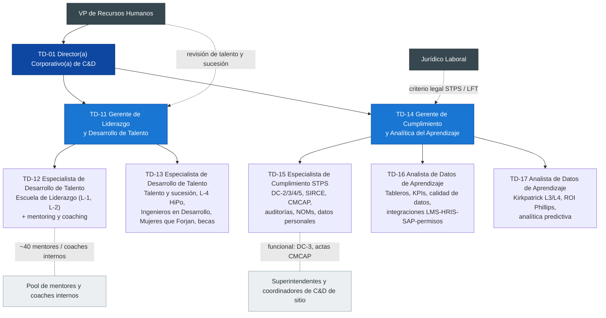

# Liderazgo, Talento, Cumplimiento y Analítica — Descripciones de Puesto (7 plazas)

> **Alcance:** Gerencia de Liderazgo y Desarrollo de Talento (TD-11, TD-12, TD-13) y Gerencia de Cumplimiento y Analítica del Aprendizaje (TD-14, TD-15, TD-16, TD-17) de la Academia GASM.
>
> **Documentos fuente (referencia obligatoria):** [Diseño del departamento](../department-design.md) · [Organigrama general](00-organigrama-general.md) · [Marco regulatorio](../../02-research/regulatory-framework-mexico.md) · [Manual de procesos TD-P01 a TD-P12](../../04-processes/process-manual.md) · [Portafolio de programas](../../05-programs/program-portfolio.md) · [Scorecard de KPIs](../../08-kpis/kpi-scorecard.md) · [Política de C&D](../training-and-development-policy.md) · [Roadmap](../../06-implementation/implementation-roadmap.md).
>
> **Convenciones:** "Año 1" = primer año de operación del modelo (2027 según el roadmap). Las metas de KPI se toman del scorecard (columna *Year 1*). Donde un proceso fija una meta más alta (p. ej. TD-P06 o TD-P09), se indica como **meta de proceso / estado estable**. Las referencias legales son una ayuda de planeación, no asesoría legal: **verificar con abogado laboral** y con la versión vigente publicada en el DOF y los lineamientos de la STPS. No se incluyen cifras salariales; las bandas las define Compensaciones.

---

## 1. Mini-organigrama de ambas gerencias

**Convención:** línea continua = reporte jerárquico (sólido); línea punteada = reporte funcional o relación de coordinación (no jerárquica).

## 2. Tabla resumen de plazas

| Código | Puesto | Gerencia | Reporta a (sólido / punteado) | Ubicación base | Tipo de personal | Fase de contratación* | Portafolio central |
|---|---|---|---|---|---|---|---|
| TD-11 | Gerente de Liderazgo y Desarrollo de Talento | Liderazgo y Talento | TD-01 / VP de RH | Corporativo, San Pedro Garza García | Confianza | Fase 1 (meses 3–12) | Escuela de Liderazgo, programas de talento, sucesión |
| TD-12 | Especialista de Desarrollo de Talento — Liderazgo | Liderazgo y Talento | TD-11 / – | Corporativo, con viaje frecuente a sitios | Confianza | Fase 2 (meses 12–24) | L-1 "Líder de Turno", L-2 "Líder de Líderes", mentoring y coaching |
| TD-13 | Especialista de Desarrollo de Talento — Talento y Pipeline | Liderazgo y Talento | TD-11 / – | Corporativo, con viaje a sitios y universidades | Confianza | Fase 2 (meses 12–24) | Revisión de talento, sucesión de ≈150 posiciones críticas, L-4 HiPo, Ingenieros en Desarrollo, Mujeres que Forjan, becas |
| TD-14 | Gerente de Cumplimiento y Analítica del Aprendizaje | Cumplimiento y Analítica | TD-01 / Jurídico Laboral | Corporativo, San Pedro Garza García | Confianza | Fase 1 (meses 3–12) | Cumplimiento STPS, gobierno de datos, evaluación e impacto |
| TD-15 | Especialista de Cumplimiento STPS | Cumplimiento y Analítica | TD-14 / – | Corporativo, con viaje a los 6 centros de trabajo | Confianza | Fase 0 (meses 0–3, urgente) | DC-2/3/4/5, SIRCE, CMCAP, autoauditorías, kit de inspección, NOMs, datos personales |
| TD-16 | Analista de Datos de Aprendizaje — Tableros e Integración | Cumplimiento y Analítica | TD-14 / – | Corporativo (esquema híbrido) | Confianza | Fase 1 (meses 3–12) | Tableros y KPIs, calidad de datos, integración LMS-HRIS/SAP-permisos-control de acceso |
| TD-17 | Analista de Datos de Aprendizaje — Evaluación e Impacto | Cumplimiento y Analítica | TD-14 / – | Corporativo (esquema híbrido), con visitas a sitio | Confianza | Fase 2 (meses 12–24) | Kirkpatrick L3/L4, ROI Phillips, analítica predictiva (vencimientos, rotación) |

\* Fases según el [organigrama general](00-organigrama-general.md), sección 5. La clasificación "de confianza" depende de las funciones reales (LFT Art. 9), no del título: **verificar con abogado laboral**.

### Criterio de división del trabajo entre pares

- **TD-12 vs. TD-13 (por población y ciclo):** TD-12 es dueño de los programas **de cohorte para líderes en funciones** (≈ 650 supervisores y ≈ 200 superintendentes/gerentes) y del sistema de mentoring/coaching. TD-13 es dueño de los **procesos de talento** (revisión, 9-box, sucesión, IDPs) y de los **programas de pipeline** (HiPo, ingenieros, mujeres, becas). La frontera: TD-13 decide *quién* entra a un programa de aceleración y *qué* necesita el sucesor; TD-12 opera *cómo* se desarrolla a los líderes en cohorte. El L-3 Programa Ejecutivo (≈ 50 directores y VPs) lo lleva directamente TD-11 por su nivel de interlocución.
- **TD-16 vs. TD-17 (por tipo de pregunta):** TD-16 responde *"¿qué pasó y está bien registrado?"* (datos confiables, tableros descriptivos, integración de sistemas). TD-17 responde *"¿funcionó, cuánto vale y qué va a pasar?"* (evaluación de impacto, ROI, modelos predictivos). TD-16 entrega el dato limpio; TD-17 lo analiza. Cada uno es suplente del otro en el cierre mensual.

## 3. Matriz de división del trabajo (entregables × plazas)

R = Responsable (ejecuta) · A = Aprueba / rinde cuentas · C = Consultado · I = Informado. Se incluye TD-01 como referencia para mantener la coherencia con la RACI del [diseño del departamento](../department-design.md) (sección 5).

| # | Entregable | TD-01 (ref.) | TD-11 | TD-12 | TD-13 | TD-14 | TD-15 | TD-16 | TD-17 |
|---|---|---|---|---|---|---|---|---|---|
| 1 | Estrategia y presupuesto de la Escuela de Liderazgo y de Programas de Talento | A | R | C | C | I | – | – | C |
| 2 | Currículo y cohortes L-1 "Líder de Turno" (96 h) | I | A | R | C | – | I | I | C |
| 3 | Currículo y cohortes L-2 "Líder de Líderes" (120 h + proyecto) | I | A | R | C | – | – | – | C |
| 4 | L-3 Programa Ejecutivo (alianza universitaria + coaching ejecutivo) | A | R | C | C | – | – | – | C |
| 5 | Pool de mentores y coaches internos (formación, emparejamiento, supervisión) | I | A | R | C | – | – | – | I |
| 6 | Revisión anual de talento (9-box) y calibración | A | R | C | R | – | – | C | C |
| 7 | Planes de sucesión de ≈ 150 posiciones críticas y bench strength | A | R | I | R | I | – | C | C |
| 8 | L-4 "Talento Sierra Madre" (≈ 60 HiPo/año, assessment center) | I | A | C | R | – | – | – | C |
| 9 | "Ingenieros en Desarrollo" (25/año, 18 meses) | I | A | C | R | – | I | – | C |
| 10 | "Mujeres que Forjan" (reclutamiento, formación, mentoring, patrocinio) | I | A | C | R | – | – | C | C |
| 11 | Becas y apoyo educativo (70%, INEA) | I | A | – | R | C | C | – | I |
| 12 | Calendario corporativo de cumplimiento STPS | I | – | – | – | A | R | C | – |
| 13 | DC-2 por centro de trabajo (acompañamiento y archivo; los sitios elaboran) | A | I | – | – | C | R (control) | C | – |
| 14 | DC-3 en ≤ 10 días hábiles (control corporativo; los sitios emiten) | I | – | – | – | A | R (control) | C | – |
| 15 | DC-4 / reporte en SIRCE | I | – | – | – | A | R | C | – |
| 16 | Verificación DC-5 de agentes externos antes de la orden de compra | I | C | C | – | A | R | – | – |
| 17 | Soporte a las CMCAP (formación de integrantes, formato de actas, seguimiento) | I | – | – | – | A | R | C | – |
| 18 | Autoauditoría trimestral (5% de registros por sitio) y kit de inspección STPS | I | – | – | – | A | R | C | – |
| 19 | Matriz de requisitos legales de capacitación (NOMs) y reglas de vigencia en el LMS | I | – | – | – | A | R | C | – |
| 20 | Protección de datos personales en registros de capacitación | I | C | C | C | A | R | R (controles técnicos) | C |
| 21 | Tableros (4 vistas: ejecutiva, sitio, supervisor, empleado) | I | C | I | C | A | C | R | C |
| 22 | Cierre mensual de datos (5.º día hábil) y diccionario de KPIs | I | I | I | I | A | C | R | C |
| 23 | Integración LMS–HRIS/SAP–sistema de permisos–control de acceso | I | – | – | – | A | C | R | C |
| 24 | Evaluación L3/L4 de programas críticos y de liderazgo | A | C | C | C | R | – | C | R |
| 25 | Estudios de ROI (Phillips) | A | C | C | C | R | – | C | R |
| 26 | Modelos predictivos (vencimientos 30/60/90 días, rotación de técnicos < 30 años) | I | C | – | C | A | C | C | R |
| 27 | Reporte trimestral al Learning Council (sección cumplimiento, impacto y pipeline) | A | R (pipeline) | I | C | R (cumplimiento e impacto) | C | C | C |

**Nota:** en los renglones 24–25 la RACI del departamento asigna "A" al Director y "R" al CoE; aquí TD-14 coordina (R) y TD-17 ejecuta (R). En el renglón 13 la RACI marca al sitio como R y a la CMCAP como aprobador; TD-15 solo controla, revisa y archiva.

---

## 4. Calendario anual de responsabilidades

El ciclo sigue la [política](../training-and-development-policy.md) (DNC y DC-2 a más tardar el 30 de noviembre, aprobación de la CMCAP en enero), TD-P02, TD-P03, TD-P06, TD-P09 y TD-P11. Los meses de las sesiones del Learning Council y de las CMCAP son una **propuesta**: los documentos fuente solo fijan la frecuencia (trimestral).

| Mes | Liderazgo y Talento (TD-11/12/13) | Cumplimiento STPS (TD-15) | Analítica (TD-16/17) | Gobierno y reportes (TD-11/TD-14) |
|---|---|---|---|---|
| **Enero** | Arranque de cohortes L-1 del semestre 1; arranque de la cohorte L-4 (seleccionada en diciembre); convocatoria de becas para el semestre de primavera | **Sesión CMCAP Q1** en los 6 centros: aprobación del **DC-2** (límite: 31 de enero); archivo de los DC-2 firmados en el kit de inspección | Cierre anual de datos; se congelan las definiciones de KPI aprobadas por el Learning Council | T&D Operations Review mensual |
| **Febrero** | Seguimiento L3 de las cohortes L-1/L-2 que cerraron en el Q4 | **Ventana DC-4 / SIRCE** (propuesta; la fecha depende de los lineamientos vigentes — **verificar con abogado laboral**) | Línea base del año; selección de los programas para ROI (TD-17 propone y TD-01 aprueba) | **Learning Council Q1** (resultados del año anterior, DC-2 aprobados, plan de ROI) · **Foro Corporativo Sindicato–Empresa** (semestral): informe anual conjunto de las CMCAP |
| **Marzo** | Evaluación de desempeño del año anterior (insumo para la revisión de talento, en coordinación con RH) | **Autoauditoría trimestral Q1** (muestra del 5% por sitio) | Recolección de datos L3/L4 para los estudios de ROI | Reporte trimestral de cumplimiento |
| **Abril** | Arranque de la cohorte L-2 (9 meses) | **Sesión CMCAP Q2** (avance del plan, estado de los DC-3) | Recolección de datos para ROI; actualización del modelo de vencimientos | |
| **Mayo** | Preparación de la revisión de talento: formatos, criterios 9-box, lista de posiciones críticas; convocatoria de becas para agosto | Revisión de la matriz de requisitos legales (cambios en DOF/NOMs) | Análisis intermedio de ROI | **Learning Council Q2** |
| **Junio** | **Revisión de talento por sitio** (junio–julio); **corte semestral de bench strength** | **Autoauditoría trimestral Q2** | Corte semestral de bench strength (con TD-13) | Reporte trimestral de cumplimiento |
| **Julio** | Arranque de las cohortes L-1 del semestre 2; **calibración corporativa del talento** | **Sesión CMCAP Q3** | Análisis de rotación de técnicos < 30 años (semestral) | |
| **Agosto** | Resultados de la revisión de talento a la VP de RH y al CEO; actualización de planes de sucesión e IDPs; ingreso de la generación de **Ingenieros en Desarrollo** | Revisión de los DC-5 de proveedores con contratos que vencen | Borrador del estudio de ROI | **Learning Council Q3** · **Foro Corporativo Sindicato–Empresa** (2.ª sesión semestral) |
| **Septiembre** | Los IDPs y brechas de sucesión alimentan la **DNC** (fuente "Individual"); nominaciones para L-4 | **Autoauditoría trimestral Q3**; arranque de la **DNC** en sitios (el cumplimiento aporta la fuente regulatoria) | Reporte de vencimientos a 12 meses (entrada P1 para la DNC) | Reporte trimestral de cumplimiento |
| **Octubre** | DNC de liderazgo (brechas de supervisores y gerentes) | **Sesión CMCAP Q4** (revisión de la DNC con los representantes sindicales) | Estudio de ROI terminado | |
| **Noviembre** | Plan y presupuesto de liderazgo y talento del año siguiente | **Cierre de la DNC (30 de noviembre)**; borradores de DC-2 | Propuesta de cambios a las definiciones de KPI (solo el Learning Council las modifica) | **Learning Council Q4**: DNC consolidada, presupuesto, **presentación del estudio de ROI**, **pipeline y sucesión** |
| **Diciembre** | **Corte semestral de bench strength**; selección de la cohorte L-4 del año siguiente; graduaciones | **Autoauditoría trimestral Q4** + simulacro de inspección; DC-2 listos para firma en enero | Cierre del año | Reporte trimestral de cumplimiento |
| **Todos los meses** | Sesiones de mentoring y coaching; seguimiento L3 a 60–90 días | Control de DC-3 ≤ 10 días hábiles; control de DC-5 antes de cada orden de compra | **Cierre de datos al 5.º día hábil**; reportes semanales de certificación crítica e inducción de contratistas | T&D Operations Review mensual; reporte mensual a los líderes de sitio |

---

## 5. Descripciones de puesto

### TD-11 — Gerente de Liderazgo y Desarrollo de Talento

#### 1. Identificación

| Campo | Detalle |
|---|---|
| Código | TD-11 |
| Título | Gerente de Liderazgo y Desarrollo de Talento |
| Área | Centro de Excelencia (CoE) — Gerencia de Liderazgo y Desarrollo de Talento |
| Reporta a | **Sólido:** TD-01 Director(a) Corporativo(a) de C&D · **Punteado:** VP de Recursos Humanos (revisión de talento y sucesión) |
| Supervisa a | TD-12 y TD-13 (2 especialistas). Coordina de forma funcional el pool de ≈ 40 mentores y coaches internos y a los proveedores de liderazgo |
| Ubicación | Corporativo, San Pedro Garza García, N.L.; viajes a sitios ≈ 25% |
| Nivel / banda | Gerencia media del CoE, par de TD-02, TD-08 y TD-14 (banda por definir por Compensaciones) |
| Tipo de personal | De confianza (verificar la clasificación con abogado laboral) |
| Plazas | 1 |

#### 2. Propósito del puesto
Construir el pipeline de liderazgo y la sucesión de las posiciones críticas de GASM, de modo que el 60% de las vacantes de liderazgo se cubra internamente para el año 3 y que ningún supervisor asuma el puesto sin preparación en liderazgo seguro, relaciones laborales y desarrollo de su equipo.

#### 3. Funciones principales

| # | Función | % tiempo | Proceso |
|---|---|---|---|
| 1 | Definir la estrategia, la arquitectura y los *Design Briefs* de la Escuela de Liderazgo (L-1 a L-4) y de los Programas de Talento, alineados con el modelo de competencias de liderazgo | 15% | TD-P01, TD-P04 |
| 2 | Conducir con la VP de RH la revisión anual de talento (9-box) y los planes de sucesión de ≈ 150 posiciones críticas; presentar los resultados al CEO | 15% | RACI "Leadership & succession"; TD-P02 (fuente individual) |
| 3 | Dirigir, desarrollar y evaluar a TD-12 y TD-13; asignar portafolios y suplencias | 10% | – |
| 4 | Gestionar a los proveedores de liderazgo: universidad del L-3, assessment centers, coaching ejecutivo; licitación y evaluación | 10% | TD-P12 |
| 5 | Evaluar el impacto (L3/L4) de los programas de liderazgo con TD-17 (360°, fill rate, compromiso de los equipos) | 10% | TD-P06 |
| 6 | Planear y controlar el presupuesto de programas de liderazgo (MXN 12.0 M en estado estable) y de becas (MXN 5.0 M) | 8% | TD-P03 |
| 7 | Reportar el pipeline al Learning Council y mantener la relación con los patrocinadores (CEO / VP de RH) | 8% | TD-P06 |
| 8 | Ser dueño directo del L-3 Programa Ejecutivo (≈ 50 directores y VPs): diseño con la universidad, coaching ejecutivo, seguimiento | 8% | TD-P04, TD-P05 |
| 9 | Gobernar el sistema de mentoring y coaching de líderes y apoyar a "Legado Experto" en la preparación de mentores | 6% | TD-P10 |
| 10 | Alinear los programas de liderazgo con el CCT y el escalafón en los foros con el sindicato (p. ej. supervisores de origen sindicalizado) | 5% | TD-P11 |
| 11 | Impulsar la diversidad y la igualdad de acceso al desarrollo (apoyo a la NMX-R-025) | 5% | TD-P04 |
| | **Total** | **100%** | |

#### 4. Responsabilidades específicas de esta plaza
- Único dueño del **L-3 Programa Ejecutivo** y de la relación con el CEO como patrocinador de la Escuela de Liderazgo.
- Aprueba (A) los programas que ejecutan TD-12 y TD-13 y preside la **calibración corporativa** del talento.
- Punto único de contacto con la VP de RH para sucesión, promociones de liderazgo y retención de talento clave.
- Decide la distribución del presupuesto de liderazgo y talento entre programas, dentro de lo que aprueba TD-01.

#### 5. Autoridad y decisiones

| Decide solo | Propone / recomienda | Escala a TD-01 o a la VP de RH |
|---|---|---|
| Diseño y calendario de los programas de liderazgo; selección de facilitadores dentro del presupuesto aprobado; asignación de trabajo a TD-12/13; criterios de admisión a L-1/L-2 | Lista de participantes del L-4 (a la calibración); proveedores de L-3 y assessment center (a Compras y TD-01); reglas de becas y convenios | Cambios de presupuesto > ±5%; convenios de permanencia de alto costo (> MXN 150,000; política 6.6, **verificar con abogado laboral**); casos de talento con impacto en relaciones laborales |

#### 6. KPIs con meta del año 1

| KPI (scorecard) | Meta año 1 | Frecuencia |
|---|---|---|
| Internal fill rate — liderazgo | 45% | Trimestral |
| Succession bench strength (≥ 1 sucesor listo ahora) | 35% | Semestral |
| Supervisores certificados en la Escuela de Supervisores | 40% | Trimestral |
| L3 aplicación (programas de liderazgo) | 60% | Trimestral |
| Mujeres en roles operativos (contribución; dueño VP de RH) | 5% | Trimestral |
| Variación del presupuesto de liderazgo y talento | ±5% | Mensual |
| Compromiso de los equipos liderados por egresados | *Métrica del portafolio sin meta en el scorecard; fijar la línea base en el año 1* | Anual |

#### 7. Interacciones clave
- **Internas:** CEO y VP de RH (patrocinadores); Learning Council; directores de sitio; HRBPs, Reclutamiento, Compensaciones y Relaciones Laborales; TD-02 (diseño), TD-08/09/10 (sucesores técnicos y Legado Experto); TD-14/TD-17 (evaluación); superintendentes de sitio (logística de cohortes).
- **Externas:** universidades para el L-3 y alianzas (p. ej. escuelas de negocios de Monterrey); proveedores de assessment center y de coaching ejecutivo; sindicato (Foro Corporativo Sindicato–Empresa); CONOCER (certificaciones de instructores y coaches internos, cuando aplique).

#### 8. Perfil

| Rubro | Requisito |
|---|---|
| Escolaridad | Licenciatura en Psicología Organizacional, Administración o afín; maestría en Desarrollo Organizacional, RH o MBA (deseable) |
| Experiencia | 10+ años en desarrollo de talento o liderazgo; 5+ en industria pesada, minería, acero o manufactura con sindicato; experiencia en sucesión y assessment centers |
| Certificaciones | Coaching (ICF ACC/PCC o equivalente); herramientas psicométricas o de assessment center; EC0217.01 y EC0301 (deseable) |
| Conocimientos | Modelos de liderazgo y 70-20-10; 9-box y sucesión; diseño de assessment centers; coaching; evaluación Kirkpatrick/Phillips; LFT (escalafón, CCT, trabajadores de confianza); NOM-035; NMX-R-025 |
| Competencias | Influencia con la alta dirección, visión sistémica, pensamiento crítico, negociación, desarrollo de otros, orientación a resultados, confidencialidad |
| Idiomas | Español nativo; inglés avanzado (proveedores, benchmarks, universidades) |

#### 9. Condiciones de trabajo
Oficina corporativa con viajes frecuentes a Colima, Coahuila, Manzanillo y Salinas Victoria. Visitas a operación con EPP completo (NOM-017) e inducción de sitio vigente. Sesiones de cohorte ocasionales fuera del horario de oficina para cubrir los turnos 4×4 y 14×7. Maneja información altamente confidencial (evaluaciones, 9-box, sucesión).

#### 10. Plan de primeros 90 días

| Periodo | Acciones | Entregable |
|---|---|---|
| Días 1–30 | Inducción corporativa y de sitio; entrevistas con el CEO, la VP de RH, los directores de sitio y el sindicato; inventario de supervisores (≈ 650) y de su formación actual (línea base 19%) | Diagnóstico del pipeline de liderazgo |
| Días 31–60 | Validar el modelo de competencias de liderazgo; lista preliminar de ≈ 150 posiciones críticas con la VP de RH; *Design Brief* del L-1; RFP de proveedores de assessment center y universidad | Lista de posiciones críticas v1; *Design Brief* L-1 |
| Días 61–90 | Lanzar las primeras cohortes del L-1 (roadmap: cohortes 1–6 desde julio del año 1); plan de reclutamiento de TD-12 y TD-13; línea base de bench strength e internal fill rate con TD-14/TD-16 | Cohortes 1–2 en marcha; línea base de KPIs de talento |

---

### TD-12 — Especialista de Desarrollo de Talento (Escuela de Liderazgo, Mentoring y Coaching)

#### 1. Identificación

| Campo | Detalle |
|---|---|
| Código | TD-12 |
| Título | Especialista de Desarrollo de Talento — Escuela de Liderazgo |
| Área | CoE — Gerencia de Liderazgo y Desarrollo de Talento |
| Reporta a | **Sólido:** TD-11 · **Punteado:** ninguno |
| Supervisa a | Sin reportes directos. Coordina de forma funcional a los facilitadores internos y externos de L-1/L-2 y al pool de ≈ 40 mentores y coaches internos |
| Ubicación | Corporativo, San Pedro Garza García; viajes a sitios ≈ 40% (cohortes en Tepehuaje, Sierra Alta, Manzanillo y Acería Norte) |
| Nivel / banda | Especialista senior del CoE (banda por definir por Compensaciones) |
| Tipo de personal | De confianza (verificar la clasificación con abogado laboral) |
| Plazas | 1 (de 2 especialistas de desarrollo de talento) |

#### 2. Propósito del puesto
Diseñar y operar la Escuela de Supervisores "Líder de Turno" y el programa "Líder de Líderes", y el sistema de mentoring y coaching, para que cada supervisor y gerente lidere con seguridad, maneje las relaciones laborales conforme al CCT y desarrolle a su equipo.

#### 3. Funciones principales

| # | Función | % tiempo | Proceso |
|---|---|---|---|
| 1 | Diseñar y actualizar, con TD-02, el currículo del L-1 (96 h: liderazgo seguro, relaciones laborales y CCT, comunicación, retroalimentación, conflicto, planeación de turno, KPIs, NOM-035, coaching de operadores) y del L-2 (120 h: ejecución de la estrategia, gestión diaria/lean, cambio, finanzas, desarrollo de talento) | 15% | TD-P04 |
| 2 | Planear las cohortes de 20 participantes por sitio, compatibles con los roles 4×4 y 14×7, junto con los superintendentes de sitio | 15% | TD-P03, TD-P05 |
| 3 | Facilitar módulos clave y dar seguimiento a los proyectos de *action learning* del L-2 | 15% | TD-P05 |
| 4 | Operar el pool de mentores y coaches internos: selección, formación, emparejamiento, supervisión y reconocimiento | 12% | TD-P10 |
| 5 | Aplicar el 360° antes y después y dar seguimiento L3 a 60–90 días con los jefes directos (plantilla L3) | 10% | TD-P06 |
| 6 | Hacer la DNC de liderazgo: brechas de supervisores y gerentes por sitio | 8% | TD-P02 |
| 7 | Seleccionar, preparar y evaluar a los facilitadores internos (Relaciones Laborales, HSE) y externos | 8% | TD-P12 |
| 8 | Integrar el L-1 con S-04 (liderazgo en seguridad) y S-07 (NOM-035) de la Escuela de Seguridad, sin duplicar horas | 7% | TD-P04 |
| 9 | Asegurar que los registros del L-1/L-2 estén en el LMS y que los sitios emitan los DC-3 | 5% | TD-P09 |
| 10 | Gestionar la comunidad de egresados, las graduaciones y el reconocimiento | 5% | TD-P06 |
| | **Total** | **100%** | |

#### 4. Responsabilidades específicas de esta plaza
- **Portafolio asignado:** L-1 "Líder de Turno" (≈ 650 supervisores), L-2 "Líder de Líderes" (≈ 200 superintendentes y gerentes), mentoring y coaching de líderes.
- **Diferencia con TD-13:** TD-12 trabaja con **líderes en funciones y en cohortes**. No administra la revisión de talento ni la sucesión; recibe de TD-13 las prioridades de desarrollo que salen de los IDPs y reporta el avance de los participantes que son sucesores.
- Es suplente de TD-13 en la logística de las cohortes L-4 y dueño de la metodología de coaching que usa el L-4.
- Apoya a las academias técnicas (TD-08/09/10) en la **formación de mentores** de "Legado Experto"; las academias son dueñas del KPI de transferencia de conocimiento.

#### 5. Autoridad y decisiones

| Decide solo | Propone / recomienda | Escala a TD-11 |
|---|---|---|
| Calendario detallado de las cohortes; asignación de facilitadores internos; emparejamiento mentor–mentorado; aprobación de participantes que cumplen los criterios de admisión | Cambios de currículo (al Academy Board / TD-02 para el *quality gate*); proveedores de facilitación; baja de facilitadores con evaluación < 4.0 | Excepciones de admisión; conflictos con líneas de producción por liberación de personal; temas de relaciones laborales que surjan en las cohortes |

#### 6. KPIs con meta del año 1

| KPI (scorecard) | Meta año 1 | Frecuencia |
|---|---|---|
| Supervisores certificados en la Escuela de Supervisores | 40% | Trimestral |
| L1 satisfacción (cohortes L-1/L-2) | 4.2 / 5 | Mensual |
| L2 aprobación al primer intento | 80% | Mensual |
| L3 aplicación a 60–90 días | 60% | Trimestral |
| Internal fill rate — liderazgo (contribución) | 45% | Trimestral |
| Mejora del 360° de supervisores | *Métrica del portafolio sin meta en el scorecard; fijar la línea base en el año 1* | Por cohorte |

#### 7. Interacciones clave
- **Internas:** superintendentes y coordinadores de sitio (logística y liberación de personal); jefes directos (L3); Relaciones Laborales (módulo CCT); HSE (S-04); TD-02 y diseñadores instruccionales; TD-13 (sucesores); TD-17 (evaluación).
- **Externas:** proveedores de facilitación y coaching; sindicato (cuando los supervisores provienen del escalafón sindical); universidades (contenido de L-2); CONOCER (EC0217.01 de los facilitadores internos).

#### 8. Perfil

| Rubro | Requisito |
|---|---|
| Escolaridad | Licenciatura en Psicología, Administración, Ingeniería Industrial o afín |
| Experiencia | 5+ años en facilitación de liderazgo o desarrollo organizacional; 2+ en planta industrial o minera con personal sindicalizado |
| Certificaciones | **EC0217.01** (obligatoria); coaching (ICF ACC o equivalente); 360° o herramientas de estilo de liderazgo (deseable) |
| Conocimientos | Aprendizaje de adultos, *action learning*, diseño blended; LFT y CCT a nivel operativo; NOM-035; liderazgo en seguridad (liderazgo visible, VCC); evaluación L1–L3 |
| Competencias | Facilitación de grupos, credibilidad con operación, organización multisitio, escucha, retroalimentación, resiliencia |
| Idiomas | Español nativo; inglés intermedio |

#### 9. Condiciones de trabajo
Viaje frecuente (≈ 40%), incluidas mina a cielo abierto, mina subterránea (Sierra Alta) y acería. Facilitación en aulas de planta y en campo con EPP. Sesiones en horarios que cubren varios turnos (madrugada o fin de semana por los roles 4×4 y 14×7), con descanso compensatorio según la política de RH.

#### 10. Plan de primeros 90 días

| Periodo | Acciones | Entregable |
|---|---|---|
| Días 1–30 | Inducción y visita a todos los sitios; recibir de TD-11 las cohortes L-1 que ya están en marcha (contratación en fase 2); revisar los resultados L1/L2 de las cohortes 1–6 | Informe de lecciones aprendidas de las primeras cohortes |
| Días 31–60 | Calendario de cohortes del año por sitio para llegar al 40%; *Design Brief* del L-2; convocatoria del pool de mentores y coaches | Calendario de cohortes; *Design Brief* L-2 |
| Días 61–90 | Primer ciclo de seguimiento L3 con los jefes; formación de los primeros mentores y coaches internos; lanzamiento del piloto L-2 | Reporte L3; pool inicial de mentores activo |

---

### TD-13 — Especialista de Desarrollo de Talento (Talento, Sucesión y Pipeline)

#### 1. Identificación

| Campo | Detalle |
|---|---|
| Código | TD-13 |
| Título | Especialista de Desarrollo de Talento — Talento y Pipeline |
| Área | CoE — Gerencia de Liderazgo y Desarrollo de Talento |
| Reporta a | **Sólido:** TD-11 · **Punteado:** ninguno |
| Supervisa a | Sin reportes directos. Coordina de forma funcional a los mentores de "Ingenieros en Desarrollo" y a los proveedores de assessment center |
| Ubicación | Corporativo, San Pedro Garza García; viajes a sitios y universidades ≈ 30% |
| Nivel / banda | Especialista senior del CoE (banda por definir por Compensaciones) |
| Tipo de personal | De confianza (verificar la clasificación con abogado laboral) |
| Plazas | 1 (de 2 especialistas de desarrollo de talento) |

#### 2. Propósito del puesto
Operar los procesos de revisión de talento y sucesión, y los programas de pipeline (HiPo, ingenieros, mujeres, becas), para que cada posición crítica tenga sucesores preparados y GASM dependa menos del mercado externo de talento.

#### 3. Funciones principales

| # | Función | % tiempo | Proceso |
|---|---|---|---|
| 1 | Diseñar y operar la revisión anual de talento: formatos, criterios 9-box, sesiones por sitio y calibración corporativa | 18% | RACI "Leadership & succession" |
| 2 | Mantener los planes de sucesión de ≈ 150 posiciones críticas y calcular el bench strength | 15% | TD-P02 |
| 3 | Operar el L-4 "Talento Sierra Madre" (≈ 60 HiPo/año, 18 meses): assessment center, rotaciones, mentoring y proyecto | 15% | TD-P04, TD-P05 |
| 4 | Operar "Ingenieros en Desarrollo" (25/año, 18 meses de rotación, mentor, proyecto, certificación técnica) | 12% | TD-P05 |
| 5 | Operar "Mujeres que Forjan": formación para roles operativos, red de mentoras y patrocinio, en coordinación con Reclutamiento y los sitios | 10% | TD-P04, TD-P05 |
| 6 | Administrar las becas y el apoyo educativo (hasta 70%, política 6.6) y el programa de terminación de estudios con INEA | 8% | TD-P03 |
| 7 | Gestionar las alianzas con universidades, CONALEP y Universidades Tecnológicas (enlace del CoE para la formación dual; los sitios la operan) | 7% | TD-P12 |
| 8 | Dar seguimiento a los IDPs de sucesores y HiPo, y asegurar que alimenten la DNC | 5% | TD-P02 |
| 9 | Coordinar con las academias técnicas la sucesión de expertos técnicos ("Legado Experto") | 5% | TD-P10 |
| 10 | Hacer analítica de talento con TD-16/17 (bench strength, fill rate, retención de HiPo) | 5% | TD-P06 |
| | **Total** | **100%** | |

#### 4. Responsabilidades específicas de esta plaza
- **Portafolio asignado:** revisión de talento y sucesión, L-4, Ingenieros en Desarrollo, Mujeres que Forjan, becas, enlace universitario.
- **Diferencia con TD-12:** TD-13 administra **procesos de talento y programas de pipeline** (quién, cuándo y con qué plan). No facilita las cohortes de supervisores; sí define qué sucesores deben priorizarse en L-1/L-2.
- Custodio de la **información confidencial de talento** (9-box, sucesores). Aplica el principio de mínimo acceso junto con TD-15 y TD-16.
- Aporta evidencia para la **NMX-R-025** (igualdad de acceso al desarrollo) y para la meta de ≥ 30% de mujeres en la formación dual.

#### 5. Autoridad y decisiones

| Decide solo | Propone / recomienda | Escala a TD-11 |
|---|---|---|
| Logística y calendario de la revisión de talento; asignación de rotaciones de ingenieros (con los directores receptores); aprobación de becas dentro de las reglas y el presupuesto | Lista de HiPo y de sucesores (a la calibración); convenios con universidades; cambios a las reglas de becas | Becas con convenio de permanencia (> MXN 150,000, **verificar con abogado laboral**); desacuerdos de calibración; casos de retención de talento clave |

#### 6. KPIs con meta del año 1

| KPI (scorecard) | Meta año 1 | Frecuencia |
|---|---|---|
| Succession bench strength | 35% | Semestral |
| Internal fill rate — liderazgo | 45% | Trimestral |
| Mujeres en roles operativos (contribución; dueño VP de RH) | 5% | Trimestral |
| Conversión de aprendices (dueño Site T&D; TD-13 contribuye como enlace) | – (año 2: 75%) | Por cohorte |
| Rotación de técnicos < 30 años (contribución; dueño VP de RH) | 16% | Trimestral |
| Posiciones críticas con plan de sucesión documentado | *Métrica interna propuesta: 100% de las ≈ 150 al cierre del año 1* | Semestral |

#### 7. Interacciones clave
- **Internas:** VP de RH, HRBPs, Reclutamiento, Compensaciones; directores de sitio (calibración y rotaciones); TD-12; TD-08/09/10 (sucesión técnica); superintendentes de sitio (formación dual y "Mujeres que Forjan"); Finanzas (becas).
- **Externas:** universidades, CONALEP y UTs; INEA; proveedores de assessment center y de psicometría; servicios estatales de empleo (programas comunitarios); organismos de la NMX-R-025 (auditoría de certificación).

#### 8. Perfil

| Rubro | Requisito |
|---|---|
| Escolaridad | Licenciatura en Psicología (cédula profesional deseable para psicometría) o en Administración/RH |
| Experiencia | 5+ años en gestión del talento, sucesión o programas de trainees/graduados; experiencia en assessment centers |
| Certificaciones | Assessment center y herramientas psicométricas (p. ej. certificación del proveedor); EC0301 (deseable) |
| Conocimientos | 9-box, planes de sucesión, IDPs, 70-20-10; modelo mexicano de formación dual; LFT (escalafón, igualdad, becas y convenios); NMX-R-025; Excel avanzado o Power BI a nivel usuario |
| Competencias | Confidencialidad, rigor en el proceso, facilitación de calibraciones, relación con universidades, inclusión, orientación al servicio |
| Idiomas | Español nativo; inglés intermedio |

#### 9. Condiciones de trabajo
Oficina corporativa con viajes a sitios, ferias universitarias y campus. Visitas a operación con EPP. Temporadas pico en junio–agosto (revisión de talento e ingreso de ingenieros). Maneja información altamente confidencial.

#### 10. Plan de primeros 90 días

| Periodo | Acciones | Entregable |
|---|---|---|
| Días 1–30 | Inducción; recibir de TD-11 la lista de ≈ 150 posiciones críticas y la línea base de bench strength (< 20%); inventario de becas vigentes y convenios universitarios | Mapa de posiciones críticas con titulares y sucesores actuales |
| Días 31–60 | Diseñar la metodología 9-box y el calendario de revisión de talento (roadmap: arranque en enero del año 2); RFP de assessment center para el L-4; reglas de becas revisadas por Jurídico | Manual de revisión de talento; reglas de becas v1 |
| Días 61–90 | Piloto de revisión de talento en un sitio (Acería Norte); convocatoria de la primera cohorte de "Ingenieros en Desarrollo"; plan de "Mujeres que Forjan" con Reclutamiento | Resultados del piloto; convocatoria publicada |

---

### TD-14 — Gerente de Cumplimiento y Analítica del Aprendizaje

#### 1. Identificación

| Campo | Detalle |
|---|---|
| Código | TD-14 |
| Título | Gerente de Cumplimiento y Analítica del Aprendizaje |
| Área | CoE — Gerencia de Cumplimiento y Analítica del Aprendizaje |
| Reporta a | **Sólido:** TD-01 Director(a) Corporativo(a) de C&D · **Punteado:** Jurídico Laboral (criterio legal sobre STPS y LFT) |
| Supervisa a | TD-15, TD-16 y TD-17 (3 reportes directos). Línea funcional con los coordinadores de sitio para los registros STPS |
| Ubicación | Corporativo, San Pedro Garza García; viajes a sitios ≈ 20% |
| Nivel / banda | Gerencia media del CoE, par de TD-02, TD-08 y TD-11 (banda por definir por Compensaciones) |
| Tipo de personal | De confianza (verificar la clasificación con abogado laboral) |
| Plazas | 1 |

#### 2. Propósito del puesto
Asegurar que GASM cumpla al 100% sus obligaciones legales de capacitación (cero hallazgos de la STPS) y demostrar con datos confiables el impacto de la capacitación en la seguridad, la operación y el talento.

#### 3. Funciones principales

| # | Función | % tiempo | Proceso |
|---|---|---|---|
| 1 | Gobernar el cumplimiento STPS corporativo: calendario, criterios y estándar de registros para los 6 centros de trabajo | 15% | TD-P09 |
| 2 | Gobernar los datos de aprendizaje: fuente única de verdad, definiciones de KPI congeladas, cierre mensual al 5.º día hábil | 15% | Scorecard, sección 3 |
| 3 | Coordinar las autoauditorías trimestrales y la atención de inspecciones de la STPS | 10% | TD-P09 |
| 4 | Preparar el reporte trimestral al Learning Council (cumplimiento e impacto) y el mensual al T&D Operations Review | 10% | TD-P06 |
| 5 | Dirigir el programa anual de evaluación y ROI (selección de programas, método, validación con Finanzas) | 10% | TD-P06 |
| 6 | Dirigir, desarrollar y evaluar a TD-15, TD-16 y TD-17 | 10% | – |
| 7 | Apoyar a las CMCAP y al Foro Corporativo Sindicato–Empresa con información de avance | 8% | TD-P11 |
| 8 | Patrocinar ante TI la integración LMS–HRIS/SAP–permisos de trabajo–control de acceso | 7% | TD-P07, TD-P08 |
| 9 | Asegurar la verificación DC-5 de agentes externos y la evidencia de competencia de contratistas REPSE, con Compras | 5% | TD-P12, TD-P08 |
| 10 | Gobernar la protección de datos personales en los registros (aviso de privacidad, retención, accesos) | 5% | TD-P09 |
| 11 | Hacer vigilancia regulatoria (DOF, NOMs, lineamientos STPS, CONOCER) y apoyar la acreditación como Centro de Evaluación en el año 3 | 5% | TD-P01 |
| | **Total** | **100%** | |

#### 4. Responsabilidades específicas de esta plaza
- Única plaza del CoE con "A" sobre el cumplimiento DC-3/DC-4 (RACI del departamento).
- Única interlocución formal con Jurídico Laboral para interpretar la LFT, los lineamientos STPS y los convenios con el sindicato en materia de capacitación.
- Custodio de las **definiciones de KPI**: solo propone cambios; los aprueba el Learning Council.
- Firma la validación metodológica de cada estudio de ROI antes de presentarlo.

#### 5. Autoridad y decisiones

| Decide solo | Propone / recomienda | Escala a TD-01 |
|---|---|---|
| Estándar de registros y de evidencia; muestra y alcance de las autoauditorías; prioridades de TD-15/16/17; permisos de acceso a los tableros | Cambios de definición de KPI (al Learning Council); programas para ROI; bloqueo de órdenes de compra a proveedores sin DC-5 vigente | Hallazgos críticos de cumplimiento (p. ej. personas en tareas críticas sin certificación); requerimientos formales de la STPS; incidentes de datos personales |

#### 6. KPIs con meta del año 1

| KPI (scorecard) | Meta año 1 | Frecuencia |
|---|---|---|
| DC-3 a tiempo (≤ 10 días hábiles) | 90% (meta de proceso TD-P09: ≥ 98%) | Mensual |
| Hallazgos STPS en capacitación | 0 | Por inspección |
| CMCAP activas (≥ 4 sesiones al año; dueño RH de sitio, TD-14 da seguimiento) | 6/6 | Trimestral |
| Estudios de ROI (Phillips) | 1 | Anual |
| Cumplimiento de capacitación obligatoria P1 (monitoreo; dueño Site T&D) | 95% | Mensual |
| Certificaciones vigentes (monitoreo; dueño Site T&D) | 95% | Mensual |
| Adopción de tableros | *KPI del diseño del departamento sin meta en el scorecard; propuesta: ≥ 80% de los usuarios de la vista de sitio activos al mes* | Mensual |
| Cierre de datos al 5.º día hábil | 12/12 meses (regla del scorecard) | Mensual |

#### 7. Interacciones clave
- **Internas:** TD-01; Jurídico Laboral; RH de sitio y superintendentes; TI (LMS, SAP/HRIS, permisos y control de acceso); HSE (certificación crítica, VCC); Compras (DC-5 y REPSE); Finanzas (ROI); Auditoría Interna; TD-06 (especialista LMS).
- **Externas:** STPS (inspecciones y plataforma SIRCE); CONOCER y ECE (Centro de Evaluación); IMSS (prima de riesgo de trabajo como insumo de L4/ROI); sindicato (CMCAP y Foro); auditores de ISO 45001 y NMX-R-025.

#### 8. Perfil

| Rubro | Requisito |
|---|---|
| Escolaridad | Licenciatura en Derecho, RH, Ingeniería Industrial o Actuaría/Economía; posgrado en analítica o en derecho laboral (deseable) |
| Experiencia | 8+ años entre cumplimiento laboral y capacitación y analítica de RH; 3+ en industria con sindicato y contratistas |
| Certificaciones | Auditor interno ISO 45001 o ISO 10015 (deseable); Power BI (PL-300) o equivalente (deseable); ROI Institute (deseable) |
| Conocimientos | **LFT** (Cap. III Bis, Arts. 153-A a 153-V, 12–15 REPSE, 994); formatos DC-2/3/4/5 y SIRCE; NOM-STPS aplicables a minería y acero; ley de protección de datos personales; Kirkpatrick/Phillips; Power BI/SQL a nivel de revisión; gobierno de datos |
| Competencias | Rigor, integridad, pensamiento analítico, comunicación ejecutiva con datos, negociación con sindicato y sitios, gestión de riesgos |
| Idiomas | Español nativo; inglés intermedio-avanzado |

#### 9. Condiciones de trabajo
Oficina corporativa con viajes a los 6 centros de trabajo para auditorías, CMCAP e inspecciones. Disponibilidad para atender visitas de la STPS sin aviso. Picos de trabajo en enero (DC-2), durante la ventana del DC-4 y en noviembre (DNC y Learning Council).

#### 10. Plan de primeros 90 días

| Periodo | Acciones | Entregable |
|---|---|---|
| Días 1–30 | Recibir de TD-15 el informe de la auditoría base (DC-2, DC-3, DC-4, DC-5, NOM-009/029/033/006) y el estado de las 6 CMCAP; reunión con Jurídico Laboral; inventario de fuentes de datos (2 LMS heredados, 4 hojas de cálculo, 1 sitio en papel) | Plan de cierre de brechas de cumplimiento |
| Días 31–60 | Calendario corporativo de cumplimiento; diccionario de KPIs v1; requisitos de datos y de integración para el RFP del LMS (con TD-02 y TI); contratación de TD-16 | Calendario publicado; diccionario v1 |
| Días 61–90 | Primer tablero ejecutivo (aunque sea manual) para el Learning Council; primera autoauditoría trimestral; selección del programa para el primer estudio de ROI (candidato: Critical Risk Standards o L-1) | Tablero v0; reporte de autoauditoría; plan de ROI |

---

### TD-15 — Especialista de Cumplimiento STPS

#### 1. Identificación

| Campo | Detalle |
|---|---|
| Código | TD-15 |
| Título | Especialista de Cumplimiento STPS |
| Área | CoE — Gerencia de Cumplimiento y Analítica del Aprendizaje |
| Reporta a | **Sólido:** TD-14 · **Punteado:** ninguno |
| Supervisa a | Sin reportes directos. Línea funcional (estándar y control) con los 18 coordinadores de C&D de sitio en DC-3 y registros, y con los secretarios de las CMCAP |
| Ubicación | Corporativo, San Pedro Garza García; viajes a los 6 centros de trabajo ≈ 40% |
| Nivel / banda | Especialista senior del CoE (banda por definir por Compensaciones) |
| Tipo de personal | De confianza (verificar la clasificación con abogado laboral) |
| Plazas | 1 |

#### 2. Propósito del puesto
Garantizar que cada obligación legal de capacitación (DC-2, DC-3, DC-4, DC-5, CMCAP, NOMs) se cumpla a tiempo y con evidencia lista para inspección en todos los centros de trabajo, y que los registros protejan los datos personales de los trabajadores.

#### 3. Funciones principales

| # | Función | % tiempo | Proceso |
|---|---|---|---|
| 1 | Controlar la emisión de DC-3 en ≤ 10 días hábiles: criterios, firmas (instructor y representantes de la CMCAP), rezagos y entrega al trabajador | 15% | TD-P09 |
| 2 | Hacer la autoauditoría trimestral (muestra del 5% de registros por sitio), el informe y el seguimiento de acciones | 15% | TD-P09 |
| 3 | Acompañar a los sitios en la integración del DC-2 y archivar los planes firmados por las CMCAP | 10% | TD-P03 |
| 4 | Preparar y presentar las listas DC-4 en SIRCE en los plazos vigentes (**verificar periodicidad con abogado laboral**) | 10% | TD-P09 |
| 5 | Mantener el kit de inspección STPS por centro de trabajo y acompañar las visitas de inspección | 10% | TD-P09 |
| 6 | Apoyar a las CMCAP: formación de los integrantes en el Cap. III Bis, formato de actas, seguimiento de acuerdos (≥ 90%) | 10% | TD-P11 |
| 7 | Mantener la matriz de requisitos legales de capacitación (NOMs, SEDENA, ISO 45001) y sus reglas de vigencia en el LMS | 10% | TD-P02, TD-P07 |
| 8 | Verificar el DC-5 de cada agente externo antes de liberar la orden de compra | 5% | TD-P12 |
| 9 | Definir los criterios para validar los DC-3 de contratistas REPSE y auditar a los evaluadores propios de los contratistas | 5% | TD-P08 |
| 10 | Aplicar la protección de datos personales: aviso de privacidad, retención (duración de la relación + 5 años o más si la norma lo exige), derechos ARCO | 5% | TD-P09 |
| 11 | Dar criterio de cumplimiento para el reconocimiento de saberes previos (Art. 153-U) y la relación con el escalafón | 5% | TD-P07 |
| | **Total** | **100%** | |

#### 4. Responsabilidades específicas de esta plaza
- Única plaza técnica de cumplimiento STPS de la Academia: es quien opera SIRCE y el kit de inspección.
- Los sitios **emiten** los DC-3 y elaboran los DC-2; TD-15 **define el estándar, controla y audita**.
- Es la primera contratación del área (fase 0) porque hace la auditoría base de los 6 centros de trabajo en las semanas 2–6.
- Suplente de TD-14 ante inspecciones de la STPS.

#### 5. Autoridad y decisiones

| Decide solo | Propone / recomienda | Escala a TD-14 |
|---|---|---|
| Rechazar registros incompletos (sin CURP, sin DC-5, sin firma); selección de la muestra de auditoría; formato estándar de actas y de kit | Bloqueo de órdenes de compra sin DC-5; reglas de vigencia por NOM; cambios de catálogo STPS en el LMS | Hallazgos que afecten a personas en tareas críticas; requerimientos de la STPS; CMCAP sin sesión trimestral; incidentes de datos |

#### 6. KPIs con meta del año 1

| KPI | Meta año 1 | Frecuencia |
|---|---|---|
| DC-3 a tiempo (scorecard) | 90% | Mensual |
| Hallazgos STPS en capacitación (scorecard) | 0 | Por inspección |
| CMCAP activas (scorecard; dueño RH de sitio) | 6/6 | Trimestral |
| Inducción de contratistas antes del acceso (scorecard; verificación documental) | 100% | Semanal |
| Exactitud de la autoauditoría (meta de proceso TD-P09) | ≥ 98% | Trimestral |
| Seguimiento de acuerdos de CMCAP (meta de proceso TD-P11) | ≥ 90% | Trimestral |
| Proveedores con DC-5 verificado antes de la orden de compra | *Métrica interna propuesta: 100%* | Mensual |

#### 7. Interacciones clave
- **Internas:** coordinadores y superintendentes de sitio; secretarios de las CMCAP; Jurídico Laboral; Compras (DC-5 y REPSE); HSE (NOMs y autorizaciones); TD-06 (catálogos y firmas en el LMS); TD-16 (calidad de datos); Seguridad Patrimonial (control de acceso de contratistas).
- **Externas:** **STPS** (inspecciones, SIRCE, oficinas de representación en Colima, Coahuila y Nuevo León); **sindicato** (representantes en las CMCAP); contratistas REPSE; agentes capacitadores externos; **IMSS** (validación de registro de contratistas en el portal); SEDENA (autorizaciones de poblero, vía HSE); CONOCER (vigencia de los EC de los instructores).

#### 8. Perfil

| Rubro | Requisito |
|---|---|
| Escolaridad | Licenciatura en Derecho, Relaciones Industriales o Administración de RH |
| Experiencia | 4+ años en cumplimiento de capacitación o seguridad ante la STPS; experiencia con CMCAP, DC-3 y SIRCE; deseable en minería, acero o manufactura pesada |
| Certificaciones | Auditor interno ISO 45001 (deseable); EC0217.01 (deseable, para formar a los integrantes de las CMCAP) |
| Conocimientos | **LFT** Cap. III Bis (Arts. 153-A a 153-V), Arts. 12–15 (REPSE), 994 (sanciones); lineamientos STPS de DC-2/3/4/5; NOM-023, 009, 033, 029, 006 y demás del marco regulatorio; ley de protección de datos personales (versión 2025); Excel avanzado; manejo de LMS |
| Competencias | Rigor documental, integridad, comunicación con sindicato y operación, organización, trabajo bajo presión en inspecciones |
| Idiomas | Español nativo; inglés básico-intermedio |

#### 9. Condiciones de trabajo
Viaje frecuente a las minas (Colima–Jalisco, Coahuila), Manzanillo, Acería Norte y los centros de servicio. Visitas a campo con EPP para verificar evidencia. Disponibilidad inmediata ante visitas de inspección. Picos en enero, en la ventana del DC-4 y al cierre de cada trimestre.

#### 10. Plan de primeros 90 días

| Periodo | Acciones | Entregable |
|---|---|---|
| Días 1–30 (semanas 2–6 del roadmap) | **Auditoría base** de los 6 centros de trabajo: DC-2, DC-3, DC-4, DC-5, certificaciones NOM-009/029/033/006; inventario de CMCAP (3 de 6 vencidas) | Informe de brechas |
| Días 31–60 | Apoyar la reactivación o constitución de las CMCAP vencidas (actas y formación de integrantes); plan de eliminación del rezago de DC-3 con los sitios (quick win 1); kit de inspección v1 | Actas de constitución; kit v1 |
| Días 61–90 | Calendario de cumplimiento y matriz de requisitos legales v1; lista de proveedores sin DC-5 para Compras; primera autoauditoría trimestral con el nuevo estándar | Matriz legal v1; primera autoauditoría |

---

### TD-16 — Analista de Datos de Aprendizaje (Tableros, Calidad de Datos e Integración)

#### 1. Identificación

| Campo | Detalle |
|---|---|
| Código | TD-16 |
| Título | Analista de Datos de Aprendizaje — Tableros e Integración |
| Área | CoE — Gerencia de Cumplimiento y Analítica del Aprendizaje |
| Reporta a | **Sólido:** TD-14 · **Punteado:** ninguno (coordinación técnica con TI / Gobierno de Datos) |
| Supervisa a | Sin reportes directos |
| Ubicación | Corporativo, San Pedro Garza García; esquema híbrido según la política de RH; viajes ocasionales ≈ 10% |
| Nivel / banda | Analista senior del CoE (banda por definir por Compensaciones) |
| Tipo de personal | De confianza (verificar la clasificación con abogado laboral) |
| Plazas | 1 (de 2 analistas de datos de aprendizaje) |

#### 2. Propósito del puesto
Dar a la Academia y a la operación datos de capacitación confiables y oportunos, integrados con los sistemas de RH, operación y permisos, y visibles en tableros para cada audiencia.

#### 3. Funciones principales

| # | Función | % tiempo | Proceso |
|---|---|---|---|
| 1 | Construir y mantener los tableros en Power BI (vistas ejecutiva, de sitio, de supervisor y de empleado) | 20% | TD-P06 |
| 2 | Definir y ejecutar las reglas de calidad de datos: CURP, catálogo STPS, duplicados, conciliación de plantilla con HRIS/SAP | 15% | TD-P09 |
| 3 | Especificar, probar y monitorear las integraciones LMS–HRIS/SAP–sistema de permisos–control de acceso–portal de contratistas, con TI y TD-06 | 15% | TD-P07, TD-P08 |
| 4 | Ejecutar el cierre mensual de datos al 5.º día hábil | 10% | Scorecard, sección 3 |
| 5 | Emitir los reportes semanales de certificación en tareas críticas e inducción de contratistas | 10% | TD-P07, TD-P08 |
| 6 | Preparar reportes para el T&D Operations Review, los sitios y solicitudes ad hoc | 10% | TD-P06 |
| 7 | Mantener el diccionario de KPIs y la documentación de fuentes, fórmulas y linaje | 5% | Scorecard |
| 8 | Preparar las muestras y extracciones para la autoauditoría trimestral | 5% | TD-P09 |
| 9 | Aplicar controles técnicos de acceso y de datos personales (seguridad por roles, anonimización) | 5% | TD-P09 |
| 10 | Impulsar la adopción de los tableros: capacitar a superintendentes y supervisores | 5% | TD-P06 |
| | **Total** | **100%** | |

#### 4. Responsabilidades específicas de esta plaza
- **Portafolio asignado:** analítica descriptiva y de operación, calidad de datos, integraciones y tableros.
- **Diferencia con TD-17:** TD-16 asegura **el dato y su visualización**; no hace estudios de impacto ni modelos predictivos, pero entrega a TD-17 los conjuntos de datos limpios.
- Dueño técnico de la regla "**sin certificación vigente no hay permiso**" en el flujo de datos (la regla de negocio es de TD-P07 y HSE).
- Suplente de TD-17 en el cierre mensual.

#### 5. Autoridad y decisiones

| Decide solo | Propone / recomienda | Escala a TD-14 |
|---|---|---|
| Diseño visual y técnico de los tableros; reglas de validación; calendario técnico del cierre | Cambios en las integraciones (a TI); nuevos indicadores (a TD-14 → Learning Council) | Fallas de integración que afecten permisos o acceso; datos que muestren personas en tareas críticas sin certificación; incidentes de seguridad de datos |

#### 6. KPIs con meta del año 1

| KPI | Meta año 1 | Frecuencia |
|---|---|---|
| Adopción del LMS (scorecard; dueño Digital, TD-16 contribuye) | 80% | Mensual |
| Certificaciones vigentes — reporte oportuno (scorecard; dueño Site T&D) | 95% | Mensual |
| Certificación en tareas críticas — reporte semanal (scorecard; dueño Site T&D + HSE) | 100% | Semanal |
| Cierre mensual al 5.º día hábil (regla del scorecard) | 12/12 | Mensual |
| Exactitud de registros en la autoauditoría (meta de proceso TD-P09) | ≥ 98% | Trimestral |
| Disponibilidad de los tableros y de las integraciones críticas | *Métrica interna propuesta: ≥ 99% en horario operativo* | Mensual |

#### 7. Interacciones clave
- **Internas:** TD-06 (especialista LMS); TI (SAP/HRIS, integraciones, ciberseguridad); HSE (sistema de permisos, incidentes); Seguridad Patrimonial (control de acceso); Operaciones (CMMS/MES); coordinadores de sitio (captura); TD-15 y TD-17.
- **Externas:** proveedor del LMS SaaS; proveedores de integración; STPS (formato de exportación para SIRCE, vía TD-15).

#### 8. Perfil

| Rubro | Requisito |
|---|---|
| Escolaridad | Licenciatura en Ingeniería en Sistemas, Industrial, Actuaría, Matemáticas o afín |
| Experiencia | 3+ años en BI o analítica de datos; deseable en datos de RH o en entornos SAP |
| Certificaciones | Microsoft Power BI (PL-300) o equivalente; SQL (deseable) |
| Conocimientos | **Power BI/DAX, SQL**, modelado de datos, ETL/APIs, SAP HCM/SuccessFactors o HRIS equivalente; calidad de datos; nociones de LFT y formatos STPS para entender los campos obligatorios; protección de datos personales |
| Competencias | Rigor, orientación al usuario, resolución de problemas, comunicación visual, trabajo con TI |
| Idiomas | Español nativo; inglés técnico intermedio (documentación de sistemas) |

#### 9. Condiciones de trabajo
Trabajo de oficina o híbrido con uso intensivo de computadora. Viajes ocasionales a sitios para capacitar usuarios y validar flujos de campo (EPP en planta). Guardia en los días de cierre mensual y durante los despliegues de integraciones.

#### 10. Plan de primeros 90 días

| Periodo | Acciones | Entregable |
|---|---|---|
| Días 1–30 | Inventario de fuentes (2 LMS heredados, hojas de cálculo, papel); diccionario de KPIs v1 con TD-14; requisitos de datos para el RFP del LMS | Mapa de fuentes; diccionario v1 |
| Días 31–60 | Tablero ejecutivo v1 y vista de sitio piloto (Acería Norte); reglas de calidad de datos (CURP, catálogo STPS) | Tableros v1; reporte de calidad inicial |
| Días 61–90 | Diseño de las integraciones con SAP/HRIS y con el sistema de permisos (especificación funcional); primer cierre mensual formal; reporte semanal de certificación crítica | Especificación de integración; primer cierre |

---

### TD-17 — Analista de Datos de Aprendizaje (Evaluación de Impacto, ROI y Analítica Predictiva)

#### 1. Identificación

| Campo | Detalle |
|---|---|
| Código | TD-17 |
| Título | Analista de Datos de Aprendizaje — Evaluación e Impacto |
| Área | CoE — Gerencia de Cumplimiento y Analítica del Aprendizaje |
| Reporta a | **Sólido:** TD-14 · **Punteado:** ninguno |
| Supervisa a | Sin reportes directos |
| Ubicación | Corporativo, San Pedro Garza García; esquema híbrido; visitas a sitio ≈ 15% (recolección L3/L4) |
| Nivel / banda | Analista senior del CoE (banda por definir por Compensaciones) |
| Tipo de personal | De confianza (verificar la clasificación con abogado laboral) |
| Plazas | 1 (de 2 analistas de datos de aprendizaje) |

#### 2. Propósito del puesto
Demostrar con métodos rigurosos si la capacitación cambia el comportamiento y los resultados del negocio, cuánto vale en dinero, y anticipar riesgos (vencimientos y rotación) para que la Academia actúe antes.

#### 3. Funciones principales

| # | Función | % tiempo | Proceso |
|---|---|---|---|
| 1 | Hacer estudios de ROI con el método Phillips: aislar el efecto, convertirlo a dinero, contar todos los costos y validar con Finanzas | 20% | TD-P06 |
| 2 | Diseñar y analizar la evaluación L3 (checklists de observación, auditorías de campo, CMMS/MES) | 15% | TD-P06 |
| 3 | Vincular los programas insignia con KPIs de negocio en L4 (LTIFR, disponibilidad del EAF, combustible por t-km, rotación) | 15% | TD-P06 |
| 4 | Incluir el plan de evaluación en cada *Design Brief* (con TD-02) | 10% | TD-P04 |
| 5 | Construir el modelo predictivo de vencimientos (30/60/90 días y 12 meses) y alertas para sitios y supervisores | 10% | TD-P07 |
| 6 | Construir el modelo de riesgo de rotación de técnicos < 30 años y su relación con el desarrollo | 10% | TD-P06 |
| 7 | Analizar la calidad de las evaluaciones L1/L2: análisis de ítems, confiabilidad y consistencia entre evaluadores de TD-P07 | 10% | TD-P06, TD-P07 |
| 8 | Hacer analítica de talento con TD-13 (bench strength, fill rate, desempeño de HiPo y egresados) | 5% | TD-P06 |
| 9 | Redactar la sección de impacto del reporte trimestral al Learning Council | 5% | TD-P06 |
| | **Total** | **100%** | |

#### 4. Responsabilidades específicas de esta plaza
- **Portafolio asignado:** analítica de evaluación (L3, L4, L5/ROI) y analítica predictiva.
- **Diferencia con TD-16:** TD-17 **no mantiene tableros ni integraciones**; usa los datos certificados por TD-16 y entrega hallazgos, modelos y estudios.
- Traduce los resultados en recomendaciones de mejora de contenido para TD-02 y las academias (cierre del ciclo TD-P06 → TD-P02).
- Suplente de TD-16 en el cierre mensual.

#### 5. Autoridad y decisiones

| Decide solo | Propone / recomienda | Escala a TD-14 |
|---|---|---|
| Diseño metodológico de cada estudio (grupos control, análisis de tendencia, estimaciones); instrumentos de L3; umbrales técnicos de los modelos | Programas para ROI (a TD-14 → TD-01); ajustes de contenido basados en evidencia; supuestos monetarios (a Finanzas) | Resultados que contradigan el caso de negocio; evaluaciones con sesgos o evaluadores inconsistentes en tareas críticas |

#### 6. KPIs con meta del año 1

| KPI | Meta año 1 | Frecuencia |
|---|---|---|
| Estudios de ROI (Phillips) (scorecard) | 1 (meta de proceso TD-P06: ≥ 3/año en estado estable) | Anual |
| L3 aplicación — medición disponible (scorecard; dueño jefes de línea) | 60% | Trimestral |
| L1 satisfacción — análisis (scorecard; dueño CoE) | 4.2 / 5 | Mensual |
| L2 aprobación al primer intento — análisis (scorecard; dueño CoE) | 80% | Mensual |
| Rotación de técnicos < 30 años (scorecard; dueño VP de RH, TD-17 aporta el modelo) | 16% | Trimestral |
| Cobertura L3 en programas de riesgo crítico y de liderazgo | *Regla de TD-P06: 100% de esos programas con L3 planeado* | Trimestral |

#### 7. Interacciones clave
- **Internas:** Finanzas (conversión a dinero y costos); HSE (LTIFR, incidentes, VCC); Operaciones (CMMS/MES: disponibilidad, combustible, rendimiento); VP de RH (rotación); academias técnicas; TD-02; TD-12/13; jefes de línea (L3).
- **Externas:** IMSS (prima de riesgo de trabajo como beneficio en ROI); ROI Institute u organismos de certificación; universidades (colaboración en investigación aplicada, deseable).

#### 8. Perfil

| Rubro | Requisito |
|---|---|
| Escolaridad | Licenciatura en Actuaría, Economía, Estadística, Ingeniería Industrial o Psicología (con énfasis cuantitativo); maestría en ciencia de datos o en estadística (deseable) |
| Experiencia | 3+ años en analítica aplicada (estadística, modelos predictivos), de preferencia en RH, operación o seguridad industrial |
| Certificaciones | ROI Institute (Certified ROI Professional, deseable); Power BI (deseable) |
| Conocimientos | Kirkpatrick y **Phillips ROI**; estadística inferencial, diseño cuasi-experimental, regresión, supervivencia (vencimientos y rotación); **Python o R, SQL**; psicometría básica (análisis de ítems); protección de datos (anonimización) |
| Competencias | Pensamiento crítico, comunicación de resultados a no especialistas, ética en el uso de datos, curiosidad, trabajo con operación |
| Idiomas | Español nativo; inglés intermedio-avanzado (literatura técnica) |

#### 9. Condiciones de trabajo
Trabajo de oficina o híbrido. Visitas a sitio para entender los procesos y recolectar evidencia L3/L4 (EPP en planta y mina). Picos de trabajo en octubre–noviembre (estudio de ROI para el Learning Council).

#### 10. Plan de primeros 90 días

| Periodo | Acciones | Entregable |
|---|---|---|
| Días 1–30 | Revisar el caso de negocio (ROI de estado estable ≈ 64%) y sus supuestos con Finanzas; inventario de datos L1–L4 disponibles | Mapa de evidencia por programa |
| Días 31–60 | Protocolo de evaluación estándar (L1–L5) para los *Design Briefs*; diseño del estudio de ROI del año (p. ej. Critical Risk Standards o L-1) con grupo control o tendencia | Protocolo; diseño del estudio |
| Días 61–90 | Modelo de vencimientos v1 integrado con TD-16; análisis exploratorio de rotación de técnicos < 30 años; primer reporte de L3 | Alertas de vencimiento; nota de hallazgos |

---

## 6. Interfaces con otras áreas de la Academia

| Área / puesto | Qué recibe esta área de ellos | Qué entrega esta área a ellos | Plazas involucradas |
|---|---|---|---|
| **TD-01 Director(a)** | Prioridades, presupuesto, aprobación (A) de estrategia, sucesión y ROI | Reportes para el Learning Council; alertas de cumplimiento; estudios de ROI | TD-11, TD-14 |
| **Diseño Instruccional y Digital (TD-02 a TD-07)** | Diseño y *quality gate* de L-1/L-2/L-4; administración del LMS (TD-06); contenidos digitales | *Design Briefs* de liderazgo; plan de evaluación por programa; requisitos de datos y de cumplimiento (CURP, catálogo STPS, firmas DC-3) para el LMS | TD-12, TD-13, TD-15, TD-16, TD-17 |
| **Academias Técnicas (TD-08 a TD-10)** | Perfiles de competencia (TD-P01); planes de "Legado Experto"; datos de certificación | Sucesión técnica y mentores formados; evaluación L3/L4 (tiempo a competencia, disponibilidad del EAF); calidad de las evaluaciones de TD-P07 | TD-12, TD-13, TD-17 |
| **Superintendentes de sitio (TD-S01 a TD-S05) y coordinadores** | DNC y DC-2 de sitio; emisión de DC-3; logística de cohortes; captura en el LMS | Estándar y control de cumplimiento; autoauditorías; tableros de sitio; calendario de cohortes de liderazgo | Todas |
| **Instructores de tiempo completo y SMEs** | Evaluaciones L2 y resultados de certificación | Retroalimentación de la calidad de las evaluaciones; EC0217.01 vigente como evidencia (TD-15) | TD-15, TD-17 |
| **CMCAP de los 6 centros de trabajo y sindicato** | Aprobación del DC-2, firmas de DC-3, acuerdos | Formación de integrantes, formatos de acta, reportes de avance; información sobre programas de liderazgo para supervisores de origen sindicalizado | TD-11, TD-14, TD-15 |
| **RH corporativo y de sitio (HRBP, Reclutamiento, Compensaciones, Relaciones Laborales)** | Evaluaciones de desempeño, plantilla y movimientos (HRIS/SAP), vacantes | Resultados de la revisión de talento, sucesión, HiPo; datos de fill rate y rotación | TD-11, TD-13, TD-16, TD-17 |
| **HSE / VP de Seguridad** | Estándares de riesgo crítico, sistema de permisos, datos de incidentes y VCC | Reporte semanal de certificación crítica; regla de "sin certificación no hay permiso"; L4 de seguridad | TD-14, TD-16, TD-17 |
| **TI / Gobierno de datos** | Integraciones, seguridad de la información, infraestructura de BI | Especificaciones funcionales y pruebas; requisitos de protección de datos | TD-16 |
| **Compras** | Órdenes de compra y contratos con proveedores y contratistas REPSE | Verificación DC-5; cláusulas de competencia en contratos REPSE; evaluación de proveedores de liderazgo | TD-11, TD-15 |
| **Finanzas** | Costos y supuestos monetarios | Presupuesto de liderazgo y becas; estudios de ROI validados | TD-11, TD-17 |
| **Jurídico Laboral** | Criterio sobre LFT, lineamientos STPS, convenios de becas y permanencia | Consultas documentadas; evidencia para inspecciones | TD-14, TD-15, TD-13 |

---

## 7. Notas de consistencia con los documentos fuente

1. **Metas del año 1 contra metas de proceso:** TD-P06 fija L1 ≥ 4.3, L2 ≥ 85%, L3 ≥ 70% y ≥ 3 estudios de ROI al año, y TD-P09 fija DC-3 ≥ 98%. El scorecard del año 1 fija 4.2, 80%, 60%, 1 estudio y 90%. Este documento usa el scorecard como meta del año 1 y las metas de proceso como estado estable.
2. **Número de CMCAP:** el scorecard y el roadmap cuentan **6 CMCAP (6/6)**. El diagrama por sitio del organigrama general muestra 5 (Centros de Servicio y Corporativo juntos). Aquí se usan 6. Si la LFT exige una CMCAP por centro de trabajo, cada centro de servicio (Monterrey, Querétaro, Silao) podría necesitar la suya: **verificar con abogado laboral**.
3. **Tiempos de contratación contra metas del año 1:** TD-12, TD-13 y TD-17 entran en la fase 2 (meses 12–24), pero el scorecard pide en el año 1 un 40% de supervisores certificados, un bench strength de 35% y 1 estudio de ROI. El roadmap inicia la revisión de talento en enero del año 2 y la analítica de ROI en julio del año 2. En el año 1, TD-11 y TD-14 cubren estas metas con apoyo externo; conviene adelantar la contratación o ajustar las metas.
4. **Escuela de Supervisores:** con ≈ 650 supervisores y una línea base de 19%, el 40% del año 1 exige ≈ 136 supervisores certificados adicionales, es decir ≈ 7 cohortes de 20. El roadmap planea las cohortes 1–6 (≈ 120), lo que deja el año 1 en ≈ 37%.
5. **Sucesión sin proceso formal:** el manual de procesos no tiene un proceso TD-Pxx para la revisión de talento y la sucesión; solo la RACI ("Leadership & succession"). Se recomienda crear un TD-P13.
6. **Metas de mujeres:** el portafolio fija 10% en 5 años; el scorecard fija 8% en el año 3. Son compatibles, pero conviene explicitar la meta de los años 4–5.
7. **KPIs sin meta en el scorecard:** la "adopción de tableros" (diseño del departamento), el "compromiso de los equipos" y la "mejora del 360°" (portafolio) no tienen meta en el scorecard. Se marcan como métricas propuestas o de línea base.
8. **Temas legales por verificar:** la periodicidad del DC-4 en SIRCE; las firmas exigidas en el DC-3 (instructor y representantes de la CMCAP); la vigencia del DC-5 como requisito; la exigibilidad de los convenios de permanencia de becas; la clasificación "de confianza" de cada plaza. Todos deben **verificarse con abogado laboral** y con los lineamientos vigentes de la STPS.
