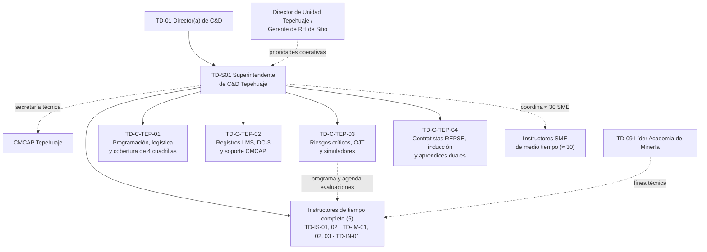
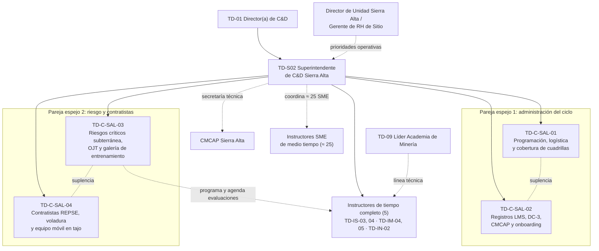
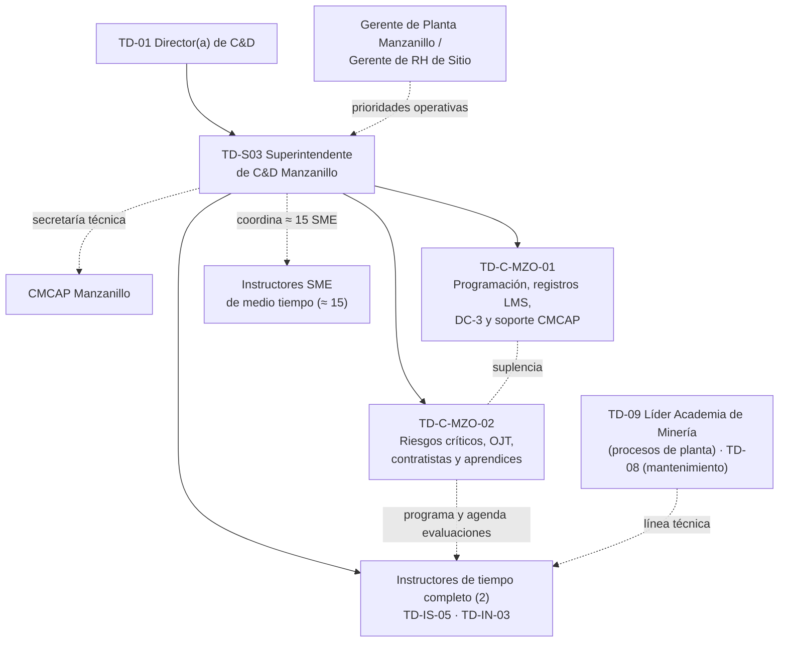
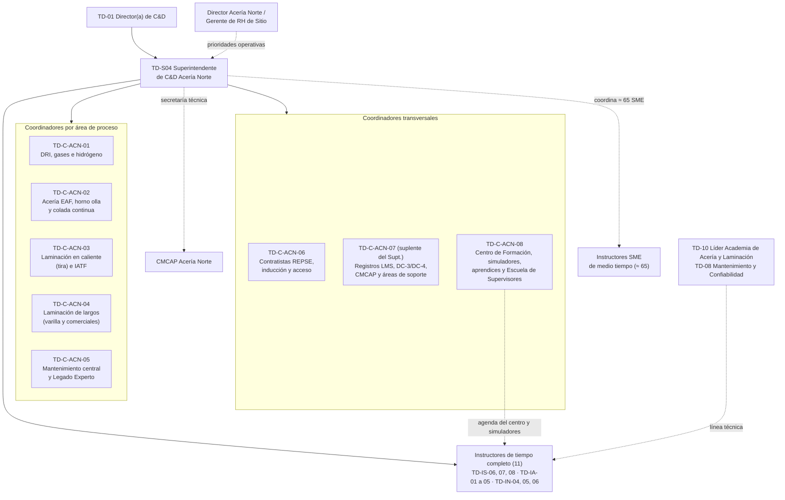
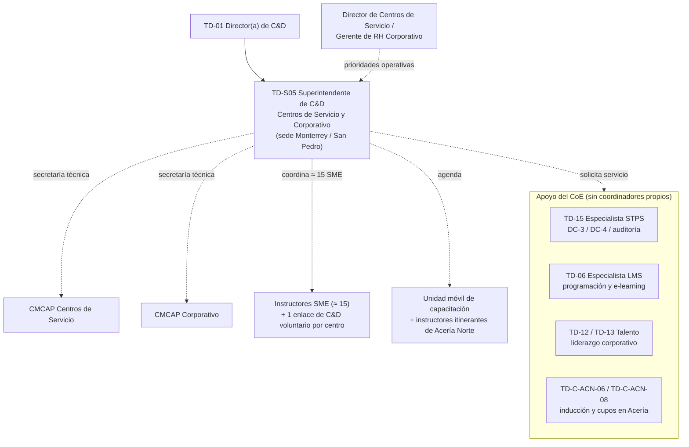

# 04 — Equipos de C&D de Sitio (23 plazas) e Instructores Internos SME de medio tiempo

> **Alcance:** los 5 Superintendentes de C&D de Sitio (TD-S01 a TD-S05), los 18 Coordinadores de C&D (TD-C-…) y la figura del Instructor Interno SME de medio tiempo (≈ 150 personas, **no son plantilla** de la Academia).
>
> **Documentos base con los que este documento es consistente:** `03-department-design/department-design.md` (modelo *hub-and-spoke*, organigrama, RACI), `03-department-design/training-and-development-policy.md` (POL-RH-TD-001), `04-processes/process-manual.md` (TD-P01 a TD-P12) y `08-kpis/kpi-scorecard.md`. Índice general: [00-organigrama-general.md](00-organigrama-general.md).
>
> **Convención:** línea continua = reporte jerárquico (sólido); línea punteada = reporte funcional u operativo. "Año 1" = metas del año 1 del *scorecard*.

---

## 0. Principios del diseño de los equipos de sitio

1. **El sitio entrega, el CoE define.** El equipo de sitio es dueño de la DNC, la programación, la entrega, el seguimiento del OJT, la emisión de DC-3, la secretaría de la CMCAP y la inducción de contratistas. **No diseña programas corporativos nuevos**: los solicita al CoE (department-design §2).
2. **Primero lo que salva vidas.** La cartera de *certificación de riesgos críticos* (TD-P07) existe en todos los sitios con coordinadores. Es la cartera que se protege primero ante vacantes o ausencias.
3. **Cada coordinador tiene una cartera y un suplente.** Las carteras se asignan para que nadie sea el único que sabe hacer algo. Cada coordinador está capacitado de forma cruzada en la cartera de otro compañero.
4. **El turno manda.** Los sitios operan 24/7 (4x4 de 12 h en plantas y en Tepehuaje; 14x7 en Sierra Alta). La capacitación se programa dentro del rol, en los días protegidos que acuerda TD-P03, y el equipo de C&D ajusta su presencia a los relevos, no al revés.

### 0.1 Distribución de coordinadores: justificación

| Sitio | Empleados | Contratistas (estimado)¹ | Coordinadores | Empleados por coordinador | Criterio |
|---|---|---|---|---|---|
| Tepehuaje | 1,450 | ≈ 900 | 4 | ≈ 363 | Tajo abierto con voladura y flota de 240 t. Aquí ocurrió una de las 2 fatalidades (atropellamiento por equipo móvil). 4 cuadrillas en 4x4 y el Centro de Formación Minera con los simuladores de acarreo. |
| Sierra Alta | 1,100 | ≈ 700 | 4 | ≈ 275 | Menos gente que Tepehuaje, pero **mayor riesgo** (subterránea: control de terreno, ventilación, rescate) y **rol 14x7**: en cualquier momento solo una parte de la plantilla y del equipo está en sitio. Se necesitan **2 parejas en relevo espejo** para que cada cartera tenga siempre a alguien presente. |
| Manzanillo | 800 | ≈ 400 | 2 | ≈ 400 | Sitio más chico y de proceso continuo (peletizado grate-kiln y carga portuaria). 2 es el mínimo que permite tener suplencia. |
| Acería Norte | 3,900 | ≈ 1,700 | 8 | ≈ 488 | El sitio más grande y con más riesgos críticos distintos (metal líquido, gases e hidrógeno, grúas, EAF). Hay economía de escala: Centro de Formación Técnica, piloto del LMS y 11 instructores de tiempo completo. Por eso los coordinadores se asignan **por área de proceso** más 3 carteras transversales. |
| Centros de servicio + Corporativo | 1,250 | ≈ 300 | **0** | – | Menor riesgo relativo y población dispersa en 4 ubicaciones. Lo cubre el TD-S05 con apoyo del CoE (ver §2.4). |
| **Total** | **8,500** | **≈ 4,000** | **18** | | |

¹ *Supuesto de trabajo.* Los documentos base solo dan el total de ≈ 4,000 contratistas REPSE, sin desglose por sitio. El desglose es una estimación para dimensionar la inducción y debe sustituirse con datos del portal de contratistas.

### 0.2 Instructores de tiempo completo por sitio (referencia)

Los 24 instructores de tiempo completo reportan en línea sólida al Superintendente del sitio y en línea técnica a su Academia o a Seguridad (ver [00](00-organigrama-general.md)). La asignación **oficial** está en el documento [02](02-academias-tecnicas-e-instructores.md). La asignación de abajo es la que usa este documento para dimensionar la carga.

| Sitio | Seguridad / riesgos críticos (8) | Minería (5) | Acería y Laminación (5) | Mantenimiento (6) | Total |
|---|---|---|---|---|---|
| Tepehuaje | TD-IS-01, 02 | TD-IM-01, 02, 03 | – | TD-IN-01 | 6 |
| Sierra Alta | TD-IS-03, 04 | TD-IM-04, 05 | – | TD-IN-02 | 5 |
| Manzanillo | TD-IS-05 | – | – | TD-IN-03 | 2 |
| Acería Norte | TD-IS-06, 07, 08 | – | TD-IA-01 a 05 | TD-IN-04, 05, 06 | 11 |
| Centros + Corporativo | – (lo cubren itinerantes de Acería Norte y los SME) | – | – | – | 0 |
| **Total** | **8** | **5** | **5** | **6** | **24** |

> Según el plan de contratación por fases, los 16 instructores técnicos se incorporan entre los meses 12 y 24. En el año 1, los sitios operan con los instructores de Seguridad, el personal que viene de la transición y los instructores SME.

---

## 1. Mini-organigramas por sitio

### 1.1 TD-S01 — Unidad Minera Cerro Tepehuaje (1,450; 4x4 de 12 h)

### 1.2 TD-S02 — Unidad Minera Sierra Alta (1,100; rol 14x7)

### 1.3 TD-S03 — Planta Peletizadora Manzanillo (800; 4x4 de 12 h)

### 1.4 TD-S04 — Complejo Acería Norte (3,900; 4x4 de 12 h)

### 1.5 TD-S05 — Centros de Servicio (Monterrey, Querétaro, Silao) y Corporativo (1,250)

---

## 2. Descripción de puesto — Superintendente de C&D de Sitio (genérica)

### 2.1 Identificación

| Campo | Valor |
|---|---|
| Puesto | Superintendente de Capacitación y Desarrollo de Sitio |
| Códigos | TD-S01 Tepehuaje · TD-S02 Sierra Alta · TD-S03 Manzanillo · TD-S04 Acería Norte · TD-S05 Centros de Servicio y Corporativo |
| Nivel | Superintendencia (personal de confianza) |
| Reporta a (línea sólida) | **TD-01 Director(a) de C&D**: estándares, presupuesto, desempeño, contratación y remoción |
| Reporta a (línea punteada) | **Director de Sitio / Gerente de RH de Sitio**: prioridades operativas, liberación de personal, alineación con los roles de turno, relación laboral local |
| Le reportan | Coordinadores de C&D del sitio (0 a 8) e instructores de tiempo completo asignados (0 a 11). Además coordina funcionalmente a los instructores SME del sitio |
| Foros | T&D Operations Review mensual (miembro), CMCAP del sitio (secretaría técnica), Academy Boards (invitado según el tema), comité de seguridad del sitio (invitado) |

### 2.2 Propósito

Asegurar que **cada persona que trabaja en el sitio, empleado o contratista, sea competente, esté certificada y trabaje segura**. Para eso dirige el ciclo anual de capacitación del sitio (DNC → DC-2 → entrega → certificación → registros → evaluación) con los estándares de la Academia GASM, cumple la LFT (Cap. III Bis) y las NOM-STPS, y contribuye a los KPI del negocio del sitio.

### 2.3 Funciones principales

| # | Función | % tiempo | Proceso |
|---|---|---|---|
| 1 | Dirigir el **Diagnóstico de Necesidades (DNC)** del sitio: arranca en septiembre, envía matrices y cuestionarios, asegura que las brechas de tareas críticas salgan de registros de certificación (no de opiniones), prioriza P1/P2/P3, valida con el Director de Sitio y la CMCAP y entrega al CoE antes del 30 de noviembre | 10% | TD-P02 |
| 2 | Integrar el **Plan Anual DC-2** y el presupuesto del sitio: acordar con Planeación de Producción los días protegidos en cada rol de turno, presentar el plan a la CMCAP para su aprobación en enero (a más tardar el 31) y hacer la revisión trimestral de recuperación y repriorización | 10% | TD-P03 |
| 3 | Dirigir la **entrega y la logística**: calendario publicado con ≥ 3 semanas de anticipación, junta semanal con producción, control de ausencias y cancelaciones (72 h), uso de aulas, simuladores y transporte | 15% | TD-P05 |
| 4 | Garantizar el **100% de certificación en tareas críticas**: tablero semanal de cobertura, vencimientos a 30/60/90 días, agenda de evaluaciones ≤ 15 días después de terminar el OJT, límite de 12 certificaciones por evaluador por día y tarea, bloqueo de certificaciones suspendidas en el LMS, que está integrado al sistema de permisos. Coordinación con HSE, dueño del control | 15% | TD-P07 |
| 5 | Asegurar el **cumplimiento STPS** del sitio: DC-3 en ≤ 10 días hábiles, expediente listo para inspección, atención a la autoauditoría trimestral del 5% y cierre de hallazgos | 8% | TD-P09 |
| 6 | Ejercer la **secretaría técnica de la CMCAP**: calendario de ≥ 4 sesiones al año, orden del día, minutas, seguimiento de acuerdos (≥ 90%), firma de DC-3, informe anual al Foro Corporativo Sindicato–Empresa | 7% | TD-P11 |
| 7 | Asegurar la **inducción de empleados y contratistas**: "Bienvenida GASM" (90 días), portal REPSE, validación de documentos en 3 días hábiles, inducción de 4 h + módulo de sitio, bloqueo de acceso sin inducción vigente, renovación anual | 8% | TD-P08 |
| 8 | **Gestionar a los instructores** de tiempo completo y SME del sitio: carga anual, liberaciones con los jefes de línea, observación 2 veces al año, calificación L1, validación mensual de horas SME, propuesta de nuevos SME a la Academy Board, evaluación de proveedores locales | 10% | TD-P12 |
| 9 | **Evaluación y reporte**: L1/L2 en el 100% de los cursos, seguimiento de L3 a 60–90 días con los supervisores, cierre mensual de datos antes del 5º día hábil, reporte mensual al Director de Sitio, insumos para estudios de ROI | 7% | TD-P06 |
| 10 | Impulsar **Legado Experto** y las solicitudes al CoE: identificar a los expertos en riesgo del sitio, formalizar acuerdos de mentoría y levantar *Design Briefs* para las necesidades que requieren un programa nuevo | 5% | TD-P10 / TD-P04 |
| 11 | **Dirigir al equipo de sitio**: objetivos, capacitación cruzada de carteras, desarrollo de coordinadores, clima y cumplimiento de su propio plan de certificaciones (EC0217.01 / EC0301) | 5% | Transversal |
| | **Total** | **100%** | |

### 2.4 Autoridad y decisiones

| Decide solo | Decide con aprobación o consulta | No puede |
|---|---|---|
| Calendario del sitio y reprogramación de cursos P2/P3 | Plan DC-2 del sitio (lo aprueba la CMCAP; el responsable final es el Director de C&D) | Cancelar capacitación P1 o de riesgos críticos por motivos de producción. Solo puede **reprogramarla dentro de 30 días** (política 6.1) |
| Asignar instructores de tiempo completo y SME a los cursos | Gasto del sitio dentro del presupuesto aprobado, según la matriz de facultades de GASM (montos definidos por Finanzas) | Autorizar a una persona sin certificación vigente para una tarea crítica, ni aceptar excepciones (política §4.1 y §7) |
| Negar el ingreso a una sesión a quien no cumple prerrequisitos o no trae el EPP | Alta de SME (la aprueba la Academy Board) y alta de proveedores (la aprueba el CoE, con DC-5) | Contratar proveedores fuera del catálogo o sin registro STPS (DC-5) |
| Suspender en el LMS una certificación después de un incidente grave, a solicitud de HSE o del jefe de línea, hasta la reevaluación | Cargar cancelaciones tardías de cursos externos al centro de costos del área solicitante (política 6.2) | Diseñar programas corporativos nuevos (los solicita al CoE) |
| Bloquear el acceso de contratistas sin inducción o certificación vigente (vía Seguridad Patrimonial) | Contratación y remoción de coordinadores (con el Director de C&D y RH de Sitio) | Modificar las definiciones de los KPI (solo lo hace el Learning Council) |
| Escalar al Director de Sitio y al Director de C&D cuando no se libera personal para P1 | Acuerdos de horario de capacitación fuera de jornada (con la CMCAP y el sindicato, conforme al CCT) | Firmar DC-3 en lugar de los representantes de la CMCAP |

### 2.5 KPIs y metas del año 1 (de `kpi-scorecard.md`)

| KPI | Meta año 1 | Papel del Superintendente |
|---|---|---|
| Certificación de tareas críticas | **100%** (semanal) | Dueño en el sitio, junto con HSE |
| Certificaciones vigentes | 95% | Dueño |
| Cumplimiento de capacitación obligatoria (P1) | 95% | Dueño |
| Inducción de contratistas antes del acceso | **100%** (semanal) | Dueño |
| DC-3 a tiempo (≤ 10 días hábiles) | 90% | Responsable en el sitio (el dueño es Cumplimiento) |
| Hallazgos STPS sobre capacitación | 0 | Responsable en el sitio |
| CMCAP activa (≥ 4 sesiones al año) | Sitio activo (contribuye al 6/6) | Secretaría técnica (el dueño del KPI es RH de Sitio) |
| Horas por empleado | 44 | Contribuye (dueño: Director de C&D) |
| Satisfacción L1 / aprobación L2 al primer intento | 4.2 / 80% | Contribuye (dueño: CoE) |
| Participación de la entrega interna | 50% | Contribuye (dueño: CoE) |
| Variación presupuestal | ±5% | Presupuesto del sitio |
| Adopción del LMS | 80% | Contribuye (dueño: Digital) |
| Indicadores de proceso | Cumplimiento del plan ≥ 90% de horas; asistencia ≥ 95%; ausencias ≤ 5%; ≥ 90% de trabajadores con brecha evaluada | TD-P02, TD-P03, TD-P05 |
| Resultado de negocio al que contribuye | Fatalidades 0; LTIFR 2.9 | Apoya a HSE (dueño: VP de Seguridad) |

### 2.6 Interacciones clave

| Con quién | Para qué | Frecuencia |
|---|---|---|
| **Sindicato / CMCAP** | Aprobación del DC-2, firma de DC-3, seguimiento del plan, alineación con el escalafón del CCT y horarios de capacitación | Al menos trimestral (sesión formal) y contacto semanal con el secretario sindical de capacitación |
| **Producción / Planeación** | Días protegidos en el rol, liberación de personal, cobertura del turno, OJT | Semanal |
| **Seguridad (HSE)** | Estándares de riesgo crítico, suspensión y reevaluación después de incidentes, VCC mensual, ejercicios de emergencia | Semanal |
| **Contratistas y Seguridad Patrimonial** | Portal REPSE, inducción, bloqueo de acceso, auditoría de evaluadores acreditados de contratistas | Semanal |
| **Mantenimiento / Confiabilidad** | Ventanas de paro para capacitación práctica, Legado Experto, CMMS | Mensual |
| **STPS (inspectores)** | Atención de inspecciones con el kit de preparación y con Cumplimiento del CoE | Por evento |
| **CONALEP / Universidades Tecnológicas** | Modelo Dual: convenios, tutores, rotaciones, laboratorios compartidos | Mensual |
| **Compras / Finanzas** | Órdenes de compra del catálogo, presupuesto, cargos por cancelación | Mensual |
| **TI / TO** | LMS, integración con permisos de trabajo y control de acceso, kioscos | Por evento |
| **CoE corporativo** | Ver §7 | Semanal a mensual |

### 2.7 Perfil

| Dimensión | Requisito |
|---|---|
| Escolaridad | Licenciatura en ingeniería, psicología, pedagogía, administración o afín. Deseable posgrado en desarrollo organizacional o educación de adultos |
| Experiencia | **7 años o más en C&D en la industria**, de preferencia en minería, acero o proceso continuo, en un entorno **sindicalizado**. Al menos 3 años al frente de un equipo |
| Certificaciones | **EC0217.01** obligatoria; **EC0301** (diseño) deseable o en proceso dentro del primer año. Formación como evaluador (16 h) |
| Conocimientos | LFT Título IV Cap. III Bis (DC-2/3/4/5, CMCAP, Art. 153-U), NOM-STPS aplicables al sitio (NOM-023 en minas), REPSE, ISO 10015, Kirkpatrick/Phillips, LMS y Excel o Power BI a nivel intermedio |
| Competencias | Negociación con el sindicato y con producción, liderazgo en campo (se le ve en el turno), orientación al dato, rigor en el cumplimiento y comunicación clara con población operativa |
| Idioma | Español; inglés técnico de lectura deseable (manuales de OEM) |

### 2.8 Condiciones de trabajo

- **Base en el sitio**. Horario administrativo con presencia programada en los relevos de turno (07:00 / 19:00) y al menos una visita nocturna al mes para ver al turno de noche.
- Exposición a áreas operativas (tajo, subterránea, nave de acería, laminación). EPP completo y cumplimiento de las reglas de riesgo crítico. Sierra Alta: rol ajustado a la operación (ver TD-S02) y estancia en campamento cuando aplica.
- Viajes: juntas mensuales en Monterrey (T&D Operations Review, o de forma virtual) y visitas a otros sitios para compartir prácticas. TD-S05 viaja con frecuencia entre Monterrey, Querétaro y Silao.
- Disponibilidad para atender inspecciones STPS e investigaciones de incidentes.

### 2.9 Plan de 90 días

| Periodo | Objetivos | Entregable |
|---|---|---|
| **Días 1–30: entender y estabilizar** | Conocer al Director de Sitio, a HSE, a producción, al sindicato y a la CMCAP. Inventario de certificaciones de tareas críticas (quién está haciendo tareas críticas sin evidencia). Estado de los DC-3 pendientes. Revisar el acceso de contratistas. Evaluar la competencia del personal que viene de la antigua oficina de "Capacitación" | Línea base de cumplimiento del sitio; lista roja de tareas críticas sin certificar con plan de choque; calendario de la CMCAP |
| **Días 31–60: ordenar** | Asignar las carteras a los coordinadores (tabla §3.9). Sesión de la CMCAP (reactivación si estaba inactiva). Arrancar el *quick win 1* (rezago de DC-3 y certificación de alturas, espacios confinados y trabajos eléctricos) y, en Acería y Tepehuaje, el *quick win 2* (inducción de 4 h ligada al acceso). Acordar con producción los días protegidos | Carteras publicadas; minuta de la CMCAP; rezago de DC-3 en reducción semanal; acuerdo de días protegidos por cuadrilla |
| **Días 61–90: operar el sistema** | Calendario de 3 semanas rodantes en el LMS (o su puente mientras se implementa). Tablero semanal de certificación. Inventario de candidatos a SME. Primer reporte mensual al Director de Sitio. Identificación de expertos en riesgo (Legado Experto) | Tablero de sitio operando; 100% de trabajadores de tareas críticas certificados o programados; lista de SME propuestos a la Academy Board |

### 2.10 Lo específico de cada superintendente

| Código | Sitio | Retos principales | Prioridades del año 1 | Particularidad del puesto |
|---|---|---|---|---|
| **TD-S01** | Tepehuaje (1,450 + ≈ 900 contratistas; 4x4) | Fatalidad por atropellamiento de equipo móvil; interacción vehículo–peatón; voladura; flota de 240 t (costo de combustible); tiempo a la competencia de 9 meses para operadores de acarreo | 100% de certificación en equipo móvil, explosivos e interacción vehículo–peatón. Inducción de contratistas ligada al acceso (*quick win 2*). Centro de Formación Minera (mejora) y preparación para los simuladores de acarreo y pala (año 2) | Anfitrión de la Academia de Minería. Contribuye al KPI de eficiencia de combustible (99 en el año 1) y al de tiempo a la competencia (8 meses) |
| **TD-S02** | Sierra Alta (1,100 + ≈ 700; 14x7; tajo + subterránea) | Rol 14x7: solo una parte de la gente está en sitio. Riesgo subterráneo (control de terreno, ventilación, refugios, rescate). Ubicación remota en Coahuila y rotación de técnicos | Certificación en control de terreno y espacios confinados. Galería de entrenamiento (*training drift*). Programación en los días de relevo. Operar las 2 parejas espejo | Trabaja un rol **5x2 con presencia garantizada en cada cambio de cuadrilla**. Cuando no está, el suplente es el coordinador de la pareja 2 que esté en sitio (ver §3.9 y §6.3) |
| **TD-S03** | Manzanillo (800 + ≈ 400; 4x4) | Equipo mínimo (2 coordinadores). Proceso continuo grate-kiln, bandas transportadoras, espacios confinados en filtrado y hornos, carga portuaria (interfaz con autoridades portuarias). Contratistas de puerto y limpieza industrial | Certificación en bandas, LOTO, espacios confinados y cargas suspendidas. Inducción portuaria de contratistas. Primera generación de 10 aprendices duales | Cubre él mismo parte de la operación (es suplente directo de ambos coordinadores). Usa la línea técnica de Minería (procesos de planta) y de Mantenimiento |
| **TD-S04** | Acería Norte (3,900 + ≈ 1,700; 4x4) | Mayor población y más riesgos críticos distintos (metal líquido, EAF, gas e hidrógeno, grúas, ollas). Fatalidad de un contratista por caída de altura en laminación. Rotación de técnicos jóvenes por la cercanía de las armadoras. IATF 16949 | Piloto del LMS (primero en implantarse). Certificación en metal líquido, grúas, alturas y contratistas de laminación. Arranque de la construcción del Centro de Formación Técnica (año 1–2). 30 aprendices duales. Escuela de Supervisores (la mayor parte de los ≈ 650 supervisores) | Tramo de control amplio: 8 coordinadores + 11 instructores. **TD-C-ACN-07 es su suplente formal.** Contribuye a la disponibilidad del EAF (87% en el año 1) |
| **TD-S05** | Centros de servicio Monterrey/Querétaro/Silao + Corporativo (1,250 + ≈ 300; horarios mixtos) | **0 coordinadores**. Población dispersa en 4 ubicaciones. Riesgos críticos presentes en los centros (grúas viajeras, cargas suspendidas, LOTO en cortadoras y slitters, interacción montacargas–peatón). En el corporativo pesa el liderazgo y el desarrollo profesional | Certificación en grúas, LOTO e interacción vehículo–peatón en los 3 centros. 2 CMCAP activas. Uso de la unidad móvil. Oferta de liderazgo y e-learning para el corporativo | Opera con **servicios compartidos del CoE**. Ver el modelo operativo abajo |

**Modelo operativo del TD-S05 (sin coordinadores).** El `department-design.md` fija 0 coordinadores para Centros de servicio y Corporativo ("cubierto por corporativo"). El TD-S05 opera así:

1. **Sede en Monterrey / San Pedro**, cerca del CoE, con visitas programadas: Monterrey semanal, Querétaro y Silao cada 2 semanas en alternancia.
2. **Servicios compartidos del CoE**, con acuerdos de nivel de servicio (ver §7):
   - TD-15 (Especialista STPS): emisión de DC-3, DC-4/SIRCE y autoauditoría de estas ubicaciones.
   - TD-06 (Especialista LMS): programación, inscripciones masivas y e-learning.
   - TD-12/TD-13 (Talento): oferta de liderazgo del corporativo.
3. **Apoyo de Acería Norte:** cupos en el Centro de Formación Técnica y simuladores de grúa para los operadores de Monterrey, instructores itinerantes de Seguridad y Mantenimiento, e inducción de contratistas mediante el mismo portal REPSE que opera TD-C-ACN-06.
4. **Unidad móvil de capacitación** (una de las 2 del caso de negocio) para Querétaro y Silao.
5. **Enlaces de C&D en cada centro:** un empleado administrativo o de RH de cada centro dedica unas horas a la semana a la logística local (aulas, listas, asistencia QR). No es plantilla de la Academia ni sustituye a un coordinador.
6. **Métrica de alerta:** si durante 2 trimestres seguidos la certificación de tareas críticas o el DC-3 a tiempo de estas ubicaciones cae por debajo de la meta, el TD-S05 pide en el T&D Operations Review revisar el dimensionamiento (fase 3 del plan de contratación).

---

## 3. Descripción de puesto — Coordinador(a) de C&D (genérica)

### 3.1 Identificación

| Campo | Valor |
|---|---|
| Puesto | Coordinador(a) de Capacitación y Desarrollo |
| Códigos | TD-C-TEP-01 a 04 · TD-C-SAL-01 a 04 · TD-C-MZO-01 a 02 · TD-C-ACN-01 a 08 (18 plazas) |
| Nivel | Coordinación (personal de confianza) |
| Reporta a (línea sólida) | Superintendente de C&D del sitio |
| Reporta a (línea punteada) | Para los coordinadores por área de Acería Norte: el Gerente del área de proceso que atiende, en temas de prioridades operativas |
| Le reportan | Nadie. Asigna y agenda funcionalmente a instructores y SME dentro de su cartera |
| Suplencia | Cada coordinador tiene un suplente designado (§3.9) |

### 3.2 Propósito

Planear, organizar y administrar la capacitación de su **cartera** (un área, un turno o un proceso transversal) para que la gente correcta reciba la capacitación correcta a tiempo, con registros exactos y conforme a la STPS, y para que ninguna persona haga una tarea crítica sin certificación vigente.

### 3.3 Funciones principales

Estos porcentajes son la **línea base**. Cada cartera los ajusta ±10 puntos: por ejemplo, un coordinador de contratistas dedica más tiempo a TD-P08 y un coordinador de registros más tiempo a TD-P09.

| # | Función | % tiempo | Proceso |
|---|---|---|---|
| 1 | **Programar en el LMS** y publicar el calendario con ≥ 3 semanas de anticipación. Enviar convocatorias al trabajador y a su supervisor y confirmar la cobertura del turno | 20% | TD-P05 |
| 2 | **Logística**: aula, simulador, EPP, materiales, transporte (minas), comidas en sesiones largas, accesibilidad | 12% | TD-P05 |
| 3 | **Registros**: asistencia por QR o biometría, carga en el LMS en ≤ 48 h (incluidos los formatos en papel), reporte de ausencias al supervisor en ≤ 24 h | 15% | TD-P05 / TD-P09 |
| 4 | **DC-3**: generarlas desde el LMS, recabar las firmas del instructor y de la CMCAP, entregarlas en ≤ 10 días hábiles y archivar la copia en el expediente | 10% | TD-P09 |
| 5 | **Seguimiento de OJT y certificación**: bitácoras de horas mínimas, agenda de evaluaciones ≤ 15 días después del OJT, registro ≤ 48 h, alertas de vencimiento a 30/60/90 días, apoyo a la VCC mensual | 15% | TD-P07 |
| 6 | **Inducción**: Bienvenida GASM (empleados) y, cuando aplica, validación de documentos de contratistas (3 días hábiles) y sesiones de inducción | 8% | TD-P08 |
| 7 | **Apoyo a la DNC**: distribuir y recolectar cuestionarios, consolidar las brechas de su cartera | 6% | TD-P02 |
| 8 | **Apoyo al DC-2**: cargar el plan de su cartera en la plantilla y dar seguimiento trimestral | 4% | TD-P03 |
| 9 | **Evaluación**: encuestas L1, registro de L2, recordatorio y recolección de L3 a 60–90 días | 5% | TD-P06 |
| 10 | **Apoyo a la CMCAP**: evidencias, borrador de minutas y seguimiento de acuerdos de su cartera | 3% | TD-P11 |
| 11 | **Apoyo a instructores y SME**: asignación, materiales, registro de horas SME para su validación | 2% | TD-P12 |
| | **Total** | **100%** | |

### 3.4 Autoridad y decisiones

| Decide solo | Con aprobación del Superintendente | No puede |
|---|---|---|
| Programar y reprogramar sesiones P2/P3 de su cartera | Reprogramar un curso P1 (siempre dentro de 30 días) | Cancelar capacitación P1 o de riesgos críticos |
| Negar el ingreso a quien no cumple prerrequisitos o no trae el EPP | Excepciones de logística con costo (transporte o comidas adicionales) | Registrar como aprobado a alguien que no alcanzó el 80% o el 100% en los pasos críticos |
| Marcar en el LMS la inducción de contratistas como no válida por documentos incompletos | Solicitar un proveedor externo del catálogo | Emitir DC-3 sin las firmas requeridas |
| Escalar al supervisor y al superintendente las ausencias y las certificaciones por vencer | | Autorizar el acceso o una tarea crítica sin certificación vigente |

### 3.5 KPIs y metas del año 1

| KPI | Meta año 1 | Fuente |
|---|---|---|
| Registros en el LMS en ≤ 48 h | 100% | TD-P05 |
| DC-3 a tiempo (≤ 10 días hábiles) | 90% | *Scorecard* |
| Asistencia / ausencias | ≥ 95% / ≤ 5% | TD-P05 |
| Exactitud en la autoauditoría | ≥ 98% | TD-P09 |
| KPI principal de su cartera | Ver tabla §3.9 | *Scorecard* |

### 3.6 Interacciones

Supervisores y jefes de turno (a diario); instructores y SME (a diario); HSE (semanal); Seguridad Patrimonial y empresas contratistas (según la cartera); representantes de la CMCAP (firma de DC-3 y evidencias); Compras (órdenes de compra); CONALEP/UT (cartera de aprendices); CoE: Especialista LMS (TD-06) y Especialista STPS (TD-15).

### 3.7 Perfil

| Dimensión | Requisito |
|---|---|
| Escolaridad | Licenciatura (ingeniería industrial o de procesos, psicología, pedagogía, administración). Para la cartera de riesgos críticos y las de área de Acería se prefiere ingeniería o TSU con experiencia operativa |
| Experiencia | 2–4 años en capacitación, RH o seguridad en la industria. Experiencia con población sindicalizada |
| Certificaciones | **EC0217.01** (o en proceso, obtenida en los primeros 12 meses) |
| Conocimientos | LMS, Excel avanzado, formatos DC-3/DC-4, NOM de su cartera, REPSE (cartera de contratistas), Modelo Mexicano de Formación Dual (cartera de aprendices) |
| Competencias | Organización, orden documental, servicio al turno, firmeza para aplicar las reglas ("sin certificación no hay tarea crítica") |

### 3.8 Condiciones de trabajo

Base en el sitio. Horario administrativo con presencia en los relevos de turno según la cartera. Los coordinadores de cobertura por turno pueden tener horario escalonado (06:00–15:00 o 10:00–19:00) para cubrir ambos relevos. **En Sierra Alta los 4 coordinadores trabajan el rol 14x7 en relevo espejo escalonado** (§6.3). Exposición a áreas operativas con EPP.

### 3.9 Tabla de asignación individual de los 18 coordinadores

| Código | Sitio | Cartera / especialidad | Áreas o turnos que atiende | Población aprox. | Procesos principales | KPI principal | Suplente |
|---|---|---|---|---|---|---|---|
| **TD-C-TEP-01** | Tepehuaje | Programación, logística y **cobertura de las 4 cuadrillas** (A–D, 4x4) | Todo el sitio; enlace con Planeación de Mina para los días protegidos | 1,450 | TD-P03, TD-P05 | Cumplimiento del plan (≥ 90% de horas); ausencias ≤ 5% | TEP-02 |
| **TD-C-TEP-02** | Tepehuaje | **Registros LMS, DC-3** y soporte a la CMCAP; Bienvenida GASM | Todo el sitio | 1,450 + ≈ 900 contratistas (registros) | TD-P09, TD-P11, TD-P08 (empleados) | DC-3 a tiempo 90%; 0 hallazgos STPS | TEP-01 |
| **TD-C-TEP-03** | Tepehuaje | **Certificación de riesgos críticos, OJT y simuladores** (equipo móvil, explosivos y voladura, interacción vehículo–peatón, bandas); Centro de Formación Minera | Mina (perforación, voladura, carga y acarreo), trituración y concentración | ≈ 950 en tareas críticas | TD-P07, TD-P06 (L3) | Certificación de tareas críticas **100%**; tiempo a la competencia del operador de acarreo 8 meses | TEP-04 |
| **TD-C-TEP-04** | Tepehuaje | **Inducción de contratistas y portal REPSE**; aprendices duales (≈ 12, CONALEP/UT); logística local de la Escuela de Supervisores | Accesos, empresas de servicios mineros y voladura; tutores de aprendices | ≈ 900 contratistas + 12 aprendices | TD-P08, TD-P07 (contratistas) | Inducción de contratistas antes del acceso **100%** | TEP-03 |
| **TD-C-SAL-01** | Sierra Alta | Programación, logística y **cobertura de las 3 cuadrillas del 14x7** (tajo, subterránea y concentradora); días de relevo | Todo el sitio. **Pareja espejo 1** | 1,100 | TD-P03, TD-P05 | Cumplimiento del plan (≥ 90%); ausencias ≤ 5% | SAL-02 (espejo) |
| **TD-C-SAL-02** | Sierra Alta | **Registros LMS, DC-3**, soporte a la CMCAP, Bienvenida GASM y aprendices duales (≈ 8) | Todo el sitio. **Pareja espejo 1** | 1,100 + 8 aprendices | TD-P09, TD-P11, TD-P08 | DC-3 a tiempo 90%; 0 hallazgos STPS | SAL-01 (espejo) |
| **TD-C-SAL-03** | Sierra Alta | **Riesgos críticos subterráneos y OJT**: control de terreno, amacice y anclaje, ventilación, refugios, rescate, espacios confinados; galería de entrenamiento y VR | Mina subterránea (tumbe por subniveles) y servicios subterráneos. **Pareja espejo 2** | ≈ 450 | TD-P07, TD-P10 | Certificación de tareas críticas **100%** (subterránea) | SAL-04 (espejo) |
| **TD-C-SAL-04** | Sierra Alta | **Contratistas REPSE** (desarrollo subterráneo, voladura, mantenimiento) y **certificación en tajo**: equipo móvil, explosivos | Tajo, concentradora, accesos. **Pareja espejo 2** | ≈ 700 contratistas + ≈ 400 en tareas críticas del tajo | TD-P08, TD-P07 | Inducción de contratistas **100%**; certificaciones vigentes 95% | SAL-03 (espejo) |
| **TD-C-MZO-01** | Manzanillo | Programación, logística, **registros LMS, DC-3** y soporte a la CMCAP (cartera administrativa integral) | Todo el sitio, 4 cuadrillas 4x4 | 800 | TD-P03, TD-P05, TD-P09, TD-P11 | DC-3 a tiempo 90%; P1 95% | MZO-02 |
| **TD-C-MZO-02** | Manzanillo | **Riesgos críticos y OJT** (bandas, LOTO, espacios confinados en filtros y horno, cargas suspendidas en el puerto); **contratistas portuarios REPSE**; aprendices duales (10) | Recepción del ducto, filtrado, peletizado, embarque portuario | ≈ 500 en tareas críticas + ≈ 400 contratistas + 10 aprendices | TD-P07, TD-P08 | Certificación de tareas críticas **100%**; inducción **100%** | MZO-01 |
| **TD-C-ACN-01** | Acería Norte | **Área DRI**: reactor y reformador, sistemas de gas e **hidrógeno**, espacios confinados; seguimiento de L3 del área | Planta DRI, 4 cuadrillas | ≈ 450 | TD-P02, TD-P05, TD-P07 | Certificación en gas e hidrógeno **100%** | ACN-02 |
| **TD-C-ACN-02** | Acería Norte | **Área Acería EAF, horno olla y colada continua**: metal líquido, ollas, EAF, grúas de nave; simulador de proceso EAF | Nave de hornos, hornos olla, colada, 4 cuadrillas | ≈ 1,000 | TD-P05, TD-P07, TD-P06 | Certificación en metal líquido y EAF **100%**; apoyo a la disponibilidad del EAF (87%) | ACN-01 |
| **TD-C-ACN-03** | Acería Norte | **Área Laminación en caliente (tira)** y **calidad IATF 16949** (core tools, 8D) | Tren de tira, acabado, calidad | ≈ 700 | TD-P05, TD-P07, TD-P06 | Certificación en grúas, LOTO y alturas **100%**; L3 60% | ACN-04 |
| **TD-C-ACN-04** | Acería Norte | **Área Laminación de largos** (varilla y perfiles comerciales): alturas (lección de la fatalidad), LOTO, contratistas de laminación en campo | Molino de barras y varilla, embarques | ≈ 600 | TD-P05, TD-P07 | Certificación en trabajo en alturas **100%** (empleados y contratistas del área) | ACN-03 |
| **TD-C-ACN-05** | Acería Norte | **Mantenimiento central y confiabilidad**: eléctrico (NOM-029), hidráulica, PLC; **Legado Experto** del sitio; comunidades de práctica | Talleres centrales, eléctrico, confiabilidad | ≈ 700 | TD-P07, TD-P10 | Transferencia de conocimiento: 50% de expertos en riesgo con plan activo | ACN-08 |
| **TD-C-ACN-06** | Acería Norte | **Contratistas REPSE, inducción y control de acceso**; operador del portal de contratistas; auditoría a evaluadores de contratistas; da servicio también a TD-S05 | Accesos del complejo, todas las empresas REPSE | ≈ 1,700 contratistas | TD-P08, TD-P07 (contratistas) | Inducción de contratistas antes del acceso **100%** | ACN-07 |
| **TD-C-ACN-07** | Acería Norte | **Registros LMS, DC-3/DC-4**, secretaría operativa de la CMCAP, autoauditoría, datos del tablero; áreas de soporte (logística interna, laboratorio, servicios, administración). **Suplente formal del Superintendente** | Todo el sitio (registros) + áreas de soporte | 3,900 (registros); ≈ 450 (soporte) | TD-P09, TD-P11, TD-P06 | DC-3 a tiempo 90%; 0 hallazgos STPS; CMCAP ≥ 4 sesiones | ACN-06 |
| **TD-C-ACN-08** | Acería Norte | **Centro de Formación Técnica y simuladores** (grúa y EAF, VR); **aprendices duales (30)**; logística de la **Escuela de Supervisores**; cupos para TD-S05 | Centro de formación, laboratorios, CONALEP/UT | 30 aprendices + cohortes de supervisores + uso del centro | TD-P05, TD-P08, TD-P12 | Participación de la entrega interna 50%; supervisores formados 40% (contribuye) | ACN-05 |

**Por qué en Acería Norte se asigna por área:** con 3,900 personas en 4 cuadrillas y 5 procesos muy distintos, un coordinador por área conoce a los supervisores, las ventanas de paro y los riesgos de su área. Así el coordinador es el "dueño" completo del ciclo de su gente: DNC, programación, OJT y L3. Las 3 carteras transversales (contratistas, registros y centro de formación) dan escala y control. Ningún coordinador de área emite DC-3 por su cuenta: todos pasan por ACN-07, que es el control único de registros.

---

## 4. Instructor Interno SME de medio tiempo

### 4.1 Definición

Es un trabajador de GASM (sindicalizado o de confianza) reconocido como experto en su oficio (**Nivel 4, Experto/Instructor**, en el marco de competencias TD-P01). Además de su puesto, imparte cursos, conduce OJT, evalúa competencia (si está formado como evaluador) y mentorea, entre **60 y 120 horas al año**. **No es plantilla de la Academia**: sigue reportando a su jefe de línea, y el Superintendente de C&D lo coordina funcionalmente.

### 4.2 Reglas de selección

| Criterio | Regla | Base |
|---|---|---|
| Competencia técnica | Nivel 4 en la materia que va a impartir | TD-P12, TD-P01 |
| Habilidad para comunicar | Microenseñanza de 15 min evaluada por un instructor senior | TD-P12 |
| Aval | Aval escrito de su supervisor (compromete la liberación de horas) | TD-P12 |
| Historial de seguridad | Sin faltas graves a reglas de riesgo crítico en los últimos 24 meses (criterio propuesto) | TD-P12 |
| Aprobación | Academy Board de la materia (o HSE para contenidos de riesgo crítico) | Política 6.7 |
| Prioridad | Expertos con Legado Experto en curso, jubilables en ≤ 3 años y perfiles con diversidad (programa Mujeres que Forjan) | TD-P10 |

### 4.3 Desarrollo y certificación

1. **Formación de instructores**: 40 h.
2. **EC0217.01** (Impartición de cursos presenciales): obligatoria o en proceso; propuesta de obtenerla en los **primeros 12 meses** después del alta.
3. **Formación como evaluador** (16 h) si va a certificar tareas críticas. Límite de 12 certificaciones por día por tarea.
4. Actualización técnica cuando cambian el estándar o el contenido. Recertificación según lo defina la Academy Board.

### 4.4 Carga, liberación y compensación

| Regla | Detalle |
|---|---|
| Horas | **60–120 h/año** por SME, planeadas en el DC-2 y acordadas con su jefe de línea. Más de 120 h requiere autorización del Superintendente de C&D y del jefe de línea, para no descuidar la operación |
| Horario | Dentro de la jornada. Si se imparte fuera de jornada, solo con acuerdo escrito conforme al CCT (política 6.1) |
| Compensación | **Apoyo económico por hora impartida y validada**, con el tabulador que define la política de RH (sin cifra en este documento). Se paga por nómina con las retenciones que marca la ley. El caso de negocio reserva un monto anual global para esta partida (≈ 150 SME), no una tarifa por hora |
| Validación | El SME registra sus horas en el LMS. El coordinador de la cartera las concilia con las listas de asistencia. El Superintendente las valida en el cierre mensual (5º día hábil). Sin registro en el LMS no hay pago |
| Personal sindicalizado | El apoyo no implica cambio de categoría ni de escalafón. Las reglas se acuerdan en el Foro Corporativo Sindicato–Empresa y se informan a la CMCAP |
| Jubilados (Legado Experto) | Pueden seguir como SME con un contrato que cumpla las reglas laborales y fiscales (TD-P10). Nunca en esquemas simulados |

### 4.5 Calidad y reconocimiento

- **Calidad:** observación 2 veces al año por un instructor senior; resultados L1 y L2; meta de calificación del instructor ≥ 4.5/5 (TD-P12). Si queda por debajo de 4.0 en 2 cursos seguidos, entra a un plan de mejora con acompañamiento y se pausa su asignación hasta una nueva observación (regla propuesta, análoga a la de proveedores).
- **Reconocimiento:** puntos en la evaluación de desempeño, credencial o insignia digital de "Instructor Academia GASM", premio anual *Mejor Instructor* por sitio y a nivel corporativo, preferencia para la mentoría en Legado Experto, y visibilidad en el boletín mensual "Academia".

### 4.6 Carga aproximada por sitio

| Sitio | SME (aprox.) | Horas SME al año (a ≈ 90 h promedio) | Materias principales |
|---|---|---|---|
| Tepehuaje | 30 | ≈ 2,700 | Equipo móvil, voladura, trituración, mantenimiento de flota |
| Sierra Alta | 25 | ≈ 2,250 | Control de terreno, ventilación, rescate minero, equipo subterráneo |
| Manzanillo | 15 | ≈ 1,350 | Peletizado, filtrado, bandas, maniobras portuarias |
| Acería Norte | 65 | ≈ 5,850 | EAF, colada, grúas, laminación, hidráulica, PLC, IATF, gases |
| Centros + Corporativo | 15 | ≈ 1,350 | Grúas y slitters, montacargas, liderazgo, herramientas digitales |
| **Total** | **≈ 150** | **≈ 13,500** | |

---

## 5. Matriz de división del trabajo del sitio

R = Responsable (ejecuta) · A = Aprobador / rinde cuentas · C = Consultado · I = Informado. Es consistente con la RACI de `department-design.md` §5. Donde el responsable final está fuera del sitio, se indica entre paréntesis.

| Actividad del ciclo anual | Superintendente | Coord. programación / logística / área | Coord. registros y DC-3 | Coord. riesgos críticos / OJT | Coord. contratistas | Instructores (TC y SME) | Supervisor de línea | CMCAP |
|---|---|---|---|---|---|---|---|---|
| Arranque y conducción de la DNC (TD-P02) | **A/R** | R (consolida) | C (datos del LMS) | R (brechas críticas desde registros) | R (contratistas) | C | R (evalúa a su gente) | C |
| Priorización P1/P2/P3 y validación | **A/R** | C | I | C | C | C | C | C (valida) |
| Plan DC-2 y presupuesto (TD-P03) | R (A: Director de C&D) | R (carga el plan) | C | C | C | I | C | **R (aprueba)** |
| Días protegidos en el rol de turno | **A/R** | R | I | C | – | I | C (Producción) | I |
| Programación y convocatoria (TD-P05) | A | **R** | I | R (cursos críticos) | R (inducción) | C | R (confirma y cubre el turno) | I |
| Impartición | A | C (logística) | I | C | C | **R** | R (libera personal) | I |
| Asistencia y registro en ≤ 48 h | A | R | **R** | R | R | R (entrega listas) | I | I |
| OJT supervisado y bitácora (TD-P07) | A | I | I | **R** (seguimiento) | C | R (conduce) | **R** (firma el OJT) | I |
| Evaluación práctica y certificación | A (A del control: HSE) | I | R (registro) | **R** (agenda) | C | **R** (evaluador certificado) | R (visto bueno en campo) | I |
| Suspensión o reevaluación después de un incidente | **A/R** (ejecuta en el LMS) | I | R | R | C | R (reevalúa) | R (reporta) | I |
| Emisión de DC-3 (TD-P09) | A en el sitio (A: Cumplimiento CoE) | I | **R** | C | C | R (firma) | I | **R (firma)** |
| DC-4 / SIRCE | C | – | R (integra) | – | – | – | – | I (A/R: Cumplimiento CoE) |
| Autoauditoría trimestral y kit STPS | A | C | **R** | C | C | C | I | I |
| Sesiones de la CMCAP (TD-P11) | **R** (secretaría técnica) | C | R (minuta y evidencias) | C | C | I | I | **A** (sesiona y acuerda) |
| Inducción de contratistas y bloqueo de acceso (TD-P08) | **A** | I | C | C | **R** | R (imparte) | C | – |
| Bienvenida GASM (empleados) | A | C | R | C | – | R | R (buddy, 30/60/90) | I |
| L1/L2 (TD-P06) | A | R | R | R | R | R (aplica) | I | I |
| Seguimiento L3 a 60–90 días | A | R (recordatorio) | I | R (programas críticos) | – | C | **R** (observa) | I |
| Gestión de SME: alta, horas, observación (TD-P12) | **A/R** | C | R (horas) | C | – | R | C (aval y liberación) | I |
| Legado Experto (TD-P10) | A | C | I | C | – | R (expertos) | R | I |
| Informe anual al Foro Sindicato–Empresa | R | I | C | I | I | I | I | **R** (conjunto) |

> En Manzanillo, MZO-01 cubre las columnas de programación y registros, y MZO-02 las de riesgos críticos y contratistas. En Acería Norte, los coordinadores de área (ACN-01 a 05) ocupan la columna de "programación / área" y además comparten la de riesgos críticos de su área. En TD-S05, las columnas de coordinadores las cubre el CoE (§2.10).

---

## 6. Un día, una semana y un año típicos del equipo de sitio

### 6.1 Un día típico (Acería Norte, 4x4 de 12 h, relevo 07:00 / 19:00)

| Hora | Superintendente | Coordinadores | Instructores |
|---|---|---|---|
| 06:30 | Revisa el tablero: certificaciones por vencer en 30 días, permisos bloqueados por falta de certificación, ausencias de ayer | Coordinadores de área en el relevo de su área: confirman con el jefe de turno entrante quién va a capacitación hoy | Preparan aula, simulador y EPP |
| 07:00–07:30 | Asiste al relevo o a la junta diaria de seguridad del sitio (1 o 2 veces por semana) | ACN-06 abre la ventanilla de contratistas (validación documental, inducción de las 08:00) | Pase de lista con QR |
| 08:00–12:00 | Juntas: HSE (incidente o VCC), producción (liberaciones), sindicato (tema CMCAP) | Programación en el LMS, logística, carga de listas; ACN-07 procesa los DC-3 del día | Imparten, conducen OJT en campo o evalúan certificaciones (máx. 12 por tarea por día) |
| 12:00–15:00 | Recorrido de campo: observa un curso u OJT, habla con supervisores | ACN-08 opera la agenda del Centro de Formación; los coordinadores de área dan seguimiento a bitácoras OJT y a los L3 | Registran resultados y suben evidencias (≤ 48 h) |
| 15:00–17:00 | Revisión presupuestal y de KPIs; atención a escalaciones | Reportan ausencias al supervisor (≤ 24 h); preparan la semana siguiente | Actualizan contenido y retroalimentan al CoE |
| 18:30–19:15 | (1 vez por semana) Relevo nocturno | Coordinador de guardia escalonada (10:00–19:00) confirma la capacitación del turno de noche | Sesión nocturna ocasional para la cuadrilla que no coincide de día |

### 6.2 Una semana típica

| Día | Actividad fija |
|---|---|
| Lunes | **Junta semanal de C&D del sitio** (60 min): cobertura de certificación (KPI semanal), inducción de contratistas (KPI semanal), ausencias, bloqueos. Después, **junta con Planeación de Producción** para la liberación de la semana siguiente |
| Martes | Evaluaciones de certificación en campo y simuladores. Revisión con HSE de hallazgos VCC |
| Miércoles | Firma de DC-3 con los representantes de la CMCAP (bloque semanal fijo). Reunión corta con los instructores SME de la semana |
| Jueves | Seguimiento de L3 y bitácoras OJT con los supervisores. Temas de Legado Experto y Academias |
| Viernes | **Publicación del calendario rodante de 3 semanas** en el LMS y en los tableros. Cierre semanal de registros (nada pendiente de más de 48 h). Reporte semanal al Director de Sitio |

### 6.3 Particularidad de Sierra Alta (14x7, relevo espejo escalonado)

El ciclo de 21 días de cada coordinador es de 14 días en sitio y 7 de descanso. Los descansos se escalonan para que **cada pareja espejo tenga siempre a uno de sus miembros en sitio**, y para que en cualquier día haya al menos 2 coordinadores presentes:

| Días del ciclo de 21 | SAL-01 | SAL-02 | SAL-03 | SAL-04 | En sitio |
|---|---|---|---|---|---|
| 1–7 | Descanso | Sitio | Sitio | Descanso | SAL-02, SAL-03 |
| 8–14 | Sitio | Descanso | Sitio | Sitio | SAL-01, SAL-03, SAL-04 |
| 15–21 | Sitio | Sitio | Descanso | Sitio | SAL-01, SAL-02, SAL-04 |

- **Entrega–recepción de cartera**: el último día antes del descanso, 30 minutos con la pareja espejo, con una bitácora compartida en el LMS de pendientes, evaluaciones agendadas y DC-3 en proceso.
- **Día de relevo de cuadrilla**: es el día con más capacitación (inducción de reingreso, refrescamientos, avisos de seguridad) porque coinciden las cuadrillas entrante y saliente.
- El Superintendente TD-S02 trabaja un rol administrativo con presencia garantizada en los días de relevo. Si no está, el suplente es el coordinador de la pareja 2 (SAL-03 o SAL-04) que esté en sitio.

### 6.4 Calendario anual del sitio

| Mes | Hitos del sitio | Proceso |
|---|---|---|
| **Enero** | **Sesión 1 de la CMCAP: aprobación del DC-2 (a más tardar el 31)**; publicación del calendario anual; renovación de inducciones anuales de contratistas que vencen; arranque de las cohortes de la Escuela de Supervisores | TD-P03, TD-P11, TD-P08 |
| Febrero | Cierre de datos de enero; ajuste de días protegidos por cuadrilla; primera observación semestral de SME | TD-P05, TD-P12 |
| Marzo | Revisión trimestral del plan (recuperación y repriorización); primer L3 de los cursos de enero | TD-P03, TD-P06 |
| **Abril** | **Sesión 2 de la CMCAP**; autoauditoría trimestral del 5% (Cumplimiento) | TD-P11, TD-P09 |
| Mayo | Actualización del inventario de expertos en riesgo (Legado Experto); comunidades de práctica | TD-P10 |
| Junio | Revisión trimestral del plan; preparación de la reunión semestral del Foro Sindicato–Empresa | TD-P03 |
| **Julio** | **Sesión 3 de la CMCAP**; autoauditoría trimestral; segunda observación semestral de SME | TD-P11, TD-P09, TD-P12 |
| Agosto | Preparación de la DNC: matrices de competencias actualizadas y reporte de vencimientos del año siguiente | TD-P01, TD-P02 |
| **Septiembre** | **Arranque de la DNC** (envío de cuestionarios); revisión trimestral; ingreso de la nueva generación de aprendices duales | TD-P02, TD-P03 |
| **Octubre** | DNC en campo (supervisores y autoevaluación); **Sesión 4 de la CMCAP**; autoauditoría trimestral | TD-P02, TD-P11, TD-P09 |
| **Noviembre** | Priorización P1/P2/P3, validación con el Director de Sitio y la CMCAP; **cierre de la DNC el 30 de noviembre** y envío al CoE | TD-P02 |
| Diciembre | Borrador del DC-2 y presupuesto con el CoE; revisión anual de proveedores; premio *Mejor Instructor*; informe anual conjunto de la CMCAP; autoauditoría del 4º trimestre (puede caer en enero) | TD-P03, TD-P12, TD-P11 |
| **Todos los meses** | Cierre de datos antes del 5º día hábil; reporte al Director de Sitio; T&D Operations Review; VCC en campo; DC-4 conforme al calendario vigente de la STPS | TD-P06, TD-P07, TD-P09 |
| **Cada semana** | KPI de certificación de tareas críticas y de inducción de contratistas; calendario rodante de 3 semanas | TD-P05, TD-P07, TD-P08 |

---

## 7. Interfaces con el CoE corporativo

| Unidad del CoE | Lo que el sitio **recibe** | Lo que el sitio **entrega** | Cadencia / SLA |
|---|---|---|---|
| **TD-01 Director de C&D** | Objetivos, presupuesto aprobado, evaluación del desempeño del Superintendente | Reporte mensual de KPIs, escalaciones, propuesta de presupuesto | T&D Operations Review mensual |
| **Diseño Instruccional y Digital** (TD-02 a TD-07) | Catálogo corporativo, programas nuevos (salón en 6–8 semanas, e-learning en 8–10, microlearning en 1–2), contenido VR, soporte del LMS | *Design Briefs* con el problema de negocio y el KPI, SME para validación técnica, grupo piloto de ≥ 8 personas, video y fotos del sitio | Por solicitud; compuerta de calidad antes de liberar |
| **Academias Técnicas** (TD-08, TD-09, TD-10) | Perfiles de competencia, estándares de certificación, línea técnica de los instructores, uso de simuladores, Legado Experto | SME propuestos, datos de brechas técnicas, retroalimentación de campo, logística de los simuladores | Academy Boards bimestrales |
| **Liderazgo y Talento** (TD-11 a TD-13) | Escuela de Supervisores (cohortes de 20), revisión de talento, planes de sucesión y de desarrollo individual (IDP), programa de graduados y Mujeres que Forjan | Nominaciones, logística local de las cohortes, seguimiento L3 de liderazgo, datos de sucesión del sitio | Trimestral; cohortes según el calendario |
| **Cumplimiento y Analítica** (TD-14 a TD-17) | Reglas STPS, integración DC-4/SIRCE, autoauditoría trimestral del 5%, tablero de sitio, análisis L3/L4 y ROI | Registros completos en ≤ 48 h, DC-3 en ≤ 10 días hábiles, minutas de la CMCAP, cierre mensual antes del 5º día hábil, evidencias para las inspecciones | Mensual (datos); trimestral (auditoría) |
| **Servicios compartidos para TD-S05** | TD-15: DC-3/DC-4 y auditoría; TD-06: programación y e-learning; TD-12/13: liderazgo corporativo | Necesidades consolidadas, enlaces locales y agenda de la unidad móvil | SLA acordado anualmente con el Director de C&D |

**Reglas de la interfaz**

1. El sitio **no** diseña programas corporativos ni contrata proveedores fuera del catálogo. Si una necesidad no está en el catálogo, se levanta un *Design Brief* o una solicitud de proveedor al CoE.
2. El LMS es la **única fuente de verdad**. Un registro que no está en el LMS no existe para KPIs, DC-3 ni pago a SME.
3. Las definiciones de los KPI están congeladas durante el año. El sitio reporta con las mismas fórmulas del *scorecard*.
4. Las escalaciones por falta de liberación de personal para P1 van primero al Director de Sitio y, si no se resuelven en 5 días hábiles, al Director de C&D en el T&D Operations Review.

---

### Supuestos e inconsistencias detectadas en los documentos base

| # | Tema | Observación | Tratamiento en este documento |
|---|---|---|---|
| 1 | Número de CMCAP | El *scorecard* mide "6/6 sitios con CMCAP activa", pero hay 5 superintendentes y los Centros de servicio están en 3 ciudades. | TD-S05 lleva 2 CMCAP (Centros y Corporativo). Jurídico Laboral debe confirmar si cada centro, según su razón social o registro patronal, requiere su propia comisión (podrían ser hasta 4). |
| 2 | Horas por persona | TD-P03 protege 4.7 h por persona al mes (≈ 56 h al año). El año 1 del *scorecard* es 44 h y el mínimo de la política es 40 h. | Se toma 56 h como capacidad protegida y 44 h como meta medida del año 1. |
| 3 | Metas de proceso contra metas del año 1 | TD-P06 (L1 ≥ 4.3, L2 ≥ 85%, L3 ≥ 70%), TD-P09 (DC-3 ≥ 98%) y TD-P12 (entrega interna ≥ 65%) son más altas que las del año 1 del *scorecard* (4.2 / 80% / 60% / 90% / 50%). | Se usan las del *scorecard* año 1 y las de proceso se tratan como metas de estado estable. |
| 4 | Duración de la inducción de contratistas | TD-P08 dice 4 h + 2 h; la política dice 4 h + módulo de sitio (sin duración); el roadmap dice 4 h + examen. | Se usa "4 h generales + módulo de sitio" (2 h según TD-P08). |
| 5 | Datos no desglosados | Ni la distribución de los 24 instructores de tiempo completo por sitio ni la de los ≈ 4,000 contratistas están definidas en los documentos base. | Se proponen como supuestos (§0.1 y §0.2), a conciliar con el documento 02. |
| 6 | Dueño del KPI de CMCAP activa | El KPI "CMCAP activa" es de RH de Sitio, pero TD-P11 asigna la operación a C&D de Sitio. | El Superintendente ejerce la secretaría técnica y RH de Sitio es el dueño del KPI. |
| 7 | Certificación del Superintendente | `department-design.md` pide "EC0217/EC0301" y la política exige EC0217.01. | Se pide EC0217.01 obligatoria y EC0301 deseable. |
| 8 | Riesgo de TD-S05 | Con 0 coordinadores, TD-S05 atiende 1,250 personas que sí hacen tareas críticas (grúas, slitters, montacargas). | Se mitiga con servicios compartidos del CoE, la unidad móvil y apoyo de Acería, más una métrica de alerta (§2.10). |
