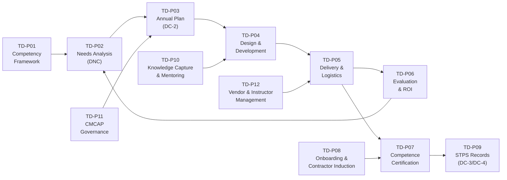
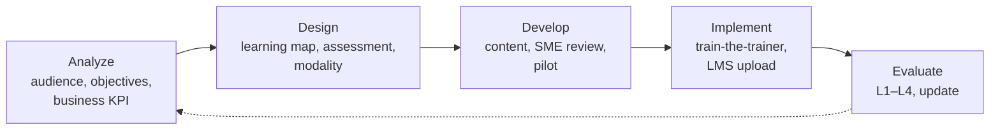
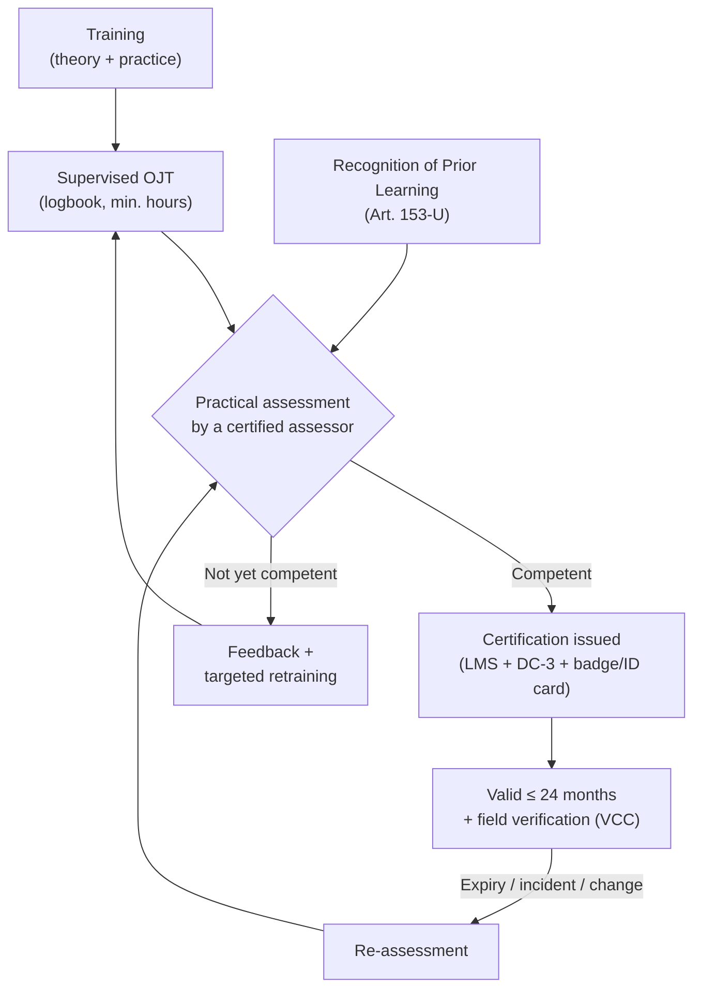

# T&D Process Manual (TD-P01 to TD-P12)

The department runs 12 processes, based on ISO 10015:2019 (competence management and people development) and on the ADDIE cycle.

Each process below lists: **purpose · trigger · steps · outputs/records · SLA · KPIs**. Roles follow the RACI in `03-department-design/department-design.md`.

---

## TD-P01 — Competency Framework Management

**Purpose:** Define what each role must know and be able to do. This is the basis for training needs, certification, promotion (*escalafón*) and succession.

**Trigger:** A new role, a new process or technology, a change in regulation, an annual review, or the findings of an incident investigation.

**Steps**
1. **Map job families and roles.** About 120 critical operational and maintenance roles are prioritized in year 1, starting with roles exposed to critical risks.
2. **Run a job/task analysis** with SMEs through a DACUM-style workshop: duties → tasks → steps → knowledge, skills and attitudes. Tag each task as *critical*, *regulated (NOM)* or *standard*.
3. **Define competencies with proficiency levels:**
   - Level 1 *Awareness* — knows the concept
   - Level 2 *Assisted* — performs the task under supervision
   - Level 3 *Autonomous* — performs the task alone (the level for certification)
   - Level 4 *Expert/Instructor* — teaches and assesses
4. **Link each competency** to the learning solutions (courses, OJT, simulator), the assessment method, and the related NOM, CONOCER standard or ISO clause.
5. **Validate** with the Academy Board, HSE and the CMCAP. For unionized roles, align with the escalafón categories in the CCT.
6. **Publish** in the LMS as the **Competency Matrix**, one per role (see `templates/competency-matrix.csv`).
7. **Review** every year, and immediately when a process change or an incident calls for it.

**Outputs:** Role competency profiles, competency matrix, progression paths.
**SLA:** A new role profile in 30 days; an update after an incident in 15 days.
**KPIs:** % of critical roles with a validated profile (target 100% by month 12); % of profiles reviewed in the last 12 months.

---

## TD-P02 — Training Needs Analysis (DNC)

**Purpose:** Find the gaps between required and current competence, and link them to business priorities.

**Trigger:** The annual cycle (September–November), plus ad-hoc requests.

**Four sources of need:**

| Source | Input | Tool |
|---|---|---|
| **Organizational** | Strategy, business KPIs (safety, availability, yield, quality), new projects (for example hydrogen DRI) | Interviews with the Learning Council and plant directors |
| **Regulatory** | NOMs, STPS, IMSS, SEDENA, ISO audits, expiring certifications | Legal requirements matrix, LMS expiry report |
| **Role / competency gaps** | Competency matrix versus individual assessments | Supervisor + employee self-assessment; LMS gap report |
| **Individual** | Performance reviews, Individual Development Plans (IDP), career aspirations | HRIS, talent review |

**Steps**
1. The Site T&D Superintendent starts the cycle in September and sends the matrices and forms (`templates/dnc-training-needs-questionnaire.md`).
2. Supervisors assess each worker against the role profile. For critical tasks, they use certification records, not opinion.
3. The site team consolidates gaps and prioritizes them with the **priority matrix**:
   - **P1 — Mandatory:** legal/NOM requirements and critical-risk tasks (always funded)
   - **P2 — Business-critical:** gaps that affect KPIs, new equipment, succession for critical roles
   - **P3 — Development:** individual growth and future skills
4. Validate with the Site Director and the CMCAP union representatives.
5. Send to the CoE, which consolidates across sites, finds shared programs, and defines corporate versus site delivery and internal versus external delivery.

**Outputs:** A DNC report per site; a prioritized needs list; input to TD-P03.
**SLA:** The cycle closes on 30 November.
**KPIs:** % of workers with an updated gap assessment (≥ 90%); % of P1 needs identified before certifications expire (100%).

---

## TD-P03 — Annual Training Plan & Programs (DC-2)

**Purpose:** Turn the needs into a funded and scheduled plan that complies with LFT Art. 153-A.

**Steps**
1. The CoE builds the **corporate catalog** of courses, with code, duration, modality, target population, prerequisites and validity.
2. Each site builds its **annual plan** (`templates/annual-training-plan.csv`): course, population, number of participants, month, instructor (internal/external), cost, and priority.
3. **Roster alignment:** agree with production planning on the protected training days in each shift roster (target: 4.7 h per person per month on average).
4. Assemble the budget by site and program → Finance.
5. The **CMCAP approves** the DC-2 plan in January. Publish the calendar in the LMS and on site notice boards.
6. Quarterly review: recover delays, re-prioritize.

**Outputs:** DC-2 plan per site (signed); approved budget; published calendar.
**SLA:** Approved by 31 January.
**KPIs:** Plan compliance: hours delivered versus planned (≥ 90%); P1 compliance (100%); budget variance (±5%).

---

## TD-P04 — Instructional Design & Development

**Purpose:** Create effective, standardized learning solutions, following ADDIE, or SAM for rapid prototyping.

**Rules**
- Each program has a **Design Brief**: business problem, owner, target KPI, audience, objectives, assessment and evaluation plan.
- Objectives are written as observable behaviors (Bloom's taxonomy).
- **Design standards for the operational audience:** Spanish, plain language, at least 50% practice, visuals and videos from the real site, short modules (≤ 2 h theory blocks), assessments in the field.
- **Modality matrix:**

| Need | Preferred modality |
|---|---|
| Awareness, regulations, refreshers | E-learning or microlearning (mobile, kiosk) |
| Procedures and critical tasks | Classroom + practice + field assessment |
| High-risk or rare events (EAF breakout, confined space rescue) | VR/simulator + drill |
| Equipment operation (haul truck, shovel, crane) | Simulator + supervised OJT + certification |
| Leadership and behavior | Blended cohort, action learning, coaching |
| Expert know-how | Mentoring, video SOPs, communities of practice |

- **Quality gate:** SME technical sign-off, HSE sign-off for any risk content, pilot with ≥ 8 learners, then approval by the Academy Board.
- The content has a version number and is reviewed every 2 years or after a change.

**SLA:** Classroom course in 6–8 weeks; e-learning module in 8–10 weeks; microlearning in 1–2 weeks.
**KPIs:** Design lead time; pilot satisfaction ≥ 4.3/5; % of content reviewed within its validity period.

---

## TD-P05 — Delivery & Logistics

**Steps**
1. **Scheduling** in the LMS, published at least 3 weeks ahead. Invitations go to the worker and the supervisor.
2. **Nomination:** the supervisor confirms and arranges shift cover. Prerequisites are checked automatically.
3. **Logistics:** room, simulator, PPE, materials, transport (mines), meals for long sessions, interpreter or accessibility needs.
4. **Delivery:** attendance by QR code or biometrics; the instructor follows the lesson plan; assessments are recorded in the LMS or in a paper form that is uploaded within 48 hours.
5. **Close-out:** level-1 survey (`templates/evaluation-level1-reaction.md`), assessment results, attendance → triggers TD-P06 and TD-P09.

**SLA:** Records in the LMS within 48 h; no-shows reported to the supervisor within 24 h.
**KPIs:** Attendance rate (≥ 95%), no-show rate (≤ 5%), cost per training hour, instructor rating.

---

## TD-P06 — Evaluation & ROI (Kirkpatrick / Phillips)

| Level | What is measured | How | When | Coverage |
|---|---|---|---|---|
| **L1 Reaction** | Relevance, satisfaction, confidence | LMS survey (5-point scale) | End of the course | 100% of courses |
| **L2 Learning** | Knowledge and skill | Pre/post tests; practical checklists | During/end | 100% of courses |
| **L3 Behavior** | Application on the job | Supervisor observation checklist, field audits, CMMS/MES data (`templates/evaluation-level3-behavior.md`) | 60–90 days later | All critical-risk and leadership programs; a sample of others |
| **L4 Results** | Business KPIs | Safety (LTIFR), availability, yield, quality, turnover | 6–12 months later | Flagship programs |
| **L5 ROI** | Net benefit / cost | Phillips method: isolate the effect (control groups, trend analysis, estimates), convert to money, count all costs | Annually | 3–5 programs per year |

**Steps:** Plan the evaluation at the design stage (TD-P04) → collect → analyze in the Learning Analytics dashboard → report monthly to site leaders and quarterly to the Learning Council → improve the content.

**KPIs:** L1 ≥ 4.3/5; L2 first-attempt pass rate ≥ 85%; L3 application ≥ 70%; ≥ 3 ROI studies per year.

---

## TD-P07 — Competence Assessment & Certification (critical tasks)

**Purpose:** Make sure only competent people perform critical tasks. This is the core of the *Cero Fatalidades* strategy.

**Rules**
- **Critical tasks covered in year 1 (16):** isolation/LOTO, confined space entry, work at heights, suspended loads/rigging, overhead crane operation, mobile equipment (haul truck, loader, dozer, light vehicle in the mine), explosives handling and blasting, molten-metal handling and ladle operations, EAF operation, gas and hydrogen systems, electrical work (NOM-029), hot work, ground control (underground), pressure systems, conveyor work, and vehicle–pedestrian interaction.
- **Assessors:** internal instructors or supervisors with Level 4 competence and assessor training. One assessor may not certify more than 12 people per day for any one task.
- **Evidence:** a checklist with *critical steps* (all must be passed), observation in real or simulated conditions, and oral questioning.
- **ID card / digital badge:** the worker's ID shows a QR code with their valid certifications. Supervisors check it before issuing work permits. The LMS is integrated with the **work permit system**, so a permit cannot be issued to a person without a valid certification.
- **Verification of Critical Controls (VCC):** supervisors run field checks every month. Findings feed back into training.

**SLA:** Assessment within 15 days after OJT is complete; certification record within 48 h.
**KPIs:** % of people performing critical tasks who are certified (**100%**, zero tolerance); % of certifications current; field verification findings.

---

## TD-P08 — Onboarding & Contractor Induction

### Employees — "Bienvenida GASM" (first 90 days)

| When | Activity |
|---|---|
| Before day 1 | Welcome kit, documents, LMS account, PPE size |
| Days 1–2 | Corporate induction: values, *Cero Fatalidades*, Code of Conduct, NOM-035, harassment protocol, CCT basics (for unionized roles) |
| Days 3–5 | Site safety induction (NOM-023 for mines), emergency response, critical risk awareness, PPE (NOM-017), site tour |
| Weeks 2–12 | Role-specific learning path, buddy/mentor, supervised OJT, certification of critical tasks |
| Days 30 / 60 / 90 | Check-ins with supervisor and HR; 90-day evaluation |

### Contractors
1. The contractor company (REPSE) registers its workers in the **contractor portal** and uploads DC-3s and IMSS registration.
2. The site T&D team validates the documents (3 business days).
3. The worker completes the **GASM induction** (4 h general + 2 h site-specific), with a test (≥ 80%).
4. Critical tasks require GASM certification (TD-P07).
5. Access control is linked to induction and certification status: no valid induction, no gate access.
6. Induction is renewed every year.

**KPIs:** 100% of contractors inducted before access; 90-day retention of new hires ≥ 92%; time to competency for new operators (target: from 9 down to 6 months).

---

## TD-P09 — STPS Compliance & Training Records

**Steps**
1. Each record in the LMS holds the worker's CURP, course, dates, duration, instructor or external agent (DC-5 number), result and area of the course (STPS catalog).
2. **DC-3 issuance:** generated automatically from the LMS for those who passed, signed (electronically where valid, or on paper) by the instructor and the CMCAP representatives, and delivered to the worker within 10 business days. A copy goes into the employee file.
3. **DC-4 reporting** through SIRCE on the schedule the current STPS rules require.
4. **Quarterly self-audit** (the Compliance Specialist samples 5% of records at each site) and **STPS inspection readiness kit**: DC-2 plans, CMCAP minutes, DC-3 samples, DC-4 receipts, vendor DC-5, NOM-specific evidence.
5. Records are retained under the policy and protected under privacy rules.

**KPIs:** DC-3 issued in ≤ 10 business days (≥ 98%); zero STPS findings on training; self-audit accuracy ≥ 98%.

---

## TD-P10 — Knowledge Capture & Mentoring ("Legado Experto")

**Purpose:** Keep the critical knowledge of retiring experts and speed up the development of successors.

**Steps**
1. **Identify knowledge at risk:** cross the retirement forecast (≤ 3 years) with criticality (single point of knowledge, critical equipment, rare events).
2. **Pair** each expert with 1–2 successors in a formal **mentoring agreement** of 6–18 months.
3. **Capture** the knowledge: structured interviews ("how do you know when…"), video SOPs recorded on the job, troubleshooting guides, annotated drawings and failure histories stored in the LMS or knowledge base and linked to the CMMS.
4. **Validate:** the successor shows competence (TD-P07); the expert and the Academy Board sign off.
5. **Recognize:** the expert receives the *Legado Experto* recognition and may become a post-retirement SME instructor, under a contract that complies with labor and tax rules.
6. **Communities of practice** by discipline (EAF, reliability, blasting, hydraulics), meeting monthly.

**KPIs:** % of at-risk experts with an active knowledge-transfer plan (≥ 90%); number of knowledge assets captured; successor readiness.

---

## TD-P11 — CMCAP Governance (Joint Training Commission)

**Steps**
1. Set up the CMCAP at each workplace with equal numbers of worker (union) and employer representatives, and keep the constitution minutes.
2. **Train the members** on LFT Chapter III Bis and on their roles.
3. Meet **at least quarterly**. Agenda: plan progress, DC-3 status, issues, productivity, proposals.
4. Keep minutes with agreements and follow-up. Minutes are stored for inspection.
5. The CMCAP approves the DC-2 plan (January) and supervises it throughout the year.
6. Annual joint report to the Corporate Union–Management Training Forum.

**KPIs:** 100% of sites with an active CMCAP; 4 or more sessions per year; follow-up on agreements ≥ 90%.

---

## TD-P12 — Vendor & Internal Instructor Management

### External vendors
1. **Selection:** Procurement + T&D run a competitive bid for recurring needs. Requirements: STPS registration (DC-5), references in the sector, Spanish-language content, GASM assessment formats, insurance, REPSE registration if services are delivered on site.
2. **Framework agreements** for 2–3 years with rates per participant-hour.
3. **Evaluation after each course:** L1 score, results, logistics compliance. A score below 4.0/5 twice → removal.
4. **Annual vendor review**, including negotiation and consolidation.

### Internal instructors
1. **Selection:** Level 4 competence, communication skills, supervisor endorsement, safety record.
2. **Development:** a train-the-trainer program (40 h) + **EC0217.01** certification + assessor training (16 h). Designers also take **EC0301**.
3. **Allowance and recognition:** an hourly allowance for part-time SMEs, points in the performance review, an annual *Best Instructor* award.
4. **Quality:** observation twice a year by a senior instructor; L1/L2 results; recertification.

**KPIs:** Internal delivery share (≥ 65%); instructor rating ≥ 4.5/5; external spend per training hour; vendor consolidation (from 140 down to ≤ 40 vendors).
