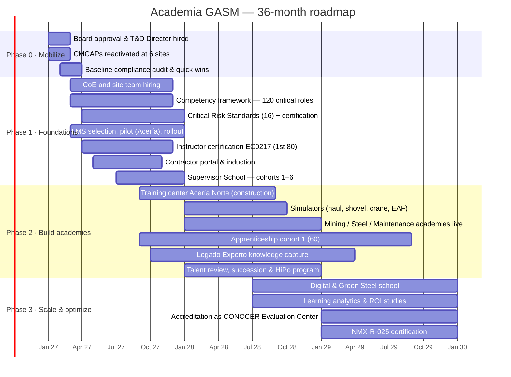

# Implementation Roadmap (36 months) and 90-Day Action Plan

## 1. Phases

| Phase | Months | Objective | Key deliverables | Exit criteria |
|---|---|---|---|---|
| **0. Mobilize** | 0–3 | Approval, leadership, legal compliance quick wins | Board approval; T&D Director hired; 6 CMCAPs active; baseline audit; DC-3 backlog cleared | 100% of CMCAPs active; compliance gap closure plan |
| **1. Foundations** | 3–12 | Standards, systems, critical-risk competence | 64-person structure (in stages); 120 role profiles; 16 Critical Risk Standards; LMS live at all sites; 80 certified instructors; contractor induction; first 6 Supervisor School cohorts | 100% of critical-task workers certified or scheduled; LMS as the single record |
| **2. Build academies** | 12–24 | Technical excellence and pipeline | Training center at Acería Norte; simulators; 3 technical academies running; apprenticeship cohort 1; 150 expert knowledge-transfer plans; talent review and succession | Time to competency −20%; 50% of critical roles with a successor |
| **3. Scale & optimize** | 24–36 | Future skills, impact and recognition | Digital & Green Steel school; ROI studies; CONOCER Evaluation Center; NMX-R-025 | Year-3 KPI targets met (see `08-kpis`) |

## 2. 90-day action plan (after approval)

| Week | Action | Owner | Deliverable |
|---|---|---|---|
| 1–2 | Announce Academia GASM (CEO message); appoint an interim T&D leader until the Director is hired | CEO, VP HR | Communication; interim appointment |
| 1–4 | Start the search for the T&D Director (headhunter, 60 days) | VP HR | Shortlist |
| 1–4 | **Reactivate or constitute the CMCAPs** at the 3 sites where they lapsed; train their members | Site HR + union | Minutes of constitution |
| 2–6 | **Compliance audit** of the 6 sites: DC-2, DC-3, DC-4, vendor DC-5, certifications for NOM-009/029/033/006 | Compliance specialist (contract) | Gap report |
| 2–8 | **Quick win 1:** clear the DC-3 backlog and certify people currently working at height, in confined spaces and on electrical tasks without evidence | Site T&D + HSE | 100% evidence for critical tasks in use |
| 3–8 | **Quick win 2:** strengthen contractor induction (4 h + test) and link it to gate access at Acería Norte and Tepehuaje | Site T&D + Security | New induction live |
| 4–10 | Map critical roles and start the first 30 competency profiles, beginning with the roles involved in the two fatalities | Technical academies (interim) | 30 profiles |
| 4–12 | LMS requirements, RFP and vendor demos (mobile, offline, Spanish, integration with SAP/HRIS, permits and access control) | Learning design + IT | Vendor selection |
| 6–12 | Nominate 100 SMEs for the train-the-trainer program; book the EC0217 evaluation | Site T&D | Training cohort 1 |
| 8–12 | Consolidate the vendor base: tender the 10 largest spend categories | Procurement + T&D | Framework agreements |
| 10–12 | Present the 2027 DC-2 plan with the new standard; first Learning Council meeting | T&D leader | Approved plan; KPI baseline |

## 3. Change management and communication

| Stakeholder | Concern | Strategy |
|---|---|---|
| **Union** | Training as a disguised performance filter; loss of seniority rights; training outside hours | Co-design in the Forum and CMCAP; link certification to escalafón (promotion); clear rules for RPL (Art. 153-U); no punitive use of assessment results except for critical-task safety |
| **Plant directors / production** | Losing operators' time; costs | Protected training days in the roster; show impact (safety, availability); KPIs shared with operations |
| **Supervisors** | More workload (OJT, assessments, permits) | Supervisor School first; digital checklists; recognition |
| **Experienced workers** | Being assessed after years on the job; digital tools | RPL route; respectful design; recognition as SMEs and mentors |
| **Contractors** | Cost and time of certification | Phased requirements; GASM delivers critical-risk training at cost; include it in contract pricing |
| **Young talent / women** | Career visibility, inclusion | Published career paths; ambassadors; inclusive facilities |

**Communication plan:** CEO launch; a monthly "Academia" bulletin; notice boards and digital displays at the sites; recognition ceremonies (graduations, *Legado Experto*, best instructor); union joint communications.

## 4. Key risks and mitigation

| Risk | Probability | Impact | Mitigation |
|---|---|---|---|
| Production does not release people | High | High | Protected roster time; line-manager KPIs; Learning Council oversight |
| Union opposition | Medium | High | Early co-design; alignment with the CCT; joint forum |
| Slow hiring of T&D staff and instructors | Medium | Medium | Transition of current staff; SME instructors; early partnerships |
| LMS implementation delays or low adoption in the mines | Medium | Medium | Pilot first; offline and kiosk modes; super-users at each shift |
| Budget cuts (steel price cycle) | Medium | High | Protect P1 (legal/critical risks); phased capex; show ROI early |
| Contractors resist | Medium | Medium | Contract clauses; phased compliance; support |
| Regulatory change (e.g. a shorter legal work week, new NOMs) | Medium | Medium | Regulatory watch; flexible modular design; compliance calendar |
| Certification as a paper exercise | Medium | High | Field assessment, VCC audits, an assessor-quality program, integration with work permits |
