# CV-GASM-001 — Cadena de valor y flujo de materiales de GASM

| Código | Versión | Estado | Dueño | Fecha |
|---|---|---|---|---|
| CV-GASM-001 | 0.1 | Borrador para validación | Dirección de Operaciones · Ingeniería de Proceso de cada planta | 2026-09-28 |

> **Decisión del Director (2026-09-28, D-010):** GASM es una empresa **minero-siderúrgica integrada** que produce su acero **a partir del mineral de hierro de sus propias minas**. **No fabrica acero a partir de chatarra comprada.**
> - El horno eléctrico se carga con **DRI de pelet propio**: ≈ 95–100 %.
> - Solo se recirculan **retornos internos**: despuntes, rechazos y derrames, ≤ 5 %.
> - El DRI llega a la Acería por **bandas transportadoras directas** desde las plantas **HYL** y **Midrex**.
>
> Este documento es la **fuente única de las interfaces entre plantas**. Las fichas técnicas de cada planta (FT-PEL-001, FT-RD-001 y FT-ACE-001) deben coincidir con estos valores. Los valores marcados [Supuesto] son de referencia y los valida Ingeniería de Proceso.

## 1. Flujo del proceso

```mermaid
flowchart LR
    M1["Mina Cerro Tepehuaje<br/>tajo abierto"] --> C1["Trituración y<br/>concentración magnética"]
    M2["Mina Sierra Alta<br/>tajo + subterránea"] --> C2["Concentradora"]
    C1 -- "concentrado por<br/>ferroducto (pulpa)" --> P["Planta Peletizadora Manzanillo<br/>filtrado · molienda · discos<br/>parrilla + horno rotatorio + enfriador"]
    C2 -- "concentrado por<br/>ferrocarril" --> P
    P -- "pelet grado reducción directa<br/>ferrocarril ≈ 1,000 km" --> PP["Patio de pelet<br/>Complejo Acería Norte"]
    P -. "excedente de pelet" .-> V["Venta / exportación<br/>(puerto)"]
    PP --> H["Planta HYL<br/>(ZR, sin reformador externo)"]
    PP --> X["Planta Midrex<br/>(reformador de gas natural)"]
    H -- "DRI por banda" --> S["Silos de día del EAF"]
    X -- "DRI por banda" --> S
    S -- "5.º agujero" --> E["EAF-1 / EAF-2<br/>≈ 95–100 % DRI"]
    R["Retornos internos<br/>despuntes · rechazos · derrames"] -. "≤ 5 %" .-> E
    E --> L["Horno Olla LF-1 / LF-2"] --> CC1["CC1 · planchón"] --> LC["Laminación en caliente"]
    L --> CC2["CC2 · palanquilla"] --> LL["Laminación de largos"]
```

## 2. Plantas y documentación
| Orden | Planta | Ubicación | Producto | Carpeta de documentación |
|---|---|---|---|---|
| 1 | Minas (Cerro Tepehuaje, Sierra Alta) | Colima–Jalisco · Coahuila | Concentrado de hierro | pendiente |
| 2 | **Peletizadora Manzanillo** | Manzanillo, Col. | Pelet grado reducción directa | `10-plantas/02-peletizadora/` |
| 3 | **Reducción Directa: HYL y Midrex** | Complejo Acería Norte, Salinas Victoria, N.L. | DRI (hierro de reducción directa) | `10-plantas/03-reduccion-directa/` |
| 4 | **Acería eléctrica y colada continua** | Complejo Acería Norte | Planchón y palanquilla | `10-plantas/01-steelmaking/` |
| 5 | Laminación | Complejo Acería Norte | Rollo y varilla | pendiente |

## 3. Balance de referencia (año)
| Etapa | Producción | Consumo específico de referencia | Nota |
|---|---|---|---|
| Concentrado | 6.5 Mt | — | Fe 66–68 % [Supuesto] |
| Pelet | 4.2 Mt | ≈ 1.0 t de concentrado por t de pelet | ≈ 3.55 Mt a Reducción Directa y ≈ 0.65 Mt a venta [Supuesto] |
| DRI | 2.5 Mt: HYL 1.2 Mt y Midrex 1.3 Mt | ≈ 1.42 t de pelet por t de DRI [Supuesto] | Operación 24/7; ≈ 8,000 h/año [Supuesto] |
| Acero líquido | 2.2 Mt | ≈ 1.13 t de DRI por t de acero líquido [Supuesto] | Rendimiento metálico menor que con chatarra por la ganga del DRI |
| Planchón / palanquilla | ≈ 1.3 Mt / ≈ 0.9 Mt | — | FT-ACE-001 |

## 4. Interfaces entre plantas (especificación de referencia)
### 4.1 Pelet para reducción directa (Peletizadora → Reducción Directa)
| Característica | Valor de referencia |
|---|---|
| Fe total | ≥ 67.0 % [Supuesto] |
| SiO₂ + Al₂O₃ (ganga ácida) | ≤ 3.0 % [Supuesto] |
| Basicidad (CaO/SiO₂) | Según la práctica de reducción; baja para evitar pegado [Validar con C-07 RD] |
| Tamaño | 9–16 mm ≥ 90 %; < 6.3 mm ≤ 3 % [Supuesto] |
| Resistencia a la compresión (CCS) | ≥ 250 kg/pelet [Supuesto] |
| Índice de abrasión / volteo | Abrasión ≤ 5 %; volteo ≥ 94 % [Supuesto] |
| Recubrimiento (coating) | Antipegado para el reactor (cal, dolomita o bauxita) [Validar con OEM] |
| Humedad al embarque | ≤ 2 % [Supuesto] |

### 4.2 DRI (Reducción Directa → Acería)
| Característica | HYL | Midrex | Requisito de la Acería |
|---|---|---|---|
| Metalización | ≥ 93 % | ≥ 93 % | ≥ 92 % (por debajo sube el consumo de energía y carbono) |
| Carbono | 3.0–4.5 % [Supuesto] | 1.5–2.5 % [Supuesto] | La mezcla define el carbono de carga; ajustar la inyección de C |
| Ganga (SiO₂ + Al₂O₃ + CaO + MgO) | según pelet | según pelet | Define el volumen de escoria y el consumo de cal |
| Tamaño | 4–20 mm; finos < 3 mm ≤ 5 % | igual | Finos a manejo separado (no al 5.º agujero) |
| Temperatura en banda | ≤ 80 °C [Supuesto] | ≤ 80 °C [Supuesto] | DRI frío o tibio; reoxidación y calentamiento vigilados |
| Transporte | Banda cerrada directa a silos de día | Banda cerrada directa a silos de día | Silos de día con inertización y medición de temperatura [Validar con OEM] |

### 4.3 Carga del EAF
- **Carga metálica:** ≈ 95–100 % DRI de pelet propio. Se alimenta de forma continua por el 5.º agujero desde los silos de día. Retornos internos ≤ 5 % en canasta ocasional.
- **Sin compra de chatarra ni patio de chatarra externo.** El control de fuentes radiactivas en chatarra comprada deja de aplicar. Se mantiene para los retornos internos y para las fuentes selladas de medición.
- **Energía:** ≈ 620–680 kWh/t por la ganga y la carga fría. **Tap-to-tap:** ≈ 60–65 min. **Escoria:** más volumen, ≈ 150–180 kg/t. FT-ACE-001 v0.4 fija los valores [Supuesto hasta validación de C-07].

## 5. Riesgos principales que cambian con la redefinición
| Tema | Antes (supuesto de chatarra) | Ahora (DRI de pelet) |
|---|---|---|
| Explosión por humedad | Chatarra mojada, recipientes cerrados | DRI húmedo o reoxidado; agua en bandas o silos; generación de H₂ |
| Materiales peligrosos | Explosivos y fuentes radiactivas en chatarra | Autocalentamiento y reoxidación del DRI en silos y bandas; CO/H₂ en plantas de reducción |
| Grúas de carga | Canastas de 55–70 t en cada colada | Canasta solo para retornos; menor exposición |
| Nuevos riesgos aguas arriba | — | Gas de proceso (H₂/CO) a alta presión, reformador, compresores, hornos de pelet, polvo de pelet, ferrocarril |

## 6. Control de cambios
| Versión | Fecha | Cambio |
|---|---|---|
| 0.1 | 2026-09-28 | Emisión inicial por decisión del Director: cadena mineral → pelet → HYL/Midrex → EAF (≈ 95–100 % DRI) → colada continua |
