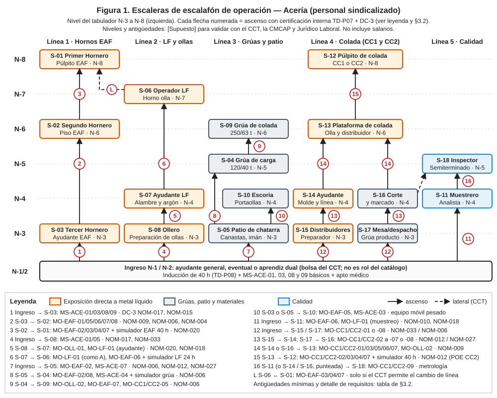
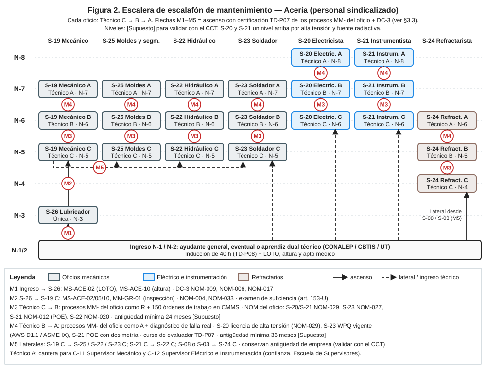

# Descripciones de Puesto — Personal Sindicalizado de la Acería (Steelmaking)

| Código | Versión | Estado | Área | Elaboró | Revisión laboral | Revisión técnica | Revisión de seguridad | Revisión documental | Aprobó | Fecha | Próxima revisión |
|---|---|---|---|---|---|---|---|---|---|---|---|
| DP-ACE-S | 0.2 | **Borrador para validación** | Acería (Steelmaking), Complejo Acería Norte | gerente-personal-sindicalizado | experto-relaciones-laborales — visto bueno con observaciones, 2026-09-25 (ver `REVISION-LABORAL.md`) | experto-operativo-metalurgia — pendiente | experto-seguridad-salud — pendiente | Criterio de experto-documentacion-mejora aplicado en la revisión laboral; visto bueno formal pendiente | **Pendiente — Director de C&D** (único que aprueba; antes: validación operativa con C-01 y presentación a la CMCAP y al sindicato) | 2026-09-25 | 2027-09-25 |

> **Mensaje clave para el Director.** La Acería necesita **963 plazas sindicalizadas** en **26 roles** (S-01 a S-26) para operar 24/7 en rol 4x4 de 12 h: **380** en Hornos EAF + LF + ollas + patio, **332** en Colada Continua (CC1 + CC2) y **251** en Mantenimiento. Las cifras cuadran con los supuestos de la ficha técnica FT-ACE-001 (≈ 380 / ≈ 330 / ≈ 250). Se proponen **5 líneas de escalafón de operación y 1 de mantenimiento con 8 niveles (N-1 a N-8)**, en las que la **certificación interna TD-P07 de los procesos críticos del puesto destino y sus DC-3 acreditan la aptitud** para el ascenso; entre los trabajadores aptos asciende el de mayor antigüedad (LFT art. 159) y cualquiera puede acreditar la aptitud por examen de suficiencia sin cursar la ruta completa (art. 153-U). Antes de usar este documento hay que validar con el sindicato, con la CMCAP y con Jurídico Laboral la vinculación "certificación ↔ ascenso" y el tabulador por niveles (ver §6 y la sección de decisión).

**Fuentes:** `00-ficha-tecnica-acería.md` (FT-ACE-001, datos técnicos y supuestos de plantilla), `00-catalogo-procesos-y-roles.md` (CAT-ACE-001, códigos de roles y procesos), `00-guia-de-estilo-y-plantillas.md` (plantilla §4 y estilo SVG), `04-processes/process-manual.md` (TD-P07 certificación, TD-P08 inducción, TD-P09 DC-3), `03-department-design/training-and-development-policy.md` ("sin certificación no hay tarea crítica"; vigencia general de 24 meses, ajustada por el **criterio unificado de seguridad**: 12 meses para alturas, espacios confinados, grúas/izaje, eléctrico y fuentes radiactivas, ver §4). Los valores técnicos son **de referencia** y deben validarse con OEM / Ingeniería de Proceso antes de usarse en planta. Los niveles de escalafón, plazas, antigüedades y horas de formación son **[Supuesto]** de este borrador. **No se incluyen salarios**: el tabulador en pesos lo define el CCT.

**Alineación:** scorecard `08-kpis/kpi-scorecard.md` (100% de certificados en tareas críticas, tiempo a competencia de 9 a 6 meses, disponibilidad del EAF de 87%) y procesos TD-P02 (DNC por categoría), TD-P05 (OJT), TD-P07 (certificación) y TD-P09 (DC-3/DC-4).

**Convenciones.** Roles y procesos se citan con su código del catálogo CAT-ACE-001. En la matriz y en las tablas de cada puesto:
- **R** = ejecuta la tarea. **A** = en el nivel sindicalizado, *lidera la ejecución en campo y da el "liberado"* (también ejecuta). La rendición de cuentas final del proceso es del **dueño C-xx** del catálogo. Cada proceso operativo o de mantenimiento tiene **un solo A sindicalizado**.
- **C** = consultado (aporta la condición de su equipo o área). **I** = informado.
- En los procesos de seguridad **MS-**: R = aplica el control crítico en su trabajo; C = participa en la verificación o el permiso; I = conoce el riesgo y respeta la zona.
- ★ = paso crítico que entra en la evaluación de certificación (TD-P07). 🛑 = condición de paro obligatorio.

---

## 1. Resumen de los 26 roles sindicalizados

| Código | Rol | Área (catálogo) | Bloque de plantilla | Línea de escalafón | Nivel propuesto [Supuesto] | Puestos por turno (24/7) | Puestos de día | Cálculo | **Plazas totales** |
|---|---|---|---|---|---|---|---|---|---|
| S-01 | Operador de Púlpito de Horno (Primer Hornero) | EAF | Hornos EAF + LF + ollas + patio | 1 Hornos EAF | N-8 | 4 | 0 | 4×4+2 | **18** |
| S-02 | Operador de Horno de Piso (Segundo Hornero) | EAF | Hornos EAF + LF + ollas + patio | 1 Hornos EAF | N-6 | 4 | 0 | 4×4+2 | **18** |
| S-03 | Ayudante de Horno (Tercer Hornero) | EAF | Hornos EAF + LF + ollas + patio | 1 Hornos EAF | N-3 | 14 | 12 | 4×14+7 + ⌈1.1×12⌉ | **77** |
| S-04 | Operador de Grúa de Carga (nave de hornos) | EAF | Hornos EAF + LF + ollas + patio | 3 Grúas y patio | N-5 | 3 | 0 | 4×3+2 | **14** |
| S-05 | Operador de Patio de Chatarra (canastas, electroimán, pórtico de radiación) | Patio | Hornos EAF + LF + ollas + patio | 3 Grúas y patio | N-3 | 16 | 22 | 4×16+8 + ⌈1.1×22⌉ | **97** |
| S-06 | Operador de Horno Olla | LF | Hornos EAF + LF + ollas + patio | 2 LF y ollas | N-7 | 2 | 0 | 4×2+1 | **9** |
| S-07 | Ayudante de Horno Olla / Alimentación de Alambre | LF | Hornos EAF + LF + ollas + patio | 2 LF y ollas | N-4 | 6 | 0 | 4×6+3 | **27** |
| S-08 | Preparador de Ollas (Ollero) | Ollas | Hornos EAF + LF + ollas + patio | 2 LF y ollas | N-3 | 9 | 6 | 4×9+5 + ⌈1.1×6⌉ | **48** |
| S-09 | Operador de Grúa de Colada (nave de ollas) | Ollas | Hornos EAF + LF + ollas + patio | 3 Grúas y patio | N-6 | 4 | 0 | 4×4+2 | **18** |
| S-10 | Operador de Manejo de Escoria (portaollas de escoria) | EAF / LF | Hornos EAF + LF + ollas + patio | Rama de 1 y 3 | N-4 | 6 | 0 | 4×6+3 | **27** |
| S-11 | Muestrero / Analista de Laboratorio de Acería | Calidad | Hornos EAF + LF + ollas + patio | 5 Calidad | N-4 | 5 | 3 | 4×5+3 + ⌈1.1×3⌉ | **27** |
| S-12 | Operador de Púlpito de Colada (CC1 / CC2) | Colada | Colada CC1 + CC2 | 4 Colada | N-8 | 4 | 0 | 4×4+2 | **18** |
| S-13 | Operador de Plataforma de Colada (olla y distribuidor) | Colada | Colada CC1 + CC2 | 4 Colada | N-6 | 8 | 0 | 4×8+4 | **36** |
| S-14 | Ayudante de Colada (molde y línea) | Colada | Colada CC1 + CC2 | 4 Colada | N-4 | 13 | 0 | 4×13+7 | **59** |
| S-15 | Preparador de Distribuidores | Colada | Colada CC1 + CC2 | 4 Colada | N-3 | 12 | 14 | 4×12+6 + ⌈1.1×14⌉ | **70** |
| S-16 | Operador de Corte y Marcado | Colada | Colada CC1 + CC2 | 4 Colada | N-4 | 6 | 6 | 4×6+3 + ⌈1.1×6⌉ | **34** |
| S-17 | Operador de Mesa de Enfriamiento y Despacho | Colada | Colada CC1 + CC2 | 4 Colada | N-3 | 13 | 20 | 4×13+7 + ⌈1.1×20⌉ | **81** |
| S-18 | Inspector de Calidad de Semiterminado (planchón / palanquilla) | Calidad | Colada CC1 + CC2 | 5 Calidad | N-5 | 5 | 10 | 4×5+3 + ⌈1.1×10⌉ | **34** |
| S-19 | Mecánico de Acería | Mantenimiento | Mantenimiento | Mantenimiento | C N-5 / B N-6 / A N-7 | 9 | 33 | 4×9+5 + ⌈1.1×33⌉ | **78** |
| S-20 | Electricista de Acería | Mantenimiento | Mantenimiento | Mantenimiento | C N-6 / B N-7 / A N-8 | 4 | 12 | 4×4+2 + ⌈1.1×12⌉ | **32** |
| S-21 | Instrumentista | Mantenimiento | Mantenimiento | Mantenimiento | C N-6 / B N-7 / A N-8 | 3 | 8 | 4×3+2 + ⌈1.1×8⌉ | **23** |
| S-22 | Técnico Hidráulico | Mantenimiento | Mantenimiento | Mantenimiento | C N-5 / B N-6 / A N-7 | 2 | 8 | 4×2+1 + ⌈1.1×8⌉ | **18** |
| S-23 | Soldador Calificado | Mantenimiento | Mantenimiento | Mantenimiento | C N-5 / B N-6 / A N-7 | 2 | 14 | 4×2+1 + ⌈1.1×14⌉ | **25** |
| S-24 | Refractarista | Mantenimiento / Ollas | Mantenimiento | Mantenimiento | C N-4 / B N-5 / A N-6 | 4 | 26 | 4×4+2 + ⌈1.1×26⌉ | **47** |
| S-25 | Mecánico de Taller de Moldes y Segmentos | Mantenimiento | Mantenimiento | Mantenimiento | C N-5 / B N-6 / A N-7 | 0 | 16 | ⌈1.1×16⌉ | **18** |
| S-26 | Lubricador | Mantenimiento | Mantenimiento | Mantenimiento | N-3 | 1 | 4 | 4×1+1 + ⌈1.1×4⌉ | **10** |
| | **Subtotal Hornos EAF + LF + ollas + patio** | | | | | **73** | **43** | | **380** |
| | **Subtotal Colada CC1 + CC2** | | | | | **61** | **50** | | **332** |
| | **Subtotal Mantenimiento** | | | | | **25** | **121** | | **251** |
| | **Total sindicalizado Acería** | | | | | **159** | **214** | | **963** |

### 1.1 Cómo se calcularon las plazas

1. **Puesto continuo (24/7).** La Acería trabaja en rol **4x4 de 12 h** con **4 cuadrillas** (A, B, C, D): cada día trabajan 2 cuadrillas (día y noche) y 2 descansan. Cada puesto de trabajo continuo necesita **4 personas** (una por cuadrilla).
2. **Relevos.** A esas 4 personas se suma **0.5 plaza de relevo por puesto** (redondeado hacia arriba por rol) para cubrir ausencias. Factor efectivo ≈ **4.5 por puesto continuo** (dentro del rango de 4.4–4.6 pedido). **[Supuesto]** de ausentismo programado y no programado por trabajador y año:

   | Concepto | Turnos de 12 h al año | Base |
   |---|---|---|
   | Turnos programados por trabajador (4x4) | ≈ 182 | 365 ÷ 2 |
   | Vacaciones | ≈ 8 | LFT art. 76 (12 a 20+ días según antigüedad; el CCT puede dar más) — verificar con Jurídico Laboral |
   | Incapacidades (enfermedad general y riesgo de trabajo) | ≈ 5.5 | 3% [Supuesto] |
   | Capacitación fuera del puesto (≈ 40 h/año) y recertificación | ≈ 3.5 | TD-P07, plan DC-2 |
   | Permisos sindicales, permisos con goce, otros | ≈ 2.5 | CCT [Supuesto] |
   | **Total de ausencias** | **≈ 19.5 (≈ 11%)** | 4 ÷ (1 − 0.11) ≈ **4.5** |

3. **Puesto administrativo (día).** Talleres, cuadrillas de día, patio de preparación de chatarra, despacho y el revestimiento de ollas y distribuidores trabajan en jornada diurna (lunes a sábado, 8 h) **[Supuesto]**; se multiplica por **1.1** para cubrir vacaciones y ausencias.
4. **Fórmula por rol:** Plazas = 4 × (puestos continuos por turno) + ⌈0.5 × puestos continuos⌉ + ⌈1.1 × puestos administrativos⌉.
5. **Mantenimiento** tiene una **guardia 24/7 de 25 puestos por turno** (atiende fallas y paros cortos) y **121 puestos en horario administrativo** (preventivo, talleres, paros programados). Los paros mayores (cambio de revestimiento del EAF, overhaul de grúas) se refuerzan con contratistas REPSE, fuera de esta plantilla.
6. **Ubicación de los roles de Calidad:** S-11 (laboratorio y muestreo) se cuenta en el bloque de Hornos porque trabaja en la nave de hornos y el LF; S-18 (inspección de semiterminado) se cuenta en Colada. S-24 Refractarista se cuenta en Mantenimiento, como indica la ficha.

**Cuadre con la ficha FT-ACE-001 §8:**

| Bloque | Supuesto de la ficha | Propuesta de este documento | Diferencia |
|---|---|---|---|
| Hornos EAF + LF + ollas + patio de chatarra (S-01 a S-11) | ≈ 380 | **380** | 0 |
| CC1 + CC2, incluye distribuidores y despacho (S-12 a S-18) | ≈ 330 | **332** | +2 (+0.6%) |
| Mantenimiento de Acería (S-19 a S-26) | ≈ 250 | **251** | +1 (+0.4%) |
| **Total sindicalizado** | ≈ 960 | **963** | +3 |
| Staff de confianza (C-01 a C-17), fuera de este documento | ≈ 60 | — | — |
| **Total Steelmaking** | ≈ 1,020 | **≈ 1,023** | |

---

## 2. Dotación por turno y por puesto de trabajo

Tabla de "quién está en cada puesto" en **un turno** (una cuadrilla), más las plazas de día. Una cuadrilla de operación tiene **134 personas** (73 en Hornos y 61 en Colada) y la guardia de mantenimiento **25**, es decir, **159 sindicalizados en planta en cada turno de 12 h**, además de **214 plazas de día** (121 de ellas de mantenimiento).

### 2.1 Hornos EAF + LF + ollas + patio

| Puesto de trabajo | Rol | En planta por turno (24/7) | Plazas de día | Plazas equivalentes (4.5 × turno + 1.1 × día) |
|---|---|---|---|---|
| Púlpito EAF-1 | S-01 Operador de Púlpito de Horno (Primer Hornero) | 2 | — | 9.0 |
| Púlpito EAF-2 | S-01 Operador de Púlpito de Horno (Primer Hornero) | 2 | — | 9.0 |
| Piso EAF-1 (puerta, EBT, plataforma) | S-02 Operador de Horno de Piso (Segundo Hornero) | 2 | — | 9.0 |
| Piso EAF-1 (puerta, EBT, plataforma) | S-03 Ayudante de Horno (Tercer Hornero) | 5 | — | 22.5 |
| Piso EAF-2 (puerta, EBT, plataforma) | S-02 Operador de Horno de Piso (Segundo Hornero) | 2 | — | 9.0 |
| Piso EAF-2 (puerta, EBT, plataforma) | S-03 Ayudante de Horno (Tercer Hornero) | 5 | — | 22.5 |
| Sistemas de materiales (silos, DRI, 5.º agujero, rondín DES) | S-03 Ayudante de Horno (Tercer Hornero) | 4 | — | 18.0 |
| Cuadrilla de día de hornos (limpieza de fosas, preparación de bóveda y delta, apoyo a paros) | S-03 Ayudante de Horno (Tercer Hornero) | — | 12 | 13.2 |
| Grúas de carga, nave de hornos (2 × 120/40 t) | S-04 Operador de Grúa de Carga (nave de hornos) | 3 | — | 13.5 |
| Patio de chatarra: recepción y pórtico de radiación | S-05 Operador de Patio de Chatarra (canastas, electroimán, pórtico de radiación) | 2 | — | 9.0 |
| Patio de chatarra: grúas y manipuladores con electroimán | S-05 Operador de Patio de Chatarra (canastas, electroimán, pórtico de radiación) | 8 | — | 36.0 |
| Patio de chatarra: carros portacanastas y armado de canastas | S-05 Operador de Patio de Chatarra (canastas, electroimán, pórtico de radiación) | 4 | — | 18.0 |
| Patio de chatarra: preparación y oxicorte de chatarra pesada | S-05 Operador de Patio de Chatarra (canastas, electroimán, pórtico de radiación) | 2 | 22 | 33.2 |
| Manejo de escoria (portaollas EAF-1/2, LF, patio de escoria) | S-10 Operador de Manejo de Escoria (portaollas de escoria) | 6 | — | 27.0 |
| Estación LF-1 | S-06 Operador de Horno Olla | 1 | — | 4.5 |
| Estación LF-1 | S-07 Ayudante de Horno Olla / Alimentación de Alambre | 3 | — | 13.5 |
| Estación LF-2 | S-06 Operador de Horno Olla | 1 | — | 4.5 |
| Estación LF-2 | S-07 Ayudante de Horno Olla / Alimentación de Alambre | 3 | — | 13.5 |
| Área de preparación de ollas (válvula, arena, tapón, precalentadores) | S-08 Preparador de Ollas (Ollero) | 9 | 6 | 47.1 |
| Grúas de colada, nave de ollas (2 × 250/63 t) | S-09 Operador de Grúa de Colada (nave de ollas) | 4 | — | 18.0 |
| Laboratorio de acería y muestreo (EAF, LF, distribuidor) | S-11 Muestrero / Analista de Laboratorio de Acería | 5 | 3 | 25.8 |
| **Total en planta por turno / de día** | | **73** | **43** | **375.8** (en §1 se redondea por rol) |

### 2.2 Colada CC1 + CC2

| Puesto de trabajo | Rol | En planta por turno (24/7) | Plazas de día | Plazas equivalentes (4.5 × turno + 1.1 × día) |
|---|---|---|---|---|
| Púlpito CC1 | S-12 Operador de Púlpito de Colada (CC1 / CC2) | 2 | — | 9.0 |
| Plataforma de colada CC1 (torreta, distribuidor, SEN) | S-13 Operador de Plataforma de Colada (olla y distribuidor) | 4 | — | 18.0 |
| Molde y línea CC1 (molde, segmentos, cuarto de rociado) | S-14 Ayudante de Colada (molde y línea) | 6 | — | 27.0 |
| Corte y marcado CC1 | S-16 Operador de Corte y Marcado | 3 | — | 13.5 |
| Mesa de enfriamiento, patio de planchón y grúas de producto CC1 | S-17 Operador de Mesa de Enfriamiento y Despacho | 7 | — | 31.5 |
| Inspección de planchón CC1 | S-18 Inspector de Calidad de Semiterminado (planchón / palanquilla) | 2 | — | 9.0 |
| Púlpito CC2 | S-12 Operador de Púlpito de Colada (CC1 / CC2) | 2 | — | 9.0 |
| Plataforma de colada CC2 (torreta, distribuidor, buzas calibradas) | S-13 Operador de Plataforma de Colada (olla y distribuidor) | 4 | — | 18.0 |
| Molde y línea CC2 (6 líneas) | S-14 Ayudante de Colada (molde y línea) | 7 | — | 31.5 |
| Corte y marcado CC2 | S-16 Operador de Corte y Marcado | 3 | — | 13.5 |
| Lecho de enfriamiento, amarre y grúas de producto CC2 | S-17 Operador de Mesa de Enfriamiento y Despacho | 6 | — | 27.0 |
| Inspección de palanquilla CC2 | S-18 Inspector de Calidad de Semiterminado (planchón / palanquilla) | 2 | — | 9.0 |
| Taller de distribuidores (CC1 45 t y CC2 30 t) | S-15 Preparador de Distribuidores | 12 | 14 | 69.4 |
| Despacho y embarques (tráiler y ferrocarril) | S-17 Operador de Mesa de Enfriamiento y Despacho | — | 20 | 22.0 |
| Acondicionamiento e inspección en patio (planchón y palanquilla) | S-18 Inspector de Calidad de Semiterminado (planchón / palanquilla) | 1 | 10 | 15.5 |
| Corte de reproceso, desbarbado y remarcado | S-16 Operador de Corte y Marcado | — | 6 | 6.6 |
| **Total en planta por turno / de día** | | **61** | **50** | **329.5** (en §1 se redondea por rol) |

### 2.3 Mantenimiento

| Puesto de trabajo | Rol | En planta por turno (24/7) | Plazas de día | Plazas equivalentes (4.5 × turno + 1.1 × día) |
|---|---|---|---|---|
| Guardia de mantenimiento: hornos, LF y ollas | S-19 Mecánico de Acería | 4 | — | 18.0 |
| Guardia de mantenimiento: grúas y servicios | S-19 Mecánico de Acería | 2 | — | 9.0 |
| Guardia de mantenimiento: CC1 y CC2 | S-19 Mecánico de Acería | 3 | — | 13.5 |
| Guardia eléctrica (hornos, LF, CC, subestaciones) | S-20 Electricista de Acería | 4 | — | 18.0 |
| Guardia de instrumentación y control | S-21 Instrumentista | 3 | — | 13.5 |
| Guardia hidráulica | S-22 Técnico Hidráulico | 2 | — | 9.0 |
| Guardia de soldadura | S-23 Soldador Calificado | 2 | — | 9.0 |
| Guardia de refractarios (EAF: gunning y EBT; ollas) | S-24 Refractarista | 4 | — | 18.0 |
| Guardia de lubricación | S-26 Lubricador | 1 | — | 4.5 |
| Talleres y cuadrillas de día: mecánico (preventivo, paros) | S-19 Mecánico de Acería | — | 33 | 36.3 |
| Talleres y cuadrillas de día: eléctrico | S-20 Electricista de Acería | — | 12 | 13.2 |
| Talleres y cuadrillas de día: instrumentación | S-21 Instrumentista | — | 8 | 8.8 |
| Taller hidráulico | S-22 Técnico Hidráulico | — | 8 | 8.8 |
| Taller de soldadura y pailería | S-23 Soldador Calificado | — | 14 | 15.4 |
| Taller de refractarios (revestimiento de ollas y de bóveda/EBT) | S-24 Refractarista | — | 26 | 28.6 |
| Taller de moldes y segmentos | S-25 Mecánico de Taller de Moldes y Segmentos | — | 16 | 17.6 |
| Rutas de lubricación de día | S-26 Lubricador | — | 4 | 4.4 |
| **Total en planta por turno / de día** | | **25** | **121** | **245.6** (en §1 se redondea por rol) |

**Reglas de cobertura dentro del turno [Supuesto, validar con C-04 y el CCT]:**
- **Rotación por calor (NOM-015):** en el piso del EAF, las grúas de colada y la plataforma de colada se rota cada 1–2 h entre puestos de la misma categoría o con el relevo del turno. Por eso hay 4 operadores S-09 para 2 grúas de colada y 3 S-04 para 2 grúas de carga.
- **Consola de materiales del EAF:** cada púlpito tiene 2 S-01 (titular y operador de consola de DRI y adiciones) que se alternan cada 4 h; ambos deben estar certificados en MO-EAF-03 y MO-EAF-04.
- **Suplencias:** una ausencia en una categoría alta se cubre, en ese turno, con el trabajador de la categoría inmediata inferior **que ya tenga la certificación TD-P07 vigente del puesto**, respetando el orden de antigüedad entre los certificados del turno (movimiento provisional según el CCT, con el pago de la categoría superior que el CCT prevea). Si nadie certificado está disponible, el puesto se cubre con el relevo y **nunca** con personal no certificado.

---

## 3. Escaleras de escalafón

### 3.1 Criterios
- **Nivel (N-1 a N-8)** = nivel del tabulador del CCT (la paga se define allí; aquí no se ponen pesos). **Línea de escalafón** = secuencia de categorías por la que se asciende.
- **Regla legal del ascenso (LFT arts. 154–159)** — **verificar con Jurídico Laboral y con el texto del CCT**, que puede mejorarla:
  - Las vacantes definitivas, las provisionales de más de 30 días y los puestos de nueva creación se cubren **escalafonariamente** con el trabajador de la **categoría inmediata inferior** (art. 159).
  - Si la empresa **cumplió su obligación de capacitar**, asciende quien haya demostrado ser **apto** y tenga **mayor antigüedad**; en igualdad, el que tenga a su cargo una familia y, si persiste, el que acredite mayor aptitud previo examen. Si la empresa **no dio la capacitación**, asciende el de **mayor antigüedad**.
  - Por eso, la certificación TD-P07 **define la aptitud, no el orden**: entre los aptos manda la antigüedad. Y solo puede exigirse si C&D ofreció a tiempo, **en jornada y sin costo**, la ruta de formación a **todos** los candidatos de la categoría inferior (registro en el plan DC-2 y en la CMCAP).
  - El cuadro general de antigüedades lo forma la comisión mixta y el trabajador puede objetarlo (art. 158). La lista de certificados vigentes por categoría se comparte con la CMCAP y con el sindicato.
- **Reconocimiento de lo aprendido (art. 153-U):** el trabajador que ya tenga los conocimientos puede **acreditarlos documentalmente o presentar el examen de suficiencia** sin cursar la ruta ni el OJT completos. En la Acería, el examen de suficiencia es la **evaluación TD-P07 de los pasos ★ del puesto destino** (teoría + práctica en campo o simulador), aplicada por la entidad instructora con registro ante la STPS; si aprueba, recibe la constancia (DC-3) y cuenta como apto. Aplica a todos los ascensos de §3.2 y §3.3, no solo a los que dicen "examen de suficiencia".
- **Si no aprueba:** conserva su categoría y su lugar en el cuadro de antigüedades, recibe retroalimentación y una ruta de refuerzo, y puede reevaluarse (propuesta: 2 oportunidades en ≤ 60 días) **[Supuesto, negociable con la CMCAP]**. Una evaluación no aprobada **nunca** es causa de sanción.
- **N-1 y N-2 son niveles de ingreso** (ayudante general / eventual / aprendiz dual) que administra el CCT y **no son roles del catálogo**. Todas las líneas empiezan en N-3.
- **Propuesta central:** la **aptitud** se demuestra con la **certificación interna TD-P07** de los procesos críticos del puesto destino (todos los pasos ★ aprobados) y con las **DC-3** de las NOM que aplican. Un trabajador puede prepararse y certificarse antes de que exista la vacante (se crea una "reserva certificada" para suplencias).
- **Antigüedades mínimas [Supuesto]:** sirven para planear la formación; **no bloquean** el derecho del trabajador más antiguo que acredite la aptitud. La regla que manda es la del CCT.
- **Vigencia de las certificaciones (criterio unificado de seguridad):** **12 meses** para alturas (MS-ACE-10, NOM-009), espacios confinados (MS-ACE-05, NOM-033), grúas e izaje (MS-ACE-04, MO-OLL-02, MM-GR-01, NOM-006), trabajo eléctrico (MM-EAF-04, NOM-029) y fuentes radiactivas (MS-ACE-07, NOM-012); **24 meses como máximo** para las demás certificaciones TD-P07. Si la norma o la licencia exigen menos, manda la norma.
- **Suspensión preventiva tras un incidente grave del titular:** es una **medida de seguridad de tarea crítica, no una sanción**. El trabajador pasa a tarea no crítica de su misma categoría sin perder salario ni antigüedad y se reevalúa en ≤ 15 días **[Supuesto; validar con la CMCAP y el CCT]**. Si la investigación (ICAM) concluye que hubo un acto inseguro deliberado, la medida disciplinaria sigue el Reglamento Interior y el CCT, con derecho de audiencia y representación sindical — verificar con Jurídico Laboral.

### 3.2 Operación: Hornos EAF, Horno Olla y ollas, grúas y patio, Colada y Calidad

| # | De (nivel) | A (nivel) | Antigüedad mínima [Supuesto] | Certificación interna TD-P07 (procesos con pasos ★) | DC-3 / NOM | Otros requisitos |
|---|---|---|---|---|---|---|
| 1 | Ingreso N-1/N-2 | S-03 Tercer Hornero (N-3) | Periodo de prueba del CCT | MS-ACE-01, MS-ACE-03, MS-ACE-08, MS-ACE-09 (nivel básico) | NOM-017 (EPP aluminizado), NOM-015 (calor) | Inducción de 40 h; apto médico |
| 2 | S-03 (N-3) | S-02 Segundo Hornero (N-6) | 24 meses | MO-EAF-01, MO-EAF-05, MO-EAF-06, MO-EAF-07, MO-EAF-08; MS-ACE-02 (LOTO), MS-ACE-10 | NOM-009 (altura), NOM-006 (izaje de electrodos y señalero), NOM-004 (maquinaria) | Examen de suficiencia (LFT art. 153-U) si viene por reconocimiento de experiencia |
| 3 | S-02 (N-6) | S-01 Primer Hornero (N-8) | 36 meses | MO-EAF-02, MO-EAF-03, MO-EAF-04, MO-EAF-07 (como A); simulador de proceso EAF ≥ 40 h con escenarios de fuga de agua y arco inestable | DC-3 del programa interno "Operación del EAF — Primer Hornero"; NOM-020 (recipientes y O₂) | Evaluación de coordinación técnica y comunicación con el equipo del horno (sin funciones de mando, LFT art. 9) |
| 4 | Ingreso | S-08 Preparador de Ollas (N-3) | Periodo de prueba | MS-ACE-01, MS-ACE-05 (básico) | NOM-017, NOM-033 (espacios confinados, como entrante y vigía) | Inducción de 40 h |
| 5 | S-08 (N-3) | S-07 Ayudante de Horno Olla (N-4) | 18 meses | MO-OLL-01 completo; MO-LF-01 (pasos de ayudante: alambre, muestreo, argón) | NOM-020 (gases a presión), NOM-018 (hojas de seguridad), NOM-009 | — |
| 6 | S-07 (N-4) | S-06 Operador de Horno Olla (N-7) | 36 meses | MO-LF-01 (como A), MO-EAF-06 (mediciones); simulador LF ≥ 24 h | DC-3 del programa interno "Metalurgia secundaria — Operador LF" | Evaluación teórica de metalurgia secundaria ≥ 80% |
| 7 | Ingreso | S-05 Operador de Patio de Chatarra (N-3) | Periodo de prueba | MO-EAF-02 (armado de canasta); MS-ACE-07 (pórtico de radiación, nivel usuario) | NOM-006 (grúa con electroimán), NOM-012 (conciencia radiológica), NOM-027 (oxicorte) | Licencia interna de equipo móvil |
| 8 | S-05 (N-3) | S-04 Operador de Grúa de Carga (N-5) | 24 meses | MO-EAF-02 (izaje de canasta), MO-EAF-08 (izaje de electrodos), MS-ACE-04; simulador de grúa ≥ 24 h | NOM-006 (grúa viajera), NOM-009 (acceso a cabina) | Examen visual (profundidad y colores) |
| 9 | S-04 (N-5) | S-09 Operador de Grúa de Colada (N-6) | 24 meses | MO-OLL-02, MO-EAF-07 (retiro de olla), MO-CC1-05 / MO-CC2-05 (colocación en torreta); simulador de grúa con olla llena y falla de freno | NOM-006 (grúa de metal líquido) | Sin incidentes de izaje **atribuibles a su operación** en 12 meses, según investigación ICAM (requisito de seguridad de tarea crítica; validar con la CMCAP) |
| 10 | S-03 o S-05 (N-3) | S-10 Operador de Manejo de Escoria (N-4) | 12 meses | MO-EAF-05 (posicionamiento de portaollas), MS-ACE-03 | Licencia interna de equipo móvil pesado; NOM-004 | Rama lateral de las líneas 1 y 3 |
| 11 | Ingreso (bachillerato técnico en química o equivalencia, ver §4) | S-11 Muestrero / Analista (N-4) | Periodo de prueba | MO-EAF-06 y MO-LF-01 (muestreo y análisis) | NOM-017, NOM-010 (polvos y humos), NOM-018 | Evaluación de repetibilidad en el espectrómetro |
| 12 | Ingreso | S-15 Preparador de Distribuidores (N-3) o S-17 Operador de Mesa y Despacho (N-3) | Periodo de prueba | S-15: MO-CC1-01 / MO-CC2-01 (básico), MS-ACE-05. S-17: MO-CC1-08 / MO-CC2-08 (mesa y grúa de producto) | S-15: NOM-033, NOM-010. S-17: NOM-006 (grúa de producto, montacargas) | — |
| 13 | S-15 (N-3) → S-14; S-17 (N-3) → S-16 | S-14 Ayudante de Colada (N-4) / S-16 Operador de Corte y Marcado (N-4) | 18 meses | S-14: MO-CC1-02/03/04/07 y MO-CC2-02/03/04/06/07 (pasos de ayudante), MS-ACE-07. S-16: MO-CC1-08 / MO-CC2-08 (oxicorte) | S-14: NOM-012 (trabajador en zona con fuente de Cs-137). S-16: NOM-027 (corte), NOM-020 | — |
| 14 | S-14 o S-16 (N-4) | S-13 Operador de Plataforma de Colada (N-6) | 24 meses | MO-CC1-01, MO-CC1-03, MO-CC1-05, MO-CC1-06, MO-CC1-07 y equivalentes de CC2; MO-OLL-02 (señales); MS-ACE-07 (CC2) | NOM-009, NOM-006 (señalero de grúa de colada), NOM-012 (CC2) | Simulacro de breakout y de perforación de olla aprobado |
| 15 | S-13 (N-6) | S-12 Operador de Púlpito de Colada (N-8) | 36 meses | MO-CC1-02, MO-CC1-03, MO-CC1-04, MO-CC1-07 (como A) o los de CC2; simulador de colada ≥ 40 h (sticker, pérdida de agua, apagón) | NOM-012 (POE para CC2), DC-3 del programa interno "Colada continua — Operador de púlpito" | Se certifica por máquina (CC1 o CC2); la segunda máquina es certificación adicional |
| 16 | S-11 (N-4) o S-14 / S-16 (N-4) | S-18 Inspector de Calidad de Semiterminado (N-5) | 24 meses | MO-CC1-09 / MO-CC2-09; catálogo de defectos | NOM-017; curso interno de metrología (calibración de flexómetros, escuadras, pirómetro) | Prueba de agudeza visual y de concordancia con el patrón de defectos (≥ 90%) |
| L | S-06 (N-7) ↔ S-01 (N-8) | Cambio lateral entre líneas | — | MO-EAF-03, MO-EAF-04, MO-EAF-07 | — | Solo si el CCT permite el cambio de línea — verificar con Jurídico Laboral |

**Del sindicalizado al personal de confianza.** Los S-01, S-06, S-12 y S-13 que lo soliciten voluntariamente son la cantera natural para C-05 Supervisor de Hornos y C-06 Supervisor de Colada Continua; los técnicos A de mantenimiento, para C-11 y C-12. El paso a confianza sale del escalafón y lo lleva `gerente-personal-confianza` (Escuela de Supervisores); requiere renuncia voluntaria a la plaza sindical en los términos del CCT — **verificar con Jurídico Laboral**.

### 3.3 Mantenimiento

Cada oficio tiene 3 categorías: **Técnico C** (ejecuta con supervisión de un B o A), **Técnico B** (ejecuta solo y guía a un C), **Técnico A** (diagnostica fallas complejas, coordina técnicamente la ejecución de los procesos MM- críticos y es evaluador potencial TD-P07). Ninguna categoría tiene funciones de mando, disciplina ni vigilancia general (LFT art. 9). **Evaluador sindicalizado:** aplica la lista de verificación técnica de los pasos ★ en pareja con un evaluador de confianza o de C&D; el dictamen lo emite el comité de certificación TD-P07 y el evaluador sindicalizado no participa en decisiones disciplinarias ni de escalafón. Los niveles de S-20 y S-21 están un nivel arriba por el riesgo de alta tensión y el control de la fuente radiactiva **[Supuesto]**.

| Oficio | C | B | A | Entrada |
|---|---|---|---|---|
| S-19 Mecánico de Acería | N-5 | N-6 | N-7 | S-26 Lubricador (N-3) o ingreso técnico (aprendiz dual CONALEP/UT) |
| S-20 Electricista de Acería | N-6 | N-7 | N-8 | Ingreso técnico electricista o electromecánico |
| S-21 Instrumentista | N-6 | N-7 | N-8 | Ingreso técnico en instrumentación / mecatrónica |
| S-22 Técnico Hidráulico | N-5 | N-6 | N-7 | S-19 C o S-21 C (lateral) |
| S-23 Soldador Calificado | N-5 | N-6 | N-7 | S-19 C (lateral) o ingreso con calificación de soldador vigente |
| S-24 Refractarista | N-4 | N-5 | N-6 | S-08 Preparador de Ollas o S-03 Tercer Hornero (lateral) o ingreso |
| S-25 Mecánico de Taller de Moldes y Segmentos | N-5 | N-6 | N-7 | S-19 C (lateral) |
| S-26 Lubricador | N-3 (categoría única) | — | — | Ingreso |

| # | Paso | Antigüedad mínima [Supuesto] | Certificación interna TD-P07 | DC-3 / NOM | Otros requisitos |
|---|---|---|---|---|---|
| M1 | Ingreso → S-26 Lubricador (N-3) | Periodo de prueba | MS-ACE-02 (LOTO), MS-ACE-10 | NOM-009, NOM-006 (acceso a grúas), NOM-017 | Ruta de lubricación en CMMS |
| M2 | S-26 → S-19 Mecánico C (N-5) | 24 meses | MS-ACE-02, MS-ACE-05, MS-ACE-10; MM-GR-01 (inspección) | NOM-004, NOM-033, NOM-009 | Examen de suficiencia de mecánica básica (art. 153-U) |
| M3 | Técnico C → Técnico B (cualquier oficio) | 24 meses | Los procesos MM- del oficio como **R** (p. ej. S-19: MM-EAF-01, MM-EAF-02, MM-CC-01, MM-CC-02, MM-CC-03, MM-GR-01; S-20: MM-GR-01, MM-EAF-02; S-21 y S-22: MM-CC-01, MM-CC-02) | NOM del oficio: S-20/S-21 NOM-029; S-23 NOM-027; S-21 NOM-012 (POE); S-22 NOM-020 | ≥ 150 órdenes de trabajo cerradas en CMMS con calidad aprobada |
| M4 | Técnico B → Técnico A | 36 meses | Los procesos MM- del oficio como **A** (lidera y libera) + evaluación de diagnóstico de fallas (caso real) | S-20: NOM-029 alta tensión (licencia interna de maniobra); S-23: calificación de soldador (WPQ, AWS D1.1 / ASME IX) vigente; S-21: POE con dosimetría | Curso de formación de evaluadores TD-P07 (para ser evaluador de su oficio) |
| M5 | Laterales (S-19 C → S-22 / S-23 / S-25; S-08 o S-03 → S-24 C) | 12 meses en origen | Procesos MM- del oficio destino como R | NOM del oficio destino | Conservan antigüedad de empresa; antigüedad en la línea según el CCT — verificar con Jurídico Laboral |

---
## 4. Descripciones de puesto

Cada descripción sigue la plantilla §4 de la guía de estilo. Las tablas de "Procesos críticos" salen de la misma matriz de la §5, así que son coherentes con ella. **Elementos comunes a todos los roles** (no se repiten en cada ficha):
- **Inducción (40 h):** "Bienvenida GASM" corporativa 16 h (valores, *Cero Fatalidades*, código de conducta, NOM-035, bases del CCT) + inducción de sitio Acería 24 h (riesgos críticos MS-ACE-01 a MS-ACE-10, respuesta a emergencias, EPP con NOM-017, recorrido guiado). Proceso TD-P08.
- **Autoridad para detener el trabajo:** todo trabajador sindicalizado de la Acería tiene **el derecho y la obligación** de detener una tarea (🛑 "Alto al trabajo") cuando un control crítico falta o falla, sin represalia. Reanuda solo con autorización del supervisor C-xx responsable después de corregir la condición.
- **EPP básico de nave:** casco con barbiquejo, lentes, careta y/o gafas según tarea, ropa ignífuga (FR), guantes, botas de seguridad con puntera y metatarso, protección auditiva, respirador cuando lo indique el análisis de riesgo (NOM-017). Cerca del metal líquido: **EPP aluminizado** (chamarra/mandil, polainas y careta) según MS-ACE-01.
- **Vigilancia médica:** examen de ingreso y periódico anual por Medicina del Trabajo (NOM-030), audiometría (NOM-011), espirometría (NOM-010) y vigilancia de estrés térmico (NOM-015). La aptitud se valora por **capacidad funcional individual**, con ajustes razonables; ninguna condición de salud excluye por sí sola (no discriminación, LFT art. 3 y 133) — verificar con Jurídico Laboral.
- **Recertificación y vigencias (criterio unificado de seguridad):**

  | Tipo de certificación | Vigencia | Procesos / NOM |
  |---|---|---|
  | Trabajo en altura | **12 meses** | MS-ACE-10 · NOM-009 |
  | Espacios confinados | **12 meses** | MS-ACE-05 · NOM-033 |
  | Grúas e izaje (operador, señalero, mantenimiento de grúas) | **12 meses** | MS-ACE-04, MO-OLL-02, MM-GR-01 · NOM-006 |
  | Trabajo eléctrico (baja y alta tensión) | **12 meses** | MM-EAF-04 y trabajos eléctricos de S-20 / S-21 · NOM-029 |
  | Fuentes radiactivas (POE y usuario del pórtico) | **12 meses** | MS-ACE-07 · NOM-012 y licencia CNSNS |
  | Demás certificaciones TD-P07 (MO-, MM- y MS- restantes) | **≤ 24 meses** | Política de C&D |

  Se renueva con verificación en campo (VCC) y reevaluación de pasos ★. Cada plan de formación indica en la fila "Vigencia" qué certificaciones del puesto son de 12 meses.
- **Uso de las evaluaciones (TD-P07, VCC, OJT):** sirven para formar, certificar y acreditar la aptitud escalafonaria. **No se usan como sanción disciplinaria.** Única excepción: en tareas críticas de seguridad (pasos ★ y controles críticos MS-ACE), la evidencia de un **acto inseguro deliberado** puede sustentar una medida conforme al Reglamento Interior de Trabajo y al CCT, con derecho de audiencia y representación sindical. Los resultados son datos personales: acceso restringido a C&D, al supervisor directo y al comité TD-P07 — verificar con Jurídico Laboral.
- **Sin funciones de mando (LFT art. 9):** ningún puesto sindicalizado dirige, vigila, fiscaliza ni sanciona a otros trabajadores. Donde el documento dice "coordina técnicamente", "guía" o "da el liberado" se refiere a la secuencia técnica de la tarea y a la señal de seguridad; la asignación de trabajo, la disciplina y la evaluación de desempeño son del supervisor de confianza (C-xx).
- **Escolaridad y equivalencias (no discriminación, LFT arts. 3 y 133):** la escolaridad de cada perfil es **referencia, no filtro excluyente**. Se acredita con cualquiera de estas vías: (a) certificado oficial; (b) acreditación de conocimientos por experiencia laboral ante la SEP (Acuerdo 286 / CENEVAL); (c) estándar de competencia CONOCER del oficio; o (d) examen de suficiencia (art. 153-U) más la certificación TD-P07 del puesto. En ascensos, la experiencia en la categoría inmediata inferior con certificación vigente **sustituye** la escolaridad. No se sustituyen los requisitos legales de licencia (p. ej. POE de NOM-012, calificación de soldador, licencia de maniobra de alta tensión) — verificar con Jurídico Laboral.

## 4.1 Hornos EAF, Horno Olla, ollas, patio de chatarra y laboratorio

## S-01 — Operador de Púlpito de Horno (Primer Hornero)
| Campo | Valor |
|---|---|
| Tipo de personal | Sindicalizado — línea de escalafón 1 (Hornos EAF), **nivel N-8** (máximo de operación) |
| Área / equipo | EAF-1 o EAF-2, púlpito de control |
| Reporta a | C-05 Supervisor de Hornos; en turno, C-04 Jefe de Turno de Acería |
| Supervisa a | No aplica — sin funciones de mando (LFT art. 9). **Coordinación técnica:** da la secuencia y las señales de proceso a S-02, S-03, S-04, S-09 y S-10 de su horno |
| Plazas (total y por turno) | **18 plazas** (4 por turno × 4 cuadrillas = 16 + 2 de relevo) |
| Turno | 4x4 de 12 h; alterna cada 4 h entre titular del horno y consola de DRI y adiciones |

### Propósito
Conducir la fusión del EAF de colada a colada (150 t, tap-to-tap de 55 min) de forma segura, con la energía, el consumo de electrodo y la química de vaciado dentro de la especificación, y detener el horno ante cualquier riesgo de contacto agua–metal.

### Funciones principales (con % del tiempo)
| # | Función | % |
|---|---|---|
| 1 | Conducir la fusión: perfil de potencia, derivaciones del transformador y regulación de electrodos (MO-EAF-04) | 30 |
| 2 | Controlar la alimentación continua de DRI/HBI y las adiciones de cal, dolomita y carbón (MO-EAF-03) | 20 |
| 3 | Controlar la escoria espumosa con O₂ y carbono e indicar el momento del desescoriado (MO-EAF-05) | 15 |
| 4 | Liberar la carga de canastas y el vaciado por EBT (MO-EAF-02, MO-EAF-07) | 15 |
| 5 | Vigilar el sistema de agua de paneles y bóveda, la presión del horno y la casa de bolsas; responder a alarmas | 10 |
| 6 | Registrar la colada en el sistema de nivel 2 / MES, entregar el turno y guiar en OJT a S-02 en formación | 10 |
| | **Total** | **100** |

### Procesos críticos que ejecuta o supervisa (códigos del catálogo, R/A/C/I)
| Código | Proceso crítico | Dueño | R/A/C/I | Qué le toca |
|---|---|---|---|---|
| MO-EAF-01 | Preparación del horno entre coladas (inspección, reparación de puerta y solera, llenado del EBT, verificación de agua) | C-05 | **A** | Libera el horno para cargar: revisa el check-list entre coladas, caudales y ΔT de paneles en la HMI y confirma que el EBT quedó lleno y cerrado. |
| MO-EAF-02 | Carga de chatarra con canasta | C-05 | **A** | Autoriza la carga: horno sin potencia, electrodos arriba, bóveda girada, zona despejada; da la señal a S-04 y verifica el talón líquido de 20–30 t. |
| MO-EAF-03 | Alimentación continua de DRI/HBI | C-07 | **A** | Ajusta la tasa de DRI a 3.5–5.0 t/min (≈ 30–35 kg/min/MW) según arco estable y escoria espumosa; la detiene ante arco inestable o baño frío. |
| MO-EAF-04 | Fusión: perfil de potencia y regulación de electrodos | C-07 | **A** | Selecciona el perfil de potencia y la derivación (OLTC); vigila la regulación de electrodos, kWh/t y tiempo de arco (42 min objetivo). |
| MO-EAF-05 | Escoria espumosa: inyección de O₂ y carbono, desescoriado | C-07 | **A** | Dosifica O₂ (30–40 Nm³/t) y carbono (8–12 kg/t) para escoria espumosa; da la señal de desescoriado a S-02 y S-10. |
| MO-EAF-07 | Vaciado por EBT y adiciones en olla | C-05 | **A** | Decide el vaciado cuando temperatura (1,630 ± 15 °C) y química son correctas; coordina olla, grúa y adiciones; corta el vaciado para no pasar escoria. |
| MO-EAF-06 | Medición de temperatura, oxígeno activo y muestreo | C-05 | **C** | Solicita las mediciones y decide con los resultados (temperatura, O activo, química). |
| MO-EAF-08 | Adición y empalme de electrodos | C-05 | **C** | Posiciona columnas y autoriza la adición de electrodos con el horno sin potencia. |
| MM-EAF-01 | Detección y reparación de fugas en paneles y bóveda enfriados por agua | C-11 | **C** | Detecta y reporta la fuga (Δ caudal > 2%); corta el arco (> 4%), pone el horno en condición segura y entrega el equipo con bloqueo. |
| MM-EAF-02 | Mantenimiento de brazos portaelectrodos, columnas, regulación hidráulica y cambio de bóveda / delta | C-11 | **C** | Entrega el horno en condición segura y prueba en vacío los movimientos después del mantenimiento. |
| MO-OLL-01 | Preparación de olla: válvula deslizante, arena de sello, tapón poroso, precalentamiento | C-15 | **I** | Informado: recibe aviso del estado para coordinar su trabajo y mantener la distancia segura. |
| MO-OLL-02 | Traslado de ollas llenas con grúa de colada | C-04 | **I** | Informado: recibe aviso del estado para coordinar su trabajo y mantener la distancia segura. |
| MM-EAF-03 | Reparación de refractario del EAF: solera, bancos, EBT (cambio de tubo/bloque) y proyección (gunning) | C-15 | **I** | Informado: recibe aviso del estado para coordinar su trabajo y mantener la distancia segura. |
| MM-EAF-04 | Mantenimiento del transformador del horno y maniobras de alta tensión | C-12 | **I** | Informado: recibe aviso del estado para coordinar su trabajo y mantener la distancia segura. |
| MS-ACE | Seguridad crítica (§5.4) | C-16 / C-04 / C-07 | — | **R:** MS-ACE-01, MS-ACE-02, MS-ACE-03, MS-ACE-06, MS-ACE-08, MS-ACE-09; **I:** MS-ACE-04, MS-ACE-05, MS-ACE-10 |

### Responsabilidades de seguridad
- ★ **Agua–metal (MS-ACE-03):** corta el arco y levanta electrodos si la diferencia de caudal entrada–salida supera **4%** (el sistema dispara; si no dispara, lo hace manual); con **> 2%** o temperatura de salida de panel **> 60 °C**, reduce potencia, avisa a C-05 y a mantenimiento y **no vacía ni inclina el horno** hasta que se confirme la causa. Presión de agua **< 3 bar**: 🛑 sin arco.
- ★ **Zona de exclusión (MS-ACE-01):** no energiza, no carga y no vacía si hay personas en la zona de exclusión del horno, de la canasta o del carro de olla.
- ★ **Carga de canasta:** solo autoriza la carga con horno sin potencia, electrodos arriba, bóveda girada y talón líquido sin humedad visible en la chatarra (MO-EAF-02).
- **Gases (MS-ACE-06):** mantiene la presión del horno en **−5 a −15 Pa**; si es positiva, reduce O₂ y avisa. Vigila alarmas de CO en el púlpito.
- **LOTO (MS-ACE-02):** entrega el horno en estado de energía cero (disyuntor de alta tensión abierto y bloqueado por S-20) antes de cualquier ingreso.
- **Emergencias (MS-ACE-09):** primer respondiente del horno: activa el plan de fuga de agua, perforación y derrame y evacua el piso.
- **Autoridad:** detiene el horno sin pedir permiso cuando un control crítico falla.

### Responsabilidades de calidad
- 🔎 Temperatura de vaciado **1,630 °C ± 15 °C** (según el grado); C 0.04–0.08%, O activo 500–900 ppm, **P ≤ 0.015%** al vaciado.
- 🔎 Vaciado sin paso de escoria a la olla (corta a tiempo).
- Registra en el reporte de colada: kWh/t, O₂ Nm³/t, carbón, cal, electrodo y tiempos.

### Equipos que opera
| Equipo | Especificación clave (FT-ACE-001) |
|---|---|
| EAF-1 / EAF-2 (AC, 3 electrodos, EBT) | 150 t de vaciado, talón 20–30 t, coraza de 7.3 m |
| Transformador y OLTC | 140 MVA; secundario hasta 1,200 V |
| Regulación de electrodos | Grafito UHP de 610 mm; consumo 1.3–1.6 kg/t |
| Alimentación de DRI por el 5.º agujero | 3.5–5.0 t/min; DRI caliente 500–650 °C si aplica |
| Quemadores/lanzas de O₂ de jet coherente | 4 × hasta 2,500 Nm³/h; O₂ 30–40 Nm³/t |
| Inyección de carbono, cal y dolomita | C 8–12 kg/t; cal 30–45 kg/t; dolomita 10–15 kg/t |
| Sistema de agua de paneles y bóveda | ≈ 2,200 m³/h a 4–6 bar; alarmas 2% / 4% / 60 °C / 3 bar |
| Sistema de humos (DES y casa de bolsas) | Presión del horno −5 a −15 Pa |

### Indicadores de desempeño (con meta)
| Indicador | Meta | Fuente |
|---|---|---|
| Tap-to-tap | ≤ 55 min (arco 42 min) | Nivel 2 / MES |
| Energía eléctrica | ≤ 590 kWh/t (rango 560–620) [Supuesto de meta] | Nivel 2 |
| Consumo de electrodo | ≤ 1.45 kg/t | Nivel 2 / almacén |
| Coladas con temperatura de vaciado en rango (± 15 °C) | ≥ 90% | Nivel 2 |
| Coladas con P ≤ 0.015% | ≥ 98% | LIMS |
| Disparos por alarma de agua no atendidos a tiempo | 0 | Historial de alarmas |
| Contribución a la disponibilidad del EAF | 87% (meta del sitio) | MES |

### Perfil
| Requisito | Detalle |
|---|---|
| Escolaridad | Bachillerato técnico (electromecánico, metalurgia o afín) o equivalente acreditado por experiencia, CONOCER o examen de suficiencia (ver §4, Escolaridad y equivalencias) |
| Experiencia | ≥ 5 años en EAF, de ellos ≥ 3 como S-02 Segundo Hornero |
| Conocimientos | Balance de energía y de oxígeno del EAF, escoria espumosa, basicidad (B2 1.8–2.2), química de defosforación, operación del transformador y regulación, sistema de agua y detección de fugas |
| DC-3 / NOM | NOM-017, NOM-015, NOM-009, NOM-006 (señales de izaje), NOM-020 (O₂ y gases a presión), NOM-018; DC-3 del programa interno "Operación del EAF — Primer Hornero" |
| Certificación interna TD-P07 | MO-EAF-01, MO-EAF-02, MO-EAF-03, MO-EAF-04, MO-EAF-05, MO-EAF-07; MS-ACE-03, MS-ACE-09 |
| Condición física y médica | Apto por Medicina del Trabajo; agudeza visual corregida y visión de colores (lectura de HMI y del arco); tolerancia a trabajo prolongado en consola y a turnos nocturnos |

### Ruta de progresión
S-03 (N-3) → S-02 (N-6) → **S-01 (N-8)**. Lateral con S-06 (ver §3.2, fila L). Siguiente paso fuera del escalafón: C-05 Supervisor de Hornos (confianza), vía Escuela de Supervisores.

### Condiciones de trabajo y riesgos
Púlpito con aire acondicionado y vidrio de protección, pero con salidas al piso del horno: calor radiante, ruido > 100 dB(A) durante la fusión, proyecciones de metal y escoria, CO, arco eléctrico. EPP de nave y aluminizado al salir al piso.

### Plan de formación para el puesto
| Etapa | Contenido | Horas |
|---|---|---|
| Inducción | Común (ver arriba) | 40 |
| Ruta técnica | Metalurgia del EAF, energía y electrodos, química de escoria, sistema de agua y fugas, humos | 80 |
| Simulador de proceso EAF | Escenarios normales y anormales (fuga de agua, arco inestable, baño frío, sobrecarga de DRI) | 40 |
| OJT supervisado | Con S-01 certificado y C-05: bitácora con ≥ 60 coladas como titular | 360 |
| Certificación TD-P07 | Evaluación práctica de pasos ★ en MO-EAF-02/03/04/07 | 8 |
| Refresco anual | Simulacro de fuga de agua y lecciones aprendidas | 16/año |
| Vigencia de certificaciones | **12 meses:** alturas (DC-3 NOM-009); grúas/izaje o señalero (DC-3 NOM-006). **≤ 24 meses:** demás certificaciones TD-P07 del puesto (criterio unificado de seguridad, §4) | — |

## S-02 — Operador de Horno de Piso (Segundo Hornero)
| Campo | Valor |
|---|---|
| Tipo de personal | Sindicalizado — línea 1 (Hornos EAF), **nivel N-6** |
| Área / equipo | EAF-1 o EAF-2, piso del horno (puerta, plataforma de vaciado, EBT) |
| Reporta a | C-05 Supervisor de Hornos; coordinación técnica del S-01 de su horno |
| Supervisa a | No aplica — sin funciones de mando (LFT art. 9). Guía técnica en campo a los S-03 del horno |
| Plazas (total y por turno) | **18 plazas** (4 por turno × 4 cuadrillas = 16 + 2 de relevo) |
| Turno | 4x4 de 12 h |

### Propósito
Dejar el horno listo entre coladas, medir y muestrear el baño, controlar el desescoriado y ejecutar el vaciado por EBT, cuidando la zona de exclusión del piso.

### Funciones principales (con % del tiempo)
| # | Función | % |
|---|---|---|
| 1 | Preparar el horno entre coladas: inspección de puerta, solera y bancos; llenado del EBT (MO-EAF-01) | 25 |
| 2 | Medir temperatura y O activo y tomar muestras (MO-EAF-06) | 20 |
| 3 | Operar el manipulador de puerta y controlar el desescoriado (MO-EAF-05) | 15 |
| 4 | Ejecutar el vaciado por EBT y las adiciones en olla (MO-EAF-07) | 20 |
| 5 | Dirigir la adición y empalme de electrodos (MO-EAF-08) | 10 |
| 6 | Orden y limpieza del piso, reporte de condiciones y OJT de S-03 | 10 |
| | **Total** | **100** |

### Procesos críticos que ejecuta o supervisa (códigos del catálogo, R/A/C/I)
| Código | Proceso crítico | Dueño | R/A/C/I | Qué le toca |
|---|---|---|---|---|
| MO-EAF-06 | Medición de temperatura, oxígeno activo y muestreo | C-05 | **A** | Toma temperatura, O activo y muestra con lanza automática o manual; valida lectura y la envía al laboratorio. |
| MO-EAF-08 | Adición y empalme de electrodos | C-05 | **A** | Dirige en piso la adición y el empalme de electrodos (torque del niple 4TPI) con S-03 y S-04. |
| MO-EAF-01 | Preparación del horno entre coladas (inspección, reparación de puerta y solera, llenado del EBT, verificación de agua) | C-05 | **R** | Inspecciona puerta, solera y bancos; llena el EBT con arena; revisa visualmente paneles y reporta humedad o fugas. |
| MO-EAF-05 | Escoria espumosa: inyección de O₂ y carbono, desescoriado | C-07 | **R** | Opera la lanza/manipulador de puerta, controla el desescoriado y observa el nivel de escoria espumosa. |
| MO-EAF-07 | Vaciado por EBT y adiciones en olla | C-05 | **R** | Abre el EBT, vigila el chorro y el llenado de la olla, confirma adiciones en olla y cierra el EBT. |
| MM-EAF-01 | Detección y reparación de fugas en paneles y bóveda enfriados por agua | C-11 | **C** | Apoya la localización de la fuga y el aislamiento en campo. |
| MM-EAF-03 | Reparación de refractario del EAF: solera, bancos, EBT (cambio de tubo/bloque) y proyección (gunning) | C-15 | **C** | Indica las zonas dañadas de solera y bancos para la reparación. |
| MO-EAF-02 | Carga de chatarra con canasta | C-05 | **I** | Informado: recibe aviso del estado para coordinar su trabajo y mantener la distancia segura. |
| MO-EAF-03 | Alimentación continua de DRI/HBI | C-07 | **I** | Informado: recibe aviso del estado para coordinar su trabajo y mantener la distancia segura. |
| MO-EAF-04 | Fusión: perfil de potencia y regulación de electrodos | C-07 | **I** | Informado: recibe aviso del estado para coordinar su trabajo y mantener la distancia segura. |
| MS-ACE | Seguridad crítica (§5.4) | C-16 / C-04 / C-07 | — | **R:** MS-ACE-01, MS-ACE-02, MS-ACE-03, MS-ACE-06, MS-ACE-08, MS-ACE-09, MS-ACE-10; **C:** MS-ACE-04; **I:** MS-ACE-05 |

### Responsabilidades de seguridad
- ★ **Solera y EBT (MS-ACE-03):** revisa cada colada si hay agua, humedad o zonas rojas en paneles y solera; si hay duda, 🛑 no se carga y avisa al S-01.
- ★ **Lanzas y muestreadores secos:** usa solo cartuchos y muestreadores secos y precalentados; nunca introduce herramienta húmeda o fría en el baño.
- ★ **Zona de vaciado:** verifica que el carro de olla esté en posición y que nadie esté en la zona de exclusión antes de abrir el EBT.
- **Electrodos (MS-ACE-04, MS-ACE-10):** empalme solo con horno sin potencia y con arnés en la plataforma de columnas.
- **Autoridad:** detiene la carga, la medición o el vaciado ante cualquier condición insegura.

### Responsabilidades de calidad
- 🔎 Mediciones válidas: temperatura con lanza a la profundidad correcta, muestra sin escoria; repite si la lectura es dudosa.
- 🔎 EBT lleno correctamente (apertura libre al primer intento ≥ 95%) [Supuesto de meta].

### Equipos que opera
| Equipo | Especificación clave |
|---|---|
| Lanza/manipulador de puerta y robot de medición (si aplica) | Cartuchos de temperatura y O activo; muestreadores |
| Sistema de llenado del EBT | Arena de sello del EBT |
| Soporte de empalme de electrodos | Electrodo UHP de 610 mm; niple cónico 4TPI; torque según OEM [Validar con OEM] |
| Carro de olla y tolva de adiciones | Olla de 150 t |

### Indicadores de desempeño (con meta)
| Indicador | Meta | Fuente |
|---|---|---|
| Mediciones válidas al primer intento | ≥ 95% | Nivel 2 |
| Apertura libre del EBT | ≥ 95% | Reporte de colada |
| Tiempo de preparación entre coladas | ≤ 8 min [Supuesto] | MES |
| Roturas de electrodo por empalme defectuoso | 0 | Reporte de turno |

### Perfil
| Requisito | Detalle |
|---|---|
| Escolaridad | Bachillerato técnico o equivalente |
| Experiencia | ≥ 2 años como S-03 Tercer Hornero |
| Conocimientos | Refractario del EAF, medición y muestreo, escoria, EBT, izaje de electrodos |
| DC-3 / NOM | NOM-017, NOM-015, NOM-009, NOM-006 (señalero), NOM-004 |
| Certificación interna TD-P07 | MO-EAF-01, MO-EAF-05, MO-EAF-06, MO-EAF-07, MO-EAF-08; MS-ACE-01, MS-ACE-02, MS-ACE-03, MS-ACE-10 |
| Condición física y médica | Apto para calor intenso (NOM-015), EPP aluminizado y trabajo en altura (NOM-009) |

### Ruta de progresión
S-03 (N-3) → **S-02 (N-6)** → S-01 (N-8).

### Condiciones de trabajo y riesgos
Trabajo en piso frente al horno: calor radiante extremo, proyecciones de metal y escoria, ruido, humos, altura en plataforma de columnas. EPP aluminizado obligatorio en la puerta y el vaciado.

### Plan de formación para el puesto
| Etapa | Contenido | Horas |
|---|---|---|
| Inducción | Común | 40 |
| Ruta técnica | Refractario del EAF, medición y muestreo, EBT, electrodos | 48 |
| OJT supervisado | ≥ 80 coladas con S-02 certificado | 240 |
| Certificación TD-P07 | Pasos ★ de MO-EAF-01/05/06/07/08 | 8 |
| Refresco anual | Simulacro de fuga de agua y de perforación | 12/año |
| Vigencia de certificaciones | **12 meses:** alturas (MS-ACE-10, NOM-009); grúas/izaje o señalero (DC-3 NOM-006). **≤ 24 meses:** demás certificaciones TD-P07 del puesto (criterio unificado de seguridad, §4) | — |

## S-03 — Ayudante de Horno (Tercer Hornero)
| Campo | Valor |
|---|---|
| Tipo de personal | Sindicalizado — línea 1 (Hornos EAF), **nivel N-3** (entrada) |
| Área / equipo | Piso del EAF-1/EAF-2, sistemas de materiales y cuadrilla de día de hornos |
| Reporta a | C-05 Supervisor de Hornos; guía de campo del S-02 |
| Supervisa a | No aplica |
| Plazas (total y por turno) | **77 plazas** (14 por turno × 4 cuadrillas = 56 + 7 de relevo; 12 puestos de día × 1.1 = 14) |
| Turno | 4x4 de 12 h (piso y materiales) o administrativo (cuadrilla de día) |

### Propósito
Apoyar la preparación, el vaciado y el mantenimiento operativo del horno, preparar electrodos y materiales y mantener el piso limpio y seguro.

### Funciones principales (con % del tiempo)
| # | Función | % |
|---|---|---|
| 1 | Apoyar la preparación entre coladas: limpieza de puerta y rampa, arena de EBT (MO-EAF-01) | 25 |
| 2 | Preparar electrodos y niples y apoyar su empalme (MO-EAF-08) | 15 |
| 3 | Preparar la olla en el carro y la tolva de adiciones (MO-EAF-07) | 15 |
| 4 | Apoyar al S-24 en proyección (gunning) y reparación del EBT (MM-EAF-03) | 15 |
| 5 | Rondín de silos de cal/carbón, alimentación de DRI y casa de bolsas; reportar anomalías | 15 |
| 6 | Limpieza de fosas, orden del piso y apoyo en paros | 15 |
| | **Total** | **100** |

### Procesos críticos que ejecuta o supervisa (códigos del catálogo, R/A/C/I)
| Código | Proceso crítico | Dueño | R/A/C/I | Qué le toca |
|---|---|---|---|---|
| MO-EAF-01 | Preparación del horno entre coladas (inspección, reparación de puerta y solera, llenado del EBT, verificación de agua) | C-05 | **R** | Limpia puerta y rampa, prepara arena de EBT y materiales de reparación; apoya la inspección. |
| MO-EAF-07 | Vaciado por EBT y adiciones en olla | C-05 | **R** | Prepara y verifica la tolva de adiciones a la olla y el carro de olla; apoya al S-02 fuera de la zona de exclusión. |
| MO-EAF-08 | Adición y empalme de electrodos | C-05 | **R** | Prepara electrodos y niples en el soporte de empalme, limpia roscas y engancha con el dispositivo de izaje. |
| MM-EAF-03 | Reparación de refractario del EAF: solera, bancos, EBT (cambio de tubo/bloque) y proyección (gunning) | C-15 | **R** | Apoya al S-24 en proyección (gunning) y cambio de tubo/bloque del EBT. |
| MO-EAF-02 | Carga de chatarra con canasta | C-05 | **I** | Informado: recibe aviso del estado para coordinar su trabajo y mantener la distancia segura. |
| MO-EAF-05 | Escoria espumosa: inyección de O₂ y carbono, desescoriado | C-07 | **I** | Informado: recibe aviso del estado para coordinar su trabajo y mantener la distancia segura. |
| MO-EAF-06 | Medición de temperatura, oxígeno activo y muestreo | C-05 | **I** | Informado: recibe aviso del estado para coordinar su trabajo y mantener la distancia segura. |
| MM-EAF-01 | Detección y reparación de fugas en paneles y bóveda enfriados por agua | C-11 | **I** | Informado: recibe aviso del estado para coordinar su trabajo y mantener la distancia segura. |
| MS-ACE | Seguridad crítica (§5.4) | C-16 / C-04 / C-07 | — | **R:** MS-ACE-01, MS-ACE-02, MS-ACE-03, MS-ACE-04, MS-ACE-06, MS-ACE-08, MS-ACE-09, MS-ACE-10; **C:** MS-ACE-05 |

### Responsabilidades de seguridad
- ★ Nunca entra a la zona de exclusión del horno, del carro de olla o de la canasta durante carga, fusión o vaciado (MS-ACE-01).
- ★ Mantiene secos los materiales y herramientas que tocan el metal (arena, lanzas, adiciones) (MS-ACE-03).
- ★ Limpieza de fosas solo con permiso y con el horno fuera de vaciado; verifica que la fosa esté seca.
- Usa arnés en la plataforma de columnas y en la bóveda (MS-ACE-10); engancha electrodos solo con el dispositivo de izaje certificado (MS-ACE-04).
- **Autoridad:** detiene la tarea y avisa al S-02 ante humedad, fugas, metal en fosas o personas en zona.

### Responsabilidades de calidad
- 🔎 Arena de EBT seca y de la granulometría correcta; adiciones pesadas y en la tolva correcta según la receta.

### Equipos que opera
| Equipo | Especificación clave |
|---|---|
| Herramienta de piso (barras, lanzas de oxígeno manuales) | Solo con permiso y EPP aluminizado |
| Soporte de empalme de electrodos | Electrodo de 610 mm |
| Máquina de proyección (gunning) (apoyo) | Según S-24 |
| Minicargador para limpieza de fosas | Licencia interna de equipo móvil |

### Indicadores de desempeño (con meta)
| Indicador | Meta | Fuente |
|---|---|---|
| Check-list de preparación completo | 100% de coladas | Bitácora |
| Condiciones inseguras reportadas y cerradas | ≥ 2 reportes/mes por persona [Supuesto] | Sistema de SSO |
| Incidentes con lesión | 0 | Sistema de SSO |

### Perfil
| Requisito | Detalle |
|---|---|
| Escolaridad | Secundaria terminada (preferente bachillerato técnico) · **Equivalencia:** experiencia o certificación (ver §4, Escolaridad y equivalencias) |
| Experiencia | No indispensable; periodo de prueba del CCT |
| Conocimientos | Riesgos de metal líquido, EPP, orden y limpieza (5S) |
| DC-3 / NOM | NOM-017, NOM-015, NOM-009, NOM-006 (enganche), NOM-033 (vigía) |
| Certificación interna TD-P07 | MS-ACE-01, MS-ACE-03, MS-ACE-08, MS-ACE-09 (básico); MO-EAF-08 (apoyo) |
| Condición física y médica | Apto para esfuerzo físico moderado a alto, calor y trabajo en altura |

### Ruta de progresión
Ingreso → **S-03 (N-3)** → S-02 (N-6) → S-01 (N-8). Laterales: S-10 (N-4) o S-24 Refractarista C (N-4).

### Condiciones de trabajo y riesgos
Calor radiante, polvo, ruido, proyecciones, humos, esfuerzo físico, altura, espacios confinados en fosas y ductos (solo como apoyo con permiso).

### Plan de formación para el puesto
| Etapa | Contenido | Horas |
|---|---|---|
| Inducción | Común | 40 |
| Ruta técnica | Conociendo el EAF, EPP aluminizado, izaje de electrodos, orden y limpieza | 24 |
| OJT supervisado | Con S-02: 30 turnos | 360 |
| Certificación TD-P07 | Pasos ★ básicos de metal líquido y agua–metal | 4 |
| Refresco anual | Simulacro de emergencia | 8/año |
| Vigencia de certificaciones | **12 meses:** alturas (MS-ACE-10, NOM-009); grúas/izaje (MS-ACE-04, NOM-006); espacios confinados (DC-3 NOM-033). **≤ 24 meses:** demás certificaciones TD-P07 del puesto (criterio unificado de seguridad, §4) | — |

## S-04 — Operador de Grúa de Carga (nave de hornos)
| Campo | Valor |
|---|---|
| Tipo de personal | Sindicalizado — línea 3 (Grúas y patio), **nivel N-5** |
| Área / equipo | Nave de hornos: 2 grúas de 120/40 t |
| Reporta a | C-05 Supervisor de Hornos |
| Supervisa a | No aplica |
| Plazas (total y por turno) | **14 plazas** (3 por turno × 4 cuadrillas = 12 + 2 de relevo) |
| Turno | 4x4 de 12 h, rotación de cabina cada 2 h |

### Propósito
Cargar el horno con canastas de chatarra y mover electrodos, bóveda y componentes con precisión y sin exponer a nadie bajo la carga.

### Funciones principales (con % del tiempo)
| # | Función | % |
|---|---|---|
| 1 | Izar, trasladar y descargar canastas de 55–70 t en el horno (MO-EAF-02) | 45 |
| 2 | Izar columnas de electrodos para adición y empalme (MO-EAF-08) | 15 |
| 3 | Izajes de mantenimiento: bóveda, delta, brazos (MM-EAF-02) | 15 |
| 4 | Inspección pre-uso de la grúa y reporte de fallas (MM-GR-01) | 10 |
| 5 | Movimientos de materiales en la nave y apoyo a señalero | 15 |
| | **Total** | **100** |

### Procesos críticos que ejecuta o supervisa (códigos del catálogo, R/A/C/I)
| Código | Proceso crítico | Dueño | R/A/C/I | Qué le toca |
|---|---|---|---|---|
| MO-EAF-02 | Carga de chatarra con canasta | C-05 | **R** | Iza la canasta (55–70 t), la posiciona sobre el horno y la abre a la señal del S-01; nunca sobre personas. |
| MO-EAF-08 | Adición y empalme de electrodos | C-05 | **R** | Iza la columna de electrodos con el dispositivo de izaje hasta el soporte y el portaelectrodo. |
| MM-EAF-02 | Mantenimiento de brazos portaelectrodos, columnas, regulación hidráulica y cambio de bóveda / delta | C-11 | **R** | Realiza los izajes de bóveda, delta y brazos durante el mantenimiento. |
| MM-GR-01 | Inspección y mantenimiento de grúas de colada (ganchos, frenos, cables, límites) | C-11 | **C** | Hace la inspección pre-uso de la grúa y reporta fallas de frenos, límites y cables. |
| MM-EAF-03 | Reparación de refractario del EAF: solera, bancos, EBT (cambio de tubo/bloque) y proyección (gunning) | C-15 | **I** | Informado: recibe aviso del estado para coordinar su trabajo y mantener la distancia segura. |
| MS-ACE | Seguridad crítica (§5.4) | C-16 / C-04 / C-07 | — | **R:** MS-ACE-01, MS-ACE-02, MS-ACE-03, MS-ACE-04, MS-ACE-06, MS-ACE-08, MS-ACE-09, MS-ACE-10; **I:** MS-ACE-05, MS-ACE-07 |

### Responsabilidades de seguridad
- ★ **Inspección pre-uso** (frenos, límites de izaje y traslación, gancho y seguro, cables, bocina); si algo falla, 🛑 no opera y avisa.
- ★ Nunca pasa carga sobre personas ni sobre el púlpito; toca la bocina antes de cada movimiento (MS-ACE-04).
- ★ Descarga la canasta solo con la señal del S-01 y el horno sin potencia (MO-EAF-02).
- Conoce el peso de la canasta (≤ 70 t) y la capacidad de la grúa (120 t principal / 40 t auxiliar).
- **Autoridad:** rechaza cualquier izaje sin señalero, con carga mal enganchada o sobre la capacidad.

### Responsabilidades de calidad
- Descarga suave para no dañar la solera ni los paneles; registra tiempos de carga.

### Equipos que opera
| Equipo | Especificación clave |
|---|---|
| Grúa viajera de carga | 120/40 t; cabina con control y radio |
| Balancín de canasta | Canasta de 90 m³, carga de 55–70 t |
| Dispositivo de izaje de electrodos | Electrodo de 610 mm |

### Indicadores de desempeño (con meta)
| Indicador | Meta | Fuente |
|---|---|---|
| Tiempo de carga de canasta (grúa) | ≤ 3 min por canasta [Supuesto] | MES |
| Inspección pre-uso realizada | 100% de turnos | Check-list digital |
| Golpes a paneles, bóveda o estructura | 0 | Reporte de turno |

### Perfil
| Requisito | Detalle |
|---|---|
| Escolaridad | Secundaria (preferente bachillerato) · **Equivalencia:** experiencia o certificación (ver §4, Escolaridad y equivalencias) |
| Experiencia | ≥ 2 años como S-05 con grúa de electroimán |
| Conocimientos | Mecánica de la grúa, señales de mano, capacidades y centros de gravedad |
| DC-3 / NOM | NOM-006 (grúas viajeras), NOM-009 (acceso a cabina), NOM-017, NOM-015 |
| Certificación interna TD-P07 | MO-EAF-02, MO-EAF-08 (izaje), MS-ACE-04; simulador de grúa ≥ 24 h |
| Condición física y médica | Agudeza visual y percepción de profundidad; audición para bocina y radio; sin vértigo que impida la cabina en altura (evaluación individual) |

### Ruta de progresión
S-05 (N-3) → **S-04 (N-5)** → S-09 (N-6).

### Condiciones de trabajo y riesgos
Cabina en altura con calor y polvo, vibración, humos de carga; alta concentración. Riesgo de caída de carga y de acceso a pasarelas.

### Plan de formación para el puesto
| Etapa | Contenido | Horas |
|---|---|---|
| Inducción | Común | 40 |
| Ruta técnica | Operación de grúa viajera, señales, eslingado, inspección pre-uso | 40 |
| Simulador de grúa | Carga de canasta y movimientos de precisión | 24 |
| OJT supervisado | 20 turnos con operador certificado | 240 |
| Certificación TD-P07 | Pasos ★ de izaje | 4 |
| Refresco anual | Simulador + inspección | 8/año |
| Vigencia de certificaciones | **12 meses:** alturas (MS-ACE-10, NOM-009); grúas/izaje (MS-ACE-04, NOM-006). **≤ 24 meses:** demás certificaciones TD-P07 del puesto (criterio unificado de seguridad, §4) | — |

## S-05 — Operador de Patio de Chatarra (canastas, electroimán, pórtico de radiación)
| Campo | Valor |
|---|---|
| Tipo de personal | Sindicalizado — línea 3 (Grúas y patio), **nivel N-3** |
| Área / equipo | Patio de chatarra: recepción y pórtico de radiación, grúas y manipuladores con electroimán, carros portacanastas, preparación y oxicorte |
| Reporta a | C-17 Supervisor de Patio de Chatarra y Materiales |
| Supervisa a | No aplica |
| Plazas (total y por turno) | **97 plazas** (16 por turno × 4 cuadrillas = 64 + 8 de relevo; 22 puestos de día × 1.1 = 25) |
| Turno | 4x4 de 12 h (recepción, grúas, canastas) y administrativo (preparación y oxicorte de chatarra pesada) |

### Propósito
Recibir, revisar, clasificar y cargar la chatarra en canastas según la receta de carga, sin fuentes radiactivas, recipientes cerrados ni humedad que puedan causar una explosión en el horno.

### Funciones principales (con % del tiempo)
| # | Función | % |
|---|---|---|
| 1 | Armar canastas según la receta (tipo, densidad, capas) con grúa o manipulador con electroimán (MO-EAF-02) | 40 |
| 2 | Recibir camiones y góndolas, pasar por el pórtico de radiación y atender sus alarmas (MS-ACE-07) | 15 |
| 3 | Clasificar chatarra y retirar prohibidos (recipientes cerrados, tanques, materiales con agua o hielo, no ferrosos) (MS-ACE-03) | 15 |
| 4 | Preparar chatarra pesada por oxicorte (cuadrilla de día) | 15 |
| 5 | Mover carros portacanastas y entregar la canasta a la nave | 10 |
| 6 | Inventario de pilas por tipo y registro en el sistema | 5 |
| | **Total** | **100** |

### Procesos críticos que ejecuta o supervisa (códigos del catálogo, R/A/C/I)
| Código | Proceso crítico | Dueño | R/A/C/I | Qué le toca |
|---|---|---|---|---|
| MO-EAF-02 | Carga de chatarra con canasta | C-05 | **R** | Arma las canastas según la receta de carga (densidad, capas, sin recipientes cerrados ni humedad) y las entrega en el carro. |
| MO-EAF-03 | Alimentación continua de DRI/HBI | C-07 | **I** | Informado: recibe aviso del estado para coordinar su trabajo y mantener la distancia segura. |
| MS-ACE | Seguridad crítica (§5.4) | C-16 / C-04 / C-07 | — | **R:** MS-ACE-01, MS-ACE-02, MS-ACE-03, MS-ACE-04, MS-ACE-06, MS-ACE-07, MS-ACE-08, MS-ACE-09, MS-ACE-10; **I:** MS-ACE-05 |

### Responsabilidades de seguridad
- ★ **Alarma del pórtico de radiación (MS-ACE-07, NOM-012):** detiene el vehículo, no descarga, aísla el área y avisa a C-17 y al encargado de seguridad radiológica; nunca manipula la pieza sospechosa.
- ★ **Prohibidos en canasta (MS-ACE-03):** recipientes cerrados, cilindros, chatarra con agua, nieve o aceite en exceso; si los detecta, retira el material o 🛑 no entrega la canasta.
- ★ Nadie en el radio de trabajo del electroimán; zona delimitada (MS-ACE-04).
- **Oxicorte (NOM-027):** permiso de trabajo en caliente, revisión de mangueras y arrestaflamas, vigía de fuego.
- **Autoridad:** rechaza cargas de proveedores que no cumplan y detiene el armado de canasta dudosa.

### Responsabilidades de calidad
- 🔎 Receta de carga correcta (mezcla y densidad) para cumplir peso de canasta de 55–70 t y química residual (Cu, Sn, Cr, Ni) dentro de la especificación del grado.
- Registra origen, tipo y peso de cada canasta.

### Equipos que opera
| Equipo | Especificación clave |
|---|---|
| Grúas y manipuladores de patio con electroimán o pulpo | Capacidad según placa [Validar con OEM — no están en la ficha] |
| Pórtico de detección de radiación | Umbral de alarma según Seguridad Radiológica [Validar] |
| Carro portacanastas | Canasta de 90 m³, 55–70 t |
| Equipo de oxicorte | O₂ + gas; NOM-027 |
| Báscula de camiones | Registro de peso |

### Indicadores de desempeño (con meta)
| Indicador | Meta | Fuente |
|---|---|---|
| Canastas dentro del peso objetivo (55–70 t) | ≥ 95% | Báscula / MES |
| Canastas entregadas a tiempo al horno | ≥ 98% | MES |
| Alarmas de radiación atendidas con el protocolo | 100% | Registro de Seguridad Radiológica |
| Explosiones o proyecciones en el horno atribuibles a la carga | 0 | Reporte de incidentes |

### Perfil
| Requisito | Detalle |
|---|---|
| Escolaridad | Secundaria (preferente bachillerato) · **Equivalencia:** experiencia o certificación (ver §4, Escolaridad y equivalencias) |
| Experiencia | No indispensable; licencia interna de equipo móvil en los primeros 6 meses |
| Conocimientos | Tipos de chatarra y prohibidos, receta de carga, operación de electroimán, oxicorte |
| DC-3 / NOM | NOM-006 (grúa/manipulador), NOM-012 (conciencia radiológica), NOM-027 (corte), NOM-017, NOM-015 |
| Certificación interna TD-P07 | MO-EAF-02 (armado de canasta), MS-ACE-03, MS-ACE-07 |
| Condición física y médica | Apto para operar equipo móvil (visión, audición); trabajo a la intemperie |

### Ruta de progresión
Ingreso → **S-05 (N-3)** → S-04 (N-5) → S-09 (N-6). Lateral: S-10 (N-4).

### Condiciones de trabajo y riesgos
Intemperie (sol, lluvia, calor ambiental de Nuevo León), polvo, ruido, carga suspendida, vehículos en movimiento, oxicorte.

### Plan de formación para el puesto
| Etapa | Contenido | Horas |
|---|---|---|
| Inducción | Común | 40 |
| Ruta técnica | Clasificación de chatarra y prohibidos, receta de carga, radiación (usuario), electroimán, oxicorte | 40 |
| OJT supervisado | 20 turnos por puesto (recepción, grúa, carro) | 240 |
| Certificación TD-P07 | Pasos ★ de MO-EAF-02 y MS-ACE-07 | 4 |
| Refresco anual | Simulacro de alarma radiológica | 8/año |
| Vigencia de certificaciones | **12 meses:** alturas (MS-ACE-10, NOM-009); grúas/izaje (MS-ACE-04, NOM-006); fuentes radiactivas (MS-ACE-07, NOM-012). **≤ 24 meses:** demás certificaciones TD-P07 del puesto (criterio unificado de seguridad, §4) | — |

## S-06 — Operador de Horno Olla
| Campo | Valor |
|---|---|
| Tipo de personal | Sindicalizado — línea 2 (LF y ollas), **nivel N-7** |
| Área / equipo | LF-1 o LF-2 |
| Reporta a | C-05 Supervisor de Hornos (técnica de C-07 Ingeniero de Proceso EAF/LF) |
| Supervisa a | No aplica — sin funciones de mando (LFT art. 9). Coordinación técnica de los S-07 de su estación |
| Plazas (total y por turno) | **9 plazas** (2 por turno × 4 cuadrillas = 8 + 1 de relevo) (las ausencias se cubren con S-07 certificados en MO-LF-01 como A) |
| Turno | 4x4 de 12 h |

### Propósito
Llevar cada olla a la composición y temperatura de envío en 35–45 min, con la desulfuración y la limpieza inclusionaria que pide el grado, y enviarla a tiempo a la colada.

### Funciones principales (con % del tiempo)
| # | Función | % |
|---|---|---|
| 1 | Calentar la olla con el LF (4–5 °C/min) y controlar el arco | 25 |
| 2 | Ajustar la química (ferroaleaciones, Al) y desulfurar con agitación fuerte de argón | 25 |
| 3 | Tratar inclusiones: alambre CaSi, agitación suave ≥ 8 min | 15 |
| 4 | Coordinar la secuencia con el EAF y la colada (hora de envío) | 15 |
| 5 | Registrar el tratamiento, entregar turno y guiar a S-07 | 10 |
| 6 | Verificar la condición de la olla recibida (válvula, tapón, borde libre) | 10 |
| | **Total** | **100** |

### Procesos críticos que ejecuta o supervisa (códigos del catálogo, R/A/C/I)
| Código | Proceso crítico | Dueño | R/A/C/I | Qué le toca |
|---|---|---|---|---|
| MO-LF-01 | Tratamiento en horno olla: calentamiento, ajuste químico, desulfuración, argón y alambre | C-07 | **A** | Conduce el tratamiento: calentamiento (4–5 °C/min), ajuste químico, desulfuración (S ≤ 0.010%), argón y alambre CaSi/Al; envía a CC en temperatura y tiempo. |
| MO-OLL-02 | Traslado de ollas llenas con grúa de colada | C-04 | **C** | Confirma que la olla está lista para envío (temperatura, química, agitación suave ≥ 8 min). |
| MO-CC1-05 | Cambio de olla en secuencia (torreta) | C-06 | **C** | Coordina con plataforma la hora de envío de la siguiente olla para mantener la secuencia. |
| MO-CC2-05 | Cambio de olla en secuencia (torreta) | C-06 | **C** | Coordina con plataforma la hora de envío de la siguiente olla para mantener la secuencia. |
| MO-EAF-07 | Vaciado por EBT y adiciones en olla | C-05 | **I** | Informado: recibe aviso del estado para coordinar su trabajo y mantener la distancia segura. |
| MO-OLL-01 | Preparación de olla: válvula deslizante, arena de sello, tapón poroso, precalentamiento | C-15 | **I** | Informado: recibe aviso del estado para coordinar su trabajo y mantener la distancia segura. |
| MS-ACE | Seguridad crítica (§5.4) | C-16 / C-04 / C-07 | — | **R:** MS-ACE-01, MS-ACE-02, MS-ACE-03, MS-ACE-06, MS-ACE-08, MS-ACE-09, MS-ACE-10; **C:** MS-ACE-04; **I:** MS-ACE-05 |

### Responsabilidades de seguridad
- ★ **Borde libre y agitación:** limita el caudal de argón para no derramar escoria ni metal; si el borde libre es insuficiente, 🛑 no agita fuerte.
- ★ **Tapón o válvula con fuga / olla roja:** si ve punto caliente en la coraza, suspende el tratamiento y activa MS-ACE-09 (perforación de olla).
- ★ **Electrodos del LF:** adición solo con potencia cortada y bloqueo.
- Controla gases (argón, CO) en la estación; prohíbe el ingreso a la zona de la bóveda con arco encendido.
- **Autoridad:** detiene el envío de una olla insegura aunque retrase la colada.

### Responsabilidades de calidad
- 🔎 S ≤ 0.010%; Al soluble 0.020–0.045% (acero calmado al Al de CC1); química dentro de la especificación del grado (FT-ACE-001 §7).
- 🔎 Temperatura de envío = líquidus + sobrecalentamiento (20–30 °C CC1; 20–35 °C CC2) + pérdidas de transporte.
- 🔎 Agitación suave de 50–150 NL/min ≥ 8 min antes del envío.

### Equipos que opera
| Equipo | Especificación clave |
|---|---|
| Horno olla LF-1 / LF-2 | Transformador de 25 MVA; electrodos de 457 mm (18") |
| Sistema de argón | Fuerte 400–600 NL/min; suave 50–150 NL/min |
| Alimentador de alambre | 2 líneas: CaSi, Al, C |
| Tolvas de ferroaleaciones y fundentes | Según receta del grado |

### Indicadores de desempeño (con meta)
| Indicador | Meta | Fuente |
|---|---|---|
| Ollas enviadas en química al primer intento | ≥ 97% | LIMS |
| Ollas con temperatura de envío en ventana | ≥ 95% | Nivel 2 |
| Tiempo de tratamiento | ≤ 45 min | MES |
| S ≤ 0.010% cuando el grado lo pide | ≥ 98% | LIMS |
| Secuencias interrumpidas por el LF | 0 | MES |

### Perfil
| Requisito | Detalle |
|---|---|
| Escolaridad | Bachillerato técnico (metalurgia, química o electromecánico) · **Equivalencia:** experiencia o certificación (ver §4, Escolaridad y equivalencias) |
| Experiencia | ≥ 3 años como S-07 |
| Conocimientos | Metalurgia secundaria (desoxidación, desulfuración, inclusiones), cálculo de ferroaleaciones, líquidus y sobrecalentamiento |
| DC-3 / NOM | NOM-017, NOM-015, NOM-020, NOM-018; DC-3 del programa interno "Metalurgia secundaria — Operador LF" |
| Certificación interna TD-P07 | MO-LF-01 (como A), MO-EAF-06; MS-ACE-06, MS-ACE-09 |
| Condición física y médica | Apto para calor y trabajo en consola; visión de colores |

### Ruta de progresión
S-08 (N-3) → S-07 (N-4) → **S-06 (N-7)**. Lateral a S-01 (N-8) si el CCT lo permite.

### Condiciones de trabajo y riesgos
Estación del LF con calor radiante, arco eléctrico, humos y gases (argón, CO), ruido, metal líquido cerca.

### Plan de formación para el puesto
| Etapa | Contenido | Horas |
|---|---|---|
| Inducción | Común | 40 |
| Ruta técnica | Metalurgia secundaria, cálculo de adiciones, argón, alambre, inclusiones | 60 |
| Simulador LF | Escenarios de ajuste y fuera de ventana | 24 |
| OJT supervisado | ≥ 80 tratamientos como titular | 240 |
| Certificación TD-P07 | Pasos ★ de MO-LF-01 | 8 |
| Refresco anual | Casos de calidad y simulacro de perforación | 12/año |
| Vigencia de certificaciones | **12 meses:** alturas (MS-ACE-10, NOM-009). **≤ 24 meses:** demás certificaciones TD-P07 del puesto (criterio unificado de seguridad, §4) | — |

## S-07 — Ayudante de Horno Olla / Alimentación de Alambre
| Campo | Valor |
|---|---|
| Tipo de personal | Sindicalizado — línea 2 (LF y ollas), **nivel N-4** |
| Área / equipo | LF-1 / LF-2: alimentador de alambre, argón, medición y muestreo, adiciones |
| Reporta a | C-05 Supervisor de Hornos; guía técnica del S-06 |
| Supervisa a | No aplica |
| Plazas (total y por turno) | **27 plazas** (6 por turno × 4 cuadrillas = 24 + 3 de relevo) |
| Turno | 4x4 de 12 h |

### Propósito
Ejecutar en campo el tratamiento del LF: medir, muestrear, alimentar alambre y adiciones y mantener el argón en servicio.

### Funciones principales (con % del tiempo)
| # | Función | % |
|---|---|---|
| 1 | Tomar temperatura y muestras en el LF | 25 |
| 2 | Operar el alimentador de alambre (CaSi, Al, C) y cambiar bobinas | 25 |
| 3 | Conectar y verificar argón (mangueras, tapón poroso, lanza de emergencia) | 20 |
| 4 | Adicionar ferroaleaciones y fundentes y preparar materiales | 15 |
| 5 | Limpieza de la estación y apoyo en la adición de electrodos del LF | 15 |
| | **Total** | **100** |

### Procesos críticos que ejecuta o supervisa (códigos del catálogo, R/A/C/I)
| Código | Proceso crítico | Dueño | R/A/C/I | Qué le toca |
|---|---|---|---|---|
| MO-LF-01 | Tratamiento en horno olla: calentamiento, ajuste químico, desulfuración, argón y alambre | C-07 | **R** | Opera el alimentador de alambre (2 líneas), las adiciones y el argón; toma temperatura y muestra; revisa conexiones de argón. |
| MS-ACE | Seguridad crítica (§5.4) | C-16 / C-04 / C-07 | — | **R:** MS-ACE-01, MS-ACE-02, MS-ACE-03, MS-ACE-06, MS-ACE-08, MS-ACE-09, MS-ACE-10; **C:** MS-ACE-04; **I:** MS-ACE-05 |

### Responsabilidades de seguridad
- ★ Muestreadores y cartuchos secos; nunca se acerca a la olla con arco encendido fuera del puesto de medición.
- ★ Revisa fugas de argón y trabaja con monitor de O₂ en zonas bajas (asfixia, MS-ACE-06).
- ★ Bobinas de alambre: izaje con dispositivo certificado; guardas del alimentador colocadas (NOM-004).
- **Autoridad:** detiene la alimentación de alambre si hay proyecciones o atascos con riesgo.

### Responsabilidades de calidad
- 🔎 Cantidad de alambre (m) según la receta; registra metros alimentados y velocidad.
- 🔎 Muestra sin escoria, identificada con número de colada.

### Equipos que opera
| Equipo | Especificación clave |
|---|---|
| Alimentador de alambre de 2 líneas | CaSi, Al, C; velocidad y metros según receta |
| Sistema de argón y tapón poroso | 50–600 NL/min |
| Lanza de medición | Temperatura y muestra |

### Indicadores de desempeño (con meta)
| Indicador | Meta | Fuente |
|---|---|---|
| Error en metros de alambre | ≤ 2% | Nivel 2 |
| Muestras válidas al primer intento | ≥ 95% | LIMS |
| Ollas sin agitación por falla de conexión de argón | ≤ 1% | MES |

### Perfil
| Requisito | Detalle |
|---|---|
| Escolaridad | Bachillerato (preferente técnico) · **Equivalencia:** experiencia o certificación (ver §4, Escolaridad y equivalencias) |
| Experiencia | ≥ 18 meses como S-08 |
| Conocimientos | Operación del LF, gases inertes, ferroaleaciones |
| DC-3 / NOM | NOM-017, NOM-015, NOM-020, NOM-018, NOM-009 |
| Certificación interna TD-P07 | MO-LF-01 (pasos de ayudante), MS-ACE-06 |
| Condición física y médica | Apto para calor y esfuerzo moderado |

### Ruta de progresión
S-08 (N-3) → **S-07 (N-4)** → S-06 (N-7).

### Condiciones de trabajo y riesgos
Calor, humos, argón (asfixia en zonas bajas), arco eléctrico, ruido.

### Plan de formación para el puesto
| Etapa | Contenido | Horas |
|---|---|---|
| Inducción | Común | 40 |
| Ruta técnica | LF básico, argón y gases, alambre, muestreo | 32 |
| OJT supervisado | 20 turnos con S-07 certificado | 240 |
| Certificación TD-P07 | Pasos ★ de ayudante en MO-LF-01 | 4 |
| Refresco anual | Gases y asfixia | 8/año |
| Vigencia de certificaciones | **12 meses:** alturas (MS-ACE-10, NOM-009). **≤ 24 meses:** demás certificaciones TD-P07 del puesto (criterio unificado de seguridad, §4) | — |

## S-08 — Preparador de Ollas (Ollero)
| Campo | Valor |
|---|---|
| Tipo de personal | Sindicalizado — línea 2 (LF y ollas), **nivel N-3** (entrada) |
| Área / equipo | Área de preparación de ollas (flota de 10 ollas de 150 t; 7 en ciclo) |
| Reporta a | C-05 Supervisor de Hornos; línea técnica de C-15 Especialista de Refractarios |
| Supervisa a | No aplica |
| Plazas (total y por turno) | **48 plazas** (9 por turno × 4 cuadrillas = 36 + 5 de relevo; 6 puestos de día × 1.1 = 7) |
| Turno | 4x4 de 12 h y administrativo (preparación de ollas fuera de ciclo) |

### Propósito
Entregar cada olla lista para recibir acero: limpia, con refractario revisado, válvula deslizante funcional, arena de sello colocada, tapón poroso probado y precalentada.

### Funciones principales (con % del tiempo)
| # | Función | % |
|---|---|---|
| 1 | Limpiar boca y válvula y retirar cráneos después del vaciado a CC | 20 |
| 2 | Revisar el refractario y reportar desgaste al S-24 | 15 |
| 3 | Cambiar/probar placas de la válvula deslizante con el S-24 y colocar arena de cromita (MO-OLL-01, MM-OLL-01) | 25 |
| 4 | Probar el tapón poroso con argón | 10 |
| 5 | Precalentar la olla a 1,000–1,100 °C y controlar la curva | 20 |
| 6 | Registrar el historial de la olla (número de coladas, cambios) | 10 |
| | **Total** | **100** |

### Procesos críticos que ejecuta o supervisa (códigos del catálogo, R/A/C/I)
| Código | Proceso crítico | Dueño | R/A/C/I | Qué le toca |
|---|---|---|---|---|
| MO-OLL-01 | Preparación de olla: válvula deslizante, arena de sello, tapón poroso, precalentamiento | C-15 | **A** | Prepara la olla: limpieza de boca, inspección de refractario, cambio/prueba de válvula, arena de cromita, prueba de tapón poroso, precalentamiento a 1,000–1,100 °C. |
| MM-OLL-01 | Cambio de placas de válvula deslizante y tapón poroso; revestimiento y reparación de ollas | C-15 | **R** | Apoya al S-24 en el cambio de placas y tapón y en el retiro/instalación de la olla en el puesto de reparación. |
| MO-EAF-07 | Vaciado por EBT y adiciones en olla | C-05 | **C** | Confirma olla lista (precalentada, válvula cerrada con arena, argón conectado) antes del vaciado. |
| MO-OLL-02 | Traslado de ollas llenas con grúa de colada | C-04 | **I** | Informado: recibe aviso del estado para coordinar su trabajo y mantener la distancia segura. |
| MO-LF-01 | Tratamiento en horno olla: calentamiento, ajuste químico, desulfuración, argón y alambre | C-07 | **I** | Informado: recibe aviso del estado para coordinar su trabajo y mantener la distancia segura. |
| MS-ACE | Seguridad crítica (§5.4) | C-16 / C-04 / C-07 | — | **R:** MS-ACE-01, MS-ACE-02, MS-ACE-03, MS-ACE-05, MS-ACE-06, MS-ACE-08, MS-ACE-09, MS-ACE-10; **C:** MS-ACE-04 |

### Responsabilidades de seguridad
- ★ **Olla seca y caliente (MS-ACE-03):** no libera una olla con humedad, refractario recién reparado sin secar o por debajo de la temperatura de precalentamiento; olla fuera de ciclo > 4 h: precalienta ≥ 8 h.
- ★ **Refractario:** retira de servicio la olla que llegue al límite de vida (60–80 coladas) o con desgaste en línea de escoria según C-15.
- ★ **Espacio confinado (MS-ACE-05, NOM-033):** nunca entra a una olla sin permiso, medición de atmósfera y vigía.
- Quemadores de precalentamiento: verifica llama y detector antes de encender (gas natural, MS-ACE-06).
- **Autoridad:** declara "olla no apta" y la saca de ciclo.

### Responsabilidades de calidad
- 🔎 Apertura libre de la válvula **≥ 98%** (buena arena de sello y buza limpia).
- 🔎 Tapón poroso con flujo de prueba aceptable [Validar con C-15].

### Equipos que opera
| Equipo | Especificación clave |
|---|---|
| Ollas de 150 t | Línea de escoria MgO-C; barril y fondo Al₂O₃-MgO-C; vida 60–80 coladas |
| Válvula deslizante y unidad hidráulica de prueba | Placas de 2 o 3 piezas; buza colectora |
| Tolva de arena de cromita | Llenado completo del pozo de la buza |
| Precalentadores de ollas | 1,000–1,100 °C en la cara caliente |
| Banco de prueba de argón | Tapón poroso de 1–2 por olla |

### Indicadores de desempeño (con meta)
| Indicador | Meta | Fuente |
|---|---|---|
| Apertura libre de la válvula en CC | ≥ 98% | Reporte de colada |
| Ollas enviadas a tiempo al EAF | 100% | MES |
| Ollas liberadas por debajo de la temperatura de precalentamiento | 0 | Registro de precalentamiento |
| Perforaciones de olla | 0 | Sistema de SSO |

### Perfil
| Requisito | Detalle |
|---|---|
| Escolaridad | Secundaria (preferente bachillerato) · **Equivalencia:** experiencia o certificación (ver §4, Escolaridad y equivalencias) |
| Experiencia | No indispensable |
| Conocimientos | Refractarios básicos, válvula deslizante, precalentamiento, gases |
| DC-3 / NOM | NOM-017, NOM-015, NOM-033, NOM-020, NOM-006 (enganche) |
| Certificación interna TD-P07 | MO-OLL-01 (como A), MS-ACE-03, MS-ACE-05 |
| Condición física y médica | Apto para calor intenso y esfuerzo físico |

### Ruta de progresión
Ingreso → **S-08 (N-3)** → S-07 (N-4) → S-06 (N-7). Lateral: S-24 Refractarista C (N-4).

### Condiciones de trabajo y riesgos
Calor radiante de ollas vacías a > 1,000 °C, polvo de refractario (sílice cristalina en algunos materiales), carga suspendida, espacios confinados.

### Plan de formación para el puesto
| Etapa | Contenido | Horas |
|---|---|---|
| Inducción | Común | 40 |
| Ruta técnica | Olla y refractarios, válvula deslizante, arena, tapón, precalentamiento | 32 |
| OJT supervisado | 20 turnos | 240 |
| Certificación TD-P07 | Pasos ★ de MO-OLL-01 | 4 |
| Refresco anual | Espacios confinados y perforación de olla | 8/año |
| Vigencia de certificaciones | **12 meses:** alturas (MS-ACE-10, NOM-009); espacios confinados (MS-ACE-05, NOM-033); grúas/izaje o señalero (DC-3 NOM-006). **≤ 24 meses:** demás certificaciones TD-P07 del puesto (criterio unificado de seguridad, §4) | — |

## S-09 — Operador de Grúa de Colada (nave de ollas)
| Campo | Valor |
|---|---|
| Tipo de personal | Sindicalizado — línea 3 (Grúas y patio), **nivel N-6** |
| Área / equipo | Nave de ollas: 2 grúas de colada de 250/63 t con doble freno y límites redundantes |
| Reporta a | C-04 Jefe de Turno de Acería (dueño de MO-OLL-02), vía C-05 |
| Supervisa a | No aplica |
| Plazas (total y por turno) | **18 plazas** (4 por turno × 4 cuadrillas = 16 + 2 de relevo) |
| Turno | 4x4 de 12 h; rotación de cabina cada 2 h |

### Propósito
Mover las ollas llenas de acero líquido entre el EAF, el LF y la torreta de colada con cero derrames y cero personas bajo la carga.

### Funciones principales (con % del tiempo)
| # | Función | % |
|---|---|---|
| 1 | Trasladar ollas llenas EAF → LF → CC (MO-OLL-02) | 45 |
| 2 | Colocar la olla en la torreta y retirar la vacía (MO-CC1-05, MO-CC2-05) | 20 |
| 3 | Retirar la olla del carro de vaciado y posicionarla en el LF (MO-EAF-07, MO-LF-01) | 15 |
| 4 | Inspección pre-uso y prueba de frenos (MM-GR-01) | 10 |
| 5 | Mover ollas vacías al área de preparación y al taller | 10 |
| | **Total** | **100** |

### Procesos críticos que ejecuta o supervisa (códigos del catálogo, R/A/C/I)
| Código | Proceso crítico | Dueño | R/A/C/I | Qué le toca |
|---|---|---|---|---|
| MO-OLL-02 | Traslado de ollas llenas con grúa de colada | C-04 | **A** | Traslada la olla llena (≈ 150 t + tara) por la ruta autorizada, a baja altura y sin personas bajo la carga. |
| MO-EAF-07 | Vaciado por EBT y adiciones en olla | C-05 | **R** | Recibe y retira la olla del carro de vaciado según señal; respeta rutas y zonas de exclusión. |
| MO-CC1-05 | Cambio de olla en secuencia (torreta) | C-06 | **R** | Coloca la olla llena en el brazo libre de la torreta y retira la vacía. |
| MO-CC2-05 | Cambio de olla en secuencia (torreta) | C-06 | **R** | Coloca la olla llena en el brazo libre de la torreta y retira la vacía. |
| MO-LF-01 | Tratamiento en horno olla: calentamiento, ajuste químico, desulfuración, argón y alambre | C-07 | **C** | Posiciona la olla en la estación del LF y la retira al terminar. |
| MM-OLL-01 | Cambio de placas de válvula deslizante y tapón poroso; revestimiento y reparación de ollas | C-15 | **C** | Traslada ollas al taller de reparación y de regreso. |
| MM-GR-01 | Inspección y mantenimiento de grúas de colada (ganchos, frenos, cables, límites) | C-11 | **R** | Ejecuta el **checklist diario** pre-uso (frenos, límites, gancho, cables) y lo registra; reporta anomalías y no opera la grúa si falla un punto crítico (ejecutor por CAT-ACE-001). |
| MO-OLL-01 | Preparación de olla: válvula deslizante, arena de sello, tapón poroso, precalentamiento | C-15 | **I** | Informado: recibe aviso del estado para coordinar su trabajo y mantener la distancia segura. |
| MO-CC1-07 | Fin de colada y cierre de secuencia | C-06 | **I** | Informado: recibe aviso del estado para coordinar su trabajo y mantener la distancia segura. |
| MO-CC2-07 | Fin de colada y cierre de secuencia | C-06 | **I** | Informado: recibe aviso del estado para coordinar su trabajo y mantener la distancia segura. |
| MS-ACE | Seguridad crítica (§5.4) | C-16 / C-04 / C-07 | — | **R:** MS-ACE-01, MS-ACE-02, MS-ACE-03, MS-ACE-04, MS-ACE-06, MS-ACE-08, MS-ACE-09, MS-ACE-10; **I:** MS-ACE-05 |

### Responsabilidades de seguridad
- ★ **Prueba de frenos y límites al inicio del turno** (ambos frenos y límite superior redundante); si falla uno, 🛑 la grúa no mueve metal líquido.
- ★ **Ruta autorizada y baja altura:** traslada la olla por la ruta marcada, a la menor altura segura, sin pasar sobre púlpitos, personas ni zonas con agua (MS-ACE-03, MS-ACE-04).
- ★ **Enganche:** confirma visualmente que los dos muñones están asentados en el gancho antes de izar.
- ★ **Perforación de olla / derrame:** lleva la olla a la posición de emergencia definida y activa MS-ACE-09.
- **Autoridad:** no mueve la olla si ve punto rojo en la coraza, sobrellenado o personas en la ruta.

### Responsabilidades de calidad
- Tiempos de traslado dentro de lo programado para no perder temperatura; movimientos suaves que no reabran la escoria.

### Equipos que opera
| Equipo | Especificación clave |
|---|---|
| Grúa de colada | 250/63 t; doble freno y límites redundantes; gancho de muñones |
| Olla llena | 150 t de acero + tara de olla y escoria [Validar peso total con Ingeniería] |
| Radio y cámaras (si aplica) | Comunicación con S-13 y S-01 |

### Indicadores de desempeño (con meta)
| Indicador | Meta | Fuente |
|---|---|---|
| Derrames o golpes con olla llena | 0 | Sistema de SSO |
| Prueba de frenos registrada | 100% de turnos | Check-list digital |
| Retrasos de secuencia por grúa | ≤ 1% de coladas | MES |

### Perfil
| Requisito | Detalle |
|---|---|
| Escolaridad | Bachillerato (o secundaria con examen de suficiencia) · **Equivalencia:** experiencia o certificación (ver §4, Escolaridad y equivalencias) |
| Experiencia | ≥ 2 años como S-04 sin incidentes de izaje atribuibles a su operación (según investigación ICAM) |
| Conocimientos | Grúas de metal líquido, frenos y límites redundantes, rutas y posiciones de emergencia |
| DC-3 / NOM | NOM-006 (grúa de metal líquido), NOM-009, NOM-015, NOM-017 |
| Certificación interna TD-P07 | MO-OLL-02, MO-EAF-07, MO-CC1-05, MO-CC2-05; MM-GR-01 (checklist diario); MS-ACE-04, MS-ACE-09 |
| Condición física y médica | Agudeza visual, percepción de profundidad, audición; evaluación de fatiga y sueño por trabajo nocturno |

### Ruta de progresión
S-05 (N-3) → S-04 (N-5) → **S-09 (N-6)**. Carrera: evaluador técnico TD-P07 de grúas (en pareja con evaluador de confianza o de C&D).

### Condiciones de trabajo y riesgos
Cabina sobre metal líquido: calor, humos, alta concentración; riesgo de consecuencia catastrófica si hay caída de olla.

### Plan de formación para el puesto
| Etapa | Contenido | Horas |
|---|---|---|
| Inducción | Común | 40 |
| Ruta técnica | Grúas de metal líquido, frenos, rutas, emergencias | 32 |
| Simulador de grúa | Olla llena, falla de freno, perforación | 24 |
| OJT supervisado | 20 turnos con operador certificado | 240 |
| Certificación TD-P07 | Pasos ★ de MO-OLL-02 y del checklist diario de MM-GR-01 | 6 |
| Refresco anual | Simulador y simulacro de emergencia | 12/año |
| Vigencia de certificaciones | **12 meses:** alturas (MS-ACE-10, NOM-009); grúas/izaje (MS-ACE-04, MO-OLL-02, MM-GR-01, NOM-006). **≤ 24 meses:** demás certificaciones TD-P07 del puesto (criterio unificado de seguridad, §4) | — |

## S-10 — Operador de Manejo de Escoria (portaollas de escoria)
| Campo | Valor |
|---|---|
| Tipo de personal | Sindicalizado — rama lateral de las líneas 1 y 3, **nivel N-4** |
| Área / equipo | Portaollas de escoria de EAF-1, EAF-2 y LF; patio de escoria |
| Reporta a | C-05 Supervisor de Hornos |
| Supervisa a | No aplica |
| Plazas (total y por turno) | **27 plazas** (6 por turno × 4 cuadrillas = 24 + 3 de relevo) |
| Turno | 4x4 de 12 h |

### Propósito
Retirar la escoria del EAF y del LF sin interrumpir la operación y sin explosiones por contacto de escoria caliente con agua.

### Funciones principales (con % del tiempo)
| # | Función | % |
|---|---|---|
| 1 | Colocar y retirar el pote de escoria bajo la puerta del EAF (MO-EAF-05) | 35 |
| 2 | Transportar y vaciar potes en el patio de escoria | 30 |
| 3 | Retirar escoria del LF | 10 |
| 4 | Inspección pre-uso del portaollas y de los potes | 10 |
| 5 | Mantener caminos y patio de escoria secos y ordenados | 15 |
| | **Total** | **100** |

### Procesos críticos que ejecuta o supervisa (códigos del catálogo, R/A/C/I)
| Código | Proceso crítico | Dueño | R/A/C/I | Qué le toca |
|---|---|---|---|---|
| MO-EAF-05 | Escoria espumosa: inyección de O₂ y carbono, desescoriado | C-07 | **R** | Coloca y retira el portaollas de escoria bajo la puerta; transporta y vacía en el patio de escoria. |
| MO-EAF-07 | Vaciado por EBT y adiciones en olla | C-05 | **I** | Informado: recibe aviso del estado para coordinar su trabajo y mantener la distancia segura. |
| MS-ACE | Seguridad crítica (§5.4) | C-16 / C-04 / C-07 | — | **R:** MS-ACE-01, MS-ACE-02, MS-ACE-03, MS-ACE-06, MS-ACE-08, MS-ACE-09; **C:** MS-ACE-04, MS-ACE-05; **I:** MS-ACE-10 |

### Responsabilidades de seguridad
- ★ **Pote y suelo secos (MS-ACE-03):** nunca vacía escoria sobre charcos, sobre suelo húmedo o sobre escoria regada con agua recientemente.
- ★ **Ruta y peatones:** circula por la ruta exclusiva con luces y alarma; alto total ante peatones.
- ★ Pote agrietado o con escoria sobre el borde: 🛑 no se mueve.
- **Autoridad:** rechaza mover un pote sobrellenado.

### Responsabilidades de calidad
- Evita arrastre de metal a la escoria (avisa al S-01 si ve metal en el pote).

### Equipos que opera
| Equipo | Especificación clave |
|---|---|
| Portaollas de escoria | Capacidad según placa [Validar con OEM] |
| Potes de escoria | Inspección de grietas y deformación |
| Cargador frontal del patio de escoria | Licencia interna |

### Indicadores de desempeño (con meta)
| Indicador | Meta | Fuente |
|---|---|---|
| Retrasos del EAF por pote no disponible | 0 | MES |
| Explosiones o proyecciones en el patio de escoria | 0 | Sistema de SSO |
| Inspección pre-uso | 100% de turnos | Check-list |

### Perfil
| Requisito | Detalle |
|---|---|
| Escolaridad | Secundaria · **Equivalencia:** experiencia o certificación (ver §4, Escolaridad y equivalencias) |
| Experiencia | ≥ 12 meses como S-03 o S-05 |
| Conocimientos | Riesgo escoria–agua, manejo defensivo de equipo pesado |
| DC-3 / NOM | NOM-004, NOM-017, NOM-015; licencia interna de equipo móvil pesado |
| Certificación interna TD-P07 | MO-EAF-05 (portaollas), MS-ACE-03 |
| Condición física y médica | Apto para operar equipo móvil pesado (visión, audición, sin somnolencia no controlada) |

### Ruta de progresión
S-03 o S-05 (N-3) → **S-10 (N-4)** → regreso a la línea 1 (S-02) o 3 (S-04) según vacante.

### Condiciones de trabajo y riesgos
Escoria a > 1,500 °C, vapor y proyecciones, polvo, vehículos pesados, intemperie.

### Plan de formación para el puesto
| Etapa | Contenido | Horas |
|---|---|---|
| Inducción | Común | 40 |
| Ruta técnica | Portaollas, escoria y agua, rutas | 24 |
| OJT supervisado | 15 turnos | 180 |
| Certificación TD-P07 | Pasos ★ de posicionamiento y vaciado | 4 |
| Refresco anual | Manejo defensivo y escoria–agua | 8/año |
| Vigencia de certificaciones | **12 meses:** ninguna. **≤ 24 meses:** demás certificaciones TD-P07 del puesto (criterio unificado de seguridad, §4) | — |

## S-11 — Muestrero / Analista de Laboratorio de Acería
| Campo | Valor |
|---|---|
| Tipo de personal | Sindicalizado — línea 5 (Calidad), **nivel N-4** |
| Área / equipo | Laboratorio de acería (espectrómetro de emisión óptica, analizadores de C/S y de O/N) y muestreo neumático |
| Reporta a | C-09 Metalurgista de Producto / Ingeniero de Calidad; en turno, C-04 |
| Supervisa a | No aplica |
| Plazas (total y por turno) | **27 plazas** (5 por turno × 4 cuadrillas = 20 + 3 de relevo; 3 puestos de día × 1.1 = 4) |
| Turno | 4x4 de 12 h y administrativo (preparación de patrones y calibración) |

### Propósito
Entregar el análisis químico de EAF, LF y distribuidor a tiempo y con exactitud para que cada colada se ajuste y se libere dentro de la especificación.

### Funciones principales (con % del tiempo)
| # | Función | % |
|---|---|---|
| 1 | Recibir y preparar muestras (corte, desbaste) | 25 |
| 2 | Analizar por espectrometría (OES) y por combustión (C, S, O, N) | 35 |
| 3 | Reportar resultados al púlpito y al sistema (LIMS) | 15 |
| 4 | Verificar y calibrar equipos con patrones certificados | 15 |
| 5 | Mantener el sistema de muestreo neumático y registros | 10 |
| | **Total** | **100** |

### Procesos críticos que ejecuta o supervisa (códigos del catálogo, R/A/C/I)
| Código | Proceso crítico | Dueño | R/A/C/I | Qué le toca |
|---|---|---|---|---|
| MO-EAF-06 | Medición de temperatura, oxígeno activo y muestreo | C-05 | **R** | Recibe y prepara la muestra; analiza por espectrometría (OES) y LECO; reporta en ≤ 3 min al púlpito. |
| MO-LF-01 | Tratamiento en horno olla: calentamiento, ajuste químico, desulfuración, argón y alambre | C-07 | **R** | Analiza las muestras del LF y libera la química de envío. |
| MO-CC1-04 | Colada en estado estable: nivel de molde, velocidad, enfriamiento, polvo de molde | C-08 | **C** | Analiza la muestra del distribuidor y reporta desviaciones. |
| MO-CC2-04 | Colada en estado estable: nivel de molde, aceite, EMS, velocidad, enfriamiento | C-08 | **C** | Analiza la muestra del distribuidor y reporta desviaciones. |
| MO-EAF-03 | Alimentación continua de DRI/HBI | C-07 | **I** | Informado: recibe aviso del estado para coordinar su trabajo y mantener la distancia segura. |
| MO-EAF-07 | Vaciado por EBT y adiciones en olla | C-05 | **I** | Informado: recibe aviso del estado para coordinar su trabajo y mantener la distancia segura. |
| MO-CC1-03 | Arranque de colada (apertura de olla y distribuidor, llenado del molde) | C-06 | **I** | Informado: recibe aviso del estado para coordinar su trabajo y mantener la distancia segura. |
| MO-CC1-09 | Inspección de calidad del planchón y disposición de defectos | C-09 | **I** | Informado: recibe aviso del estado para coordinar su trabajo y mantener la distancia segura. |
| MO-CC2-03 | Arranque de colada por línea | C-06 | **I** | Informado: recibe aviso del estado para coordinar su trabajo y mantener la distancia segura. |
| MO-CC2-09 | Inspección de calidad de la palanquilla y disposición de defectos | C-09 | **I** | Informado: recibe aviso del estado para coordinar su trabajo y mantener la distancia segura. |
| MS-ACE | Seguridad crítica (§5.4) | C-16 / C-04 / C-07 | — | **R:** MS-ACE-01, MS-ACE-03, MS-ACE-06, MS-ACE-08, MS-ACE-09; **I:** MS-ACE-02, MS-ACE-04, MS-ACE-05, MS-ACE-10 |

### Responsabilidades de seguridad
- Manejo seguro de muestras calientes y de la desbastadora (guardas, NOM-004).
- Gases de laboratorio (argón, O₂) en cilindros asegurados (NOM-020, MS-ACE-06).
- Cuando toma muestras en el piso: EPP aluminizado y reglas de zona de exclusión (MS-ACE-01).
- **Autoridad:** retiene un resultado y pide nueva muestra si el análisis no es confiable.

### Responsabilidades de calidad
- 🔎 Tiempo de respuesta ≤ 3 min desde la llegada de la muestra [Supuesto].
- 🔎 Verificación diaria con patrones; desviación fuera de tolerancia = recalibrar antes de reportar.
- Trazabilidad colada–muestra–resultado.

### Equipos que opera
| Equipo | Especificación clave |
|---|---|
| Espectrómetro de emisión óptica | Programas por familia de acero [Validar con OEM] |
| Analizadores de C/S y de O/N por combustión | Patrones certificados |
| Preparación de muestras | Cortadora y desbastadora |
| Sistema de envío neumático | Estaciones EAF, LF y CC |

### Indicadores de desempeño (con meta)
| Indicador | Meta | Fuente |
|---|---|---|
| Tiempo de respuesta | ≤ 3 min en ≥ 95% de muestras | LIMS |
| Resultados repetidos por error de laboratorio | ≤ 1% | LIMS |
| Verificación diaria completa | 100% | Bitácora de calibración |

### Perfil
| Requisito | Detalle |
|---|---|
| Escolaridad | Bachillerato técnico en química, laboratorista o metalurgia · **Equivalencia:** experiencia o certificación (ver §4, Escolaridad y equivalencias) |
| Experiencia | No indispensable (≥ 6 meses de OJT) |
| Conocimientos | Química analítica básica, espectrometría, metrología, buenas prácticas de laboratorio |
| DC-3 / NOM | NOM-017, NOM-010, NOM-018, NOM-020, NOM-004 |
| Certificación interna TD-P07 | MO-EAF-06 y MO-LF-01 (muestreo y análisis) |
| Condición física y médica | Apto general; visión de colores |

### Ruta de progresión
Ingreso → **S-11 (N-4)** → S-18 (N-5). Carrera técnica: analista líder o técnico de calidad (confianza, vía C-09).

### Condiciones de trabajo y riesgos
Laboratorio con clima controlado; salidas al piso con calor y metal líquido; ruido de desbaste; gases a presión.

### Plan de formación para el puesto
| Etapa | Contenido | Horas |
|---|---|---|
| Inducción | Común | 40 |
| Ruta técnica | Química del acero, OES, C/S/O/N, preparación, metrología | 40 |
| OJT supervisado | 25 turnos | 300 |
| Certificación TD-P07 | Pasos ★ de muestreo y análisis | 4 |
| Refresco anual | Ensayo de aptitud interlaboratorio | 8/año |
| Vigencia de certificaciones | **12 meses:** ninguna. **≤ 24 meses:** demás certificaciones TD-P07 del puesto (criterio unificado de seguridad, §4) | — |

## 4.2 Colada Continua (CC1 planchón y CC2 palanquilla) y calidad de semiterminado

## S-12 — Operador de Púlpito de Colada (CC1 / CC2)
| Campo | Valor |
|---|---|
| Tipo de personal | Sindicalizado — línea 4 (Colada), **nivel N-8** (máximo de operación) |
| Área / equipo | Púlpito de CC1 (planchón, 1 línea) o de CC2 (palanquilla, 6 líneas). Se certifica por máquina |
| Reporta a | C-06 Supervisor de Colada Continua (técnica de C-08 Ingeniero de Proceso de CC) |
| Supervisa a | No aplica — sin funciones de mando (LFT art. 9). Coordinación técnica de S-13 y S-14 de su máquina y señales a S-16 |
| Plazas (total y por turno) | **18 plazas** (4 por turno × 4 cuadrillas = 16 + 2 de relevo) |
| Turno | 4x4 de 12 h; en cada púlpito, un titular (velocidad, molde, BOP) y un segundo operador (enfriamiento secundario, segmentos o líneas y corte), que se alternan |

### Propósito
Conducir la máquina de colada desde el arranque hasta el fin de secuencia con cero breakouts, nivel de molde estable y la calidad interna y superficial que pide el grado.

### Funciones principales (con % del tiempo)
| # | Función | % |
|---|---|---|
| 1 | Controlar la colada en estado estable: velocidad, nivel de molde, agua de molde, enfriamiento secundario, oscilación (MO-CC1-04 / MO-CC2-04) | 40 |
| 2 | Preparar la máquina y liberar la barra falsa (MO-CC1-02 / MO-CC2-02) | 10 |
| 3 | Arrancar la colada y cerrar la secuencia (MO-CC1-03/07, MO-CC2-03/07) | 15 |
| 4 | Atender alarmas del BOP, del nivel y del agua; decidir baja de velocidad o paro | 15 |
| 5 | Coordinar cambios de olla y de distribuidor/SEN con la plataforma (MO-CC1-05/06, MO-CC2-05) | 10 |
| 6 | Registrar la secuencia (nivel 2 / MES), entregar el turno y guiar a S-13 en OJT | 10 |
| | **Total** | **100** |

### Procesos críticos que ejecuta o supervisa (códigos del catálogo, R/A/C/I)
| Código | Proceso crítico | Dueño | R/A/C/I | Qué le toca |
|---|---|---|---|---|
| MO-CC1-02 | Preparación de máquina: inserción y sellado de la barra falsa | C-06 | **A** | Dirige la inserción de la barra falsa, verifica ancho y sellado de la cabeza y libera la máquina. |
| MO-CC1-03 | Arranque de colada (apertura de olla y distribuidor, llenado del molde) | C-06 | **A** | Da el arranque: agua de molde y de emergencia verificadas, llenado y arranque de la extracción en tiempo. |
| MO-CC1-04 | Colada en estado estable: nivel de molde, velocidad, enfriamiento, polvo de molde | C-08 | **A** | Controla velocidad (0.8–1.6 m/min), nivel de molde (±3 mm), ΔT de agua, enfriamiento secundario y alarmas del BOP. |
| MO-CC1-07 | Fin de colada y cierre de secuencia | C-06 | **A** | Ejecuta la rampa de fin de colada y la extracción de la cola. |
| MO-CC2-02 | Preparación de máquina: inserción de la barra falsa rígida (6 líneas) | C-06 | **A** | Dirige la inserción de las 6 barras falsas rígidas y libera cada línea. |
| MO-CC2-03 | Arranque de colada por línea | C-06 | **A** | Arranca cada línea: agua de molde y de emergencia, nivel, aceite y EMS en servicio. |
| MO-CC2-04 | Colada en estado estable: nivel de molde, aceite, EMS, velocidad, enfriamiento | C-08 | **A** | Controla velocidad (2.5–3.5 m/min), nivel radiométrico (±5 mm), agua de molde, EMS y rociado de las 6 líneas. |
| MO-CC2-07 | Fin de colada y cierre de secuencia | C-06 | **A** | Ejecuta el fin de colada por línea y la extracción de colas. |
| MO-CC1-05 | Cambio de olla en secuencia (torreta) | C-06 | **R** | Ajusta velocidad y nivel del distribuidor durante el giro de la torreta. |
| MO-CC1-06 | Cambio de buza sumergida (SEN) y cambio de distribuidor en caliente | C-06 | **R** | Reduce velocidad y controla el molde durante el cambio de SEN o de distribuidor. |
| MO-CC2-05 | Cambio de olla en secuencia (torreta) | C-06 | **R** | Ajusta velocidad y nivel del distribuidor durante el giro de la torreta. |
| MO-CC1-08 | Corte, marcado y manejo en mesa de enfriamiento | C-06 | **C** | Consultado: aporta la condición de su equipo o área antes de ejecutar. |
| MO-CC2-06 | Cambio rápido de buza calibrada y taponeo o cierre de línea | C-06 | **C** | Consultado: aporta la condición de su equipo o área antes de ejecutar. |
| MO-CC2-08 | Corte, marcado, lecho de enfriamiento y despacho | C-06 | **C** | Consultado: aporta la condición de su equipo o área antes de ejecutar. |
| MM-CC-03 | Sistemas de agua de molde, enfriamiento secundario y agua de emergencia (pruebas de torre y bombas diésel) | C-12 | **C** | Participa en la prueba de agua de emergencia y confirma alarmas en la HMI. |
| MM-CC-04 | Sistemas hidráulicos de oscilación, control de nivel y barra tapón (incluye la fuente de Cs-137 de CC2) | C-12 | **C** | Libera y recibe los sistemas de nivel/oscilación; confirma la calibración antes de colar. |
| MO-OLL-02 | Traslado de ollas llenas con grúa de colada | C-04 | **I** | Informado: recibe aviso del estado para coordinar su trabajo y mantener la distancia segura. |
| MO-LF-01 | Tratamiento en horno olla: calentamiento, ajuste químico, desulfuración, argón y alambre | C-07 | **I** | Informado: recibe aviso del estado para coordinar su trabajo y mantener la distancia segura. |
| MO-CC1-01 | Preparación y precalentamiento del distribuidor | C-06 | **I** | Informado: recibe aviso del estado para coordinar su trabajo y mantener la distancia segura. |
| MO-CC1-09 | Inspección de calidad del planchón y disposición de defectos | C-09 | **I** | Informado: recibe aviso del estado para coordinar su trabajo y mantener la distancia segura. |
| MO-CC2-01 | Preparación y precalentamiento del distribuidor y las buzas calibradas | C-06 | **I** | Informado: recibe aviso del estado para coordinar su trabajo y mantener la distancia segura. |
| MO-CC2-09 | Inspección de calidad de la palanquilla y disposición de defectos | C-09 | **I** | Informado: recibe aviso del estado para coordinar su trabajo y mantener la distancia segura. |
| MM-CC-01 | Cambio y preparación de moldes (placas CC1 / tubos CC2), medición de conicidad y desgaste | C-11 | **I** | Informado: recibe aviso del estado para coordinar su trabajo y mantener la distancia segura. |
| MM-CC-02 | Cambio y alineación de segmentos (CC1) y guías (CC2); medición de gap y alineación | C-11 | **I** | Informado: recibe aviso del estado para coordinar su trabajo y mantener la distancia segura. |
| MS-ACE | Seguridad crítica (§5.4) | C-16 / C-04 / C-07 | — | **R:** MS-ACE-01, MS-ACE-02, MS-ACE-03, MS-ACE-06, MS-ACE-07, MS-ACE-08, MS-ACE-09; **I:** MS-ACE-04, MS-ACE-05, MS-ACE-10 |

### Responsabilidades de seguridad
- ★ **Agua de molde (MS-ACE-03):** CC1: ΔT **6–9 °C**, alarma **> 11 °C** o caudal **< 90%**; CC2: ΔT **6–10 °C**, alarma **> 12 °C** o caudal **< 90%**. Con alarma: baja la velocidad al mínimo y avisa a C-06; si no se recupera, 🛑 cierra la colada.
- ★ **Agua de emergencia:** confirma antes de cada secuencia que la torre y las bombas diésel están disponibles (entrada automática ≤ 15 s). Sin agua de emergencia, 🛑 no se arranca.
- ★ **Predicción de breakout (BOP, CC1):** ante alarma de "sticker" baja la velocidad según la instrucción y no la anula nunca sin C-06.
- ★ **Nivel de molde:** CC1 ±3 mm normal, alarma ±8 mm; CC2 ±5 mm. Pérdida de control de nivel: cierra la línea.
- ★ **Fuente de Cs-137 de CC2 (MS-ACE-07, NOM-012):** conoce el estado del obturador; nadie entra a la zona de la fuente sin el protocolo del encargado de seguridad radiológica.
- ★ **Zona de exclusión bajo el molde y en la línea** durante el arranque y ante alarmas (MS-ACE-01). En breakout activa MS-ACE-09.
- **Autoridad:** detiene la colada o la línea cuando un control crítico falla.

### Responsabilidades de calidad
- 🔎 Velocidad estable (CC1 nominal 1.2 m/min, 0.8–1.6; CC2 nominal 3.0 m/min, 2.5–3.5) y cambios en rampa.
- 🔎 Agua específica: CC1 0.8–1.2 L/kg; CC2 1.5–2.0 L/kg.
- 🔎 CC1: consumo de polvo 0.3–0.5 kg/t; conicidad de caras angostas 1.0–1.2%/m; ancho programado. CC2: aceite 15–25 mL/min por línea; EMS en servicio.
- 🔎 Registra y marca los tramos afectados por eventos (cambio de olla, alarma de nivel) para que S-18 los inspeccione.

### Equipos que opera
| Equipo | CC1 (planchón) | CC2 (palanquilla) |
|---|---|---|
| Máquina | Vertical-curva, 1 línea, radio 9.5 m, longitud metalúrgica ≈ 32 m | Curva, 6 líneas, radio 9 m |
| Sección | 230 × 900–1,650 mm, ajuste de ancho en caliente | 160 × 160 mm (opcional 130 × 130 mm) |
| Molde | Placas de Cu-Ag con Ni, 900 mm | Tubo de Cu-Ag, 1,000 mm, EMS |
| Nivel de molde | Corrientes parásitas (eddy current) | Radiométrico con Cs-137 |
| Oscilación | Hidráulica 120–200 cpm, carrera 4–8 mm, no senoidal | 150–250 cpm, carrera 6–10 mm |
| Enfriamiento secundario | 10 zonas de niebla aire–agua; 14 segmentos | Pie de rodillos + 3 zonas de rociado |
| Protección | BOP con termopares en 3 filas | Alarmas de ΔT y caudal por línea |

### Indicadores de desempeño (con meta)
| Indicador | Meta | Fuente |
|---|---|---|
| Breakouts | 0 (tolerancia ≤ 1 por 1,000 coladas) [Supuesto] | MES / SSO |
| Tiempo con nivel de molde dentro de ±3 mm (CC1) / ±5 mm (CC2) | ≥ 95% | Nivel 2 |
| Coladas por secuencia | ≥ 8 (CC1) / ≥ 10 (CC2) [Supuesto] | MES |
| Arranques exitosos al primer intento | ≥ 97% | MES |
| Planchón/palanquilla degradado por causa operativa | ≤ 0.5% | Calidad |

### Perfil
| Requisito | Detalle |
|---|---|
| Escolaridad | Bachillerato técnico (electromecánico, mecatrónica, metalurgia) · **Equivalencia:** experiencia o certificación (ver §4, Escolaridad y equivalencias) |
| Experiencia | ≥ 3 años como S-13 en la misma máquina |
| Conocimientos | Solidificación, transferencia de calor en el molde, polvo de molde/aceite, conicidad, enfriamiento secundario, defectos y su causa, lógica del BOP |
| DC-3 / NOM | NOM-017, NOM-015, NOM-009, NOM-012 (POE si opera CC2), NOM-020; DC-3 del programa interno "Colada continua — Operador de púlpito" |
| Certificación interna TD-P07 | MO-CC1-02, -03, -04, -07 (como A) o MO-CC2-02, -03, -04, -07; MS-ACE-03, MS-ACE-07 (CC2), MS-ACE-09 |
| Condición física y médica | Apto para trabajo prolongado en consola; visión de colores; POE: examen médico específico y dosimetría (CC2) |

### Ruta de progresión
S-15/S-17 (N-3) → S-14/S-16 (N-4) → S-13 (N-6) → **S-12 (N-8)**. Siguiente paso: C-06 Supervisor de Colada Continua (confianza).

### Condiciones de trabajo y riesgos
Púlpito climatizado con salida a la plataforma y a la línea: calor, vapor, ruido, metal líquido, radiación ionizante (CC2), turnos nocturnos.

### Plan de formación para el puesto
| Etapa | Contenido | Horas |
|---|---|---|
| Inducción | Común | 40 |
| Ruta técnica | Solidificación y colada, molde, enfriamiento, defectos, BOP, protección radiológica (CC2) | 80 |
| Simulador de colada | Sticker, pérdida de agua, apagón, pérdida de nivel | 40 |
| OJT supervisado | ≥ 30 secuencias como titular con S-12 certificado | 360 |
| Certificación TD-P07 | Pasos ★ de arranque, estado estable y fin de colada | 8 |
| Refresco anual | Simulacro de breakout y de apagón con agua de emergencia | 16/año |
| Vigencia de certificaciones | **12 meses:** fuentes radiactivas (MS-ACE-07, NOM-012); alturas (DC-3 NOM-009). **≤ 24 meses:** demás certificaciones TD-P07 del puesto (criterio unificado de seguridad, §4) | — |

## S-13 — Operador de Plataforma de Colada (olla y distribuidor)
| Campo | Valor |
|---|---|
| Tipo de personal | Sindicalizado — línea 4 (Colada), **nivel N-6** |
| Área / equipo | Plataforma de colada de CC1 o CC2: torreta, distribuidor, SEN / buzas calibradas |
| Reporta a | C-06 Supervisor de Colada Continua; coordinación técnica del S-12 |
| Supervisa a | No aplica — sin funciones de mando (LFT art. 9). Guía técnica a S-14 en la plataforma |
| Plazas (total y por turno) | **36 plazas** (8 por turno × 4 cuadrillas = 32 + 4 de relevo) |
| Turno | 4x4 de 12 h |

### Propósito
Mantener el flujo de acero de la olla al molde sin interrupciones: abrir y cambiar ollas, controlar el distribuidor y cambiar SEN o buzas en caliente con seguridad.

### Funciones principales (con % del tiempo)
| # | Función | % |
|---|---|---|
| 1 | Controlar el nivel y la temperatura del distribuidor, tomar muestras y cubrir con polvo (MO-CC1-04 / MO-CC2-04) | 30 |
| 2 | Abrir la olla y cambiarla con la torreta (MO-CC1-03/05, MO-CC2-03/05) | 25 |
| 3 | Cambiar SEN o distribuidor en caliente (CC1) o buza calibrada y taponeo (CC2) (MO-CC1-06, MO-CC2-06) | 20 |
| 4 | Recibir y posicionar el distribuidor precalentado (MO-CC1-01 / MO-CC2-01) | 10 |
| 5 | Dar señales a la grúa de colada y cerrar la secuencia (MO-OLL-02, MO-CC1-07 / MO-CC2-07) | 15 |
| | **Total** | **100** |

### Procesos críticos que ejecuta o supervisa (códigos del catálogo, R/A/C/I)
| Código | Proceso crítico | Dueño | R/A/C/I | Qué le toca |
|---|---|---|---|---|
| MO-CC1-05 | Cambio de olla en secuencia (torreta) | C-06 | **A** | Dirige el giro de la torreta, cambia el tubo protector y abre la nueva olla sin cortar el flujo. |
| MO-CC1-06 | Cambio de buza sumergida (SEN) y cambio de distribuidor en caliente | C-06 | **A** | Ejecuta el cambio de SEN y de distribuidor en caliente con los manipuladores. |
| MO-CC2-05 | Cambio de olla en secuencia (torreta) | C-06 | **A** | Dirige el giro de la torreta, cambia el tubo protector y abre la nueva olla. |
| MO-CC2-06 | Cambio rápido de buza calibrada y taponeo o cierre de línea | C-06 | **A** | Cambia la buza calibrada con el sistema de cambio rápido o tapona y cierra la línea. |
| MO-OLL-02 | Traslado de ollas llenas con grúa de colada | C-04 | **R** | Da señales a la grúa de colada en la plataforma y confirma la colocación en la torreta. |
| MO-CC1-01 | Preparación y precalentamiento del distribuidor | C-06 | **R** | Recibe y posiciona el distribuidor precalentado; verifica temperatura y alineación de SEN y barra tapón. |
| MO-CC1-03 | Arranque de colada (apertura de olla y distribuidor, llenado del molde) | C-06 | **R** | Abre la olla (válvula deslizante) con tubo protector y sello de argón; controla el llenado del distribuidor. |
| MO-CC1-04 | Colada en estado estable: nivel de molde, velocidad, enfriamiento, polvo de molde | C-08 | **R** | Mantiene nivel del distribuidor (900–1,100 mm), cubre con polvo/cáscara de arroz, toma temperatura y muestra. |
| MO-CC1-07 | Fin de colada y cierre de secuencia | C-06 | **R** | Cierra la olla al detectar escoria y vacía el distribuidor al nivel final. |
| MO-CC2-01 | Preparación y precalentamiento del distribuidor y las buzas calibradas | C-06 | **R** | Recibe el distribuidor con buzas calibradas precalentadas; verifica diámetros y alineación. |
| MO-CC2-03 | Arranque de colada por línea | C-06 | **R** | Abre la olla, llena el distribuidor y abre las líneas. |
| MO-CC2-04 | Colada en estado estable: nivel de molde, aceite, EMS, velocidad, enfriamiento | C-08 | **R** | Mantiene nivel del distribuidor (700–850 mm), mide temperatura (sobrecalentamiento 20–35 °C) y muestra. |
| MO-CC2-07 | Fin de colada y cierre de secuencia | C-06 | **R** | Cierra la olla y vacía el distribuidor al nivel final. |
| MO-OLL-01 | Preparación de olla: válvula deslizante, arena de sello, tapón poroso, precalentamiento | C-15 | **I** | Informado: recibe aviso del estado para coordinar su trabajo y mantener la distancia segura. |
| MO-LF-01 | Tratamiento en horno olla: calentamiento, ajuste químico, desulfuración, argón y alambre | C-07 | **I** | Informado: recibe aviso del estado para coordinar su trabajo y mantener la distancia segura. |
| MO-CC1-02 | Preparación de máquina: inserción y sellado de la barra falsa | C-06 | **I** | Informado: recibe aviso del estado para coordinar su trabajo y mantener la distancia segura. |
| MO-CC2-02 | Preparación de máquina: inserción de la barra falsa rígida (6 líneas) | C-06 | **I** | Informado: recibe aviso del estado para coordinar su trabajo y mantener la distancia segura. |
| MS-ACE | Seguridad crítica (§5.4) | C-16 / C-04 / C-07 | — | **R:** MS-ACE-01, MS-ACE-02, MS-ACE-03, MS-ACE-04, MS-ACE-06, MS-ACE-07 (trabaja junto al molde de CC2 con fuente de Cs-137; ejecutor por CAT-ACE-001), MS-ACE-08, MS-ACE-09, MS-ACE-10; **I:** MS-ACE-05 |

### Responsabilidades de seguridad
- ★ **Apertura de olla:** EPP aluminizado; si la olla no abre libre, usa lanza de O₂ solo con el procedimiento y fuera de la línea de proyección.
- ★ **Perforación de olla o distribuidor:** gira la torreta a la posición de emergencia y evacua la plataforma (MS-ACE-09).
- ★ **Herramientas secas y precalentadas** para el distribuidor y los cambios (MS-ACE-03).
- ★ **Señalero único** de la grúa de colada en la plataforma; nadie bajo la olla (MS-ACE-04).
- Trabajo en altura en plataforma con barandales completos (MS-ACE-10).
- **Autoridad:** detiene el cambio de olla si la grúa, la torreta o la olla no están en condición.

### Responsabilidades de calidad
- 🔎 Nivel del distribuidor CC1 **900–1,100 mm**; CC2 **700–850 mm**. Nunca por debajo del mínimo en cambio de olla (arrastre de escoria).
- 🔎 Sobrecalentamiento en el distribuidor: CC1 **20–30 °C**, CC2 **20–35 °C** sobre el líquidus; fuera de rango avisa a S-12 y C-06.
- 🔎 Tubo protector con sello de argón (reoxidación); SEN con inmersión **120–160 mm** (CC1); argón de barra tapón 3–8 NL/min.

### Equipos que opera
| Equipo | Especificación clave |
|---|---|
| Torreta de ollas | CC1: brazos tipo mariposa, 2 ollas, pesaje; CC2: 2 brazos |
| Manipulador del tubo protector | Sello de argón |
| Distribuidor | CC1 45 t, barra tapón, presas y diques; CC2 30 t, buzas de ZrO₂ de 15–17 mm con cambio rápido |
| Sistema de cambio de SEN / buza | Manipuladores de cambio en caliente |
| Lanzas de temperatura y muestra | Cartuchos secos |

### Indicadores de desempeño (con meta)
| Indicador | Meta | Fuente |
|---|---|---|
| Cambios de olla sin interrupción de colada | ≥ 98% | MES |
| Mediciones de temperatura del distribuidor según frecuencia | 100% | Nivel 2 |
| Cierres de línea por taponamiento de buza (CC2) | ≤ 2 por secuencia [Supuesto] | MES |
| Incidentes en plataforma | 0 | SSO |

### Perfil
| Requisito | Detalle |
|---|---|
| Escolaridad | Bachillerato (preferente técnico) · **Equivalencia:** experiencia o certificación (ver §4, Escolaridad y equivalencias) |
| Experiencia | ≥ 2 años como S-14 o S-16 |
| Conocimientos | Torreta, distribuidor, refractarios de flujo, argón, señales de grúa |
| DC-3 / NOM | NOM-017, NOM-015, NOM-009, NOM-006 (señalero), NOM-020 |
| Certificación interna TD-P07 | MO-CC1-01, -03, -05, -06, -07 y/o MO-CC2-01, -03, -05, -06, -07; MO-OLL-02; MS-ACE-01, MS-ACE-04, MS-ACE-07 (CC2), MS-ACE-09 |
| Condición física y médica | Apto para calor intenso, EPP aluminizado y altura |

### Ruta de progresión
S-14 o S-16 (N-4) → **S-13 (N-6)** → S-12 (N-8).

### Condiciones de trabajo y riesgos
La zona de mayor exposición a metal líquido de la colada: calor radiante, proyecciones, humos, altura, carga suspendida.

### Plan de formación para el puesto
| Etapa | Contenido | Horas |
|---|---|---|
| Inducción | Común | 40 |
| Ruta técnica | Torreta, distribuidor, refractarios de flujo, cambio de SEN/buza, emergencias | 48 |
| OJT supervisado | ≥ 25 secuencias | 300 |
| Certificación TD-P07 | Pasos ★ de apertura, cambio de olla y cambio en caliente | 8 |
| Refresco anual | Simulacro de perforación de olla y breakout | 12/año |
| Vigencia de certificaciones | **12 meses:** alturas (MS-ACE-10, NOM-009); grúas/izaje (MS-ACE-04, MO-OLL-02, NOM-006); fuentes radiactivas (MS-ACE-07, NOM-012). **≤ 24 meses:** demás certificaciones TD-P07 del puesto (criterio unificado de seguridad, §4) | — |

## S-14 — Ayudante de Colada (molde y línea)
| Campo | Valor |
|---|---|
| Tipo de personal | Sindicalizado — línea 4 (Colada), **nivel N-4** |
| Área / equipo | Molde, línea, segmentos (CC1) o guías (CC2), cuarto de rociado |
| Reporta a | C-06 Supervisor de Colada Continua; guía técnica de S-12 y S-13 |
| Supervisa a | No aplica |
| Plazas (total y por turno) | **59 plazas** (13 por turno × 4 cuadrillas = 52 + 7 de relevo) |
| Turno | 4x4 de 12 h |

### Propósito
Cuidar el molde y la línea durante la colada: polvo o aceite, sellado de barra falsa, vigilancia de rociado y de la superficie del producto.

### Funciones principales (con % del tiempo)
| # | Función | % |
|---|---|---|
| 1 | Alimentar polvo de molde (CC1) o vigilar aceite (CC2) y retirar cordones (MO-CC1-04 / MO-CC2-04) | 35 |
| 2 | Insertar y sellar la barra falsa (MO-CC1-02 / MO-CC2-02) | 15 |
| 3 | Apoyar el arranque, los cambios y el fin de colada (MO-CC1-03/06/07, MO-CC2-03/06/07) | 20 |
| 4 | Rondín de la línea: boquillas de rociado, segmentos, fugas | 20 |
| 5 | Limpieza de la zona del molde y reporte a S-12 | 10 |
| | **Total** | **100** |

### Procesos críticos que ejecuta o supervisa (códigos del catálogo, R/A/C/I)
| Código | Proceso crítico | Dueño | R/A/C/I | Qué le toca |
|---|---|---|---|---|
| MO-CC1-02 | Preparación de máquina: inserción y sellado de la barra falsa | C-06 | **R** | Inserta la barra falsa, sella la cabeza con fibra/pasta y viruta y verifica el molde seco. |
| MO-CC1-03 | Arranque de colada (apertura de olla y distribuidor, llenado del molde) | C-06 | **R** | Vigila el llenado del molde y agrega polvo de arranque. |
| MO-CC1-04 | Colada en estado estable: nivel de molde, velocidad, enfriamiento, polvo de molde | C-08 | **R** | Agrega polvo de molde (capa líquida 8–15 mm), retira cordones, revisa rociado y segmentos. |
| MO-CC1-06 | Cambio de buza sumergida (SEN) y cambio de distribuidor en caliente | C-06 | **R** | Apoya el cambio de SEN y el cambio de distribuidor. |
| MO-CC1-07 | Fin de colada y cierre de secuencia | C-06 | **R** | Enfría y protege la cola; apoya la extracción. |
| MO-CC2-02 | Preparación de máquina: inserción de la barra falsa rígida (6 líneas) | C-06 | **R** | Inserta las barras falsas rígidas, sella y verifica moldes secos en cada línea. |
| MO-CC2-03 | Arranque de colada por línea | C-06 | **R** | Controla el llenado y arranca aceite de lubricación en cada línea. |
| MO-CC2-04 | Colada en estado estable: nivel de molde, aceite, EMS, velocidad, enfriamiento | C-08 | **R** | Controla aceite (15–25 mL/min por línea), revisa molde, rociado y palanquilla en la línea. |
| MO-CC2-06 | Cambio rápido de buza calibrada y taponeo o cierre de línea | C-06 | **R** | Apoya el cambio de buza y el taponeo de la línea. |
| MO-CC2-07 | Fin de colada y cierre de secuencia | C-06 | **R** | Enfría y protege las colas; apoya la extracción. |
| MM-CC-01 | Cambio y preparación de moldes (placas CC1 / tubos CC2), medición de conicidad y desgaste | C-11 | **I** | Informado: recibe aviso del estado para coordinar su trabajo y mantener la distancia segura. |
| MM-CC-03 | Sistemas de agua de molde, enfriamiento secundario y agua de emergencia (pruebas de torre y bombas diésel) | C-12 | **I** | Informado: recibe aviso del estado para coordinar su trabajo y mantener la distancia segura. |
| MM-CC-04 | Sistemas hidráulicos de oscilación, control de nivel y barra tapón (incluye la fuente de Cs-137 de CC2) | C-12 | **I** | Informado: recibe aviso del estado para coordinar su trabajo y mantener la distancia segura. |
| MS-ACE | Seguridad crítica (§5.4) | C-16 / C-04 / C-07 | — | **R:** MS-ACE-01, MS-ACE-02, MS-ACE-03, MS-ACE-06, MS-ACE-07, MS-ACE-08, MS-ACE-09, MS-ACE-10; **C:** MS-ACE-04; **I:** MS-ACE-05 |

### Responsabilidades de seguridad
- ★ **Molde seco antes del arranque** y sin condensación (MS-ACE-03).
- ★ **Zona de la fuente de Cs-137 (CC2, MS-ACE-07):** no retira blindajes ni se coloca en el haz; conoce las señales y el protocolo (NOM-012).
- ★ Sale de la zona bajo el molde y de la línea ante alarma de breakout (MS-ACE-09).
- Ingreso a la línea solo con LOTO de la máquina (MS-ACE-02).
- **Autoridad:** avisa y detiene la tarea si ve fuga de agua en el molde, cordón adherido o proyecciones.

### Responsabilidades de calidad
- 🔎 Capa líquida de polvo **8–15 mm** (CC1); aceite **15–25 mL/min** por línea (CC2).
- 🔎 Reporta boquillas tapadas y marcas en la superficie.

### Equipos que opera
| Equipo | Especificación clave |
|---|---|
| Alimentación de polvo de molde (manual o automática) | Consumo 0.3–0.5 kg/t |
| Sistema de aceite de molde (CC2) | Colza, 15–25 mL/min por línea |
| Barra falsa | CC1 tipo cadena (inserción por abajo); CC2 rígida |
| Zonas de rociado | CC1 10 zonas de niebla; CC2 pie de rodillos + 3 zonas |

### Indicadores de desempeño (con meta)
| Indicador | Meta | Fuente |
|---|---|---|
| Arranques con barra falsa bien sellada | ≥ 98% | MES |
| Rondines de línea completos | 100% | Check-list |
| Defectos superficiales atribuibles a lubricación | Tendencia a la baja [Supuesto] | Calidad |

### Perfil
| Requisito | Detalle |
|---|---|
| Escolaridad | Bachillerato (preferente técnico) · **Equivalencia:** experiencia o certificación (ver §4, Escolaridad y equivalencias) |
| Experiencia | ≥ 18 meses como S-15 |
| Conocimientos | Molde y lubricación, barra falsa, rociado, defectos superficiales |
| DC-3 / NOM | NOM-017, NOM-015, NOM-009, NOM-012 (trabajador en zona con fuente radiactiva, CC2) |
| Certificación interna TD-P07 | MO-CC1-02/03/04/06/07 y/o MO-CC2-02/03/04/06/07 (pasos de ayudante); MS-ACE-07 |
| Condición física y médica | Apto para calor, vapor y esfuerzo moderado; examen específico si es POE |

### Ruta de progresión
S-15 (N-3) → **S-14 (N-4)** → S-13 (N-6). Lateral: S-18 (N-5).

### Condiciones de trabajo y riesgos
Calor y vapor en la zona del molde, ruido, metal líquido, radiación ionizante (CC2), piso resbaloso.

### Plan de formación para el puesto
| Etapa | Contenido | Horas |
|---|---|---|
| Inducción | Común | 40 |
| Ruta técnica | Molde, polvo/aceite, barra falsa, protección radiológica básica | 32 |
| OJT supervisado | 20 turnos | 240 |
| Certificación TD-P07 | Pasos ★ de ayudante | 4 |
| Refresco anual | Breakout y radiación | 8/año |
| Vigencia de certificaciones | **12 meses:** alturas (MS-ACE-10, NOM-009); fuentes radiactivas (MS-ACE-07, NOM-012). **≤ 24 meses:** demás certificaciones TD-P07 del puesto (criterio unificado de seguridad, §4) | — |

## S-15 — Preparador de Distribuidores
| Campo | Valor |
|---|---|
| Tipo de personal | Sindicalizado — línea 4 (Colada), **nivel N-3** (entrada) |
| Área / equipo | Taller de distribuidores de CC1 (45 t) y CC2 (30 t): demolición, revestimiento, secado, precalentamiento, grúa de distribuidores |
| Reporta a | C-06 Supervisor de Colada Continua; línea técnica de C-15 |
| Supervisa a | No aplica |
| Plazas (total y por turno) | **70 plazas** (12 por turno × 4 cuadrillas = 48 + 6 de relevo; 14 puestos de día × 1.1 = 16) |
| Turno | 4x4 de 12 h (precalentamiento y entrega) y administrativo (revestimiento) |

### Propósito
Entregar distribuidores revestidos, secos, con buzas y barra tapón correctamente instalados y precalentados a tiempo para cada secuencia.

### Funciones principales (con % del tiempo)
| # | Función | % |
|---|---|---|
| 1 | Demoler y limpiar el distribuidor usado | 20 |
| 2 | Aplicar revestimiento de trabajo y colocar presas y diques | 25 |
| 3 | Instalar barra tapón y SEN (CC1) o buzas calibradas de ZrO₂ (CC2) | 20 |
| 4 | Secar y precalentar según la curva (MO-CC1-01 / MO-CC2-01) | 20 |
| 5 | Mover distribuidores con la grúa y entregarlos a S-13 | 15 |
| | **Total** | **100** |

### Procesos críticos que ejecuta o supervisa (códigos del catálogo, R/A/C/I)
| Código | Proceso crítico | Dueño | R/A/C/I | Qué le toca |
|---|---|---|---|---|
| MO-CC1-01 | Preparación y precalentamiento del distribuidor | C-06 | **A** | Prepara el distribuidor de 45 t: revestimiento de trabajo, presas y diques, barra tapón, SEN; precalienta según curva. |
| MO-CC2-01 | Preparación y precalentamiento del distribuidor y las buzas calibradas | C-06 | **A** | Prepara el distribuidor de 30 t, instala buzas calibradas de ZrO₂ (15–17 mm) y precalienta. |
| MO-CC1-06 | Cambio de buza sumergida (SEN) y cambio de distribuidor en caliente | C-06 | **C** | Consultado: aporta la condición de su equipo o área antes de ejecutar. |
| MO-CC2-06 | Cambio rápido de buza calibrada y taponeo o cierre de línea | C-06 | **C** | Consultado: aporta la condición de su equipo o área antes de ejecutar. |
| MO-CC1-03 | Arranque de colada (apertura de olla y distribuidor, llenado del molde) | C-06 | **I** | Informado: recibe aviso del estado para coordinar su trabajo y mantener la distancia segura. |
| MO-CC1-07 | Fin de colada y cierre de secuencia | C-06 | **I** | Informado: recibe aviso del estado para coordinar su trabajo y mantener la distancia segura. |
| MO-CC2-03 | Arranque de colada por línea | C-06 | **I** | Informado: recibe aviso del estado para coordinar su trabajo y mantener la distancia segura. |
| MO-CC2-07 | Fin de colada y cierre de secuencia | C-06 | **I** | Informado: recibe aviso del estado para coordinar su trabajo y mantener la distancia segura. |
| MS-ACE | Seguridad crítica (§5.4) | C-16 / C-04 / C-07 | — | **R:** MS-ACE-01, MS-ACE-02, MS-ACE-03, MS-ACE-04, MS-ACE-05, MS-ACE-06, MS-ACE-08, MS-ACE-09, MS-ACE-10 |

### Responsabilidades de seguridad
- ★ **Distribuidor seco:** respeta tiempos de secado y precalentamiento (MS-ACE-03).
- ★ **Espacio confinado (NOM-033, MS-ACE-05):** entrada al distribuidor solo con permiso, atmósfera medida y vigía.
- Polvos de refractario: respirador y control de exposición (NOM-010).
- Quemadores de precalentamiento con gas natural: prueba de llama y fugas (MS-ACE-06).
- **Autoridad:** no entrega un distribuidor mal preparado.

### Responsabilidades de calidad
- 🔎 Diámetro de buza calibrada **15–17 mm** verificado con calibrador (CC2).
- 🔎 Alineación de barra tapón y SEN; curva de precalentamiento registrada.

### Equipos que opera
| Equipo | Especificación clave |
|---|---|
| Distribuidores | CC1 45 t; CC2 30 t |
| Máquina de proyección o volteo de revestimiento | Según refractario [Validar con OEM] |
| Estaciones de precalentamiento | Gas natural |
| Grúa de CC (50 t) para distribuidores | NOM-006 |

### Indicadores de desempeño (con meta)
| Indicador | Meta | Fuente |
|---|---|---|
| Distribuidores entregados a tiempo | 100% | MES |
| Secuencias cortadas por falla de preparación | 0 | MES |
| Vida del distribuidor (horas de colada) | Según estándar de C-08 [Supuesto] | MES |

### Perfil
| Requisito | Detalle |
|---|---|
| Escolaridad | Secundaria (preferente bachillerato) · **Equivalencia:** experiencia o certificación (ver §4, Escolaridad y equivalencias) |
| Experiencia | No indispensable |
| Conocimientos | Refractarios del distribuidor, buzas, precalentamiento |
| DC-3 / NOM | NOM-033, NOM-010, NOM-006 (grúa de distribuidores), NOM-017, NOM-015 |
| Certificación interna TD-P07 | MO-CC1-01 / MO-CC2-01 (como A), MS-ACE-05 |
| Condición física y médica | Apto para esfuerzo físico, calor y uso de respirador |

### Ruta de progresión
Ingreso → **S-15 (N-3)** → S-14 (N-4) → S-13 (N-6) → S-12 (N-8). Lateral: S-24 C.

### Condiciones de trabajo y riesgos
Polvo, calor de precalentamiento, ruido de demolición, espacios confinados, carga suspendida.

### Plan de formación para el puesto
| Etapa | Contenido | Horas |
|---|---|---|
| Inducción | Común | 40 |
| Ruta técnica | Distribuidor, refractarios, buzas, precalentamiento, espacios confinados | 32 |
| OJT supervisado | 20 turnos | 240 |
| Certificación TD-P07 | Pasos ★ de preparación | 4 |
| Refresco anual | Espacios confinados | 8/año |
| Vigencia de certificaciones | **12 meses:** alturas (MS-ACE-10, NOM-009); espacios confinados (MS-ACE-05, NOM-033); grúas/izaje (MS-ACE-04, NOM-006). **≤ 24 meses:** demás certificaciones TD-P07 del puesto (criterio unificado de seguridad, §4) | — |

## S-16 — Operador de Corte y Marcado
| Campo | Valor |
|---|---|
| Tipo de personal | Sindicalizado — línea 4 (Colada), **nivel N-4** |
| Área / equipo | Máquinas de oxicorte y marcado de CC1 y CC2; corte de reproceso |
| Reporta a | C-06 Supervisor de Colada Continua |
| Supervisa a | No aplica |
| Plazas (total y por turno) | **34 plazas** (6 por turno × 4 cuadrillas = 24 + 3 de relevo; 6 puestos de día × 1.1 = 7) |
| Turno | 4x4 de 12 h y administrativo (reproceso) |

### Propósito
Cortar el producto a la longitud pedida y marcarlo con trazabilidad completa.

### Funciones principales (con % del tiempo)
| # | Función | % |
|---|---|---|
| 1 | Programar y vigilar el oxicorte (MO-CC1-08 / MO-CC2-08) | 40 |
| 2 | Marcar planchón/palanquilla (número de colada, secuencia, pieza) | 20 |
| 3 | Mantener sopletes, boquillas y gases | 15 |
| 4 | Corte de colas, puntas y reproceso; desbarbado | 15 |
| 5 | Registrar piezas y longitudes | 10 |
| | **Total** | **100** |

### Procesos críticos que ejecuta o supervisa (códigos del catálogo, R/A/C/I)
| Código | Proceso crítico | Dueño | R/A/C/I | Qué le toca |
|---|---|---|---|---|
| MO-CC1-08 | Corte, marcado y manejo en mesa de enfriamiento | C-06 | **A** | Programa y vigila el oxicorte (8–11 m), marca el planchón y registra la trazabilidad. |
| MO-CC2-08 | Corte, marcado, lecho de enfriamiento y despacho | C-06 | **A** | Programa y vigila el oxicorte automático (12 m) y el marcado por línea. |
| MO-CC1-09 | Inspección de calidad del planchón y disposición de defectos | C-09 | **C** | Consultado: aporta la condición de su equipo o área antes de ejecutar. |
| MO-CC2-09 | Inspección de calidad de la palanquilla y disposición de defectos | C-09 | **C** | Consultado: aporta la condición de su equipo o área antes de ejecutar. |
| MO-CC1-03 | Arranque de colada (apertura de olla y distribuidor, llenado del molde) | C-06 | **I** | Informado: recibe aviso del estado para coordinar su trabajo y mantener la distancia segura. |
| MO-CC1-04 | Colada en estado estable: nivel de molde, velocidad, enfriamiento, polvo de molde | C-08 | **I** | Informado: recibe aviso del estado para coordinar su trabajo y mantener la distancia segura. |
| MO-CC1-07 | Fin de colada y cierre de secuencia | C-06 | **I** | Informado: recibe aviso del estado para coordinar su trabajo y mantener la distancia segura. |
| MO-CC2-03 | Arranque de colada por línea | C-06 | **I** | Informado: recibe aviso del estado para coordinar su trabajo y mantener la distancia segura. |
| MO-CC2-04 | Colada en estado estable: nivel de molde, aceite, EMS, velocidad, enfriamiento | C-08 | **I** | Informado: recibe aviso del estado para coordinar su trabajo y mantener la distancia segura. |
| MO-CC2-07 | Fin de colada y cierre de secuencia | C-06 | **I** | Informado: recibe aviso del estado para coordinar su trabajo y mantener la distancia segura. |
| MS-ACE | Seguridad crítica (§5.4) | C-16 / C-04 / C-07 | — | **R:** MS-ACE-01, MS-ACE-02, MS-ACE-03, MS-ACE-06, MS-ACE-08, MS-ACE-09; **C:** MS-ACE-04; **I:** MS-ACE-05, MS-ACE-10 |

### Responsabilidades de seguridad
- ★ Revisa mangueras, reguladores y arrestaflamas de O₂ y gas natural; fugas = 🛑 (MS-ACE-06, NOM-027).
- ★ Zona de corte delimitada; nadie en la línea de proyección de escoria de corte.
- LOTO de la mesa y el carro de corte para cambiar boquillas (MS-ACE-02).
- **Autoridad:** detiene el corte ante fuga de gas o falla del carro.

### Responsabilidades de calidad
- 🔎 Longitud: CC1 8–11 m; CC2 12 m, dentro de la tolerancia de laminación [Validar con C-09].
- 🔎 Marcado legible y correcto (trazabilidad 100%).

### Equipos que opera
| Equipo | Especificación clave |
|---|---|
| Máquina de oxicorte CC1 | O₂ + gas natural; planchón de 230 mm |
| Oxicorte automático CC2 | 6 líneas; palanquilla de 12 m |
| Marcadora | Pintura o punzonado [Validar] |

### Indicadores de desempeño (con meta)
| Indicador | Meta | Fuente |
|---|---|---|
| Piezas fuera de tolerancia de longitud | ≤ 0.5% | Calidad |
| Errores de marcado | 0 | Calidad / laminación |
| Consumo de O₂ de corte | Según estándar [Supuesto] | Nivel 2 |

### Perfil
| Requisito | Detalle |
|---|---|
| Escolaridad | Bachillerato (preferente técnico) · **Equivalencia:** experiencia o certificación (ver §4, Escolaridad y equivalencias) |
| Experiencia | ≥ 18 meses como S-17 |
| Conocimientos | Oxicorte, gases, trazabilidad |
| DC-3 / NOM | NOM-027, NOM-020, NOM-017, NOM-015 |
| Certificación interna TD-P07 | MO-CC1-08 / MO-CC2-08 (como A); MS-ACE-06 |
| Condición física y médica | Apto general; visión |

### Ruta de progresión
S-17 (N-3) → **S-16 (N-4)** → S-13 (N-6). Lateral: S-18 (N-5).

### Condiciones de trabajo y riesgos
Calor del producto recién cortado, proyecciones, gases, ruido.

### Plan de formación para el puesto
| Etapa | Contenido | Horas |
|---|---|---|
| Inducción | Común | 40 |
| Ruta técnica | Oxicorte, gases, trazabilidad | 24 |
| OJT supervisado | 15 turnos | 180 |
| Certificación TD-P07 | Pasos ★ de corte y marcado | 4 |
| Refresco anual | Gases y corte | 8/año |
| Vigencia de certificaciones | **12 meses:** ninguna. **≤ 24 meses:** demás certificaciones TD-P07 del puesto (criterio unificado de seguridad, §4) | — |

## S-17 — Operador de Mesa de Enfriamiento y Despacho
| Campo | Valor |
|---|---|
| Tipo de personal | Sindicalizado — línea 4 (Colada), **nivel N-3** (entrada) |
| Área / equipo | Mesa de enfriamiento y patio de planchón (CC1), lecho de enfriamiento y amarre (CC2), grúas de producto (2 × 50 t y 2 × 25 t, electroimán/tenaza), despacho a laminación |
| Reporta a | C-06 Supervisor de Colada Continua |
| Supervisa a | No aplica |
| Plazas (total y por turno) | **81 plazas** (13 por turno × 4 cuadrillas = 52 + 7 de relevo; 20 puestos de día × 1.1 = 22) |
| Turno | 4x4 de 12 h y administrativo (despacho y embarques) |

### Propósito
Mover, enfriar, apilar y despachar el semiterminado a laminación con trazabilidad y sin accidentes de izaje.

### Funciones principales (con % del tiempo)
| # | Función | % |
|---|---|---|
| 1 | Operar la mesa/lecho de enfriamiento y transferencias (MO-CC1-08 / MO-CC2-08) | 30 |
| 2 | Operar grúas de producto con electroimán o tenaza | 30 |
| 3 | Apilar por colada y orden; amarrar paquetes de palanquilla | 15 |
| 4 | Despachar a laminación (carga directa, tráiler o ferrocarril) y registrar | 15 |
| 5 | Inspección pre-uso de grúas y accesorios | 10 |
| | **Total** | **100** |

### Procesos críticos que ejecuta o supervisa (códigos del catálogo, R/A/C/I)
| Código | Proceso crítico | Dueño | R/A/C/I | Qué le toca |
|---|---|---|---|---|
| MO-CC1-08 | Corte, marcado y manejo en mesa de enfriamiento | C-06 | **R** | Opera la mesa de enfriamiento, apila y mueve planchón con grúa de producto; prepara el despacho. |
| MO-CC2-08 | Corte, marcado, lecho de enfriamiento y despacho | C-06 | **R** | Opera el lecho de enfriamiento, forma paquetes, amarra y despacha con grúa de producto. |
| MO-CC1-09 | Inspección de calidad del planchón y disposición de defectos | C-09 | **C** | Consultado: aporta la condición de su equipo o área antes de ejecutar. |
| MO-CC2-09 | Inspección de calidad de la palanquilla y disposición de defectos | C-09 | **C** | Consultado: aporta la condición de su equipo o área antes de ejecutar. |
| MS-ACE | Seguridad crítica (§5.4) | C-16 / C-04 / C-07 | — | **R:** MS-ACE-01, MS-ACE-02, MS-ACE-03, MS-ACE-04, MS-ACE-06, MS-ACE-08, MS-ACE-09, MS-ACE-10; **I:** MS-ACE-05 |

### Responsabilidades de seguridad
- ★ Inspección pre-uso de grúa, electroimán y tenaza; respaldo de batería del electroimán probado (MS-ACE-04).
- ★ Nadie bajo la carga ni entre pilas durante el izaje; pilas estables según el estándar de altura.
- Producto caliente: señalización de "material caliente" en el patio (MS-ACE-08).
- **Autoridad:** no iza si falla el electroimán o la tenaza, o si hay personas en el área.

### Responsabilidades de calidad
- 🔎 Apilado por colada sin mezclar; identificación visible.
- 🔎 Cumple el enfriamiento controlado que pida el grado (p. ej. apilado en caliente) [Validar con C-09].

### Equipos que opera
| Equipo | Especificación clave |
|---|---|
| Grúas de CC y de producto | 2 × 50 t + 2 × 25 t, electroimán/tenaza |
| Mesa de enfriamiento (CC1) / lecho de enfriamiento (CC2) | Planchón 8–11 m; palanquilla 12 m |
| Amarradora de paquetes (CC2) | Según OEM |
| Montacargas / equipo de patio | Licencia interna |

### Indicadores de desempeño (con meta)
| Indicador | Meta | Fuente |
|---|---|---|
| Errores de despacho (pieza equivocada) | 0 | MES / laminación |
| Pérdida de trazabilidad | 0 | MES |
| Incidentes de izaje | 0 | SSO |

### Perfil
| Requisito | Detalle |
|---|---|
| Escolaridad | Secundaria (preferente bachillerato) · **Equivalencia:** experiencia o certificación (ver §4, Escolaridad y equivalencias) |
| Experiencia | No indispensable |
| Conocimientos | Grúas de producto, apilado, trazabilidad |
| DC-3 / NOM | NOM-006 (grúa y montacargas), NOM-009, NOM-017, NOM-015 |
| Certificación interna TD-P07 | MO-CC1-08 / MO-CC2-08 (mesa y grúa); MS-ACE-04 |
| Condición física y médica | Visión y percepción de profundidad (grúa) |

### Ruta de progresión
Ingreso → **S-17 (N-3)** → S-16 (N-4) → S-13 (N-6) → S-12 (N-8).

### Condiciones de trabajo y riesgos
Calor del producto, carga suspendida, vehículos, intemperie en patio.

### Plan de formación para el puesto
| Etapa | Contenido | Horas |
|---|---|---|
| Inducción | Común | 40 |
| Ruta técnica | Grúas de producto, electroimán y tenaza, apilado, despacho | 32 |
| Simulador de grúa | Movimientos de precisión | 8 |
| OJT supervisado | 20 turnos | 240 |
| Certificación TD-P07 | Pasos ★ de izaje | 4 |
| Refresco anual | Izaje | 8/año |
| Vigencia de certificaciones | **12 meses:** alturas (MS-ACE-10, NOM-009); grúas/izaje (MS-ACE-04, NOM-006). **≤ 24 meses:** demás certificaciones TD-P07 del puesto (criterio unificado de seguridad, §4) | — |

## S-18 — Inspector de Calidad de Semiterminado (planchón / palanquilla)
| Campo | Valor |
|---|---|
| Tipo de personal | Sindicalizado — línea 5 (Calidad), **nivel N-5** |
| Área / equipo | Inspección en línea y en patio de planchón (CC1) y palanquilla (CC2) |
| Reporta a | C-09 Metalurgista de Producto / Ingeniero de Calidad |
| Supervisa a | No aplica |
| Plazas (total y por turno) | **34 plazas** (5 por turno × 4 cuadrillas = 20 + 3 de relevo; 10 puestos de día × 1.1 = 11) |
| Turno | 4x4 de 12 h y administrativo (acondicionamiento en patio) |

### Propósito
Evitar que un semiterminado con defecto llegue a laminación o al cliente: inspeccionar, medir, clasificar y disponer cada defecto.

### Funciones principales (con % del tiempo)
| # | Función | % |
|---|---|---|
| 1 | Inspeccionar visualmente y medir dimensiones (MO-CC1-09 / MO-CC2-09) | 40 |
| 2 | Clasificar defectos y decidir la disposición (liberar, acondicionar, degradar, rechazar) según el catálogo | 25 |
| 3 | Tomar muestras para macroataque/impresión de azufre según plan | 10 |
| 4 | Registrar resultados en el sistema y reportar tendencias a C-09 y S-12 | 15 |
| 5 | Verificar instrumentos de medición | 10 |
| | **Total** | **100** |

### Procesos críticos que ejecuta o supervisa (códigos del catálogo, R/A/C/I)
| Código | Proceso crítico | Dueño | R/A/C/I | Qué le toca |
|---|---|---|---|---|
| MO-CC1-09 | Inspección de calidad del planchón y disposición de defectos | C-09 | **A** | Inspecciona el planchón (grietas, depresiones, inclusiones, forma), mide dimensiones y dispone el defecto. |
| MO-CC2-09 | Inspección de calidad de la palanquilla y disposición de defectos | C-09 | **A** | Inspecciona la palanquilla (romboidad, grietas, pin holes, longitud) y dispone el defecto. |
| MO-CC1-04 | Colada en estado estable: nivel de molde, velocidad, enfriamiento, polvo de molde | C-08 | **I** | Informado: recibe aviso del estado para coordinar su trabajo y mantener la distancia segura. |
| MO-CC1-08 | Corte, marcado y manejo en mesa de enfriamiento | C-06 | **I** | Informado: recibe aviso del estado para coordinar su trabajo y mantener la distancia segura. |
| MO-CC2-04 | Colada en estado estable: nivel de molde, aceite, EMS, velocidad, enfriamiento | C-08 | **I** | Informado: recibe aviso del estado para coordinar su trabajo y mantener la distancia segura. |
| MO-CC2-08 | Corte, marcado, lecho de enfriamiento y despacho | C-06 | **I** | Informado: recibe aviso del estado para coordinar su trabajo y mantener la distancia segura. |
| MS-ACE | Seguridad crítica (§5.4) | C-16 / C-04 / C-07 | — | **R:** MS-ACE-01, MS-ACE-06, MS-ACE-08, MS-ACE-09; **I:** MS-ACE-02, MS-ACE-03, MS-ACE-04, MS-ACE-05, MS-ACE-10 |

### Responsabilidades de seguridad
- Inspección solo en zonas y alturas de pila autorizadas; nunca entre pilas durante izajes (MS-ACE-04).
- Producto caliente: EPP y distancias (MS-ACE-08).
- **Autoridad:** retiene producto (bloqueo de calidad) y pide detener la máquina a C-06 ante un defecto recurrente grave.

### Responsabilidades de calidad
- 🔎 Planchón: grietas longitudinales y transversales, depresiones, inclusiones, abombamiento, ancho y espesor (230 mm).
- 🔎 Palanquilla: romboidad, grietas, poros (pin holes), sección de 160 × 160 mm, longitud de 12 m.
- 🔎 Disposición registrada con número de colada y pieza (trazabilidad 100%).

### Equipos que opera
| Equipo | Especificación clave |
|---|---|
| Instrumentos de medición | Flexómetro, escuadra, calibrador de romboidad, pirómetro, calibrados |
| Sistema de calidad / MES | Registro de defectos |
| Equipo de muestreo y macroataque (laboratorio) | Según plan de C-09 |

### Indicadores de desempeño (con meta)
| Indicador | Meta | Fuente |
|---|---|---|
| Reclamos de laminación por defecto de colada no detectado | 0 | Calidad |
| Concordancia con el patrón de defectos (auditoría) | ≥ 90% | Auditoría C-09 |
| Registros completos | 100% | MES |

### Perfil
| Requisito | Detalle |
|---|---|
| Escolaridad | Bachillerato técnico (metalurgia, calidad) · **Equivalencia:** experiencia o certificación (ver §4, Escolaridad y equivalencias) |
| Experiencia | ≥ 2 años como S-11, S-14 o S-16 |
| Conocimientos | Defectos de colada y sus causas, metrología, catálogo de defectos |
| DC-3 / NOM | NOM-017, NOM-015; curso interno de metrología |
| Certificación interna TD-P07 | MO-CC1-09 / MO-CC2-09 (como A) |
| Condición física y médica | Agudeza visual y visión de colores |

### Ruta de progresión
S-11 / S-14 / S-16 (N-4) → **S-18 (N-5)**. Carrera: técnico de calidad (confianza) vía C-09.

### Condiciones de trabajo y riesgos
Producto caliente, patio con izajes, intemperie.

### Plan de formación para el puesto
| Etapa | Contenido | Horas |
|---|---|---|
| Inducción | Común | 40 |
| Ruta técnica | Defectos de colada, metrología, catálogo de defectos, disposición | 40 |
| OJT supervisado | 25 turnos con inspector certificado | 300 |
| Certificación TD-P07 | Evaluación con muestras patrón (≥ 90%) | 4 |
| Refresco anual | Calibración de criterio con C-09 | 8/año |
| Vigencia de certificaciones | **12 meses:** ninguna. **≤ 24 meses:** demás certificaciones TD-P07 del puesto (criterio unificado de seguridad, §4) | — |

## 4.3 Mantenimiento de Acería

**Común a los oficios de mantenimiento:** todo trabajo empieza con orden de trabajo en CMMS, análisis de riesgo, permiso de trabajo y **LOTO personal** (candado y tarjeta propios, prueba de energía cero) según MS-ACE-02. El permiso de trabajo está ligado al LMS: sin certificación vigente no se emite (TD-P07). Técnico C = ejecuta con un B o A; Técnico B = ejecuta solo; Técnico A = coordina técnicamente la ejecución, libera el equipo y puede ser evaluador (en pareja con un evaluador de confianza o de C&D; sin funciones de mando, LFT art. 9).

## S-19 — Mecánico de Acería
| Campo | Valor |
|---|---|
| Tipo de personal | Sindicalizado — escalafón de Mantenimiento, **Técnico C N-5 / B N-6 / A N-7** |
| Área / equipo | EAF-1/2, LF-1/2, ollas, grúas de nave, CC1, CC2 y servicios (agua) |
| Reporta a | C-11 Supervisor de Mantenimiento Mecánico |
| Supervisa a | No aplica — sin funciones de mando (LFT art. 9). El Técnico A da guía técnica a los B y C y a S-26 |
| Plazas (total y por turno) | **78 plazas** (9 por turno × 4 cuadrillas = 36 + 5 de relevo; 33 puestos de día × 1.1 = 37) |
| Turno | Guardia 4x4 de 12 h y administrativo (preventivo, talleres, paros) |

### Propósito
Mantener en condición segura y disponible el equipo mecánico de la Acería, con prioridad a los sistemas cuya falla puede causar contacto agua–metal, caída de olla o breakout.

### Funciones principales (con % del tiempo)
| # | Función | % |
|---|---|---|
| 1 | Mantenimiento preventivo y predictivo según el plan del CMMS | 30 |
| 2 | Atención de fallas en guardia (correctivo) | 20 |
| 3 | Fugas de paneles y bóveda del EAF y reparación (MM-EAF-01); brazos, columnas, bóveda y delta (MM-EAF-02) | 15 |
| 4 | Grúas de colada: ganchos, frenos, cables, reductores (MM-GR-01) | 15 |
| 5 | Colada: cambio de moldes y segmentos con S-25, barra falsa, sistemas de agua y de emergencia (MM-CC-01, MM-CC-02, MM-CC-03) | 15 |
| 6 | Registro en CMMS, análisis de falla básico y OJT de técnicos C | 5 |
| | **Total** | **100** |

### Procesos críticos que ejecuta o supervisa (códigos del catálogo, R/A/C/I)
| Código | Proceso crítico | Dueño | R/A/C/I | Qué le toca |
|---|---|---|---|---|
| MM-EAF-01 | Detección y reparación de fugas en paneles y bóveda enfriados por agua | C-11 | **A** | Localiza la fuga, aísla el circuito con LOTO, prepara la reparación y prueba hidrostática. |
| MM-EAF-02 | Mantenimiento de brazos portaelectrodos, columnas, regulación hidráulica y cambio de bóveda / delta | C-11 | **A** | Ajusta y cambia componentes de brazos, columnas y guías; cambia bóveda y delta. |
| MM-CC-03 | Sistemas de agua de molde, enfriamiento secundario y agua de emergencia (pruebas de torre y bombas diésel) | C-12 | **A** | Mantiene bombas, válvulas y la torre de agua de emergencia; ejecuta la prueba mensual de bombas diésel. |
| MM-GR-01 | Inspección y mantenimiento de grúas de colada (ganchos, frenos, cables, límites) | C-11 | **A** | Inspecciona y mantiene ganchos, frenos, cables, reductores y ruedas de las grúas de colada. |
| MM-CC-01 | Cambio y preparación de moldes (placas CC1 / tubos CC2), medición de conicidad y desgaste | C-11 | **R** | Desmonta e instala moldes en la máquina con el S-25; conecta agua y verifica fugas. |
| MM-CC-02 | Cambio y alineación de segmentos (CC1) y guías (CC2); medición de gap y alineación | C-11 | **R** | Cambia segmentos y guías; alinea con el S-25. |
| MO-CC1-02 | Preparación de máquina: inserción y sellado de la barra falsa | C-06 | **C** | Mantiene la barra falsa y su cadena. |
| MO-CC2-02 | Preparación de máquina: inserción de la barra falsa rígida (6 líneas) | C-06 | **C** | Mantiene las barras falsas rígidas. |
| MO-EAF-01 | Preparación del horno entre coladas (inspección, reparación de puerta y solera, llenado del EBT, verificación de agua) | C-05 | **I** | Informado: recibe aviso del estado para coordinar su trabajo y mantener la distancia segura. |
| MM-CC-04 | Sistemas hidráulicos de oscilación, control de nivel y barra tapón (incluye la fuente de Cs-137 de CC2) | C-12 | **I** | Informado: recibe aviso del estado para coordinar su trabajo y mantener la distancia segura. |
| MS-ACE | Seguridad crítica (§5.4) | C-16 / C-04 / C-07 | — | **R:** MS-ACE-01, MS-ACE-02, MS-ACE-03, MS-ACE-04, MS-ACE-05, MS-ACE-06, MS-ACE-08, MS-ACE-09, MS-ACE-10; **C:** MS-ACE-07 |

### Responsabilidades de seguridad
- ★ **LOTO** de todas las energías (eléctrica, hidráulica, neumática, agua, gravedad) con prueba de energía cero (MS-ACE-02).
- ★ **Fugas de agua en el EAF (MS-ACE-03):** no repara con el horno con metal ni con agua a presión; confirma drenado y prueba hidrostática antes de devolver.
- ★ **Grúas de colada:** ganchos con END y frenos con prueba de par según el programa; hallazgo crítico = grúa fuera de servicio (MS-ACE-04).
- ★ **Agua de emergencia de CC:** prueba mensual de bombas diésel y torre con registro (entrada ≤ 15 s).
- Altura y espacios confinados: permisos NOM-009 y NOM-033.
- **Autoridad:** declara un equipo "no apto" y no lo libera.

### Responsabilidades de calidad
- 🔎 Tolerancias de montaje según manual OEM [Validar con OEM]; torque registrado.
- 🔎 Orden de trabajo cerrada con causa, acción y refacciones.

### Equipos que opera
| Equipo | Especificación clave |
|---|---|
| Paneles y bóveda enfriados por agua | ≈ 2,200 m³/h a 4–6 bar |
| Brazos portaelectrodos y columnas | Electrodo de 610 mm |
| Grúas de colada y de carga | 250/63 t y 120/40 t |
| Torreta, oscilación, segmentos y barra falsa | CC1 14 segmentos; CC2 6 líneas |
| Sistemas de agua de CC y de emergencia | Torre elevada + bombas diésel |
| Herramienta de taller | Torquímetros, alineación láser, análisis de vibración básico |

### Indicadores de desempeño (con meta)
| Indicador | Meta | Fuente |
|---|---|---|
| Cumplimiento del preventivo | ≥ 95% | CMMS |
| MTTR de fallas mecánicas de hornos y CC | ≤ 2 h [Supuesto] | CMMS |
| Paros por falla mecánica repetida (< 30 días) | 0 | CMMS |
| Pruebas de agua de emergencia realizadas | 100% | CMMS |

### Perfil
| Requisito | Detalle |
|---|---|
| Escolaridad | Bachillerato técnico o técnico superior (mecánico, electromecánico, mecatrónico) · **Equivalencia:** experiencia o certificación (ver §4, Escolaridad y equivalencias) |
| Experiencia | C: ≥ 2 años (o S-26); B: ≥ 2 años como C; A: ≥ 3 años como B |
| Conocimientos | Mecánica industrial, alineación, rodamientos, reductores, bombas, lectura de planos, grúas |
| DC-3 / NOM | NOM-004, NOM-006, NOM-009, NOM-033, NOM-020, NOM-017; NOM-027 (corte) |
| Certificación interna TD-P07 | MS-ACE-02, MS-ACE-05, MS-ACE-10; B: MM-EAF-01, MM-EAF-02, MM-CC-01, MM-CC-02, MM-CC-03, MM-GR-01 como R; A: los mismos como A |
| Condición física y médica | Apto para altura, espacios confinados y esfuerzo físico |

### Ruta de progresión
S-26 (N-3) → **S-19 C (N-5) → B (N-6) → A (N-7)**. Laterales: S-22, S-23, S-25. Carrera: C-11 Supervisor (confianza) o C-14 (con estudios de ingeniería).

### Condiciones de trabajo y riesgos
Trabajo cerca de equipo caliente, altura, espacios confinados, energías peligrosas, cargas suspendidas, ruido.

### Plan de formación para el puesto
| Etapa | Contenido | Horas |
|---|---|---|
| Inducción | Común | 40 |
| Ruta técnica (Academia de Mantenimiento) | Mecánica de EAF, grúas, colada, hidráulica básica, LOTO | 80 |
| OJT supervisado | C → B: 150 órdenes de trabajo | 480 |
| Certificación TD-P07 | Pasos ★ de procesos MM- del oficio | 8 por proceso |
| Refresco anual | LOTO, altura, espacios confinados | 16/año |
| Vigencia de certificaciones | **12 meses:** alturas (MS-ACE-10, NOM-009); espacios confinados (MS-ACE-05, NOM-033); grúas/izaje (MS-ACE-04, MM-GR-01, NOM-006). **≤ 24 meses:** demás certificaciones TD-P07 del puesto (criterio unificado de seguridad, §4) | — |

## S-20 — Electricista de Acería
| Campo | Valor |
|---|---|
| Tipo de personal | Sindicalizado — escalafón de Mantenimiento, **Técnico C N-6 / B N-7 / A N-8** |
| Área / equipo | Transformadores del EAF (140 MVA) y del LF (25 MVA), subestaciones, motores, grúas, CC |
| Reporta a | C-12 Supervisor de Mantenimiento Eléctrico e Instrumentación |
| Supervisa a | No aplica — sin funciones de mando (LFT art. 9). El A da guía técnica a B y C |
| Plazas (total y por turno) | **32 plazas** (4 por turno × 4 cuadrillas = 16 + 2 de relevo; 12 puestos de día × 1.1 = 14) |
| Turno | Guardia 4x4 de 12 h y administrativo |

### Propósito
Mantener el sistema eléctrico de la Acería disponible y seguro, y ejecutar las maniobras de alta tensión con cero contactos eléctricos.

### Funciones principales (con % del tiempo)
| # | Función | % |
|---|---|---|
| 1 | Maniobras de alta tensión y bloqueo del EAF y LF para mantenimiento (MM-EAF-04) | 15 |
| 2 | Mantenimiento de transformadores, OLTC, interruptores y subestaciones | 20 |
| 3 | Motores, variadores y control de grúas (MM-GR-01) | 20 |
| 4 | Atención de fallas en guardia | 25 |
| 5 | Termografía, pruebas y preventivo según CMMS | 15 |
| 6 | Registro en CMMS y OJT | 5 |
| | **Total** | **100** |

### Procesos críticos que ejecuta o supervisa (códigos del catálogo, R/A/C/I)
| Código | Proceso crítico | Dueño | R/A/C/I | Qué le toca |
|---|---|---|---|---|
| MM-EAF-04 | Mantenimiento del transformador del horno y maniobras de alta tensión | C-12 | **A** | Ejecuta maniobras de alta tensión y mantenimiento del transformador de 140 MVA (y LF 25 MVA) con licencia y LOTO. |
| MM-GR-01 | Inspección y mantenimiento de grúas de colada (ganchos, frenos, cables, límites) | C-11 | **R** | Mantiene motores, frenos electromagnéticos, límites redundantes y control de grúas. |
| MO-EAF-04 | Fusión: perfil de potencia y regulación de electrodos | C-07 | **C** | Atiende fallas de regulación y del cambiador de derivaciones. |
| MM-EAF-01 | Detección y reparación de fugas en paneles y bóveda enfriados por agua | C-11 | **C** | Consultado: aporta la condición de su equipo o área antes de ejecutar. |
| MM-EAF-02 | Mantenimiento de brazos portaelectrodos, columnas, regulación hidráulica y cambio de bóveda / delta | C-11 | **R** | Desconecta y reconecta cables secundarios, sensores y control de la regulación de electrodos; prueba en vacío la regulación después del cambio de bóveda / delta (ejecutor por CAT-ACE-001). |
| MM-CC-03 | Sistemas de agua de molde, enfriamiento secundario y agua de emergencia (pruebas de torre y bombas diésel) | C-12 | **C** | Consultado: aporta la condición de su equipo o área antes de ejecutar. |
| MS-ACE | Seguridad crítica (§5.4) | C-16 / C-04 / C-07 | — | **R:** MS-ACE-01, MS-ACE-02, MS-ACE-04, MS-ACE-05, MS-ACE-06, MS-ACE-08, MS-ACE-09, MS-ACE-10; **C:** MS-ACE-07; **I:** MS-ACE-03 |

### Responsabilidades de seguridad
- ★ **NOM-029:** licencia interna de maniobra por nivel de tensión; procedimiento de maniobra escrito, dos personas, verificación de ausencia de tensión y puesta a tierra.
- ★ **LOTO eléctrico** del horno (disyuntor de AT abierto, bloqueado y aterrizado) antes de cualquier ingreso al EAF o LF (MS-ACE-02).
- ★ EPP contra arco eléctrico según el análisis de energía incidente.
- Grúas: prueba de límites redundantes y frenos electromagnéticos (MS-ACE-04).
- **Autoridad:** no energiza si hay dudas sobre personas o bloqueos; retira de servicio equipo con falla de aislamiento.

### Responsabilidades de calidad
- 🔎 Pruebas de aislamiento, relación de transformación y aceite del transformador según programa [Validar con OEM].

### Equipos que opera
| Equipo | Especificación clave |
|---|---|
| Transformador del EAF | 140 MVA, secundario hasta 1,200 V, OLTC |
| Transformador del LF | 25 MVA |
| Subestaciones, CCM, variadores | Según unifilar |
| Grúas | Motores, frenos, límites redundantes |
| Equipo de prueba | Megóhmetro, cámara termográfica, detector de tensión |

### Indicadores de desempeño (con meta)
| Indicador | Meta | Fuente |
|---|---|---|
| Maniobras de AT sin desviaciones | 100% | Registro de maniobras |
| Cumplimiento del preventivo eléctrico | ≥ 95% | CMMS |
| Horas de paro del EAF por falla eléctrica | Tendencia a la baja [Supuesto] | MES |
| Contactos eléctricos o arcos | 0 | SSO |

### Perfil
| Requisito | Detalle |
|---|---|
| Escolaridad | Técnico o técnico superior en electricidad o electromecánica · **Equivalencia:** experiencia o certificación (ver §4, Escolaridad y equivalencias) |
| Experiencia | C: ≥ 2 años en mantenimiento eléctrico industrial; B: ≥ 2 años como C; A: ≥ 3 años como B con licencia de AT |
| Conocimientos | Transformadores, protecciones, motores, variadores, PLC básico, NOM-001-SEDE |
| DC-3 / NOM | NOM-029 (baja tensión C; alta tensión A), NOM-009, NOM-017, NOM-022 |
| Certificación interna TD-P07 | MS-ACE-02; B: MM-GR-01 y MM-EAF-02 como R; A: MM-EAF-04 como A |
| Condición física y médica | Visión de colores (códigos de conductores); apto para altura |

### Ruta de progresión
**S-20 C (N-6) → B (N-7) → A (N-8)**. Carrera: C-12 Supervisor (confianza).

### Condiciones de trabajo y riesgos
Alta tensión, arco eléctrico, campos magnéticos intensos cerca del EAF, calor, altura.

### Plan de formación para el puesto
| Etapa | Contenido | Horas |
|---|---|---|
| Inducción | Común | 40 |
| Ruta técnica | Sistema eléctrico del EAF/LF, maniobras, protecciones, grúas | 80 |
| OJT supervisado | C → B: 150 órdenes; B → A: 20 maniobras de AT supervisadas | 480 |
| Certificación TD-P07 | Pasos ★ de MM-EAF-04, MM-EAF-02 y MM-GR-01 | 8 por proceso |
| Refresco anual | NOM-029 y rescate por contacto eléctrico | 16/año |
| Vigencia de certificaciones | **12 meses:** alturas (MS-ACE-10, NOM-009); espacios confinados (MS-ACE-05, NOM-033); grúas/izaje (MS-ACE-04, MM-GR-01, NOM-006); eléctrico (NOM-029, MM-EAF-04). **≤ 24 meses:** demás certificaciones TD-P07 del puesto (criterio unificado de seguridad, §4) | — |

## S-21 — Instrumentista
| Campo | Valor |
|---|---|
| Tipo de personal | Sindicalizado — escalafón de Mantenimiento, **Técnico C N-6 / B N-7 / A N-8** |
| Área / equipo | Instrumentación y control de EAF, LF y CC: caudal y temperatura de agua, detección de fugas, nivel de molde (eddy current y Cs-137), BOP, oscilación |
| Reporta a | C-12 Supervisor de Mantenimiento Eléctrico e Instrumentación |
| Supervisa a | No aplica — sin funciones de mando (LFT art. 9) |
| Plazas (total y por turno) | **23 plazas** (3 por turno × 4 cuadrillas = 12 + 2 de relevo; 8 puestos de día × 1.1 = 9) |
| Turno | Guardia 4x4 de 12 h y administrativo |

### Propósito
Asegurar que las mediciones y protecciones de la Acería (fugas de agua, agua de molde, nivel, BOP) sean exactas y funcionen cuando se necesitan.

### Funciones principales (con % del tiempo)
| # | Función | % |
|---|---|---|
| 1 | Calibrar y probar alarmas de agua del EAF y de molde (MM-EAF-01, MM-CC-03) | 25 |
| 2 | Mantener y calibrar el control de nivel de molde y la barra tapón (MM-CC-04) | 20 |
| 3 | Mantener termopares del BOP y del molde (con S-25, MM-CC-01) | 10 |
| 4 | Atención de fallas de instrumentación en guardia | 25 |
| 5 | Lazos de control, PLC y HMI (respaldo de programas) | 15 |
| 6 | Registro en CMMS | 5 |
| | **Total** | **100** |

### Procesos críticos que ejecuta o supervisa (códigos del catálogo, R/A/C/I)
| Código | Proceso crítico | Dueño | R/A/C/I | Qué le toca |
|---|---|---|---|---|
| MM-CC-04 | Sistemas hidráulicos de oscilación, control de nivel y barra tapón (incluye la fuente de Cs-137 de CC2) | C-12 | **A** | Calibra el control de nivel (eddy current CC1 y radiométrico Cs-137 CC2), oscilación y barra tapón. |
| MM-EAF-01 | Detección y reparación de fugas en paneles y bóveda enfriados por agua | C-11 | **R** | Verifica caudalímetros y termopares del sistema de detección de fugas (alarma 2%, disparo 4%). |
| MM-CC-03 | Sistemas de agua de molde, enfriamiento secundario y agua de emergencia (pruebas de torre y bombas diésel) | C-12 | **R** | Calibra caudales, ΔT y presiones del agua de molde y rociado; prueba alarmas y entrada de emergencia (≤ 15 s). |
| MO-EAF-04 | Fusión: perfil de potencia y regulación de electrodos | C-07 | **C** | Consultado: aporta la condición de su equipo o área antes de ejecutar. |
| MO-CC1-04 | Colada en estado estable: nivel de molde, velocidad, enfriamiento, polvo de molde | C-08 | **C** | Atiende alarmas de instrumentación en colada. |
| MO-CC2-04 | Colada en estado estable: nivel de molde, aceite, EMS, velocidad, enfriamiento | C-08 | **C** | Atiende alarmas de instrumentación en colada. |
| MM-EAF-04 | Mantenimiento del transformador del horno y maniobras de alta tensión | C-12 | **C** | Consultado: aporta la condición de su equipo o área antes de ejecutar. |
| MM-CC-01 | Cambio y preparación de moldes (placas CC1 / tubos CC2), medición de conicidad y desgaste | C-11 | **R** | Desconecta y reconecta termopares del molde (BOP), sensor de nivel y, en CC2, retira e instala el detector de nivel con la fuente de Cs-137 bloqueada; verifica señales antes de liberar (ejecutor por CAT-ACE-001). |
| MM-CC-02 | Cambio y alineación de segmentos (CC1) y guías (CC2); medición de gap y alineación | C-11 | **R** | Desconecta y reconecta sensores de posición, presión y rodillos instrumentados del segmento; verifica lazos y señales después de la alineación (ejecutor por CAT-ACE-001). |
| MO-EAF-01 | Preparación del horno entre coladas (inspección, reparación de puerta y solera, llenado del EBT, verificación de agua) | C-05 | **I** | Informado: recibe aviso del estado para coordinar su trabajo y mantener la distancia segura. |
| MS-ACE | Seguridad crítica (§5.4) | C-16 / C-04 / C-07 | — | **R:** MS-ACE-01, MS-ACE-02, MS-ACE-03, MS-ACE-04, MS-ACE-05, MS-ACE-06, MS-ACE-07, MS-ACE-08, MS-ACE-09, MS-ACE-10 |

### Responsabilidades de seguridad
- ★ **Protecciones de agua:** nunca puentea o anula una alarma o disparo (2% / 4% del EAF; ΔT y caudal de molde) sin autorización escrita de C-12 y medida compensatoria (MS-ACE-03).
- ★ **Fuente de Cs-137 (MS-ACE-07, NOM-012):** como POE, trabaja con obturador cerrado, dosímetro personal y bajo el procedimiento del encargado de seguridad radiológica; verifica la tasa de dosis antes de intervenir.
- ★ Prueba funcional de la entrada del agua de emergencia (≤ 15 s) después de cualquier intervención.
- **Autoridad:** declara "instrumento no confiable" y pide operar en modo seguro o detener.

### Responsabilidades de calidad
- 🔎 Calibración con patrones trazables; registro de "como se encontró / como se dejó".

### Equipos que opera
| Equipo | Especificación clave |
|---|---|
| Caudalímetros y termopares de paneles | Alarma Δ caudal 2%, disparo 4%; salida > 60 °C |
| Nivel de molde CC1 (eddy current) | ±3 mm normal; alarma ±8 mm |
| Nivel de molde CC2 (radiométrico Cs-137) | ±5 mm |
| BOP (CC1) | Termopares en 3 filas |
| Agua de molde | CC1 caras anchas ≈ 4,200 L/min, angostas ≈ 450 L/min; CC2 ≈ 2,000 L/min por línea |
| PLC/HMI, calibradores | Según OEM |

### Indicadores de desempeño (con meta)
| Indicador | Meta | Fuente |
|---|---|---|
| Calibraciones de instrumentos críticos en fecha | 100% | CMMS |
| Pruebas de alarmas de agua | 100% según programa | CMMS |
| Dosis del POE | Dentro de los límites de la NOM-012 y ALARA | Dosimetría |
| Alarmas anuladas sin autorización | 0 | Auditoría |

### Perfil
| Requisito | Detalle |
|---|---|
| Escolaridad | Técnico superior en instrumentación, electrónica o mecatrónica · **Equivalencia:** experiencia o certificación (ver §4, Escolaridad y equivalencias) |
| Experiencia | C: ≥ 2 años; B: ≥ 2 años como C; A: ≥ 3 años como B |
| Conocimientos | Medición de flujo, temperatura y nivel, lazos de control, PLC, protección radiológica |
| DC-3 / NOM | NOM-012 (POE), NOM-029, NOM-009, NOM-017 |
| Certificación interna TD-P07 | MS-ACE-02, MS-ACE-07; B: MM-EAF-01, MM-CC-01, MM-CC-02, MM-CC-03 como R; A: MM-CC-04 como A |
| Condición física y médica | Examen médico de POE (NOM-012) y vigilancia dosimétrica; visión de colores |

### Ruta de progresión
**S-21 C (N-6) → B (N-7) → A (N-8)**. Lateral: S-22. Carrera: C-12.

### Condiciones de trabajo y riesgos
Radiación ionizante, calor, altura, energía eléctrica, trabajo en equipo en operación con protecciones activas.

### Plan de formación para el puesto
| Etapa | Contenido | Horas |
|---|---|---|
| Inducción | Común | 40 |
| Ruta técnica | Instrumentación de EAF y CC, lazos, PLC, protección radiológica para POE | 80 |
| OJT supervisado | 150 órdenes; 10 calibraciones de nivel supervisadas | 480 |
| Certificación TD-P07 | Pasos ★ de MM-CC-01, MM-CC-02, MM-CC-03 y MM-CC-04 | 8 por proceso |
| Refresco anual | Protección radiológica y alarmas | 16/año |
| Vigencia de certificaciones | **12 meses:** alturas (MS-ACE-10, NOM-009); espacios confinados (MS-ACE-05, NOM-033); grúas/izaje (MS-ACE-04, NOM-006); eléctrico (NOM-029); fuentes radiactivas (MS-ACE-07, NOM-012). **≤ 24 meses:** demás certificaciones TD-P07 del puesto (criterio unificado de seguridad, §4) | — |

## S-22 — Técnico Hidráulico
| Campo | Valor |
|---|---|
| Tipo de personal | Sindicalizado — escalafón de Mantenimiento, **Técnico C N-5 / B N-6 / A N-7** |
| Área / equipo | Regulación hidráulica de electrodos (EAF/LF), válvulas deslizantes, oscilación, barra tapón, torreta, unidades hidráulicas |
| Reporta a | C-11 Supervisor de Mantenimiento Mecánico (técnica de C-12 en MM-CC-04) |
| Supervisa a | No aplica — sin funciones de mando (LFT art. 9) |
| Plazas (total y por turno) | **18 plazas** (2 por turno × 4 cuadrillas = 8 + 1 de relevo; 8 puestos de día × 1.1 = 9) |
| Turno | Guardia 4x4 de 12 h y taller hidráulico administrativo |

### Propósito
Mantener los sistemas hidráulicos de los que depende la regulación del arco y el control de la colada, sin fugas cerca del metal líquido.

### Funciones principales (con % del tiempo)
| # | Función | % |
|---|---|---|
| 1 | Regulación hidráulica de electrodos, servoválvulas y acumuladores (MM-EAF-02) | 25 |
| 2 | Oscilación, barra tapón y cilindros de CC (MM-CC-04) | 25 |
| 3 | Cilindros de válvulas deslizantes de olla y torreta | 15 |
| 4 | Atención de fallas en guardia | 20 |
| 5 | Análisis de aceite, filtrado y taller de reparación de componentes | 15 |
| | **Total** | **100** |

### Procesos críticos que ejecuta o supervisa (códigos del catálogo, R/A/C/I)
| Código | Proceso crítico | Dueño | R/A/C/I | Qué le toca |
|---|---|---|---|---|
| MM-EAF-02 | Mantenimiento de brazos portaelectrodos, columnas, regulación hidráulica y cambio de bóveda / delta | C-11 | **R** | Mantiene la regulación hidráulica de electrodos, servoválvulas y acumuladores. |
| MM-CC-04 | Sistemas hidráulicos de oscilación, control de nivel y barra tapón (incluye la fuente de Cs-137 de CC2) | C-12 | **R** | Mantiene la unidad hidráulica de oscilación, barra tapón y cilindros. |
| MO-OLL-01 | Preparación de olla: válvula deslizante, arena de sello, tapón poroso, precalentamiento | C-15 | **C** | Consultado: aporta la condición de su equipo o área antes de ejecutar. |
| MM-OLL-01 | Cambio de placas de válvula deslizante y tapón poroso; revestimiento y reparación de ollas | C-15 | **C** | Consultado: aporta la condición de su equipo o área antes de ejecutar. |
| MM-CC-01 | Cambio y preparación de moldes (placas CC1 / tubos CC2), medición de conicidad y desgaste | C-11 | **R** | Desacopla y acopla la oscilación y las líneas hidráulicas del molde; purga y prueba fugas antes de liberar (ejecutor por CAT-ACE-001). |
| MM-CC-02 | Cambio y alineación de segmentos (CC1) y guías (CC2); medición de gap y alineación | C-11 | **R** | Desconecta y reconecta los cilindros hidráulicos de apriete de segmentos; libera energía almacenada y verifica presiones de apriete después de la alineación (ejecutor por CAT-ACE-001). |
| MS-ACE | Seguridad crítica (§5.4) | C-16 / C-04 / C-07 | — | **R:** MS-ACE-01, MS-ACE-02, MS-ACE-04, MS-ACE-05, MS-ACE-06, MS-ACE-08, MS-ACE-09, MS-ACE-10; **C:** MS-ACE-03, MS-ACE-07 |

### Responsabilidades de seguridad
- ★ **Energía hidráulica almacenada:** descarga acumuladores y verifica presión cero antes de abrir el circuito (MS-ACE-02).
- ★ **Fuego:** usa fluido resistente al fuego donde lo indique el estándar y elimina fugas cerca de zonas calientes.
- ★ **Inyección de fluido a alta presión:** nunca busca fugas con la mano.
- Trabaja fuera del haz de la fuente de Cs-137 en CC2 y con autorización (MS-ACE-07).
- **Autoridad:** retira de servicio un sistema con fuga cerca del metal.

### Responsabilidades de calidad
- 🔎 Limpieza del aceite (código ISO según OEM) y respuesta de servoválvulas [Validar con OEM].

### Equipos que opera
| Equipo | Especificación clave |
|---|---|
| Unidades hidráulicas de EAF y LF | Regulación de electrodos de 610 y 457 mm |
| Oscilación hidráulica CC1 / CC2 | CC1 120–200 cpm, carrera 4–8 mm; CC2 150–250 cpm, 6–10 mm |
| Válvulas deslizantes y barra tapón | Cilindros y mangueras |
| Banco de pruebas y equipo de filtrado | Taller hidráulico |

### Indicadores de desempeño (con meta)
| Indicador | Meta | Fuente |
|---|---|---|
| Fugas hidráulicas cerca de zonas calientes | 0 abiertas > 24 h | CMMS |
| Limpieza del aceite en código objetivo | ≥ 95% de muestras | Laboratorio de aceite |
| Paros por falla hidráulica | Tendencia a la baja [Supuesto] | CMMS |

### Perfil
| Requisito | Detalle |
|---|---|
| Escolaridad | Técnico en mecánica, electromecánica o mecatrónica · **Equivalencia:** experiencia o certificación (ver §4, Escolaridad y equivalencias) |
| Experiencia | Entrada lateral desde S-19 C o S-21 C con ≥ 12 meses |
| Conocimientos | Oleohidráulica, servoválvulas, acumuladores, contaminación de aceite |
| DC-3 / NOM | NOM-020 (acumuladores y recipientes a presión), NOM-004, NOM-009, NOM-017 |
| Certificación interna TD-P07 | MS-ACE-02; B: MM-EAF-02, MM-CC-01, MM-CC-02, MM-CC-04 como R |
| Condición física y médica | Apto general, altura |

### Ruta de progresión
S-19 C o S-21 C → **S-22 C (N-5) → B (N-6) → A (N-7)**.

### Condiciones de trabajo y riesgos
Alta presión, calor, riesgo de incendio por fluido, altura, radiación (CC2).

### Plan de formación para el puesto
| Etapa | Contenido | Horas |
|---|---|---|
| Inducción | Común (si viene de otra área) | 40 |
| Ruta técnica | Hidráulica industrial y proporcional, servoválvulas | 64 |
| OJT supervisado | 100 órdenes | 360 |
| Certificación TD-P07 | Pasos ★ de MM-EAF-02, MM-CC-01, MM-CC-02 y MM-CC-04 | 8 por proceso |
| Refresco anual | Energía almacenada | 8/año |
| Vigencia de certificaciones | **12 meses:** alturas (MS-ACE-10, NOM-009); espacios confinados (MS-ACE-05, NOM-033); grúas/izaje (MS-ACE-04, NOM-006). **≤ 24 meses:** demás certificaciones TD-P07 del puesto (criterio unificado de seguridad, §4) | — |

## S-23 — Soldador Calificado
| Campo | Valor |
|---|---|
| Tipo de personal | Sindicalizado — escalafón de Mantenimiento, **Técnico C N-5 / B N-6 / A N-7** |
| Área / equipo | Paneles y bóveda enfriados por agua, estructura, canastas, ollas (coraza), pailería |
| Reporta a | C-11 Supervisor de Mantenimiento Mecánico |
| Supervisa a | No aplica — sin funciones de mando (LFT art. 9) |
| Plazas (total y por turno) | **25 plazas** (2 por turno × 4 cuadrillas = 8 + 1 de relevo; 14 puestos de día × 1.1 = 16) |
| Turno | Guardia 4x4 de 12 h y taller administrativo |

### Propósito
Reparar por soldadura, con procedimientos calificados, los componentes cuya falla puede provocar una fuga de agua sobre metal líquido o una falla estructural.

### Funciones principales (con % del tiempo)
| # | Función | % |
|---|---|---|
| 1 | Reparar paneles y tubos de bóveda con WPS calificado (MM-EAF-01) | 30 |
| 2 | Reparar canastas, corazas de olla y estructura | 25 |
| 3 | Pailería y fabricación en taller | 20 |
| 4 | Atención de fallas en guardia | 15 |
| 5 | Registro de soldaduras y control de consumibles | 10 |
| | **Total** | **100** |

### Procesos críticos que ejecuta o supervisa (códigos del catálogo, R/A/C/I)
| Código | Proceso crítico | Dueño | R/A/C/I | Qué le toca |
|---|---|---|---|---|
| MM-EAF-01 | Detección y reparación de fugas en paneles y bóveda enfriados por agua | C-11 | **R** | Repara por soldadura los paneles y tubos de bóveda con procedimiento calificado (WPS). |
| MM-EAF-02 | Mantenimiento de brazos portaelectrodos, columnas, regulación hidráulica y cambio de bóveda / delta | C-11 | **C** | Consultado: aporta la condición de su equipo o área antes de ejecutar. |
| MM-GR-01 | Inspección y mantenimiento de grúas de colada (ganchos, frenos, cables, límites) | C-11 | **C** | Consultado: aporta la condición de su equipo o área antes de ejecutar. |
| MS-ACE | Seguridad crítica (§5.4) | C-16 / C-04 / C-07 | — | **R:** MS-ACE-01, MS-ACE-02, MS-ACE-03, MS-ACE-04, MS-ACE-05, MS-ACE-06, MS-ACE-08, MS-ACE-09, MS-ACE-10 |

### Responsabilidades de seguridad
- ★ **Trabajo en caliente (NOM-027):** permiso, vigía de fuego, retiro de combustibles, extintor.
- ★ **Reparación de paneles:** solo con circuito drenado y aislado; prueba hidrostática después de soldar (MS-ACE-03).
- Humos de soldadura: extracción local o respirador (NOM-010). Espacios confinados con permiso (NOM-033).
- **Autoridad:** no suelda sin WPS aplicable ni en condiciones inseguras.

### Responsabilidades de calidad
- 🔎 Soldadura según WPS; inspección visual y prueba de presión aprobadas; registro de soldador y colada.

### Equipos que opera
| Equipo | Especificación clave |
|---|---|
| Máquinas de soldar SMAW, GMAW, GTAW | Según WPS |
| Equipo de corte (oxicorte y plasma) | NOM-027 |
| Equipo de prueba hidrostática (con S-19) | Presión de prueba según ingeniería [Validar] |

### Indicadores de desempeño (con meta)
| Indicador | Meta | Fuente |
|---|---|---|
| Reparaciones de panel con fuga repetida en < 30 días | 0 | CMMS |
| Soldaduras rechazadas en inspección | ≤ 2% | Registro de calidad |
| Calificación de soldador vigente | 100% | Registro |

### Perfil
| Requisito | Detalle |
|---|---|
| Escolaridad | Secundaria o bachillerato técnico con curso de soldadura · **Equivalencia:** experiencia o certificación (ver §4, Escolaridad y equivalencias) |
| Experiencia | Entrada lateral desde S-19 C o ingreso con calificación vigente |
| Conocimientos | Procesos de soldadura, metalurgia de la soldadura, lectura de WPS y planos |
| DC-3 / NOM | NOM-027, NOM-010, NOM-033, NOM-009, NOM-017; calificación de soldador (WPQ) AWS D1.1 / ASME IX según aplique |
| Certificación interna TD-P07 | MS-ACE-02, MS-ACE-05; B: MM-EAF-01 como R |
| Condición física y médica | Apto para posiciones forzadas, altura y respirador; visión |

### Ruta de progresión
S-19 C o ingreso → **S-23 C (N-5) → B (N-6) → A (N-7)**. A: soldador líder / inspector de soldadura (con certificación externa).

### Condiciones de trabajo y riesgos
Humos metálicos, radiación UV, calor, espacios confinados, altura.

### Plan de formación para el puesto
| Etapa | Contenido | Horas |
|---|---|---|
| Inducción | Común (si aplica) | 40 |
| Ruta técnica | Soldadura de tubo de paneles, WPS, metalurgia básica | 64 |
| OJT supervisado | 60 reparaciones | 360 |
| Certificación TD-P07 + WPQ | Pasos ★ de MM-EAF-01 + prueba de calificación | 16 |
| Refresco | Recalificación según código | Según código |
| Vigencia de certificaciones | **12 meses:** alturas (MS-ACE-10, NOM-009); espacios confinados (MS-ACE-05, NOM-033); grúas/izaje (MS-ACE-04, NOM-006). **≤ 24 meses:** demás certificaciones TD-P07 del puesto (criterio unificado de seguridad, §4) | — |

## S-24 — Refractarista
| Campo | Valor |
|---|---|
| Tipo de personal | Sindicalizado — escalafón de Mantenimiento, **Técnico C N-4 / B N-5 / A N-6** |
| Área / equipo | Refractario del EAF (solera, bancos, EBT, proyección), ollas (revestimiento, placas, tapón) y apoyo a distribuidores |
| Reporta a | C-11 Supervisor de Mantenimiento Mecánico (administrativo) y C-15 Especialista de Refractarios (técnico y programa) |
| Supervisa a | No aplica — sin funciones de mando (LFT art. 9) |
| Plazas (total y por turno) | **47 plazas** (4 por turno × 4 cuadrillas = 16 + 2 de relevo; 26 puestos de día × 1.1 = 29) |
| Turno | Guardia 4x4 de 12 h (gunning, EBT, placas) y taller administrativo (revestimiento de ollas) |

### Propósito
Mantener la integridad del refractario del EAF y de las ollas para evitar perforaciones y fugas de metal.

### Funciones principales (con % del tiempo)
| # | Función | % |
|---|---|---|
| 1 | Revestir y reparar ollas: demolición, ladrillo MgO-C y Al₂O₃-MgO-C, secado (MM-OLL-01) | 35 |
| 2 | Cambiar placas de válvula deslizante y tapón poroso (MO-OLL-01, MM-OLL-01) | 15 |
| 3 | Reparar solera, bancos y EBT del EAF y proyectar (gunning) (MM-EAF-03) | 25 |
| 4 | Inspeccionar el refractario y medir desgaste (junto con C-15) | 15 |
| 5 | Registro de vida y consumos de refractario | 10 |
| | **Total** | **100** |

### Procesos críticos que ejecuta o supervisa (códigos del catálogo, R/A/C/I)
| Código | Proceso crítico | Dueño | R/A/C/I | Qué le toca |
|---|---|---|---|---|
| MM-EAF-03 | Reparación de refractario del EAF: solera, bancos, EBT (cambio de tubo/bloque) y proyección (gunning) | C-15 | **A** | Repara solera, bancos y EBT (tubo/bloque) y proyecta refractario en zonas críticas. |
| MM-OLL-01 | Cambio de placas de válvula deslizante y tapón poroso; revestimiento y reparación de ollas | C-15 | **A** | Reviste y repara ollas (línea de escoria MgO-C), cambia placas y tapón poroso. |
| MO-OLL-01 | Preparación de olla: válvula deslizante, arena de sello, tapón poroso, precalentamiento | C-15 | **R** | Inspecciona el refractario de la olla y decide reparación o retiro; cambia placas y buza colectora. |
| MO-EAF-01 | Preparación del horno entre coladas (inspección, reparación de puerta y solera, llenado del EBT, verificación de agua) | C-05 | **C** | Consultado: aporta la condición de su equipo o área antes de ejecutar. |
| MO-CC1-01 | Preparación y precalentamiento del distribuidor | C-06 | **C** | Consultado: aporta la condición de su equipo o área antes de ejecutar. |
| MO-CC2-01 | Preparación y precalentamiento del distribuidor y las buzas calibradas | C-06 | **C** | Consultado: aporta la condición de su equipo o área antes de ejecutar. |
| MS-ACE | Seguridad crítica (§5.4) | C-16 / C-04 / C-07 | — | **R:** MS-ACE-01, MS-ACE-02, MS-ACE-03, MS-ACE-04, MS-ACE-05, MS-ACE-06, MS-ACE-08, MS-ACE-09, MS-ACE-10 |

### Responsabilidades de seguridad
- ★ **Refractario seco (MS-ACE-03):** respeta la curva de secado y el precalentamiento; nunca libera una olla o un EBT húmedo.
- ★ **Espacio confinado (MS-ACE-05):** dentro de la olla o el horno con permiso, medición de atmósfera, ventilación y vigía; olla enfriada a temperatura segura [Validar límite con C-16].
- ★ **Criterio de retiro:** retira la olla a los 60–80 coladas o antes si el desgaste supera el límite de C-15.
- Polvos (sílice, MgO): respirador y control de exposición (NOM-010). Cargas suspendidas al volcar ollas (MS-ACE-04).
- **Autoridad:** declara "olla/horno no apto" por refractario.

### Responsabilidades de calidad
- 🔎 Espesores y juntas según plano de revestimiento; material del lote correcto; registro de vida por olla.

### Equipos que opera
| Equipo | Especificación clave |
|---|---|
| Ollas de 150 t | Vida 60–80 coladas; línea de escoria MgO-C |
| Máquina de proyección (gunning) | Material según C-15 |
| Estación de cambio de EBT | Tubo/bloque del EBT |
| Demoledora y manipulador de ladrillo | Según OEM |

### Indicadores de desempeño (con meta)
| Indicador | Meta | Fuente |
|---|---|---|
| Perforaciones de olla o de EAF | 0 | SSO / MES |
| Vida promedio de olla | ≥ 70 coladas [Supuesto dentro de 60–80] | Registro de refractarios |
| Consumo de material de proyección (kg/t) | Según meta de C-15 | ERP |

### Perfil
| Requisito | Detalle |
|---|---|
| Escolaridad | Secundaria (preferente bachillerato técnico) · **Equivalencia:** experiencia o certificación (ver §4, Escolaridad y equivalencias) |
| Experiencia | Entrada lateral desde S-08 o S-03 con ≥ 12 meses, o ingreso |
| Conocimientos | Materiales refractarios, patrones de revestimiento, secado, desgaste |
| DC-3 / NOM | NOM-033, NOM-010, NOM-006 (enganche), NOM-009, NOM-015, NOM-017 |
| Certificación interna TD-P07 | MS-ACE-05; B: MO-OLL-01, MM-EAF-03, MM-OLL-01 como R; A: como A |
| Condición física y médica | Apto para esfuerzo físico alto, calor, espacio confinado y respirador |

### Ruta de progresión
S-08 / S-03 o ingreso → **S-24 C (N-4) → B (N-5) → A (N-6)**. Carrera: técnico de refractarios (confianza, vía C-15).

### Condiciones de trabajo y riesgos
Calor de ollas y horno, polvo, espacio confinado, esfuerzo físico, carga suspendida.

### Plan de formación para el puesto
| Etapa | Contenido | Horas |
|---|---|---|
| Inducción | Común | 40 |
| Ruta técnica | Refractarios de acería, revestimiento, secado, espacios confinados | 48 |
| OJT supervisado | 10 revestimientos de olla y 20 reparaciones de EAF | 360 |
| Certificación TD-P07 | Pasos ★ de MM-OLL-01 y MM-EAF-03 | 8 por proceso |
| Refresco anual | Espacios confinados y sílice | 8/año |
| Vigencia de certificaciones | **12 meses:** alturas (MS-ACE-10, NOM-009); espacios confinados (MS-ACE-05, NOM-033); grúas/izaje (MS-ACE-04, NOM-006). **≤ 24 meses:** demás certificaciones TD-P07 del puesto (criterio unificado de seguridad, §4) | — |

## S-25 — Mecánico de Taller de Moldes y Segmentos
| Campo | Valor |
|---|---|
| Tipo de personal | Sindicalizado — escalafón de Mantenimiento, **Técnico C N-5 / B N-6 / A N-7** |
| Área / equipo | Taller de moldes (placas CC1, tubos CC2) y de segmentos/guías |
| Reporta a | C-11 Supervisor de Mantenimiento Mecánico |
| Supervisa a | No aplica — sin funciones de mando (LFT art. 9) |
| Plazas (total y por turno) | **18 plazas** (16 puestos de día × 1.1 = 18) |
| Turno | Administrativo (el cambio en máquina lo apoya la guardia de S-19) |

### Propósito
Entregar moldes y segmentos dentro de tolerancia (conicidad, desgaste, gap y alineación) para evitar breakouts y defectos del producto.

### Funciones principales (con % del tiempo)
| # | Función | % |
|---|---|---|
| 1 | Desarmar, inspeccionar, rectificar y armar moldes (MM-CC-01) | 35 |
| 2 | Reconstruir segmentos y guías: rodillos, rodamientos, boquillas (MM-CC-02) | 35 |
| 3 | Medir conicidad, desgaste, gap y alineación y registrar | 15 |
| 4 | Apoyar el cambio en máquina y la alineación en campo | 10 |
| 5 | Registro de vida de moldes y segmentos | 5 |
| | **Total** | **100** |

### Procesos críticos que ejecuta o supervisa (códigos del catálogo, R/A/C/I)
| Código | Proceso crítico | Dueño | R/A/C/I | Qué le toca |
|---|---|---|---|---|
| MM-CC-01 | Cambio y preparación de moldes (placas CC1 / tubos CC2), medición de conicidad y desgaste | C-11 | **A** | Rectifica y ensambla moldes; mide conicidad (CC1 1.0–1.2%/m, CC2 0.8–1.0%/m) y desgaste. |
| MM-CC-02 | Cambio y alineación de segmentos (CC1) y guías (CC2); medición de gap y alineación | C-11 | **A** | Reconstruye segmentos, ajusta gap (± 0.5 mm) y alinea con plantilla/calibrador. |
| MO-CC1-02 | Preparación de máquina: inserción y sellado de la barra falsa | C-06 | **I** | Informado: recibe aviso del estado para coordinar su trabajo y mantener la distancia segura. |
| MO-CC2-02 | Preparación de máquina: inserción de la barra falsa rígida (6 líneas) | C-06 | **I** | Informado: recibe aviso del estado para coordinar su trabajo y mantener la distancia segura. |
| MS-ACE | Seguridad crítica (§5.4) | C-16 / C-04 / C-07 | — | **R:** MS-ACE-01, MS-ACE-02, MS-ACE-03, MS-ACE-04, MS-ACE-05, MS-ACE-06, MS-ACE-07 (moldes de CC2 con detector de nivel de Cs-137; ejecutor por CAT-ACE-001), MS-ACE-08, MS-ACE-09, MS-ACE-10 |

### Responsabilidades de seguridad
- ★ Izaje de moldes y segmentos con accesorios certificados y centro de gravedad conocido (MS-ACE-04).
- ★ Prueba de presión de circuitos de agua del molde antes de liberar (MS-ACE-03).
- Guardas en máquinas herramienta (NOM-004); LOTO en la máquina de colada para el cambio en campo.
- **Autoridad:** no libera un molde o segmento fuera de tolerancia.

### Responsabilidades de calidad
- 🔎 Conicidad: CC1 caras angostas **1.0–1.2%/m**; CC2 **0.8–1.0%/m**.
- 🔎 Gap de segmentos CC1 según tabla, tolerancia **± 0.5 mm**.
- 🔎 Espesor de recubrimiento de Ni y desgaste de placas/tubos dentro del límite del OEM [Validar con OEM].

### Equipos que opera
| Equipo | Especificación clave |
|---|---|
| Moldes CC1 | Placas Cu-Ag con Ni, 900 mm |
| Tubos CC2 | Cu-Ag, 1,000 mm |
| Segmentos CC1 | 14 segmentos |
| Bancos de medición y alineación | Calibradores de conicidad y gap |
| Máquinas herramienta | Torno, fresadora, rectificadora |

### Indicadores de desempeño (con meta)
| Indicador | Meta | Fuente |
|---|---|---|
| Moldes/segmentos liberados fuera de tolerancia | 0 | Registro del taller |
| Breakouts o defectos atribuidos a molde/segmento | 0 | C-08 / Calidad |
| Entrega a tiempo para paros programados | 100% | CMMS |

### Perfil
| Requisito | Detalle |
|---|---|
| Escolaridad | Bachillerato técnico o técnico superior en mecánica / máquinas herramienta · **Equivalencia:** experiencia o certificación (ver §4, Escolaridad y equivalencias) |
| Experiencia | Entrada lateral desde S-19 C con ≥ 12 meses |
| Conocimientos | Metrología dimensional, máquinas herramienta, rodamientos, geometría de la colada |
| DC-3 / NOM | NOM-004, NOM-006, NOM-017, NOM-012 (conciencia radiológica; POE solo si el ESR lo determina); curso de metrología |
| Certificación interna TD-P07 | MS-ACE-02, MS-ACE-04, MS-ACE-07 (usuario, fuente bloqueada); B: MM-CC-01, MM-CC-02 como R; A: como A |
| Condición física y médica | Agudeza visual (medición fina) |

### Ruta de progresión
S-19 C → **S-25 C (N-5) → B (N-6) → A (N-7)**.

### Condiciones de trabajo y riesgos
Taller con máquinas herramienta, cargas pesadas, ruido; en campo, calor y vapor de la máquina.

### Plan de formación para el puesto
| Etapa | Contenido | Horas |
|---|---|---|
| Inducción | Común (si aplica) | 40 |
| Ruta técnica | Moldes y segmentos, metrología, alineación | 64 |
| OJT supervisado | 20 moldes y 20 segmentos | 360 |
| Certificación TD-P07 | Pasos ★ de MM-CC-01 y MM-CC-02 | 8 por proceso |
| Refresco anual | Metrología y lecciones de breakout | 8/año |
| Vigencia de certificaciones | **12 meses:** alturas (MS-ACE-10, NOM-009); espacios confinados (MS-ACE-05, NOM-033); grúas/izaje (MS-ACE-04, NOM-006); fuentes radiactivas (MS-ACE-07, NOM-012). **≤ 24 meses:** demás certificaciones TD-P07 del puesto (criterio unificado de seguridad, §4) | — |

## S-26 — Lubricador
| Campo | Valor |
|---|---|
| Tipo de personal | Sindicalizado — escalafón de Mantenimiento, **nivel N-3** (categoría única, entrada) |
| Área / equipo | Rutas de lubricación de grúas, EAF, LF, CC y transportadores |
| Reporta a | C-11 Supervisor de Mantenimiento Mecánico |
| Supervisa a | No aplica |
| Plazas (total y por turno) | **10 plazas** (1 por turno × 4 cuadrillas = 4 + 1 de relevo; 4 puestos de día × 1.1 = 5) |
| Turno | Guardia 4x4 de 12 h y administrativo |

### Propósito
Ejecutar las rutas de lubricación y detectar a tiempo condiciones anormales (ruido, temperatura, fugas) que anticipan una falla.

### Funciones principales (con % del tiempo)
| # | Función | % |
|---|---|---|
| 1 | Ejecutar rutas de lubricación según CMMS | 50 |
| 2 | Lubricar cables, reductores y rodamientos de grúas (apoyo a MM-GR-01) | 20 |
| 3 | Inspección sensorial y reporte de anomalías | 15 |
| 4 | Toma de muestras de aceite y control del almacén de lubricantes | 10 |
| 5 | Registro en CMMS | 5 |
| | **Total** | **100** |

### Procesos críticos que ejecuta o supervisa (códigos del catálogo, R/A/C/I)
| Código | Proceso crítico | Dueño | R/A/C/I | Qué le toca |
|---|---|---|---|---|
| MM-EAF-02 | Mantenimiento de brazos portaelectrodos, columnas, regulación hidráulica y cambio de bóveda / delta | C-11 | **C** | Lubrica articulaciones y guías según ruta. |
| MM-GR-01 | Inspección y mantenimiento de grúas de colada (ganchos, frenos, cables, límites) | C-11 | **R** | Lubrica cables, reductores y rodamientos de grúas según ruta, con la grúa bloqueada; reporta hallazgos (ejecutor por CAT-ACE-001). |
| MM-CC-03 | Sistemas de agua de molde, enfriamiento secundario y agua de emergencia (pruebas de torre y bombas diésel) | C-12 | **I** | Informado: recibe aviso del estado para coordinar su trabajo y mantener la distancia segura. |
| MS-ACE | Seguridad crítica (§5.4) | C-16 / C-04 / C-07 | — | **R:** MS-ACE-01, MS-ACE-02, MS-ACE-04, MS-ACE-06, MS-ACE-08, MS-ACE-09, MS-ACE-10; **C:** MS-ACE-05; **I:** MS-ACE-03 |

### Responsabilidades de seguridad
- ★ LOTO para lubricar puntos que no son accesibles con el equipo en marcha (MS-ACE-02).
- ★ Acceso a grúas solo con la grúa bloqueada y con arnés (MS-ACE-10, MS-ACE-04).
- Lubricantes: hojas de seguridad y derrames controlados (NOM-018).
- **Autoridad:** detiene su ruta y reporta ante condición insegura.

### Responsabilidades de calidad
- 🔎 Lubricante, cantidad y frecuencia correctos por punto; sin contaminación cruzada.

### Equipos que opera
| Equipo | Especificación clave |
|---|---|
| Engrasadoras y bombas de lubricación | Según carta de lubricación |
| Sistemas centralizados de lubricación | Verificación de funcionamiento |
| Kit de muestreo de aceite | Frascos y etiquetas |

### Indicadores de desempeño (con meta)
| Indicador | Meta | Fuente |
|---|---|---|
| Rutas de lubricación cumplidas | ≥ 98% | CMMS |
| Anomalías reportadas que evitaron falla | Registro mensual | CMMS |
| Fallas por falta de lubricación | 0 | CMMS |

### Perfil
| Requisito | Detalle |
|---|---|
| Escolaridad | Secundaria (preferente bachillerato técnico) · **Equivalencia:** experiencia o certificación (ver §4, Escolaridad y equivalencias) |
| Experiencia | No indispensable |
| Conocimientos | Tipos de lubricantes, carta de lubricación, inspección sensorial |
| DC-3 / NOM | NOM-009, NOM-006 (acceso a grúas), NOM-018, NOM-017 |
| Certificación interna TD-P07 | MS-ACE-02, MS-ACE-04 (acceso a grúas), MS-ACE-10; MM-GR-01 (ruta de lubricación de grúas) como R |
| Condición física y médica | Apto para altura y esfuerzo moderado |

### Ruta de progresión
Ingreso → **S-26 (N-3)** → S-19 Mecánico C (N-5).

### Condiciones de trabajo y riesgos
Altura (grúas, plataformas), cercanía a equipos calientes y en movimiento, lubricantes.

### Plan de formación para el puesto
| Etapa | Contenido | Horas |
|---|---|---|
| Inducción | Común | 40 |
| Ruta técnica | Lubricación industrial, CMMS, altura, LOTO | 24 |
| OJT supervisado | 15 turnos en cada ruta | 180 |
| Certificación TD-P07 | LOTO, altura y pasos ★ de lubricación de grúas (MM-GR-01) | 6 |
| Refresco anual | LOTO y altura | 8/año |
| Vigencia de certificaciones | **12 meses:** alturas (MS-ACE-10, NOM-009); grúas/izaje (MS-ACE-04, MM-GR-01, NOM-006). **≤ 24 meses:** demás certificaciones TD-P07 del puesto (criterio unificado de seguridad, §4) | — |

---

## 5. Matriz rol × proceso crítico

Filas = S-01 a S-26; columnas = los 49 códigos del catálogo CAT-ACE-001 (29 MO-, 10 MM-, 10 MS-). Celda vacía = el rol no participa. Por su anchura, la matriz se divide en 4 tablas. Validación hecha (v0.2, contra CAT-ACE-001 actualizado): todos los "roles que ejecutan" del catálogo aparecen como R o A —incluidos los ejecutores nuevos S-20 en MM-EAF-02, S-21 y S-22 en MM-CC-01/02, S-09 y S-26 en MM-GR-01 y S-13 y S-25 en MS-ACE-07— y cada proceso MO-/MM- tiene un solo A sindicalizado. Los procesos MS-ACE-07 ahora tienen como dueño a C-16 en su función de Encargado de Seguridad Radiológica (ESR).

### 5.1 Operación — EAF, ollas y horno olla

| Rol | MO-EAF-01 | MO-EAF-02 | MO-EAF-03 | MO-EAF-04 | MO-EAF-05 | MO-EAF-06 | MO-EAF-07 | MO-EAF-08 | MO-OLL-01 | MO-OLL-02 | MO-LF-01 |
|---|---|---|---|---|---|---|---|---|---|---|---|
| S-01 | A | A | A | A | A | C | A | C | I | I |  |
| S-02 | R | I | I | I | R | A | R | A |  |  |  |
| S-03 | R | I |  |  | I | I | R | R |  |  |  |
| S-04 |  | R |  |  |  |  |  | R |  |  |  |
| S-05 |  | R | I |  |  |  |  |  |  |  |  |
| S-06 |  |  |  |  |  |  | I |  | I | C | A |
| S-07 |  |  |  |  |  |  |  |  |  |  | R |
| S-08 |  |  |  |  |  |  | C |  | A | I | I |
| S-09 |  |  |  |  |  |  | R |  | I | A | C |
| S-10 |  |  |  |  | R |  | I |  |  |  |  |
| S-11 |  |  | I |  |  | R | I |  |  |  | R |
| S-12 |  |  |  |  |  |  |  |  |  | I | I |
| S-13 |  |  |  |  |  |  |  |  | I | R | I |
| S-14 |  |  |  |  |  |  |  |  |  |  |  |
| S-15 |  |  |  |  |  |  |  |  |  |  |  |
| S-16 |  |  |  |  |  |  |  |  |  |  |  |
| S-17 |  |  |  |  |  |  |  |  |  |  |  |
| S-18 |  |  |  |  |  |  |  |  |  |  |  |
| S-19 | I |  |  |  |  |  |  |  |  |  |  |
| S-20 |  |  |  | C |  |  |  |  |  |  |  |
| S-21 | I |  |  | C |  |  |  |  |  |  |  |
| S-22 |  |  |  |  |  |  |  |  | C |  |  |
| S-23 |  |  |  |  |  |  |  |  |  |  |  |
| S-24 | C |  |  |  |  |  |  |  | R |  |  |
| S-25 |  |  |  |  |  |  |  |  |  |  |  |
| S-26 |  |  |  |  |  |  |  |  |  |  |  |
| **R+A** | 3 | 3 | 1 | 1 | 3 | 2 | 4 | 3 | 2 | 2 | 3 |

### 5.2 Operación — Colada Continua CC1 y CC2

| Rol | MO-CC1-01 | MO-CC1-02 | MO-CC1-03 | MO-CC1-04 | MO-CC1-05 | MO-CC1-06 | MO-CC1-07 | MO-CC1-08 | MO-CC1-09 | MO-CC2-01 | MO-CC2-02 | MO-CC2-03 | MO-CC2-04 | MO-CC2-05 | MO-CC2-06 | MO-CC2-07 | MO-CC2-08 | MO-CC2-09 |
|---|---|---|---|---|---|---|---|---|---|---|---|---|---|---|---|---|---|---|
| S-01 |  |  |  |  |  |  |  |  |  |  |  |  |  |  |  |  |  |  |
| S-02 |  |  |  |  |  |  |  |  |  |  |  |  |  |  |  |  |  |  |
| S-03 |  |  |  |  |  |  |  |  |  |  |  |  |  |  |  |  |  |  |
| S-04 |  |  |  |  |  |  |  |  |  |  |  |  |  |  |  |  |  |  |
| S-05 |  |  |  |  |  |  |  |  |  |  |  |  |  |  |  |  |  |  |
| S-06 |  |  |  |  | C |  |  |  |  |  |  |  |  | C |  |  |  |  |
| S-07 |  |  |  |  |  |  |  |  |  |  |  |  |  |  |  |  |  |  |
| S-08 |  |  |  |  |  |  |  |  |  |  |  |  |  |  |  |  |  |  |
| S-09 |  |  |  |  | R |  | I |  |  |  |  |  |  | R |  | I |  |  |
| S-10 |  |  |  |  |  |  |  |  |  |  |  |  |  |  |  |  |  |  |
| S-11 |  |  | I | C |  |  |  |  | I |  |  | I | C |  |  |  |  | I |
| S-12 | I | A | A | A | R | R | A | C | I | I | A | A | A | R | C | A | C | I |
| S-13 | R | I | R | R | A | A | R |  |  | R | I | R | R | A | A | R |  |  |
| S-14 |  | R | R | R |  | R | R |  |  |  | R | R | R |  | R | R |  |  |
| S-15 | A |  | I |  |  | C | I |  |  | A |  | I |  |  | C | I |  |  |
| S-16 |  |  | I | I |  |  | I | A | C |  |  | I | I |  |  | I | A | C |
| S-17 |  |  |  |  |  |  |  | R | C |  |  |  |  |  |  |  | R | C |
| S-18 |  |  |  | I |  |  |  | I | A |  |  |  | I |  |  |  | I | A |
| S-19 |  | C |  |  |  |  |  |  |  |  | C |  |  |  |  |  |  |  |
| S-20 |  |  |  |  |  |  |  |  |  |  |  |  |  |  |  |  |  |  |
| S-21 |  |  |  | C |  |  |  |  |  |  |  |  | C |  |  |  |  |  |
| S-22 |  |  |  |  |  |  |  |  |  |  |  |  |  |  |  |  |  |  |
| S-23 |  |  |  |  |  |  |  |  |  |  |  |  |  |  |  |  |  |  |
| S-24 | C |  |  |  |  |  |  |  |  | C |  |  |  |  |  |  |  |  |
| S-25 |  | I |  |  |  |  |  |  |  |  | I |  |  |  |  |  |  |  |
| S-26 |  |  |  |  |  |  |  |  |  |  |  |  |  |  |  |  |  |  |
| **R+A** | 2 | 2 | 3 | 3 | 3 | 3 | 3 | 2 | 1 | 2 | 2 | 3 | 3 | 3 | 2 | 3 | 2 | 1 |

### 5.3 Mantenimiento crítico

| Rol | MM-EAF-01 | MM-EAF-02 | MM-EAF-03 | MM-EAF-04 | MM-OLL-01 | MM-CC-01 | MM-CC-02 | MM-CC-03 | MM-CC-04 | MM-GR-01 |
|---|---|---|---|---|---|---|---|---|---|---|
| S-01 | C | C | I | I |  |  |  |  |  |  |
| S-02 | C |  | C |  |  |  |  |  |  |  |
| S-03 | I |  | R |  |  |  |  |  |  |  |
| S-04 |  | R | I |  |  |  |  |  |  | C |
| S-05 |  |  |  |  |  |  |  |  |  |  |
| S-06 |  |  |  |  |  |  |  |  |  |  |
| S-07 |  |  |  |  |  |  |  |  |  |  |
| S-08 |  |  |  |  | R |  |  |  |  |  |
| S-09 |  |  |  |  | C |  |  |  |  | R |
| S-10 |  |  |  |  |  |  |  |  |  |  |
| S-11 |  |  |  |  |  |  |  |  |  |  |
| S-12 |  |  |  |  |  | I | I | C | C |  |
| S-13 |  |  |  |  |  |  |  |  |  |  |
| S-14 |  |  |  |  |  | I |  | I | I |  |
| S-15 |  |  |  |  |  |  |  |  |  |  |
| S-16 |  |  |  |  |  |  |  |  |  |  |
| S-17 |  |  |  |  |  |  |  |  |  |  |
| S-18 |  |  |  |  |  |  |  |  |  |  |
| S-19 | A | A |  |  |  | R | R | A | I | A |
| S-20 | C | R |  | A |  |  |  | C |  | R |
| S-21 | R |  |  | C |  | R | R | R | A |  |
| S-22 |  | R |  |  | C | R | R |  | R |  |
| S-23 | R | C |  |  |  |  |  |  |  | C |
| S-24 |  |  | A |  | A |  |  |  |  |  |
| S-25 |  |  |  |  |  | A | A |  |  |  |
| S-26 |  | C |  |  |  |  |  | I |  | R |
| **R+A** | 3 | 4 | 2 | 1 | 2 | 4 | 4 | 2 | 2 | 4 |

### 5.4 Seguridad crítica

| Rol | MS-ACE-01 | MS-ACE-02 | MS-ACE-03 | MS-ACE-04 | MS-ACE-05 | MS-ACE-06 | MS-ACE-07 | MS-ACE-08 | MS-ACE-09 | MS-ACE-10 |
|---|---|---|---|---|---|---|---|---|---|---|
| S-01 | R | R | R | I | I | R |  | R | R | I |
| S-02 | R | R | R | C | I | R |  | R | R | R |
| S-03 | R | R | R | R | C | R |  | R | R | R |
| S-04 | R | R | R | R | I | R | I | R | R | R |
| S-05 | R | R | R | R | I | R | R | R | R | R |
| S-06 | R | R | R | C | I | R |  | R | R | R |
| S-07 | R | R | R | C | I | R |  | R | R | R |
| S-08 | R | R | R | C | R | R |  | R | R | R |
| S-09 | R | R | R | R | I | R |  | R | R | R |
| S-10 | R | R | R | C | C | R |  | R | R | I |
| S-11 | R | I | R | I | I | R |  | R | R | I |
| S-12 | R | R | R | I | I | R | R | R | R | I |
| S-13 | R | R | R | R | I | R | R | R | R | R |
| S-14 | R | R | R | C | I | R | R | R | R | R |
| S-15 | R | R | R | R | R | R |  | R | R | R |
| S-16 | R | R | R | C | I | R |  | R | R | I |
| S-17 | R | R | R | R | I | R |  | R | R | R |
| S-18 | R | I | I | I | I | R |  | R | R | I |
| S-19 | R | R | R | R | R | R | C | R | R | R |
| S-20 | R | R | I | R | R | R | C | R | R | R |
| S-21 | R | R | R | R | R | R | R | R | R | R |
| S-22 | R | R | C | R | R | R | C | R | R | R |
| S-23 | R | R | R | R | R | R |  | R | R | R |
| S-24 | R | R | R | R | R | R |  | R | R | R |
| S-25 | R | R | R | R | R | R | R | R | R | R |
| S-26 | R | R | I | R | C | R |  | R | R | R |
| **R+A** | 26 | 24 | 22 | 15 | 9 | 26 | 6 | 26 | 26 | 20 |

---

## 6. Notas laborales (puntos a validar con el sindicato, la CMCAP y Jurídico)

| # | Tema | Qué dice la ley (resumen) | Qué propone este documento | Validar con | Riesgo si no se valida |
|---|---|---|---|---|---|
| 1 | **Jornada de 12 h en rol 4x4** | **Art. 59:** trabajador y patrón fijan la jornada y pueden repartir las horas para dar descanso, sin exceder los máximos legales. **Arts. 60–61:** máximos de 8 h diurna, 7 h nocturna y 7.5 h mixta. **Arts. 66–68:** el tiempo extra no puede pasar de 3 h diarias ni de 3 veces por semana; se paga al 100% adicional y, lo que exceda de 9 h a la semana, al 200% adicional. Un turno de 12 h (sobre todo el nocturno) rebasa la jornada diaria; el 4x4 promedia 42 h/semana (84 h en 14 días) y solo se sostiene si el **CCT** lo pacta como jornada acumulada/promediada con pago de excedentes. **Reducción a 40 h:** está en proceso una reforma para bajar gradualmente la jornada semanal máxima de 48 a 40 h; con 40 h el promedio del 4x4 (42 h) queda por encima del máximo | Se mantiene el 4x4 de la ficha con factor 4.5. **Impacto estimado con 40 h [Supuesto]:** factor ≈ 4.7 (168 h ÷ 40 h × 1.12) → ≈ +35 plazas continuas (159 × 0.22), o pago de 2 h/semana de excedente por trabajador, o un rol de 5 cuadrillas (factor ≈ 5.6, ≈ +175 plazas) | **Verificar con Jurídico Laboral:** (a) cláusula del CCT que pacta el 4x4 y el pago del tiempo que excede la jornada legal; (b) tratamiento del turno nocturno de 12 h; (c) calendario y reglas de transición de la reforma de 40 h y su efecto en el factor de relevo | Plantilla subestimada; demandas por tiempo extra no pagado; contingencia laboral |
| 2 | **Certificación TD-P07 como prueba de aptitud para el ascenso** | Art. 159: si la empresa capacitó, asciende el **apto de mayor antigüedad**; si no capacitó, el de mayor antigüedad. Art. 158: cuadro de antigüedades de la comisión mixta. Art. 153-U: el trabajador puede acreditar sus conocimientos o presentar examen de suficiencia sin tomar el curso | "Aptitud" = certificación TD-P07 + DC-3 del puesto destino; **la antigüedad ordena entre los aptos**; la ruta se ofrece en jornada y sin costo a todos los candidatos; la evaluación TD-P07 funciona como examen de suficiencia para quien ya sabe (§3.1) | CMCAP, sindicato, Jurídico. **Verificar con Jurídico Laboral** | Que el sindicato lo vea como filtro contra la antigüedad; demandas por ascensos si la empresa no probó que ofreció la capacitación |
| 3 | **Tabulador por niveles N-1 a N-8** | Las categorías y los salarios los fija el CCT | Niveles propuestos sin pesos; S-01 y S-12 en N-8; técnicos A de S-20/S-21 en N-8 | Relaciones Laborales corporativas + Compensaciones | Reclasificaciones con impacto salarial; comparaciones entre áreas |
| 4 | **Categorías C/B/A en mantenimiento** | Deben existir en el CCT o pactarse | 3 categorías por oficio con ascenso por certificación y órdenes de trabajo | Sindicato / CCT | Que existan categorías distintas en el CCT vigente |
| 5 | **Niveles de ingreso N-1/N-2 (ayudante general, eventual, aprendiz dual)** | Contratación temporal y periodo de prueba (arts. 35, 39-A) | Todas las líneas empiezan en N-3; el ingreso lo administra el CCT | Jurídico Laboral | Uso incorrecto de eventuales en puestos permanentes |
| 6 | **Suplencias de 1 turno con la categoría inmediata inferior certificada** | Art. 159: vacantes provisionales > 30 días se cubren escalafonariamente; las cortas según el CCT | Suplencia solo con certificación vigente del puesto, por antigüedad entre los certificados del turno; pago de la categoría superior según el CCT | Sindicato / CCT | Asignar a no certificados en tareas críticas (viola la política "sin certificación no hay tarea crítica") |
| 7 | **Capacitación fuera de jornada** (refrescos, simulador, recertificaciones de 12 meses) en rol 4x4 | La capacitación se imparte en horas de jornada salvo que se pacte otra cosa (art. 153-A; la CMCAP es el art. 153-E) — verificar numeral con Jurídico Laboral. Con vigencias de 12 meses sube la carga de recertificación | Se programa en jornada o en días de descanso con pago según el CCT | CMCAP + Jurídico. **Verificar con Jurídico Laboral** | Horas extra no presupuestadas o baja asistencia |
| 8 | **Cambio lateral entre líneas** (S-06 ↔ S-01, S-19 → S-22/S-23/S-25, S-08/S-03 → S-24) | Depende del CCT (escalafón departamental o general) | Permitido con certificación y conservando antigüedad de empresa | Sindicato / CCT | Conflicto entre líneas por derechos escalafonarios |
| 9 | **Condición médica** | No discriminación (arts. 3, 133); exámenes médicos del trabajador (art. 134 fr. X) | Aptitud por capacidad funcional individual con ajustes razonables | Jurídico + Medicina del Trabajo | Discriminación por salud; datos personales sensibles |
| 10 | **Personal ocupacionalmente expuesto (POE) a radiación** (S-12, S-13 y S-14 de CC2, S-21, S-25; S-05 como usuario del pórtico) | NOM-012-STPS-2012 y reglamento de seguridad radiológica: capacitación, dosimetría y vigilancia médica; recertificación de 12 meses | S-21 como POE; S-12/S-13/S-14 de CC2 y S-25 según el análisis del ESR (C-16) | SSO + ESR. **Verificar con Jurídico Laboral / SSO** | Incumplimiento con la autoridad nuclear y la STPS |
| 11 | **Coordinación técnica sin mando** (S-01, S-06, S-12, S-13, técnicos A, evaluadores sindicalizados) | Art. 9: son de confianza las funciones de dirección, inspección, vigilancia y fiscalización de carácter general; se define por la función, no por el nombre del puesto | "Supervisa a: No aplica" en los 26 roles; "coordina técnicamente / guía / da el liberado" = secuencia técnica y señal de seguridad; asignación de trabajo, disciplina y evaluación de desempeño = C-xx; el evaluador sindicalizado evalúa pasos ★ en pareja y no dictamina (§3.3). En campo, los tramos altos de C-05 y C-06 no deben cubrirse delegando mando en S-01 o S-12 | Sindicato; **verificar con Jurídico Laboral** | Que la función real se vuelva de confianza (pérdida de la plaza sindical, reclamos de pago o de categoría) |
| 12 | **Paso a confianza** (S → C-05, C-06, C-11, C-12) | Art. 9 (trabajador de confianza) y cláusulas del CCT | Por concurso y Escuela de Supervisores; renuncia a la plaza sindical según el CCT | Jurídico + Gerencia de Confianza | Derechos de regreso a la plaza |
| 13 | **Evidencias TD-P07 para decisiones disciplinarias** | Uso proporcional, derecho de audiencia y protección de datos | La evaluación se usa para formar, certificar y acreditar aptitud; **no es sanción**. Excepción única: acto inseguro deliberado en tarea crítica de seguridad, por la vía del Reglamento Interior y el CCT. La suspensión preventiva de la certificación tras un incidente grave es medida de seguridad, sin pérdida de salario ni antigüedad (§3.1) | Sindicato / Jurídico. **Verificar con Jurídico Laboral** | Rechazo a las evaluaciones; nulidad de sanciones |
| 14 | **Versiones de las NOM citadas** | Las NOM se actualizan (p. ej. NOM-006, NOM-017) | Se citan por número; la versión vigente la confirma SSO | experto-seguridad-salud. **Verificar con Jurídico Laboral / SSO** | DC-3 con referencia normativa vencida |
| 15 | **Escolaridad como requisito** | No discriminación (arts. 3 y 133); art. 153-U | Escolaridad = referencia; equivalencia por experiencia (Acuerdo 286 SEP / CENEVAL), CONOCER o examen de suficiencia + TD-P07 (§4) | Jurídico + CMCAP. **Verificar con Jurídico Laboral** | Exclusión de trabajadores con experiencia y sin certificado escolar; queja por discriminación |
| 16 | **Vigencias de 12 meses** (alturas, confinados, izaje, eléctrico, radiactivas) | Obligación de capacitar (art. 153-A) y NOM aplicables | Recertificación anual en jornada; plan DC-2 con la carga adicional | CMCAP + SSO | Certificaciones vencidas que dejan puestos sin cubrir; horas extra |

---

## 7. Revisión cruzada requerida

| Revisor | Qué revisa | Por qué |
|---|---|---|
| `experto-relaciones-laborales` | §3 escalafón, §6 notas laborales, niveles y suplencias — **hecho en v0.2: visto bueno con observaciones** (`REVISION-LABORAL.md`) | Afecta a 963 trabajadores sindicalizados y al CCT |
| `experto-seguridad-salud` | Responsabilidades de seguridad, NOM y DC-3 de cada puesto, aptitud médica, POE | Riesgo físico crítico (metal líquido, grúas, AT, radiación) |
| `experto-operativo-metalurgia` | Parámetros de cada puesto, KPIs y metas, asignación R/A/C/I | Documento técnico de planta; valores de FT-ACE-001 |
| `experto-documentacion-mejora` | Control documental DP-ACE-S y coherencia con CAT-ACE-001 | Documento controlado nuevo; propone cambios al catálogo |
| `sind-procesos` / `sind-servicio-clientes` | Convertir los planes de formación en DNC, plan DC-2 y rutas del LMS; validar con Superintendencias de Hornos, Colada y Mantenimiento (C-02, C-03, C-10) | Siguientes pasos operativos |

## 8. Decisión requerida del Director

**Qué decidir:** con qué alcance se lleva este borrador a validación con la operación, la CMCAP y el sindicato.

| Opción | Descripción | Ventajas | Riesgos | Costo |
|---|---|---|---|---|
| **A** | Validar el documento completo (plantilla, niveles y vinculación certificación–ascenso) con la Acería y abrir la conversación con el sindicato en la próxima sesión de la CMCAP | Una sola ronda; el escalafón por competencias queda listo para el plan DC-2 2027 | Negociar niveles y ascensos a la vez puede abrir una revisión salarial | Horas internas del equipo (sin gasto externo) |
| **B** (recomendada) | **Dos etapas:** (1) validar ahora con la operación y Jurídico las descripciones, la dotación y la matriz rol–proceso (sin cambiar niveles); (2) llevar después a la CMCAP y al sindicato la vinculación certificación–ascenso y los niveles, con la opinión de `experto-relaciones-laborales` | Permite usar ya las descripciones para DNC, OJT y certificación; separa lo técnico de lo contractual | La vinculación con el escalafón tarda 1–2 trimestres más | Horas internas; posible asesoría externa de Jurídico si la pide Relaciones Laborales [Supuesto] |
| **C** | Usar las descripciones solo como referencia interna de C&D, sin validar niveles ni plantilla | Rápido | No sirve para el escalafón ni para dimensionar la plantilla con la Acería | Ninguno |

**Recomendación:** opción **B**. **Fecha límite sugerida para decidir:** 2026-10-16, para que la etapa 1 quede validada antes de cerrar la DNC y el plan DC-2 2027.

> **Decisiones adicionales derivadas de la revisión laboral (v0.2):** jornada 4x4 frente a la reforma de 40 h, vigencias de 12 meses en el plan DC-2 y pendientes de catálogo (S-27 grúas de CC y producto, escarpeo). Ver `REVISION-LABORAL.md`, sección "Decisión requerida del Director".

---

## 9. Control de cambios

| Versión | Fecha | Cambio | Autor |
|---|---|---|---|
| 0.1 | 2026-09-25 | Creación: 26 descripciones de puesto, dotación, escalafón, matriz rol × proceso y notas laborales | gerente-personal-sindicalizado |
| 0.2 | 2026-09-25 | Revisión laboral y documental: §3.1 reescrito con arts. 153-U y 154–159 (aptitud ≠ orden; antigüedad entre aptos; examen de suficiencia); uso no disciplinario de las evaluaciones; "Supervisa a: No aplica" (art. 9) en los 26 roles; equivalencias de escolaridad; vigencias de 12 / 24 meses y fila "Vigencia" en los 26 planes; ejecutores nuevos de CAT-ACE-001 (S-20 MM-EAF-02; S-21/S-22 MM-CC-01/02; S-09/S-26 MM-GR-01; S-13/S-25 MS-ACE-07) en matriz y fichas; nota de jornada 4x4 (arts. 59–61, 66–68, reforma de 40 h); encabezado con revisores | experto-relaciones-laborales |
