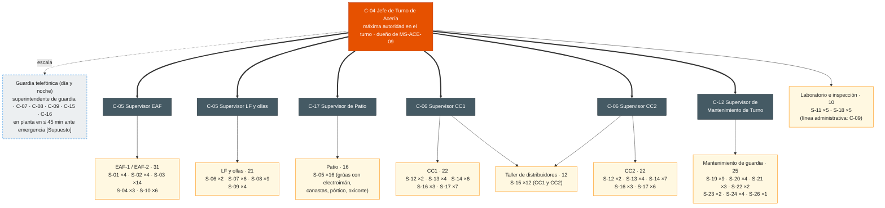

# Organigrama de la Acería (Steelmaking) — Complejo Acería Norte

| Código | Versión | Estado | Área | Elaboró | Revisión técnica | Revisión de seguridad | Revisión laboral | Revisión documental | Aprobó | Fecha | Próxima revisión |
|---|---|---|---|---|---|---|---|---|---|---|---|
| ORG-ACE-001 | 0.2 | **Borrador para validación** | Acería | gerente-personal-confianza | experto-operativo-metalurgia — pendiente | experto-seguridad-salud — pendiente | experto-relaciones-laborales — visto bueno con observaciones, 2026-09-25 (ver `REVISION-LABORAL.md`) | Criterio de experto-documentacion-mejora aplicado en la revisión laboral; visto bueno formal pendiente | **Pendiente — Director de C&D** (único que aprueba; validación operativa previa con C-01) | 2026-09-25 | 2027-09-25 |

> **Mensaje clave.** La Acería tiene **1,023 plazas**: **60 de confianza** en 17 roles (C-01 a C-17) y **963 sindicalizadas** en 26 categorías (S-01 a S-26), conciliadas con DP-ACE-S v0.2. Hay tres superintendencias (Hornos, Colada Continua y Mantenimiento) y una **jefatura de turno** (4 C-04) que reporta al Gerente y tiene el mando de toda la planta en su cuadrilla. En cada turno de 12 h hay **7 mandos de confianza y 159 sindicalizados** en planta (134 de operación y 25 de mantenimiento de guardia, según DP-ACE-S). Ingeniería de proceso, calidad y seguridad son staff: asesoran y tienen autoridad para detener, pero no mandan sobre la operación. **El mando sobre el personal sindicalizado es solo de roles de confianza** (LFT art. 9): los S-01, S-06, S-12, S-13 y técnicos A coordinan técnicamente, sin funciones de mando.

**Fuentes:** FT-ACE-001 (§1 y §8), CAT-ACE-001, DP-ACE-C v0.2 (`descripciones-puesto-confianza.md`), DP-ACE-S v0.2 (`descripciones-puesto-sindicalizados.md`). Las cifras sindicalizadas están **conciliadas con DP-ACE-S v0.2** (§1 plazas por rol; §2 dotación por turno).

## 1. Organigrama completo

### 1.1 Estructura de mando (mermaid)

Convenciones: línea sólida = línea de mando · línea punteada = staff o línea técnica (ingeniería de proceso, calidad, seguridad, planeación) · línea gruesa = **mando operativo en turno** de C-04 · cifras = plazas sindicalizadas por área (DP-ACE-S v0.2).

```mermaid
flowchart TB
    DIR["Director del Complejo Acería Norte"]:::ext
    C01["C-01 Gerente de Acería<br/>1 plaza"]:::mando
    DIR --> C01

    %% Staff del Gerente (punteado)
    C09["C-09 Metalurgista de Producto /<br/>Ing. de Calidad de Acería · 4"]:::staff
    C16["C-16 Especialista de Seguridad<br/>e Higiene de Acería · 3"]:::staff
    C01 -.-> C09
    C01 -.-> C16

    %% Superintendencias
    C02["C-02 Superintendente de Hornos<br/>(EAF y Metalurgia Secundaria) · 1"]:::mando
    C03["C-03 Superintendente de<br/>Colada Continua (CC1 y CC2) · 1"]:::mando
    C10["C-10 Superintendente de<br/>Mantenimiento de Acería · 1"]:::mando
    C01 --> C02
    C01 --> C03
    C01 --> C10

    %% Jefatura de turno
    C04["C-04 Jefe de Turno de Acería<br/>4 plazas: cuadrillas A, B, C, D"]:::turno
    C01 --> C04
    C02 -. lineamientos .-> C04
    C03 -. lineamientos .-> C04
    C10 -. lineamientos .-> C04

    %% Ingeniería y especialistas (staff)
    C07["C-07 Ingeniero de Proceso<br/>EAF / LF · 3"]:::staff
    C08["C-08 Ingeniero de Proceso<br/>de Colada Continua · 3"]:::staff
    C13["C-13 Planeador / Programador<br/>de Mantenimiento · 3"]:::staff
    C14["C-14 Ingeniero de<br/>Confiabilidad · 2"]:::staff
    C15["C-15 Especialista de<br/>Refractarios · 2"]:::mando
    C02 -.-> C07
    C03 -.-> C08
    C10 -.-> C13
    C10 -.-> C14
    C02 --> C15
    C10 -. cuadrilla S-24 .-> C15

    %% Supervisores
    C05E["C-05 Supervisor de Hornos<br/>EAF · 4 (1 por cuadrilla)"]:::mando
    C05L["C-05 Supervisor de Hornos<br/>LF y ollas · 4"]:::mando
    C17["C-17 Supervisor de Patio de<br/>Chatarra y Materiales · 4"]:::mando
    C06A["C-06 Supervisor de Colada<br/>CC1 · 4"]:::mando
    C06B["C-06 Supervisor de Colada<br/>CC2 · 4"]:::mando
    C11["C-11 Supervisor de Mant. Mecánico · 5<br/>hornos y ollas · grúas · CC1 · CC2 · taller"]:::mando
    C12A["C-12 Supervisor de Mant. E&I<br/>de área · 3"]:::mando
    C12T["C-12 Supervisor de Mant. E&I<br/>de turno · 4"]:::mando
    C02 --> C05E
    C02 --> C05L
    C02 --> C17
    C03 --> C06A
    C03 --> C06B
    C10 --> C11
    C10 --> C12A
    C10 --> C12T
    C04 ==> C05E
    C04 ==> C05L
    C04 ==> C17
    C04 ==> C06A
    C04 ==> C06B
    C04 ==> C12T
    C07 -. técnica .-> C05E
    C07 -. técnica .-> C05L
    C08 -. técnica .-> C06A
    C08 -. técnica .-> C06B

    %% Puestos sindicalizados por área
    subgraph EAF["EAF-1 / EAF-2 · 154 plazas"]
        S01["S-01 Operador de Púlpito de Horno<br/>(Primer Hornero)"]:::sind
        S02["S-02 Operador de Horno de Piso<br/>(Segundo Hornero)"]:::sind
        S03["S-03 Ayudante de Horno<br/>(Tercer Hornero)"]:::sind
        S04["S-04 Operador de Grúa de Carga"]:::sind
        S10["S-10 Operador de Manejo de Escoria"]:::sind
    end
    subgraph LFO["LF-1 / LF-2 y ollas · 102 plazas"]
        S06["S-06 Operador de Horno Olla"]:::sind
        S07["S-07 Ayudante de Horno Olla /<br/>Alimentación de Alambre"]:::sind
        S08["S-08 Preparador de Ollas (Ollero)"]:::sind
        S09["S-09 Operador de Grúa de Colada"]:::sind
    end
    subgraph PAT["Patio de chatarra · 97 plazas"]
        S05["S-05 Operador de Patio de Chatarra"]:::sind
    end
    subgraph CAL["Laboratorio e inspección · 61 plazas (27 + 34)"]
        S11["S-11 Muestrero / Analista de<br/>Laboratorio de Acería"]:::sind
        S18["S-18 Inspector de Calidad<br/>de Semiterminado"]:::sind
    end
    subgraph CC1["CC1 planchón · 22 por turno + taller de distribuidores"]
        A12["S-12 Operador de Púlpito de Colada"]:::sind
        A13["S-13 Operador de Plataforma de Colada"]:::sind
        A14["S-14 Ayudante de Colada"]:::sind
        A15["S-15 Preparador de Distribuidores"]:::sind
        A16["S-16 Operador de Corte y Marcado"]:::sind
        A17["S-17 Operador de Mesa de<br/>Enfriamiento y Despacho"]:::sind
    end
    subgraph CC2["CC2 palanquilla · 22 por turno + taller de distribuidores<br/>(CC1 + CC2: 298 plazas S-12 a S-17)"]
        B12["S-12 Operador de Púlpito de Colada"]:::sind
        B13["S-13 Operador de Plataforma de Colada"]:::sind
        B14["S-14 Ayudante de Colada"]:::sind
        B15["S-15 Preparador de Distribuidores"]:::sind
        B16["S-16 Operador de Corte y Marcado"]:::sind
        B17["S-17 Operador de Mesa de<br/>Enfriamiento y Despacho"]:::sind
    end
    subgraph MEC["Mantenimiento mecánico · 131 plazas"]
        S19["S-19 Mecánico de Acería"]:::sind
        S22["S-22 Técnico Hidráulico"]:::sind
        S23["S-23 Soldador Calificado"]:::sind
        S26["S-26 Lubricador"]:::sind
    end
    subgraph TAL["Taller de moldes y segmentos · 18 plazas"]
        S25["S-25 Mecánico de Taller de<br/>Moldes y Segmentos"]:::sind
    end
    subgraph EI["Eléctrico e instrumentación · 55 plazas"]
        S20["S-20 Electricista de Acería"]:::sind
        S21["S-21 Instrumentista"]:::sind
    end
    subgraph REF["Refractarios · 47 plazas"]
        S24["S-24 Refractarista"]:::sind
    end

    C05E --> EAF
    C05L --> LFO
    C17 --> PAT
    C09 --> CAL
    C06A --> CC1
    C06B --> CC2
    C11 --> MEC
    C11 --> TAL
    C12A --> EI
    C12T --> EI
    C15 --> REF

    classDef mando fill:#455A64,stroke:#263238,color:#ffffff
    classDef turno fill:#E65100,stroke:#BF360C,color:#ffffff
    classDef staff fill:#ECEFF1,stroke:#1E88E5,stroke-dasharray:5 3,color:#212121
    classDef sind fill:#FFF8E1,stroke:#FF8F00,color:#212121
    classDef ext fill:#ffffff,stroke:#455A64,color:#212121
```

**Cómo leerlo:**
- **C-04 reporta a C-01** porque su turno cruza las tres superintendencias. Recibe lineamientos técnicos de C-02, C-03 y C-10 y, **en su cuadrilla, manda sobre todos los supervisores** (línea gruesa). Esta doble línea es la opción A de la Decisión 1 de DP-ACE-C.
- Los supervisores de operación (C-05, C-06, C-17) **reportan en línea sólida a su superintendente**, que los evalúa, los desarrolla y es dueño técnico del área.
- C-09 y C-16 reportan en línea administrativa a C-01 y en línea técnica a Calidad y a SSO del Complejo. Por eso se dibujan como staff. Los dos tienen **autoridad para retener producto (C-09) y para detener el trabajo (C-16)**.
- Los S-11 y S-18 dependen administrativamente de C-09 para mantener la independencia de Calidad; en turno están bajo el mando de C-04.

### 1.2 Figura

> **Nota de control documental:** la figura SVG conserva las cifras sindicalizadas aproximadas de la v0.1 (≈ 150, ≈ 115, ≈ 75, etc.). Las cifras vigentes son las de §1.1 y §1.3. Pendiente: actualizar el SVG en `img/` (fuera del alcance de esta revisión).

### 1.3 Plantilla por área

| Área | Confianza (plazas) | Sindicalizados (DP-ACE-S v0.2) | Códigos S |
|---|---|---|---|
| Gerencia y staff (C-01, C-09, C-16) | 8 | — | — |
| Hornos EAF-1/EAF-2 | C-05 ×4, C-07 ×3 (compartido con LF) | 154 | S-01 (18), S-02 (18), S-03 (77), S-04 (14), S-10 (27) |
| LF-1/LF-2 y ollas | C-05 ×4, C-15 ×2 (refractarios de EAF y de ollas) | 102 | S-06 (9), S-07 (27), S-08 (48), S-09 (18) |
| Patio de chatarra y materiales | C-17 ×4 | 97 | S-05 (97) |
| Laboratorio de Acería | (C-09) | 27 | S-11 (27) |
| Superintendencia de Hornos (C-02) | 1 | — | — |
| **Subtotal hornos, LF, ollas y patio** | **18** (C-02 1, C-05 8, C-07 3, C-15 2, C-17 4) | **380** | FT-ACE-001 §8: ≈ 380 |
| CC1 planchón y CC2 palanquilla | C-06 ×8, C-08 ×3 | 298 | S-12 (18), S-13 (36), S-14 (59), S-15 (70), S-16 (34), S-17 (81) |
| Inspección de semiterminado | (C-09) | 34 | S-18 (34) |
| **Subtotal colada continua** | **12** (C-03 1, C-06 8, C-08 3) | **332** | FT-ACE-001 §8: ≈ 330 |
| Mantenimiento mecánico | C-11 ×4 | 131 | S-19 (78), S-22 (18), S-23 (25), S-26 (10) |
| Taller de moldes y segmentos | C-11 ×1 | 18 | S-25 (18) |
| Eléctrico e instrumentación | C-12 ×7 | 55 | S-20 (32), S-21 (23) |
| Refractarios | (C-15) | 47 | S-24 (47) |
| Planeación y confiabilidad | C-13 ×3, C-14 ×2 | — | — |
| **Subtotal mantenimiento** | **18** (C-10 1, C-11 5, C-12 7, C-13 3, C-14 2) | **251** | FT-ACE-001 §8: ≈ 250 |
| Jefatura de turno | C-04 ×4 | — | — |
| **Total Acería** | **60** (8 + 18 + 12 + 18 + 4) | **963** | **1,023** |

> Nota de conteo: C-01 1 · C-02 1 · C-03 1 · C-04 4 · C-05 8 · C-06 8 · C-07 3 · C-08 3 · C-09 4 · C-10 1 · C-11 5 · C-12 7 · C-13 3 · C-14 2 · C-15 2 · C-16 3 · C-17 4 = **60**. Los S-24 (refractarios) se muestran en hornos porque dependen técnicamente de C-15, pero se cuentan en el bloque de mantenimiento (251). Los S-11 (laboratorio) se cuentan en el bloque de 380 y los S-18 en el de 332, igual que DP-ACE-S §1.1 y FT-ACE-001 §8.

## 2. Organigrama de un turno típico (una cuadrilla de 12 h)

Rol 4x4: cada cuadrilla (A, B, C, D) trabaja 4 turnos de 12 h (de día o de noche) y descansa 4. Este es quién está en planta en **un** turno.

| Grupo en planta (por cuadrilla) | Confianza | Sindicalizados en planta por turno (conciliado con DP-ACE-S §2) |
|---|---|---|
| Jefatura | C-04 ×1 | — |
| Hornos EAF-1 / EAF-2, LF-1 / LF-2, ollas, grúas de colada, patio de chatarra, escoria y laboratorio | C-05 ×2 (EAF; LF y ollas) + C-17 ×1 (patio) | 73 |
| Colada Continua CC1 y CC2 (incluye preparación de distribuidores, corte, mesas e inspección) | C-06 ×2 (CC1; CC2) | 61 |
| Mantenimiento de guardia 24/7 | C-12 ×1 (de turno) | 25 |
| **Total por turno** | **7** | **159** (≈ 166 personas en planta) |

**Lectura (conciliada):** 159 puestos continuos × factor 4.5 (4 cuadrillas + relevo por ≈ 11% de ausencias) + 214 puestos de día × 1.1 = **963 plazas sindicalizadas** (DP-ACE-S). El detalle por puesto de trabajo (púlpito del EAF-1, piso, LF, CC1, CC2, etc.) está en DP-ACE-S §2. Los tramos de C-05 y C-06 crecen de acuerdo con eso (ver §3).

Suma por turno: 31 + 21 + 16 + 10 + 22 + 22 + 12 + 25 = **159** (DP-ACE-S v0.2 §2).

**Jornada 4x4 de 12 h — nota laboral:** el turno de 12 h rebasa las jornadas máximas de los arts. 60–61 LFT (8 h diurna, 7 h nocturna) y el 4x4 promedia 42 h/semana; solo se sostiene si el CCT lo pacta como jornada distribuida (art. 59) con pago del tiempo que exceda la jornada legal (arts. 66–68). La reforma en proceso para reducir la jornada semanal a 40 h dejaría el promedio del 4x4 por encima del máximo y podría subir el factor de relevo de 4.5 a ≈ 4.7 (≈ +35 plazas sindicalizadas) o exigir otro rol; el mismo efecto aplica a los 24 mandos de confianza en turno (C-04, C-05, C-06, C-17) y a los 4 C-12 de turno. **Verificar con Jurídico Laboral.** Detalle en DP-ACE-S §6 nota 1 y `REVISION-LABORAL.md`.

**Horario del turno** [Supuesto]: relevo 07:00 y 19:00; entrega–recepción de C-04 a C-04 y de supervisor a supervisor 15 min antes, en campo; junta diaria de producción a las 07:30 (C-01, superintendentes, C-04 saliente y entrante).

## 3. Tramos de control

| Rol | Reportes directos | Personas a cargo (indirectas) | Lectura |
|---|---|---|---|
| C-01 Gerente | 14 formales: C-02, C-03, C-10, C-04 ×4, C-09 ×4, C-16 ×3 | 1,023 | Alto en número, pero **9 efectivos** si los líderes de C-09 y C-16 coordinan a sus pares. Se puede bajar si los C-09 y C-16 no líderes reportan a su líder (A3) |
| C-02 Supt. Hornos | 17: C-05 ×8, C-17 ×4, C-07 ×3, C-15 ×2 | 353 (+ 47 S-24 en línea técnica vía C-15) | 12 de los 17 están en turno; en un día hábil ve a 5 en persona. Aceptable con el mando de C-04 |
| C-03 Supt. Colada | 11: C-06 ×8, C-08 ×3 | 298 | Adecuado |
| C-10 Supt. Mantenimiento | 17: C-11 ×5, C-12 ×7, C-13 ×3, C-14 ×2 | 251 (47 S-24 con dirección técnica de C-15) | Adecuado para mantenimiento con planeación separada |
| C-04 Jefe de Turno | Mando en turno de 6 supervisores | 159 por turno | Adecuado (5–8 mandos por jefe) |
| C-05 EAF / C-05 LF | — | 31 / 21 por turno (73 del bloque de Hornos = 31 + 21 + 16 de patio con C-17 + 5 S-11 con C-09) | **Por encima** de la referencia de 15–25 por supervisor en el EAF [Supuesto]. Los S-01 (Primer Hornero) dan coordinación técnica en cada horno, **sin funciones de mando** (LFT art. 9: la asignación de trabajo y la disciplina no se les delegan). Si no basta, evaluar un segundo C-05 de EAF por turno (decisión del Director, ver `REVISION-LABORAL.md`) |
| C-06 CC1 / C-06 CC2 | — | ≈ 28 / ≈ 28 por turno (22 en máquina + ≈ 6 S-15 del taller de distribuidores; los 5 S-18 con C-09) | Algo por encima de la referencia; los S-12 (púlpito) dan coordinación técnica, **sin funciones de mando** (art. 9). CC2, con 6 líneas, es el más exigente |
| C-17 Patio | — | 16 por turno + transportistas y contratistas | Adecuado; la carga real está en contratistas |
| C-11 (×5) | — | ≈ 30 de día por área (131 mecánicos, hidráulicos, soldadores y lubricadores + 18 S-25 de taller; la mayoría de día) | En el límite alto; se apoya en la coordinación técnica de los técnicos A, **sin delegarles mando** (art. 9) |
| C-12 de área (×3) / de turno (×4) | — | ≈ 7 de día (20 S-20/S-21 de día) / **25 por turno** (guardia completa de mantenimiento) | De turno: en el límite (25 en 7 oficios); vigilar |
| C-15 (×2) | — | ≈ 13 S-24 de día cada uno (26 de día) + contratistas de refractario | Adecuado |
| C-09 (×4) | — | ≈ 15 (27 S-11 + 34 S-18 = 61) cada uno, en línea administrativa | Adecuado |

Cifras sindicalizadas conciliadas con DP-ACE-S v0.2 (380 / 332 / 251 = 963; 159 por turno).

## 4. Interfaces

| Interfaz | Qué se intercambia | Roles de la Acería | Contraparte | Mecanismo y frecuencia |
|---|---|---|---|---|
| **Planta DRI** | DRI/HBI: toneladas, metalización, carbono, temperatura del DRI caliente (500–650 °C), finos; paros coordinados | C-02, C-07, C-04, C-17 | Superintendente y jefe de turno de DRI | Llamada de turno a turno; junta diaria; reporte de calidad de DRI por lote |
| **Laminación en caliente (tira)** | Programa de planchón (ancho 900–1,650 mm, grados), temperatura de carga en caliente, defectos del planchón | C-03, C-06 CC1, C-09, C-04 | Superintendente y jefe de turno de Laminación en caliente | Programa semanal y diario; reclamos internos con 8D |
| **Laminación de largos (varilla)** | Programa de palanquilla (160 o 130 mm, grados NMX-B-506 / ASTM A615), defectos | C-03, C-06 CC2, C-09 | Superintendente de Laminación de largos | Programa semanal y diario |
| **Calidad del Complejo** | Sistema IATF 16949, liberación de producto, reclamos de cliente, auditorías, métodos de laboratorio | C-09 (punteada), C-01, C-03 | Gerencia de Calidad del Complejo | Revisión mensual de calidad; auditorías; 8D |
| **Mantenimiento Central** | Subestación principal y alta tensión, sistemas de agua (torres), grúas de la nave (estándares), taller central, CMMS, contratistas | C-10 (punteada), C-12, C-11, C-13, C-14 | Gerencia de Mantenimiento Central / Confiabilidad | Plan semanal integrado; paros mayores; estándares de confiabilidad |
| **Seguridad y Salud (SSO) del Complejo** | Estándares de riesgo crítico, investigación de incidentes, brigadas, higiene industrial, licencia CNSNS de fuentes radiactivas | C-16 (punteada), C-01, C-04 | Gerencia de SSO del Complejo | Comité mensual de seguridad; VCC; simulacros |
| **Energía** | Contrato eléctrico, control de demanda del EAF, oxígeno, argón y gas natural | C-01, C-02, C-07 | Energía del Complejo | Programa diario de demanda; revisión mensual de kWh/t |
| **C&D (Academia GASM)** | Descripciones de puesto, matriz de competencias, certificación TD-P07, Escuela de Supervisores, simuladores, aprendices, sucesión | C-01, C-02, C-03, C-10, todos los supervisores | TD-S04 (Superintendente de C&D Acería Norte), TD-C-ACN-02 (coordinador Acería EAF, horno olla y colada), TD-C-ACN-05 (Mantenimiento y Legado Experto), TD-C-ACN-08 (Centro de Formación, simuladores y Escuela de Supervisores), TD-10 (Academia de Acería y Laminación), TD-12 (socio de negocio de mandos de operación) | Plan anual de capacitación; revisión mensual de certificaciones; revisión de talento anual |
| **Relaciones Laborales** | Escalafón, movimientos, capacitación DC-3/DC-4, comisión mixta (CMCAP) | C-01, superintendentes, C-04 | Relaciones Laborales del Complejo; delegados sindicales | Reunión mensual; según evento |

## 5. Implicaciones para C&D

| Población | Plazas | Programa | Nota |
|---|---|---|---|
| Jefes de turno y supervisores (C-04, C-05, C-06, C-11, C-12, C-17) | 36 | **L-1 "Líder de Turno"** (96 h, 6 meses) | ≈ 2 cohortes de 20; meta de supervisores formados 40% (año 1) → 95% (año 3) |
| Gerente y superintendentes (C-01, C-02, C-03, C-10) | 4 | **L-2 "Líder de Líderes"** (120 h, 9 meses) | Los 4 C-04, después de L-1, como sucesores |
| Ingenieros y especialistas (C-07, C-08, C-09, C-13, C-14, C-15, C-16) | 20 | Rutas técnicas de las academias, green belt, Escuela Digital | Fuente principal: Ingenieros en Desarrollo |
| Posiciones críticas para sucesión [Supuesto] | C-01, C-02, C-03, C-10, C-04, líderes de C-07 y C-08, C-15 | Revisión de talento (9-box) e IDP | Entran en las ≈ 150 posiciones críticas del grupo |

## 6. Revisión cruzada requerida

- **experto-relaciones-laborales:** mando de C-04 y de los supervisores sobre sindicalizados; conciliación de cifras con DP-ACE-S; supervisores que vienen del escalafón — **hecho en v0.2: visto bueno con observaciones** (`REVISION-LABORAL.md`).
- **experto-operativo-metalurgia:** dotación por turno (tabla de §2) y realismo de la cuadrilla.
- **experto-seguridad-salud:** guardia y tiempo de respuesta ante emergencias; figura de Encargado de Seguridad Radiológica.
- **experto-liderazgo-cambio:** doble línea (superintendente / jefe de turno) y su comunicación.

## 7. Decisión requerida del Director

| # | Tema | Opciones | Recomendación | Riesgos | Costo | Fecha límite |
|---|---|---|---|---|---|---|
| 1 | Modelo de mando en turno | Ver DP-ACE-C, Decisión 1 (A: sólida al superintendente + mando en turno de C-04; B: sólida a C-04; C: Superintendente de Producción) | **A** | Confusión de doble línea si no se comunica | Sin costo (C: +1 plaza A2) | 2026-10-30 |
| 2 | Conciliación de la plantilla sindicalizada | **A.** Conciliar este organigrama con DP-ACE-S antes de publicarlo. **B.** Publicar con cifras aprox. y ajustar después | **A** — **atendida en v0.2** (963; 159 por turno); falta actualizar la figura SVG | B: tramos de control y cupos de formación mal dimensionados | Ninguno | Confirmar al aprobar v0.2 |
| 3 | Tramo del Gerente (14 reportes formales) | **A.** C-09 y C-16 no líderes reportan a su líder (C-01 queda con 9). **B.** Mantener 14 | **A** | B: sobrecarga del Gerente | Ninguno | 2026-10-30 |

## 8. Control de cambios

| Versión | Fecha | Cambio | Elaboró |
|---|---|---|---|
| 0.1 | 2026-09-25 | Versión inicial: organigrama completo, figura SVG, turno típico, tramos e interfaces | gerente-personal-confianza |
| 0.2 | 2026-09-25 | Revisión laboral y documental: plantilla por área y diagrama de turno conciliados con DP-ACE-S v0.2 (963; 159 por turno: 31 + 21 + 16 + 10 + 22 + 22 + 12 + 25); tramos de control recalculados; coordinación técnica sin mando (art. 9); nota de jornada 4x4 y reforma de 40 h; encabezado con revisores; nota sobre la figura SVG pendiente de actualizar | experto-relaciones-laborales |
