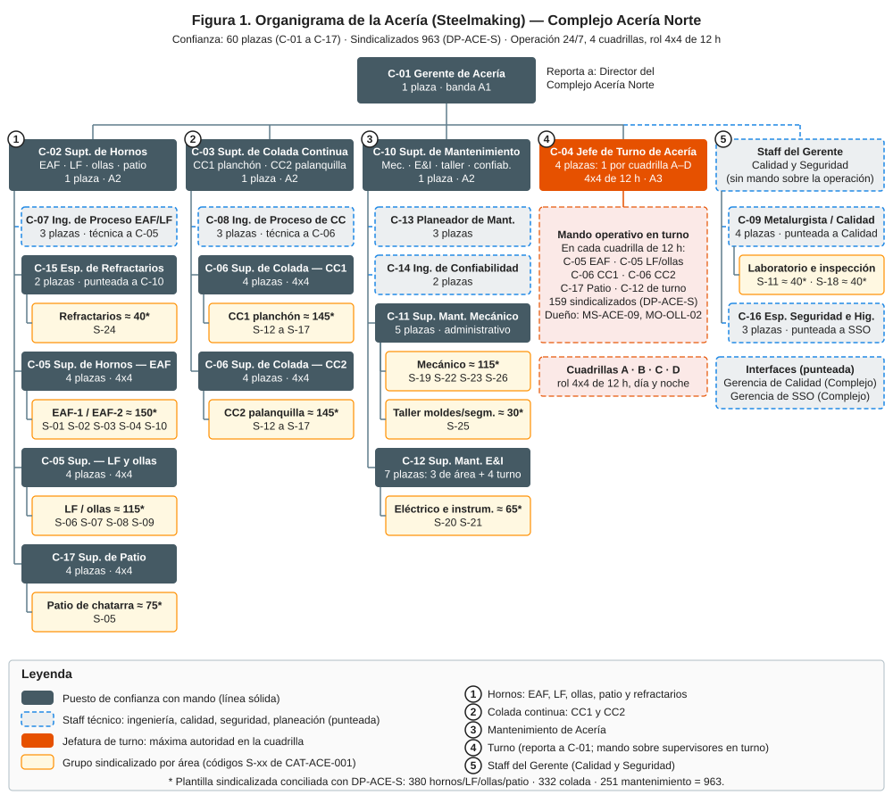
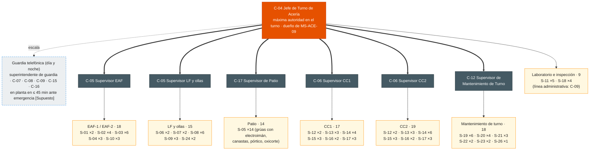

# Organigrama de la Acería (Steelmaking) — Complejo Acería Norte

| Código | Versión | Estado | Área | Elaboró | Revisión técnica | Revisión laboral | Aprobó | Fecha | Próxima revisión |
|---|---|---|---|---|---|---|---|---|---|
| ORG-ACE-001 | 0.1 | **Borrador para validación** | Acería | gerente-personal-confianza | experto-operativo-metalurgia | experto-relaciones-laborales | Pendiente (Gerente de Acería C-01 / Director de C&D) | 2026-09-25 | 2027-09-25 |

> **Mensaje clave.** La Acería tiene ≈ 1,020 personas: **60 de confianza** en 17 roles (C-01 a C-17) y **≈ 960 sindicalizados** en 26 categorías (S-01 a S-26). Hay tres superintendencias (Hornos, Colada Continua y Mantenimiento) y una **jefatura de turno** (4 C-04) que reporta al Gerente y tiene el mando de toda la planta en su cuadrilla. En cada turno de 12 h hay **7 mandos de confianza y 159 sindicalizados** en planta (134 de operación y 25 de mantenimiento de guardia, según DP-ACE-S). Ingeniería de proceso, calidad y seguridad son staff: asesoran y tienen autoridad para detener, pero no mandan sobre la operación.

**Fuentes:** FT-ACE-001 (§1 y §8), CAT-ACE-001, DP-ACE-C (`descripciones-puesto-confianza.md`). Las cifras sindicalizadas son **aprox., a conciliar con DP-ACE-S** (en elaboración en paralelo).

## 1. Organigrama completo

### 1.1 Estructura de mando (mermaid)

Convenciones: línea sólida = línea de mando · línea punteada = staff o línea técnica (ingeniería de proceso, calidad, seguridad, planeación) · línea gruesa = **mando operativo en turno** de C-04 · * = plantilla sindicalizada aprox., a conciliar con DP-ACE-S.

**Cómo leerlo:**
- **C-04 reporta a C-01** porque su turno cruza las tres superintendencias. Recibe lineamientos técnicos de C-02, C-03 y C-10 y, **en su cuadrilla, manda sobre todos los supervisores** (línea gruesa). Esta doble línea es la opción A de la Decisión 1 de DP-ACE-C.
- Los supervisores de operación (C-05, C-06, C-17) **reportan en línea sólida a su superintendente**, que los evalúa, los desarrolla y es dueño técnico del área.
- C-09 y C-16 reportan en línea administrativa a C-01 y en línea técnica a Calidad y a SSO del Complejo. Por eso se dibujan como staff. Los dos tienen **autoridad para retener producto (C-09) y para detener el trabajo (C-16)**.
- Los S-11 y S-18 dependen administrativamente de C-09 para mantener la independencia de Calidad; en turno están bajo el mando de C-04.

### 1.2 Figura

### 1.3 Plantilla por área

| Área | Confianza (plazas) | Sindicalizados (aprox., a conciliar con DP-ACE-S) | Códigos S |
|---|---|---|---|
| Gerencia y staff (C-01, C-09, C-16) | 8 | — | — |
| Hornos EAF-1/EAF-2 | C-05 ×4, C-07 ×3 (compartido con LF) | ≈ 150 | S-01, S-02, S-03, S-04, S-10 |
| LF-1/LF-2 y ollas | C-05 ×4, C-15 ×2 (refractarios de EAF y de ollas) | ≈ 115 | S-06, S-07, S-08, S-09 |
| Patio de chatarra y materiales | C-17 ×4 | ≈ 75 | S-05 |
| Laboratorio de Acería | (C-09) | ≈ 40 | S-11 |
| Superintendencia de Hornos (C-02) | 1 | — | — |
| **Subtotal hornos, LF, ollas y patio** | **18** (C-02 1, C-05 8, C-07 3, C-15 2, C-17 4) | **≈ 380** | FT-ACE-001 §8 |
| CC1 planchón | C-06 ×4, C-08 (líder) | ≈ 145 | S-12 a S-17 |
| CC2 palanquilla | C-06 ×4, C-08 ×2 | ≈ 145 | S-12 a S-17 |
| Inspección de semiterminado | (C-09) | ≈ 40 | S-18 |
| **Subtotal colada continua** | **12** (C-03 1, C-06 8, C-08 3) | **≈ 330** | FT-ACE-001 §8 |
| Mantenimiento mecánico | C-11 ×4 | ≈ 115 | S-19, S-22, S-23, S-26 |
| Taller de moldes y segmentos | C-11 ×1 | ≈ 30 | S-25 |
| Eléctrico e instrumentación | C-12 ×7 | ≈ 65 | S-20, S-21 |
| Refractarios | (C-15) | ≈ 40 | S-24 |
| Planeación y confiabilidad | C-13 ×3, C-14 ×2 | — | — |
| **Subtotal mantenimiento** | **18** (C-10 1, C-11 5, C-12 7, C-13 3, C-14 2) | **≈ 250** | FT-ACE-001 §8 |
| Jefatura de turno | C-04 ×4 | — | — |
| **Total Acería** | **60** (8 + 18 + 12 + 18 + 4) | **≈ 960** | **≈ 1,020** |

> Nota de conteo: C-01 1 · C-02 1 · C-03 1 · C-04 4 · C-05 8 · C-06 8 · C-07 3 · C-08 3 · C-09 4 · C-10 1 · C-11 5 · C-12 7 · C-13 3 · C-14 2 · C-15 2 · C-16 3 · C-17 4 = **60**. Los S-24 (refractarios) se muestran en hornos porque dependen técnicamente de C-15, pero se cuentan en el bloque de mantenimiento (≈ 250). Los S-11 (laboratorio) se cuentan en el bloque de ≈ 380 y los S-18 en el de ≈ 330, siguiendo FT-ACE-001 §8.

## 2. Organigrama de un turno típico (una cuadrilla de 12 h)

Rol 4x4: cada cuadrilla (A, B, C, D) trabaja 4 turnos de 12 h (de día o de noche) y descansa 4. Este es quién está en planta en **un** turno.

| Grupo en planta (por cuadrilla) | Confianza | Sindicalizados en planta por turno (conciliado con DP-ACE-S §2) |
|---|---|---|
| Jefatura | C-04 ×1 | — |
| Hornos EAF-1 / EAF-2, LF-1 / LF-2, ollas, grúas de colada, patio de chatarra, escoria y laboratorio | C-05 ×2 (EAF; LF y ollas) + C-17 ×1 (patio) | 73 |
| Colada Continua CC1 y CC2 (incluye preparación de distribuidores, corte, mesas e inspección) | C-06 ×2 (CC1; CC2) | 61 |
| Mantenimiento de guardia 24/7 | C-12 ×1 (de turno) | 25 |
| **Total por turno** | **7** | **159** (≈ 166 personas en planta) |

**Lectura (conciliada):** 159 puestos continuos × factor 4.5 (4 cuadrillas + relevo por ≈ 11% de ausencias) + 214 puestos de día × 1.1 = **963 plazas sindicalizadas** (DP-ACE-S). El detalle por puesto de trabajo (púlpito del EAF-1, piso, LF, CC1, CC2, etc.) está en DP-ACE-S §2. Los tramos de C-05 y C-06 crecen de acuerdo con eso (ver §3).

**Horario del turno** [Supuesto]: relevo 07:00 y 19:00; entrega–recepción de C-04 a C-04 y de supervisor a supervisor 15 min antes, en campo; junta diaria de producción a las 07:30 (C-01, superintendentes, C-04 saliente y entrante).

## 3. Tramos de control

| Rol | Reportes directos | Personas a cargo (indirectas) | Lectura |
|---|---|---|---|
| C-01 Gerente | 14 formales: C-02, C-03, C-10, C-04 ×4, C-09 ×4, C-16 ×3 | ≈ 1,020 | Alto en número, pero **9 efectivos** si los líderes de C-09 y C-16 coordinan a sus pares. Se puede bajar si los C-09 y C-16 no líderes reportan a su líder (A3) |
| C-02 Supt. Hornos | 17: C-05 ×8, C-17 ×4, C-07 ×3, C-15 ×2 | ≈ 380* (incluye S-24 vía C-15) | 12 de los 17 están en turno; en un día hábil ve a 5 en persona. Aceptable con el mando de C-04 |
| C-03 Supt. Colada | 11: C-06 ×8, C-08 ×3 | ≈ 290* | Adecuado |
| C-10 Supt. Mantenimiento | 17: C-11 ×5, C-12 ×7, C-13 ×3, C-14 ×2 | ≈ 210* | Adecuado para mantenimiento con planeación separada |
| C-04 Jefe de Turno | Mando en turno de 6 supervisores | 159 por turno | Adecuado (5–8 mandos por jefe) |
| C-05 EAF / C-05 LF | — | ≈ 35 / ≈ 24 por turno (73 del bloque de Hornos menos ≈ 14 de patio a cargo de C-17) | **Por encima** de la referencia de 15–25 por supervisor en el EAF [Supuesto]. Se mitiga con los S-01 (Primer Hornero) como líderes de equipo en cada horno; si no basta, evaluar un segundo C-05 de EAF por turno (decisión del Director) |
| C-06 CC1 / C-06 CC2 | — | ≈ 28 / ≈ 33 por turno (61 de Colada) | Algo por encima de la referencia; los S-12 (púlpito) actúan como líderes de equipo. CC2, con 6 líneas, es el más cargado |
| C-17 Patio | — | 14* por turno + transportistas y contratistas | Adecuado; la carga real está en contratistas |
| C-11 (×5) | — | ≈ 29* por área (mecánicos, hidráulicos, soldadores, lubricadores de día; taller S-25) | En el límite alto; se apoya en técnicos líderes |
| C-12 de área (×3) / de turno (×4) | — | ≈ 12* de día / 18* por turno | Adecuado |
| C-15 (×2) | — | ≈ 16* S-24 de día cada uno + contratistas de refractario | Adecuado |
| C-09 (×4) | — | ≈ 20* (S-11 y S-18) cada uno, en línea administrativa | Adecuado |

\* Cifras sindicalizadas aprox., a conciliar con DP-ACE-S (≈ 380 / 330 / 250; FT-ACE-001 §8).

## 4. Interfaces

| Interfaz | Qué se intercambia | Roles de la Acería | Contraparte | Mecanismo y frecuencia |
|---|---|---|---|---|
| **Planta DRI** | DRI/HBI: toneladas, metalización, carbono, temperatura del DRI caliente (500–650 °C), finos; paros coordinados | C-02, C-07, C-04, C-17 | Superintendente y jefe de turno de DRI | Llamada de turno a turno; junta diaria; reporte de calidad de DRI por lote |
| **Laminación en caliente (tira)** | Programa de planchón (ancho 900–1,650 mm, grados), temperatura de carga en caliente, defectos del planchón | C-03, C-06 CC1, C-09, C-04 | Superintendente y jefe de turno de Laminación en caliente | Programa semanal y diario; reclamos internos con 8D |
| **Laminación de largos (varilla)** | Programa de palanquilla (160 o 130 mm, grados NMX-B-506 / ASTM A615), defectos | C-03, C-06 CC2, C-09 | Superintendente de Laminación de largos | Programa semanal y diario |
| **Calidad del Complejo** | Sistema IATF 16949, liberación de producto, reclamos de cliente, auditorías, métodos de laboratorio | C-09 (punteada), C-01, C-03 | Gerencia de Calidad del Complejo | Revisión mensual de calidad; auditorías; 8D |
| **Mantenimiento Central** | Subestación principal y alta tensión, sistemas de agua (torres), grúas de la nave (estándares), taller central, CMMS, contratistas | C-10 (punteada), C-12, C-11, C-13, C-14 | Gerencia de Mantenimiento Central / Confiabilidad | Plan semanal integrado; paros mayores; estándares de confiabilidad |
| **Seguridad y Salud (SSO) del Complejo** | Estándares de riesgo crítico, investigación de incidentes, brigadas, higiene industrial, licencia CNSNS de fuentes radiactivas | C-16 (punteada), C-01, C-04 | Gerencia de SSO del Complejo | Comité mensual de seguridad; VCC; simulacros |
| **Energía** | Contrato eléctrico, control de demanda del EAF, oxígeno, argón y gas natural | C-01, C-02, C-07 | Energía del Complejo | Programa diario de demanda; revisión mensual de kWh/t |
| **C&D (Academia GASM)** | Descripciones de puesto, matriz de competencias, certificación TD-P07, Escuela de Supervisores, simuladores, aprendices, sucesión | C-01, C-02, C-03, C-10, todos los supervisores | TD-S04 (Superintendente de C&D Acería Norte), TD-C-ACN-02 (coordinador Acería EAF, horno olla y colada), TD-C-ACN-05 (Mantenimiento y Legado Experto), TD-C-ACN-08 (Centro de Formación, simuladores y Escuela de Supervisores), TD-10 (Academia de Acería y Laminación), TD-12 (socio de negocio de mandos de operación) | Plan anual de capacitación; revisión mensual de certificaciones; revisión de talento anual |
| **Relaciones Laborales** | Escalafón, movimientos, capacitación DC-3/DC-4, comisión mixta (CMCAP) | C-01, superintendentes, C-04 | Relaciones Laborales del Complejo; delegados sindicales | Reunión mensual; según evento |

## 5. Implicaciones para C&D

| Población | Plazas | Programa | Nota |
|---|---|---|---|
| Jefes de turno y supervisores (C-04, C-05, C-06, C-11, C-12, C-17) | 36 | **L-1 "Líder de Turno"** (96 h, 6 meses) | ≈ 2 cohortes de 20; meta de supervisores formados 40% (año 1) → 95% (año 3) |
| Gerente y superintendentes (C-01, C-02, C-03, C-10) | 4 | **L-2 "Líder de Líderes"** (120 h, 9 meses) | Los 4 C-04, después de L-1, como sucesores |
| Ingenieros y especialistas (C-07, C-08, C-09, C-13, C-14, C-15, C-16) | 20 | Rutas técnicas de las academias, green belt, Escuela Digital | Fuente principal: Ingenieros en Desarrollo |
| Posiciones críticas para sucesión [Supuesto] | C-01, C-02, C-03, C-10, C-04, líderes de C-07 y C-08, C-15 | Revisión de talento (9-box) e IDP | Entran en las ≈ 150 posiciones críticas del grupo |

## 6. Revisión cruzada requerida

- **experto-relaciones-laborales:** mando de C-04 y de los supervisores sobre sindicalizados; conciliación de cifras con DP-ACE-S; supervisores que vienen del escalafón.
- **experto-operativo-metalurgia:** dotación por turno (tabla de §2) y realismo de la cuadrilla.
- **experto-seguridad-salud:** guardia y tiempo de respuesta ante emergencias; figura de Encargado de Seguridad Radiológica.
- **experto-liderazgo-cambio:** doble línea (superintendente / jefe de turno) y su comunicación.

## 7. Decisión requerida del Director

| # | Tema | Opciones | Recomendación | Riesgos | Costo | Fecha límite |
|---|---|---|---|---|---|---|
| 1 | Modelo de mando en turno | Ver DP-ACE-C, Decisión 1 (A: sólida al superintendente + mando en turno de C-04; B: sólida a C-04; C: Superintendente de Producción) | **A** | Confusión de doble línea si no se comunica | Sin costo (C: +1 plaza A2) | 2026-10-30 |
| 2 | Conciliación de la plantilla sindicalizada | **A.** Conciliar este organigrama con DP-ACE-S antes de publicarlo. **B.** Publicar con cifras aprox. y ajustar después | **A** | B: tramos de control y cupos de formación mal dimensionados | Ninguno | Cuando se entregue DP-ACE-S |
| 3 | Tramo del Gerente (14 reportes formales) | **A.** C-09 y C-16 no líderes reportan a su líder (C-01 queda con 9). **B.** Mantener 14 | **A** | B: sobrecarga del Gerente | Ninguno | 2026-10-30 |

## 8. Control de cambios

| Versión | Fecha | Cambio | Elaboró |
|---|---|---|---|
| 0.1 | 2026-09-25 | Versión inicial: organigrama completo, figura SVG, turno típico, tramos e interfaces | gerente-personal-confianza |
