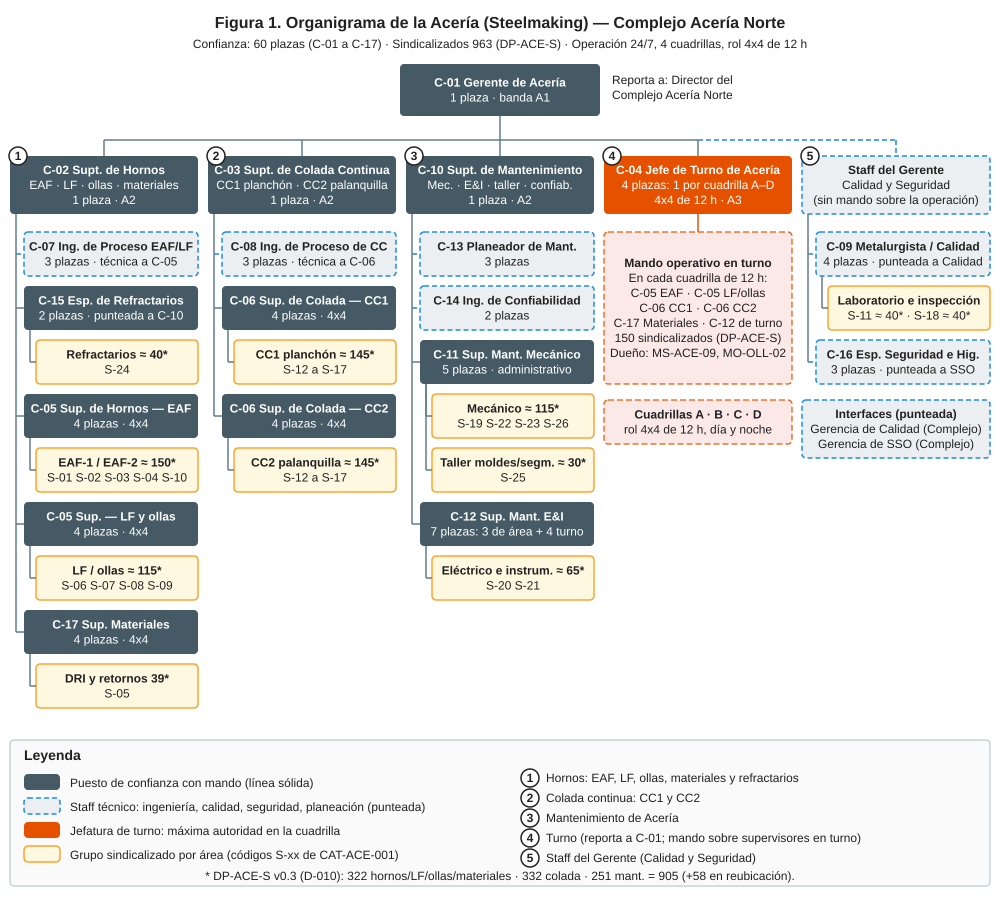
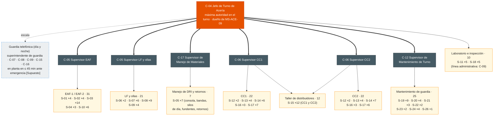

# Organigrama de la Acería (Steelmaking) — Complejo Acería Norte

| Código | Versión | Estado | Área | Elaboró | Revisión técnica | Revisión de seguridad | Revisión laboral | Revisión documental | Aprobó | Fecha | Próxima revisión |
|---|---|---|---|---|---|---|---|---|---|---|---|
| ORG-ACE-001 | 0.3 | **Borrador para validación** | Acería | gerente-personal-confianza | experto-operativo-metalurgia — pendiente | experto-seguridad-salud — pendiente | experto-relaciones-laborales — visto bueno con observaciones, 2026-09-25 (ver `REVISION-LABORAL.md`) | Criterio de experto-documentacion-mejora aplicado en la revisión laboral; visto bueno formal pendiente | **Pendiente — Director de C&D** (único que aprueba; validación operativa previa con C-01) | 2026-09-28 | 2027-09-25 |

> **Mensaje clave.** La Acería tiene **965 plazas de diseño**: **60 de confianza** en 17 roles (C-01 a C-17) y **905 sindicalizadas** en 26 categorías (S-01 a S-26), conciliadas con DP-ACE-S v0.3; más **58 plazas sindicalizadas en reubicación, sin despidos** (1,023 mientras se reubican). La diferencia viene de la **decisión D-010**: GASM no compra chatarra, el EAF se carga con ≈ 95–100 % DRI que llega por bandas desde HYL y Midrex y el patio de chatarra desaparece; S-05 pasa a **Operador de Manejo de DRI y Retornos** y C-17 a **Supervisor de Manejo de Materiales (DRI, fundentes y retornos)** (§6). Hay tres superintendencias (Hornos, Colada Continua y Mantenimiento) y una **jefatura de turno** (4 C-04) que reporta al Gerente y tiene el mando de toda la planta en su cuadrilla. En cada turno de 12 h hay **7 mandos de confianza y 150 sindicalizados** en planta (125 de operación y 25 de mantenimiento de guardia, según DP-ACE-S v0.3). Ingeniería de proceso, calidad y seguridad son staff: asesoran y tienen autoridad para detener, pero no mandan sobre la operación. **El mando sobre el personal sindicalizado es solo de roles de confianza** (LFT art. 9): los S-01, S-06, S-12, S-13 y técnicos A coordinan técnicamente, sin funciones de mando.

**Fuentes:** FT-ACE-001 (§1 y §8), CV-GASM-001 (cadena de valor, D-010), CAT-ACE-001, DP-ACE-C v0.3 (`descripciones-puesto-confianza.md`), DP-ACE-S v0.3 (`descripciones-puesto-sindicalizados.md`). Las cifras sindicalizadas están **conciliadas con DP-ACE-S v0.3** (§1 plazas por rol; §2 dotación por turno).

## 1. Organigrama completo

### 1.1 Estructura de mando (mermaid)

Convenciones: línea sólida = línea de mando · línea punteada = staff o línea técnica (ingeniería de proceso, calidad, seguridad, planeación) · línea gruesa = **mando operativo en turno** de C-04 · cifras = plazas sindicalizadas de diseño por área (DP-ACE-S v0.3).

```mermaid
flowchart TB
    DIR["Director del Complejo Acería Norte"]:::ext
    C01["C-01 Gerente de Acería<br/>1 plaza"]:::mando
    DIR --> C01

    %% Staff del Gerente (punteado)
    C09["C-09 Metalurgista de Producto /<br/>Ing. de Calidad de Acería · 4"]:::staff
    C16["C-16 Especialista de Seguridad<br/>e Higiene de Acería · 3"]:::staff
    C01 -.-> C09
    C01 -.-> C16

    %% Superintendencias
    C02["C-02 Superintendente de Hornos<br/>(EAF y Metalurgia Secundaria) · 1"]:::mando
    C03["C-03 Superintendente de<br/>Colada Continua (CC1 y CC2) · 1"]:::mando
    C10["C-10 Superintendente de<br/>Mantenimiento de Acería · 1"]:::mando
    C01 --> C02
    C01 --> C03
    C01 --> C10

    %% Jefatura de turno
    C04["C-04 Jefe de Turno de Acería<br/>4 plazas: cuadrillas A, B, C, D"]:::turno
    C01 --> C04
    C02 -. lineamientos .-> C04
    C03 -. lineamientos .-> C04
    C10 -. lineamientos .-> C04

    %% Ingeniería y especialistas (staff)
    C07["C-07 Ingeniero de Proceso<br/>EAF / LF · 3"]:::staff
    C08["C-08 Ingeniero de Proceso<br/>de Colada Continua · 3"]:::staff
    C13["C-13 Planeador / Programador<br/>de Mantenimiento · 3"]:::staff
    C14["C-14 Ingeniero de<br/>Confiabilidad · 2"]:::staff
    C15["C-15 Especialista de<br/>Refractarios · 2"]:::mando
    C02 -.-> C07
    C03 -.-> C08
    C10 -.-> C13
    C10 -.-> C14
    C02 --> C15
    C10 -. cuadrilla S-24 .-> C15

    %% Supervisores
    C05E["C-05 Supervisor de Hornos<br/>EAF · 4 (1 por cuadrilla)"]:::mando
    C05L["C-05 Supervisor de Hornos<br/>LF y ollas · 4"]:::mando
    C17["C-17 Supervisor de Manejo de<br/>Materiales (DRI, fundentes<br/>y retornos) · 4"]:::mando
    C06A["C-06 Supervisor de Colada<br/>CC1 · 4"]:::mando
    C06B["C-06 Supervisor de Colada<br/>CC2 · 4"]:::mando
    C11["C-11 Supervisor de Mant. Mecánico · 5<br/>hornos y ollas · grúas · CC1 · CC2 · taller"]:::mando
    C12A["C-12 Supervisor de Mant. E&I<br/>de área · 3"]:::mando
    C12T["C-12 Supervisor de Mant. E&I<br/>de turno · 4"]:::mando
    C02 --> C05E
    C02 --> C05L
    C02 --> C17
    C03 --> C06A
    C03 --> C06B
    C10 --> C11
    C10 --> C12A
    C10 --> C12T
    C04 ==> C05E
    C04 ==> C05L
    C04 ==> C17
    C04 ==> C06A
    C04 ==> C06B
    C04 ==> C12T
    C07 -. técnica .-> C05E
    C07 -. técnica .-> C05L
    C08 -. técnica .-> C06A
    C08 -. técnica .-> C06B

    %% Puestos sindicalizados por área
    subgraph EAF["EAF-1 / EAF-2 · 154 plazas"]
        S01["S-01 Operador de Púlpito de Horno<br/>(Primer Hornero)"]:::sind
        S02["S-02 Operador de Horno de Piso<br/>(Segundo Hornero)"]:::sind
        S03["S-03 Ayudante de Horno<br/>(Tercer Hornero)"]:::sind
        S04["S-04 Operador de Grúa de Carga"]:::sind
        S10["S-10 Operador de Manejo de Escoria"]:::sind
    end
    subgraph LFO["LF-1 / LF-2 y ollas · 102 plazas"]
        S06["S-06 Operador de Horno Olla"]:::sind
        S07["S-07 Ayudante de Horno Olla /<br/>Alimentación de Alambre"]:::sind
        S08["S-08 Preparador de Ollas (Ollero)"]:::sind
        S09["S-09 Operador de Grúa de Colada"]:::sind
    end
    subgraph PAT["Manejo de DRI y retornos · 39 plazas<br/>(+58 en reubicación, D-010)"]
        S05["S-05 Operador de Manejo<br/>de DRI y Retornos"]:::sind
    end
    subgraph CAL["Laboratorio e inspección · 61 plazas (27 + 34)"]
        S11["S-11 Muestrero / Analista de<br/>Laboratorio de Acería"]:::sind
        S18["S-18 Inspector de Calidad<br/>de Semiterminado"]:::sind
    end
    subgraph CC1["CC1 planchón · 22 por turno + taller de distribuidores"]
        A12["S-12 Operador de Púlpito de Colada"]:::sind
        A13["S-13 Operador de Plataforma de Colada"]:::sind
        A14["S-14 Ayudante de Colada"]:::sind
        A15["S-15 Preparador de Distribuidores"]:::sind
        A16["S-16 Operador de Corte y Marcado"]:::sind
        A17["S-17 Operador de Mesa de<br/>Enfriamiento y Despacho"]:::sind
    end
    subgraph CC2["CC2 palanquilla · 22 por turno + taller de distribuidores<br/>(CC1 + CC2: 298 plazas S-12 a S-17)"]
        B12["S-12 Operador de Púlpito de Colada"]:::sind
        B13["S-13 Operador de Plataforma de Colada"]:::sind
        B14["S-14 Ayudante de Colada"]:::sind
        B15["S-15 Preparador de Distribuidores"]:::sind
        B16["S-16 Operador de Corte y Marcado"]:::sind
        B17["S-17 Operador de Mesa de<br/>Enfriamiento y Despacho"]:::sind
    end
    subgraph MEC["Mantenimiento mecánico · 131 plazas"]
        S19["S-19 Mecánico de Acería"]:::sind
        S22["S-22 Técnico Hidráulico"]:::sind
        S23["S-23 Soldador Calificado"]:::sind
        S26["S-26 Lubricador"]:::sind
    end
    subgraph TAL["Taller de moldes y segmentos · 18 plazas"]
        S25["S-25 Mecánico de Taller de<br/>Moldes y Segmentos"]:::sind
    end
    subgraph EI["Eléctrico e instrumentación · 55 plazas"]
        S20["S-20 Electricista de Acería"]:::sind
        S21["S-21 Instrumentista"]:::sind
    end
    subgraph REF["Refractarios · 47 plazas"]
        S24["S-24 Refractarista"]:::sind
    end

    C05E --> EAF
    C05L --> LFO
    C17 --> PAT
    C09 --> CAL
    C06A --> CC1
    C06B --> CC2
    C11 --> MEC
    C11 --> TAL
    C12A --> EI
    C12T --> EI
    C15 --> REF

    classDef mando fill:#455A64,stroke:#263238,color:#ffffff
    classDef turno fill:#E65100,stroke:#BF360C,color:#ffffff
    classDef staff fill:#ECEFF1,stroke:#1E88E5,stroke-dasharray:5 3,color:#212121
    classDef sind fill:#FFF8E1,stroke:#FF8F00,color:#212121
    classDef ext fill:#ffffff,stroke:#455A64,color:#212121
```

**Cómo leerlo:**
- **C-04 reporta a C-01** porque su turno cruza las tres superintendencias. Recibe lineamientos técnicos de C-02, C-03 y C-10 y, **en su cuadrilla, manda sobre todos los supervisores** (línea gruesa). Esta doble línea es la opción A de la Decisión 1 de DP-ACE-C.
- Los supervisores de operación (C-05, C-06, C-17) **reportan en línea sólida a su superintendente**, que los evalúa, los desarrolla y es dueño técnico del área.
- C-09 y C-16 reportan en línea administrativa a C-01 y en línea técnica a Calidad y a SSO del Complejo. Por eso se dibujan como staff. Los dos tienen **autoridad para retener producto (C-09) y para detener el trabajo (C-16)**.
- Los S-11 y S-18 dependen administrativamente de C-09 para mantener la independencia de Calidad; en turno están bajo el mando de C-04.

### 1.2 Figura

> **Nota de control documental:** en la v0.3 se corrigieron en la figura los nombres de C-17 y del área de manejo de materiales (D-010). La figura conserva cifras sindicalizadas aproximadas de la v0.1; las cifras vigentes son las de §1.1 y §1.3.

### 1.3 Plantilla por área

| Área | Confianza (plazas) | Sindicalizados (DP-ACE-S v0.2) | Códigos S |
|---|---|---|---|
| Gerencia y staff (C-01, C-09, C-16) | 8 | — | — |
| Hornos EAF-1/EAF-2 | C-05 ×4, C-07 ×3 (compartido con LF) | 154 | S-01 (18), S-02 (18), S-03 (77), S-04 (14), S-10 (27) |
| LF-1/LF-2 y ollas | C-05 ×4, C-15 ×2 (refractarios de EAF y de ollas) | 102 | S-06 (9), S-07 (27), S-08 (48), S-09 (18) |
| Manejo de DRI, fundentes y retornos (D-010) | C-17 ×4 | 39 [Supuesto] | S-05 (39) |
| Laboratorio de Acería | (C-09) | 27 | S-11 (27) |
| Superintendencia de Hornos (C-02) | 1 | — | — |
| **Subtotal hornos, LF, ollas y manejo de materiales** | **18** (C-02 1, C-05 8, C-07 3, C-15 2, C-17 4) | **322** | FT-ACE-001 v0.3 §8: ≈ 380 (con patio de chatarra; la v0.4 debe bajar a ≈ 322) |
| CC1 planchón y CC2 palanquilla | C-06 ×8, C-08 ×3 | 298 | S-12 (18), S-13 (36), S-14 (59), S-15 (70), S-16 (34), S-17 (81) |
| Inspección de semiterminado | (C-09) | 34 | S-18 (34) |
| **Subtotal colada continua** | **12** (C-03 1, C-06 8, C-08 3) | **332** | FT-ACE-001 §8: ≈ 330 |
| Mantenimiento mecánico | C-11 ×4 | 131 | S-19 (78), S-22 (18), S-23 (25), S-26 (10) |
| Taller de moldes y segmentos | C-11 ×1 | 18 | S-25 (18) |
| Eléctrico e instrumentación | C-12 ×7 | 55 | S-20 (32), S-21 (23) |
| Refractarios | (C-15) | 47 | S-24 (47) |
| Planeación y confiabilidad | C-13 ×3, C-14 ×2 | — | — |
| **Subtotal mantenimiento** | **18** (C-10 1, C-11 5, C-12 7, C-13 3, C-14 2) | **251** | FT-ACE-001 §8: ≈ 250 |
| Jefatura de turno | C-04 ×4 | — | — |
| **Total Acería (diseño)** | **60** (8 + 18 + 12 + 18 + 4) | **905** | **965** |
| Plazas en reubicación (ex S-05 Patio de chatarra, D-010; transitorias, sin despidos, §6.3) | — | 58 | 58 |
| **Total mientras se reubica** | **60** | **963** | **1,023** |

> Nota de conteo: C-01 1 · C-02 1 · C-03 1 · C-04 4 · C-05 8 · C-06 8 · C-07 3 · C-08 3 · C-09 4 · C-10 1 · C-11 5 · C-12 7 · C-13 3 · C-14 2 · C-15 2 · C-16 3 · C-17 4 = **60**. Los S-24 (refractarios) se muestran en hornos porque dependen técnicamente de C-15, pero se cuentan en el bloque de mantenimiento (251). Los S-11 (laboratorio) se cuentan en el bloque de 322 y los S-18 en el de 332, igual que DP-ACE-S §1.1 y FT-ACE-001 §8.

## 2. Organigrama de un turno típico (una cuadrilla de 12 h)

Rol 4x4: cada cuadrilla (A, B, C, D) trabaja 4 turnos de 12 h (de día o de noche) y descansa 4. Este es quién está en planta en **un** turno.

```mermaid
flowchart TB
    JT["C-04 Jefe de Turno de Acería<br/>máxima autoridad en el turno · dueño de MS-ACE-09"]:::turno
    GU["Guardia telefónica (día y noche)<br/>superintendente de guardia · C-07 · C-08 · C-09 · C-15 · C-16<br/>en planta en ≤ 45 min ante emergencia [Supuesto]"]:::staff
    JT -. escala .-> GU

    SE["C-05 Supervisor EAF"]:::mando
    SL["C-05 Supervisor LF y ollas"]:::mando
    SP["C-17 Supervisor de<br/>Manejo de Materiales"]:::mando
    S1["C-06 Supervisor CC1"]:::mando
    S2["C-06 Supervisor CC2"]:::mando
    SM["C-12 Supervisor de<br/>Mantenimiento de Turno"]:::mando
    JT ==> SE
    JT ==> SL
    JT ==> SP
    JT ==> S1
    JT ==> S2
    JT ==> SM

    E["EAF-1 / EAF-2 · 31<br/>S-01 ×4 · S-02 ×4 · S-03 ×14<br/>S-04 ×3 · S-10 ×6"]:::sind
    L["LF y ollas · 21<br/>S-06 ×2 · S-07 ×6 · S-08 ×9<br/>S-09 ×4"]:::sind
    P["Manejo de DRI y retornos · 7<br/>S-05 ×7 (consola, bandas, silos<br/>de día, fundentes, retornos)"]:::sind
    Q["Laboratorio e inspección · 10<br/>S-11 ×5 · S-18 ×5<br/>(línea administrativa: C-09)"]:::sind
    K1["CC1 · 22<br/>S-12 ×2 · S-13 ×4 · S-14 ×6<br/>S-16 ×3 · S-17 ×7"]:::sind
    K2["CC2 · 22<br/>S-12 ×2 · S-13 ×4 · S-14 ×7<br/>S-16 ×3 · S-17 ×6"]:::sind
    D["Taller de distribuidores · 12<br/>S-15 ×12 (CC1 y CC2)"]:::sind
    M["Mantenimiento de guardia · 25<br/>S-19 ×9 · S-20 ×4 · S-21 ×3 · S-22 ×2<br/>S-23 ×2 · S-24 ×4 · S-26 ×1"]:::sind
    SE --> E
    SL --> L
    SP --> P
    JT --> Q
    S1 --> K1
    S2 --> K2
    S1 --> D
    S2 --> D
    SM --> M

    classDef mando fill:#455A64,stroke:#263238,color:#ffffff
    classDef turno fill:#E65100,stroke:#BF360C,color:#ffffff
    classDef staff fill:#ECEFF1,stroke:#1E88E5,stroke-dasharray:5 3,color:#212121
    classDef sind fill:#FFF8E1,stroke:#FF8F00,color:#212121
```

| Grupo en planta (por cuadrilla) | Confianza | Sindicalizados en planta por turno (conciliado con DP-ACE-S §2) |
|---|---|---|
| Jefatura | C-04 ×1 | — |
| Hornos EAF-1 / EAF-2, LF-1 / LF-2, ollas, grúas de colada, manejo de DRI y retornos, escoria y laboratorio | C-05 ×2 (EAF; LF y ollas) + C-17 ×1 (manejo de materiales) | 64 |
| Colada Continua CC1 y CC2 (incluye preparación de distribuidores, corte, mesas e inspección) | C-06 ×2 (CC1; CC2) | 61 |
| Mantenimiento de guardia 24/7 | C-12 ×1 (de turno) | 25 |
| **Total por turno** | **7** | **150** (≈ 157 personas en planta) |

**Lectura (conciliada):** 150 puestos continuos × factor 4.5 (4 cuadrillas + relevo por ≈ 11% de ausencias) + 198 puestos de día × 1.1 ≈ **905 plazas sindicalizadas de diseño** (DP-ACE-S v0.3, redondeo por rol), más 58 en reubicación (§6.3). El detalle por puesto de trabajo (púlpito del EAF-1, piso, LF, CC1, CC2, etc.) está en DP-ACE-S §2. Los tramos de C-05 y C-06 crecen de acuerdo con eso (ver §3).

Suma por turno: 31 + 21 + 7 + 10 + 22 + 22 + 12 + 25 = **150** (DP-ACE-S v0.3 §2). Antes de D-010: 159 (16 del patio de chatarra).

**Jornada 4x4 de 12 h — nota laboral:** el turno de 12 h rebasa las jornadas máximas de los arts. 60–61 LFT (8 h diurna, 7 h nocturna) y el 4x4 promedia 42 h/semana; solo se sostiene si el CCT lo pacta como jornada distribuida (art. 59) con pago del tiempo que exceda la jornada legal (arts. 66–68). La reforma en proceso para reducir la jornada semanal a 40 h dejaría el promedio del 4x4 por encima del máximo y podría subir el factor de relevo de 4.5 a ≈ 4.7 (≈ +33 plazas sindicalizadas con 150 puestos continuos; la reserva de reubicación de §6.3 las podría absorber) o exigir otro rol; el mismo efecto aplica a los 24 mandos de confianza en turno (C-04, C-05, C-06, C-17) y a los 4 C-12 de turno. **Verificar con Jurídico Laboral.** Detalle en DP-ACE-S §6 nota 1 y `REVISION-LABORAL.md`.

**Horario del turno** [Supuesto]: relevo 07:00 y 19:00; entrega–recepción de C-04 a C-04 y de supervisor a supervisor 15 min antes, en campo; junta diaria de producción a las 07:30 (C-01, superintendentes, C-04 saliente y entrante).

## 3. Tramos de control

| Rol | Reportes directos | Personas a cargo (indirectas) | Lectura |
|---|---|---|---|
| C-01 Gerente | 14 formales: C-02, C-03, C-10, C-04 ×4, C-09 ×4, C-16 ×3 | 1,023 | Alto en número, pero **9 efectivos** si los líderes de C-09 y C-16 coordinan a sus pares. Se puede bajar si los C-09 y C-16 no líderes reportan a su líder (A3) |
| C-02 Supt. Hornos | 17: C-05 ×8, C-17 ×4, C-07 ×3, C-15 ×2 | 295 de diseño (+ 58 en reubicación; + 47 S-24 en línea técnica vía C-15) | 12 de los 17 están en turno; en un día hábil ve a 5 en persona. Aceptable con el mando de C-04 |
| C-03 Supt. Colada | 11: C-06 ×8, C-08 ×3 | 298 | Adecuado |
| C-10 Supt. Mantenimiento | 17: C-11 ×5, C-12 ×7, C-13 ×3, C-14 ×2 | 251 (47 S-24 con dirección técnica de C-15) | Adecuado para mantenimiento con planeación separada |
| C-04 Jefe de Turno | Mando en turno de 6 supervisores | 159 por turno | Adecuado (5–8 mandos por jefe) |
| C-05 EAF / C-05 LF | — | 31 / 21 por turno (64 del bloque de Hornos = 31 + 21 + 7 de manejo de materiales con C-17 + 5 S-11 con C-09) | **Por encima** de la referencia de 15–25 por supervisor en el EAF [Supuesto]. Los S-01 (Primer Hornero) dan coordinación técnica en cada horno, **sin funciones de mando** (LFT art. 9: la asignación de trabajo y la disciplina no se les delegan). Si no basta, evaluar un segundo C-05 de EAF por turno (decisión del Director, ver `REVISION-LABORAL.md`) |
| C-06 CC1 / C-06 CC2 | — | ≈ 28 / ≈ 28 por turno (22 en máquina + ≈ 6 S-15 del taller de distribuidores; los 5 S-18 con C-09) | Algo por encima de la referencia; los S-12 (púlpito) dan coordinación técnica, **sin funciones de mando** (art. 9). CC2, con 6 líneas, es el más exigente |
| C-17 Manejo de materiales | — | 7 por turno + contratistas de fundentes y limpieza | **Bajo** tras D-010. Ver §8, tema 5: pasar la supervisión de S-10 (escoria, 6 por turno) a C-17 dejaría C-05 EAF en 25 y C-17 en 13 |
| C-11 (×5) | — | ≈ 30 de día por área (131 mecánicos, hidráulicos, soldadores y lubricadores + 18 S-25 de taller; la mayoría de día) | En el límite alto; se apoya en la coordinación técnica de los técnicos A, **sin delegarles mando** (art. 9) |
| C-12 de área (×3) / de turno (×4) | — | ≈ 7 de día (20 S-20/S-21 de día) / **25 por turno** (guardia completa de mantenimiento) | De turno: en el límite (25 en 7 oficios); vigilar |
| C-15 (×2) | — | ≈ 13 S-24 de día cada uno (26 de día) + contratistas de refractario | Adecuado |
| C-09 (×4) | — | ≈ 15 (27 S-11 + 34 S-18 = 61) cada uno, en línea administrativa | Adecuado |

Cifras sindicalizadas conciliadas con DP-ACE-S v0.2 (380 / 332 / 251 = 963; 159 por turno).

## 4. Interfaces

| Interfaz | Qué se intercambia | Roles de la Acería | Contraparte | Mecanismo y frecuencia |
|---|---|---|---|---|
| **Reducción Directa (HYL y Midrex)** | DRI por bandas directas a los silos de día: toneladas, metalización, carbono, finos, temperatura en banda (≤ 80 °C [Supuesto]) y humedad; límite de batería de las bandas; paros coordinados (CV-GASM-001 §4.2) | C-02, C-07, C-04, C-17 | Superintendentes y jefes de turno de HYL y Midrex | Llamada de turno a turno; junta diaria; reporte de calidad de DRI por lote |
| **Laminación en caliente (tira)** | Programa de planchón (ancho 900–1,650 mm, grados), temperatura de carga en caliente, defectos del planchón | C-03, C-06 CC1, C-09, C-04 | Superintendente y jefe de turno de Laminación en caliente | Programa semanal y diario; reclamos internos con 8D |
| **Laminación de largos (varilla)** | Programa de palanquilla (160 o 130 mm, grados NMX-B-506 / ASTM A615), defectos | C-03, C-06 CC2, C-09 | Superintendente de Laminación de largos | Programa semanal y diario |
| **Calidad del Complejo** | Sistema IATF 16949, liberación de producto, reclamos de cliente, auditorías, métodos de laboratorio | C-09 (punteada), C-01, C-03 | Gerencia de Calidad del Complejo | Revisión mensual de calidad; auditorías; 8D |
| **Mantenimiento Central** | Subestación principal y alta tensión, sistemas de agua (torres), grúas de la nave (estándares), taller central, CMMS, contratistas | C-10 (punteada), C-12, C-11, C-13, C-14 | Gerencia de Mantenimiento Central / Confiabilidad | Plan semanal integrado; paros mayores; estándares de confiabilidad |
| **Seguridad y Salud (SSO) del Complejo** | Estándares de riesgo crítico, investigación de incidentes, brigadas, higiene industrial, licencia CNSNS de fuentes radiactivas | C-16 (punteada), C-01, C-04 | Gerencia de SSO del Complejo | Comité mensual de seguridad; VCC; simulacros |
| **Energía** | Contrato eléctrico, control de demanda del EAF, oxígeno, argón y gas natural | C-01, C-02, C-07 | Energía del Complejo | Programa diario de demanda; revisión mensual de kWh/t |
| **C&D (Academia GASM)** | Descripciones de puesto, matriz de competencias, certificación TD-P07, Escuela de Supervisores, simuladores, aprendices, sucesión | C-01, C-02, C-03, C-10, todos los supervisores | TD-S04 (Superintendente de C&D Acería Norte), TD-C-ACN-02 (coordinador Acería EAF, horno olla y colada), TD-C-ACN-05 (Mantenimiento y Legado Experto), TD-C-ACN-08 (Centro de Formación, simuladores y Escuela de Supervisores), TD-10 (Academia de Acería y Laminación), TD-12 (socio de negocio de mandos de operación) | Plan anual de capacitación; revisión mensual de certificaciones; revisión de talento anual |
| **Relaciones Laborales** | Escalafón, movimientos, capacitación DC-3/DC-4, comisión mixta (CMCAP); redefinición de S-05 y reubicación de 58 plazas (D-010, §6) | C-01, superintendentes, C-04 | Relaciones Laborales del Complejo; delegados sindicales | Reunión mensual; según evento |

## 5. Implicaciones para C&D

| Población | Plazas | Programa | Nota |
|---|---|---|---|
| Jefes de turno y supervisores (C-04, C-05, C-06, C-11, C-12, C-17) | 36 | **L-1 "Líder de Turno"** (96 h, 6 meses) | ≈ 2 cohortes de 20; meta de supervisores formados 40% (año 1) → 95% (año 3) |
| Gerente y superintendentes (C-01, C-02, C-03, C-10) | 4 | **L-2 "Líder de Líderes"** (120 h, 9 meses) | Los 4 C-04, después de L-1, como sucesores |
| Ingenieros y especialistas (C-07, C-08, C-09, C-13, C-14, C-15, C-16) | 20 | Rutas técnicas de las academias, green belt, Escuela Digital | Fuente principal: Ingenieros en Desarrollo |
| S-05 que se quedan en el puesto redefinido (D-010) | 39 | Ruta DRI y manejo de materiales (48 h) + OJT 120 h + TD-P07 y DC-3 (NOM-033, NOM-004) | Examen de suficiencia (art. 153-U) para lo que ya dominan |
| Trabajadores de la antigua S-05 en reubicación (D-010) | hasta 58 | Ruta del puesto destino (S-03, S-08, S-15, S-17, S-10) en jornada y sin costo | Plan DC-2 2027 modificado en la CMCAP (§6.4) |
| Posiciones críticas para sucesión [Supuesto] | C-01, C-02, C-03, C-10, C-04, líderes de C-07 y C-08, C-15 | Revisión de talento (9-box) e IDP | Entran en las ≈ 150 posiciones críticas del grupo |

## 6. Manejo de DRI y retornos (decisión D-010): dotación e impacto laboral

> **Mensaje clave.** Por la decisión D-010 (2026-09-28), GASM **no compra chatarra**: el EAF se carga con ≈ 95–100 % DRI de pelet propio, que llega por **bandas directas desde HYL y Midrex** a los silos de día, más ≤ 5 % de retornos internos (CV-GASM-001). El patio de chatarra desaparece. **S-05** pasa a ser **Operador de Manejo de DRI y Retornos** y **C-17** pasa a ser **Supervisor de Manejo de Materiales (DRI, fundentes y retornos)**. La dotación propuesta de S-05 baja de **97 a 39 plazas [Supuesto]** (16 → 7 por turno). Las **58 plazas restantes se reubican sin despidos**, conservando salario, nivel y antigüedad. Esto **no se ejecuta** sin convenio con el sindicato y sin pasar por la CMCAP. El Director decide la ruta (§8, temas 4 y 5). Todas las citas legales: **verificar con Jurídico Laboral**.

### 6.1 Qué cambia en el área

| Tema | Antes (supuesto de chatarra) | Ahora (D-010) |
|---|---|---|
| Carga metálica del EAF | 60 % DRI + 40 % chatarra; 1–2 canastas por colada | ≈ 95–100 % DRI por el 5.º agujero; retornos internos ≤ 5 % en canasta ocasional |
| Llegada del material | Camiones y góndolas de chatarra comprada; pórtico de radiación | DRI por bandas cerradas desde HYL y Midrex a silos de día; cal y dolomita a tolvas |
| Tareas de S-05 | Pórtico, clasificación, electroimán, armado de canastas, oxicorte de chatarra pesada | Consola de bandas y silos, recorridos de bandas, silos con N₂, fundentes, retornos internos |
| Riesgos principales | Explosivos, recipientes cerrados y fuentes radiactivas en chatarra; carga suspendida | DRI húmedo o reoxidado (H₂, calentamiento), N₂ en galerías y silos (espacio confinado), bandas en movimiento, polvo |
| Proceso | MO-EAF-02 "Carga de chatarra con canasta" | MO-EAF-02 "Recepción de DRI por bandas, silos de día y carga de retornos internos" (lo reescribe experto-operativo-metalurgia) |
| Contratistas | Preparación de chatarra y transporte (REPSE) | Transporte de fundentes; la limpieza rutinaria de bandas la hace personal propio (cuadrilla de día de S-05) |

### 6.2 Dotación propuesta por turno [Supuesto]

Supuestos de cálculo: 2 líneas de bandas cerradas (HYL y Midrex) con arranque en secuencia desde una sola consola; silos de día con inertización y medición de temperatura automáticas; retornos internos ≤ 5 % de la carga metálica (≈ 0.12 Mt/año, ≈ 340 t/día) con una canasta ocasional cada 6–8 coladas por horno [Supuesto]. Los valida C-02, C-07 y experto-operativo-metalurgia contra el diseño real de bandas y silos.

| Puesto de trabajo | Rol | Por turno (24/7) | De día | Plazas equivalentes |
|---|---|---|---|---|
| Consola de manejo de materiales: bandas de DRI (HYL y Midrex) y silos de día | S-05 | 1 | — | 4.5 |
| Recorrido de bandas de DRI, transferencias y colectores de polvo | S-05 | 2 | — | 9.0 |
| Silos de día: temperatura, N₂, niveles y finos de DRI | S-05 | 1 | — | 4.5 |
| Fundentes: recepción y llenado de tolvas de cal y dolomita | S-05 | 1 | — | 4.5 |
| Retornos internos: cargador o grúa con electroimán, revisión radiométrica, canasta ocasional | S-05 | 2 | — | 9.0 |
| Cuadrilla de día: limpieza programada de derrames y bandas, oxicorte de retornos | S-05 | — | 6 | 6.6 |
| **Total S-05** | | **7** | **6** | **39 plazas** (4 × 7 + 4 de relevo + ⌈1.1 × 6⌉) |
| Supervisión | C-17 | 1 | — | 4 plazas (sin cambio) |

**Efectos en otros roles [Supuesto; validar con experto-operativo-metalurgia]:**
- **S-03 (materiales en la nave):** sin cambio de plazas. Frontera de tareas: del silo de día al horno (alimentadores, 5.º agujero, tolvas de adiciones), S-03 y S-01; de HYL/Midrex al silo de día (incluido), S-05.
- **S-04 Grúa de Carga (14):** se mantiene. Pierde ≈ 30 % de su carga (canasta en cada colada), pero la grúa sigue siendo necesaria para electrodos, bóveda y mantenimiento, y la rotación por calor pide 3 por turno. Revisar en 12 meses con datos reales; **no se propone reducir ahora**.
- **S-10 Escoria (27):** la escoria sube a ≈ 150–180 kg/t con DRI (CV-GASM-001 §4.3). Podría requerir **+1 por turno (+5 plazas)**, a validar con C-07 y la medición de potes por turno. Es un destino natural para trabajadores de la antigua S-05 (rama lateral ya prevista en el escalafón).
- **S-23 Soldador:** cambia la mezcla de trabajo (menos canastas, más chutes y bandas por abrasión del DRI); sin cambio de plazas.

**Resultado en la plantilla sindicalizada:** 963 → **905 de diseño** (hornos 380 → 322) + **58 en reubicación**. Por turno: 159 → **150** (bloque de hornos 73 → 64).

### 6.3 Qué pasa con las 97 plazas actuales de S-05 (sin despidos)

**Paso 0: confirmar el escenario real** con Recursos Humanos de la planta y Relaciones Laborales del Complejo, antes de cualquier conversación con el sindicato:
- **Escenario 1 — Plazas de diseño no ocupadas:** si la Acería real ya opera con DRI y las 97 plazas solo existían en este borrador, el cambio es una **corrección de diseño**. No hay trabajadores afectados; basta con ajustar DP-ACE-S, la ficha FT-ACE-001 y el plan DC-2, e **informar** a la CMCAP del cambio de programas de capacitación.
- **Escenario 2 — Plazas ocupadas en la categoría S-05 del CCT:** aplica la ruta siguiente.

**Ruta propuesta para el escenario 2 [Supuesto; negociable con el sindicato]:**

| Grupo | Plazas | Qué pasa | Condiciones para el trabajador |
|---|---|---|---|
| **1. Se quedan como S-05 (nuevo)** | 39 | Recapacitación: ruta técnica de 48 h + OJT de 120 h + certificación TD-P07 y DC-3. Lo que ya dominan (grúa, electroimán, oxicorte, radiación) se acredita por **examen de suficiencia** (art. 153-U) | Mismo nivel N-3, salario y antigüedad. Elección voluntaria por orden de antigüedad en la categoría |
| **2. Movimiento lateral a vacantes N-3** de otras líneas (S-03, S-08, S-15, S-17: 276 plazas de entrada) | ≈ 30–40 en 18 meses | Se congelan los ingresos externos en N-3 durante 18 meses; cada vacante definitiva o temporal de más de 30 días se ofrece primero a la reserva, por antigüedad | Mismo nivel y salario; antigüedad de empresa intacta; antigüedad en la línea destino según el CCT; ruta de formación del puesto destino en jornada y sin costo |
| **3. Ascenso escalafonario** a S-04 (N-5) o lateral a S-10 (N-4) | Según vacantes | Por la regla de siempre: apto certificado de mayor antigüedad (art. 159) | Pago de la categoría destino |
| **4. Refuerzo S-10 por mayor volumen de escoria** | ≈ 5 | Solo si experto-operativo-metalurgia y C-07 validan +1 por turno | Rama lateral ya prevista (N-4) |
| **5. Reserva certificada de relevo** | El resto, decreciente | Cubre ausencias, recertificaciones de 12 meses y la capacitación fuera del puesto; reduce tiempo extra. Si se aprueba la reforma de 40 h, la reserva absorbe las ≈ +33 plazas continuas que haría falta (§2, nota de jornada) | Mismo nivel y salario; asignación por turnos según el CCT |
| **6. Transferencia a Reducción Directa (HYL/Midrex)** | Por definir | Solo si esas plantas tienen vacantes (su dotación está pendiente en `10-plantas/03-reduccion-directa/`) y el CCT permite el cambio de departamento | Voluntaria; conserva antigüedad de empresa |

**Reglas que protegen al trabajador (propuesta para convenio):** nadie pierde salario, nivel ni antigüedad de empresa; los movimientos son voluntarios por orden de antigüedad y, si no hay voluntarios suficientes, por el criterio que pacte la comisión mixta; toda la formación es en jornada, sin costo y con DC-3; ningún resultado de evaluación de la recapacitación se usa como sanción; la reserva se reporta cada trimestre a la CMCAP hasta llegar a cero.

### 6.4 Impacto laboral: escalafón, CCT, categorías, CMCAP

| Tema | Qué dice la ley (resumen — **verificar con Jurídico Laboral**) | Impacto | Propuesta |
|---|---|---|---|
| **Categoría S-05 en el CCT** | Las categorías, funciones y el tabulador forman parte del CCT (art. 391); modificarlo requiere convenio con el sindicato titular, depósito ante el Centro Federal de Conciliación y Registro Laboral y, desde la reforma de 2019, aprobación de los trabajadores por voto personal, libre y secreto (art. 400 Bis) | Cambia el nombre y las funciones de S-05; si el CCT pacta una plantilla por categoría, también cambia el número de plazas | Convenio modificatorio de la categoría; mismo nivel N-3 mientras Compensaciones hace la valuación del puesto |
| **Nivel del nuevo S-05** | El tabulador lo fija el CCT | La consola de bandas y silos puede justificar N-4 en la valuación | No se compromete N-4 sin valuación; si procede, se lleva a la revisión salarial anual (art. 399 Bis) |
| **Sin despidos ni reducción de condiciones** | Reducir el salario o cambiar condiciones de forma unilateral es causa de rescisión imputable al patrón (art. 51). El reajuste por implantación de nuevos procedimientos (art. 439) obliga a indemnizar (4 meses + 20 días por año + prima de antigüedad) y abre un conflicto colectivo | Riesgo alto si se trata como "reducción de personal" | **No** usar la vía del art. 439; reubicación con garantía de salario, nivel y antigüedad |
| **Escalafón (línea 3)** | Vacantes y puestos de nueva creación se cubren con la categoría inmediata inferior; asciende el apto de mayor antigüedad (arts. 154–159); cuadro de antigüedades de la comisión mixta (art. 158) | La línea 3 sigue: S-05 → S-04 → S-09. El requisito de S-04 ("2 años con grúa de electroimán") cambia; los reubicados llegan a otras líneas | Regla transitoria: los S-05 actuales conservan su derecho a S-04 y S-10 con su antigüedad; simulador de grúa de 40 h para compensar la menor práctica; antigüedad en la línea destino según el CCT |
| **Capacitación y CMCAP** | Obligación de capacitar para puestos nuevos, vacantes y cambios de tecnología (arts. 153-A y 153-F); la CMCAP vigila los planes y programas (art. 153-E); el trabajador debe asistir (art. 153-H); examen de suficiencia (art. 153-U); constancias DC-3 (art. 153-V) | El plan DC-2 2027 cambia: sale la ruta de chatarra y entran la ruta DRI (S-05), la ruta del puesto destino (reubicados) y NOM-033 | Sesión extraordinaria de la CMCAP para modificar el plan DC-2 y aprobar los programas; acta firmada; DC-3 nuevas |
| **Materia de trabajo con Reducción Directa** | La titularidad del trabajo se define en el CCT y en los convenios departamentales | Las bandas de DRI cruzan de HYL/Midrex a la Acería: pueden surgir reclamos de ambas secciones o departamentos | Fijar por escrito el "límite de batería" (punto de entrega) con Reducción Directa antes de negociar |
| **Subcontratación (REPSE)** | Solo se subcontratan servicios especializados que no son parte del objeto social ni de la actividad preponderante (arts. 12–15) | Terminan los contratos de preparación de chatarra; la limpieza rutinaria de bandas es operación propia | La cuadrilla de día de S-05 absorbe la limpieza; revisar con Jurídico los contratos que terminan |
| **Seguridad de las nuevas tareas** | NOM-033 (espacios confinados), NOM-004 (maquinaria), NOM-010 (polvo) — verificar con SSO | Riesgos nuevos (N₂, bandas) antes de empezar | Nadie opera el puesto nuevo sin su DC-3 de NOM-033 y LOTO en bandas (política "sin certificación no hay tarea crítica") |
| **Mando (art. 9)** | Las funciones de dirección y vigilancia son de confianza | Ninguno: S-05 avisa, detiene y escala; asigna C-17 | Sin cambio |

### 6.5 Posición preparada para el sindicato y la CMCAP (no se compromete nada)

- **Actores:** secretario general y delegados de la sección de la Acería; comisión mixta de escalafón; CMCAP; Relaciones Laborales del Complejo; C-02 y C-17 como área usuaria.
- **Secuencia propuesta:** (1) el Director decide la ruta (§8); (2) Relaciones Laborales confirma el escenario real y el texto del CCT; (3) reunión previa con la sección sindical; (4) sesión extraordinaria de la CMCAP para el plan de capacitación; (5) mesa de firma del convenio y consulta a los trabajadores si modifica el CCT; (6) comunicación a la cuadrilla con experto-liderazgo-cambio.
- **Argumentos para el trabajador:** cero despidos; salario, nivel y antigüedad garantizados; trabajo con menos exposición a carga suspendida, explosivos y radiación; certificación con DC-3 de valor oficial; la reserva protege frente a la reforma de 40 h.
- **Concesiones posibles:** elección de destino por antigüedad; congelamiento de ingresos externos en N-3; plazo de 18 meses; revisión trimestral en la CMCAP; valuación del puesto de consola.
- **Límites que el Director debe fijar antes de negociar:** no mantener 97 plazas permanentes en S-05; no comprometer N-4 sin valuación; no aceptar que la limpieza de bandas pase a contratistas.

## 7. Revisión cruzada requerida

- **experto-relaciones-laborales:** mando de C-04 y de los supervisores sobre sindicalizados; conciliación de cifras con DP-ACE-S; supervisores que vienen del escalafón — **hecho en v0.2: visto bueno con observaciones** (`REVISION-LABORAL.md`).
- **experto-operativo-metalurgia:** dotación por turno (tabla de §2) y realismo de la cuadrilla.
- **experto-seguridad-salud:** guardia y tiempo de respuesta ante emergencias; figura de Encargado de Seguridad Radiológica.
- **experto-liderazgo-cambio:** doble línea (superintendente / jefe de turno) y su comunicación; plan de cambio y comunicación para la reubicación de la antigua S-05 (D-010).
- **experto-operativo-metalurgia (D-010):** dotación de S-05 de §6.2 contra el diseño real de bandas y silos; posible +1 S-10 por turno por el mayor volumen de escoria; frontera S-03 / S-05.
- **experto-seguridad-salud (D-010):** riesgos de N₂, espacios confinados y bandas del nuevo S-05; DC-3 de NOM-033 antes de operar.
- **experto-documentacion-mejora:** actualizar FT-ACE-001 v0.4 (§8, plantilla de hornos ≈ 322) y CAT-ACE-001 (nombres de S-05 y C-17).

## 8. Decisión requerida del Director

| # | Tema | Opciones | Recomendación | Riesgos | Costo | Fecha límite |
|---|---|---|---|---|---|---|
| 1 | Modelo de mando en turno | Ver DP-ACE-C, Decisión 1 (A: sólida al superintendente + mando en turno de C-04; B: sólida a C-04; C: Superintendente de Producción) | **A** | Confusión de doble línea si no se comunica | Sin costo (C: +1 plaza A2) | 2026-10-30 |
| 2 | Conciliación de la plantilla sindicalizada | **A.** Conciliar este organigrama con DP-ACE-S antes de publicarlo. **B.** Publicar con cifras aprox. y ajustar después | **A** — **atendida en v0.2 y actualizada en v0.3** (905 de diseño + 58 en reubicación; 150 por turno) | B: tramos de control y cupos de formación mal dimensionados | Ninguno | Confirmar al aprobar v0.2 |
| 3 | Tramo del Gerente (14 reportes formales) | **A.** C-09 y C-16 no líderes reportan a su líder (C-01 queda con 9). **B.** Mantener 14 | **A** | B: sobrecarga del Gerente | Ninguno | 2026-10-30 |
| 4 | **Plazas de la antigua S-05 "Operador de Patio de Chatarra" (D-010)** | **A.** Redefinir S-05 como Operador de Manejo de DRI y Retornos (39 plazas [Supuesto]) y reubicar las 58 restantes en 18 meses sin despidos: movimientos laterales a vacantes N-3 con ingresos externos congelados, ascensos por escalafón, posible refuerzo de S-10 y reserva certificada de relevo; convenio con el sindicato y plan DC-2 modificado en la CMCAP (§6.3). **B.** Reajuste de personal por nuevos procedimientos (art. 439): terminación con indemnización de las 58 plazas. **C.** Mantener las 97 plazas en S-05 con funciones ampliadas (sobredotación permanente) | **A**, después del **paso 0**: confirmar con RH y Relaciones Laborales si las 97 plazas están ocupadas (si no lo están, es solo corrección de diseño y el costo es cero) | A: el sindicato puede pedir N-4 para el puesto de consola o que los 97 sigan en S-05; conflicto de materia de trabajo con Reducción Directa. B: conflicto colectivo, riesgo de emplazamiento a huelga, daño a la relación con la sección y a la reputación; contradice "sin despidos". C: costo fijo sin valor y precedente de sobredotación | **A:** capacitación única ≈ MXN 3.8 M (39 × 30 mil + 58 × 45 mil) + costo transitorio bruto de la reserva ≈ MXN 13 M en 18 meses (58 × 25 mil/mes cargado, decreciente), compensado en 30–40 % por menos tiempo extra y cobertura de recertificaciones → neto ≈ MXN 12–13 M. **B:** ≈ MXN 16–17 M de indemnizaciones (58 × ≈ 290 mil) + costos del conflicto. **C:** ≈ MXN 17.4 M por año, permanente. Todas las cifras [Supuesto]: salario cargado N-3 de MXN 25 mil/mes y antigüedad promedio de 8 años | 2026-10-16 (antes de cerrar la DNC y el plan DC-2 2027 y de la próxima sesión de la CMCAP) |
| 5 | Tramo de C-17 tras D-010 (7 por turno) y de C-05 EAF (31 por turno) | **A.** Pasar la supervisión de S-10 (escoria, 6 por turno) a C-17: C-05 EAF queda en 25 y C-17 en 13. **B.** Mantener la estructura (C-17 con 7). **C.** Reducir C-17 a 2 plazas de día y dar su turno a C-05 | **A**, validada con C-02 y experto-operativo-metalurgia (S-10 trabaja en la puerta del horno y coordina con S-02) | A: requiere coordinación C-05 / C-17 en el desescoriado. C: deja sin mando en turno las bandas y silos con N₂ | Sin costo (no cambia plazas ni categorías de S-10) | 2026-10-30 |

## 9. Control de cambios

| Versión | Fecha | Cambio | Elaboró |
|---|---|---|---|
| 0.1 | 2026-09-25 | Versión inicial: organigrama completo, figura SVG, turno típico, tramos e interfaces | gerente-personal-confianza |
| 0.2 | 2026-09-25 | Revisión laboral y documental: plantilla por área y diagrama de turno conciliados con DP-ACE-S v0.2 (963; 159 por turno: 31 + 21 + 16 + 10 + 22 + 22 + 12 + 25); tramos de control recalculados; coordinación técnica sin mando (art. 9); nota de jornada 4x4 y reforma de 40 h; encabezado con revisores; nota sobre la figura SVG pendiente de actualizar | experto-relaciones-laborales |
| 0.3 | 2026-09-28 | Decisión D-010 (sin chatarra comprada; EAF con ≈ 95–100 % DRI por bandas desde HYL y Midrex): S-05 "Operador de Manejo de DRI y Retornos" y C-17 "Supervisor de Manejo de Materiales (DRI, fundentes y retornos)"; nueva §6 con dotación propuesta (7 por turno, 39 plazas [Supuesto]), destino de las 58 plazas sin despidos e impacto laboral; plantilla 905 de diseño + 58 en reubicación; 150 por turno; interfaz con HYL y Midrex; decisiones 4 y 5; figura corregida | experto-relaciones-laborales |
