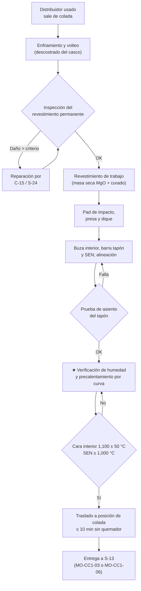

# MO-CC1-01 — Preparación y precalentamiento del distribuidor

| Código | Versión | Estado | Área | Dueño del proceso | Elaboró | Revisión técnica | Revisión de seguridad | Aprobó | Fecha | Próxima revisión |
|---|---|---|---|---|---|---|---|---|---|---|
| MO-CC1-01 | 0.1 | Borrador para validación | Colada Continua 1 (planchón) | C-06 Supervisor de Colada Continua | experto-operativo-metalurgia | experto-operativo-metalurgia — visto bueno con observaciones, 2026-09-25 | experto-seguridad-salud | Pendiente (Gerente de Acería / Director) | 2026-09-25 | 2027-09-25 |

> ⚠️ Valores de referencia tomados de la ficha técnica FT-ACE-001 (§4). Antes de usar en planta, Ingeniería de Proceso (C-08) y Refractarios (C-15) deben validarlos contra los manuales OEM y del proveedor de refractarios.

## 1. Objetivo y alcance
**Objetivo:** entregar a la plataforma de colada un distribuidor de 45 t **seco, limpio, bien armado y precalentado**, con barra tapón y SEN alineadas y probadas, para que el arranque (MO-CC1-03) o el cambio de distribuidor en caliente (MO-CC1-06) sea seguro y sin defectos.

**Alcance:** desde que el distribuidor usado sale del volteo (descostrado) hasta que el carro lo deja en posición de colada con la SEN a la temperatura requerida.
- **Incluye:** inspección del revestimiento, armado del revestimiento de trabajo, colocación de pad de impacto, presa y dique, instalación de buza interior, barra tapón y SEN, prueba de asiento del tapón, precalentamiento y traslado.
- **No incluye:** reparación del revestimiento permanente (la hace C-15 / S-24 con su procedimiento de mantenimiento), el mantenimiento del mecanismo del tapón (MM-CC-04) ni el izaje de distribuidores con grúa (MS-ACE-04).

## 2. Roles y responsabilidades
| Rol | Responsabilidad en este proceso | R/A/C/I |
|---|---|---|
| C-06 Supervisor de Colada Continua | Autoriza el distribuidor como "listo para colar"; firma la lista de verificación | A |
| S-15 Preparador de Distribuidores | Armado del revestimiento de trabajo, pad, presas, tapón y SEN; precalentamiento; registros | R |
| S-13 Operador de Plataforma de Colada | Recibe el distribuidor en la plataforma; verifica centrado, SEN y temperatura antes de colar | R |
| S-24 Refractarista | Revisión del revestimiento permanente y reparaciones menores | C |
| C-15 Especialista de Refractarios | Define materiales, curvas de secado/precalentamiento y criterios de rechazo del revestimiento | C |
| C-08 Ingeniero de Proceso de CC | Define configuración de presas/dique, tipo de SEN y de tapón por grado | C |
| Operador de grúa de CC (50 t) — sin código en CAT-ACE-001 (propuesta S-27; hoy lo cubre S-15) | Traslada el distribuidor vacío entre estaciones | R (izaje) |
| C-16 Especialista de Seguridad | Verifica controles de espacio confinado y de izaje | I |

## 3. Descripción del proceso
El distribuidor es un recipiente refractario de 45 t que recibe el acero de la olla por el tubo protector, lo **calma, lo limpia de inclusiones** (gracias a la zona de impacto, la presa y el dique) y lo entrega al molde a flujo controlado por la **barra tapón** a través de la **SEN**. Su calidad de preparación define tres cosas: la seguridad del arranque (humedad = explosión), la limpieza del acero y la vida del distribuidor en la secuencia (típico 10–15 coladas o 12–16 h [Validar con OEM / Ingeniería de Proceso]).

## 4. Equipos y maquinaria
| Equipo / componente | Función | Especificación clave | Condición para operar (verificación) |
|---|---|---|---|
| Distribuidor (casco + refractario) | Recibir, calmar y repartir el acero | 45 t a 1,100 mm; profundidad interior ≈ 1,300 mm; peso vacío con refractario ≈ 30–40 t [Validar con OEM / Ingeniería de Proceso] | Casco sin deformación ni grietas; orejas de izaje inspeccionadas (vigentes) |
| Revestimiento permanente | Respaldo estructural | Concreto refractario de alta alúmina [Validar con C-15] | Sin desprendimientos > 30 mm ni grietas pasantes |
| Revestimiento de trabajo | Cara en contacto con el acero | Masa seca de MgO vibrada con molde (former) y curada, espesor 40–60 mm [Validar con C-15] | Espesor uniforme, sin huecos, **seca** |
| Pad de impacto | Absorbe el chorro del tubo protector | Pieza prefabricada bajo el tubo protector | Centrado bajo el tubo ± 50 mm; sin grietas |
| Presa y dique | Dirigen el flujo a la superficie para flotar inclusiones | Configuración por grado (C-08) | Posición según plano ± 20 mm; sellados en sus ranuras |
| Buza interior (well nozzle) | Asiento del tapón | Alúmina-grafito / zirconia | Sin grietas; mortero curado |
| Barra tapón (stopper) | Regula el flujo al molde; inyecta argón | Alúmina-grafito con canal de argón; argón 3–8 NL/min en colada | Centrada sobre la buza ± 1 mm; canal de argón libre |
| SEN (buza sumergida) | Lleva el acero al molde bajo el menisco | Puertos laterales; manga de ZrO₂ en la línea de escoria [Validar con OEM / Ingeniería de Proceso] | Vertical ± 1 mm; puertos alineados con las caras angostas ± 2° |
| Mecanismo del tapón | Mueve el tapón (manual/servo) | Carrera calibrada 0 = cerrado [Validar con OEM / Ingeniería de Proceso] | Calibrado; sin juego; prueba de apertura/cierre |
| Estación de precalentamiento | Calienta distribuidor, tapón y SEN | Quemadores de gas natural–aire; control por curva | Detectores de flama y de gas activos; válvulas de corte probadas |
| Carro de distribuidor | Lleva el distribuidor a posición de colada | Elevación, centrado X–Y y celdas de carga | Frenos, límites y pesaje verificados |
| Grúa de CC y producto (50 t) | Mueve el distribuidor vacío | 50 t; tenaza/balancín para distribuidor | Solo distribuidor **vacío**; inspección pre-uso (MS-ACE-04) |
| Termopar / pirómetro de cara caliente | Mide temperatura de precalentamiento | Rango 0–1,400 °C; calibrado | Certificado de calibración vigente |

## 5. Parámetros de operación
| Parámetro | Unidad | Objetivo | Rango normal | Alarma / límite | Acción si está fuera de rango | Dónde se mide |
|---|---|---|---|---|---|---|
| Espesor del revestimiento de trabajo | mm | 50 | 40–60 | < 35 mm en cualquier punto | Rehacer la zona; avisa a C-15 | Varilla/galga en 8 puntos |
| Humedad del revestimiento de trabajo | — | Seco (curado completo) | Curado según curva del proveedor | Vapor visible o curado incompleto | 🛑 No liberar; repetir curado | Registro de curado + inspección visual |
| Centrado del tapón sobre la buza | mm | 0 | ± 1 | > 1 mm | Reajustar el mecanismo | Plantilla de centrado |
| Verticalidad de la SEN | mm | 0 | ± 1 en toda la longitud | > 1 mm | Reinstalar la SEN | Plomada / escuadra |
| Orientación de puertos de la SEN | ° | 0 (hacia caras angostas) | ± 2 | > 2° | Reinstalar | Plantilla de orientación |
| Prueba de asiento del tapón | — | Sin paso de luz | Cierre total | Paso de luz o fuga de aire | Rectificar asiento o cambiar tapón | Prueba de luz / aire [Validar con OEM / Ingeniería de Proceso] |
| Temperatura de la cara caliente al terminar | °C | 1,100 | 1,050–1,150 | < 1,000 °C o > 1,200 °C | < 1,000: seguir calentando; > 1,200: bajar fuego (daño al refractario) | Termopar de cara caliente |
| Temperatura de la SEN al salir del quemador | °C | ≥ 1,050 | 1,000–1,150 | < 1,000 °C | No arrancar; seguir precalentando la SEN | Pirómetro |
| Tiempo total de precalentamiento | h | 3.0 | 2.5–4.0 | < 2.5 h o > 6 h a temperatura | < 2.5: continuar; > 6 h: consulta a C-15 (degradación) | Registro de la estación |
| Tiempo sin quemador hasta abrir la olla | min | ≤ 5 | ≤ 10 | > 10 min | Regresar al quemador o recalentar la SEN | Cronómetro / HMI |
| Presión de gas natural a quemadores | bar | Según OEM | Según OEM | Baja presión = disparo | Revisa válvula de corte y avisa a S-21 | Manómetro de la estación [Validar con OEM / Ingeniería de Proceso] |
| Paso de argón por el tapón (prueba en frío) | NL/min | Flujo libre | 3–8 a presión nominal | Sin flujo | Destapar o cambiar el tapón | Rotámetro |

**Curva típica de precalentamiento [Validar con C-15 / proveedor de refractarios]:**

| Etapa | Tiempo | Temperatura de cara caliente | Nota |
|---|---|---|---|
| 1. Fuego bajo | 0–30 min | hasta ≈ 300 °C | Salida de humedad residual; vigila vapor |
| 2. Rampa | 30–120 min | 300 → 1,000 °C (≈ 8 °C/min máx.) | No acelerar: agrieta el revestimiento |
| 3. Sostenimiento | 120–180 min | 1,100 ± 50 °C | Tapón y SEN en el quemador |
| 4. Espera (si la colada se retrasa) | hasta 6 h totales | 1,050–1,100 °C | > 6 h: consulta a C-15 |

## 6. Seguridad
### 6.1 Peligros y controles críticos
| Peligro | Consecuencia | Control crítico | Verificación |
|---|---|---|---|
| Humedad en el revestimiento, pad, presas, mortero o SEN | Explosión de vapor al recibir acero; proyección de metal | ★ Curado y precalentamiento completos por curva; ningún material mojado o almacenado a la intemperie | Registro de curado firmado; inspección visual sin vapor |
| Carga suspendida (distribuidor vacío de 30–40 t) | Aplastamiento | Izaje solo con grúa de 50 t, accesorios inspeccionados, nadie bajo la carga (MS-ACE-04) | Inspección pre-uso de grúa y balancín |
| Ingreso al distribuidor (limpieza, armado) | Estrés térmico, atmósfera deficiente, caída de refractario | Espacio confinado con permiso (MS-ACE-05, NOM-033): temperatura interior ≤ 45 °C, O₂ 19.5–23.5%, vigía | Permiso de espacio confinado y medición de gases |
| Quemadores de gas natural | Explosión por acumulación de gas | Purga antes de encender, detector de flama, válvula de corte probada (MS-ACE-06) | Lista de encendido de la estación |
| Superficies calientes (1,100 °C) | Quemaduras graves | Distancia, EPP aluminizado para trabajar junto al distribuidor caliente | Observación del supervisor |
| Polvo de MgO y fibras | Afectación respiratoria | Respirador P100, ventilación local | Uso de EPP |
| Carro de distribuidor en movimiento | Atrapamiento, golpe | Alarma sonora/luminosa, área despejada, LOTO para trabajar bajo el carro (MS-ACE-02) | Prueba de alarma; candados |

### 6.2 EPP obligatorio
- Casco con barboquejo, lentes de seguridad, ropa ignífuga (FR) de algodón tratado o lana, botas de seguridad con metatarsal.
- Guantes de carnaza; para trabajo junto al distribuidor caliente: chamarra y polainas aluminizadas y careta con filtro IR.
- Respirador P100 para masa seca, polvo de MgO y fibra cerámica.
- Protección auditiva donde el ruido sea ≥ 85 dB(A) (quemadores).

### 6.3 Permisos, bloqueos y zonas de exclusión
- **Permiso de espacio confinado** (NOM-033-STPS) para entrar al distribuidor; bloqueo de quemadores y del carro (LOTO, MS-ACE-02) antes de entrar.
- **Permiso de trabajo en caliente** para cortes o soldadura en el casco.
- **Zona de exclusión** de 3 m alrededor del distribuidor en precalentamiento y bajo cualquier distribuidor suspendido.

## 7. Calidad
| Variable crítica de calidad | Especificación | Método / frecuencia | Registro | Defecto si falla |
|---|---|---|---|---|
| Limpieza del distribuidor (restos de casco/escoria) | Sin restos sueltos | Visual, cada distribuidor | Lista de verificación | Inclusiones exógenas, taponamiento de SEN |
| Posición de presa y dique | Plano de C-08 ± 20 mm | Cinta, cada distribuidor | Lista de verificación | Inclusiones por corto circuito del flujo |
| Alineación y orientación de la SEN | ± 1 mm; ± 2° | Plantilla, cada distribuidor | Lista de verificación | Flujo asimétrico en el molde → grietas longitudinales, inclusiones de polvo |
| Temperatura de SEN al arranque | ≥ 1,000 °C | Pirómetro, cada arranque | Registro de precalentamiento | Congelamiento o taponamiento en la SEN |
| Canal de argón del tapón | Flujo libre | Rotámetro, cada distribuidor | Lista de verificación | Clogging por Al₂O₃ (MO-CC1-04) |

## 8. Procedimiento paso a paso
| # | Paso | Cómo hacerlo (detalle y medición) | Criterio de aceptación | ★ | Rol |
|---|---|---|---|---|---|
| 1 | Recibe el distribuidor del volteo | Verifica que el casco esté < 100 °C para armar [Validar con C-15]. Revisa orejas de izaje y casco | Sin grietas en casco ni orejas | | S-15 |
| 2 | Inspecciona el revestimiento permanente | Mide desprendimientos con regla; revisa grietas | Desprendimiento ≤ 30 mm; sin grietas pasantes. Si no, avisa a C-15 | | S-15, S-24 |
| 3 | Limpia el interior | Retira restos de casco, escoria y polvo con aspiradora o aire; nunca con agua | Superficie limpia y seca | | S-15 |
| 4 | Entra al distribuidor solo con permiso | Mide O₂ (19.5–23.5%) y temperatura (≤ 45 °C); vigía afuera; LOTO de quemadores y carro | Permiso firmado | ★ | S-15, C-06 |
| 5 | Coloca el pad de impacto | Centrado bajo la posición del tubo protector ± 50 mm | Asentado sin holgura | | S-15 |
| 6 | Arma el revestimiento de trabajo | Coloca el molde (former), vacía y vibra la masa seca de MgO; espesor 40–60 mm | Espesor medido en 8 puntos ≥ 40 mm | | S-15 |
| 7 | Cura el revestimiento | Calienta el former según la curva del proveedor (típico ≈ 250 °C) y retíralo [Validar con C-15] | Masa endurecida, sin zonas blandas | ★ | S-15 |
| 8 | Instala presa y dique | Según el plano del grado (C-08); sella las ranuras con mortero **seco** | Posición ± 20 mm | | S-15 |
| 9 | Instala buza interior y barra tapón | Asienta la buza con mortero; monta el tapón en el mecanismo; conecta la línea de argón | Centrado ± 1 mm | | S-15 |
| 10 | Prueba de asiento del tapón | Cierra el tapón y aplica prueba de luz o de aire [Validar con OEM / Ingeniería de Proceso] | Sin paso de luz / sin fuga | ★ | S-15 |
| 11 | Prueba del argón del tapón | Abre argón a presión nominal y confirma flujo 3–8 NL/min | Flujo libre y estable | | S-15 |
| 12 | Instala la SEN | Verticalidad ± 1 mm; puertos alineados a caras angostas ± 2°; registra número de lote | Dentro de tolerancia | | S-15 |
| 13 | Verifica que todo esté seco | Revisa mortero, sellos, pad y SEN; ningún material mojado o almacenado a la intemperie | Todo seco; registro firmado | ★ | S-15 |
| 14 | Lleva el distribuidor al precalentamiento | Izaje con grúa de 50 t; nadie bajo la carga | Colocado y asegurado | ★ | Grúa, S-15 |
| 15 | Enciende los quemadores | Purga, prueba de detector de flama y encendido según secuencia de la estación | Flama estable; sin alarma de gas | ★ | S-15 |
| 16 | Precalienta por curva | Sigue las etapas 1–4 de la tabla de §5; registra temperatura cada 30 min | Cara caliente 1,100 ± 50 °C; SEN ≥ 1,000 °C | 🔎 | S-15 |
| 17 | Inspecciona antes de liberar | Vapor = 0; revestimiento sin grietas; tapón cerrado; argón OK | Lista de verificación completa | | S-15, C-06 |
| 18 | Libera el distribuidor | C-06 firma "listo para colar" | Firma | | C-06 |
| 19 | Traslada a posición de colada | Apaga quemadores y mueve el carro; tiempo sin fuego ≤ 10 min antes de abrir la olla | ≤ 10 min | 🔎 | S-13 |
| 20 | Centra el distribuidor sobre el molde | Ajuste X–Y; SEN centrada en el molde ± 5 mm respecto a caras anchas y angostas [Validar con OEM / Ingeniería de Proceso] | Centrado | | S-13 |
| 21 | Entrega a S-13 | Registra hora, temperatura final y número de distribuidor | Registro completo | | S-15, S-13 |

## 9. Condiciones anormales y respuesta
| Síntoma / alarma | Causa probable | Acción inmediata | A quién avisar |
|---|---|---|---|
| Vapor o humedad visible en el distribuidor o SEN | Curado incompleto, material mojado | 🛑 No liberar; regresar al quemador; repetir etapa 1 de la curva | C-06, C-15 |
| Alarma de pérdida de flama | Falla de gas o de ignición | Corte automático; purga antes de reencender; no reencender sin purga | S-21, C-06 |
| Olor a gas / detector de gas en alarma | Fuga en línea o válvula | Cierra válvula manual, evacúa 15 m, no uses flama ni equipo eléctrico | C-06, C-16, S-21 |
| Temperatura de cara caliente no sube | Quemador mal ajustado, relación aire–gas | Ajusta relación; revisa quemador | S-21, C-08 |
| Temperatura > 1,200 °C | Sobrecalentamiento | Baja el fuego; registra; C-15 evalúa daño | C-15 |
| Grieta en la SEN o el tapón después del precalentamiento | Choque térmico, material defectuoso | Cambia la pieza y repite precalentamiento de esa pieza | C-06, C-15 |
| Prueba de asiento falla | Mal centrado, asiento dañado | Recentrar; si persiste, cambia tapón o buza | C-06 |
| Retraso de la olla > 6 h a temperatura | Programa de hornos | Mantén 1,050–1,100 °C; C-15 decide si se usa o se rearma | C-06, C-15 |
| Apagón en la estación de precalentamiento | Falla eléctrica | Corte de gas automático; reencender con purga; medir temperatura antes de liberar | C-06 |

## 10. Registros
- Lista de verificación de preparación de distribuidor (número de distribuidor, espesor, presas, tapón, SEN, lotes).
- Registro de curado y curva de precalentamiento (temperatura cada 30 min, hora de apagado).
- Permiso de espacio confinado y LOTO (si hubo ingreso).
- Registro de vida del distribuidor (coladas y horas) para C-15.
- Registros en el sistema de nivel 2 / MES de la máquina.

## 11. Competencia requerida y certificación
| Rol | Nivel requerido (1–4) | Formación teórica (h) | OJT supervisado (h / eventos) | Evaluación (pasos ★) | Vigencia |
|---|---|---|---|---|---|
| S-15 Preparador de Distribuidores | 3 | 16 | 80 h / 10 distribuidores completos | Pasos 4, 7, 10, 13, 14, 15 | ≤ 24 meses (TD-P07) |
| S-13 Operador de Plataforma de Colada | 2 (en este proceso) | 4 | 5 recepciones de distribuidor | Paso 13 (verificación de humedad) | ≤ 24 meses |
| C-06 Supervisor de Colada Continua | 4 (evaluador) | 8 + formación de evaluador | — | Todos | ≤ 24 meses |
| Operador de grúa de CC y producto | 3 | Curso de grúa (NOM-006) | Según MS-ACE-04 | Paso 14 | ≤ 24 meses |

**Lista corta de verificación de pasos ★ (evaluación práctica TD-P07; todos deben aprobarse):**
- [ ] Mide gases y temperatura y aplica LOTO antes de entrar al distribuidor.
- [ ] Explica y aplica la curva de curado; reconoce señales de humedad.
- [ ] Ejecuta la prueba de asiento del tapón e interpreta el resultado.
- [ ] Verifica que todos los materiales estén secos y lo registra.
- [ ] Da señales correctas al izaje y se mantiene fuera de la zona bajo la carga.
- [ ] Enciende quemadores con purga y prueba de flama.
- **Preguntas orales:** ¿Por qué un distribuidor húmedo puede explotar? ¿Qué haces si ves vapor al 90% de la curva? ¿Qué pasa si la SEN llega fría al arranque?

## 12. Referencias
- FT-ACE-001 Ficha técnica de la Acería §4 (CC1); CAT-ACE-001 Catálogo de procesos y roles.
- MO-CC1-03 Arranque de colada; MO-CC1-06 Cambio de SEN y distribuidor; MM-CC-04 Sistemas hidráulicos y barra tapón.
- MS-ACE-01 Metal líquido; MS-ACE-02 LOTO; MS-ACE-03 Agua–metal líquido; MS-ACE-04 Izaje; MS-ACE-05 Espacios confinados; MS-ACE-06 Gases.
- NOM-033-STPS-2015 (espacios confinados), NOM-006-STPS-2014 (manejo de materiales), NOM-017-STPS-2008 (EPP), NOM-015-STPS-2001 (condiciones térmicas), NOM-010-STPS-2014 (agentes químicos), NOM-004-STPS-1999 (maquinaria) — verificar con Jurídico Laboral / SSO.
- Manual OEM de la máquina CC1 y fichas del proveedor de refractarios [por referenciar].
- TD-P07 Certificación de competencia (process-manual).

## 13. Control de cambios
| Versión | Fecha | Cambio | Elaboró |
|---|---|---|---|
| 0.1 | 2026-09-25 | Emisión inicial para validación | experto-operativo-metalurgia |
| 0.1 | 2026-09-25 | Revisión técnica cruzada contra FT-ACE-001 v0.3: rol del operador de grúa de CC referido al pendiente del catálogo (S-27). Precalentamiento de 1,100 ± 50 °C adoptado también en MO-CC2-01. | experto-operativo-metalurgia |
