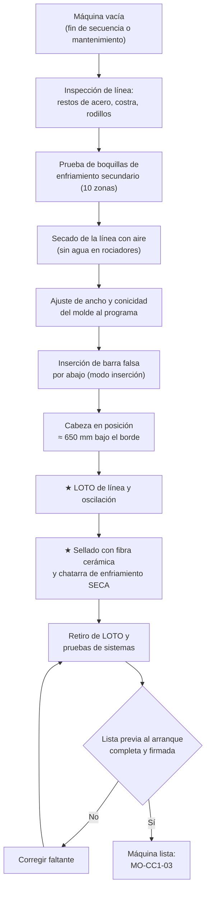

# MO-CC1-02 — Preparación de máquina: inserción y sellado de la barra falsa

| Código | Versión | Estado | Área | Dueño del proceso | Elaboró | Revisión técnica | Revisión de seguridad | Aprobó | Fecha | Próxima revisión |
|---|---|---|---|---|---|---|---|---|---|---|
| MO-CC1-02 | 0.1 | Borrador para validación | Colada Continua 1 (planchón) | C-06 Supervisor de Colada Continua | experto-operativo-metalurgia | experto-operativo-metalurgia | experto-seguridad-salud | Pendiente (Gerente de Acería / Director) | 2026-09-25 | 2027-09-25 |

> ⚠️ Valores de referencia de FT-ACE-001 §4. Posiciones, velocidades de inserción y cantidades de material de sellado dependen del fabricante: **[Validar con OEM / Ingeniería de Proceso]**.

## 1. Objetivo y alcance
**Objetivo:** dejar la máquina CC1 lista para arrancar: línea de colada limpia y seca, molde al ancho del programa, barra falsa tipo cadena en posición dentro del molde y **cabeza sellada y seca**, con todos los sistemas probados (agua de molde, enfriamiento secundario, oscilación, nivel, BOP, agua de emergencia).

**Alcance:** desde que termina la salida de la cola de la secuencia anterior (MO-CC1-07) o el paro de mantenimiento, hasta la firma de la **lista de verificación previa al arranque**.
- **Incluye:** prueba de boquillas y secado de la línea, ajuste de ancho y conicidad, inserción por abajo de la barra falsa, posicionamiento de la cabeza, sellado, chatarra de enfriamiento, pruebas de sistemas.
- **No incluye:** cambio de molde o segmentos (MM-CC-01/02), mantenimiento de la barra falsa.

## 2. Roles y responsabilidades
| Rol | Responsabilidad en este proceso | R/A/C/I |
|---|---|---|
| C-06 Supervisor de Colada Continua | Verifica y firma la lista previa al arranque; autoriza el arranque | A |
| S-12 Operador de Púlpito de Colada | Ejecuta desde la HMI: prueba de boquillas, ajuste de ancho, inserción, pruebas de sistemas | R |
| S-14 Ayudante de Colada | Limpieza y secado del molde, sellado de la cabeza, chatarra de enfriamiento, verificación visual | R |
| S-13 Operador de Plataforma de Colada | Apoya la verificación del molde y los materiales de arranque | C |
| S-21 Instrumentista | Calibración del sensor de nivel y verificación de termopares BOP | C |
| C-08 Ingeniero de Proceso de CC | Define ancho, conicidad y práctica de arranque por grado | C |
| S-19 / S-22 (Mecánico / Técnico hidráulico) | Atienden fallas de segmentos, oscilación o hidráulica | I |

## 3. Descripción del proceso
La barra falsa es una cadena de eslabones con una **cabeza** que se introduce **por abajo** a través de los 14 segmentos hasta quedar dentro del molde. Al arrancar, el acero solidifica sobre la cabeza y su gancho de cola de milano; la barra falsa "jala" el planchón a través de la máquina hasta el punto de desconexión. Si la cabeza no queda bien sellada, el acero se fuga por las holguras (fuga al arranque); si hay humedad o aceite, puede haber **explosión** al contacto con el acero.

## 4. Equipos y maquinaria
| Equipo / componente | Función | Especificación clave | Condición para operar (verificación) |
|---|---|---|---|
| Barra falsa tipo cadena | Sostiene el primer acero y lo extrae | Inserción por abajo; cabeza con gancho de cola de milano | Eslabones y pasadores sin fisuras; cabeza sin deformación; gancho limpio |
| Cabeza de barra falsa | Base donde solidifica el primer acero | Ancho según rango del molde [Validar con OEM / Ingeniería de Proceso] | Superficie limpia, sin acero adherido ni aceite |
| Molde | Forma el planchón | Cu-Ag + Ni; 900 mm; ancho 900–1,650 mm; conicidad 1.0–1.2 %/m | Placas sin grietas ni desgaste > límite (MM-CC-01); sin fugas de agua |
| Caras angostas móviles | Ajustan ancho y conicidad | Ajuste de ancho en caliente | Posición y conicidad confirmadas en HMI y con medición manual |
| Segmentos 1–14 | Guían y extraen el planchón | Gap según tabla de conicidad ± 0.5 mm | Última medición de gap vigente; sin rodillos trabados |
| Enfriamiento secundario | Enfría el planchón fuera del molde | 10 zonas de niebla aire–agua; 0.8–1.2 L/kg | Prueba de boquillas: ≤ 2% de boquillas tapadas por zona [Validar con OEM / Ingeniería de Proceso] |
| Agua de molde | Extrae calor del molde | Caras anchas ≈ 4,200 L/min c/u; angostas ≈ 450 L/min c/u; ΔT 6–9 °C | Caudal ≥ 100% nominal antes del arranque |
| Agua de emergencia | Protege el molde ante falla | Torre elevada + bombas diésel; entrada ≤ 15 s | Nivel de torre OK; última prueba semanal aprobada |
| Oscilador hidráulico | Evita adherencia al molde | 120–200 cpm; carrera 4–8 mm; no senoidal | Prueba de frecuencia y carrera |
| Sensor de nivel eddy current | Mide el nivel del molde | ± 3 mm normal; alarma ± 8 mm | Calibrado; señal estable |
| Termopares BOP | Detectan sticker | 3 filas en caras anchas | Todos con lectura; fallas ≤ criterio OEM [Validar con OEM / Ingeniería de Proceso] |
| Unidad de desconexión de barra falsa y almacenamiento | Separa y guarda la barra falsa | Después del enderezado | Libre y en posición |

## 5. Parámetros de operación
| Parámetro | Unidad | Objetivo | Rango normal | Alarma / límite | Acción si está fuera de rango | Dónde se mide |
|---|---|---|---|---|---|---|
| Ancho del molde (arriba) | mm | Ancho del programa × factor de contracción (≈ 1.013) [Validar con OEM / Ingeniería de Proceso] | ± 1 mm del valor calculado | > ± 2 mm | Reajusta caras angostas; mide de nuevo | HMI + flexómetro/regla en el molde |
| Conicidad de caras angostas | %/m | 1.1 | 1.0–1.2 | Fuera de rango | Recalibra; avisa a C-08 | HMI + medidor de conicidad |
| Velocidad de inserción de la barra falsa | m/min | 3–5 (tramo largo) | Hasta 5 | Arrastre o paro por sobrecarga | Detén; revisa rodillos y restos en la línea | HMI |
| Velocidad de aproximación final | m/min | 0.3 | 0.2–0.5 | — | — | HMI |
| Posición de la cabeza | mm bajo el borde superior del molde | ≈ 650 | ± 10 | > ± 10 mm | Reposiciona con el tracking | HMI (encoder) + medición con regla |
| Holgura cabeza–placa (por lado) | mm | 2–5 | 2–5 | > 5 mm | Rellena más fibra; si > 10 mm revisa ancho | Galga |
| Chatarra de enfriamiento | kg | 20 | 15–25 [Validar con OEM / Ingeniería de Proceso] | Mojada, oxidada o con aceite | 🛑 Retira y reemplaza | Báscula / cubeta tarada |
| Capa de chatarra sobre la cabeza | mm | 60 | 50–80 | — | Distribuye uniforme | Regla |
| Caudal de agua de molde (prueba) | L/min | 4,200 (anchas) / 450 (angostas) | ≥ 95% nominal | < 90% | 🛑 No arrancar; avisa a S-21 / MM-CC-03 | HMI |
| Frecuencia de oscilación (prueba) | cpm | Valor de arranque de la tabla | ± 2% | > ± 5% | Avisa a S-22 | HMI |
| Carrera de oscilación (prueba) | mm | 6 | 4–8 | > ± 0.5 mm del ajuste | Avisa a S-22 | HMI / indicador de carátula |
| Presión de aire de secado de la línea | bar | 4–6 [Validar con OEM / Ingeniería de Proceso] | — | — | — | Manómetro |

## 6. Seguridad
### 6.1 Peligros y controles críticos
| Peligro | Consecuencia | Control crítico | Verificación |
|---|---|---|---|
| Movimiento de la barra falsa o de la oscilación con manos o herramientas en el molde | Atrapamiento, amputación | ★ LOTO de accionamientos de segmentos, de la barra falsa y de la oscilación antes de meter manos o herramientas (MS-ACE-02) | Candados personales + prueba de arranque |
| Humedad, aceite u óxido en el molde, la cabeza o la chatarra | Explosión de vapor al arrancar; proyección de metal | ★ Todo material seco y limpio; línea secada con aire; sin gotas de agua en las placas | Inspección visual con lámpara; lista firmada |
| Fuga de agua en placas del molde | Explosión al arrancar | ★ Revisión de fugas con el agua de molde a caudal nominal antes del sellado | Sin gotas ni humedad en 5 min de observación |
| Caída al molde o desde la plataforma | Caída de altura | Barandales, tapa de molde, arnés si se trabaja fuera de barandal (MS-ACE-10, NOM-009) | Inspección de plataforma |
| Rociadores del enfriamiento secundario en prueba | Quemadura con vapor, resbalón | Nadie en la cámara de rociado durante la prueba | Aviso y área despejada |
| Fibra cerámica | Irritación respiratoria y de piel | Respirador P100, guantes, manga larga | EPP |

### 6.2 EPP obligatorio
- Casco, lentes de seguridad, ropa FR, botas con metatarsal, guantes de carnaza.
- Respirador P100 al manipular fibra cerámica.
- Arnés y línea de vida si se trabaja fuera de barandales en la plataforma del molde.

### 6.3 Permisos, bloqueos y zonas de exclusión
- **LOTO obligatorio** (MS-ACE-02) de: accionamiento de la barra falsa, motores de segmentos, oscilación hidráulica y ajuste de ancho, antes de sellar.
- **Zona de exclusión** en la cámara de rociado y bajo la plataforma del molde durante la prueba de boquillas y la inserción.
- Al terminar el sellado: retiro de candados solo por su dueño, conteo de personas y herramientas fuera del molde.

## 7. Calidad
| Variable crítica de calidad | Especificación | Método / frecuencia | Registro | Defecto si falla |
|---|---|---|---|---|
| Ancho y conicidad del molde | ± 1 mm; 1.0–1.2 %/m | Medición manual + HMI, cada arranque | Lista previa al arranque | Ancho fuera de tolerancia; grietas de esquina; abultamiento de cara angosta |
| Boquillas del enfriamiento secundario | ≤ 2% tapadas por zona | Prueba visual, cada arranque | Lista previa | Enfriamiento no uniforme → grietas, abultamiento |
| Gap de segmentos | Tabla ± 0.5 mm | Medidor de gap, según plan de MM-CC-02 | Reporte de gap | Grietas internas, segregación central |
| Sellado de la cabeza | Sin holguras abiertas | Visual, cada arranque | Lista previa | Fuga al arranque, planchón de cabeza defectuoso |

## 8. Procedimiento paso a paso
| # | Paso | Cómo hacerlo (detalle y medición) | Criterio de aceptación | ★ | Rol |
|---|---|---|---|---|---|
| 1 | Inspecciona la línea | Recorre la máquina: restos de acero o costra en rodillos, rodillos trabados, boquillas dañadas | Línea libre | | S-14, S-12 |
| 2 | Prueba de boquillas | Con nadie en la cámara de rociado, activa las 10 zonas en modo prueba; revisa patrón | ≤ 2% tapadas por zona; cambia las tapadas | 🔎 | S-12, S-14 |
| 3 | Seca la línea | Corta el agua de rociadores; sopla con aire 10–15 min; revisa molde y rodillos superiores | Sin agua visible en molde ni segmentos 1–3 | ★ | S-14 |
| 4 | Ajusta el ancho y la conicidad | Carga ancho del programa en HMI; mide arriba y abajo del molde con regla | Ancho ± 1 mm; conicidad 1.0–1.2 %/m | 🔎 | S-12, S-14 |
| 5 | Pon la línea en modo inserción | Segmentos en modo inserción (presión baja) [Validar con OEM / Ingeniería de Proceso]; área despejada | Modo confirmado en HMI | | S-12 |
| 6 | Inserta la barra falsa | Avanza a 3–5 m/min; a 2 m del molde baja a 0.3 m/min | Sin sobrecarga de motores | | S-12 |
| 7 | Posiciona la cabeza | Detén con la cabeza a ≈ 650 mm ± 10 mm bajo el borde; confirma con regla | Posición dentro de tolerancia | 🔎 | S-12, S-14 |
| 8 | Aplica LOTO | Bloquea barra falsa, segmentos, oscilación y ajuste de ancho; prueba de arranque | Candados personales y prueba sin movimiento | ★ | S-14, S-12 |
| 9 | Revisa fugas de agua del molde | Agua de molde a caudal nominal; observa placas y esquinas 5 min con lámpara | Sin gotas ni humedad | ★ | S-14 |
| 10 | Limpia la cabeza y el molde | Retira polvo y restos; nunca uses agua ni aceite; aire seco | Superficies limpias y secas | | S-14 |
| 11 | Sella las holguras | Comprime cordón de fibra cerámica en las holguras cabeza–placa (2–5 mm) y esquinas; cubre con sellador seco | Sin holguras visibles | ★ | S-14 |
| 12 | Coloca la chatarra de enfriamiento | 15–25 kg de clavos, rondanas o recortes limpios y secos; capa uniforme 50–80 mm; sin tapar el gancho en exceso | Distribución uniforme; material seco | ★ | S-14 |
| 13 | Retira herramientas y personal | Cuenta herramientas y personas; tapa de molde en su lugar | Conteo completo | | S-14 |
| 14 | Retira LOTO | Cada dueño retira su candado; avisa por radio al púlpito | Candados retirados | | S-14, S-12 |
| 15 | Prueba la oscilación | Arranca a la frecuencia y carrera de arranque; mide | ± 2% frecuencia; ± 0.5 mm carrera | | S-12 |
| 16 | Prueba el agua de molde | Caudal nominal en las 4 caras; alarmas de caudal y ΔT activas | ≥ 95% nominal | ★ | S-12 |
| 17 | Verifica agua de emergencia | Nivel de torre; bombas diésel en automático; última prueba ≤ 7 días | Estado "listo" en HMI | ★ | S-12 |
| 18 | Verifica nivel y BOP | Sensor calibrado (S-21); todos los termopares con lectura | Sin fallas activas | | S-12, S-21 |
| 19 | Verifica corte y salida | Oxicorte probado; mesa de salida libre; desconexión de barra falsa lista | Listo | | S-16, S-12 |
| 20 | Verifica equipo de emergencia | Lanzas de O₂, cajas de rebose, olla/pote de emergencia, herramientas secas en la plataforma | Completo | | S-13 |
| 21 | Firma la lista previa al arranque | C-06 revisa los 20 puntos y firma | Firma | | C-06 |

## 9. Condiciones anormales y respuesta
| Síntoma / alarma | Causa probable | Acción inmediata | A quién avisar |
|---|---|---|---|
| Sobrecarga de motores al insertar | Restos de acero, rodillo trabado, gap cerrado | Detén; inspecciona con LOTO; no forces | C-06, S-19 |
| Cabeza no llega a la posición | Tracking desfasado, patinamiento | Posiciona manual a baja velocidad; recalibra tracking | S-12, S-21 |
| Gotas de agua en las placas del molde | Fuga en placa o empaque | 🛑 No arrancar; MM-CC-01 | C-06, C-11 |
| Holgura cabeza–placa > 10 mm | Ancho mal ajustado o cabeza equivocada | Revisa ancho; cambia cabeza si aplica | C-06, C-08 |
| Chatarra de enfriamiento mojada u oxidada | Almacenamiento inadecuado | Reemplázala con material seco del almacén cubierto | C-06 |
| Prueba de agua de emergencia vencida o fallida | Falta de mantenimiento | 🛑 No arrancar hasta probar (MM-CC-03) | C-06, C-12 |
| Termopares BOP fallados arriba del criterio | Cable o termopar dañado | Repara antes de arrancar o C-08 autoriza con restricción de velocidad [Validar con OEM / Ingeniería de Proceso] | S-21, C-08 |
| Sensor de nivel inestable | Calibración, interferencia | Recalibra; sin nivel automático no se arranca | S-21 |

## 10. Registros
- Lista de verificación previa al arranque (21 puntos) firmada por C-06.
- Registro de prueba de boquillas (boquillas cambiadas por zona).
- Registro de ancho y conicidad medidos.
- Registro LOTO del sellado.
- Registro de la última prueba de agua de emergencia (MM-CC-03).

## 11. Competencia requerida y certificación
| Rol | Nivel requerido (1–4) | Formación teórica (h) | OJT supervisado (h / eventos) | Evaluación (pasos ★) | Vigencia |
|---|---|---|---|---|---|
| S-14 Ayudante de Colada | 3 | 12 | 40 h / 8 sellados | Pasos 3, 8, 9, 11, 12 | ≤ 24 meses (TD-P07) |
| S-12 Operador de Púlpito de Colada | 3 | 16 | 60 h / 8 preparaciones | Pasos 3, 8, 16, 17 | ≤ 24 meses |
| C-06 Supervisor de Colada Continua | 4 (evaluador) | 8 + evaluador | — | Todos | ≤ 24 meses |

**Lista corta de verificación de pasos ★:**
- [ ] Seca la línea y confirma cero agua en molde y segmentos 1–3.
- [ ] Aplica LOTO a barra falsa, segmentos, oscilación y ajuste de ancho y hace la prueba de arranque.
- [ ] Revisa fugas del molde con agua a caudal nominal.
- [ ] Sella holguras sin dejar pasos y coloca chatarra seca de 15–25 kg.
- [ ] Confirma agua de molde ≥ 95% y agua de emergencia lista.
- **Preguntas orales:** ¿Por qué la chatarra debe estar seca y sin aceite? ¿Qué pasa si la holgura queda abierta? ¿Quién retira cada candado?

## 12. Referencias
- FT-ACE-001 §4; CAT-ACE-001; MO-CC1-03; MO-CC1-07; MM-CC-01, MM-CC-02, MM-CC-03, MM-CC-04.
- MS-ACE-02 LOTO; MS-ACE-03 Agua–metal líquido; MS-ACE-10 Trabajo en altura.
- NOM-004-STPS-1999 (maquinaria), NOM-009-STPS-2011 (alturas), NOM-017-STPS-2008 (EPP), NOM-010-STPS-2014 (agentes químicos) — verificar con Jurídico Laboral / SSO.
- Manual OEM de la máquina CC1 (barra falsa, segmentos, oscilación) [por referenciar].

## 13. Control de cambios
| Versión | Fecha | Cambio | Elaboró |
|---|---|---|---|
| 0.1 | 2026-09-25 | Emisión inicial para validación | experto-operativo-metalurgia |
