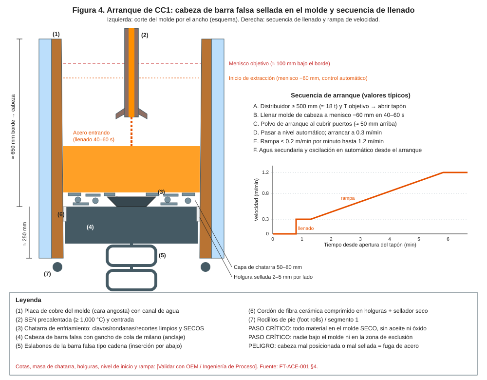
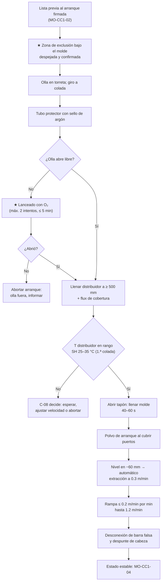

# MO-CC1-03 — Arranque de colada (apertura de olla y distribuidor, llenado del molde)

| Código | Versión | Estado | Área | Dueño del proceso | Elaboró | Revisión técnica | Revisión de seguridad | Aprobó | Fecha | Próxima revisión |
|---|---|---|---|---|---|---|---|---|---|---|
| MO-CC1-03 | 0.1 | Borrador para validación | Colada Continua 1 (planchón) | C-06 Supervisor de Colada Continua | experto-operativo-metalurgia | experto-operativo-metalurgia — visto bueno con observaciones, 2026-09-25 | experto-seguridad-salud — visto bueno con observaciones, 2026-09-25 | Pendiente (Gerente de Acería / Director) | 2026-09-25 | 2027-09-25 |

> ⚠️ Valores de referencia de FT-ACE-001 §4 y §7. Nivel de apertura, tiempo de llenado, velocidad de arranque y rampa: **[Validar con OEM / Ingeniería de Proceso]**.

## 1. Objetivo y alcance
**Objetivo:** abrir la olla y el distribuidor y llenar el molde sobre la barra falsa de forma **segura** (sin fugas, derrames ni explosiones) y **estable** (nivel en control automático, velocidad en rampa), hasta alcanzar la colada en estado estable (MO-CC1-04).

**Alcance:** desde la firma de la lista previa al arranque (MO-CC1-02) y la llegada de la primera olla a la torreta, hasta la velocidad nominal con nivel automático y la desconexión de la barra falsa.

## 2. Roles y responsabilidades
| Rol | Responsabilidad en este proceso | R/A/C/I |
|---|---|---|
| C-06 Supervisor de Colada Continua | Dirige el arranque; verifica la zona de exclusión; decide abortar | A |
| S-12 Operador de Púlpito de Colada | Nivel automático, velocidad, rampa, oscilación, enfriamiento; vigila BOP | R |
| S-13 Operador de Plataforma de Colada | Tubo protector, apertura de olla, lanceado, nivel y temperatura del distribuidor, apertura del tapón (modo manual) | R |
| S-14 Ayudante de Colada | Polvo de arranque y de molde, observación del molde, apoyo en plataforma | R |
| S-09 Operador de Grúa de Colada | Coloca la olla llena en la torreta | R (izaje) |
| S-11 Muestrero | Muestra del distribuidor (producto) | R |
| C-08 Ingeniero de Proceso de CC | Consulta en desviaciones de temperatura, química o arranque | C |
| C-04 Jefe de Turno | Informado de arranques abortados o incidentes | I |

## 3. Descripción del proceso
El arranque es la etapa de **mayor riesgo** de la colada continua: hay acero líquido en el molde sin cáscara formada, la barra falsa recibe el primer impacto y el personal está cerca del molde. La secuencia es: olla en torreta → torreta a posición de colada → tubo protector con argón → apertura de la olla → llenado del distribuidor a ≥ 500 mm → apertura del tapón → llenado del molde en 40–60 s → polvo de arranque → nivel automático y extracción a 0.3 m/min → rampa hasta 1.2 m/min.

## 4. Equipos y maquinaria
| Equipo / componente | Función | Especificación clave | Condición para operar (verificación) |
|---|---|---|---|
| Torreta de ollas tipo mariposa | Soporta y gira las ollas; las pesa | 2 brazos; pesaje de olla | Frenos y giro probados; pesaje en cero con brazo vacío |
| Olla de 150 t | Contiene el acero tratado en LF | Válvula deslizante; arena de sello de cromita | Tratada en LF; temperatura y química de envío registradas |
| Manipulador del tubo protector | Coloca el tubo en la buza colectora | Sello de argón | Junta nueva; argón con flujo |
| Tubo protector de olla | Protege el chorro de la reoxidación | Sumergido en el distribuidor | Precalentado; sin grietas |
| Distribuidor de 45 t | Recibe y reparte el acero | Nivel 900–1,100 mm; pesaje | Liberado por MO-CC1-01; SEN ≥ 1,000 °C |
| Barra tapón y mecanismo | Regula el flujo al molde | Argón 3–8 NL/min | Probado; modo manual y automático disponibles |
| Lanza de oxígeno | Abre la olla si no abre libre | Tubo de lanza y soporte; O₂ regulado | Lanzas secas, manguera y regulador inspeccionados |
| Sensor de nivel y lazo automático | Controla el nivel del molde con el tapón | ± 3 mm; alarma ± 8 mm | Calibrado (MO-CC1-02) |
| Accionamientos de extracción | Mueven la barra falsa y el planchón | 0.3 → 1.2 m/min | Probados |
| Termopar desechable / muestreador | Temperatura y muestra del distribuidor | Lanza de inmersión | Puntas secas |
| Polvo de arranque y polvo de molde | Aísla y lubrica el menisco | Tipo por grado (C-08) | Sacos secos, cerrados, identificados |

## 5. Parámetros de operación
| Parámetro | Unidad | Objetivo | Rango normal | Alarma / límite | Acción si está fuera de rango | Dónde se mide |
|---|---|---|---|---|---|---|
| Líquidus del grado (calculado) | °C | Bajo C al Al ≈ 1,525; HSLA ≈ 1,515–1,520 | Según química real | — | Usa el valor del nivel 2 con la química del LF | HMI / nivel 2 |
| Temperatura del distribuidor, 1.ª colada | °C | Líquidus + 30 | Líquidus + 25 a + 35 | < líquidus + 20 o > + 40 | < +20: riesgo de congelar SEN, C-08 decide; > +40: arranca y limita a 0.8 m/min (igual que MO-CC1-04) | Termopar desechable (a los 3–5 min del tapón abierto) |
| Temperatura de la olla a la llegada (1.ª colada) | °C | T distribuidor objetivo + pérdidas + 15 °C [Validar con OEM / Ingeniería de Proceso] | — | — | Informa a LF para las siguientes ollas | Registro del LF |
| Peso de acero en olla al llegar | t | 150 | 145–155 | < 140 t | Ajusta el plan de secuencia | Celdas de la torreta |
| Nivel del distribuidor para abrir el tapón | mm | 500 (≈ 18 t) | 450–600 | < 400 mm | Espera; no abrir con menos | Pesaje / nivel del distribuidor |
| Tiempo apertura olla → 500 mm | min | 3 | 2–4 | > 5 min | Revisa apertura de olla; T del distribuidor | Cronómetro HMI |
| Tiempo de llenado del molde (cabeza → menisco −60 mm) | s | 50 | 40–60 | < 30 s o > 90 s | < 30: cierra algo el tapón (salpicadura, cáscara débil); > 90: riesgo de cabeza fría, C-06 evalúa abortar | HMI (tendencia de nivel) |
| Nivel al iniciar la extracción | mm bajo el borde | 160 (menisco −60 mm) | ± 10 | — | — | Sensor de nivel |
| Velocidad de arranque | m/min | 0.3 | 0.2–0.4 | — | — | HMI |
| Rampa de velocidad | m/min por min | 0.2 | 0.1–0.2 | > 0.25 | Reduce la pendiente (riesgo de breakout) | HMI |
| Velocidad nominal | m/min | 1.2 | 0.8–1.6 (según ancho y SH) | — | Ver tabla de velocidad vs SH (MO-CC1-04) | HMI |
| Nivel del molde en automático | mm | 0 (menisco) | ± 3 | ± 8 (alarma) | Ver MO-CC1-04 §9 | Sensor eddy current |
| Argón de la barra tapón | NL/min | 4 | 3–8 | > 8 o sin flujo | > 8: turbulencia/pinholes; sin flujo: revisa línea | Rotámetro / HMI |
| Argón del sello del tubo protector | NL/min | Según OEM [Validar con OEM / Ingeniería de Proceso] | — | Sin flujo | Revisa junta y línea | Rotámetro |
| Flux de cobertura del distribuidor | kg | Capa 50–100 mm | — | Superficie descubierta | Añade flux | Visual |
| Consumo de polvo de arranque | kg | Según grado [Validar con OEM / Ingeniería de Proceso] | — | — | — | Registro |

## 6. Seguridad
### 6.1 Peligros y controles críticos
| Peligro | Consecuencia | Control crítico | Verificación |
|---|---|---|---|
| Fuga de acero por la cabeza o breakout al arranque | Quemaduras mortales, incendio, explosión con agua | ★ **Zona de exclusión bajo el molde y la plataforma inferior** (segmentos 1–3) sin personas desde la apertura de la olla hasta 10 min después de alcanzar la velocidad nominal | Barrera física + conteo por radio + confirmación de C-06 |
| Humedad en molde, cabeza, herramientas o polvo | Explosión de vapor | ★ Verificación final "todo seco" antes de abrir el tapón; herramientas y lanzas precalentadas o secas | Lista previa firmada (MO-CC1-02) |
| Olla suspendida | Aplastamiento, derrame | Nadie bajo la olla; grúa de colada con doble freno (MS-ACE-04) | Señalero certificado |
| Giro de la torreta | Golpe, atrapamiento | Área de giro despejada; alarma sonora | Confirmación del S-13 |
| Lanceado con oxígeno | Quemaduras, retroceso de flama, proyección | ★ Lanza seca, regulador inspeccionado, EPP aluminizado completo, posición lateral, un solo operador certificado con vigía | Observación del C-06 |
| Salpicaduras al llenar el molde | Quemaduras | Careta con filtro IR, chamarra aluminizada; mantenerse fuera de la línea del molde | EPP |
| Falla de agua de molde durante el arranque | Perforación del molde, explosión | ★ Agua de emergencia automática en ≤ 15 s; si no entra: cierra tapón y olla y evacúa | Alarma probada en MO-CC1-02 |
| Asfixia por argón en fosas o bajo la plataforma | Asfixia | Detector personal multigás (O₂ fuera de 19.5–23.5 % → salir; CO 25 ppm → salir, 200 ppm → evacuar); no entrar a fosas sin permiso y medición (MS-ACE-05/06) | Lectura del detector |

### 6.2 EPP obligatorio
- Plataforma de colada: casco con careta y filtro IR, chamarra y polainas aluminizadas, ropa FR, guantes aluminizados o de carnaza larga, botas con metatarsal de desprendimiento rápido, protección auditiva, detector personal de O₂/CO.
- Púlpito: ropa FR, lentes, botas de seguridad.
- Lanceado: equipo aluminizado completo con capucha o careta de cara completa.

### 6.3 Permisos, bloqueos y zonas de exclusión
- **Zona roja de arranque (MS-ACE-01):** ≤ 10 m del molde, del distribuidor y de la torreta, y todo lo que está bajo la máquina (plataforma inferior del molde, pie de rodillos, segmentos 1–3, cámara de rociado); zona amarilla 10–20 m. Solo S-12, S-13, S-14 y C-06 en la roja. Delimitada con barrera y letrero; aviso con sirena ≥ 30 s antes de abrir; solo se levanta con autorización de C-06 (MS-ACE-01, MS-ACE-09).
- **Zona de giro de la torreta** y **área bajo la olla**: despejadas durante el giro y el izaje.
- Frente del molde: solo S-13 y S-14 con EPP completo durante el llenado.

## 7. Calidad
| Variable crítica de calidad | Especificación | Método / frecuencia | Registro | Defecto si falla |
|---|---|---|---|---|
| Sobrecalentamiento en el distribuidor | 1.ª colada 25–35 °C; siguientes 20–30 °C | Termopar, a los 3–5 min y a mitad de colada | Hoja de colada / nivel 2 | SH alto: segregación central, breakout; SH bajo: congelamiento, inclusiones |
| Estabilidad de nivel al pasar a automático | ± 3 mm en ≤ 2 min | Tendencia de nivel | Nivel 2 | Inclusiones de polvo, grietas |
| Reoxidación del chorro | Tubo protector sellado con argón | Visual | Hoja de colada | Inclusiones de Al₂O₃, clogging |
| Muestra de producto del distribuidor | 1 por colada, a mitad de colada | Lanza de muestra | Laboratorio / MES | Química fuera de especificación |
| Planchón de arranque | Se marca como "arranque" y se inspecciona al 100% | Tracking automático | MES | Inclusiones, grietas de cabeza |

## 8. Procedimiento paso a paso
| # | Paso | Cómo hacerlo (detalle y medición) | Criterio de aceptación | ★ | Rol |
|---|---|---|---|---|---|
| 1 | Confirma máquina lista | Lista previa al arranque firmada (MO-CC1-02); distribuidor en posición y SEN ≥ 1,000 °C | Firmas completas | | C-06 |
| 2 | Establece la zona de exclusión | Coloca barreras; confirma por radio y visual que nadie está a ≤ 10 m del molde, del distribuidor y de la torreta salvo S-12, S-13, S-14 y C-06, ni bajo el molde, en segmentos 1–3 o en la cámara de rociado (MS-ACE-01) | Confirmación verbal de C-06 | ★ | C-06, S-13 |
| 3 | Revisa datos de la olla | Grado, peso (145–155 t), temperatura y química de envío del LF; calcula T objetivo del distribuidor | Dentro de programa | | S-12 |
| 4 | Recibe la olla en la torreta | S-09 baja la olla en el brazo; nadie bajo la carga | Olla asentada, gancho libre | | S-09, S-13 |
| 5 | Gira la torreta a colada | Alarma sonora; zona de giro despejada | Olla sobre el distribuidor | | S-13 |
| 6 | Baja la SEN a posición de arranque | Baja el distribuidor; SEN centrada en el molde; puertos ≈ 100–150 mm sobre la chatarra [Validar con OEM / Ingeniería de Proceso] | Centrada ± 5 mm | | S-13 |
| 7 | Coloca el tubo protector | Con el manipulador; junta nueva; argón de sello abierto | Tubo sellado | | S-13 |
| 8 | Abre la olla | Abre la válvula deslizante al 100% | Flujo libre (objetivo ≥ 98% de aperturas libres) | | S-13 |
| 9 | Si no abre: lancea con O₂ | Retira el tubo protector, lancea desde un costado, máximo 2 intentos en ≤ 5 min; reinstala el tubo al abrir | Olla abierta; si no, aborta (paso 9a) | ★ | S-13 |
| 9a | Aborta si no abre | Cierra válvula, gira la torreta a posición de retorno, informa a LF y C-04 | Olla fuera; distribuidor sin acero | | C-06 |
| 10 | Llena el distribuidor | Tapón cerrado; al cubrir la boca del tubo añade flux de cobertura (capa 50–100 mm) | Nivel ≥ 500 mm (≈ 18 t) en 2–4 min | | S-13 |
| 11 | Mide temperatura del distribuidor | Termopar del lado del tapón | Líquidus + 25 a + 35 °C (1.ª colada) | 🔎 | S-13 |
| 12 | Confirma arranque | S-12 confirma oscilación lista, agua de molde nominal y extracción en espera; C-06 da la orden | Orden verbal | | C-06, S-12 |
| 13 | Abre el tapón | Apertura manual progresiva; vigila chorro y nivel | Llenado cabeza → menisco −60 mm en 40–60 s | ★ | S-13 |
| 14 | Agrega polvo de arranque | Cuando el acero cubre los puertos de la SEN (≈ 50 mm arriba); capa uniforme, sin dejar acero descubierto | Menisco cubierto | 🔎 | S-14 |
| 15 | Pasa a nivel automático e inicia extracción | Al llegar a menisco −60 mm: nivel automático, extracción 0.3 m/min, oscilación y enfriamiento secundario en automático | Nivel ± 8 mm en el primer minuto; ± 3 mm en ≤ 2 min | ★ | S-12 |
| 16 | Aplica la rampa | ≤ 0.2 m/min por minuto hasta 1.2 m/min (o la velocidad de la tabla SH–velocidad) | Sin alarmas BOP | | S-12 |
| 17 | Cambia a polvo de molde normal | Cuando se consume el polvo de arranque; mantén capa líquida 8–15 mm | Capa medida (MO-CC1-04) | | S-14 |
| 18 | Sube el nivel del distribuidor | Ajusta hasta 1,000 mm (900–1,100) | Nivel estable | | S-13 |
| 19 | Levanta la zona de exclusión | 10 min después de velocidad nominal y sin alarmas | Autorización de C-06 | ★ | C-06 |
| 20 | Desconecta la barra falsa | Al pasar la cabeza por la unidad de desconexión; barra a almacenamiento | Desconexión confirmada | | S-12 |
| 21 | Despunta la cabeza | El primer corte retira la zona de unión con la cabeza (MO-CC1-08) | Despunte registrado | | S-16 |
| 22 | Registra el arranque | Tiempos, temperaturas, pesos, eventos | Hoja de colada completa | | S-12, S-13 |

## 9. Condiciones anormales y respuesta
| Síntoma / alarma | Causa probable | Acción inmediata | A quién avisar |
|---|---|---|---|
| Olla no abre libre | Arena de sello sinterizada | Lancea (paso 9); máx. 2 intentos o 5 min; si no, aborta | C-06, S-08 (ollas) |
| Fuga de acero por la cabeza (acero bajo el molde) | Holgura mal sellada, cabeza fuera de posición | 🛑 Cierra el tapón de inmediato; detén extracción; nadie se acerca; evalúa con C-06 | C-06, C-04 |
| Llenado > 90 s | Tapón muy cerrado, SEN parcialmente congelada | Abre más el tapón; si el acero en el molde forma costra, aborta | C-06, C-08 |
| Rebose del molde al llenar | Tapón muy abierto, nivel automático no responde | 🛑 Cierra tapón; no arranques extracción con acero sobre la placa | C-06 |
| Alarma BOP en la rampa | Cáscara débil, rampa rápida, polvo | El sistema baja a 0.3–0.5 m/min; mantén hasta normalizar (MO-CC1-04) | C-06, C-08 |
| Breakout en el arranque | Cáscara rota bajo el molde | Aplica respuesta a breakout de MO-CC1-04 §9 (cierra tapón y olla, detén, evacúa) | C-04, C-06, C-16 |
| Barra falsa no se desconecta | Falla de la unidad de desconexión | Detén antes del oxicorte; desconexión manual con LOTO | C-06, S-19 |
| Temperatura del distribuidor < líquidus + 20 °C (1.ª colada) | Olla fría | Riesgo de congelar SEN: C-08 decide subir velocidad para no perder T o cerrar | C-08 |
| Falla de agua de molde | Bomba, energía | Agua de emergencia ≤ 15 s; si no entra: cierra tapón y olla, detén y evacúa | C-04, C-12 |

## 10. Registros
- Hoja de colada (nivel 2 / MES): hora de apertura de olla y tapón, tiempo de llenado, temperaturas, pesos, velocidad, eventos.
- Registro de lanceado (intentos, tiempo).
- Registro de zona de exclusión (hora de colocación y de levantamiento).
- Etiqueta "planchón de arranque" en el tracking.

## 11. Competencia requerida y certificación
| Rol | Nivel requerido (1–4) | Formación teórica (h) | OJT supervisado (h / eventos) | Evaluación (pasos ★) | Vigencia |
|---|---|---|---|---|---|
| S-13 Operador de Plataforma de Colada | 3 | 24 | 120 h / 10 arranques (5 como ejecutor principal) | Pasos 2, 9, 13 | ≤ 24 meses (TD-P07) |
| S-12 Operador de Púlpito de Colada | 3 | 24 | 120 h / 10 arranques + simulador | Pasos 2, 15 | ≤ 24 meses |
| S-14 Ayudante de Colada | 3 | 12 | 60 h / 8 arranques | Paso 2 y 14 | ≤ 24 meses |
| C-06 Supervisor de Colada Continua | 4 (evaluador) | 16 + evaluador | 10 arranques dirigidos | Pasos 2, 19 | ≤ 24 meses |

**Lista corta de verificación de pasos ★:**
- [ ] Establece y confirma la zona de exclusión bajo el molde antes de abrir la olla.
- [ ] Lancea con EPP completo, desde un costado, con máximo 2 intentos.
- [ ] Abre el tapón y llena el molde en 40–60 s sin rebose.
- [ ] Pasa a nivel automático en −60 mm y arranca a 0.3 m/min.
- [ ] No levanta la zona de exclusión antes de 10 min a velocidad nominal.
- **Preguntas orales:** ¿Qué haces si ves acero bajo el molde en el llenado? ¿Por qué no se abre el tapón con menos de 400 mm en el distribuidor? ¿Qué pasa si la rampa es muy rápida?

## 12. Referencias
- FT-ACE-001 §3, §4, §7; CAT-ACE-001; MO-CC1-01, MO-CC1-02, MO-CC1-04, MO-CC1-08; MO-OLL-02; MO-LF-01.
- MS-ACE-01 Metal líquido; MS-ACE-03 Agua–metal; MS-ACE-04 Izaje; MS-ACE-06 Gases; MS-ACE-09 Emergencias.
- NOM-017-STPS-2008, NOM-015-STPS-2001, NOM-006-STPS-2014, NOM-020-STPS-2011 (recipientes a presión, O₂/Ar), NOM-011-STPS-2001 (ruido) — verificar con Jurídico Laboral / SSO.
- Manual OEM de arranque de CC1 [por referenciar].

## 13. Control de cambios
| Versión | Fecha | Cambio | Elaboró |
|---|---|---|---|
| 0.1 | 2026-09-25 | Emisión inicial para validación | experto-operativo-metalurgia |
| 0.1 | 2026-09-25 | Revisión técnica cruzada contra FT-ACE-001 v0.3: límites de sobrecalentamiento de la 1.ª colada alineados (alarma < +20 / > +40 °C; con > +40 °C máx. 0.8 m/min como MO-CC1-04). | experto-operativo-metalurgia |
