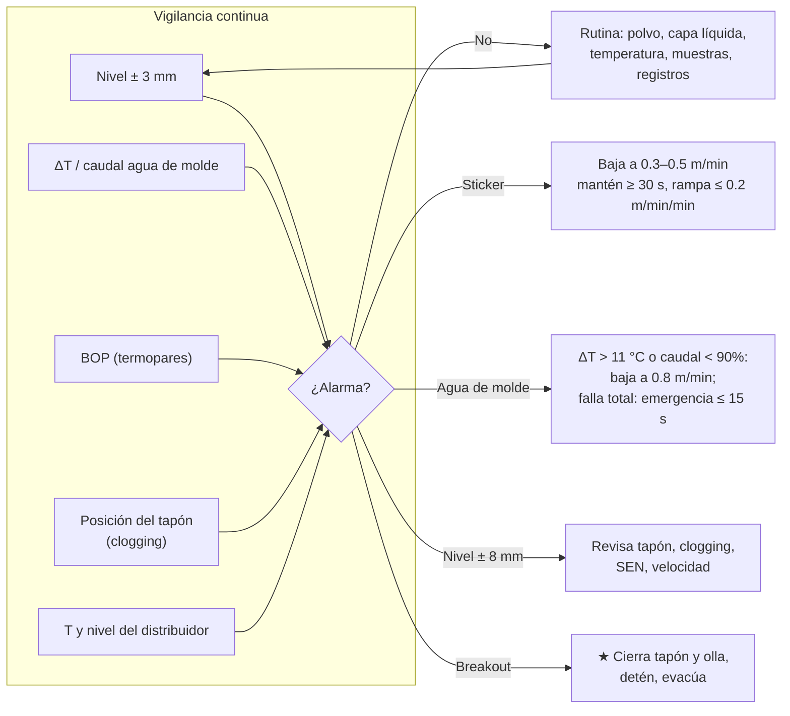

# MO-CC1-04 — Colada en estado estable: nivel de molde, velocidad, enfriamiento y polvo de molde

| Código | Versión | Estado | Área | Dueño del proceso | Elaboró | Revisión técnica | Revisión de seguridad | Aprobó | Fecha | Próxima revisión |
|---|---|---|---|---|---|---|---|---|---|---|
| MO-CC1-04 | 0.1 | Borrador para validación | Colada Continua 1 (planchón) | C-08 Ingeniero de Proceso de Colada Continua | experto-operativo-metalurgia | experto-operativo-metalurgia | experto-seguridad-salud | Pendiente (Gerente de Acería / Director) | 2026-09-25 | 2027-09-25 |

> ⚠️ Valores de referencia de FT-ACE-001 §4 y §7. Tabla velocidad–sobrecalentamiento, reparto de agua por zona, ley de oscilación y lógica del BOP: **[Validar con OEM / Ingeniería de Proceso]**.

## 1. Objetivo y alcance
**Objetivo:** mantener la colada estable, segura y dentro de especificación: **nivel de molde ± 3 mm, velocidad según sobrecalentamiento y ancho, agua de molde y enfriamiento secundario en rango, polvo de molde con capa líquida de 8–15 mm y respuesta correcta a alarmas** (sticker, nivel, agua, clogging).

**Alcance:** desde que la máquina llega a velocidad nominal después del arranque (MO-CC1-03) hasta el inicio del fin de colada (MO-CC1-07). Incluye la vigilancia durante cambios de olla y de SEN/distribuidor (detalle en MO-CC1-05 y MO-CC1-06) y las condiciones anormales de la colada.

## 2. Roles y responsabilidades
| Rol | Responsabilidad en este proceso | R/A/C/I |
|---|---|---|
| C-08 Ingeniero de Proceso de CC | Dueño de los parámetros (tablas de velocidad, agua, oscilación, polvo); analiza desviaciones y alarmas BOP | A |
| C-06 Supervisor de Colada Continua | Dirige la operación del turno; decide ante condiciones anormales; autoriza acceso bajo el molde | A (turno) |
| S-12 Operador de Púlpito de Colada | Velocidad, nivel automático, enfriamiento, oscilación, BOP, alarmas y registros | R |
| S-13 Operador de Plataforma de Colada | Nivel y temperatura del distribuidor, argón, flux, muestras, estado de olla | R |
| S-14 Ayudante de Colada | Polvo de molde, medición de capa líquida, observación del menisco, retiro de costras | R |
| S-11 Muestrero | Muestras de producto | R |
| S-21 Instrumentista | Atiende fallas de sensor de nivel, termopares BOP y medidores de agua | C |
| C-09 Metalurgista de Producto | Recibe planchones con eventos para disposición (MO-CC1-09) | I |

## 3. Descripción del proceso
En estado estable, el acero pasa del distribuidor al molde por la SEN. El **lazo de nivel** mueve la barra tapón para mantener el menisco a ± 3 mm con la velocidad fija. En el molde se forma la cáscara (≈ 15–20 mm a la salida); la oscilación y el polvo de molde evitan que se pegue. Fuera del molde, el **enfriamiento secundario** (10 zonas) completa la solidificación antes del fin de la longitud metalúrgica (≈ 32 m). La punta del cráter se estima con **L ≈ v × (e / 2k)²** (e = 230 mm, k ≈ 27 mm/√min [Validar con OEM / Ingeniería de Proceso]): ≈ 22 m a 1.2 m/min y ≈ 29 m a 1.6 m/min, por eso **1.6 m/min es la velocidad máxima**.

## 4. Equipos y maquinaria
| Equipo / componente | Función | Especificación clave | Condición para operar (verificación) |
|---|---|---|---|
| Lazo de nivel (sensor eddy current + PID + barra tapón) | Mantiene el menisco | ± 3 mm normal; alarma ± 8 mm | Señal estable; calibración vigente |
| Molde Cu-Ag/Ni | Forma la cáscara | 900 mm; conicidad 1.0–1.2 %/m | Sin fugas; placas dentro de desgaste |
| Agua de molde (circuito cerrado) | Enfría las placas | Anchas ≈ 4,200 L/min c/u; angostas ≈ 450 L/min c/u; ΔT 6–9 °C | Caudal y ΔT en HMI; alarmas activas |
| Agua de emergencia | Respaldo del agua de molde | Torre + bombas diésel; entrada automática ≤ 15 s | Estado "listo" |
| Oscilador hidráulico | Despega la cáscara | 120–200 cpm; carrera 4–8 mm; no senoidal | Frecuencia y carrera según tabla |
| Enfriamiento secundario | Solidifica el planchón | 10 zonas aire–agua; 0.8–1.2 L/kg | Caudal por zona según modelo; presión de aire |
| Modelo de enfriamiento (nivel 2) | Ajusta el agua a la velocidad y al grado | Control dinámico por zona | Modelo activo; tabla de respaldo disponible |
| Segmentos 1–14 | Guían, soportan y extraen | Gap ± 0.5 mm | Sin alarmas de presión ni de motores |
| BOP | Predice stickers | Termopares en 3 filas; alarma por patrón | Termopares con lectura |
| Pirómetro de superficie en el enderezado | Temperatura de enderezado | Rango 600–1,200 °C | Lente limpio |
| Argón de la barra tapón | Evita clogging, ayuda a flotar inclusiones | 3–8 NL/min | Rotámetro y presión |
| Polvo de molde | Aísla, lubrica, absorbe inclusiones | Consumo 0.3–0.5 kg/t; capa líquida 8–15 mm | Tipo correcto por grado; sacos secos |

## 5. Parámetros de operación
| Parámetro | Unidad | Objetivo | Rango normal | Alarma / límite | Acción si está fuera de rango | Dónde se mide |
|---|---|---|---|---|---|---|
| Nivel de molde | mm | 0 (menisco ≈ 100 mm bajo el borde) | ± 3 | ± 8 | Ver §9 "pérdida de nivel" | Sensor eddy current (HMI) |
| Velocidad de colada | m/min | 1.2 | 0.8–1.6 | > 1.6 (cráter fuera de la máquina) | Respeta tabla velocidad–SH | HMI |
| Sobrecalentamiento (SH) en distribuidor | °C | 25 | 20–30 | < 15 o > 35 | Ver tabla velocidad–SH | Termopar desechable (3 por colada) |
| Temperatura del distribuidor (bajo C al Al) | °C | 1,550 | 1,545–1,555 | < 1,540 o > 1,560 | Avisa a LF (C-07) para la siguiente olla | Termopar |
| Temperatura del distribuidor (HSLA) | °C | Líquidus calculado + 25 (≈ 1,540–1,545) | Líquidus + 20 a + 30 | Fuera de rango | Igual que arriba | Termopar |
| Nivel del distribuidor | mm | 1,000 | 900–1,100 | < 900 o > 1,250 | < 900: sube flujo de olla; > 1,250: cierra olla (rebose) | Pesaje / nivel |
| Argón de la barra tapón | NL/min | 4–5 | 3–8 | > 8 | No exceder 8: turbulencia en menisco y pinholes | Rotámetro / HMI |
| Posición de la barra tapón | % o mm | Estable ± 5% de la referencia de la colada | — | Subida sostenida > 10% [Validar con OEM / Ingeniería de Proceso] | Clogging: ver MO-CC1-06 | Tendencia HMI |
| Caudal agua de molde, caras anchas | L/min | 4,200 c/u | 3,990–4,410 (± 5%) | < 90% (3,780) | Baja a 0.8 m/min, revisa; < 80%: ver §9 falla de agua | HMI |
| Caudal agua de molde, caras angostas | L/min | 450 c/u | 430–470 | < 90% (405) | Igual | HMI |
| ΔT agua de molde | °C | 7.5 | 6–9 | > 11 | Baja a 0.8 m/min y avisa a C-06 | HMI |
| Diferencia de ΔT entre caras anchas | °C | ≤ 1 | ≤ 1.5 | > 2 [Validar con OEM / Ingeniería de Proceso] | Flujo asimétrico: revisa centrado e inmersión de SEN | HMI |
| Temperatura de entrada del agua de molde | °C | 35 | 30–40 [Validar con OEM / Ingeniería de Proceso] | > 42 | Revisa torre de enfriamiento | HMI |
| Frecuencia de oscilación | cpm | 160 a 1.2 m/min | 120–200 (ley f = 100 + 50·v) [Validar con OEM / Ingeniería de Proceso] | Desviación > 5% | Avisa a S-22 | HMI |
| Carrera de oscilación | mm | 6 | 4–8 | Fuera de ajuste > 0.5 mm | Avisa a S-22 | HMI |
| Tiempo de estría negativa (t_N) | s | 0.12 | 0.10–0.15 (a velocidad nominal) | > 0.17 | C-08 ajusta ley de oscilación | Nivel 2 |
| Paso de marcas de oscilación | mm | 7.5 (1.2 m/min, 160 cpm) | v / f | — | — | Cálculo |
| Capa líquida de polvo | mm | 10–12 | 8–15 | < 6 o > 18 | < 6: agrega polvo, revisa T; > 18: reduce adición | Método de alambres (acero/Al/Cu), 1 por colada |
| Consumo de polvo | kg/t | 0.4 | 0.3–0.5 | < 0.25 | Riesgo de sticker: revisa tipo de polvo y oscilación | Registro de sacos / t coladas |
| Agua específica secundaria (bajo C al Al) | L/kg | 1.1 | 1.0–1.2 | Fuera de modelo | Pasa a tabla de respaldo | Nivel 2 |
| Agua específica secundaria (HSLA / peritéctico) | L/kg | 0.85 | 0.8–0.9 | Fuera de modelo | Igual | Nivel 2 |
| Presión de aire de atomización | bar | 3 | 2.5–4 [Validar con OEM / Ingeniería de Proceso] | < 2 | Niebla gruesa: revisa compresor | HMI |
| Temperatura de superficie en el enderezado (HSLA) | °C | ≥ 920 | ≥ 900 | < 880 | Reduce agua de zonas Z6–Z8; evita la zona 700–900 °C (grietas transversales) | Pirómetro |
| Gap de segmentos | mm | Tabla | ± 0.5 | Alarma de posición | Avisa a C-08 / MM-CC-02 | HMI / medición de gap |

**Tabla velocidad–sobrecalentamiento–ancho [Validar con OEM / Ingeniería de Proceso]:**

| Ancho del planchón | SH 15–30 °C | SH 30–35 °C | SH 35–40 °C | SH > 40 °C |
|---|---|---|---|---|
| 900–1,200 mm | 1.4–1.6 m/min | −0.1 m/min | −0.2 m/min | máx. 0.8 m/min; aviso a C-08 |
| 1,200–1,450 mm | 1.2–1.4 m/min | −0.1 m/min | −0.2 m/min | máx. 0.8 m/min; aviso a C-08 |
| 1,450–1,650 mm | 1.0–1.2 m/min | −0.1 m/min | −0.2 m/min | máx. 0.8 m/min; aviso a C-08 |
| Grados peritécticos (HSLA C 0.08–0.10%) | −0.2 m/min sobre la fila | — | — | — |

> SH < 15 °C: **no bajes** la velocidad (se enfría más el distribuidor y se congela la SEN); avisa a C-08 y prepara el cierre si baja de 10 °C.
> Flujo de acero (t/min) ≈ 0.23 × ancho (m) × v (m/min) × 7.8. Ejemplo: 1,300 mm a 1.2 m/min ≈ 2.8 t/min → una olla de 150 t dura ≈ 54 min.

**Reparto típico del enfriamiento secundario (ejemplo: 2.8 t/min × 1.0 L/kg = 2,800 L/min) [Validar con OEM / Ingeniería de Proceso]:**

| Zona | Ubicación | % del agua | L/min (ejemplo) |
|---|---|---|---|
| Z1 | Pie de rodillos (bajo el molde) | 12 | 336 |
| Z2 | Segmento 1 | 16 | 448 |
| Z3 | Segmento 2 | 14 | 392 |
| Z4 | Segmento 3 | 12 | 336 |
| Z5 | Segmento 4 | 11 | 308 |
| Z6 | Segmento 5 | 10 | 280 |
| Z7 | Segmentos 6–7 | 9 | 252 |
| Z8 | Segmentos 7–8 (enderezado) | 7 | 196 |
| Z9 | Segmentos 9–10 | 5 | 140 |
| Z10 | Segmentos 11–12 | 4 | 112 |
| — | Segmentos 13–14 | 0 (enfriamiento por aire) | 0 |

## 6. Seguridad
### 6.1 Peligros y controles críticos
| Peligro | Consecuencia | Control crítico | Verificación |
|---|---|---|---|
| Breakout (fuga de acero bajo el molde) | Quemaduras mortales, incendio, explosión con agua | ★ **Zona de exclusión permanente bajo el molde y segmentos 1–3** durante la colada; acceso solo con autorización de C-06 y la máquina a velocidad reducida | Barrera, letrero y registro de acceso |
| Falla de agua de molde | Perforación del molde; explosión agua–acero | ★ Agua de emergencia automática en ≤ 15 s; si no entra: cierra tapón y olla, detén y evacúa | Prueba semanal (MM-CC-03); alarma en HMI |
| Agua en el molde (fuga de placa) | Explosión de vapor | ★ Ante vapor, "reventones" o gotas en el menisco: cierra el tapón de inmediato | Observación del menisco por S-14 |
| Salpicaduras al trabajar en el molde (polvo, costras) | Quemaduras | Herramientas secas y precalentadas; careta IR y aluminizado | EPP |
| Argón acumulado bajo la plataforma | Asfixia | Detector de O₂; no entrar a fosas sin medición | Lectura |
| Polvo de molde (fluoruros) | Irritación respiratoria | Respirador P100 al agregar polvo | EPP |
| Vapor de la cámara de rociado | Quemaduras, baja visibilidad | Puertas cerradas; extracción de vapor funcionando | Inspección |

### 6.2 EPP obligatorio
- Plataforma (S-13, S-14): casco con careta IR, chamarra aluminizada, ropa FR, guantes, botas con metatarsal, protección auditiva, respirador P100 para polvo, detector de O₂/CO.
- Púlpito (S-12): ropa FR, lentes, botas; EPP completo si sale a plataforma.
- Hidratación y pausas según MS-ACE-08 (estrés térmico, NOM-015-STPS).

### 6.3 Permisos, bloqueos y zonas de exclusión
- **Zona de exclusión bajo el molde y segmentos 1–3** vigente toda la colada.
- Acceso a la cámara de rociado solo con la máquina parada o con permiso especial de C-06.
- Cualquier trabajo en segmentos con colada en proceso: prohibido salvo procedimiento específico aprobado por C-03.

## 7. Calidad
| Variable crítica de calidad | Especificación | Método / frecuencia | Registro | Defecto si falla |
|---|---|---|---|---|
| Nivel de molde | ± 3 mm; eventos > ± 8 mm marcados | Continuo | Nivel 2: eventos por planchón | Inclusiones de polvo (slivers), grietas longitudinales |
| Sobrecalentamiento | 20–30 °C | 3 mediciones por colada | Hoja de colada | Segregación central (SH alto); clogging (SH bajo) |
| Capa líquida y consumo de polvo | 8–15 mm; 0.3–0.5 kg/t | 1 medición por colada; consumo por colada | Hoja de colada | Stickers, grietas longitudinales, depresiones |
| ΔT y simetría del agua de molde | 6–9 °C; diferencia ≤ 1.5 °C | Continuo | Nivel 2 | Grietas longitudinales, depresiones |
| Temperatura de enderezado (HSLA) | ≥ 900 °C | Continuo | Nivel 2 | Grietas transversales y de esquina |
| Velocidad estable | Cambios ≤ 0.1 m/min por minuto | Continuo | Nivel 2 | Variación de cráter; segregación, abultamiento |
| Eventos de proceso por planchón | Marcado automático (nivel, sticker, SEN, cambio de olla) | Tracking | MES | Planchón "con evento" → inspección especial (MO-CC1-09) |

## 8. Procedimiento paso a paso (rutina por colada)
| # | Paso | Cómo hacerlo (detalle y medición) | Criterio de aceptación | ★ | Rol |
|---|---|---|---|---|---|
| 1 | Verifica la zona de exclusión | Al inicio del turno y tras cada evento, confirma barreras y nadie bajo el molde | Zona despejada | ★ | C-06, S-14 |
| 2 | Revisa el estado de la máquina en HMI | Nivel, velocidad, agua de molde, enfriamiento, oscilación, BOP, agua de emergencia "lista" | Todo en rango verde | | S-12 |
| 3 | Mide temperatura del distribuidor | A los 5 min de abrir cada olla, a mitad y 10 min antes del final | SH 20–30 °C | 🔎 | S-13 |
| 4 | Ajusta la velocidad por SH y ancho | Aplica la tabla velocidad–SH; cambios ≤ 0.1 m/min por minuto | Velocidad dentro de tabla | | S-12 |
| 5 | Mantén el nivel del distribuidor | 900–1,100 mm regulando la válvula de la olla | Nivel estable | | S-13 |
| 6 | Cuida el flux del distribuidor | Superficie siempre cubierta (sin acero visible) | Sin "ojos" de acero | | S-13 |
| 7 | Agrega polvo de molde | "Poco y seguido": capa negra uniforme; sin zonas rojas; no tapar la SEN | Superficie negra | | S-14 |
| 8 | Mide la capa líquida | Método de alambres a 1/4 del ancho, lado fijo y móvil, lejos de la SEN | 8–15 mm | 🔎 | S-14 |
| 9 | Retira costras (rims) del menisco | Con herramienta seca, sin perturbar el nivel; solo si el rim > 10 mm | Menisco libre | | S-14 |
| 10 | Vigila el agua de molde | Caudal ≥ 95%, ΔT 6–9 °C, diferencia entre anchas ≤ 1.5 °C | En rango | | S-12 |
| 11 | Vigila el enfriamiento secundario | Modelo activo; caudal real = consigna ± 5% por zona; presión de aire 2.5–4 bar | En rango | | S-12 |
| 12 | Vigila la temperatura de enderezado (HSLA) | Pirómetro ≥ 900 °C | En rango | 🔎 | S-12 |
| 13 | Vigila la posición del tapón | Tendencia estable ± 5%; subida sostenida = clogging (MO-CC1-06) | Estable | | S-12 |
| 14 | Toma la muestra de producto | A mitad de colada, del distribuidor | Muestra identificada | | S-11, S-13 |
| 15 | Atiende las alarmas BOP | Ver §9: baja a 0.3–0.5 m/min y recupera con rampa | Sin breakout | ★ | S-12 |
| 16 | Varía la inmersión de la SEN | Cada 2 h, ± 10 mm dentro de 120–160 mm para repartir el desgaste de la línea de escoria [Validar con OEM / Ingeniería de Proceso] | Inmersión en rango | | S-13 |
| 17 | Ajuste de ancho en caliente (si el programa lo pide) | Velocidad ≤ 1.0 m/min; velocidad de cambio según OEM (típico ≤ 25 mm/min por lado) [Validar con OEM / Ingeniería de Proceso]; marca planchones de transición | Ancho final ± 2 mm; sin alarma BOP | 🔎 | S-12 |
| 18 | Registra la colada | Temperaturas, pesos, consumo de polvo, capa líquida, eventos | Hoja de colada completa | | S-12, S-13 |

## 9. Condiciones anormales y respuesta
| Síntoma / alarma | Causa probable | Acción inmediata | A quién avisar |
|---|---|---|---|
| **Alarma BOP de sticker** (subida de temperatura en fila 1 que se propaga a filas 2–3) | Falta de lubricación (polvo), nivel inestable, velocidad alta, capa líquida baja | ★ El sistema baja la velocidad a **0.3–0.5 m/min**; mantén ≥ 30 s o hasta que los termopares se normalicen; recupera con rampa ≤ 0.2 m/min por minuto; no hagas cambios bruscos de nivel ni de polvo; revisa capa líquida | C-06; C-08 si hay ≥ 2 en la colada |
| **Breakout** (acero bajo el molde, flama, alarma de fuga, caída brusca de nivel) | Sticker no controlado, cáscara delgada, SH alto, falla de oscilación | ★ 1) Cierra el tapón. 2) Detén la extracción. 3) Cierra la olla y gira la torreta a posición segura si es necesario. 4) Evacúa la zona y cuenta al personal. 5) Mantén agua de molde; el enfriamiento de máquina según OEM [Validar con OEM / Ingeniería de Proceso]. 6) Nadie se acerca hasta que C-06 lo autorice | C-04, C-06, C-16 (MS-ACE-09) |
| **Pérdida de nivel** (± 8 mm sostenido o señal perdida) | Clogging, tapón erosionado, falla de sensor, flujo asimétrico | Si la señal falla: pasa a control manual del tapón con observación visual y baja a 0.8 m/min; si en 5 min no se recupera, cierra la colada (MO-CC1-07). Si es clogging: MO-CC1-06 | C-06, S-21 |
| **Rebose del molde** (nivel > + 15 mm o acero sobre la placa) [Validar con OEM / Ingeniería de Proceso] | Tapón trabado abierto, pérdida de señal, SEN rota | 🛑 Cierra el tapón (manual o emergencia); baja la velocidad; si el acero sale del molde: evacúa la plataforma y detén | C-06, C-04 |
| **Clogging** (tapón sube de forma sostenida > 10%) | Al₂O₃ depositada en SEN (reoxidación, tratamiento de Ca insuficiente) | Sube argón en pasos de 1 NL/min hasta máx. 8; baja la velocidad si el tapón llega a > 90% de apertura; prepara cambio de SEN (MO-CC1-06) | C-06, C-08, C-07 (LF) |
| **ΔT de agua de molde > 11 °C** o **caudal < 90%** | Incrustación, bomba, válvula, fuga | Baja la velocidad a 0.8 m/min; revisa; avisa a S-21 | C-06, C-12 |
| **Falla de agua de molde** (caudal < 80% o pérdida de bombeo) [Validar con OEM / Ingeniería de Proceso] | Falla de bomba, energía, ruptura | ★ Verifica entrada automática del **agua de emergencia en ≤ 15 s**. Si entra: baja a 0.3–0.5 m/min y prepara el cierre. Si no entra: cierra tapón y olla, detén y **evacúa** | C-04, C-06, C-12 |
| **Fuga de agua en el molde** (vapor, "reventones", gotas en el menisco) | Placa o empaque dañados | ★ 🛑 Cierra el tapón de inmediato; detén; evacúa la plataforma; no reanudes | C-04, C-06, C-11 |
| **Falla de oscilación** | Hidráulica, servo, energía | Enclavamiento: la máquina se detiene y cierra el tapón [Validar con OEM / Ingeniería de Proceso]; si se restablece en ≤ 60 s, C-06 decide reanudar a 0.3 m/min con rampa; si no, cierre de colada | C-06, S-22 |
| **Apagón** | Falla de red | ★ Confirma agua de emergencia ≤ 15 s; el tapón y la olla se cierran con acumuladores; si no, cierre manual; UPS mantiene HMI; al restablecer, C-06 decide reanudar o sacar la cola (MO-CC1-07) | C-04, C-06, C-12 |
| **Fuga de agua del enfriamiento secundario** (manguera, boquilla rota) | Mangueras, conexiones | Aísla la zona si el modelo lo permite; baja la velocidad; reparar al terminar la secuencia | C-06, S-19 |
| **Ancho fuera de tolerancia** (medidor después del corte o HMI) | Deriva de cara angosta, conicidad, abultamiento | Verifica posición de caras angostas en HMI y con medición manual al siguiente cambio; corrige; marca los planchones afectados para C-09 | C-06, C-09 |
| **SH > 40 °C** | Olla muy caliente | Máx. 0.8 m/min; aviso a C-08 y a LF | C-08, C-07 |
| **SH < 15 °C** | Olla fría, esperas | No bajes la velocidad; aviso a C-08; si < 10 °C prepara cierre | C-08 |
| **Temperatura de enderezado < 880 °C (HSLA)** | Exceso de agua en zonas medias | Reduce agua de Z6–Z8 según modelo; marca planchones | C-08 |

## 10. Registros
- Hoja de colada (nivel 2 / MES): temperaturas, SH, velocidad, nivel, agua, polvo, capa líquida, pesos, eventos.
- Registro de alarmas BOP (hora, fila, acción, resultado; verdaderas/falsas).
- Tendencias de nivel, tapón, ΔT y caudal por planchón (archivadas ≥ 12 meses [Supuesto]).
- Registro de acceso a la zona de exclusión.
- Reporte de incidentes (breakout, rebose, fuga de agua) según MS-ACE-09.

## 11. Competencia requerida y certificación
| Rol | Nivel requerido (1–4) | Formación teórica (h) | OJT supervisado (h / eventos) | Evaluación (pasos ★) | Vigencia |
|---|---|---|---|---|---|
| S-12 Operador de Púlpito de Colada | 3 | 40 (proceso, metalurgia básica, control de nivel, BOP) | 240 h + simulador de emergencias (sticker, breakout, falla de agua, apagón) | Pasos 1, 15 y respuestas ★ de §9 (simulador) | ≤ 24 meses (TD-P07) |
| S-13 Operador de Plataforma de Colada | 3 | 24 | 160 h | Paso 1; respuesta a breakout y fuga de agua | ≤ 24 meses |
| S-14 Ayudante de Colada | 3 | 16 | 120 h | Paso 1; medición de capa líquida; fuga de agua en molde | ≤ 24 meses |
| C-06 Supervisor de Colada Continua | 4 (evaluador) | 24 + evaluador | — | Todas las respuestas de §9 | ≤ 24 meses |
| C-08 Ingeniero de Proceso de CC | 4 | 40 (modelo térmico, BOP, SPC) | — | Análisis de alarmas y ajustes de tabla | — |

**Lista corta de verificación de pasos ★:**
- [ ] Mantiene y verifica la zona de exclusión bajo el molde.
- [ ] Responde a sticker: velocidad a 0.3–0.5 m/min, espera ≥ 30 s, rampa ≤ 0.2 m/min por minuto.
- [ ] Responde a breakout en el orden correcto (tapón → extracción → olla → evacuación).
- [ ] Verifica agua de emergencia en ≤ 15 s y sabe qué hacer si no entra.
- [ ] Ante agua en el molde cierra el tapón de inmediato.
- **Preguntas orales:** ¿Por qué no se debe pasar de 1.6 m/min? ¿Por qué no se baja la velocidad con SH < 15 °C? ¿Qué te dice una subida sostenida del tapón?

## 12. Referencias
- FT-ACE-001 §3, §4, §7; CAT-ACE-001; MO-CC1-03, MO-CC1-05, MO-CC1-06, MO-CC1-07, MO-CC1-09; MM-CC-02, MM-CC-03, MM-CC-04; MO-LF-01.
- MS-ACE-01, MS-ACE-03, MS-ACE-06, MS-ACE-08, MS-ACE-09.
- NOM-015-STPS-2001, NOM-017-STPS-2008, NOM-011-STPS-2001, NOM-010-STPS-2014, NOM-030-STPS-2009 — verificar con Jurídico Laboral / SSO.
- Manual OEM de CC1 (control de nivel, BOP, modelo de enfriamiento, oscilación) y ficha del proveedor de polvo de molde [por referenciar].

## 13. Control de cambios
| Versión | Fecha | Cambio | Elaboró |
|---|---|---|---|
| 0.1 | 2026-09-25 | Emisión inicial para validación | experto-operativo-metalurgia |
