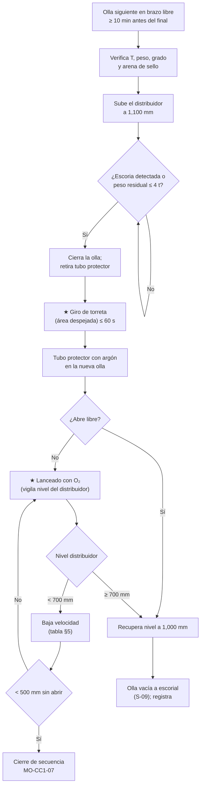

# MO-CC1-05 — Cambio de olla en secuencia (torreta)

| Código | Versión | Estado | Área | Dueño del proceso | Elaboró | Revisión técnica | Revisión de seguridad | Aprobó | Fecha | Próxima revisión |
|---|---|---|---|---|---|---|---|---|---|---|
| MO-CC1-05 | 0.1 | Borrador para validación | Colada Continua 1 (planchón) | C-06 Supervisor de Colada Continua | experto-operativo-metalurgia | experto-operativo-metalurgia — visto bueno sin observaciones, 2026-09-25 | experto-seguridad-salud | Pendiente (Gerente de Acería / Director) | 2026-09-25 | 2027-09-25 |

> ⚠️ Valores de referencia de FT-ACE-001 §3 y §4. Tabla nivel–peso del distribuidor, tiempos de giro y criterios de detección de escoria: **[Validar con OEM / Ingeniería de Proceso]**.

## 1. Objetivo y alcance
**Objetivo:** cambiar la olla vacía por la olla llena **sin interrumpir la colada**, sin pasar escoria de la olla al distribuidor y sin bajar el distribuidor de **700 mm**, para mantener la secuencia (continuidad) y la limpieza del acero.

**Alcance:** desde que la olla siguiente llega a la torreta hasta que la nueva olla cuela con tubo protector sellado y el distribuidor regresa a 1,000 mm. Incluye el cambio de grado dentro de la misma familia (planchones de transición). El cambio de grado incompatible se hace con cambio de distribuidor (MO-CC1-06).

## 2. Roles y responsabilidades
| Rol | Responsabilidad en este proceso | R/A/C/I |
|---|---|---|
| C-06 Supervisor de Colada Continua | Coordina el cambio; decide lanceado, reducción de velocidad o cierre | A |
| S-13 Operador de Plataforma de Colada | Cierre de la olla por detección de escoria, tubo protector, giro de torreta, apertura de la nueva olla, nivel del distribuidor | R |
| S-09 Operador de Grúa de Colada | Coloca la olla llena en el brazo libre y retira la olla vacía | R (izaje) |
| S-12 Operador de Púlpito de Colada | Ajusta la velocidad según el nivel del distribuidor; marca eventos en el tracking | R |
| S-14 Ayudante de Colada | Mantiene el molde (polvo, nivel) durante el cambio | R |
| C-07 Ingeniero de Proceso EAF / LF | Garantiza la llegada a tiempo y la temperatura de envío | C |
| C-09 Metalurgista de Producto | Define la disposición de planchones de transición | I |

## 3. Descripción del proceso
La torreta de brazos tipo mariposa tiene dos brazos: uno cuela y el otro recibe la olla siguiente. Antes de cerrar la olla que se termina, el distribuidor se sube a su **nivel máximo (1,100 mm ≈ 45 t)** para tener reserva. La olla se cierra **al primer signo de escoria** (detector o peso residual). La torreta gira, se coloca el tubo protector en la nueva olla y se abre. Mientras tanto, el distribuidor alimenta al molde: a 2.8 t/min, la reserva de 1,100 a 700 mm (≈ 18 t) dura ≈ 6 min; el cambio normal dura ≤ 2 min.

## 4. Equipos y maquinaria
| Equipo / componente | Función | Especificación clave | Condición para operar (verificación) |
|---|---|---|---|
| Torreta de ollas (mariposa) | Soporta y gira las ollas | 2 brazos; pesaje por brazo; giro 180° | Frenos, límites y giro de emergencia probados; celdas calibradas |
| Olla de 150 t | Contiene el acero | Válvula deslizante (2 o 3 placas); arena de cromita | Apertura libre objetivo ≥ 98% (FT-ACE-001 §3) |
| Detector de escoria de olla | Detecta paso de escoria al cierre | Electromagnético o por vibración [Validar con OEM / Ingeniería de Proceso — no está en la ficha] | Señal probada; si no hay, se usa el peso residual |
| Manipulador del tubo protector | Coloca y retira el tubo | Sello de argón | Juntas de repuesto secas |
| Tubo protector | Protege el chorro | Precalentado | Sin grietas; se cambia según vida [Validar con OEM / Ingeniería de Proceso] |
| Lanza de oxígeno | Abre una olla que no abre libre | Lanzas secas | Regulador y manguera inspeccionados |
| Grúa de colada 250/63 t | Coloca y retira ollas | Doble freno y límites redundantes | Inspección pre-uso (MM-GR-01) |
| Pesaje del distribuidor | Controla la reserva | Tabla nivel–peso | Calibrado |

## 5. Parámetros de operación
| Parámetro | Unidad | Objetivo | Rango normal | Alarma / límite | Acción si está fuera de rango | Dónde se mide |
|---|---|---|---|---|---|---|
| Anticipación de la olla siguiente en torreta | min | ≥ 10 antes del final | 10–20 | < 5 min | Avisa a C-07/C-04; baja la velocidad para ganar tiempo | Programa / HMI |
| Temperatura de la olla siguiente (llegada) | °C | T distribuidor objetivo + pérdidas (≈ 1,575–1,590 para bajo C) [Validar con OEM / Ingeniería de Proceso] | Según programa | Fuera de ± 10 °C | Ajusta velocidad con tabla SH (MO-CC1-04) | Registro LF / medición en torreta |
| Nivel del distribuidor antes de cerrar | mm | 1,100 | 1,050–1,150 | > 1,250 | No sobrellenar (rebose de escoria) | Pesaje / nivel |
| Peso residual al cerrar la olla | t | 3–4 (o primera señal de escoria) | 2–5 | Escoria en el chorro | Cierra de inmediato | Celdas de la torreta / detector |
| Tiempo cierre → apertura de la nueva olla | min | ≤ 2 | 1.5–3 | > 3 | Aplica tabla de velocidad por nivel | Cronómetro HMI |
| Tiempo de giro de la torreta | s | ≤ 60 | 40–60 [Validar con OEM / Ingeniería de Proceso] | > 90 | Revisa accionamiento | HMI |
| Nivel mínimo del distribuidor en el cambio | mm | ≥ 800 | ≥ 700 | < 700 | Baja velocidad (tabla abajo) | Pesaje / nivel |
| Argón de sello del tubo protector | NL/min | Según OEM | — | Sin flujo / flama en la junta | Cambia junta; revisa argón | Rotámetro |
| Nivel de molde durante el cambio | mm | 0 | ± 3 | ± 8 | MO-CC1-04 §9 | Sensor |

**Tabla nivel–peso del distribuidor (aproximada) y acción [Validar con tabla de calibración]:**

| Nivel (mm) | Peso (t) | Acción de velocidad durante el cambio |
|---|---|---|
| 1,100 | ≈ 45 | Velocidad normal |
| 1,000 | ≈ 41 | Velocidad normal |
| 900 | ≈ 36 | Velocidad normal |
| 800 | ≈ 32 | Baja a 0.9 m/min |
| 700 | ≈ 27 | Baja a 0.6 m/min |
| 600 | ≈ 22 | Baja a 0.4 m/min; prepara el cierre |
| 500 | ≈ 18 | Si la olla no abrió: cierre de secuencia (MO-CC1-07) |
| 400 | ≈ 14 | Cierra el tapón (arrastre de escoria/vórtice) |

## 6. Seguridad
### 6.1 Peligros y controles críticos
| Peligro | Consecuencia | Control crítico | Verificación |
|---|---|---|---|
| Olla llena suspendida (≈ 150 t de acero + olla) | Aplastamiento, derrame masivo | ★ Nadie bajo la olla ni en su trayectoria; grúa de colada con doble freno; señalero único (MS-ACE-04) | Área despejada; radio |
| Giro de la torreta | Golpe, atrapamiento, choque con manipulador | ★ Área de giro despejada; manipulador retraído; alarma sonora | Confirmación de S-13 |
| Lanceado con O₂ | Quemaduras, proyección | ★ EPP aluminizado completo, lanza seca, posición lateral, vigía | Observación C-06 |
| Rebose del distribuidor | Derrame de acero y escoria sobre la plataforma | No pasar de 1,250 mm; cerrar olla | Alarma de nivel |
| Arrastre de escoria | Inclusiones, erosión del distribuidor | Cierre al primer signo de escoria | Detector / peso |
| Humedad en tubo protector o herramientas | Explosión | Todo seco y precalentado | Revisión visual |

### 6.2 EPP obligatorio
- S-13 y S-14: casco con careta IR, chamarra y polainas aluminizadas, ropa FR, guantes, botas con metatarsal, protección auditiva, detector de O₂/CO.
- Lanceado: aluminizado completo con capucha.

### 6.3 Permisos, bloqueos y zonas de exclusión
- **Zona de giro de la torreta** y **zona bajo ollas suspendidas**: despejadas en cada cambio.
- **Zona de exclusión bajo el molde**: vigente (MO-CC1-04).
- Acceso al escorial y al puesto de olla vacía solo con la olla asentada.

## 7. Calidad
| Variable crítica de calidad | Especificación | Método / frecuencia | Registro | Defecto si falla |
|---|---|---|---|---|
| Paso de escoria de olla | Cero (cierre al detectar) | Detector / peso, cada olla | Hoja de colada | Inclusiones macro, slivers |
| Reoxidación en el cambio | Tubo protector sellado en ≤ 2 min | Visual | Hoja de colada | Inclusiones de Al₂O₃, clogging |
| Nivel mínimo del distribuidor | ≥ 700 mm | Tendencia | Nivel 2 | Arrastre de flux/escoria al molde |
| Planchones de cambio de olla | Marcados automáticamente | Tracking | MES | Inspección especial si hubo lanceado o nivel < 700 mm |
| Planchones de transición (cambio de grado de la misma familia) | Según modelo de mezcla del nivel 2 (típico 1–2 planchones) [Validar con OEM / Ingeniería de Proceso] | Tracking + muestra | MES | Química fuera de ambos grados → degradar (C-09) |

## 8. Procedimiento paso a paso
| # | Paso | Cómo hacerlo (detalle y medición) | Criterio de aceptación | ★ | Rol |
|---|---|---|---|---|---|
| 1 | Confirma la olla siguiente | Grado, peso 145–155 t, T de envío, hora de llegada ≥ 10 min antes del final | Datos en HMI | | S-12, S-13 |
| 2 | Recibe la olla en el brazo libre | S-09 baja la olla; nadie bajo la carga; S-13 confirma asiento | Olla asentada; gancho libre | ★ | S-09, S-13 |
| 3 | Revisa la olla | Mecanismo de válvula conectado; arena de sello visible; cilindro hidráulico acoplado | Lista OK | | S-13 |
| 4 | Sube el distribuidor | Aumenta el flujo de la olla en colada hasta 1,100 mm | 1,050–1,150 mm | | S-13 |
| 5 | Vigila el final de la olla | Peso residual y detector de escoria; observa el chorro si es visible | Señal clara | 🔎 | S-13 |
| 6 | Cierra la olla | Al primer signo de escoria o ≤ 4 t residuales | Olla cerrada; hora registrada | | S-13 |
| 7 | Retira el tubo protector | Manipulador hacia arriba y afuera; limpia la boca del tubo | Tubo libre | | S-13 |
| 8 | Gira la torreta | Alarma; área despejada; manipulador retraído; giro ≤ 60 s | Nueva olla sobre el distribuidor | ★ | S-13 |
| 9 | Coloca el tubo protector | Junta nueva y seca; argón de sello abierto | Sello sin flama visible | | S-13 |
| 10 | Abre la nueva olla | Apertura total; confirma flujo | Apertura libre en ≤ 2 min desde el cierre | | S-13 |
| 11 | Si no abre: lancea | Retira tubo; lancea desde un costado; S-12 aplica la tabla nivel–velocidad | Abre antes de 500 mm | ★ | S-13, S-12 |
| 12 | Recupera el nivel del distribuidor | Sube a 1,000 mm y regresa la velocidad según tabla SH | 900–1,100 mm | | S-13, S-12 |
| 13 | Mide la temperatura | A los 5 min de abrir | SH 20–30 °C | 🔎 | S-13 |
| 14 | Marca los eventos | Cambio de olla, lanceado, nivel mínimo alcanzado, cambio de grado | Eventos en tracking | | S-12 |
| 15 | Retira la olla vacía | S-09 la lleva al vaciado de escoria; nadie bajo la carga | Olla fuera | ★ | S-09 |
| 16 | Registra | Peso residual, tiempos, nivel mínimo, temperatura | Hoja de colada completa | | S-13 |

## 9. Condiciones anormales y respuesta
| Síntoma / alarma | Causa probable | Acción inmediata | A quién avisar |
|---|---|---|---|
| Olla siguiente no llega a tiempo | Retraso en EAF/LF | Baja la velocidad para estirar la olla actual (mínimo 0.8 m/min); si no llega, cierre de secuencia | C-04, C-07 |
| Olla no abre libre | Arena sinterizada, placa dañada | Lancea; aplica tabla nivel–velocidad; a 500 mm sin abrir: cierre | C-06 |
| Escoria pasa al distribuidor | Cierre tardío, detector fallado | Cierra la olla; marca los planchones; revisa nivel de escoria del distribuidor | C-06, C-09 |
| Distribuidor < 700 mm | Cambio lento | Baja velocidad (0.6 m/min); a 600 mm 0.4 m/min | C-06 |
| Falla de giro de la torreta | Accionamiento, energía | Giro de emergencia (hidráulico/neumático) según OEM [Validar con OEM / Ingeniería de Proceso]; si no gira: cierre de secuencia | C-06, S-19 |
| Olla con fuga por la válvula o perforación | Placas, refractario | ★ Evacúa la zona; gira la olla a posición de emergencia sobre el pote de emergencia; MS-ACE-09 | C-04, C-16 |
| Temperatura de la nueva olla fuera de ± 10 °C | LF / espera | Ajusta velocidad con tabla SH | C-07, C-08 |
| Flama o aire en la junta del tubo protector | Junta dañada, desalineación | Recoloca con junta nueva | C-06 |
| Rebose del distribuidor | Olla muy abierta, nivel mal leído | Cierra la olla; verifica pesaje | C-06 |

## 10. Registros
- Hoja de colada: hora de cierre y apertura, peso residual, nivel mínimo, lanceado, temperatura.
- Registro de ollas (número, vida, apertura libre o lanceada) para ollas y refractarios (C-15).
- Eventos en tracking: cambio de olla, transición de grado.

## 11. Competencia requerida y certificación
| Rol | Nivel requerido (1–4) | Formación teórica (h) | OJT supervisado (h / eventos) | Evaluación (pasos ★) | Vigencia |
|---|---|---|---|---|---|
| S-13 Operador de Plataforma de Colada | 3 | 16 | 20 cambios de olla (5 con lanceado simulado) | Pasos 2, 8, 11, 15 | ≤ 24 meses (TD-P07) |
| S-09 Operador de Grúa de Colada | 3 | Curso grúa de colada (NOM-006) | Según MS-ACE-04 | Pasos 2 y 15 | ≤ 24 meses |
| S-12 Operador de Púlpito de Colada | 3 | 8 | 20 cambios | Aplicación de la tabla nivel–velocidad | ≤ 24 meses |
| C-06 Supervisor de Colada Continua | 4 (evaluador) | 8 + evaluador | — | Todos | ≤ 24 meses |

**Lista corta de verificación de pasos ★:**
- [ ] Verifica que nadie esté bajo la olla suspendida ni en el radio de giro.
- [ ] Cierra la olla al primer signo de escoria.
- [ ] Gira la torreta con el manipulador retraído y el área despejada.
- [ ] Lancea con EPP completo y aplica la tabla nivel–velocidad.
- **Preguntas orales:** ¿Cuánto tiempo tienes de 1,100 a 700 mm a 2.8 t/min? ¿Por qué no se cuela con el distribuidor bajo 400 mm? ¿Qué haces si la olla siguiente llega 20 °C fría?

## 12. Referencias
- FT-ACE-001 §3, §4, §6; CAT-ACE-001; MO-OLL-01, MO-OLL-02, MO-LF-01; MO-CC1-04, MO-CC1-06, MO-CC1-07; MM-GR-01.
- MS-ACE-01, MS-ACE-04, MS-ACE-09.
- NOM-006-STPS-2014 (manejo de materiales), NOM-017-STPS-2008, NOM-015-STPS-2001, NOM-020-STPS-2011 — verificar con Jurídico Laboral / SSO.
- Manual OEM de la torreta y del detector de escoria [por referenciar].

## 13. Control de cambios
| Versión | Fecha | Cambio | Elaboró |
|---|---|---|---|
| 0.1 | 2026-09-25 | Emisión inicial para validación | experto-operativo-metalurgia |
| 0.1 | 2026-09-25 | Revisión técnica cruzada contra FT-ACE-001 v0.3: sin cambios de contenido; tiempos y niveles coherentes con MO-CC1-06/07 y con MO-CC2-05. | experto-operativo-metalurgia |
