# MO-CC1-06 — Cambio de buza sumergida (SEN) y cambio de distribuidor en caliente

| Código | Versión | Estado | Área | Dueño del proceso | Elaboró | Revisión técnica | Revisión de seguridad | Aprobó | Fecha | Próxima revisión |
|---|---|---|---|---|---|---|---|---|---|---|
| MO-CC1-06 | 0.1 | Borrador para validación | Colada Continua 1 (planchón) | C-06 Supervisor de Colada Continua | experto-operativo-metalurgia | experto-operativo-metalurgia | experto-seguridad-salud | Pendiente (Gerente de Acería / Director) | 2026-09-25 | 2027-09-25 |

> ⚠️ Valores de referencia de FT-ACE-001 §4. La ficha **no indica** si CC1 tiene cambiador rápido de SEN ni segundo carro de distribuidor; este manual los supone **[Supuesto]** y todos sus tiempos son **[Validar con OEM / Ingeniería de Proceso]**.

## 1. Objetivo y alcance
**Objetivo:** reemplazar una SEN desgastada, rota o taponada, o un distribuidor al final de su vida o por cambio de grado incompatible, **sin perder la secuencia**, sin rebose ni pérdida de nivel en el molde y sin exponer al personal al metal líquido.

**Alcance:**
- **A. Diagnóstico y manejo del clogging** (taponamiento de la SEN por Al₂O₃).
- **B. Cambio rápido de SEN** con el cambiador bajo el distribuidor (si está instalado).
- **C. Cambio de distribuidor en caliente** ("flying tundish change"), coordinado con un cambio de olla.

## 2. Roles y responsabilidades
| Rol | Responsabilidad en este proceso | R/A/C/I |
|---|---|---|
| C-06 Supervisor de Colada Continua | Decide el cambio, dirige la maniobra y la zona de exclusión | A |
| S-13 Operador de Plataforma de Colada | Opera el cambiador de SEN, los carros del distribuidor, la olla y el tapón | R |
| S-14 Ayudante de Colada | Polvo de molde, observación del menisco, centrado de la SEN, retiro de costras | R |
| S-12 Operador de Púlpito de Colada | Velocidad, nivel automático/manual, detención y rampa; eventos en el tracking | R |
| S-15 Preparador de Distribuidores | Entrega el distribuidor nuevo y la SEN de repuesto precalentados (MO-CC1-01) | R |
| C-08 Ingeniero de Proceso de CC | Criterios de clogging, vida de SEN y distribuidor | C |
| C-07 Ingeniero de Proceso EAF / LF | Acciones en LF ante clogging repetido (tratamiento con Ca) | C |
| C-09 Metalurgista de Producto | Disposición de planchones de unión y con evento | I |

## 3. Descripción del proceso
**Clogging:** la alúmina (Al₂O₃) del acero calmado al Al se pega dentro de la SEN. El lazo de nivel lo compensa abriendo el tapón, por eso **la tendencia de la posición del tapón** es el mejor indicador. Si el clogging avanza, el flujo en el molde se vuelve asimétrico (grietas, inclusiones) y al final se pierde el nivel.

**Cambio de SEN:** la SEN nueva, precalentada, entra en el cambiador y empuja a la vieja en pocos segundos con el tapón cerrado.

**Cambio de distribuidor:** se cierra la olla, el distribuidor viejo se vacía hasta 400 mm, se cierra el tapón y se **detiene** la línea; el carro retira el distribuidor viejo y el segundo carro coloca el nuevo (precalentado); se abre la olla nueva, se llena a 500 mm y se reanuda. El acero del molde forma una **unión** entre los dos tramos: ese planchón se marca y se inspecciona.

```mermaid
flowchart TD
    subgraph B["B. Cambio rápido de SEN"]
    B1["SEN nueva ≥ 1,000 °C<br/>en el cambiador"] --> B2["Velocidad a 0.5 m/min<br/>nivel manual"]
    B2 --> B3["Cierra tapón"]
    B3 --> B4["Empuja SEN nueva<br/>(≤ 10 s sin flujo)"]
    B4 --> B5["Abre tapón; nivel a 0 mm;<br/>automático"]
    B5 --> B6["Rampa ≤ 0.2 m/min/min;<br/>marca planchón"]
    end
    subgraph C["C. Cambio de distribuidor en caliente"]
    C1["Distribuidor nuevo precalentado<br/>en carro 2"] --> C2["Cierra olla; gira torreta<br/>sin abrir la nueva"]
    C2 --> C3["Baja velocidad por nivel;<br/>a 400 mm cierra tapón"]
    C3 --> C4["★ Detén la línea;<br/>retira distribuidor viejo"]
    C4 --> C5["Coloca distribuidor nuevo;<br/>centra e inmerge SEN"]
    C5 --> C6["Abre olla; llena a 500 mm"]
    C6 --> C7["Abre tapón; nivel −60 mm;<br/>arranca 0.3 m/min"]
    C7 --> C8["Rampa; marca planchón de unión"]
    end
```

## 4. Equipos y maquinaria
| Equipo / componente | Función | Especificación clave | Condición para operar (verificación) |
|---|---|---|---|
| Barra tapón y lazo de nivel | Regula flujo; indica clogging | Argón 3–8 NL/min | Tendencia de posición visible en HMI |
| SEN | Entrega al molde | Inmersión 120–160 mm; manga de ZrO₂ en línea de escoria | Vida típica 8–10 h [Validar con OEM / Ingeniería de Proceso] |
| Cambiador rápido de SEN [Supuesto] | Cambia la SEN sin cambiar el distribuidor | Accionamiento hidráulico; placa de SEN | Probado en frío en la preparación; SEN de repuesto precalentada |
| Precalentador de SEN de repuesto | Mantiene la SEN a temperatura | ≥ 1,000 °C | Temperatura registrada |
| Carros de distribuidor (2) [Supuesto] | Intercambian distribuidores | Elevación, traslación, centrado X–Y, pesaje | Frenos y límites probados; ruta despejada |
| Distribuidor nuevo | Reemplazo | Liberado por MO-CC1-01; 1,100 ± 50 °C | Tiempo sin quemador ≤ 10 min |
| Grapa o conector de unión | Refuerza la unión si la detención es larga | Según OEM [Validar con OEM / Ingeniería de Proceso] | Seca, disponible en la plataforma |
| Estación de volteo / fosa de distribuidor | Recibe el distribuidor usado | — | Libre y seca |

## 5. Parámetros de operación
| Parámetro | Unidad | Objetivo | Rango normal | Alarma / límite | Acción si está fuera de rango | Dónde se mide |
|---|---|---|---|---|---|---|
| Posición del tapón (clogging) | % de apertura | Estable ± 5% | — | Subida sostenida > 10% en 15 min, o > 80% de apertura [Validar con OEM / Ingeniería de Proceso] | Escalera de acciones (§8 A) | Tendencia HMI |
| Argón de la barra tapón | NL/min | 4–5 | 3–8 | Máx. 8 | No exceder 8 (pinholes, turbulencia) | Rotámetro |
| Relación Ca/Al total en el acero (LF) | — | 0.10 | 0.08–0.14 [Validar con OEM / Ingeniería de Proceso] | < 0.07 | Ajuste de CaSi en LF (C-07) | Análisis de muestra |
| Vida de SEN | h | ≤ 8 | 6–10 | > 10 h o erosión visible | Cambia la SEN | Registro |
| Temperatura de SEN de repuesto | °C | ≥ 1,050 | 1,000–1,150 | < 1,000 | No usar | Pirómetro |
| Velocidad durante el cambio de SEN | m/min | 0.5 | 0.4–0.6 | — | — | HMI |
| Tiempo sin flujo (cambio de SEN) | s | ≤ 5 | ≤ 10 | > 15 | Riesgo de cáscara/pérdida de nivel; C-06 evalúa | Cronómetro |
| Nivel del molde durante el cambio de SEN | mm | 0 → −20 máx. | 0 a −30 | < −40 o > + 8 | Recupera en manual; revisa | Sensor |
| Recuperación de nivel ± 3 mm | s | ≤ 30 | ≤ 60 | > 60 | Mantén velocidad baja | HMI |
| Vida del distribuidor | coladas / h | 12 / 14 | 10–15 / 12–16 [Validar con OEM / Ingeniería de Proceso] | > 15 o daño | Cambio de distribuidor | Registro |
| Nivel para cerrar el tapón del distribuidor viejo | mm | 400 | 400–450 | < 400 | Riesgo de arrastre de escoria | Pesaje |
| Tiempo de línea detenida (cambio de distribuidor) | min | ≤ 3 | 2–4 | > 5 [Validar con OEM / Ingeniería de Proceso] | Inserta grapa de unión (si > 3 min) o cierra la secuencia | Cronómetro HMI |
| Nivel del distribuidor nuevo para abrir el tapón | mm | 500 (≈ 18 t) | 450–600 | < 400 | Espera | Pesaje |
| Inmersión de SEN tras el cambio | mm | 140 | 120–160 | Fuera de rango | Ajusta altura del distribuidor | Regla / HMI |
| Velocidad al reanudar | m/min | 0.3 | 0.2–0.4 | — | Rampa ≤ 0.2 m/min por minuto | HMI |

## 6. Seguridad
### 6.1 Peligros y controles críticos
| Peligro | Consecuencia | Control crítico | Verificación |
|---|---|---|---|
| Salpicadura o derrame al retirar la SEN o el distribuidor | Quemaduras graves | ★ Solo S-13 y S-14 en el frente con aluminizado completo; los demás fuera de la zona roja | Conteo por C-06 |
| Rotura de la unión al reanudar (breakout en la junta) | Fuga de acero bajo el molde | ★ **Zona de exclusión bajo el molde** reforzada hasta que la unión pase el segmento 3; rampa lenta | Barrera y confirmación |
| Movimiento de carros de distribuidor | Golpe, atrapamiento | Ruta despejada, alarma, nadie entre carros | Confirmación S-13 |
| Distribuidor o SEN húmedos | Explosión | ★ Solo distribuidor liberado (MO-CC1-01) y SEN ≥ 1,000 °C | Registro de precalentamiento |
| Rebose del molde al abrir el tapón | Derrame | Apertura progresiva; nivel en manual vigilado | Observación S-14 |
| Distribuidor viejo con acero residual (≈ 14 t) | Derrame en el traslado | Traslado lento, ruta despejada, fosa seca | Inspección de fosa |

### 6.2 EPP obligatorio
- S-13 y S-14: aluminizado completo (chamarra, polainas, capucha o careta IR), ropa FR, guantes aluminizados, botas con metatarsal, protección auditiva, detector de O₂/CO.
- S-12: ropa FR, lentes.

### 6.3 Permisos, bloqueos y zonas de exclusión
- **Zona roja** del frente del molde durante la maniobra: solo S-13 y S-14.
- **Zona de exclusión bajo el molde** hasta que la unión o el planchón del cambio de SEN pase el segmento 3.
- **Ruta de carros** y **fosa de distribuidor**: despejadas.

## 7. Calidad
| Variable crítica de calidad | Especificación | Método / frecuencia | Registro | Defecto si falla |
|---|---|---|---|---|
| Simetría del flujo (SEN) | Diferencia de ΔT entre anchas ≤ 1.5 °C | Continuo | Nivel 2 | Grietas longitudinales, inclusiones de polvo |
| Nivel de molde en el cambio | 0 a −30 mm; recupera en ≤ 60 s | Tendencia | Nivel 2 | Slivers, depresiones |
| Planchón del cambio de SEN | Marcado | Tracking | MES | Inspección especial (MO-CC1-09) |
| Planchón de unión (cambio de distribuidor) | Marcado; inspección al 100% | Tracking | MES | Unión con pliegues, inclusiones → degradar o rechazar según C-09 |
| Separación de grados incompatibles | Sin mezcla | Cambio de distribuidor | MES | Química fuera de especificación |

## 8. Procedimiento paso a paso

### A. Manejo del clogging
| # | Paso | Cómo hacerlo (detalle y medición) | Criterio de aceptación | ★ | Rol |
|---|---|---|---|---|---|
| A1 | Detecta la tendencia | Posición del tapón sube > 10% en 15 min con velocidad y ancho constantes | Tendencia confirmada | 🔎 | S-12 |
| A2 | Sube el argón | En pasos de 1 NL/min cada 5 min, máximo 8 NL/min; vigila el menisco (burbujeo) | Tapón estable | | S-13 |
| A3 | Pulsa el tapón (si el OEM lo permite) | Movimientos cortos de apertura/cierre según OEM [Validar con OEM / Ingeniería de Proceso] | Tapón baja | | S-13 |
| A4 | Baja la velocidad | Si el tapón supera 80% de apertura: −0.1 m/min por paso | Nivel ± 3 mm | | S-12 |
| A5 | Decide el cambio | Si no hay recuperación en 15 min o el flujo es asimétrico (ΔT entre anchas > 2 °C): cambio de SEN (B) | Decisión de C-06 | | C-06 |
| A6 | Informa a LF | Muestra para Ca/Al; C-07 ajusta CaSi en las siguientes ollas | Informe | | C-08, C-07 |

### B. Cambio rápido de SEN
| # | Paso | Cómo hacerlo (detalle y medición) | Criterio de aceptación | ★ | Rol |
|---|---|---|---|---|---|
| B1 | Prepara la SEN nueva | Precalentada ≥ 1,000 °C; revisa grietas y puertos | SEN lista | ★ | S-15, S-13 |
| B2 | Despeja la zona | Solo S-13 y S-14 en el frente; zona bajo el molde despejada | Confirmación de C-06 | ★ | C-06 |
| B3 | Baja la velocidad | A 0.5 m/min con rampa; nivel en manual o modo "cambio de SEN" | Velocidad estable | | S-12 |
| B4 | Retira el polvo alrededor de la SEN | Aparta costras que impidan el paso | Paso libre | | S-14 |
| B5 | Coloca la SEN nueva en el cambiador | Inserta en la guía del cambiador | Asentada | | S-13 |
| B6 | Cierra el tapón y cambia | Tapón cerrado → acciona el cambiador (la nueva empuja a la vieja) | ≤ 10 s sin flujo | ★ | S-13 |
| B7 | Abre el tapón | Apertura progresiva; lleva el nivel a 0 mm; pasa a automático | Nivel ± 3 mm en ≤ 60 s | | S-13, S-12 |
| B8 | Revisa inmersión y centrado | 120–160 mm; centrada ± 5 mm | En rango | | S-14 |
| B9 | Recupera la velocidad | Rampa ≤ 0.2 m/min por minuto | Velocidad de tabla | | S-12 |
| B10 | Retira la SEN vieja | A caja seca; nunca al piso mojado | Retirada | | S-14 |
| B11 | Marca y registra | Evento "cambio de SEN" en tracking; hora, vida de la SEN | Registro | | S-12 |

### C. Cambio de distribuidor en caliente
| # | Paso | Cómo hacerlo (detalle y medición) | Criterio de aceptación | ★ | Rol |
|---|---|---|---|---|---|
| C1 | Confirma distribuidor nuevo listo | Liberado (MO-CC1-01); 1,100 ± 50 °C; SEN ≥ 1,000 °C; carro 2 en espera | Firma de liberación | ★ | S-15, C-06 |
| C2 | Planea con el cambio de olla | La olla actual cierra normal (MO-CC1-05); la nueva queda en torreta **sin abrir** | Coordinación confirmada | | C-06 |
| C3 | Establece la zona roja | Frente del molde solo S-13/S-14; bajo el molde despejado | Confirmación | ★ | C-06 |
| C4 | Vacía el distribuidor viejo | Baja velocidad según nivel (800 mm: 0.9; 700: 0.6; 600: 0.4 m/min) | Nivel baja controlado | | S-12 |
| C5 | Cierra el tapón a 400 mm | Cierra; detén la extracción (velocidad 0); mantén oscilación y agua de molde | Línea detenida; hora registrada | ★ | S-13, S-12 |
| C6 | Cubre el menisco | Polvo sobre el acero del molde | Menisco cubierto | | S-14 |
| C7 | Retira el distribuidor viejo | Sube el distribuidor (SEN fuera del molde) y mueve el carro 1 a la fosa | Retirado sin derrame | | S-13 |
| C8 | Coloca el distribuidor nuevo | Carro 2 a posición; baja; centra la SEN ± 5 mm; inmersión 120–160 mm en el acero del molde | Centrado | | S-13, S-14 |
| C9 | Si la detención supera 3 min | Inserta la grapa de unión según OEM [Validar con OEM / Ingeniería de Proceso] | Grapa colocada | | S-14 |
| C10 | Abre la olla nueva | Tubo protector con argón; llena a 500 mm; agrega flux | 500 mm en ≈ 3 min | | S-13 |
| C11 | Abre el tapón | Apertura progresiva; nivel a −60 mm | Sin rebose | ★ | S-13 |
| C12 | Reanuda | 0.3 m/min; nivel automático; rampa ≤ 0.2 m/min por minuto | Sin alarma BOP | | S-12 |
| C13 | Mantén la zona bajo el molde | Hasta que la unión pase el segmento 3 (≈ 5 m) | Autorización de C-06 | ★ | C-06 |
| C14 | Marca el planchón de unión | Evento en tracking; el corte deja la unión en un solo planchón si es posible (MO-CC1-08) | Marcado | 🔎 | S-12 |
| C15 | Retira el distribuidor viejo a volteo | Grúa o carro según diseño; fosa seca | Registro de vida | | S-15 |

## 9. Condiciones anormales y respuesta
| Síntoma / alarma | Causa probable | Acción inmediata | A quién avisar |
|---|---|---|---|
| Nivel oscila ± 8 mm tras el cambio de SEN | SEN mal centrada, puertos obstruidos | Revisa centrado e inmersión; baja la velocidad | C-06 |
| SEN rota (burbujeo, flama, nivel errático, aspiración de aire) | Choque térmico, erosión | Cambio de SEN inmediato; si no hay cambiador: cambio de distribuidor o cierre | C-06, C-08 |
| El cambiador no acciona | Hidráulica, SEN atorada | Mantén tapón cerrado ≤ 15 s; si no, reabre con SEN vieja y baja velocidad; S-22 | C-06, S-22 |
| Clogging repetido en la secuencia | Tratamiento de Ca, reoxidación, T baja | Muestra Ca/Al; revisa sellos de argón; C-07 corrige LF | C-08, C-07 |
| Detención > 5 min en el cambio de distribuidor | Falla de carro, olla no abre | Cierre de secuencia y salida de cola (MO-CC1-07) | C-06, C-04 |
| Breakout en la unión | Unión débil, rampa rápida | Respuesta a breakout (MO-CC1-04 §9) | C-04, C-06, C-16 |
| Rebose del molde al reanudar | Apertura brusca del tapón | Cierra el tapón; recupera en manual | C-06 |
| Distribuidor nuevo con vapor o SEN fría | Preparación incompleta | 🛑 No usar; cierre de secuencia si no hay otro | C-06, C-15 |

## 10. Registros
- Registro de clogging (tendencia del tapón, argón, acciones, resultado) y muestra Ca/Al.
- Registro de cambio de SEN (hora, vida, tiempo sin flujo, nivel mínimo).
- Registro de cambio de distribuidor (vida del viejo, hora de detención y reanudación, grapa, nivel mínimo).
- Eventos en tracking: planchón de cambio de SEN y planchón de unión.

## 11. Competencia requerida y certificación
| Rol | Nivel requerido (1–4) | Formación teórica (h) | OJT supervisado (h / eventos) | Evaluación (pasos ★) | Vigencia |
|---|---|---|---|---|---|
| S-13 Operador de Plataforma de Colada | 3 | 16 | 6 cambios de SEN + 4 cambios de distribuidor | B1, B2, B6, C1, C3, C5, C11, C13 | ≤ 24 meses (TD-P07) |
| S-14 Ayudante de Colada | 3 | 8 | 6 + 4 eventos | Zona roja, centrado e inmersión, grapa | ≤ 24 meses |
| S-12 Operador de Púlpito de Colada | 3 | 12 | 6 + 4 eventos (o simulador) | Detención, reanudación y rampa; diagnóstico de clogging | ≤ 24 meses |
| C-06 Supervisor de Colada Continua | 4 (evaluador) | 8 + evaluador | — | Todos | ≤ 24 meses |

**Lista corta de verificación de pasos ★:**
- [ ] Usa solo SEN y distribuidor precalentados y liberados.
- [ ] Establece la zona roja y la zona de exclusión bajo el molde.
- [ ] Cambia la SEN con ≤ 10 s sin flujo y recupera el nivel sin rebose.
- [ ] Detiene la línea a 400 mm del distribuidor viejo y reanuda con 0.3 m/min y rampa.
- [ ] Mantiene la exclusión hasta que la unión pase el segmento 3.
- **Preguntas orales:** ¿Qué te indica la posición del tapón? ¿Por qué el argón no debe pasar de 8 NL/min? ¿Qué haces si la detención pasa de 5 min?

## 12. Referencias
- FT-ACE-001 §3, §4; CAT-ACE-001; MO-CC1-01, MO-CC1-04, MO-CC1-05, MO-CC1-07, MO-CC1-08, MO-CC1-09; MO-LF-01; MM-CC-04.
- MS-ACE-01, MS-ACE-03, MS-ACE-09.
- NOM-017-STPS-2008, NOM-015-STPS-2001, NOM-004-STPS-1999 — verificar con Jurídico Laboral / SSO.
- Manual OEM del cambiador de SEN y de los carros de distribuidor [por referenciar].

## 13. Control de cambios
| Versión | Fecha | Cambio | Elaboró |
|---|---|---|---|
| 0.1 | 2026-09-25 | Emisión inicial para validación | experto-operativo-metalurgia |
