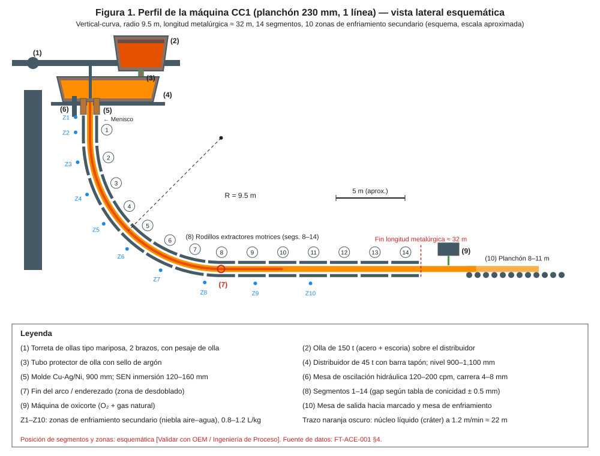
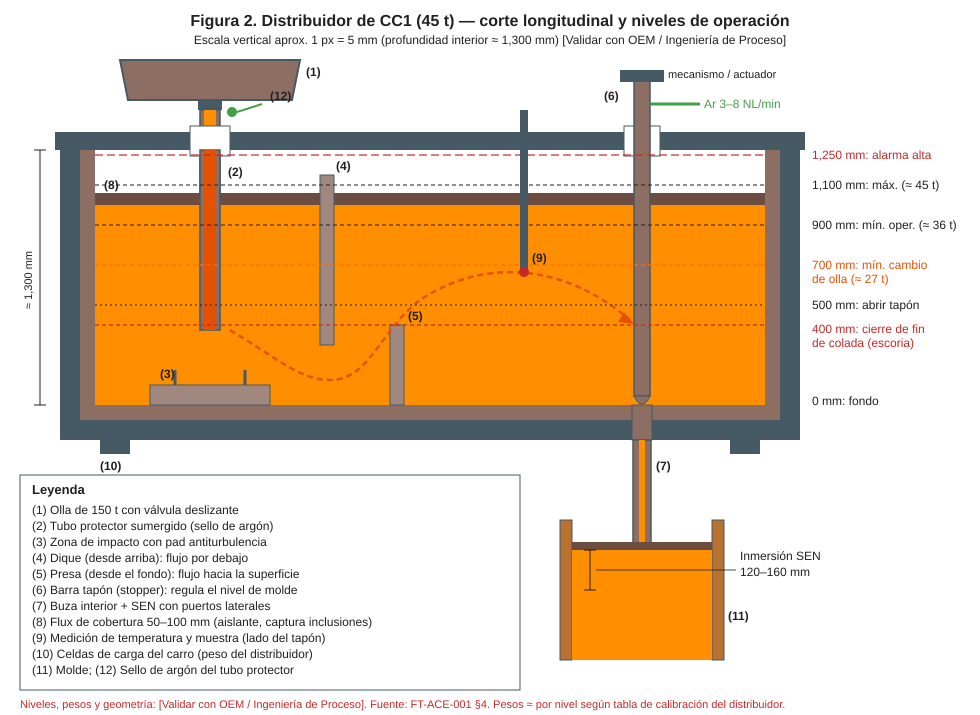
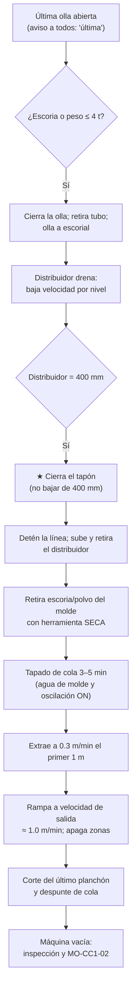

# MO-CC1-07 — Fin de colada y cierre de secuencia

| Código | Versión | Estado | Área | Dueño del proceso | Elaboró | Revisión técnica | Revisión de seguridad | Aprobó | Fecha | Próxima revisión |
|---|---|---|---|---|---|---|---|---|---|---|
| MO-CC1-07 | 0.1 | Borrador para validación | Colada Continua 1 (planchón) | C-06 Supervisor de Colada Continua | experto-operativo-metalurgia | experto-operativo-metalurgia | experto-seguridad-salud | Pendiente (Gerente de Acería / Director) | 2026-09-25 | 2027-09-25 |

> ⚠️ Valores de referencia de FT-ACE-001 §4. Nivel de cierre del distribuidor, tiempos de "tapado" de la cola, velocidad de salida de cola y apagado de zonas: **[Validar con OEM / Ingeniería de Proceso]**.

## 1. Objetivo y alcance
**Objetivo:** terminar la secuencia (planeada o no planeada) **sin pasar escoria al molde, sin breakout de la cola y sin exponer a nadie al metal líquido**, dejando la máquina vacía y lista para su preparación (MO-CC1-02).

**Alcance:** desde que se abre la **última olla** de la secuencia (o se decide un cierre no planeado) hasta que la cola sale de la máquina, se corta el último planchón y el distribuidor y la olla quedan fuera de la plataforma.

## 2. Roles y responsabilidades
| Rol | Responsabilidad en este proceso | R/A/C/I |
|---|---|---|
| C-06 Supervisor de Colada Continua | Decide el cierre (planeado o de emergencia) y dirige la salida de la cola | A |
| S-13 Operador de Plataforma de Colada | Cierre de olla y tapón, retiro del distribuidor, nivel del distribuidor | R |
| S-12 Operador de Púlpito de Colada | Velocidad por nivel del distribuidor, detención, salida de cola, modo de enfriamiento de cola | R |
| S-14 Ayudante de Colada | Limpieza de la superficie de la cola en el molde, observación | R |
| S-16 Operador de Corte y Marcado | Corte del último planchón y despunte de cola | R |
| S-09 Operador de Grúa de Colada | Retira la última olla | R (izaje) |
| C-08 Ingeniero de Proceso de CC | Parámetros de salida de cola; análisis de cierres no planeados | C |
| C-04 Jefe de Turno | Informado del cierre y sus causas | I |

## 3. Descripción del proceso
Al final de la secuencia se vacía la última olla y el distribuidor **hasta un nivel mínimo de 400 mm** (por debajo se forma un vórtice que arrastra escoria y flux al molde). Se cierra el tapón, se retira la SEN y se "tapa" la cola: la línea se detiene unos minutos para que el acero de arriba forme una cáscara. Después la cola se extrae lentamente del molde (es la parte más débil) y luego a velocidad de salida, mientras el enfriamiento secundario se apaga por zonas conforme la cola pasa. El último corte elimina la cola con su rechupe y escoria.

## 4. Equipos y maquinaria
| Equipo / componente | Función | Especificación clave | Condición para operar (verificación) |
|---|---|---|---|
| Detector de escoria / pesaje de olla | Cierre oportuno de la última olla | Peso residual 2–5 t | Señal disponible |
| Pesaje del distribuidor | Nivel de cierre | 400 mm ≈ 14 t (tabla aproximada) [Validar con OEM / Ingeniería de Proceso] | Calibrado |
| Barra tapón | Cierre final | Cierre total | Sin fuga al cerrar |
| Modo "salida de cola" del nivel 2 | Velocidad y apagado de zonas | Tracking de la cola | Activo |
| Enfriamiento secundario | Apaga zonas al paso de la cola | 10 zonas | Tracking OK |
| Herramientas de molde | Retiro de escoria y polvo de la cola | Secas, precalentadas | Inspeccionadas |
| Oxicorte | Corte final y despunte | O₂ + gas natural | Listo |
| Fosa / estación de volteo del distribuidor | Recibe el distribuidor con residuo | Seca | Inspeccionada |

## 5. Parámetros de operación
| Parámetro | Unidad | Objetivo | Rango normal | Alarma / límite | Acción si está fuera de rango | Dónde se mide |
|---|---|---|---|---|---|---|
| Peso residual al cerrar la última olla | t | 3–4 | 2–5 | Escoria en el chorro | Cierra de inmediato | Celdas de torreta / detector |
| Velocidad a 800 mm del distribuidor | m/min | 0.9 | 0.8–1.0 | — | — | HMI |
| Velocidad a 600 mm del distribuidor | m/min | 0.5 | 0.4–0.6 | — | — | HMI |
| **Nivel del distribuidor para cerrar el tapón** | mm | 400 (≈ 14 t) | 400–450 | < 400 mm | 🛑 Cierra de inmediato (arrastre de escoria) | Pesaje / nivel |
| Nivel del molde al cerrar el tapón | mm | 0 | ± 5 | — | — | Sensor |
| Tiempo de tapado de cola (línea detenida) | min | 4 | 3–5 [Validar con OEM / Ingeniería de Proceso] | > 8 | Riesgo de pegado; C-06 evalúa | Cronómetro |
| Agua de molde durante el tapado y la salida | L/min | Nominal | ≥ 95% | < 90% | MO-CC1-04 §9 | HMI |
| Velocidad de extracción inicial de la cola | m/min | 0.3 | 0.2–0.4 | — | Hasta que la cola salga del molde (≈ 1 m) | HMI |
| Velocidad de salida de cola | m/min | 1.0 | 0.8–1.2 [Validar con OEM / Ingeniería de Proceso] | > 1.2 | Riesgo de abombamiento/breakout de la cola | HMI |
| Rampa de salida de cola | m/min por min | 0.2 | ≤ 0.2 | — | — | HMI |
| Agua de molde después de la salida de la cola | min | ≥ 10 con caudal nominal | — | — | Luego reducir según OEM | HMI |
| Despunte de cola | mm | 800 | 500–1,000 [Validar con OEM / Ingeniería de Proceso] | Rechupe visible | Aumenta el despunte hasta sano | Oxicorte / inspección |

**Secuencia típica de la salida de cola [Validar con OEM / Ingeniería de Proceso]:**

| Tramo de la cola (desde el menisco) | Velocidad | Enfriamiento secundario | Observación |
|---|---|---|---|
| 0–1 m (dentro del molde) | 0.3 m/min | Z1–Z2 en modo cola (reducido) | Tramo más débil; vigila BOP y fuga |
| 1–5 m (segmentos 1–2) | Rampa a 0.6 m/min | Zonas se apagan al paso de la cola | Zona de exclusión activa hasta el segmento 3 |
| 5–32 m | Rampa a ≈ 1.0 m/min | Apagado por tracking zona por zona | Evita sobreenfriar y abombar |
| > 32 m (oxicorte) | Según corte | — | Despunte de cola 500–1,000 mm |

**Decisión de cierre no planeado:**

| Condición | Cerrar de inmediato (sin esperar 400 mm) | Cierre controlado (pasos 1–19) |
|---|---|---|
| Breakout, fuga de agua en el molde, rebose | Sí | — |
| Falla de agua de molde sin entrada del agua de emergencia | Sí | — |
| Falla de oscilación > 60 s | Sí | — |
| Olla siguiente no llega / no abre | — | Sí |
| Clogging sin cambio de SEN posible | — | Sí |
| SH < 10 °C | — | Sí |

## 6. Seguridad
### 6.1 Peligros y controles críticos
| Peligro | Consecuencia | Control crítico | Verificación |
|---|---|---|---|
| Breakout de la cola al salir del molde | Fuga de acero bajo el molde | ★ Tapado completo, 0.3 m/min en el primer metro, **zona de exclusión bajo el molde** hasta que la cola pase el segmento 3 | Barrera + confirmación C-06 |
| Agua sobre acero líquido en la cola | Explosión de vapor | ★ Prohibido echar agua sobre la cola líquida; herramientas secas; solo práctica aprobada por OEM [Validar con OEM / Ingeniería de Proceso] | Observación de C-06 |
| Arrastre de escoria / vórtice | Escoria en el molde, salpicaduras | ★ Cerrar a 400 mm | Pesaje |
| Traslado del distribuidor con residuo (≈ 14 t) | Derrame | Ruta despejada, fosa seca, nadie en la ruta | Inspección |
| Retiro de escoria de la cola en el molde | Quemaduras, salpicadura | Aluminizado completo, careta IR, herramientas secas | EPP |
| Olla con residuo suspendida | Aplastamiento, derrame | Nadie bajo la carga (MS-ACE-04) | Señalero |

### 6.2 EPP obligatorio
- S-13, S-14: aluminizado completo, careta IR, ropa FR, guantes, botas con metatarsal, protección auditiva, detector de O₂/CO.
- S-16: ropa FR, careta sombra 5 para oxicorte, guantes, botas.

### 6.3 Permisos, bloqueos y zonas de exclusión
- **Zona de exclusión bajo el molde** activa hasta que la cola pase el segmento 3.
- **Zona de la fosa del distribuidor** y **ruta del carro** despejadas.
- Ingreso a la máquina para inspección solo con la cola fuera, la máquina detenida y **LOTO** (MS-ACE-02).

## 7. Calidad
| Variable crítica de calidad | Especificación | Método / frecuencia | Registro | Defecto si falla |
|---|---|---|---|---|
| Escoria en el último planchón | Sin inclusiones macro | Cierre a 400 mm; inspección | MES | Inclusiones de escoria → despunte mayor o rechazo |
| Despunte de cola | Hasta zona sana (sin rechupe) | Visual en el corte | Registro de corte | Rechupe o porosidad en el planchón |
| Últimos planchones | Marcados "fin de secuencia" | Tracking | MES | Inspección especial (MO-CC1-09) |
| Temperatura del último tramo | SH ≥ 15 °C hasta el cierre | Termopar | Hoja de colada | Congelamiento en SEN |

## 8. Procedimiento paso a paso
| # | Paso | Cómo hacerlo (detalle y medición) | Criterio de aceptación | ★ | Rol |
|---|---|---|---|---|---|
| 1 | Anuncia la última olla | Por radio a púlpito, plataforma, corte y grúa; ajusta programa de corte | Todos enterados | | C-06 |
| 2 | Cierra la última olla | Al primer signo de escoria o ≤ 4 t residuales; retira el tubo protector | Olla cerrada | | S-13 |
| 3 | Retira la olla | Giro de torreta y S-09 la lleva a escorial; nadie bajo la carga | Olla fuera | ★ | S-13, S-09 |
| 4 | Drena el distribuidor | Baja velocidad: 800 mm → 0.9 m/min; 600 mm → 0.5 m/min | Nivel del molde ± 3 mm | | S-12 |
| 5 | Mide la temperatura final | A ≈ 600 mm del distribuidor | SH ≥ 15 °C | 🔎 | S-13 |
| 6 | Cierra el tapón | A **400 mm** del distribuidor (no menos) | Tapón cerrado sin fuga | ★ | S-13 |
| 7 | Detén la línea | Velocidad 0; mantén agua de molde y oscilación; activa modo "cola" | Detenida | | S-12 |
| 8 | Retira el distribuidor | Sube (SEN fuera del molde) y lleva a fosa/volteo | Distribuidor fuera | | S-13 |
| 9 | Establece la zona de exclusión | Bajo el molde y segmentos 1–3 despejados | Confirmación de C-06 | ★ | C-06 |
| 10 | Limpia la superficie de la cola | Retira escoria y polvo con herramienta seca, sin romper la cáscara | Superficie limpia | ★ | S-14 |
| 11 | Tapa la cola | Espera 3–5 min con la línea detenida; no eches agua sobre acero líquido | Costra superior formada | ★ | S-14, S-12 |
| 12 | Extrae la cola del molde | 0.3 m/min hasta que la cola salga del molde (≈ 1 m) | Sin alarma BOP ni fuga | ★ | S-12 |
| 13 | Sube a velocidad de salida | Rampa ≤ 0.2 m/min por minuto hasta ≈ 1.0 m/min; zonas se apagan al paso de la cola | Sin abombamiento | | S-12 |
| 14 | Levanta la zona de exclusión | Cuando la cola pase el segmento 3 | Autorización de C-06 | | C-06 |
| 15 | Mantén el agua de molde | ≥ 10 min después de la salida de la cola; luego según OEM | Registro | | S-12 |
| 16 | Corta el último planchón | Longitud según programa; despunte de cola 500–1,000 mm hasta zona sana | Corte sano | 🔎 | S-16 |
| 17 | Detén la máquina y bloquea | LOTO para inspección y limpieza (MS-ACE-02) | Candados | | S-12, S-14 |
| 18 | Inspecciona la máquina | Rodillos, boquillas, molde (desgaste, grietas), restos de acero | Reporte para MO-CC1-02 / mantenimiento | | S-14, C-06 |
| 19 | Registra la secuencia | Número de coladas, t, causa del cierre, residuos (olla y distribuidor), vida de distribuidor y SEN | Hoja de secuencia | | S-12 |

**Cierre no planeado (emergencia):** si hay breakout, falla de agua o de oscilación, o la olla siguiente no llega: cierra olla y tapón **sin esperar** a los 400 mm si la condición lo exige; aplica la respuesta de MO-CC1-04 §9 y, si la línea puede moverse, sigue los pasos 7–19.

## 9. Condiciones anormales y respuesta
| Síntoma / alarma | Causa probable | Acción inmediata | A quién avisar |
|---|---|---|---|
| Escoria visible en el molde al final | Cierre del tapón bajo 400 mm, vórtice | Cierra el tapón; aumenta el despunte de cola; marca el planchón | C-06, C-09 |
| Fuga de acero al extraer la cola (breakout de cola) | Tapado corto, extracción rápida | ★ Detén la línea; evacúa; respuesta a breakout (MO-CC1-04 §9) | C-04, C-06, C-16 |
| La cola no se mueve (pegada) | Tapado largo, oscilación detenida | Mantén oscilación; aumenta el par gradualmente según OEM; no uses O₂ en el molde sin autorización | C-06, C-08 |
| Tapón no cierra completo | Erosión del tapón/buza | Cierre de emergencia del distribuidor (subirlo) según OEM [Validar con OEM / Ingeniería de Proceso] | C-06 |
| Zona de enfriamiento no se apaga | Falla de tracking | Apaga manual la zona; evita sobreenfriar | S-12 |
| Cola abombada entre rodillos | Velocidad de salida alta, poca agua | Baja la velocidad; revisa agua | C-08 |
| Falla de agua de molde durante el tapado | Bombeo | Agua de emergencia ≤ 15 s; si no entra, evacúa | C-04, C-12 |

## 10. Registros
- Hoja de secuencia: coladas, toneladas, hora de cierre, causa (planeado / no planeado), nivel de cierre del distribuidor, residuos.
- Registro de salida de cola (tiempo de tapado, velocidades).
- Registro de despunte de cola.
- Reporte de inspección de máquina después de la secuencia.

## 11. Competencia requerida y certificación
| Rol | Nivel requerido (1–4) | Formación teórica (h) | OJT supervisado (h / eventos) | Evaluación (pasos ★) | Vigencia |
|---|---|---|---|---|---|
| S-13 Operador de Plataforma de Colada | 3 | 8 | 6 cierres de secuencia | Pasos 3, 6 | ≤ 24 meses (TD-P07) |
| S-12 Operador de Púlpito de Colada | 3 | 8 | 6 cierres (1 no planeado en simulador) | Pasos 11, 12 | ≤ 24 meses |
| S-14 Ayudante de Colada | 3 | 6 | 6 cierres | Pasos 10, 11 | ≤ 24 meses |
| C-06 Supervisor de Colada Continua | 4 (evaluador) | 8 + evaluador | — | Paso 9 y decisión de cierre no planeado | ≤ 24 meses |

**Lista corta de verificación de pasos ★:**
- [ ] Cierra el tapón a 400 mm, nunca por debajo.
- [ ] Establece la zona de exclusión antes de extraer la cola.
- [ ] Limpia la cola con herramienta seca y no echa agua sobre el acero líquido.
- [ ] Extrae el primer metro a 0.3 m/min.
- **Preguntas orales:** ¿Por qué se forma un vórtice bajo 400 mm? ¿Por qué la cola es la parte más débil? ¿Qué haces si la cola no se mueve?

## 12. Referencias
- FT-ACE-001 §4; CAT-ACE-001; MO-CC1-02, MO-CC1-04, MO-CC1-05, MO-CC1-08, MO-CC1-09.
- MS-ACE-01, MS-ACE-02, MS-ACE-03, MS-ACE-04, MS-ACE-09.
- NOM-017-STPS-2008, NOM-015-STPS-2001, NOM-004-STPS-1999, NOM-006-STPS-2014 — verificar con Jurídico Laboral / SSO.
- Manual OEM de CC1 (salida de cola) [por referenciar].

## 13. Control de cambios
| Versión | Fecha | Cambio | Elaboró |
|---|---|---|---|
| 0.1 | 2026-09-25 | Emisión inicial para validación | experto-operativo-metalurgia |
