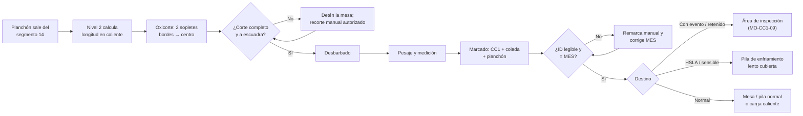

# MO-CC1-08 — Corte, marcado y manejo en mesa de enfriamiento

| Código | Versión | Estado | Área | Dueño del proceso | Elaboró | Revisión técnica | Revisión de seguridad | Aprobó | Fecha | Próxima revisión |
|---|---|---|---|---|---|---|---|---|---|---|
| MO-CC1-08 | 0.1 | Borrador para validación | Colada Continua 1 (planchón) | C-06 Supervisor de Colada Continua | experto-operativo-metalurgia | experto-operativo-metalurgia | experto-seguridad-salud | Pendiente (Gerente de Acería / Director) | 2026-09-25 | 2027-09-25 |

> ⚠️ Valores de referencia de FT-ACE-001 §4 y §6. Presiones de oxicorte, factor de contracción, despuntes, altura de pilas y práctica de enfriamiento lento: **[Validar con OEM / Ingeniería de Proceso]** y con Laminación en Caliente (cliente interno).

## 1. Objetivo y alcance
**Objetivo:** cortar el planchón a la longitud pedida (8–11 m, ± 15 mm), **marcarlo de forma legible e inequívoca** para su trazabilidad y moverlo, enfriarlo y apilarlo **sin accidentes ni daño** al producto, entregándolo a inspección (MO-CC1-09) y a despacho.

**Alcance:** desde que el planchón sale del último segmento hasta que queda en pila (o en carga caliente) con su identificación en el MES. Incluye despuntes de cabeza y cola, cortes de muestra y manejo con grúa.

## 2. Roles y responsabilidades
| Rol | Responsabilidad en este proceso | R/A/C/I |
|---|---|---|
| C-06 Supervisor de Colada Continua | Asegura el programa de corte y la trazabilidad; autoriza cortes manuales | A |
| S-16 Operador de Corte y Marcado | Programa de longitudes, oxicorte, despuntes, muestras, marcado y verificación de ID | R |
| S-17 Operador de Mesa de Enfriamiento y Despacho | Transferencia, pesaje, apilado, enfriamiento lento, despacho; opera grúa de producto o coordina | R |
| Operador de grúa de CC y producto (50 t / 25 t) | Izaje de planchones con tenaza | R (izaje) |
| S-18 Inspector de Calidad de Semiterminado | Recibe planchones para inspección y retiene los "con evento" | C |
| S-12 Operador de Púlpito de Colada | Envía datos de colada y eventos al tracking | C |
| C-09 Metalurgista de Producto | Define qué planchones requieren enfriamiento lento o retención | C |

## 3. Descripción del proceso
El planchón sale del segmento 14 como una tira continua. La **máquina de oxicorte** se sujeta al planchón, viaja con él y corta con dos sopletes (de los bordes al centro). El nivel 2 calcula la longitud en caliente para que en frío resulte la longitud pedida. Después del corte se **desbarba**, se **pesa**, se **marca** (colada + número de planchón) y se transfiere a la mesa de enfriamiento o a pilas. Los grados sensibles (HSLA con Nb) se enfrían lento en pila; los planchones "con evento" se separan para inspección.

## 4. Equipos y maquinaria
| Equipo / componente | Función | Especificación clave | Condición para operar (verificación) |
|---|---|---|---|
| Rueda de medición / encoder | Mide la longitud | Resolución ≤ 5 mm; calibración mensual [Validar con OEM / Ingeniería de Proceso] | Calibración vigente |
| Máquina de oxicorte | Corta el planchón | O₂ + gas natural; 2 sopletes; carro que viaja con el planchón | Arrestaflamas y válvulas de retención; boquillas limpias |
| Suministro de O₂ y gas natural | Alimenta los sopletes | Presiones según OEM [Validar con OEM / Ingeniería de Proceso] | Manómetros en rango; sin fugas |
| Desbarbadora | Elimina rebabas del corte | [Validar si está instalada] | Operativa |
| Báscula de planchones | Peso real | Capacidad ≥ 40 t; ± 0.1% [Validar con OEM / Ingeniería de Proceso] | Calibrada |
| Máquina de marcado | Identifica el planchón | Pintura/estampado de alta temperatura; 1–2 caras | Prueba de marcado al inicio del turno |
| Mesa de rodillos de salida y carro de transferencia | Mueven el planchón | — | Guardas, paros de emergencia, alarmas |
| Grúas de CC y producto | Apilan y cargan | 2 × 50 t + 2 × 25 t con tenaza | Carga neta ≤ capacidad − peso de la tenaza |
| Mesa de enfriamiento / patio de pilas | Enfría y almacena | Pilas separadas por colada | Piso firme, calzas, señalización |
| Cubiertas de enfriamiento lento [Supuesto] | Enfriamiento lento de grados sensibles | — | Disponibles |

## 5. Parámetros de operación
| Parámetro | Unidad | Objetivo | Rango normal | Alarma / límite | Acción si está fuera de rango | Dónde se mide |
|---|---|---|---|---|---|---|
| Longitud pedida (frío) | m | Según orden | 8–11 | Fuera de 8–11 | No cortar; consulta a C-06 | Programa MES |
| Longitud de corte en caliente | m | Longitud fría × ≈ 1.013 [Validar con OEM / Ingeniería de Proceso] | — | — | — | Nivel 2 |
| Tolerancia de longitud (frío) | mm | 0 | ± 15 | > ± 15 | Recalibra encoder; marca el planchón | Medición en pila |
| Escuadra del corte | mm | ≤ 5 | ≤ 5 [Validar con OEM / Ingeniería de Proceso] | > 10 | Revisa alineación de sopletes | Escuadra |
| Velocidad de corte (230 mm) | mm/min | 300 | 250–350 [Validar con OEM / Ingeniería de Proceso] | Corte incompleto | Limpia boquilla; revisa presión de O₂ | HMI del oxicorte |
| Ancho de sangría (kerf) | mm | 10 | 8–12 | > 15 | Boquilla dañada | Medición |
| Despunte de cabeza (1.er planchón de la secuencia) | mm | 400 | 300–500 [Validar con OEM / Ingeniería de Proceso] | Cabeza con restos de barra falsa o chatarra | Aumenta despunte | Visual |
| Despunte de cola (último planchón) | mm | 800 | 500–1,000 | Rechupe visible | Aumenta hasta zona sana | Visual |
| Peso del planchón | t | Teórico = 0.23 × ancho (m) × largo (m) × 7.85 | 13.0 (900 mm × 8 m) a 32.8 (1,650 mm × 11 m) | Diferencia real–teórico > 2% | Revisa medición y báscula | Báscula |
| Legibilidad de marcado | % | 100 | 100 | Ilegible | Remarca manual (crayón de alta temperatura) | Visual |
| Altura máxima de pila | m | ≤ 2.5 | — [Validar con C-16] | > 2.5 | Nueva pila | Visual / regla |
| Enfriamiento lento (HSLA, peritécticos, con evento de grietas) | h | ≥ 48 en pila cubierta hasta < 300 °C [Validar con OEM / Ingeniería de Proceso] | — | Enfriamiento con agua | 🛑 Prohibido enfriar con agua estos grados | Registro de pila |
| Capacidad de izaje con grúa de 25 t | t | Solo planchones ≤ 25 t − peso de tenaza (≈ ≤ 17 t netas) [Validar con OEM / Ingeniería de Proceso] | — | Planchón más pesado | Usa grúa de 50 t | Peso de MES |

**Peso teórico del planchón en frío (t) = 0.23 × ancho × largo × 7.85 — grúa requerida:**

| Ancho (mm) | 8 m | 9.5 m | 11 m | Grúa de 25 t (≤ 17 t netas) [Validar con OEM / Ingeniería de Proceso] |
|---|---|---|---|---|
| 900 | 13.0 | 15.4 | 17.9 | Solo 8 y 9.5 m |
| 1,100 | 15.9 | 18.9 | 21.8 | Solo 8 m |
| 1,300 | 18.8 | 22.3 | 25.8 | No |
| 1,500 | 21.7 | 25.7 | 29.8 | No |
| 1,650 | 23.8 | 28.3 | 32.8 | No |

## 6. Seguridad
### 6.1 Peligros y controles críticos
| Peligro | Consecuencia | Control crítico | Verificación |
|---|---|---|---|
| Carga suspendida (planchón de hasta 32.8 t, caliente) | Aplastamiento | ★ Grúa con capacidad correcta (50 t para > 17 t netas), tenaza inspeccionada, nadie bajo la carga ni entre pilas (MS-ACE-04, NOM-006) | Verificación de peso vs. grúa antes del izaje |
| Oxicorte (O₂ y gas natural) | Incendio, retroceso de flama, quemaduras, enriquecimiento de O₂ | Arrestaflamas y válvulas de retención; revisión de fugas; ropa sin grasa; NOM-027 | Lista del turno |
| Planchón caliente (800–1,000 °C) | Quemadura por radiación o contacto | Distancia; EPP; no caminar sobre la mesa | Observación |
| Mesa de rodillos y carro de transferencia | Atrapamiento, golpe | Guardas; paros de emergencia; LOTO para cualquier intervención (MS-ACE-02) | Prueba de paro |
| Caída de planchón de la pila | Aplastamiento | Pilas ≤ 2.5 m, calzas, alineadas; nadie entre pilas durante el izaje | Inspección de pilas |
| Humos del oxicorte y del marcado | Afectación respiratoria | Extracción local; respirador para humos metálicos | Medición de higiene (NOM-010) |
| Escoria y rebabas calientes | Quemaduras, incendio | Área limpia; contenedores de escoria | Inspección |

### 6.2 EPP obligatorio
- S-16: casco, careta de oxicorte sombra 5 o lentes sombra 5, ropa FR, guantes de carnaza, botas con metatarsal, protección auditiva, respirador para humos metálicos si no hay extracción.
- S-17 y grúa: casco, lentes, ropa FR, guantes, botas con metatarsal, chaleco de alta visibilidad en patio.

### 6.3 Permisos, bloqueos y zonas de exclusión
- **Zona de exclusión** bajo la trayectoria de la grúa y entre pilas durante el izaje.
- **LOTO** de mesa, carro de transferencia y oxicorte para cambiar boquillas o retirar planchones atorados.
- **Permiso de trabajo en caliente** para cortes manuales fuera de la máquina de oxicorte.

## 7. Calidad
| Variable crítica de calidad | Especificación | Método / frecuencia | Registro | Defecto si falla |
|---|---|---|---|---|
| Longitud | Pedida ± 15 mm (frío) | Encoder; verificación en pila 1 por colada | MES | Rechazo en Laminación; desperdicio |
| Escuadra y calidad del corte | ≤ 5 mm; sin rebaba | Visual, cada planchón | Registro de corte | Daño en el horno de recalentamiento |
| Identificación | 100% legible y = MES | Visual, cada planchón | MES | Pérdida de trazabilidad → retención |
| Separación de planchones con evento | 100% separados | Tracking | MES | Defecto que llega al cliente |
| Enfriamiento de grados sensibles | Lento, sin agua | Registro de pila | MES | Grietas por tensión térmica |
| Muestras para macroataque | Rebanada transversal de 20–30 mm según plan de MO-CC1-09 [Validar con OEM / Ingeniería de Proceso] | Programa | MES / laboratorio | Sin evaluación interna |

**Formato de identificación [Supuesto]:** `1-AAAAAA-NN` → `1` = CC1; `AAAAAA` = número de colada; `NN` = número de planchón dentro de la colada (01 = cabeza). El MES liga la ID con: grado, posición en la colada (cabeza/centro/cola), eventos de proceso, peso, dimensiones y estado de inspección.

## 8. Procedimiento paso a paso
| # | Paso | Cómo hacerlo (detalle y medición) | Criterio de aceptación | ★ | Rol |
|---|---|---|---|---|---|
| 1 | Revisa el programa de corte | Longitudes por orden; ajuste final de la secuencia para minimizar recortes | Programa cargado | | S-16 |
| 2 | Verifica el oxicorte | Presiones de O₂ y gas; arrestaflamas; prueba de flama; boquillas limpias | Flama estable | ★ | S-16 |
| 3 | Prueba el marcado | Marca de prueba en placa | Legible | | S-16 |
| 4 | Despunta la cabeza (inicio de secuencia) | Tras la desconexión de la barra falsa; 300–500 mm | Cabeza sana | 🔎 | S-16 |
| 5 | Corta cada planchón | Automático: sujeción, viaje sincronizado, 2 sopletes bordes → centro | Corte completo | | S-16 |
| 6 | Verifica el corte | Corte pasante, escuadra ≤ 5 mm, sin puentes | Aceptado | 🔎 | S-16 |
| 7 | Corta muestras (si toca) | Rebanada transversal según plan de C-09 | Muestra identificada | | S-16 |
| 8 | Desbarba | Automático o manual con herramienta | Sin rebaba | | S-16 |
| 9 | Pesa y mide | Compara con el peso teórico | Diferencia ≤ 2% | 🔎 | S-17 |
| 10 | Marca el planchón | ID en la cara indicada; confirma contra MES | Legible y correcta | ★ | S-16 |
| 11 | Separa por destino | Con evento → inspección; sensible → enfriamiento lento; normal → pila o carga caliente | Destino correcto en MES | 🔎 | S-17 |
| 12 | Verifica grúa y peso antes del izaje | Peso del MES vs. capacidad neta de la grúa | Grúa adecuada | ★ | S-17, grúa |
| 13 | Apila | Calzas alineadas; pila ≤ 2.5 m; una colada por pila cuando sea posible; nadie bajo la carga | Pila estable | ★ | S-17, grúa |
| 14 | Cubre pilas de enfriamiento lento | Grados sensibles ≥ 48 h cubiertos; registra hora | Registro | | S-17 |
| 15 | Actualiza el MES | Ubicación de pila, estado (liberado / retenido) | MES al día | | S-17 |
| 16 | Despunta la cola (fin de secuencia) | 500–1,000 mm hasta zona sana | Cola sana | 🔎 | S-16 |
| 17 | Despacha | Solo planchones liberados por inspección (MO-CC1-09) | Lista de despacho | | S-17 |

## 9. Condiciones anormales y respuesta
| Síntoma / alarma | Causa probable | Acción inmediata | A quién avisar |
|---|---|---|---|
| Corte incompleto (puente) | Boquilla sucia, presión baja, velocidad alta | Detén la mesa antes de la transferencia; recorte manual con permiso de trabajo en caliente | C-06 |
| Retroceso de flama | Presión incorrecta, boquilla dañada | Cierra O₂ y gas; revisa arrestaflamas; no reencender sin revisión | C-06, S-21 |
| Fuga de O₂ o gas | Mangueras, conexiones | Cierra válvulas; ventila; prohibida flama; avisa | C-06, C-16 |
| Longitud fuera de tolerancia | Encoder patinando, cálculo de contracción | Recalibra; marca los planchones afectados | C-06, C-09 |
| Marcado ilegible o ID ≠ MES | Máquina de marcado, error de tracking | Remarca manual; corrige MES; retén hasta verificar | C-06, S-18 |
| Planchón atorado en la mesa | Rebaba, deformación | Detén; LOTO antes de intervenir | C-06, S-19 |
| Planchón más pesado que la grúa disponible | Grúa de 25 t asignada | 🛑 No izar; usa grúa de 50 t | Supervisor de patio |
| Pila inestable o inclinada | Calzas mal puestas, planchón torcido | Detén izajes cerca; reacomoda con grúa de 50 t | C-06, C-16 |
| Planchón con grietas visibles en caliente | Proceso | Retén y avisa a S-18 | S-18, C-09 |
| Falla del oxicorte con la colada en curso | Mecánica, gas | Baja la velocidad de colada para ganar tiempo; corte manual autorizado; si no, cierre (MO-CC1-07) | C-06 |

## 10. Registros
- Programa y registro de corte (longitudes, despuntes, muestras).
- Registro de pesaje por planchón.
- MES: ID, grado, eventos, ubicación, estado de inspección, destino.
- Registro de pilas de enfriamiento lento (hora de entrada y salida, temperatura).
- Lista de verificación de oxicorte del turno.

## 11. Competencia requerida y certificación
| Rol | Nivel requerido (1–4) | Formación teórica (h) | OJT supervisado (h / eventos) | Evaluación (pasos ★) | Vigencia |
|---|---|---|---|---|---|
| S-16 Operador de Corte y Marcado | 3 | 16 (oxicorte, NOM-027, trazabilidad) | 80 h | Pasos 2, 10 | ≤ 24 meses (TD-P07) |
| S-17 Operador de Mesa de Enfriamiento y Despacho | 3 | 16 (izaje, apilado, MES) | 80 h | Pasos 12, 13 | ≤ 24 meses |
| Operador de grúa de CC y producto | 3 | Curso de grúa (NOM-006) | Según MS-ACE-04 | Paso 12, 13 | ≤ 24 meses |
| C-06 Supervisor de Colada Continua | 4 (evaluador) | 4 + evaluador | — | Todos | ≤ 24 meses |

**Lista corta de verificación de pasos ★:**
- [ ] Verifica arrestaflamas, presiones y fugas antes de cortar.
- [ ] Confirma que la ID marcada coincide con el MES.
- [ ] Compara el peso del planchón con la capacidad neta de la grúa antes del izaje.
- [ ] Apila con calzas, ≤ 2.5 m y sin personas bajo la carga.
- **Preguntas orales:** ¿Por qué se corta más largo en caliente? ¿Qué haces si la ID no coincide con el MES? ¿Por qué no se enfría con agua un planchón HSLA?

## 12. Referencias
- FT-ACE-001 §4, §6, §7; CAT-ACE-001; MO-CC1-03, MO-CC1-07, MO-CC1-09.
- MS-ACE-02, MS-ACE-04, MS-ACE-06, MS-ACE-08.
- NOM-027-STPS-2008 (soldadura y corte), NOM-006-STPS-2014 (manejo de materiales), NOM-004-STPS-1999, NOM-017-STPS-2008, NOM-010-STPS-2014, NOM-020-STPS-2011 — verificar con Jurídico Laboral / SSO.
- Especificación de planchón de Laminación en Caliente [por referenciar]; manual OEM del oxicorte y del marcado [por referenciar].

## 13. Control de cambios
| Versión | Fecha | Cambio | Elaboró |
|---|---|---|---|
| 0.1 | 2026-09-25 | Emisión inicial para validación | experto-operativo-metalurgia |
