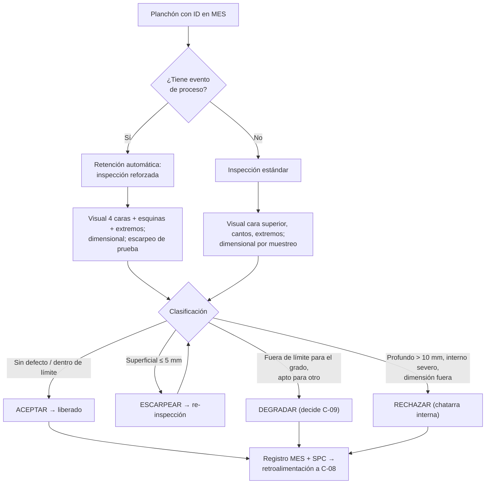

# MO-CC1-09 — Inspección de calidad del planchón y disposición de defectos

| Código | Versión | Estado | Área | Dueño del proceso | Elaboró | Revisión técnica | Revisión de seguridad | Aprobó | Fecha | Próxima revisión |
|---|---|---|---|---|---|---|---|---|---|---|
| MO-CC1-09 | 0.1 | Borrador para validación | Colada Continua 1 (planchón) — Calidad | C-09 Metalurgista de Producto / Ingeniero de Calidad de Acería | experto-operativo-metalurgia | experto-operativo-metalurgia — visto bueno sin observaciones, 2026-09-25 | experto-seguridad-salud — visto bueno sin observaciones, 2026-09-25 | Pendiente (Gerente de Acería / Director) | 2026-09-25 | 2027-09-25 |

> ⚠️ Los criterios de aceptación, profundidades de escarpeo, clases de segregación y tolerancias dimensionales de este manual son **referencias típicas**: **[Validar con OEM / Ingeniería de Proceso]** y con la especificación de planchón de Laminación en Caliente y de los clientes (automotriz, tubería).

## 1. Objetivo y alcance
**Objetivo:** que **ningún planchón defectuoso llegue a Laminación sin disposición**: detectar, medir y clasificar los defectos superficiales, internos y dimensionales; decidir **aceptar, escarpear, degradar o rechazar**; y retroalimentar al proceso (C-08) para eliminar la causa.

**Alcance:** todos los planchones de CC1, desde su llegada al área de inspección o pila (MO-CC1-08) hasta su liberación para despacho. Incluye inspección visual, dimensional, macroataque o impresión de azufre, escarpeo manual y registro en el MES.

## 2. Roles y responsabilidades
| Rol | Responsabilidad en este proceso | R/A/C/I |
|---|---|---|
| C-09 Metalurgista de Producto / Ing. de Calidad | Dueño de criterios; decide degradación y rechazo; analiza tendencias | A |
| S-18 Inspector de Calidad de Semiterminado | Inspección visual y dimensional, clasificación, marcado de defectos, registro, re-inspección tras escarpeo | R |
| S-11 Muestrero / Analista de Laboratorio | Prepara y ataca muestras (macroataque / Baumann) | R |
| S-17 Operador de Mesa de Enfriamiento y Despacho | Mueve, voltea y separa planchones; ejecuta la disposición física | R |
| Escarpador (personal de acabado) [Supuesto: función asignada a S-18 o a contratista REPSE] | Escarpeo manual con O₂ | R |
| C-08 Ingeniero de Proceso de CC | Recibe la retroalimentación y corrige el proceso | C |
| C-06 Supervisor de Colada Continua | Informado de defectos por turno | I |

## 3. Descripción del proceso
Cada planchón llega con su ID y sus **eventos de proceso** (nivel ± 8 mm, sticker, cambio de SEN, unión de distribuidor, arranque, fin de secuencia, transición de grado, SH > 35 °C). Los planchones con evento se **retienen automáticamente** para inspección reforzada. El inspector revisa las caras, las esquinas y los extremos, mide dimensiones, marca los defectos con pintura y decide la disposición. Las muestras de macroataque califican la calidad interna (segregación central, grietas internas, porosidad).

## 4. Equipos y maquinaria
| Equipo / componente | Función | Especificación clave | Condición para operar (verificación) |
|---|---|---|---|
| Área de inspección con volteador | Acceso a las 4 caras | Volteador para planchones hasta 33 t [Validar con OEM / Ingeniería de Proceso] | Enclavamientos y zona de exclusión |
| Iluminación de inspección | Detección visual | ≥ 1,000 lux en la cara [Validar con C-16] | Medición con luxómetro |
| Calibrador / cinta / regla de 3 m / escuadra | Dimensional | Calibrados | Certificado vigente |
| Medidor de profundidad (galga) | Profundidad de defectos | Resolución 0.1 mm | Calibrado |
| Pirómetro de contacto o IR | Temperatura del planchón antes de inspección o escarpeo | 0–1,000 °C | Calibrado |
| Equipo de escarpeo manual (O₂ + gas) | Remoción de defectos superficiales | Soplete de escarpeo | Arrestaflamas, mangueras, válvulas |
| Laboratorio de macroataque / impresión Baumann | Calidad interna | Ataque con ácido caliente o papel fotográfico | Ventilación, EPP químico |
| Pintura de marcado de defectos | Indica defecto y disposición | Código de colores | Disponible |

## 5. Parámetros de operación (criterios de aceptación)
**Dimensional [Validar con OEM / Ingeniería de Proceso y Laminación]:**

| Parámetro | Unidad | Objetivo | Rango normal | Alarma / límite | Acción si está fuera de rango | Dónde se mide |
|---|---|---|---|---|---|---|
| Espesor | mm | 230 | 227–233 (± 3) | Fuera de ± 3 | Rechazo o degradación; avisa a C-08 (gap de segmentos) | Calibrador, 3 puntos por extremo |
| Abultamiento (espesor al centro − borde) | mm | ≤ 1 | ≤ 3 | > 3 | Degradar/rechazar; C-08 revisa agua y rodillos | Calibrador |
| Cuña (espesor lado A − lado B) | mm | ≤ 1 | ≤ 2 | > 2 | C-08 revisa alineación de segmentos | Calibrador |
| Ancho | mm | Ancho pedido | −5 / +15 del pedido | Fuera | Rechazo o reasignación de orden (C-09) | Cinta, cabeza–centro–cola |
| Longitud | mm | Pedida | ± 15 | Fuera | Recorte o reasignación | Cinta |
| Sable (camber) | mm en 10 m | ≤ 10 | ≤ 15 | > 15 | Rechazo o reasignación | Hilo tenso / regla |
| Escuadra del corte | mm | ≤ 5 | ≤ 5 | > 10 | Recorte | Escuadra |

**Superficiales e internos (disposición):**

| Defecto (Figura 5) | Aceptar | Escarpear | Degradar / Rechazar |
|---|---|---|---|
| (1) Grieta longitudinal | No se acepta | Profundidad ≤ 5 mm (1–2 pasadas) | 5–10 mm: escarpeo profundo solo con autorización de C-09; > 10 mm o longitud > 1 m: rechazo |
| (2) Grietas transversales | No se acepta | ≤ 5 mm | > 5 mm: rechazo (en HSLA de tubería, cualquier grieta remanente tras escarpeo = rechazo) |
| (3) Grieta de esquina | No se acepta | Escarpeo de esquina ≤ 10 × 10 mm | Mayor: rechazo |
| (4) Depresión | ≤ 3 mm de profundidad y sin grieta | > 3 mm sin grieta | Con grieta: rechazo |
| (5) Inclusión de polvo / escoria (sliver) | No se acepta | ≤ 5 mm | Persiste tras 2 pasadas: rechazo |
| (6) Sopladuras / pinholes | No se aceptan visibles | Escarpeo 3–5 mm y re-inspección | Siguen expuestos: rechazo |
| (7) Marcas de oscilación profundas / sangrado | Profundidad ≤ 1 mm | > 1 mm | Con grieta en el valle: tratar como (2) |
| (8) Segregación central (clase tipo Mannesmann 1–5) | Tubería ≤ 2; lámina general ≤ 3 | — | Clase mayor: degradar a grado menos exigente |
| (9) Grietas internas | Tubería: clase 0–1; general ≤ 2 | — | Mayor: degradar o rechazar |
| (10) Abultamiento | ≤ 3 mm | — | > 3 mm: degradar/rechazar |

**Límites del escarpeo:** profundidad por pasada 3–5 mm; total ≤ 10 mm por cara; **espesor final ≥ 220 mm**; transición suave (pendiente ≥ 1:10); escarpear grados sensibles (HSLA con Nb) con el planchón a ≥ 150 °C para evitar grietas [Validar con OEM / Ingeniería de Proceso].

**Frecuencias:**

| Inspección | Planchón normal | Planchón con evento o grado crítico (HSLA tubería) |
|---|---|---|
| Visual cara superior, cantos y extremos | 100% | 100% |
| Visual cara inferior (volteo) | 1 por colada | 100% |
| Dimensional completo | 1 por colada | 100% |
| Escarpeo de prueba (tira) | Solo si hay indicación | En zona del evento |
| Macroataque / Baumann | 1 por secuencia y por grado (y en cada arranque) | 1 por colada [Validar con OEM / Ingeniería de Proceso] |

## 6. Seguridad
### 6.1 Peligros y controles críticos
| Peligro | Consecuencia | Control crítico | Verificación |
|---|---|---|---|
| Planchones en pila o volteador (hasta 33 t) | Aplastamiento | ★ Nadie entre pilas ni junto al volteador durante movimientos; inspección solo con planchón asentado y grúa fuera (MS-ACE-04) | Confirmación verbal con grúa |
| Escarpeo con O₂ | Quemaduras, incendio, proyección de escoria, retroceso de flama, ruido > 100 dB(A) | ★ Permiso de trabajo en caliente; arrestaflamas; área libre de combustibles; EPP de escarpeo; NOM-027 | Lista antes de escarpear |
| Humos de escarpeo | Afectación respiratoria | Extracción o respirador para humos metálicos; medición NOM-010 | Monitoreo |
| Superficies calientes | Quemaduras | Medir temperatura; guantes y ropa FR | Pirómetro |
| Ácidos del macroataque | Quemaduras químicas, vapores | Campana de extracción, EPP químico, regadera y lavaojos (NOM-005 / NOM-018) | Inspección de laboratorio |
| Caminar sobre planchones | Caída, torcedura | Escaleras y plataformas; no brincar entre planchones | Observación |

### 6.2 EPP obligatorio
- Inspección: casco, lentes, ropa FR, guantes, botas con metatarsal, chaleco de alta visibilidad.
- Escarpeo: careta sombra 5–6, chamarra de cuero o aluminizada, polainas, guantes largos, protección auditiva doble (tapones + orejeras), respirador para humos metálicos.
- Laboratorio: lentes de seguridad y careta, guantes de nitrilo/neopreno, mandil químico, respirador para vapores ácidos si no hay campana.

### 6.3 Permisos, bloqueos y zonas de exclusión
- **Zona de exclusión** de grúa y volteador durante movimientos.
- **Permiso de trabajo en caliente** para escarpeo.
- **LOTO** del volteador para cualquier intervención mecánica.

## 7. Calidad
| Variable crítica de calidad | Especificación | Método / frecuencia | Registro | Defecto si falla |
|---|---|---|---|---|
| Planchones con evento inspeccionados | 100% antes de liberar | MES bloquea el despacho | MES | Defecto al cliente |
| Exactitud de la clasificación | Concordancia entre inspectores ≥ 90% | Prueba de concordancia trimestral [Supuesto] | Registro de C-09 | Liberación errónea |
| Tasa de escarpeo | ≤ 5% de planchones [Supuesto] | SPC semanal | Tablero de calidad | Costo y rendimiento |
| Tasa de degradación | ≤ 1% [Supuesto] | SPC semanal | Tablero | Pérdida de margen |
| Tasa de rechazo | ≤ 0.3% [Supuesto] | SPC semanal | Tablero | Pérdida de rendimiento |
| Cpk de espesor y ancho | ≥ 1.33 | Mensual | Tablero | Variación dimensional |

**Retroalimentación al proceso (defecto → revisar):** grieta longitudinal → nivel, polvo, ΔT de caras anchas, centrado de SEN, grado peritéctico; grieta transversal → temperatura de enderezado y marcas de oscilación; grieta de esquina → conicidad y pie de rodillos; inclusiones → nivel ± 8 mm, argón, cambio de olla, clogging; segregación central → SH, gap de segmentos en la punta del cráter, abultamiento; abultamiento → agua secundaria y rodillos.

## 8. Procedimiento paso a paso
| # | Paso | Cómo hacerlo (detalle y medición) | Criterio de aceptación | ★ | Rol |
|---|---|---|---|---|---|
| 1 | Revisa la lista de planchones | En el MES: IDs, grado, eventos y retenciones | Lista del turno | | S-18 |
| 2 | Confirma condiciones seguras | Planchón asentado, grúa fuera de la zona, pila estable | Confirmación con S-17 / grúa | ★ | S-18 |
| 3 | Verifica la ID | Marcado legible y = MES | Coincide | 🔎 | S-18 |
| 4 | Inspecciona la cara superior | Recorrido completo con luz; busca grietas, depresiones, inclusiones, poros, marcas profundas | Defectos marcados con pintura | 🔎 | S-18 |
| 5 | Inspecciona cantos, esquinas y extremos | Grietas de esquina, rechupe en extremos, rebaba | Registrado | 🔎 | S-18 |
| 6 | Inspecciona la cara inferior | Volteo según frecuencia; nadie junto al volteador | Registrado | ★ | S-17, S-18 |
| 7 | Mide dimensiones | Espesor (3 puntos por extremo), ancho (cabeza, centro, cola), largo, sable, escuadra | Dentro de tabla §5 | 🔎 | S-18 |
| 8 | Mide la profundidad de defectos | Galga o escarpeo de prueba | Profundidad registrada | | S-18 |
| 9 | Clasifica y dispone | Aplica la tabla §5: aceptar / escarpear / degradar / rechazar | Disposición en MES | | S-18 |
| 10 | Escarpea (si aplica) | Permiso de trabajo en caliente; 3–5 mm por pasada; ≤ 10 mm por cara; espesor final ≥ 220 mm | Defecto eliminado | ★ | Escarpador |
| 11 | Re-inspecciona | Tras escarpear: sin defecto remanente | Liberado o rechazo | 🔎 | S-18 |
| 12 | Solicita decisión de degradación | Envía evidencia (foto, medida, macro) a C-09 | Decisión documentada | | S-18, C-09 |
| 13 | Toma muestras internas | Rebanada según frecuencia; S-11 prepara macroataque/Baumann | Clasificación de segregación y grietas | 🔎 | S-11, C-09 |
| 14 | Marca la disposición física | Código de colores en el planchón | Coincide con MES | | S-18 |
| 15 | Libera o retiene en MES | Solo planchones "liberados" pueden despacharse | MES actualizado | | S-18 |
| 16 | Reporta tendencias | Resumen de turno a C-06 y semanal a C-08 (Pareto de defectos) | Reporte emitido | | C-09 |

## 9. Condiciones anormales y respuesta
| Síntoma / alarma | Causa probable | Acción inmediata | A quién avisar |
|---|---|---|---|
| ≥ 2 planchones seguidos con grieta longitudinal | Proceso (nivel, polvo, SEN, peritéctico) | Retén la colada completa; avisa de inmediato a CC1 para acción en línea | C-06, C-08, C-09 |
| Grietas transversales en HSLA | Enderezado en zona 700–900 °C | Retén; revisa temperatura de enderezado | C-08, C-09 |
| Espesor fuera de tolerancia | Gap de segmentos | Retén; C-08 solicita medición de gap (MM-CC-02) | C-08, C-11 |
| Ancho fuera de tolerancia | Deriva de caras angostas | Retén; avisa a CC1 para verificar ancho (MO-CC1-04 §9) | C-06, C-09 |
| Segregación central clase > límite | SH alto, abultamiento, gap | Degradar; análisis de SH y gap | C-08, C-09 |
| ID ilegible o duplicada | Marcado / tracking | Retén hasta identificar por colada y posición | C-06, C-09 |
| Defecto reaparece tras 2 pasadas de escarpeo | Defecto profundo | Rechazo | C-09 |
| Retroceso de flama en escarpeo | Equipo | Cierra válvulas, revisa arrestaflamas | C-16 |
| Planchón inestable en pila | Apilado | Aléjate; avisa a grúa | S-17, C-16 |

## 10. Registros
- Registro de inspección por planchón en el MES (defectos, ubicación, profundidad, dimensiones, disposición, inspector).
- Registro de escarpeo (profundidad, área, re-inspección).
- Reportes de macroataque / Baumann (clase de segregación y grietas internas, foto).
- Decisiones de degradación firmadas por C-09.
- Pareto semanal y SPC (tasas, Cpk).

## 11. Competencia requerida y certificación
| Rol | Nivel requerido (1–4) | Formación teórica (h) | OJT supervisado (h / eventos) | Evaluación (pasos ★) | Vigencia |
|---|---|---|---|---|---|
| S-18 Inspector de Calidad de Semiterminado | 3 | 32 (defectos, causas, criterios, metrología, MES) | 160 h / 300 planchones con verificación de un inspector nivel 4 | Pasos 2, 6; prueba de concordancia con catálogo de defectos (≥ 90%) | ≤ 24 meses (TD-P07) |
| Escarpador | 3 | 16 (NOM-027, escarpeo) | 40 h | Paso 10 | ≤ 24 meses |
| S-11 Muestrero / Analista | 3 | 16 (macroataque, Baumann, seguridad química) | 20 muestras | Paso 13 | ≤ 24 meses |
| C-09 Metalurgista de Producto | 4 (evaluador) | 24 | — | Todos; decisiones de degradación | — |

**Lista corta de verificación de pasos ★:**
- [ ] Inspecciona solo con el planchón asentado y la grúa/volteador fuera de su zona.
- [ ] Clasifica correctamente 10 casos del catálogo fotográfico (≥ 9 correctos).
- [ ] Escarpea con permiso, arrestaflamas y respetando 3–5 mm por pasada y espesor final ≥ 220 mm.
- **Preguntas orales:** ¿Qué causa una grieta transversal en HSLA? ¿Cuándo se escarpea y cuándo se rechaza? ¿Qué planchones se retienen automáticamente?

## 12. Referencias
- FT-ACE-001 §4, §7; CAT-ACE-001; MO-CC1-04, MO-CC1-05, MO-CC1-06, MO-CC1-07, MO-CC1-08; MM-CC-02.
- MS-ACE-04, MS-ACE-06, MS-ACE-08.
- NOM-027-STPS-2008, NOM-005-STPS-1998, NOM-018-STPS-2015, NOM-010-STPS-2014, NOM-011-STPS-2001, NOM-025-STPS-2008 (iluminación), NOM-017-STPS-2008 — verificar con Jurídico Laboral / SSO.
- Especificación de planchón de Laminación en Caliente y de clientes [por referenciar]; catálogo fotográfico de defectos [por elaborar].

## 13. Control de cambios
| Versión | Fecha | Cambio | Elaboró |
|---|---|---|---|
| 0.1 | 2026-09-25 | Emisión inicial para validación | experto-operativo-metalurgia |
| 0.1 | 2026-09-25 | Revisión técnica cruzada contra FT-ACE-001 v0.3: sin cambios de contenido; el escarpador sigue pendiente de asignar en CAT-ACE-001 §3. | experto-operativo-metalurgia |
