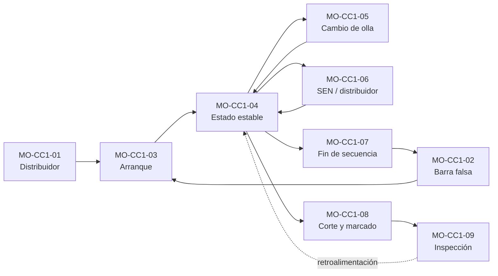

# Manuales de Operación — Colada Continua 1 (CC1, planchón)

| Serie | Versión | Estado | Custodios | Fecha |
|---|---|---|---|---|
| MO-CC1-01 a MO-CC1-09 | 0.1 | **Borrador para validación** | experto-operativo-metalurgia + Gerente Sindicalizado (co-custodio) · dueños de proceso C-06, C-08, C-09 | 2026-09-25 |

> ⚠️ Todos los valores vienen de la ficha técnica **FT-ACE-001** (§4 CC1 y §7 grados). Lo que depende del fabricante o de la planta real está marcado **[Validar con OEM / Ingeniería de Proceso]**; lo que no está en la ficha y se supuso está marcado **[Supuesto]**. **No usar en planta** hasta la validación de Ingeniería de Proceso (C-08), Calidad (C-09), Seguridad (C-16) y la aprobación del Gerente de Acería.

## 1. La máquina en una línea
Máquina **vertical-curva de 1 línea**, radio **9.5 m**, longitud metalúrgica **≈ 32 m**, planchón de **230 mm × 900–1,650 mm**, velocidad **0.8–1.6 m/min (nominal 1.2)**, distribuidor de **45 t** con barra tapón, molde Cu-Ag/Ni de **900 mm**, **14 segmentos**, **10 zonas** de enfriamiento secundario, barra falsa tipo cadena por abajo, oxicorte a **8–11 m**. Producción ≈ **1.3 Mt/año**.

## 2. Índice de manuales
| Código | Proceso crítico | Dueño | Ejecutan | Pasos ★ principales |
|---|---|---|---|---|
| [MO-CC1-01](MO-CC1-01-preparacion-distribuidor.md) | Preparación y precalentamiento del distribuidor | C-06 | S-15, S-13 | Humedad del distribuidor, espacio confinado, prueba de asiento del tapón, encendido de quemadores |
| [MO-CC1-02](MO-CC1-02-insercion-sellado-barra-falsa.md) | Inserción y sellado de la barra falsa | C-06 | S-12, S-14 | LOTO antes de sellar, línea seca, fugas del molde, sellado y chatarra seca, agua de emergencia lista |
| [MO-CC1-03](MO-CC1-03-arranque-colada.md) | Arranque de colada | C-06 | S-12, S-13, S-14 | Zona de exclusión bajo el molde, lanceado, apertura del tapón, paso a nivel automático |
| [MO-CC1-04](MO-CC1-04-colada-estado-estable.md) | Colada en estado estable | C-08 | S-12, S-13, S-14 | Respuesta a sticker y breakout, agua de emergencia ≤ 15 s, agua en el molde |
| [MO-CC1-05](MO-CC1-05-cambio-olla-secuencia.md) | Cambio de olla en secuencia | C-06 | S-13, S-09, S-12 | Olla suspendida, giro de torreta, lanceado, nivel mínimo 700 mm |
| [MO-CC1-06](MO-CC1-06-cambio-sen-y-distribuidor.md) | Cambio de SEN y de distribuidor en caliente (incluye clogging) | C-06 | S-13, S-14, S-12 | Zona roja, ≤ 10 s sin flujo, detención y reanudación, unión |
| [MO-CC1-07](MO-CC1-07-fin-colada-cierre-secuencia.md) | Fin de colada y cierre de secuencia | C-06 | S-12, S-13, S-14 | Cierre a 400 mm, tapado de cola, sin agua sobre acero líquido |
| [MO-CC1-08](MO-CC1-08-corte-marcado-mesa-enfriamiento.md) | Corte, marcado y mesa de enfriamiento | C-06 | S-16, S-17 | Oxicorte seguro, ID = MES, grúa adecuada al peso, apilado |
| [MO-CC1-09](MO-CC1-09-inspeccion-calidad-planchon.md) | Inspección de calidad y disposición de defectos | C-09 | S-18 | Seguridad en pilas y volteador, escarpeo con permiso |

## 3. Flujo de una secuencia

## 4. Figuras de la serie (numeración común)
| Figura | Archivo | Se usa en |
|---|---|---|
| 1 | [`cc1-perfil-maquina.svg`](../../img/cc1-perfil-maquina.svg) — perfil lateral, segmentos, zonas | 02, 04, 05, 07, 08, README |
| 2 | [`cc1-distribuidor.svg`](../../img/cc1-distribuidor.svg) — distribuidor de 45 t y niveles | 01, 03, 05, 06, 07 |
| 3 | [`cc1-molde-nivel.svg`](../../img/cc1-molde-nivel.svg) — molde, agua, SEN, polvo, nivel, BOP | 04, 06 |
| 4 | [`cc1-arranque-barra-falsa.svg`](../../img/cc1-arranque-barra-falsa.svg) — cabeza de barra falsa y secuencia de llenado | 02, 03 |
| 5 | [`cc1-defectos-planchon.svg`](../../img/cc1-defectos-planchon.svg) — mapa de defectos | 09 |

## 5. Valores clave (tarjeta de bolsillo)
| Variable | Valor | Alarma / límite | Fuente |
|---|---|---|---|
| Sobrecalentamiento en distribuidor | 20–30 °C (1.ª colada 25–35 °C); líquidus bajo C ≈ 1,525 °C | < 15 o > 35 °C (1.ª colada: < 20 o > 40 °C) | FT §4; MO-CC1-03/04 |
| Nivel del distribuidor | 900–1,100 mm | Cambio de olla ≥ 700; cierre 400; alarma alta 1,250 | FT §4; MO-CC1-05/07 [Validar niveles de cambio y cierre] |
| Nivel de molde | ± 3 mm | ± 8 mm | FT §4 |
| Velocidad | 0.8–1.6 m/min (nominal 1.2); arranque 0.3; rampa ≤ 0.2 m/min por min | > 1.6 | FT §4; MO-CC1-03 |
| Sticker (BOP) | Baja a 0.3–0.5 m/min, ≥ 30 s, rampa ≤ 0.2 | ≥ 2 por colada → C-08 | MO-CC1-04 |
| Agua de molde | Anchas ≈ 4,200 L/min c/u; angostas ≈ 450 L/min c/u; ΔT 6–9 °C | ΔT > 11 °C o caudal < 90% → 0.8 m/min | FT §4 |
| Agua de emergencia | Entrada automática | ≤ 15 s | FT §4 |
| Precalentamiento del distribuidor | Cara caliente 1,100 ± 50 °C; SEN ≥ 1,000 °C; ≤ 10 min sin quemador | < 1,000 °C: no colar | MO-CC1-01 (mismo criterio en MO-CC2-01) |
| Cambio de olla | Cierre → apertura ≤ 2 min; torreta ≤ 60 s | > 3 min; distribuidor < 700 mm | MO-CC1-05 |
| Oscilación | 120–200 cpm; carrera 4–8 mm; t_N 0.10–0.15 s | — | FT §4; MO-CC1-04 |
| Polvo de molde | 0.3–0.5 kg/t; capa líquida 8–15 mm | < 6 o > 18 mm | FT §4 |
| Enfriamiento secundario | 0.8–1.2 L/kg (bajo C ≈ 1.1; HSLA ≈ 0.85) | Enderezado HSLA ≥ 900 °C | FT §4; MO-CC1-04 |
| SEN / argón | Inmersión 120–160 mm; Ar 3–8 NL/min | Ar > 8 NL/min | FT §4 |
| Corte | 8–11 m ± 15 mm | Planchón máx. ≈ 32.8 t → grúa de 45 t con tenaza (nunca la de 25 t) | FT §4, §6; MO-CC1-08 |

## 6. Controles críticos transversales (★)
1. **Cero humedad**: distribuidor, SEN, molde, cabeza de barra falsa, chatarra, herramientas y lanzas secos (MS-ACE-03).
2. **Zona de exclusión bajo el molde y segmentos 1–3** en arranque, cambios, fin de colada y durante toda la colada salvo autorización de C-06 (MS-ACE-01).
3. **Agua de molde**: agua de emergencia en ≤ 15 s; si no entra, cerrar tapón y olla y evacuar.
4. **Breakout**: tapón → extracción → olla → evacuación → conteo.
5. **Agua en el molde**: cerrar el tapón de inmediato.
6. **Cargas suspendidas** (ollas, distribuidores, planchones): nadie bajo la carga; grúa adecuada al peso (MS-ACE-04).
7. **LOTO** antes de meter manos o herramientas en el molde o intervenir la línea, la mesa o el oxicorte (MS-ACE-02).

## 7. Competencia y certificación
Los pasos ★ de cada manual forman la evaluación práctica de **TD-P07** (evaluador nivel 4, todos los pasos ★ aprobados, vigencia ≤ 24 meses, reevaluación tras incidente o cambio). Las emergencias (sticker, breakout, falla de agua, apagón) se evalúan en simulador o simulacro. Cada manual trae su tabla de horas de teoría y OJT por rol.

## 8. Revisiones cruzadas requeridas
- **experto-seguridad-salud**: visto bueno de las secciones 6 y de los pasos ★ (riesgo físico, NOMs).
- **experto-relaciones-laborales**: los manuales asignan tareas a categorías sindicalizadas (S-09, S-11 a S-18) y fijan requisitos de certificación.
- **experto-documentacion-mejora**: alta en el control documental y en el LMS.
- **Ingeniería de Proceso (C-08), Calidad (C-09), Refractarios (C-15) y OEM**: validación de todos los valores marcados.
