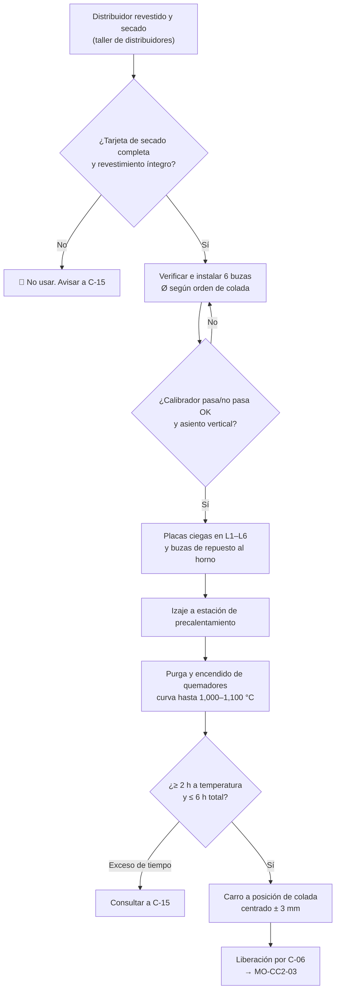

# MO-CC2-01 — Preparación y precalentamiento del distribuidor y las buzas calibradas (CC2)

| Código | Versión | Estado | Área | Dueño del proceso | Elaboró | Revisión técnica | Revisión de seguridad | Aprobó | Fecha | Próxima revisión |
|---|---|---|---|---|---|---|---|---|---|---|
| MO-CC2-01 | 0.1 | Borrador para validación | Colada Continua 2 (palanquilla) | C-06 Supervisor de Colada Continua | sind-servicio-clientes + experto-operativo-metalurgia | experto-operativo-metalurgia | experto-seguridad-salud | Pendiente (Gerente de Acería / Director) | 2026-09-25 | 2027-09-25 |

> **Mensaje clave para el operador:** en la CC2 el acero cae del distribuidor al molde en **chorro abierto** y lo que controla el flujo es el **diámetro de la buza calibrada**. Una buza equivocada, mal asentada o fría echa a perder la línea desde el arranque. Un revestimiento húmedo puede causar una **explosión** al recibir el acero.

## 1. Objetivo y alcance
**Objetivo:** entregar a la plataforma de colada un distribuidor de 30 t **seco, íntegro, precalentado a 1,000–1,100 °C** y con **6 buzas calibradas de ZrO₂ del diámetro correcto (Ø 15–17 mm)**, bien asentadas, cerradas con placa ciega y alineadas con los 6 moldes.

**Alcance:** desde que el distribuidor sale revestido y secado del taller de distribuidores hasta que queda en la posición de colada, listo para abrir la olla (entrada a MO-CC2-03). No incluye el revestimiento en el taller (lo hace S-24 con C-15) ni el cambio de buza en colada (MO-CC2-06).

## 2. Roles y responsabilidades
| Rol | Responsabilidad en este proceso | R/A/C/I |
|---|---|---|
| C-06 Supervisor de Colada Continua (CC2) | Libera el distribuidor para colada; autoriza desviaciones | A |
| S-15 Preparador de Distribuidores | Inspecciona el revestimiento, instala y verifica las buzas, opera el precalentamiento y registra | R |
| S-13 Operador de Plataforma de Colada | Recibe el distribuidor, verifica la alineación de chorro y las placas ciegas, confirma la temperatura | R |
| S-12 Operador de Púlpito de Colada | Confirma en la HMI la tara de las celdas de carga, el diámetro de buza cargado por línea y la hora de apertura prevista | C |
| C-15 Especialista de Refractarios | Dictamina daños del revestimiento y excesos de tiempo de precalentamiento | C |
| C-08 Ingeniero de Proceso de Colada Continua | Define el diámetro de buza por grado y velocidad | C |
| Operador de grúa de CC y producto (50 t) — sin código en CAT-ACE-001 [Validar] | Traslada el distribuidor con señalero | R (izaje) |
| C-16 Especialista de Seguridad e Higiene | Verifica los controles de gas natural, izaje y polvo | I |

## 3. Descripción del proceso
El distribuidor (tundish) reparte el acero de la olla entre las 6 líneas. Tiene una **zona de impacto** al centro (bajo el tubo protector de la olla) con almohadilla y presas bajas que calman el flujo. Las 6 buzas están a **1,250 mm entre ejes [Validar OEM]**; las líneas del centro (L3, L4) reciben el acero más caliente y las de los extremos (L1, L6) el más frío, por eso son las que más riesgo tienen de **buza congelada**.

Cada buza calibrada va sobre un **bloque asiento** y dentro de un **mecanismo de cambio rápido** que permite empujar una buza nueva (precalentada) o una **placa ciega** para cerrar la línea.

**Por qué importa (para aprender):**
- **El diámetro manda.** En colada abierta no hay barra tapón: el caudal depende del área de la buza. Pasar de 16 a 17 mm aumenta el área ≈ 13% y la velocidad de esa línea sube en la misma proporción.
- **La humedad mata.** Un revestimiento, mortero o buza con agua genera vapor al contacto con acero a ≈ 1,530 °C; el vapor se expande más de 1,000 veces y proyecta metal líquido.
- **Frío = buza congelada.** Si la buza está por debajo de ≈ 900 °C, el primer acero se solidifica en su orificio y la línea no arranca, sobre todo en L1 y L6.
- **Centrado = palanquilla cuadrada.** Un chorro desviado golpea una cara del molde, adelgaza la piel de ese lado y produce romboidad y riesgo de breakout.
- **Tiempo sin fuego.** El distribuidor pierde temperatura rápido sin quemadores; por eso se abre la olla ≤ 5 min después de retirarlos.

## 4. Equipos y maquinaria
| Equipo / componente | Función | Especificación clave | Condición para operar (verificación) |
|---|---|---|---|
| Distribuidor (tundish) | Recibir y repartir el acero a 6 líneas | 30 t; nivel de operación 700–850 mm | Tarjeta de secado firmada; sin grietas > 3 mm en el revestimiento de trabajo |
| Revestimiento de trabajo | Cara caliente, protege el permanente | Masa de MgO proyectada, 25–40 mm [Validar con C-15] | Espesor medido en 6 puntos; sin desprendimientos |
| Almohadilla de impacto y presas | Absorber el chorro de la olla y ordenar el flujo | Presas a ± 400 mm del eje de la olla [Validar OEM] | Íntegras, en su posición del plano |
| Bloque asiento (well block) | Soporta la buza | Refractario de alta alúmina [Validar OEM] | Limpio, sin escoria ni grietas |
| Buza calibrada de ZrO₂ | Fija el caudal de cada línea | Ø 15, 16 o 17 mm (según orden de colada) | Calibrador pasa/no pasa ± 0.2 mm; entrada sin astillas |
| Mecanismo de cambio rápido | Cambiar buza o cerrar línea con placa ciega | Empuje ≤ 2 s [Validar OEM] | Carril limpio; placa ciega colocada en las 6 líneas antes del arranque |
| Horno de buzas de repuesto | Tener buzas calientes para cambio rápido | ≥ 900 °C [Validar OEM]; mínimo 6 buzas | Encendido y con 6 buzas listas antes de abrir la olla |
| Estación de precalentamiento | Calentar el revestimiento y las buzas | Quemadores de gas natural con supervisión de flama | Prueba de flama y purga OK; detector de gas operativo |
| Carro del distribuidor | Trasladar, subir/bajar y centrar el distribuidor | Celdas de carga para el peso (nivel) | Traslación, elevación y tara de celdas de carga verificadas |
| Grúa de CC 50 t | Izaje del distribuidor | Doble límite de izaje | Inspección previa al uso; señalero asignado |

## 5. Parámetros de operación
| Parámetro | Unidad | Objetivo | Rango normal | Alarma / límite | Acción si está fuera de rango | Dónde se mide |
|---|---|---|---|---|---|---|
| Diámetro de buza | mm | Según orden de colada | 15–17 | Diferencia > ± 0.2 mm contra el nominal | Cambia la buza; no la instales | Calibrador pasa/no pasa |
| Espesor del revestimiento de trabajo | mm | 30 | 25–40 [Validar] | < 20 mm en cualquier punto | Rechaza el distribuidor; avisa a C-15 | Varilla de medición, 6 puntos |
| Temperatura de la cara caliente | °C | 1,050 | 1,000–1,100 | < 950 °C a la hora de colar | Retrasa la apertura y avisa a C-06 | Termopar / pirómetro, cada 30 min |
| Tiempo a temperatura | h | 2.5 | ≥ 2 [Validar] | Total de precalentamiento > 6 h [Validar] | Consulta a C-15 antes de usarlo | Registro de precalentamiento |
| Temperatura de la buza | °C | ≥ 900 | 900–1,100 [Validar OEM] | < 850 °C | Prolonga el precalentamiento | Pirómetro por abajo de la buza |
| Tiempo sin fuego (quitar quemadores → abrir olla) | min | ≤ 5 | 0–5 [Validar] | > 10 min | Vuelve a precalentar 15 min mínimo | Reloj del púlpito |
| Alineación buza–molde (centro del chorro) | mm | 0 | ± 3 [Validar OEM] | > ± 3 mm | Corrige el centrado del carro | Plomada o láser de alineación |
| Tara de celdas de carga | t | 0.0 | ± 0.2 | > ± 0.5 t | Llama a S-21 Instrumentista | HMI del púlpito |

> ⚠️ **Nota de ingeniería (inconsistencia detectada, [Validar con OEM / Ingeniería de Proceso]).** Por balance de masa, una buza de 15–17 mm con 700–850 mm de nivel entrega ≈ 0.25–0.35 t/min por línea. Eso alcanza para 160 × 160 mm a solo ≈ 1.3–1.8 m/min (o para 130 × 130 mm a ≈ 1.9–2.7 m/min). Para 160 × 160 mm a 2.5–3.5 m/min se requieren ≈ 0.49–0.68 t/min por línea, es decir, buzas de ≈ 20–24 mm. **C-08 debe confirmar la tabla de diámetros de buza contra velocidad y sección antes de usar este manual en planta.**

## 6. Seguridad
### 6.1 Peligros y controles críticos
| Peligro | Consecuencia | Control crítico | Verificación |
|---|---|---|---|
| Humedad en el revestimiento, la buza o el mortero | Explosión vapor–metal al recibir el acero (MS-ACE-03) | Solo se usan distribuidores con curva de secado completa y firmada; buzas guardadas en seco | Tarjeta de secado revisada por S-15 y C-06 |
| Encendido de quemadores de gas natural | Explosión por acumulación de gas | Purga previa, supervisión de flama y detector de gas (MS-ACE-06) | Lista de encendido; prueba del detector al inicio del turno |
| Izaje del distribuidor (30 t de tara y más) | Aplastamiento | Grúa inspeccionada, señalero, nadie bajo la carga (MS-ACE-04) | Permiso de izaje y zona acordonada |
| Superficies a 1,000 °C | Quemaduras graves | EPP aluminizado y distancia; herramientas de mango largo | Observación del supervisor |
| Polvo de refractario (MgO, alúmina, ZrO₂) | Daño respiratorio | Respirador media cara P100 al limpiar pozos | Inspección de EPP |
| Entrada al distribuidor | Atrapamiento, atmósfera pobre o calor | **Prohibido entrar**; si es necesario: espacio confinado MS-ACE-05 con permiso | Permiso de espacio confinado |

### 6.2 EPP obligatorio
Casco con barbiquejo, lentes de seguridad y careta con filtro IR, chamarra y polainas aluminizadas cerca del distribuidor caliente, ropa retardante a la flama (sin sintéticos), guantes de carnaza aluminizados, botas de fundidor sin agujetas con casquillo, protección auditiva y respirador P100 al limpiar refractario (NOM-017-STPS).

### 6.3 Permisos, bloqueos y zonas de exclusión
- Permiso de trabajo en caliente y lista de encendido de quemadores.
- Bloqueo (MS-ACE-02) del carro del distribuidor antes de trabajar bajo él (instalación de buzas y placas).
- Zona de exclusión de 5 m alrededor del distribuidor durante el izaje y mientras el quemador está encendido [Validar con C-16].

## 7. Calidad
| Variable crítica de calidad | Especificación | Método / frecuencia | Registro | Defecto si falla |
|---|---|---|---|---|
| Diámetro de buza por línea | Nominal ± 0.2 mm | Calibrador, 100% de las buzas | Hoja de preparación del distribuidor | Velocidad fuera de rango, nivel de molde inestable, romboidad |
| Alineación del chorro | ± 3 mm del centro del molde | Plomada o láser, 6 líneas | Hoja de preparación | Piel desigual, romboidad, breakout |
| Temperatura del distribuidor | 1,000–1,100 °C | Cada 30 min | Registro de precalentamiento | Buza congelada, caída de sobrecalentamiento |
| Limpieza del revestimiento | Sin escoria ni restos sueltos | Visual, 100% | Hoja de preparación | Inclusiones de escoria y de refractario |

## 8. Procedimiento paso a paso
| # | Paso | Cómo hacerlo (detalle y medición) | Criterio de aceptación | ★ | Rol |
|---|---|---|---|---|---|
| 1 | Revisa la tarjeta del distribuidor | Número, fecha de revestimiento y **curva de secado completa y firmada** | Tarjeta completa; sin tarjeta no se usa | ★ | S-15 |
| 2 | Inspecciona el revestimiento de trabajo | Visual con lámpara; mide el espesor en 6 puntos (fondo, paredes, zona de impacto) | 25–40 mm; sin grietas > 3 mm ni desprendimientos | | S-15 |
| 3 | Verifica la almohadilla de impacto y las presas | Posición según el plano del OEM; sin daños | Íntegras y en su lugar | | S-15 |
| 4 | Limpia los 6 pozos de buza | Aspira o sopla con aire seco; usa respirador P100 | Sin escoria ni restos de mortero | | S-15 |
| 5 | Confirma el diámetro de buza de la orden de colada | Compara la orden con la HMI (S-12 confirma) | Mismo diámetro en papel, HMI y caja de buzas | ★ | S-15, S-12 |
| 6 | Verifica cada buza con calibrador | Pasa/no pasa de ± 0.2 mm; revisa grietas y astillas en la entrada | Pasa el nominal y no pasa el de +0.2 mm | ★ | S-15 |
| 7 | Asienta bloque y buza | Según el OEM (mortero seco o junta); verticalidad con escuadra | Desviación ≤ 1 mm; sin juego | | S-15 |
| 8 | Coloca placas ciegas en L1–L6 | Empuja la placa ciega en el mecanismo de cambio rápido de cada línea | 6 líneas cerradas; mecanismo sin juego | ★ | S-15 |
| 9 | Carga el horno de buzas de repuesto | Mínimo 6 buzas del diámetro de la orden, más 2 placas ciegas | Horno ≥ 900 °C [Validar] | | S-15 |
| 10 | Iza el distribuidor a la estación de precalentamiento | Con señalero; nadie bajo la carga; asienta en los apoyos | Asentado y nivelado | ★ | Operador de grúa de CC, S-15 |
| 11 | Enciende los quemadores | Purga completa, prueba de flama, encendido en fuego bajo | Flama estable; detector de gas sin alarma | ★ | S-15 |
| 12 | Sigue la curva de precalentamiento | Fuego bajo 30 min [Validar], luego alto hasta 1,000–1,100 °C; registra cada 30 min | ≥ 2 h a temperatura; total ≤ 6 h | | S-15 |
| 13 | Mide la temperatura de las buzas | Pirómetro por abajo de cada buza | ≥ 900 °C | 🔎 | S-15 |
| 14 | Verifica el carro del distribuidor | Traslación, elevación y tara de celdas de carga | Tara ± 0.2 t; sin alarmas | | S-13, S-12 |
| 15 | Traslada a la posición de colada | Retira quemadores ≤ 5 min antes de abrir la olla; mueve el carro | Tiempo sin fuego ≤ 5 min | | S-13 |
| 16 | Centra el distribuidor sobre los moldes | Plomada o láser en cada línea | Centro del chorro a ± 3 mm del centro del molde | ★ | S-13 |
| 17 | Registra y pide la liberación | Llena la hoja de preparación; C-06 firma | Hoja completa y firmada | | S-15, C-06 |

## 9. Condiciones anormales y respuesta
| Síntoma / alarma | Causa probable | Acción inmediata | A quién avisar |
|---|---|---|---|
| Tarjeta de secado incompleta o revestimiento húmedo | Secado interrumpido | 🛑 No uses el distribuidor; devuélvelo al taller | C-06, C-15 |
| Buza fuera de calibre o astillada | Lote defectuoso, golpe | Cámbiala; separa el lote | C-06, C-08 |
| La flama se apaga o alarma de gas | Falla de suministro o del quemador | Cierra el gas; purga antes de reencender; evacúa si hay alarma de gas | C-06, C-16 |
| No alcanza 1,000 °C en el tiempo | Quemador sucio, presión baja | Revisa el quemador; retrasa la apertura | C-06, mantenimiento |
| Precalentamiento > 6 h (olla retrasada) | Retraso de EAF / LF | Baja a fuego de mantenimiento [Validar]; consulta a C-15 | C-06, C-15 |
| El carro no centra (> ± 3 mm) | Rieles, topes o carro desajustados | No abras la olla; corrige con mantenimiento | C-06, C-11 |
| Mecanismo de cambio rápido duro o atorado | Carril sucio o deformado | Limpia o cambia el mecanismo antes de colar | C-06 |

## 10. Registros
- Hoja de preparación del distribuidor (número, diámetro de buza por línea, verificación con calibrador, alineación, firmas).
- Registro de precalentamiento (hora de encendido, temperaturas cada 30 min, tiempo total).
- Tarjeta de secado del taller de distribuidores.
- Lista de encendido de quemadores y prueba del detector de gas.

## 11. Competencia requerida y certificación
| Rol | Nivel requerido (1–4) | Formación teórica (h) | OJT supervisado (h / eventos) | Evaluación (pasos ★) | Vigencia |
|---|---|---|---|---|---|
| S-15 Preparador de Distribuidores | 3 | 16 | 40 h / 10 preparaciones completas | Pasos 1, 5, 6, 8, 10, 11 | 24 meses (TD-P07) |
| S-13 Operador de Plataforma | 3 | 8 | 16 h / 5 centrados | Paso 16 | 24 meses (TD-P07) |
| C-06 Supervisor | 4 | 8 | 5 liberaciones acompañadas | Revisión de la hoja y del paso 1 | 24 meses |

**Lista corta de verificación de pasos ★ (TD-P07):**
- [ ] Rechaza un distribuidor sin tarjeta de secado completa (explica el riesgo de explosión).
- [ ] Verifica el diámetro de buza contra la orden y con calibrador pasa/no pasa.
- [ ] Coloca y comprueba las 6 placas ciegas.
- [ ] Dirige el izaje sin nadie bajo la carga.
- [ ] Enciende quemadores con purga y prueba de flama.
- [ ] Centra el chorro a ± 3 mm en las 6 líneas.

## 12. Referencias
- `00-ficha-tecnica-acería.md` (FT-ACE-001) §5 CC2 y §7 grados · `00-catalogo-procesos-y-roles.md` (CAT-ACE-001).
- MS-ACE-02 (LOTO), MS-ACE-03 (agua–metal), MS-ACE-04 (izaje), MS-ACE-05 (espacios confinados), MS-ACE-06 (gases).
- NOM-017-STPS-2008 (EPP), NOM-006-STPS-2014 (manejo de materiales), NOM-033-STPS-2015 (espacios confinados), NOM-015-STPS-2001 (condiciones térmicas), NOM-010-STPS-2014 (contaminantes) — verificar con Jurídico Laboral / SSO.
- Manual del OEM de la CC2: distribuidor, mecanismo de cambio rápido de buza y quemadores [por referenciar].
- TD-P07 Certificación de tareas críticas (`04-processes/process-manual.md`).

## 13. Control de cambios
| Versión | Fecha | Cambio | Elaboró |
|---|---|---|---|
| 0.1 | 2026-09-25 | Creación del borrador para validación | sind-servicio-clientes + experto-operativo-metalurgia |
