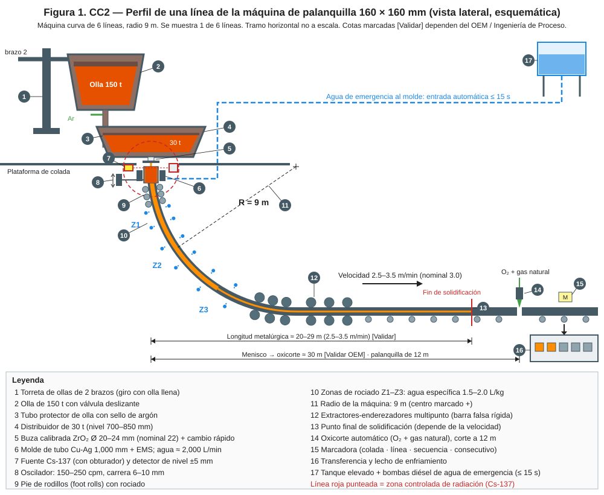
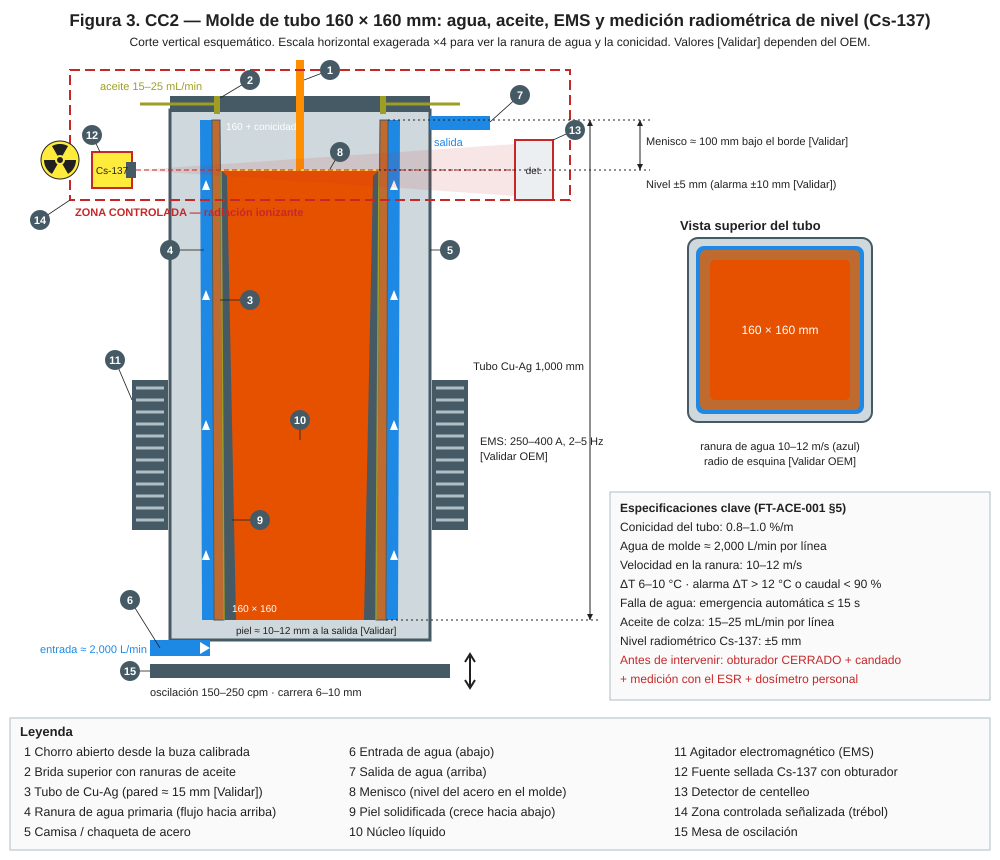
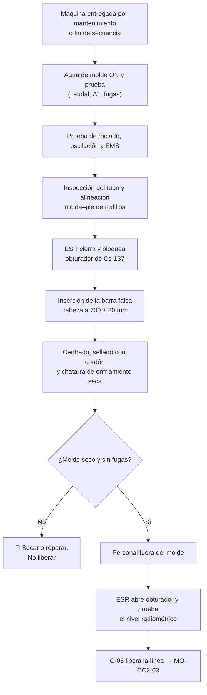

# MO-CC2-02 — Preparación de máquina: inserción y sellado de la barra falsa rígida (6 líneas)

| Código | Versión | Estado | Área | Dueño del proceso | Elaboró | Revisión técnica | Revisión de seguridad | Aprobó | Fecha | Próxima revisión |
|---|---|---|---|---|---|---|---|---|---|---|
| MO-CC2-02 | 0.1 | Borrador para validación | Colada Continua 2 (palanquilla) | C-06 Supervisor de Colada Continua | sind-servicio-clientes + experto-operativo-metalurgia | experto-operativo-metalurgia — visto bueno con observaciones, 2026-09-25 | experto-seguridad-salud — visto bueno con observaciones, 2026-09-25 | Pendiente (Gerente de Acería / Director) | 2026-09-25 | 2027-09-25 |

> **Mensaje clave para el operador:** para sellar la cabeza de la barra falsa metes las manos y herramientas **dentro del molde**, justo donde pasa el haz de la **fuente de Cs-137**. El obturador de la fuente se cierra y se bloquea **antes** de empezar y se abre **solo** cuando ya no hay nadie en el molde. Un sello húmedo o mal hecho provoca una fuga o una explosión en el arranque.

## 1. Objetivo y alcance
**Objetivo:** dejar las 6 líneas listas para arrancar: molde, agua, rociado, oscilación y EMS probados; barra falsa rígida insertada con la cabeza a la altura correcta dentro del tubo, **sellada, seca y con chatarra de enfriamiento**; control de nivel radiométrico listo.

**Alcance:** desde la entrega de la máquina por mantenimiento (o el fin de la secuencia anterior, MO-CC2-07) hasta la liberación de las 6 líneas para el arranque (MO-CC2-03). Incluye la reinserción de la barra falsa en **una** línea para rearrancarla durante una secuencia.

## 2. Roles y responsabilidades
| Rol | Responsabilidad en este proceso | R/A/C/I |
|---|---|---|
| C-06 Supervisor de Colada Continua | Libera las líneas; firma la lista de verificación de máquina | A |
| S-12 Operador de Púlpito de Colada | Opera la inserción de la barra falsa desde la HMI; hace las pruebas de agua, rociado, oscilación y EMS | R |
| S-14 Ayudante de Colada (molde y línea) | Inspecciona el molde, centra la cabeza, sella y coloca la chatarra de enfriamiento | R |
| C-16 Especialista de Seguridad e Higiene de Acería, en función de Encargado de Seguridad Radiológica (ESR) designado en la licencia de la CNSNS (CAT-ACE-001) | Cierra/abre y bloquea el obturador de la fuente de Cs-137; mide la tasa de dosis | R (radiación) |
| S-25 Mecánico de Taller de Moldes | Atiende hallazgos de desgaste, conicidad y alineación (MM-CC-01, MM-CC-02) | C |
| S-21 Instrumentista | Atiende fallas del medidor de nivel, caudalímetros y termopares | C |
| C-16 Especialista de Seguridad e Higiene | Verifica el procedimiento de radiación y LOTO | I |

## 3. Descripción del proceso
La CC2 usa **barra falsa rígida** (una por línea): es una barra curva, con el radio de la máquina (9 m), que se guarda arriba del camino de rodillos. Los extractores-enderezadores la empujan en reversa por la línea hasta que su **cabeza** entra al molde por abajo. La cabeza tiene una forma de "gancho" que se ancla en el acero al solidificar. El hueco entre la cabeza y el tubo se sella con **cordón de fibra cerámica** y se cubre con **chatarra de enfriamiento limpia y seca** para que el primer acero solidifique rápido sin fugarse.

El punto de bloqueo del obturador (punto 7) está en la figura de puntos de bloqueo de la CC de MS-ACE-02 / MS-ACE-07: `../../img/ms-loto-puntos-cc.svg`.

**Por qué importa (para aprender):**
- **La cabeza es el "tapón" del molde.** Si el sello falla, el primer acero escurre por el hueco y sale bajo el molde: es una fuga de arranque.
- **La chatarra de enfriamiento** absorbe calor del primer acero para que solidifique rápido sobre la cabeza y se "enganche" en ella. Si trae humedad, óxido o aceite, genera gas o vapor.
- **El haz del Cs-137 cruza el molde** a la altura del menisco. Con el obturador abierto, quien mete la cabeza o las manos al molde recibe dosis. Cerrado y medido por el ESR, la zona queda en niveles de fondo.
- **Alineación de 0.5 mm.** Si el molde y el pie de rodillos no están en línea, la piel recién formada se dobla al salir del molde y aparecen romboidad y grietas en la diagonal.

## 4. Equipos y maquinaria
| Equipo / componente | Función | Especificación clave | Condición para operar (verificación) |
|---|---|---|---|
| Barra falsa rígida (6) | Cerrar el fondo del molde y extraer la primera palanquilla | Curva de radio 9 m; cabeza para 160 × 160 mm (otra para 130 × 130 mm) | Cabeza sin deformación; holgura uniforme de 2–4 mm por lado [Validar OEM] |
| Extractores-enderezadores multipunto | Insertar y extraer la barra falsa; enderezar la palanquilla | Presión de rodillos en modo barra falsa [Validar OEM] | Sin alarmas hidráulicas; rodillos girando libres |
| Molde de tubo Cu-Ag | Formar la piel | 1,000 mm; conicidad 0.8–1.0%/m | Sin rayas > 0.5 mm, sin cobre expuesto por desgaste del recubrimiento [Validar], sin deformación |
| Agua primaria de molde | Enfriar el tubo | ≈ 2,000 L/min por línea; 10–12 m/s en la ranura | Caudal ≥ 1,800 L/min en prueba; sin fugas al interior |
| Enfriamiento secundario | Rociar la palanquilla | Pie de rodillos + 3 zonas; 1.5–2.0 L/kg | Prueba de boquillas ≥ 95% abiertas [Validar] |
| Oscilador | Evitar que la piel se pegue | 150–250 cpm; carrera 6–10 mm | Prueba en vacío sin ruido ni golpes; carrera medida |
| EMS | Agitar el acero en el molde | 250–400 A; 2–5 Hz [Validar OEM] | Prueba de energizado; agua de enfriamiento del EMS OK |
| Medidor de nivel radiométrico (Cs-137) | Medir el nivel del acero | ± 5 mm | Obturador operativo; lectura de "molde vacío" correcta |
| Lubricación con aceite | Película entre piel y cobre | Aceite de colza 15–25 mL/min por línea | Líneas cebadas; salida por todas las ranuras |
| Plantilla de alineación (gálibo) | Verificar alineación molde–pie de rodillos | ± 0.5 mm [Validar OEM] | Plantilla certificada |

## 5. Parámetros de operación
| Parámetro | Unidad | Objetivo | Rango normal | Alarma / límite | Acción si está fuera de rango | Dónde se mide |
|---|---|---|---|---|---|---|
| Caudal de agua de molde (prueba) | L/min | 2,000 | 1,800–2,200 | < 1,800 (90%) | No liberes la línea; avisa a mantenimiento | HMI, caudalímetro por línea |
| Presión de agua de molde | bar | [Validar OEM] | [Validar OEM] | Baja presión | Revisa bombas y filtros | HMI |
| Fuga de agua al interior del molde | — | Cero | Cero | Cualquier gota o humedad | 🛑 No liberes; cambio de molde (MM-CC-01) | Visual con lámpara, 5 min con agua a caudal pleno |
| Posición de la cabeza de la barra falsa | mm bajo el borde del tubo | 700 | 680–720 [Validar OEM] | Fuera de rango | Reajusta con la HMI en modo lento | Cinta o calibrador de profundidad |
| Velocidad de inserción | m/min | 2.0 | ≤ 3.0; últimos 2 m a ≤ 0.5 [Validar OEM] | Golpe en el tope | Detén y revisa la cabeza | HMI |
| Holgura cabeza–tubo | mm/lado | 3 | 2–4 [Validar OEM] | Holgura desigual > 2 mm entre lados | Centra la cabeza | Galgas |
| Chatarra de enfriamiento | kg por línea | 2 | 1.5–3 [Validar] | Húmeda, oxidada o con aceite | Cámbiala por chatarra seca y limpia | Báscula y visual |
| Alineación molde–pie de rodillos | mm | 0 | ± 0.5 [Validar OEM] | > ± 0.5 | No liberes; avisa a S-25 | Plantilla de alineación |
| Boquillas de rociado abiertas | % | 100 | ≥ 95 [Validar] | < 95% o una boquilla tapada en esquina | Destapa o cambia boquillas | Prueba visual con agua |
| Tasa de dosis en el punto de trabajo con obturador cerrado | µSv/h | Fondo natural (≈ 0.1–0.3) | < 2 × fondo [Validar con el ESR] (MS-ACE-07) | ≥ 2 × fondo | 🛑 Nadie entra al molde; aléjate ≥ 3 m; el ESR investiga | Medidor portátil del ESR |

## 6. Seguridad
### 6.1 Peligros y controles críticos
| Peligro | Consecuencia | Control crítico | Verificación |
|---|---|---|---|
| Radiación ionizante del Cs-137 | Exposición por encima del límite | ★ **Obturador cerrado por el ESR (C-16), bloqueado con su candado y tarjeta, y tasa de dosis < 2 × fondo medida en el punto de trabajo antes de meter manos al molde** (MS-ACE-07; NOM-012-STPS-2012; licencia CNSNS) | Registro del ESR con hora y lectura; dosímetro personal puesto |
| Agua o humedad en el molde | Explosión al arrancar | Prueba de fugas de 5 min; chatarra y cordón secos; molde tapado hasta el arranque | Lista de verificación firmada por S-14 y C-06 |
| Movimiento de la barra falsa u oscilación con personas en la línea | Atrapamiento, amputación | LOTO de extractores y oscilador antes de trabajar en el molde (MS-ACE-02) | Candados personales en el tablero |
| Trabajo en la plataforma junto a moldes abiertos | Caída a distinto nivel | Tapas en moldes sin uso; barandales (MS-ACE-10) | Inspección de plataforma |
| Fibra cerámica | Irritación respiratoria | Respirador P100 y guantes | Inspección de EPP |

### 6.2 EPP obligatorio
Casco, lentes, guantes de carnaza, ropa retardante a la flama, botas de seguridad, protección auditiva, respirador P100 al manipular fibra cerámica y **dosímetro personal** (TLD u OSL) para S-14, S-12 y todo el personal ocupacionalmente expuesto (POE) que trabaje en la zona controlada.

### 6.3 Permisos, bloqueos y zonas de exclusión
- **Zona controlada de radiación** alrededor de la parte alta de los moldes, señalizada con el trébol; solo entra personal POE o acompañado por el ESR.
- Candado del ESR en el obturador de cada línea donde se trabaja + candado personal de S-14.
- LOTO de extractores-enderezadores y oscilador durante el sellado.
- Nadie en la fosa ni bajo la plataforma mientras la barra falsa se mueve.

## 7. Calidad
| Variable crítica de calidad | Especificación | Método / frecuencia | Registro | Defecto si falla |
|---|---|---|---|---|
| Estado del tubo | Sin rayas > 0.5 mm, sin deformación; conicidad 0.8–1.0%/m | Visual cada secuencia; conicidad por S-25 según MM-CC-01 | Lista de máquina; registro del taller | Romboidad, grietas de esquina, breakout |
| Alineación molde–pie de rodillos | ± 0.5 mm | Plantilla, cada cambio de molde y cada 7 días [Validar] | Lista de máquina | Romboidad, grietas en la diagonal |
| Patrón de rociado | ≥ 95% boquillas OK; sin boquillas tapadas en esquinas | Prueba visual cada secuencia | Lista de máquina | Grietas internas, romboidad |
| Oscilación | Frecuencia y carrera de la tabla | Prueba en vacío cada secuencia | HMI | Marcas de oscilación profundas |

## 8. Procedimiento paso a paso
| # | Paso | Cómo hacerlo (detalle y medición) | Criterio de aceptación | ★ | Rol |
|---|---|---|---|---|---|
| 1 | Recibe la máquina | Revisa la bitácora de mantenimiento y los permisos cerrados | Sin permisos abiertos en la CC2 | | C-06 |
| 2 | Arranca el agua de molde en las 6 líneas | Caudal pleno ≥ 5 min | 1,800–2,200 L/min por línea | ★ | S-12 |
| 3 | Revisa fugas dentro de cada molde | Lámpara; busca gotas, humedad o vapor | Molde totalmente seco | ★ | S-14 |
| 4 | Prueba el rociado secundario | Zona por zona, a caudal de arranque | ≥ 95% boquillas OK; esquinas cubiertas | 🔎 | S-12, S-14 |
| 5 | Prueba oscilación y EMS | Oscilación en vacío a 200 cpm; EMS energizado 1 min | Sin alarmas; carrera 6–10 mm | | S-12 |
| 6 | Inspecciona el tubo | Visual de rayas, desgaste y deformación | Sin defectos fuera del criterio de la sección 7 | 🔎 | S-14 |
| 7 | Verifica la alineación molde–pie de rodillos | Plantilla de alineación | ± 0.5 mm | 🔎 | S-14, S-25 |
| 8 | Pide al ESR el cierre del obturador | Permiso de trabajo con firma del ESR; el ESR cierra, pone candado y tarjeta y mide en el punto de trabajo y a 1 m | Lectura < 2 × fondo; registro firmado en el permiso | ★ | C-16 (ESR), S-14 |
| 9 | Aplica LOTO al oscilador | Candado personal | Prueba de arranque sin movimiento | ★ | S-14 |
| 10 | Inserta la barra falsa | HMI en modo inserción ≤ 3 m/min; los últimos 2 m a ≤ 0.5 m/min | La cabeza para sin golpe | | S-12 |
| 11 | Ajusta la altura de la cabeza | Mide desde el borde del tubo | 700 ± 20 mm bajo el borde | ★ | S-14, S-12 |
| 12 | Aplica LOTO a los extractores de esa línea | Candado personal | Sin movimiento posible | ★ | S-14 |
| 13 | Centra la cabeza | Galgas en los 4 lados | Holgura 2–4 mm, uniforme | | S-14 |
| 14 | Sella con cordón de fibra cerámica | Empaca el cordón en todo el perímetro, apretado con espátula | Sin huecos visibles con lámpara | ★ | S-14 |
| 15 | Coloca la chatarra de enfriamiento | 1.5–3 kg de recortes limpios, **secos y sin aceite**, en capa de 30–50 mm | Cubre toda la cabeza | ★ | S-14 |
| 16 | Tapa el molde | Tapa metálica seca hasta el arranque | Tapa colocada | | S-14 |
| 17 | Repite los pasos 8–16 en las 6 líneas | Una línea a la vez | 6 líneas selladas | | S-14 |
| 18 | Ceba el aceite | Verifica salida por todas las ranuras; deja en espera | Salida uniforme | | S-14 |
| 19 | Retira LOTO y confirma que no hay nadie en los moldes | Conteo de personal; retira tu candado | Plataforma y fosa despejadas | ★ | S-14, C-06 |
| 20 | Pide al ESR la apertura del obturador | El ESR retira su candado y abre; S-12 revisa la lectura de "molde vacío" | Nivel indica vacío, sin alarma | ★ | C-16 (ESR), S-12 |
| 21 | Libera las líneas | C-06 firma la lista de verificación | 6 líneas en "listo para colar" en la HMI | | C-06 |

## 9. Condiciones anormales y respuesta
| Síntoma / alarma | Causa probable | Acción inmediata | A quién avisar |
|---|---|---|---|
| Gotas o humedad dentro del molde | Fuga en el tubo, sello o camisa | 🛑 No liberes la línea; cambio de molde | C-06, S-25 |
| Caudal < 1,800 L/min en la prueba | Filtro tapado, válvula, bomba | No liberes; revisa con mantenimiento | C-06, C-12 |
| La barra falsa no avanza o se atora | Rodillo desalineado, cabeza dañada, restos en la línea | Detén; LOTO; inspecciona la línea con mantenimiento | C-06, C-11 |
| La cabeza no queda centrada | Cabeza deformada, guía desalineada | Cambia la cabeza; revisa alineación | C-06, S-25 |
| El obturador no cierra o la dosis es ≥ 2 × fondo | Falla mecánica del portafuente | 🛑 Nadie entra al molde; aléjate ≥ 3 m y acordona; el ESR (C-16) atiende y reporta a la CNSNS si aplica (MS-ACE-07) | C-16 (ESR), C-06 |
| El nivel no marca "molde vacío" con el obturador abierto | Falla del detector o de la fuente | No liberes la línea; S-21 con el ESR | C-06, S-21, C-16 (ESR) |
| Chatarra húmeda u oxidada | Almacenamiento inadecuado | Usa otra caja seca; seca en estufa | C-06 |

## 10. Registros
- Lista de verificación de máquina por línea (agua, fugas, rociado, oscilación, EMS, tubo, alineación, altura de la cabeza, sellado).
- Registro del ESR: cierre y apertura del obturador por línea, hora, lectura de tasa de dosis, firmas.
- Registro de dosimetría personal (lo lleva el ESR).
- Registro de LOTO.

## 11. Competencia requerida y certificación
| Rol | Nivel requerido (1–4) | Formación teórica (h) | OJT supervisado (h / eventos) | Evaluación (pasos ★) | Vigencia |
|---|---|---|---|---|---|
| S-14 Ayudante de Colada | 3 | 16 + 8 de protección radiológica (POE) | 40 h / 12 sellados de línea | Pasos 3, 8, 9, 11, 12, 14, 15, 19 | 24 meses (TD-P07); protección radiológica (POE) 12 meses (MS-ACE-07) |
| S-12 Operador de Púlpito | 3 | 16 + 8 de protección radiológica | 24 h / 6 preparaciones de máquina | Pasos 2, 11, 20 | 24 meses (TD-P07); protección radiológica 12 meses (MS-ACE-07) |
| C-16 (función de ESR) | 4 | Según la CNSNS | — | Acreditación CNSNS vigente; pasos 8 y 20 | Según la licencia CNSNS; evaluación interna 12 meses |

**Lista corta de verificación de pasos ★ (TD-P07):**
- [ ] Nunca mete las manos al molde sin el obturador cerrado, bloqueado y medido por el ESR.
- [ ] Verifica que el molde esté seco después de 5 min con agua a caudal pleno.
- [ ] Aplica LOTO a oscilador y extractores antes de sellar.
- [ ] Deja la cabeza a 700 ± 20 mm, centrada, sellada y con chatarra seca.
- [ ] Confirma que no hay nadie en el molde antes de pedir la apertura del obturador.

## 12. Referencias
- FT-ACE-001 §5 (CC2) · CAT-ACE-001 · MO-CC2-03 · MM-CC-01, MM-CC-02, MM-CC-04.
- MS-ACE-02 (LOTO), MS-ACE-03 (agua–metal), **MS-ACE-07 (fuentes radiactivas)**, MS-ACE-10 (alturas).
- NOM-012-STPS-2012 (radiaciones ionizantes), Reglamento General de Seguridad Radiológica y licencia de la CNSNS de la fuente, NOM-004-STPS-1999 (maquinaria), NOM-017-STPS-2008 (EPP) — verificar con Jurídico Laboral / SSO.
- Manual del OEM: barra falsa rígida, extractores-enderezadores, medidor radiométrico [por referenciar].

## 13. Control de cambios
| Versión | Fecha | Cambio | Elaboró |
|---|---|---|---|
| 0.1 | 2026-09-25 | Creación del borrador para validación | sind-servicio-clientes + experto-operativo-metalurgia |
| 0.1 | 2026-09-25 | Revisión técnica cruzada contra FT-ACE-001 v0.3: el ESR se cita con su código (C-16, CAT-ACE-001) en roles, columna Rol y competencias. | experto-operativo-metalurgia |
