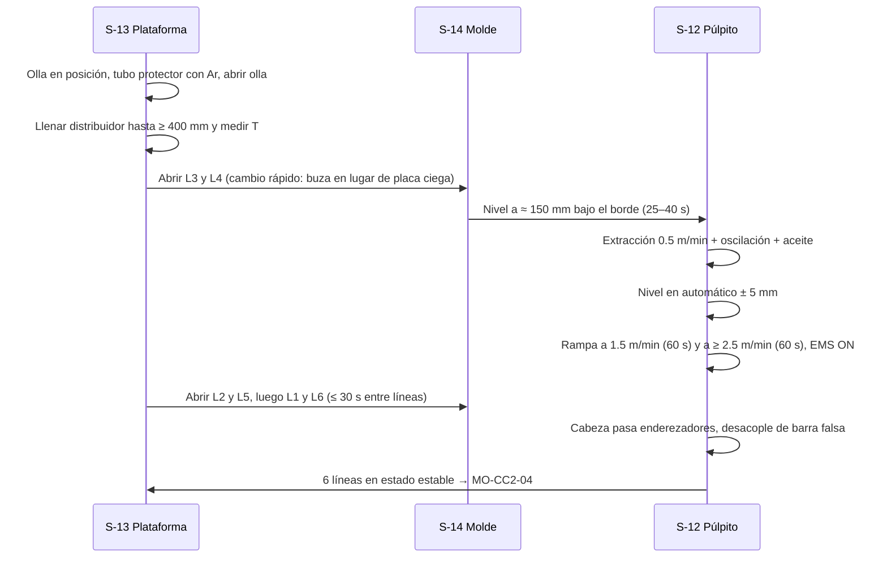

# MO-CC2-03 — Arranque de colada por línea (apertura de olla y distribuidor, llenado de moldes y rampa de velocidad)

| Código | Versión | Estado | Área | Dueño del proceso | Elaboró | Revisión técnica | Revisión de seguridad | Aprobó | Fecha | Próxima revisión |
|---|---|---|---|---|---|---|---|---|---|---|
| MO-CC2-03 | 0.1 | Borrador para validación | Colada Continua 2 (palanquilla) | C-06 Supervisor de Colada Continua | sind-servicio-clientes + experto-operativo-metalurgia | experto-operativo-metalurgia — visto bueno con observaciones, 2026-09-25 | experto-seguridad-salud — visto bueno con observaciones, 2026-09-25 | Pendiente (Gerente de Acería / Director) | 2026-09-25 | 2027-09-25 |

> **Mensaje clave para el operador:** el arranque es el momento de **mayor riesgo** de la colada: metal líquido cayendo, moldes llenándose en segundos y gente cerca. Abre las líneas **una por una, en el orden del manual**, arranca la extracción **en el nivel correcto** y sube la velocidad **con la rampa**, no de golpe. Si una línea no arranca bien, **ciérrala**: una línea perdida se recupera; una persona no.

## 1. Objetivo y alcance
**Objetivo:** arrancar las 6 líneas con un sobrecalentamiento de **20–35 °C (1.ª colada de secuencia: 25–40 °C)**, llevar cada línea de 0 a **≥ 2.5 m/min** con la rampa definida y el nivel de molde en control automático (**± 5 mm**), sin fugas, breakouts ni desbordamientos.

**Alcance:** desde la llegada de la primera olla a la torreta hasta que las 6 líneas están en estado estable y la barra falsa está estacionada (entrada a MO-CC2-04). Incluye el rearranque de una línea durante la secuencia.

## 2. Roles y responsabilidades
| Rol | Responsabilidad en este proceso | R/A/C/I |
|---|---|---|
| C-06 Supervisor de Colada Continua | Da la orden de arranque; decide cerrar o rearrancar una línea | A |
| S-12 Operador de Púlpito de Colada | Controla extracción, rampa, nivel automático, agua secundaria, EMS; vigila alarmas | R |
| S-13 Operador de Plataforma de Colada | Abre la olla, controla el nivel del distribuidor, mide temperatura, abre las buzas (cambio rápido) | R |
| S-14 Ayudante de Colada | Vigila el llenado de cada molde, aceite y chorro; cierra la línea si hay fuga | R |
| S-09 Operador de Grúa de Colada | Coloca la olla en la torreta | R (izaje) |
| S-11 Muestrero | Toma muestra química del distribuidor en la primera colada | R |
| S-16 Operador de Corte y Marcado | Corta la cabeza (despunte) y marca las palanquillas de arranque | R |
| C-08 Ingeniero de Proceso | Define temperaturas y tabla de rampa; analiza arranques fallidos | C |

## 3. Descripción del proceso
Con los 6 moldes sellados (MO-CC2-02) y el distribuidor caliente y centrado (MO-CC2-01), se abre la olla y se llena el distribuidor. Cuando el acero cubre las buzas con altura suficiente, se abren las líneas **del centro hacia los extremos**: **L3 y L4 → L2 y L5 → L1 y L6** [Validar con OEM / Ingeniería de Proceso]. Las líneas del centro reciben primero el acero caliente; las de los extremos esperan menos de 3 min con la buza cubierta para no congelarse.

En cada línea: el molde se llena en **25–40 s**; al llegar el nivel a **≈ 150 mm bajo el borde** arranca la extracción a **0.5 m/min** con oscilación; el control de nivel pasa a **automático** y la velocidad sube con la **rampa** hasta **≥ 2.5 m/min**. En colada abierta **la velocidad sigue al nivel**: el control radiométrico ajusta la velocidad de extracción para mantener el menisco en su punto.

**Por qué importa (para aprender):**
- **Llenado rápido, extracción a tiempo.** El molde de 160 × 160 mm se llena en 25–40 s. Si arrancas tarde, desborda; si arrancas temprano, la cabeza no se ancla y la piel se rompe.
- **La rampa protege la piel.** En los primeros minutos la piel es delgada; subir de golpe a 3.0 m/min la saca del molde sin espesor suficiente y provoca breakout.
- **Centro primero.** L3 y L4 están junto a la zona de impacto y reciben acero caliente; L1 y L6 son las más frías. Abrirlas en ≤ 3 min evita que su buza se congele.
- **La primera palanquilla ("A")** tiene la cabeza, la chatarra de enfriamiento y el acero del arranque: se despunta y se inspecciona aparte.

## 4. Equipos y maquinaria
| Equipo / componente | Función | Especificación clave | Condición para operar (verificación) |
|---|---|---|---|
| Torreta de ollas (2 brazos) | Llevar la olla a posición de colada | Pesaje de olla | Sin alarmas; olla asentada |
| Válvula deslizante de la olla + tubo protector | Abrir la olla y proteger el chorro | Tubo con sello de argón | Tubo precalentado y alineado; argón fluyendo |
| Distribuidor de 30 t | Repartir el acero | Nivel 700–850 mm | Liberado por MO-CC2-01 |
| Buzas calibradas + cambio rápido | Abrir cada línea | 160 × 160 mm: Ø 20–24 mm (nominal 22); 130 × 130 mm: Ø 15–17 mm; placas ciegas en las 6 líneas | Liberado por MO-CC2-01 |
| Moldes, barra falsa, oscilación, EMS | Formar la palanquilla | Ver MO-CC2-02 | 6 líneas "listo para colar" |
| Medidor de nivel radiométrico | Controlar el menisco | ± 5 mm | Obturador abierto por el ESR; lectura "vacío" OK |
| Lanza de temperatura (termopar desechable) | Medir la temperatura del distribuidor | Lectura en °C | Lanza y puntas disponibles |
| Sistema de agua de emergencia | Enfriar moldes si falla el agua | Entrada automática ≤ 15 s | Tanque lleno y bombas diésel en automático (verificado en el turno) |
| Lanza de oxígeno | Abrir la olla si no abre libre | Lanza ≥ 3 m [Validar] | Lanza, manguera y válvula revisadas |

## 5. Parámetros de operación
| Parámetro | Unidad | Objetivo | Rango normal | Alarma / límite | Acción si está fuera de rango | Dónde se mide |
|---|---|---|---|---|---|---|
| Sobrecalentamiento en el distribuidor (primera medición a los 3–5 min) | °C | 1.ª colada de secuencia: 32; siguientes: 28 | 1.ª colada: 25–40; siguientes: 20–35 [Validar] | < 20; > 40 (1.ª colada) o > 35 (siguientes) | < 15 °C: 🛑 riesgo de buza congelada, avisa a C-06 para decidir; > 40 °C: arranca con velocidad al mínimo de la rampa y avisa a C-08 | Lanza de temperatura |
| Temperatura de líquidus (varilla C 0.25–0.35%) | °C | ≈ 1,505 [Validar: se calcula por colada] | — | — | — | Hoja de colada (LF) |
| Nivel del distribuidor para abrir la primera línea | mm | 400 | 350–450 [Validar] | < 300 mm | Espera a que suba | Celdas de carga / HMI |
| Tiempo entre aperturas de líneas | s | 20 | 15–30 [Validar] | L1 o L6 esperando > 3 min con buza cubierta | Abre de inmediato o prepara cambio de buza | Reloj HMI |
| Aceite al arranque | mL/min | 25 | 20–25 | Sin flujo | No abras la línea sin aceite | Rotámetro por línea |
| Tiempo de llenado del molde | s | 30 | 25–40 | < 20 s (chorro grande) o > 50 s (buza parcialmente tapada) | Informa a C-06; revisa diámetro de buza | HMI (curva de nivel) |
| Nivel para iniciar la extracción | mm bajo el borde | 150 | 140–160 [Validar OEM] | < 110 mm (riesgo de desbordamiento) | Arranca de inmediato; si > 60 mm bajo el borde y subiendo sin control: cierra la línea | Radiométrico |
| Velocidad de arranque | m/min | 0.5 | 0.4–0.6 [Validar OEM] | — | — | HMI |
| Rampa de velocidad | m/min por min | 1.0 | 0.5 → 1.5 m/min en 60 s; 1.5 → 2.5 m/min en 60 s [Validar OEM] | Rampa más rápida | No aceleres manualmente | HMI |
| Nivel de molde en automático | mm | Menisco a 100 bajo el borde [Validar] | ± 5 | ± 10 (alarma) | Revisa chorro y buza; si no controla en 1 min: velocidad fija y avisa | Radiométrico |
| EMS | A / Hz | 300 A / 3 Hz [Validar OEM] | 250–400 A; 2–5 Hz | Disparo del EMS | Sigue colando; marca palanquillas; avisa a S-20 | HMI |
| Tiempo hasta 6 líneas en estado estable | min | 8 | ≤ 10 [Validar] | > 15 min | C-06 revisa el arranque | Reloj HMI |
| Despunte (cabeza) | mm | 1,000 | 800–1,200 [Validar] | — | — | Cortadora |

## 6. Seguridad
### 6.1 Peligros y controles críticos
| Peligro | Consecuencia | Control crítico | Verificación |
|---|---|---|---|
| Salpicaduras y derrame de metal líquido al abrir olla y buzas | Quemaduras graves o fatalidad | ★ Zona de exclusión de arranque: solo S-12, S-13, S-14 y C-06 en la roja, S-13 y S-14 con EPP aluminizado seco; nadie frente al chorro (MS-ACE-01) | Barrera física y conteo de personal antes de abrir la olla |
| Agua en contacto con el acero (molde con fuga, chatarra húmeda) | Explosión | Lista de MO-CC2-02 firmada; molde seco | Firma de C-06 antes del arranque |
| Breakout o fuga en la cabeza al arrancar | Metal líquido en la fosa | **Nadie en la fosa ni bajo la plataforma** durante el arranque | Acordonado y vigía |
| Desbordamiento del molde | Metal líquido sobre la plataforma | Arranque de extracción al nivel correcto; cierre inmediato de la línea con placa ciega | Observación de S-14 en cada línea |
| Falla de agua de molde | Perforación del tubo y explosión | Agua de emergencia en ≤ 15 s; paro de colada (MS-ACE-09) | Prueba semanal de la torre y las bombas diésel (MM-CC-03) |
| Lanceo de oxígeno para abrir la olla | Quemaduras, retroceso de llama | Solo S-13 certificado, careta, lanza ≥ 3 m, sin grasa en guantes (MS-ACE-06) | Certificación vigente |
| Radiación (Cs-137) | Exposición | No se interviene dentro del molde con el obturador abierto; cualquier intervención pasa por el ESR (MS-ACE-07) | Dosímetro puesto; zona señalizada |

### 6.2 EPP obligatorio
Chamarra, pantalón o polainas aluminizados, careta con visor dorado o filtro IR, casco con barbiquejo, guantes aluminizados, botas de fundidor sin agujetas, ropa retardante a la flama, protección auditiva y dosímetro personal (POE).

### 6.3 Permisos, bloqueos y zonas de exclusión
- Zona de exclusión de arranque (MS-ACE-01): zona roja ≤ 10 m del molde, del distribuidor y de la torreta, y todo lo que está bajo la máquina; zona amarilla 10–20 m; solo S-12, S-13, S-14 y C-06 en la roja [Supuesto — validar con el estudio de la nave, C-16]; fosa y área bajo la plataforma cerradas hasta que las 6 líneas estén estables y C-06 libere.
- Aviso por radio y sirena ≥ 30 s antes de abrir la olla (MS-ACE-01).
- Rutas de escape despejadas en la plataforma.

## 7. Calidad
| Variable crítica de calidad | Especificación | Método / frecuencia | Registro | Defecto si falla |
|---|---|---|---|---|
| Sobrecalentamiento | 20–35 °C (1.ª colada: 25–40 °C) | 3–5 min después de abrir la olla y a los 10 min | Hoja de colada CC2 | Buza congelada (bajo); rechupe, grietas y breakout (alto) |
| Química del distribuidor (primera colada) | Según grado (FT-ACE-001 §7) | 1 muestra a los 5–10 min | LIMS | Colada fuera de grado |
| Estabilidad del nivel | ± 5 mm después de la rampa | HMI continuo | Tendencias | Pinholes, inclusiones, marcas de oscilación |
| Palanquillas de arranque | Marcadas "A" | La primera palanquilla de cada línea | Sistema de rastreo | Mezcla de palanquillas de arranque con producto normal |

## 8. Procedimiento paso a paso
| # | Paso | Cómo hacerlo (detalle y medición) | Criterio de aceptación | ★ | Rol |
|---|---|---|---|---|---|
| 1 | Verifica condiciones de arranque | Distribuidor ≥ 1,000 °C; 6 líneas listas; agua de molde a caudal; tanque de emergencia lleno y bombas diésel en automático | Todo en verde en la lista de arranque | ★ | S-12, C-06 |
| 2 | Establece la zona de exclusión | Conteo de personal; nadie a ≤ 10 m del molde, distribuidor y torreta salvo S-12, S-13, S-14 y C-06; fosa cerrada; aviso por radio y sirena ≥ 30 s (MS-ACE-01) | Solo personal autorizado en la zona roja | ★ | C-06, S-13 |
| 3 | Recibe la olla en la torreta | S-09 la coloca; verifica peso y temperatura de llegada | Temperatura de llegada según hoja del LF | | S-09, S-13 |
| 4 | Gira la olla a posición de colada | Torreta a posición; nadie bajo la olla | Olla sobre el distribuidor | ★ | S-13 |
| 5 | Coloca el tubo protector con argón | Alinea y abre el argón | Sello sin fugas visibles | | S-13 |
| 6 | Abre la olla | Válvula deslizante al 100%; si no abre libre en 30 s, lancea con O₂ según el procedimiento | Chorro estable al distribuidor | ★ | S-13 |
| 7 | Llena el distribuidor | Controla la apertura de la olla | Nivel ≥ 400 mm | | S-13 |
| 8 | Mide la temperatura | Lanza a 3–5 min; a 300 mm de profundidad [Validar] lejos de la zona de impacto | Sobrecalentamiento 20–35 °C (1.ª colada: 25–40 °C) | 🔎 | S-13 |
| 9 | Arranca el aceite en L3 y L4 | 25 mL/min; verifica flujo en el rotámetro | Flujo en todas las ranuras | | S-14 |
| 10 | Abre L3 y L4 | Empuja la buza en lugar de la placa ciega; verifica chorro centrado y compacto | Chorro centrado, sin abrirse | ★ | S-13, S-14 |
| 11 | Arranca la extracción en cada línea | Al llegar el nivel a ≈ 150 mm bajo el borde: 0.5 m/min con oscilación | Nivel estable; sin fuga en la cabeza | ★ | S-12 |
| 12 | Pasa el nivel a automático | Cuando el nivel esté a ± 10 mm del punto de ajuste | ± 5 mm en ≤ 60 s | | S-12 |
| 13 | Aplica la rampa | Automática: 1.5 m/min en 60 s, luego ≥ 2.5 m/min en 60 s | Sin alarmas de nivel | ★ | S-12 |
| 14 | Enciende el EMS | Al pasar 1.5 m/min [Validar]; 250–400 A, 2–5 Hz | EMS en servicio | | S-12 |
| 15 | Abre L2 y L5, y después L1 y L6 | Repite los pasos 9–14; 15–30 s entre líneas | Las 6 líneas abiertas en ≤ 3 min | ★ | S-13, S-14, S-12 |
| 16 | Completa el nivel del distribuidor | Sube a 700–850 mm y agrega la capa de cubierta | Nivel de operación; acero cubierto | | S-13 |
| 17 | Vigila la cabeza en los enderezadores | La barra falsa se desacopla y sube a su estacionamiento | Desacople sin golpe; barra estacionada | | S-12 |
| 18 | Despunta y marca | Corta la cabeza (≈ 1,000 mm) a chatarra; marca la primera palanquilla con "A" | Despunte fuera; palanquilla "A" identificada | 🔎 | S-16 |
| 19 | Toma la muestra química | Muestra del distribuidor a los 5–10 min (primera colada) | Muestra enviada al laboratorio | | S-11 |
| 20 | Libera la zona de exclusión | Cuando las 6 líneas estén estables | Fosa abierta solo con autorización | | C-06 |
| 21 | Registra | Hora de apertura, temperaturas, tiempo de llenado por línea, anomalías | Hoja completa | | S-12, S-13 |

## 9. Condiciones anormales y respuesta
| Síntoma / alarma | Causa probable | Acción inmediata | A quién avisar |
|---|---|---|---|
| La olla no abre libre | Arena de sello sinterizada | Lancea con O₂ (S-13 certificado); si en 3 min no abre, regresa la olla | C-06, S-08 |
| Buza no fluye al abrir (L1 o L6) | Buza fría o congelada | Cambio rápido por una buza de repuesto caliente; si falla, cierra con placa ciega | C-06 |
| Chorro abierto o en "abanico" | Buza dañada, parcialmente tapada o desalineada | Cambia la buza (MO-CC2-06) | C-06 |
| Nivel sube sin control o molde a punto de desbordar | Extracción tarde, buza grande | Aumenta la velocidad; si llega a 60 mm bajo el borde: 🛑 cierra la línea con placa ciega | C-06 |
| Fuga en la cabeza de la barra falsa (acero bajo el molde) | Sello mal hecho, cabeza descentrada | 🛑 Cierra la línea; evacúa bajo la plataforma | C-06 |
| Breakout al arranque (debajo del molde) | Rampa rápida, poco aceite, nivel bajo | 🛑 Cierra la línea, detén su extracción, mantén el agua de molde y la secundaria; evacúa bajo la máquina y a ≥ 20 m (MS-ACE-09); el ESR inspecciona el contenedor de Cs-137 | C-06, C-04, C-16 (ESR) |
| Falla de agua de molde o apagón | Bombas, energía | 🛑 Verifica la entrada del agua de emergencia en ≤ 15 s; cierra la olla, cierra las 6 líneas con placa ciega, evacúa la plataforma de molde a ≥ 10 m (MS-ACE-09); no reintroduzcas agua a un molde sobrecalentado sin autorización de C-06/C-08 | C-04, C-06 |
| Sobrecalentamiento < 15 °C | Olla fría, retraso | C-06 decide arrancar menos líneas o regresar la olla | C-06, C-07 |
| La barra falsa no se desacopla | Cabeza mal sellada, deformada | Detén la línea antes del estacionamiento; mantenimiento libera | C-06, C-11 |
| Rearranque de una línea en secuencia | Línea cerrada por falla | Con autorización de C-06: reinserta la barra falsa (MO-CC2-02) y repite los pasos 9–14 en esa línea [Validar OEM] | C-06 |

## 10. Registros
- Hoja de arranque CC2: hora de apertura de olla y de cada línea, temperaturas, tiempo de llenado, velocidad alcanzada, anomalías.
- Registro de despuntes y palanquillas "A".
- Registro de lanceo de olla (si aplica).
- Tendencias de nivel y velocidad por línea (se guardan en el sistema de nivel 2).

## 11. Competencia requerida y certificación
| Rol | Nivel requerido (1–4) | Formación teórica (h) | OJT supervisado (h / eventos) | Evaluación (pasos ★) | Vigencia |
|---|---|---|---|---|---|
| S-12 Operador de Púlpito | 3 | 24 (incluye simulador de arranque [Validar]) | 10 arranques acompañados | Pasos 1, 11, 13, 15 | 24 meses (TD-P07) |
| S-13 Operador de Plataforma | 3 | 24 | 10 arranques; 3 lanceos de olla | Pasos 2, 4, 6, 10, 15 | 24 meses (TD-P07) |
| S-14 Ayudante de Colada | 3 | 16 | 10 arranques | Pasos 10, 15 | 24 meses (TD-P07) |
| C-06 Supervisor | 4 | 16 | 5 arranques dirigidos | Pasos 1, 2 y decisión de cierre | 24 meses |

**Lista corta de verificación de pasos ★ (TD-P07):**
- [ ] Verifica condiciones de arranque, incluido el agua de emergencia.
- [ ] Establece y confirma la zona de exclusión y la fosa vacía.
- [ ] Abre las líneas en el orden correcto y con chorro centrado.
- [ ] Arranca la extracción en el nivel correcto y respeta la rampa.
- [ ] Cierra una línea con placa ciega ante desbordamiento, fuga o breakout.

## 12. Referencias
- FT-ACE-001 §3 (LF), §5 (CC2), §7 (grados) · CAT-ACE-001 · MO-CC2-01, MO-CC2-02, MO-CC2-04, MO-CC2-06.
- MS-ACE-01 (metal líquido), MS-ACE-03, MS-ACE-06, MS-ACE-07, MS-ACE-09 (emergencias).
- NOM-017-STPS-2008, NOM-015-STPS-2001, NOM-012-STPS-2012 — verificar con Jurídico Laboral / SSO.
- Manual del OEM: secuencia de arranque, tabla de rampa y lazo de nivel [por referenciar].

## 13. Control de cambios
| Versión | Fecha | Cambio | Elaboró |
|---|---|---|---|
| 0.1 | 2026-09-25 | Creación del borrador para validación | sind-servicio-clientes + experto-operativo-metalurgia |
| 0.1 | 2026-09-25 | Revisión técnica cruzada contra FT-ACE-001 v0.3: sobrecalentamiento de la 1.ª colada de secuencia fijado en 25–40 °C (objetivo 32 °C, +5 °C sobre el rango normal, mismo criterio que CC1) y ESR citado como C-16. | experto-operativo-metalurgia |
