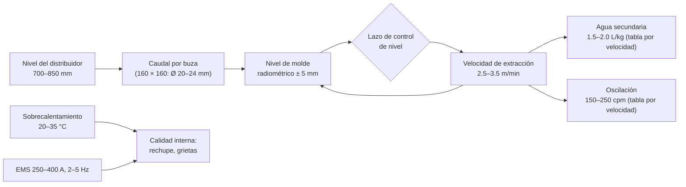

# MO-CC2-04 — Colada en estado estable: nivel de molde, aceite, EMS, velocidad y enfriamiento

| Código | Versión | Estado | Área | Dueño del proceso | Elaboró | Revisión técnica | Revisión de seguridad | Aprobó | Fecha | Próxima revisión |
|---|---|---|---|---|---|---|---|---|---|---|
| MO-CC2-04 | 0.1 | Borrador para validación | Colada Continua 2 (palanquilla) | C-08 Ingeniero de Proceso de Colada Continua | sind-servicio-clientes + experto-operativo-metalurgia | experto-operativo-metalurgia — visto bueno con observaciones, 2026-09-25 | experto-seguridad-salud | Pendiente (Gerente de Acería / Director) | 2026-09-25 | 2027-09-25 |

> **Mensaje clave para el operador:** en estado estable cuidas **cinco variables por línea**: **nivel de molde (± 5 mm), aceite (15–25 mL/min), agua de molde (caudal y ΔT), velocidad (2.5–3.5 m/min) y agua secundaria (1.5–2.0 L/kg)**, más **dos del distribuidor**: **nivel (700–850 mm) y sobrecalentamiento (20–35 °C)**. Si una sale de rango, actúa según la tabla. Si falla el agua de molde, **es emergencia**.

## 1. Objetivo y alcance
**Objetivo:** mantener las 6 líneas produciendo palanquilla de 160 × 160 mm dentro de especificación, sin breakouts, con los parámetros de la ficha técnica FT-ACE-001 §5.

**Alcance:** desde que las 6 líneas están estables (fin de MO-CC2-03) hasta el cambio de olla (MO-CC2-05), el cambio de buza o cierre de línea (MO-CC2-06) o el fin de colada (MO-CC2-07). Incluye la respuesta a condiciones anormales en colada.

## 2. Roles y responsabilidades
| Rol | Responsabilidad en este proceso | R/A/C/I |
|---|---|---|
| C-08 Ingeniero de Proceso de Colada Continua | Dueño de parámetros y tablas (rampa, oscilación, rociado, buzas); analiza desviaciones | A |
| C-06 Supervisor de Colada Continua | Dirige el turno; decide cerrar líneas y bajar velocidad | A (turno) |
| S-12 Operador de Púlpito de Colada | Vigila en la HMI nivel, velocidad, agua, EMS y alarmas; ajusta dentro de rangos | R |
| S-13 Operador de Plataforma de Colada | Controla el nivel y la temperatura del distribuidor y la capa de cubierta | R |
| S-14 Ayudante de Colada | Rondas en moldes y línea: chorro, aceite, rociado, estado de la palanquilla | R |
| S-11 Muestrero | Toma muestras químicas del distribuidor | R |
| C-09 Metalurgista de Producto | Recibe las desviaciones que afectan calidad | I |
| C-16 (función de ESR) | Autoriza cualquier intervención en la zona controlada del molde | C |

## 3. Descripción del proceso
En colada abierta **no hay barra tapón**: el caudal de cada línea lo fija la **buza calibrada** y la **altura del acero en el distribuidor**. El control radiométrico de nivel mide el menisco y **ajusta la velocidad de extracción** para mantenerlo en su punto (≈ 100 mm bajo el borde [Validar]). Por eso:
- Si el nivel del distribuidor **baja**, baja el caudal y **baja la velocidad** de todas las líneas.
- Si una buza **se erosiona**, su línea **acelera**; si **se tapa**, su línea **frena**.
- La velocidad es una **consecuencia**: vigílala como síntoma del estado de la buza.

El aceite forma una película entre la piel y el cobre; el **EMS** agita el acero para mejorar el centro (menos porosidad y rechupe); el agua de molde saca el calor para formar la piel (≈ 10–12 mm a la salida [Validar]); el rociado termina la solidificación antes del corte.

**Por qué importa (para aprender):**
- **El nivel de molde es la variable reina.** Cada vez que el menisco sube o baja más de 5 mm, el aceite y la piel se alteran: aparecen marcas de oscilación profundas, pinholes e inclusiones.
- **El aceite** se quema en el menisco y deja una película de carbón que evita que la piel se pegue al cobre. Poco aceite: pegado y breakout. Mucho o húmedo: gases, pinholes.
- **El agua de molde** saca el calor que forma la piel (≈ 10–12 mm a la salida). Un ΔT alto indica poco caudal o incrustación: el cobre se calienta, se deforma y la palanquilla sale rómbica.
- **El sobrecalentamiento alto** alarga el núcleo líquido y agranda el rechupe central; el **EMS** mueve el líquido, rompe las columnas de cristales y mejora el centro.
- **La velocidad es un síntoma.** Si una línea cambia de velocidad sola, su buza cambió (erosión o taponamiento).

## 4. Equipos y maquinaria
| Equipo / componente | Función | Especificación clave | Condición para operar (verificación) |
|---|---|---|---|
| Medidor radiométrico Cs-137 (6) | Nivel de molde | ± 5 mm | Sin alarma de detector; obturador abierto |
| Extractores-enderezadores | Velocidad de colada y enderezado | 2.5–3.5 m/min | Sin alarmas de presión ni de motor |
| Agua de molde | Formar la piel | ≈ 2,000 L/min por línea; ΔT 6–10 °C | Caudal ≥ 90%; ΔT ≤ 12 °C |
| Agua de emergencia | Respaldo de agua de molde | ≤ 15 s | Tanque lleno; bombas diésel en automático |
| Rociado secundario | Solidificar | Pie de rodillos + Z1–Z3; 1.5–2.0 L/kg | Caudales por zona según tabla |
| Aceite | Lubricar | 15–25 mL/min por línea | Tanque con nivel para la secuencia |
| EMS | Agitar | 250–400 A; 2–5 Hz [Validar OEM] | Sin disparo; agua de enfriamiento del EMS OK |
| Oscilador | Despegar la piel | 150–250 cpm; carrera 6–10 mm | Frecuencia siguiendo la velocidad |
| Pirómetro a la salida de enderezadores | Temperatura de enderezado | ≥ 950 °C [Validar] | Calibrado |

## 5. Parámetros de operación
| Parámetro | Unidad | Objetivo | Rango normal | Alarma / límite | Acción si está fuera de rango | Dónde se mide |
|---|---|---|---|---|---|---|
| Sobrecalentamiento | °C | 28 | 20–35 | < 20 o > 35 | < 20: avisa a C-06 y al LF (próxima olla más caliente); < 15: prepara buzas de repuesto de L1/L6. > 35: baja el nivel del distribuidor hacia 700 mm para bajar velocidad, aumenta rociado según tabla y avisa a C-08; > 45: 🛑 C-06 decide cerrar líneas | Lanza, cada 15 min y a la mitad de la olla |
| Nivel del distribuidor | mm | 775 | 700–850 | < 600 (alarma) / > 870 | < 600: revisa la olla; < 450: 🛑 cierra L1 y L6 [Validar]; > 870: cierra un poco la olla | Celdas de carga / HMI |
| Nivel de molde | mm | Punto de ajuste | ± 5 | ± 10 (alarma) | Revisa chorro y buza; si oscila > ± 10 mm por > 1 min: velocidad fija y cambia la buza | Radiométrico |
| Velocidad de colada | m/min | 3.0 | 2.5–3.5 | < 2.3 o > 3.5 [Validar] | < 2.3: buza tapándose → cambio (MO-CC2-06); > 3.5: buza erosionada → cambio; nunca pases el máximo de la tabla | HMI |
| Aceite | mL/min | 20 | 15–25 | < 12 o sin flujo | Revisa bomba y líneas; sin flujo > 2 min: baja a 2.0 m/min y avisa [Validar] | Rotámetro por línea |
| Caudal de agua de molde | L/min | 2,000 | 1,800–2,200 | < 1,800 (90%) | Revisa filtro y válvula; < 1,600 (80%) [Validar]: 🛑 cierra la línea | HMI |
| ΔT de agua de molde | °C | 8 | 6–10 | > 12 | Revisa caudal e incrustación; > 15 °C [Validar]: 🛑 cierra la línea | HMI |
| Velocidad del agua en la ranura | m/s | 11 | 10–12 | < 10 | Revisa caudal y estado de la camisa | Cálculo HMI |
| Agua específica secundaria | L/kg | 1.75 | 1.5–2.0 | < 1.4 o > 2.1 | Revisa bombas, zona y boquillas; ≈ 880–1,170 L/min por línea a 3.0 m/min | HMI (tabla por velocidad) |
| Distribución por zona (pie / Z1 / Z2 / Z3) | % del total | 35 / 30 / 20 / 15 | [Validar OEM] | Zona sin caudal | Revisa boquillas de esa zona | HMI |
| Oscilación | cpm / mm | 200 cpm a 3.0 m/min; carrera 8 mm | 150–250 cpm; 6–10 mm | Fuera de la tabla | Revisa el lazo del oscilador | HMI |
| Tiempo de deslizamiento negativo | s | 0.12 | 0.10–0.15 [Validar] | Fuera de rango | C-08 ajusta la tabla | Cálculo HMI |
| EMS | A / Hz | 300 / 3 | 250–400 / 2–5 [Validar OEM] | Disparo o corriente < 200 A | Sigue colando; marca las palanquillas "E" y avisa a S-20 | HMI |
| Temperatura de enderezado (superficie) | °C | 1,000 | ≥ 950 [Validar] | < 900 (zona de baja ductilidad) | Baja el rociado de Z3 según tabla; avisa a C-08 | Pirómetro |

**Producción de referencia:** a 3.0 m/min cada línea produce ≈ 0.58 t/min (≈ 35 t/h). Con 6 líneas la capacidad de diseño es ≈ 3.4 t/min (≈ 1.7 Mt/año, con holgura sobre el plan de 0.9 Mt/año): una olla de 150 t dura ≈ 44 min. La máquina opera por campañas y **ajusta la velocidad o el número de líneas a la cadencia de ollas** de los EAF; esa decisión es de C-06 con C-04.

**Buza y velocidad [Validar con OEM]:** en 160 × 160 mm la buza nominal es de **22 mm** (≈ 0.57 t/min por línea con 0.8 m de nivel ≈ 3.0 m/min); el rango es 20–24 mm (≈ 2.4–3.5 m/min). En 130 × 130 mm, 15–17 mm. La tabla completa está en MO-CC2-01, sección 5.

**Química para colada abierta [Validar con C-07/C-08]:** acero calmado al Si-Mn con **Al soluble ≤ 0.005%** y relación **Mn/Si ≥ 3**, para que los óxidos sean líquidos y **no tapen la buza**. Un acero con Al alto tapa las buzas en minutos.

## 6. Seguridad
### 6.1 Peligros y controles críticos
| Peligro | Consecuencia | Control crítico | Verificación |
|---|---|---|---|
| Breakout (fuga de acero bajo el molde) | Metal líquido en la línea y la fosa, incendio, explosión con agua | Nivel y aceite en rango; cierre inmediato de la línea; **nadie bajo la plataforma ni en la fosa sin autorización** (MS-ACE-09) | Rondas; tendencias; acceso a la fosa controlado |
| Falla del agua de molde | Perforación del tubo; explosión | Agua de emergencia en **≤ 15 s**; cierre de olla y líneas | Prueba semanal (MM-CC-03); alarma probada |
| Radiación Cs-137 | Exposición | No intervenir dentro del molde con obturador abierto; ESR para cualquier intervención (MS-ACE-07) | Dosímetro; registro del ESR |
| Salpicaduras en el molde (chorro abierto) | Quemaduras | Careta y EPP aluminizado en rondas; no asomarse al molde | Observación |
| Calor radiante y trabajo de 12 h | Estrés térmico | Hidratación, pausas y rotación (MS-ACE-08) | Programa de hidratación |
| Vapor en la cámara de rociado | Quemaduras, baja visibilidad | Puertas cerradas; extractor de vapor en servicio | Ronda |

### 6.2 EPP obligatorio
Casco, careta con filtro IR, chamarra aluminizada en la plataforma, ropa retardante a la flama, guantes aluminizados, botas de fundidor, protección auditiva y dosímetro personal (POE).

### 6.3 Permisos, bloqueos y zonas de exclusión
- Zona controlada de radiación en la parte alta de los moldes (señalizada).
- Fosa y áreas bajo la plataforma: acceso solo con autorización de C-06 y línea en condición segura.
- Cualquier trabajo en una línea detenida con las otras colando: LOTO de esa línea (MS-ACE-02) y permiso.

## 7. Calidad
| Variable crítica de calidad | Especificación | Método / frecuencia | Registro | Defecto si falla |
|---|---|---|---|---|
| Nivel de molde | ± 5 mm | Continuo | Tendencias por línea | Pinholes, inclusiones, marcas profundas |
| Sobrecalentamiento | 20–35 °C | Cada 15 min | Hoja de colada | Rechupe y porosidad central (alto); buza congelada (bajo) |
| Aceite | 15–25 mL/min | Cada ronda (1 h) | Hoja de rondas | Pegado, breakout (bajo); pinholes (alto) |
| EMS en servicio | 250–400 A; 2–5 Hz | Continuo | HMI | Porosidad y rechupe central |
| Romboidad | ΔD ≤ 6 mm | 1 palanquilla por línea por colada (MO-CC2-09) | Registro de inspección | Grietas en la diagonal, rechazo en laminación |
| Química | Grado (FT-ACE-001 §7); CE ≤ 0.55 en varilla | 1 muestra por colada | LIMS | Colada fuera de grado |

## 8. Procedimiento paso a paso
| # | Paso | Cómo hacerlo (detalle y medición) | Criterio de aceptación | ★ | Rol |
|---|---|---|---|---|---|
| 1 | Recibe el turno en la HMI | Revisa alarmas activas, velocidad y nivel por línea, estado del agua de emergencia | Entrega firmada con pendientes | | S-12 |
| 2 | Verifica el agua de emergencia | Nivel del tanque y bombas diésel en automático | Todo en verde | ★ | S-12 |
| 3 | Vigila el nivel de molde de las 6 líneas | Continuo; atiende toda alarma de ± 10 mm | ± 5 mm | ★ | S-12 |
| 4 | Vigila agua de molde | Caudal y ΔT por línea | ≥ 1,800 L/min; ΔT 6–10 °C | ★ | S-12 |
| 5 | Mide la temperatura del distribuidor | Cada 15 min y a la mitad de cada olla | 20–35 °C de sobrecalentamiento | 🔎 | S-13 |
| 6 | Controla el nivel del distribuidor | Ajusta la apertura de la olla | 700–850 mm | | S-13 |
| 7 | Mantiene la capa de cubierta | Agrega polvo cubridor donde se vea acero descubierto | Sin acero expuesto | | S-13 |
| 8 | Haz la ronda de moldes (cada 1 h) | Por línea: forma del chorro, aceite en rotámetro, salpicaduras, EMS | Chorro compacto y centrado; aceite 15–25 mL/min | 🔎 | S-14 |
| 9 | Haz la ronda de línea (cada 2 h) | Desde el pasillo seguro: rociado, forma de la palanquilla, ruidos de rodillos | Rociado uniforme; palanquilla recta | 🔎 | S-14 |
| 10 | Compara la velocidad entre líneas | Diferencia > 0.4 m/min entre líneas indica buza tapada o erosionada | Tendencia estable | | S-12 |
| 11 | Toma muestra química | 1 por colada del distribuidor | Enviada y resultado recibido | | S-11 |
| 12 | Registra | Hoja de colada: temperaturas, niveles, velocidades, alarmas y acciones | Registro completo por colada | | S-12, S-13 |
| 13 | Responde a condiciones anormales | Según la sección 9; en falla de agua o breakout actúa de inmediato | Respuesta en el tiempo definido | ★ | S-12, S-13, S-14 |

## 9. Condiciones anormales y respuesta
| Síntoma / alarma | Causa probable | Acción inmediata | A quién avisar |
|---|---|---|---|
| **Breakout** (acero saliendo bajo el molde, alarma de fuego o chispas en la cámara) | Pegado por falta de aceite, nivel inestable, piel delgada, romboidad severa | 🛑 Cierra la línea con placa ciega (o tapón), detén su extracción, **mantén el agua de molde y la secundaria**, evacúa bajo la máquina y a ≥ 20 m (MS-ACE-09). No cortes el agua ni entres a la cámara de rociado sin LOTO. Después, el ESR inspecciona el contenedor de Cs-137 de esa línea | C-06, C-04, C-16 (ESR) |
| **Pérdida de nivel** (lectura errática o sin señal) | Falla del detector o de la fuente, salpicadura sobre el portafuente | Pasa a velocidad fija y control visual solo si C-06 lo autoriza; si no se recupera en 5 min [Validar], cierra la línea. **No toques el portafuente**: ESR | C-06, S-21, C-16 (ESR) |
| Nivel sube sin control | Buza erosionada o quebrada | Sube la velocidad al máximo; si no alcanza: cambio de buza o 🛑 cierre de línea antes del desbordamiento | C-06 |
| Nivel baja, velocidad < 2.3 m/min | Buza tapándose (Al alto, acero frío) | Cambio de buza (MO-CC2-06); avisa al LF si es por química | C-06, C-07 |
| **Falla de agua de molde** (caudal < 80%, pérdida de presión o apagón) | Bomba, válvula, energía | 🛑 Confirma entrada del agua de emergencia en **≤ 15 s**; si no entra: cierra de inmediato la olla y las 6 líneas; evacúa la plataforma de molde a ≥ 10 m (MS-ACE-09). No reintroduzcas agua a un molde sobrecalentado sin autorización de C-06/C-08 | C-04, C-06, mantenimiento |
| ΔT > 12 °C en una línea | Caudal bajo, incrustación, tubo deformado | Revisa caudal; si ΔT > 15 °C [Validar]: 🛑 cierra la línea | C-06, S-25 |
| **Falla del EMS** | Disparo eléctrico o de agua del EMS | Sigue colando; marca las palanquillas "E" desde la hora del disparo; C-09 decide | C-06, S-20, C-09 |
| **Desalineación** (chorro fuera de centro, palanquilla con romboidad creciente) | Distribuidor movido, buza inclinada, pie de rodillos | Centra el distribuidor; si es la buza, cámbiala; si persiste, avisa a S-25 | C-06, S-25 |
| **Palanquilla doblada o atorada** en enderezadores o camino | Enderezado frío, rodillo trabado, corte fallido | Detén esa línea: cierra la buza, para la extracción; LOTO para liberar; nadie entre rodillos en movimiento | C-06, C-11 |
| Sin aceite en una línea | Bomba, línea tapada | Baja la velocidad a 2.0 m/min [Validar]; si > 5 min sin aceite: cierra la línea | C-06 |
| Sobrecalentamiento > 45 °C | Olla muy caliente | C-06 decide cerrar líneas extremas o reducir el nivel del distribuidor; aumenta vigilancia de breakout | C-06, C-08 |
| Nivel del distribuidor < 450 mm | Olla terminándose, olla nueva retrasada | 🛑 Cierra L1 y L6; si sigue bajando: cierra L2 y L5 | C-06 |

## 10. Registros
- Hoja de colada CC2 (por colada): temperaturas, nivel del distribuidor, velocidades, aceite, agua, EMS, alarmas y acciones.
- Hoja de rondas de moldes y de línea.
- Tendencias automáticas del sistema de nivel 2 (nivel, velocidad, agua, ΔT).
- Reporte de incidente para todo breakout, falla de agua o cierre de línea (MS-ACE-09).

## 11. Competencia requerida y certificación
| Rol | Nivel requerido (1–4) | Formación teórica (h) | OJT supervisado (h / eventos) | Evaluación (pasos ★) | Vigencia |
|---|---|---|---|---|---|
| S-12 Operador de Púlpito | 3 | 32 (proceso, lazos de control, alarmas, simulador de breakout y de falla de agua [Validar]) | 160 h / 20 coladas | Pasos 2, 3, 4, 13 (simulacro de falla de agua ≤ 15 s y de breakout) | 24 meses (TD-P07) |
| S-13 Operador de Plataforma | 3 | 24 | 120 h / 20 coladas | Pasos 5, 13 | 24 meses (TD-P07) |
| S-14 Ayudante de Colada | 3 | 16 | 120 h / 20 coladas | Pasos 8, 9, 13 | 24 meses (TD-P07) |
| C-06 Supervisor | 4 | 24 | 10 turnos acompañados | Dirección de simulacros | 24 meses |

**Lista corta de verificación de pasos ★ (TD-P07):**
- [ ] Explica cómo el nivel del distribuidor y la buza fijan la velocidad en colada abierta.
- [ ] Responde a una alarma de nivel de molde de ± 10 mm.
- [ ] Ejecuta el simulacro de falla de agua: verifica la entrada de emergencia en ≤ 15 s y cierra olla y líneas.
- [ ] Ejecuta el simulacro de breakout: cierra la línea y evacúa.
- [ ] Identifica en rondas un chorro abierto, falta de aceite y rociado tapado.

## 12. Referencias
- FT-ACE-001 §3, §5 y §7 · CAT-ACE-001 · MO-CC2-03, MO-CC2-05, MO-CC2-06, MO-CC2-07, MO-CC2-09.
- MS-ACE-01, MS-ACE-03, MS-ACE-07, MS-ACE-08, MS-ACE-09 · MM-CC-01, MM-CC-03, MM-CC-04.
- NOM-012-STPS-2012, NOM-015-STPS-2001, NOM-017-STPS-2008, NOM-011-STPS-2001 (ruido) — verificar con Jurídico Laboral / SSO.
- Manual del OEM: lazo de nivel, tablas de oscilación y rociado, EMS [por referenciar].

## 13. Control de cambios
| Versión | Fecha | Cambio | Elaboró |
|---|---|---|---|
| 0.1 | 2026-09-25 | Creación del borrador para validación | sind-servicio-clientes + experto-operativo-metalurgia |
| 0.1 | 2026-09-25 | Revisión técnica cruzada contra FT-ACE-001 v0.3: ESR citado como C-16. Al soluble ≤ 0.005% y Mn/Si ≥ 3 coherentes con MO-LF-01 y MO-EAF-07 (propuesta de agregarlos a la ficha). | experto-operativo-metalurgia |
