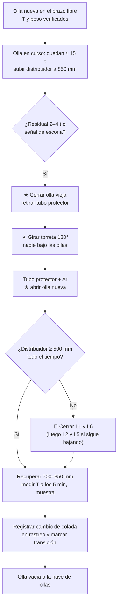

# MO-CC2-05 — Cambio de olla en secuencia (torreta)

| Código | Versión | Estado | Área | Dueño del proceso | Elaboró | Revisión técnica | Revisión de seguridad | Aprobó | Fecha | Próxima revisión |
|---|---|---|---|---|---|---|---|---|---|---|
| MO-CC2-05 | 0.1 | Borrador para validación | Colada Continua 2 (palanquilla) | C-06 Supervisor de Colada Continua | sind-servicio-clientes + experto-operativo-metalurgia | experto-operativo-metalurgia | experto-seguridad-salud | Pendiente (Gerente de Acería / Director) | 2026-09-25 | 2027-09-25 |

> **Mensaje clave para el operador:** en el cambio de olla la secuencia depende del **nivel del distribuidor**. Súbelo a **850 mm** antes de cerrar la olla vieja, **ciérrala antes de que pase escoria**, gira la torreta **sin nadie bajo las ollas** y abre la nueva **en menos de 3 min**. Nunca dejes bajar el distribuidor de **500 mm**.

## 1. Objetivo y alcance
**Objetivo:** cambiar la olla vacía por una llena **sin interrumpir las 6 líneas**, sin arrastre de escoria al distribuidor, con el nivel del distribuidor ≥ 500 mm y la trazabilidad de colada correcta en cada línea.

**Alcance:** desde que la siguiente olla llega a la torreta hasta que la nueva olla cuela estable y la olla vacía sale a la nave de ollas. Incluye el cambio de grado en secuencia (solo entre grados compatibles).

## 2. Roles y responsabilidades
| Rol | Responsabilidad en este proceso | R/A/C/I |
|---|---|---|
| C-06 Supervisor de Colada Continua | Autoriza el cambio y los cambios de grado; decide cerrar líneas si la olla se retrasa | A |
| S-13 Operador de Plataforma de Colada | Controla el nivel del distribuidor, cierra la olla vieja, cambia el tubo protector, abre la olla nueva y mide temperatura | R |
| S-09 Operador de Grúa de Colada | Coloca la olla llena en el brazo libre y retira la vacía | R (izaje) |
| S-12 Operador de Púlpito de Colada | Gira la torreta (si se opera desde el púlpito), vigila las líneas y registra el cambio de colada en el rastreo | R |
| S-11 Muestrero | Toma muestra química de la nueva colada | R |
| C-09 Metalurgista de Producto | Define la regla de palanquillas de mezcla en cambio de grado | C |
| C-04 Jefe de Turno de Acería | Coordina el programa de ollas con EAF y LF | I |

## 3. Descripción del proceso
La torreta tiene **2 brazos**: mientras una olla cuela, la siguiente espera en el otro brazo. Al terminar la olla, se cierra, se gira la torreta 180° y se abre la nueva. Durante el giro el distribuidor **no recibe acero**; sus 30 t alimentan a las 6 líneas (≈ 3.5 t/min a 3.0 m/min), por eso el nivel se sube antes a **850 mm** y el cambio completo debe durar **≤ 3 min** [Validar].

**Trazabilidad:** el acero de la olla nueva se mezcla con el que queda en el distribuidor. El sistema de rastreo asigna el cambio de colada en cada línea a partir del tiempo de residencia (≈ 8–9 min con 6 líneas a 3.0 m/min [Validar]). Las palanquillas de esa zona se marcan como **de transición**.

## 4. Equipos y maquinaria
| Equipo / componente | Función | Especificación clave | Condición para operar (verificación) |
|---|---|---|---|
| Torreta de ollas | Intercambiar ollas | 2 brazos; pesaje de olla; giro ≤ 60 s [Validar OEM] | Sin alarmas hidráulicas; accionamiento de emergencia disponible |
| Grúa de colada 250/63 t | Colocar y retirar ollas | Doble freno y límites redundantes (FT-ACE-001 §6) | Inspección diaria (MM-GR-01) |
| Olla de 150 t | Contener el acero | Válvula deslizante; vida 60–80 coladas | Temperatura y peso de llegada; válvula probada (MO-OLL-01) |
| Tubo protector de olla | Proteger el chorro de la oxidación | Sello de argón | Tubo de repuesto precalentado disponible |
| Celdas de carga del distribuidor | Medir el nivel | 30 t | Sin alarma |
| Sistema de rastreo (nivel 2) | Asignar colada a cada palanquilla | Cambio de colada por línea | Hora de apertura registrada |

## 5. Parámetros de operación
| Parámetro | Unidad | Objetivo | Rango normal | Alarma / límite | Acción si está fuera de rango | Dónde se mide |
|---|---|---|---|---|---|---|
| Olla nueva en la torreta antes del cambio | min | 10 | ≥ 10 | < 5 | Avisa a C-04; prepara el cierre de líneas | Programa de ollas |
| Temperatura de llegada de la olla nueva | °C | Líquidus + sobrecalentamiento + pérdidas [Validar con C-07] | Según hoja del LF | Fuera de rango | C-06 decide aceptar o regresar la olla | Lanza en la torreta |
| Nivel del distribuidor antes de cerrar | mm | 850 | 820–870 | < 800 | Sube el nivel antes de cerrar | Celdas de carga / HMI |
| Residual de acero en la olla al cerrar | t | 3 | 2–4 [Validar] | Escoria en el distribuidor | Cierra de inmediato | Pesaje de la torreta |
| Tiempo cierre de olla vieja → apertura de olla nueva | min | 2 | ≤ 3 [Validar] | > 4 | Aplica la tabla de cierre de líneas | Reloj HMI |
| Nivel mínimo del distribuidor durante el cambio | mm | ≥ 600 | ≥ 500 [Validar] | < 450 | 🛑 Cierra L1 y L6; < 350: cierra L2 y L5 | Celdas de carga |
| Argón del tubo protector | NL/min | [Validar OEM] | [Validar OEM] | Sin flujo | Cambia la línea o el tubo | Rotámetro |
| Sobrecalentamiento de la olla nueva (a los 5 min) | °C | 28 | 20–35 | < 20 o > 35 | Igual que en MO-CC2-04 | Lanza |

## 6. Seguridad
### 6.1 Peligros y controles críticos
| Peligro | Consecuencia | Control crítico | Verificación |
|---|---|---|---|
| Carga suspendida de 150 t de acero líquido | Fatalidad múltiple | Grúa inspeccionada; **nadie bajo la olla ni bajo la trayectoria de la torreta**; señalero (MS-ACE-04) | Zona acordonada; conteo antes del giro |
| Perforación de la olla | Derrame de acero | Inspección visual de la coraza al llegar; zona de exclusión (MS-ACE-09) | Registro de vida de la olla |
| Arrastre de escoria | Inclusiones; buzas tapadas | Cierre por peso residual; vigilancia de la superficie del distribuidor | Registro de residual |
| Salpicaduras al abrir la olla nueva y al cambiar el tubo | Quemaduras | EPP aluminizado; herramienta de manipulación del tubo | Observación |
| Lanceo de O₂ si la olla no abre | Quemaduras, fuego | Solo S-13 certificado (MS-ACE-06) | Certificación vigente |
| Humedad en tubo protector o herramientas | Explosión | Tubos precalentados y secos | Inspección |

### 6.2 EPP obligatorio
Chamarra y polainas aluminizadas, careta con visor dorado, casco con barbiquejo, guantes aluminizados, botas de fundidor, ropa retardante a la flama, protección auditiva y dosímetro personal si se trabaja junto a los moldes.

### 6.3 Permisos, bloqueos y zonas de exclusión
- Zona de exclusión bajo el radio de giro de la torreta y la trayectoria de la grúa; nadie cruza durante el giro.
- Aviso por radio a la plataforma antes de girar.
- Si la torreta queda detenida con olla llena: solo C-06 autoriza el accionamiento de emergencia.

## 7. Calidad
| Variable crítica de calidad | Especificación | Método / frecuencia | Registro | Defecto si falla |
|---|---|---|---|---|
| Arrastre de escoria | Cero escoria visible en el distribuidor | Visual y residual por peso, cada cambio | Hoja de colada | Inclusiones de escoria; buza tapada |
| Nivel mínimo del distribuidor | ≥ 500 mm | Continuo | Tendencia | Vórtice, inclusiones |
| Asignación de colada | Cambio registrado por línea | Cada cambio | Sistema de rastreo | Palanquillas con colada equivocada (pérdida de trazabilidad) |
| Cambio de grado | Solo grados compatibles; palanquillas de mezcla según la regla de C-09 [Validar] | Cada cambio de grado | Rastreo + hoja de cambio de grado | Palanquillas fuera de química en el cliente |

## 8. Procedimiento paso a paso
| # | Paso | Cómo hacerlo (detalle y medición) | Criterio de aceptación | ★ | Rol |
|---|---|---|---|---|---|
| 1 | Confirma la olla siguiente | Número de colada, grado, peso y temperatura del LF | Coinciden con el programa | | S-13, S-12 |
| 2 | Recibe la olla en el brazo libre | S-09 la coloca; nadie bajo la carga | Olla asentada en el brazo | ★ | S-09, S-13 |
| 3 | Revisa la olla nueva | Coraza sin puntos rojos; válvula lista; mide temperatura | Temperatura en rango; sin anomalías | 🔎 | S-13 |
| 4 | Sube el nivel del distribuidor | Cuando la olla en curso tenga ≈ 15 t | 850 mm antes de cerrar | | S-13 |
| 5 | Vigila el final de la olla | Peso residual; superficie del distribuidor; detector de escoria si existe [Validar] | Residual 2–4 t | | S-13 |
| 6 | Cierra la olla vieja | Válvula deslizante al 0%; confirma el cierre | Sin flujo; sin escoria en el distribuidor | ★ | S-13 |
| 7 | Retira el tubo protector | Con el manipulador | Tubo fuera; boca libre | | S-13 |
| 8 | Despeja y avisa | Radio: "giro de torreta"; conteo de personal | Nadie bajo las ollas | ★ | S-13, C-06 |
| 9 | Gira la torreta | 180°; en ≤ 60 s [Validar] | Olla nueva sobre el distribuidor | ★ | S-12 / S-13 |
| 10 | Coloca el tubo protector con argón | Tubo precalentado; argón abierto | Sello sin fuga | | S-13 |
| 11 | Abre la olla nueva | Válvula al 100%; si no abre libre en 30 s, lancea (S-13 certificado) | Chorro estable; tiempo total ≤ 3 min | ★ | S-13 |
| 12 | Vigila el nivel mínimo | Continuo durante el cambio | ≥ 500 mm; si < 450 mm cierra L1 y L6 | ★ | S-13, S-12 |
| 13 | Recupera el nivel de operación | Controla la apertura de la olla | 700–850 mm | | S-13 |
| 14 | Mide la temperatura | A los 5 min | Sobrecalentamiento 20–35 °C | 🔎 | S-13 |
| 15 | Toma la muestra química | A los 5–10 min | Muestra enviada | | S-11 |
| 16 | Registra el cambio de colada | Hora de apertura en el rastreo; confirma la zona de transición por línea | Rastreo actualizado | 🔎 | S-12 |
| 17 | Retira la olla vacía | S-09 la lleva a la nave de ollas | Olla fuera del brazo | ★ | S-09 |
| 18 | Registra | Residual, tiempo de cambio, nivel mínimo, temperaturas | Hoja completa | | S-13 |

## 9. Condiciones anormales y respuesta
| Síntoma / alarma | Causa probable | Acción inmediata | A quién avisar |
|---|---|---|---|
| Olla nueva retrasada | Retraso en EAF / LF | Baja el nivel del distribuidor lo más tarde posible; cierra L1 y L6 al llegar a 450 mm; si no llega, fin de colada (MO-CC2-07) | C-06, C-04 |
| Escoria visible en el distribuidor | Cierre tarde | Cierra la olla; marca las palanquillas; avisa a calidad | C-06, C-09 |
| La torreta no gira | Falla hidráulica o eléctrica | Accionamiento de emergencia con autorización de C-06; si no: fin de colada | C-06, C-11 |
| La olla nueva no abre | Arena sinterizada | Lanceo de O₂ (S-13 certificado); si en 3 min no abre: gira de regreso y fin de colada | C-06, S-08 |
| Punto rojo o fuga en la coraza de la olla | Desgaste del refractario | 🛑 Evacúa; no gires sobre personas; emergencia (MS-ACE-09) | C-04, C-06, C-15 |
| Tubo protector roto | Choque térmico o golpe | Cambia el tubo; si no es posible, cuela con chorro libre solo con autorización de C-06 y marca palanquillas | C-06 |
| Temperatura de la olla nueva fuera de rango | Tratamiento del LF | C-06 decide; > 45 °C de sobrecalentamiento: considera cerrar líneas extremas | C-06, C-07 |

## 10. Registros
- Hoja de colada CC2: hora de cierre y apertura, residual, tiempo de cambio, nivel mínimo, temperaturas.
- Sistema de rastreo: cambio de colada por línea y zona de transición.
- Hoja de cambio de grado (si aplica), con la regla de C-09.
- Registro de izaje (grúa de colada).

## 11. Competencia requerida y certificación
| Rol | Nivel requerido (1–4) | Formación teórica (h) | OJT supervisado (h / eventos) | Evaluación (pasos ★) | Vigencia |
|---|---|---|---|---|---|
| S-13 Operador de Plataforma | 3 | 16 | 20 cambios de olla | Pasos 6, 8, 9, 11, 12 | 24 meses (TD-P07) |
| S-09 Operador de Grúa de Colada | 3 | 40 (grúas de metal líquido) | 80 h | Pasos 2, 17 (certificación de grúa de colada) | 24 meses (TD-P07) |
| S-12 Operador de Púlpito | 3 | 8 | 10 cambios | Pasos 9, 12, 16 | 24 meses (TD-P07) |

**Lista corta de verificación de pasos ★ (TD-P07):**
- [ ] Sube el distribuidor a 850 mm antes de cerrar la olla.
- [ ] Cierra la olla por residual, sin arrastre de escoria.
- [ ] Confirma que no hay nadie bajo las ollas antes de girar.
- [ ] Abre la olla nueva en ≤ 3 min del cierre.
- [ ] Cierra líneas extremas si el distribuidor baja de 450 mm.

## 12. Referencias
- FT-ACE-001 §3, §5 y §6 · CAT-ACE-001 · MO-OLL-01, MO-OLL-02, MO-CC2-04, MO-CC2-07, MO-CC2-08.
- MS-ACE-01, MS-ACE-04, MS-ACE-06, MS-ACE-09 · MM-GR-01.
- NOM-006-STPS-2014 (manejo de materiales), NOM-017-STPS-2008 — verificar con Jurídico Laboral / SSO.
- Manual del OEM de la torreta [por referenciar].

## 13. Control de cambios
| Versión | Fecha | Cambio | Elaboró |
|---|---|---|---|
| 0.1 | 2026-09-25 | Creación del borrador para validación | sind-servicio-clientes + experto-operativo-metalurgia |
