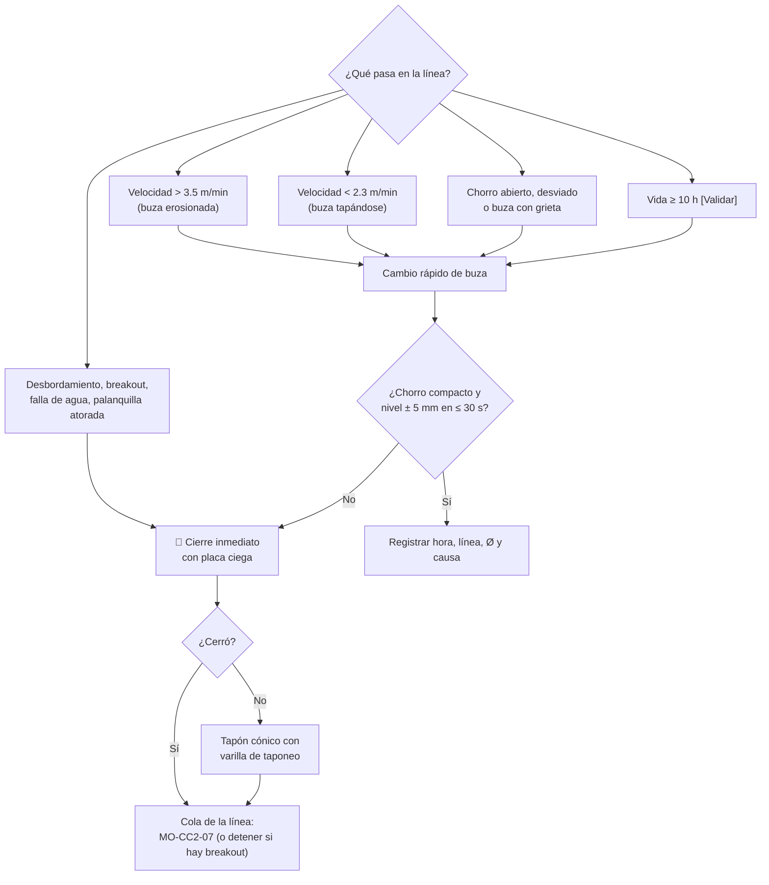

# MO-CC2-06 — Cambio rápido de buza calibrada y taponeo o cierre de línea

| Código | Versión | Estado | Área | Dueño del proceso | Elaboró | Revisión técnica | Revisión de seguridad | Aprobó | Fecha | Próxima revisión |
|---|---|---|---|---|---|---|---|---|---|---|
| MO-CC2-06 | 0.1 | Borrador para validación | Colada Continua 2 (palanquilla) | C-06 Supervisor de Colada Continua | sind-servicio-clientes + experto-operativo-metalurgia | experto-operativo-metalurgia | experto-seguridad-salud | Pendiente (Gerente de Acería / Director) | 2026-09-25 | 2027-09-25 |

> **Mensaje clave para el operador:** la buza calibrada **se gasta o se tapa** y la línea te avisa con la **velocidad**: si sube de 3.5 m/min la buza está erosionada; si baja de 2.3 m/min se está tapando. Cámbiala **con el mecanismo de cambio rápido** y una buza **caliente y del diámetro correcto**. Si una línea se vuelve peligrosa (desbordamiento, breakout, sin agua), **ciérrala de inmediato con placa ciega**; el tapón con varilla es el respaldo.

## 1. Objetivo y alcance
**Objetivo:** (a) cambiar una buza calibrada en colada con una interrupción del chorro **≤ 2 s** [Validar OEM] y sin perder la línea; (b) cerrar una línea en forma segura y rápida cuando hay un problema (taponeo o placa ciega).

**Alcance:** cambio de buza programado (fin de vida) o por falla (erosión, taponamiento, chorro abierto, desalineación, grieta); cierre de una línea en colada por cualquier condición anormal. El vaciado de la línea cerrada sigue la parte de cola de MO-CC2-07.

## 2. Roles y responsabilidades
| Rol | Responsabilidad en este proceso | R/A/C/I |
|---|---|---|
| C-06 Supervisor de Colada Continua | Autoriza el cambio de buza y decide el cierre de línea (en emergencia, S-13 cierra y avisa) | A |
| S-13 Operador de Plataforma de Colada | Ejecuta el cambio de buza y el cierre con placa ciega o tapón | R |
| S-14 Ayudante de Colada | Trae la buza caliente del horno, vigila el molde y el chorro, confirma el nivel | R |
| S-12 Operador de Púlpito de Colada | Pasa la línea a velocidad fija durante el cambio, regresa a automático, ajusta la cola de la línea cerrada | R |
| C-08 Ingeniero de Proceso | Analiza vida de buzas y taponamientos repetidos | C |
| S-15 Preparador de Distribuidores | Mantiene el horno de buzas de repuesto con buzas calientes | C |

## 3. Descripción del proceso
Cada buza calibrada está montada en un **mecanismo de cambio rápido** bajo el distribuidor. Al empujar una **buza nueva precalentada**, la buza usada sale por el otro lado hacia un cajón receptor. Si en lugar de una buza se empuja una **placa ciega** (sin orificio), la línea **se cierra**. Como respaldo, la línea se puede **taponar** desde arriba del distribuidor con un **tapón cónico** montado en una **varilla de taponeo**.

**Vida de la buza [Validar con OEM / C-08]:** 8–12 h de colada. El ZrO₂ se erosiona y el diámetro crece: una buza de 22 mm (≈ 3.0 m/min) que se abre a 23.5 mm lleva la línea a ≈ 3.4 m/min, en el límite de 3.5 m/min.

**Diámetros vigentes [Validar con OEM]:** 160 × 160 mm → Ø 20–24 mm (nominal 22 mm ≈ 3.0 m/min; 20 mm ≈ 2.4; 24 mm ≈ 3.5 m/min con 0.8 m de nivel); 130 × 130 mm → Ø 15–17 mm. Tabla completa en MO-CC2-01, sección 5. La buza de repuesto siempre es del **mismo diámetro de la orden de colada**.

**Por qué importa (para aprender):**
- **Erosión.** El ZrO₂ se desgasta con el paso del acero; el diámetro crece, sube el caudal y la línea acelera hasta salirse del máximo de 3.5 m/min.
- **Taponamiento.** Los óxidos sólidos (alúmina, sobre todo si el acero trae Al alto) se pegan en la pared de la buza y reducen el paso; la línea frena. Un chorro "en abanico" también indica depósitos o daño.
- **Un empuje, un movimiento.** El cambio rápido corta el chorro 1–2 s; si se detiene a medias, el acero se derrama por el mecanismo.
- **Cerrar a tiempo.** Una línea con desbordamiento, breakout o sin agua se vuelve peligrosa en segundos: la placa ciega la cierra en ≤ 10 s.

## 4. Equipos y maquinaria
| Equipo / componente | Función | Especificación clave | Condición para operar (verificación) |
|---|---|---|---|
| Mecanismo de cambio rápido (6) | Cambiar buza o cerrar la línea | Empuje ≤ 2 s [Validar OEM] | Carril libre; cilindro o palanca operando |
| Buzas calibradas de repuesto | Reemplazo | Ø de la orden (160 × 160: 20–24 mm, nominal 22; 130 × 130: 15–17 mm); precalentadas | ≥ 900 °C y ≥ 30 min en el horno [Validar OEM] |
| Placas ciegas | Cerrar la línea | Una por línea + 2 de repuesto, precalentadas | En el horno, listas |
| Horno de buzas de repuesto | Mantener buzas calientes | ≥ 900 °C [Validar OEM] | Encendido; mínimo 6 buzas y 2 placas |
| Tenazas para buza | Manipular la buza caliente | Mango ≥ 1.2 m [Validar] | Sin deformación |
| Varilla de taponeo con tapón cónico | Respaldo de cierre desde arriba | Tapón de acero o refractario para Ø 15–24 mm (del diámetro en uso); varilla ≥ 3 m [Validar] | 2 varillas listas por turno, secas |
| Cajón receptor | Recibir la buza usada | Seco, con arena seca | Vacío al inicio del turno |

## 5. Parámetros de operación
| Parámetro | Unidad | Objetivo | Rango normal | Alarma / límite | Acción si está fuera de rango | Dónde se mide |
|---|---|---|---|---|---|---|
| Velocidad de la línea (indicador de buza) | m/min | 3.0 | 2.5–3.5 | > 3.5 o < 2.3 [Validar] | Cambio de buza | HMI |
| Diferencia de velocidad contra el promedio de las líneas | m/min | 0 | ± 0.3 | > ± 0.4 | Programa el cambio de esa buza | HMI |
| Tiempo en servicio de la buza | h | ≤ 10 | 8–12 [Validar] | > 12 | Cambio programado | Registro de buzas |
| Temperatura de la buza de repuesto | °C | 1,000 | ≥ 900 [Validar OEM] | < 850 | No la uses; toma otra | Indicador del horno |
| Interrupción del chorro durante el cambio | s | ≤ 2 | 1–2 [Validar OEM] | > 5 | Revisa el mecanismo | Observación / curva de nivel |
| Recuperación del nivel de molde | s | ≤ 30 | 15–30 | > 60 | Si no se estabiliza: velocidad fija y avisa | Radiométrico |
| Tiempo para cerrar una línea en emergencia | s | ≤ 10 | 5–10 | > 30 | Usa el tapón con varilla | Reloj / observación |
| Nivel del distribuidor al cerrar líneas | mm | 700–850 | — | > 870 | Cierra un poco la olla para compensar | HMI |

## 6. Seguridad
### 6.1 Peligros y controles críticos
| Peligro | Consecuencia | Control crítico | Verificación |
|---|---|---|---|
| Acero líquido y salpicaduras bajo el distribuidor durante el cambio | Quemaduras graves | Solo S-13 y S-14 en la posición de cambio, del lado contrario a la salida de la buza usada; EPP aluminizado completo (MS-ACE-01) | Posición marcada en el piso |
| Buza o placa húmeda o fría | Explosión / buza congelada | Solo buzas y placas del horno de repuesto (≥ 900 °C) | Indicador del horno |
| Línea sin control (desbordamiento o breakout) | Derrame de metal | Cierre inmediato con placa ciega; tapón con varilla como respaldo | Simulacro trimestral [Validar] |
| Taponeo desde arriba del distribuidor | Quemaduras por calor radiante, caída | Careta, chamarra aluminizada, plataforma con barandal (MS-ACE-10) | Inspección de plataforma |
| Buza usada caliente en el cajón | Quemaduras, incendio | Cajón con arena seca; nadie en la línea de expulsión | Observación |
| Radiación (Cs-137) al limpiar un molde de una línea cerrada | Exposición | Obturador cerrado por el ESR antes de intervenir el molde (MS-ACE-07) | Registro del ESR |

### 6.2 EPP obligatorio
Chamarra, pantalón o polainas aluminizados, careta con visor dorado, casco con barbiquejo, guantes aluminizados, botas de fundidor, ropa retardante a la flama, protección auditiva y dosímetro personal.

### 6.3 Permisos, bloqueos y zonas de exclusión
- Zona de exclusión de 3 m [Validar con C-16] en la línea de expulsión de la buza usada.
- Aviso por radio a S-12 antes de cada cambio o cierre.
- Una línea cerrada no se interviene (molde, rodillos) sin LOTO de esa línea y, en el molde, sin el ESR.

## 7. Calidad
| Variable crítica de calidad | Especificación | Método / frecuencia | Registro | Defecto si falla |
|---|---|---|---|---|
| Diámetro de la buza de repuesto | El de la orden, ± 0.2 mm | Calibrador al cargar el horno (MO-CC2-01) | Registro de buzas | Velocidad fuera de rango |
| Forma del chorro después del cambio | Compacto y centrado | Visual inmediato | Registro de cambio | Salpicaduras, pinholes, romboidad |
| Palanquilla del cambio | Marcada "B" (cambio de buza) [Validar] | La palanquilla que contiene el cambio | Rastreo | Marca de nivel, inclusiones |
| Causa de cierre de línea | Registrada | Cada cierre | Reporte de cierre | Pérdida de aprendizaje |

## 8. Procedimiento paso a paso
**A. Cambio rápido de buza**

| # | Paso | Cómo hacerlo (detalle y medición) | Criterio de aceptación | ★ | Rol |
|---|---|---|---|---|---|
| 1 | Confirma la necesidad del cambio | Velocidad, chorro, horas de servicio | Criterio de la sección 5 cumplido | | S-12, S-13 |
| 2 | Avisa y pide autorización | Radio a C-06 y S-12: "cambio de buza línea X" | Autorizado | | S-13 |
| 3 | Verifica la buza de repuesto | Diámetro (etiqueta) y temperatura del horno | Ø correcto; ≥ 900 °C | ★ | S-14 |
| 4 | Pasa la línea a velocidad fija | S-12 fija la velocidad actual | Línea en manual | | S-12 |
| 5 | Coloca la buza en el mecanismo | Con tenazas, en ≤ 30 s desde que sale del horno | Buza asentada en el carril | ★ | S-14, S-13 |
| 6 | Colócate en la posición segura | Del lado contrario a la expulsión | Nadie en la línea de expulsión | ★ | S-13, S-14 |
| 7 | Empuja la buza | Un solo movimiento continuo | Cambio en ≤ 2 s; la usada cae al cajón | ★ | S-13 |
| 8 | Revisa el chorro | Compacto y centrado en el molde | Sin abanico ni desviación | 🔎 | S-14 |
| 9 | Regresa a nivel automático | Cuando el nivel esté a ± 10 mm del punto | ± 5 mm en ≤ 30 s | | S-12 |
| 10 | Registra | Línea, hora, Ø, horas de la buza usada, causa | Registro completo | | S-13 |
| 11 | Repone el horno | Carga otra buza del mismo Ø | Horno con 6 buzas | | S-15 |

**B. Cierre de línea (taponeo)**

| # | Paso | Cómo hacerlo (detalle y medición) | Criterio de aceptación | ★ | Rol |
|---|---|---|---|---|---|
| 12 | Decide y avisa | Radio: "cierre de línea X"; en emergencia actúa y avisa | S-12 enterado | | S-13 |
| 13 | Empuja la placa ciega | Placa del horno, como en los pasos 5–7 | Chorro cortado en ≤ 10 s | ★ | S-13, S-14 |
| 14 | Si no cierra: tapona desde arriba | Tapón cónico con varilla en la boca de la buza, con presión firme 30–60 s hasta que se congele [Validar] | Chorro cortado | ★ | S-13 |
| 15 | Controla la línea cerrada | Si hay breakout o atoramiento: **detén la extracción**. Si no: cola controlada (MO-CC2-07, pasos de cola) | Línea en condición segura | ★ | S-12 |
| 16 | Compensa el distribuidor | Cierra un poco la olla; el nivel tiende a subir | 700–850 mm | | S-13 |
| 17 | Marca las palanquillas | La última palanquilla de la línea se marca "C" (cola) | Identificada en el rastreo | 🔎 | S-16 |
| 18 | Reporta | Causa, hora, acciones; reporte de incidente si hubo breakout | Reporte entregado a C-06 | | S-13, C-06 |

## 9. Condiciones anormales y respuesta
| Síntoma / alarma | Causa probable | Acción inmediata | A quién avisar |
|---|---|---|---|
| La buza nueva no fluye | Buza fría o tapada | Empuja otra buza caliente; si falla, placa ciega | C-06 |
| El mecanismo se atora a medio camino | Carril sucio, deformado | 🛑 Cierra con tapón desde arriba; no fuerces con las manos | C-06, C-11 |
| El chorro sigue abierto después del cambio | Bloque asiento dañado, escoria en el pozo | Cierra la línea | C-06, C-08 |
| La placa ciega no cierra | Placa fría, mecanismo dañado | Tapón con varilla | C-06 |
| Taponamientos repetidos en varias líneas | Al alto, acero frío, reoxidación | Avisa al LF (química) y a C-08 | C-06, C-07, C-08 |
| Nivel del distribuidor sube al cerrar varias líneas | Menos consumo | Cierra la olla parcialmente; > 870 mm: cierre adicional | C-06 |
| Buza expulsada fuera del cajón | Cajón mal colocado | Acordona; deja enfriar; no la toques sin tenazas | C-06 |

## 10. Registros
- Registro de buzas por línea: hora de instalación, Ø, horas de servicio, causa de cambio.
- Reporte de cierre de línea (causa, hora, método, acciones).
- Rastreo: palanquillas "B" (cambio de buza) y "C" (cola).
- Reporte de incidente (MS-ACE-09) si hubo derrame o breakout.

## 11. Competencia requerida y certificación
| Rol | Nivel requerido (1–4) | Formación teórica (h) | OJT supervisado (h / eventos) | Evaluación (pasos ★) | Vigencia |
|---|---|---|---|---|---|
| S-13 Operador de Plataforma | 3 | 8 | 15 cambios de buza + 3 cierres (o simulacro) | Pasos 5, 6, 7, 13, 14, 15 | 24 meses (TD-P07) |
| S-14 Ayudante de Colada | 3 | 8 | 15 cambios de buza | Pasos 3, 5, 6, 13 | 24 meses (TD-P07) |
| S-12 Operador de Púlpito | 3 | 4 | 10 cambios | Paso 15 | 24 meses (TD-P07) |

**Lista corta de verificación de pasos ★ (TD-P07):**
- [ ] Verifica Ø y temperatura de la buza de repuesto antes de usarla.
- [ ] Se coloca fuera de la línea de expulsión.
- [ ] Cambia la buza en un solo empuje (≤ 2 s).
- [ ] Cierra una línea con placa ciega en ≤ 10 s (simulacro).
- [ ] Tapona con varilla como respaldo y detiene la extracción ante un breakout.

## 12. Referencias
- FT-ACE-001 §5 · CAT-ACE-001 · MO-CC2-01, MO-CC2-04, MO-CC2-07.
- MS-ACE-01, MS-ACE-02, MS-ACE-07, MS-ACE-09, MS-ACE-10.
- NOM-017-STPS-2008, NOM-015-STPS-2001, NOM-009-STPS-2011 (alturas) — verificar con Jurídico Laboral / SSO.
- Manual del OEM del mecanismo de cambio rápido de buza [por referenciar].

## 13. Control de cambios
| Versión | Fecha | Cambio | Elaboró |
|---|---|---|---|
| 0.1 | 2026-09-25 | Creación del borrador para validación | sind-servicio-clientes + experto-operativo-metalurgia |
