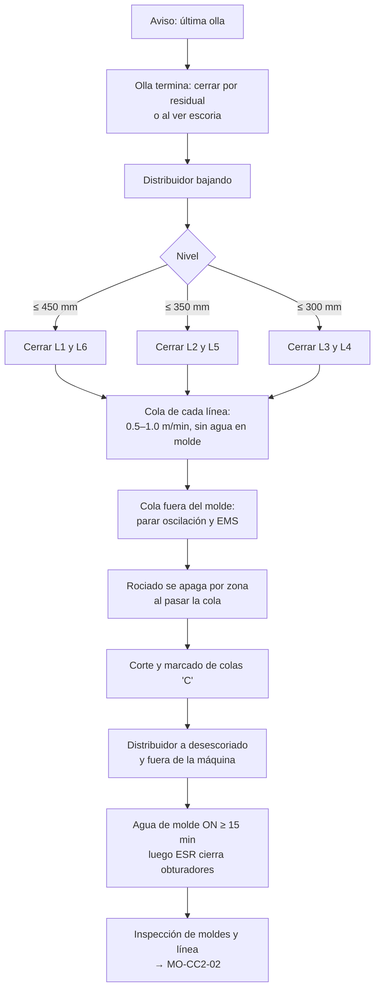

# MO-CC2-07 — Fin de colada y cierre de secuencia

| Código | Versión | Estado | Área | Dueño del proceso | Elaboró | Revisión técnica | Revisión de seguridad | Aprobó | Fecha | Próxima revisión |
|---|---|---|---|---|---|---|---|---|---|---|
| MO-CC2-07 | 0.1 | Borrador para validación | Colada Continua 2 (palanquilla) | C-06 Supervisor de Colada Continua | sind-servicio-clientes + experto-operativo-metalurgia | experto-operativo-metalurgia — visto bueno con observaciones, 2026-09-25 | experto-seguridad-salud | Pendiente (Gerente de Acería / Director) | 2026-09-25 | 2027-09-25 |

> **Mensaje clave para el operador:** al terminar la secuencia el distribuidor se vacía y **las líneas se cierran de los extremos al centro** conforme baja el nivel. La cola de cada palanquilla se saca **despacio**, y **nunca se echa agua dentro del molde** para "sellar" la cola. El agua de molde sigue encendida hasta que el último tubo esté frío.

## 1. Objetivo y alcance
**Objetivo:** terminar la secuencia sin arrastre de escoria a las palanquillas, sin breakouts de cola y con la máquina lista y segura para la inspección y la siguiente preparación.

**Alcance:** desde el aviso de "última olla" (o la decisión de terminar la secuencia por una falla) hasta que el distribuidor está fuera, las 6 colas cortadas y la máquina entregada para inspección. El cierre de **una sola línea** en colada usa la parte B (cola) de este manual.

## 2. Roles y responsabilidades
| Rol | Responsabilidad en este proceso | R/A/C/I |
|---|---|---|
| C-06 Supervisor de Colada Continua | Decide el fin de secuencia y el orden de cierre; entrega la máquina | A |
| S-13 Operador de Plataforma de Colada | Cierra la olla, cierra las líneas con placa ciega, retira el distribuidor | R |
| S-12 Operador de Púlpito de Colada | Controla la cola de cada línea (velocidad, oscilación, EMS, rociado) | R |
| S-14 Ayudante de Colada | Vigila cada molde durante la cola; prepara la inspección de moldes | R |
| S-16 Operador de Corte y Marcado | Corta y marca las colas | R |
| C-16 (función de ESR) | Cierra y bloquea los obturadores para la inspección de moldes | R (radiación) |
| S-25 Mecánico de Taller de Moldes | Inspección de tubos y conicidad (MM-CC-01) | C |

## 3. Descripción del proceso
Con la última olla ya no se puede subir el distribuidor. Al terminar la olla se cierra (por residual o al ver escoria) y el distribuidor empieza a bajar. Conforme baja, se cierran las líneas **de los extremos al centro**: L1 y L6 → L2 y L5 → L3 y L4. Así, las líneas que quedan reciben el acero más caliente de la zona de impacto y el nivel no llega a la zona de **vórtice y arrastre de escoria (≤ 300 mm)**.

En cada línea cerrada el menisco baja; la extracción sigue **despacio** hasta que la cola sale del molde y de las zonas de rociado. La oscilación, el EMS y el rociado se apagan por zona siguiendo la cola.

**Por qué importa (para aprender):**
- **De afuera hacia adentro.** Al bajar el nivel, las líneas extremas son las primeras en recibir acero frío y escoria; cerrarlas primero protege la calidad de las centrales.
- **Cola lenta.** Sin acero nuevo, la cola del molde solo tiene una piel delgada arriba; sacarla rápido la rompe y derrama el líquido que aún tiene dentro.
- **Nunca agua al molde.** Echar agua sobre la cola para "sellarla" puede atrapar agua bajo una costra y provocar una explosión.
- **Tubos calientes.** El cobre sigue recibiendo calor de la camisa y de restos de acero; apagar el agua antes de tiempo lo deforma y arruina la conicidad para la siguiente secuencia.

## 4. Equipos y maquinaria
| Equipo / componente | Función | Especificación clave | Condición para operar (verificación) |
|---|---|---|---|
| Mecanismo de cambio rápido + placas ciegas | Cerrar cada línea | ≤ 10 s por línea | 6 placas ciegas calientes en el horno |
| Varilla de taponeo | Respaldo | Tapón cónico del diámetro en uso (160 × 160: Ø 20–24 mm) | 2 listas |
| Extractores-enderezadores | Sacar la cola | Modo cola 0.5–1.0 m/min [Validar OEM] | Sin alarmas |
| Rociado secundario | Enfriar hasta la cola | Apagado por zona con seguimiento de cola | Seguimiento de cola activo en la HMI |
| Carro del distribuidor | Retirar el distribuidor | Posición de desescoriado [Validar OEM] | Caja de escoria seca en posición |
| Agua de molde | Enfriar los tubos | ≈ 2,000 L/min por línea | Encendida hasta el final |
| Medidor radiométrico | Nivel | Obturador para inspección | ESR disponible |

## 5. Parámetros de operación
| Parámetro | Unidad | Objetivo | Rango normal | Alarma / límite | Acción si está fuera de rango | Dónde se mide |
|---|---|---|---|---|---|---|
| Residual de la última olla | t | 3 | 2–4 [Validar] | Escoria visible en el distribuidor | Cierra de inmediato | Pesaje de la torreta |
| Nivel para cerrar L1 y L6 | mm | 450 | 430–470 [Validar] | — | — | Celdas de carga |
| Nivel para cerrar L2 y L5 | mm | 350 | 330–370 [Validar] | — | — | Celdas de carga |
| Nivel para cerrar L3 y L4 | mm | 300 | 280–320 [Validar] | < 250 mm | 🛑 Cierra de inmediato: vórtice y escoria | Celdas de carga |
| Velocidad de cola | m/min | 0.8 | 0.5–1.0 [Validar OEM] | > 1.5 con cola en el molde | Baja la velocidad (riesgo de breakout de cola) | HMI |
| Caída del menisco antes de acelerar la cola | mm | 100 | 80–150 [Validar] | — | — | Radiométrico |
| Agua de molde después de la última cola | min | 15 | ≥ 15 [Validar OEM] | Apagado antes | No apagues | HMI |
| Longitud mínima de la palanquilla de cola | m | 6 | ≥ 6 [Validar con Laminación] | < 6 m | A chatarra | Cortadora |

## 6. Seguridad
### 6.1 Peligros y controles críticos
| Peligro | Consecuencia | Control crítico | Verificación |
|---|---|---|---|
| Agua sobre el acero en el molde ("sellar la cola con agua") | Explosión | **Prohibido** echar agua al molde; la cola se saca solo con la velocidad de cola (MS-ACE-03) | Observación y certificación |
| Breakout de cola | Metal líquido en la línea | Velocidad de cola ≤ 1.0 m/min hasta que la cola sale del molde | Tendencia de velocidad |
| Vaciado del residual del distribuidor | Salpicaduras, explosión con humedad | Caja de escoria **seca**; zona de exclusión (MS-ACE-01) | Inspección de la caja |
| Radiación durante la inspección de moldes | Exposición | ESR cierra y bloquea obturadores y mide antes de que alguien trabaje en el molde (MS-ACE-07) | Registro del ESR |
| Tubos y rodillos calientes | Quemaduras | Esperar enfriamiento; guantes | Observación |
| Movimiento de equipo durante la inspección | Atrapamiento | LOTO de extractores, oscilador y carro (MS-ACE-02) | Candados |

### 6.2 EPP obligatorio
Chamarra y polainas aluminizadas, careta con filtro IR, casco con barbiquejo, guantes aluminizados, botas de fundidor, ropa retardante a la flama, protección auditiva y dosímetro personal.

### 6.3 Permisos, bloqueos y zonas de exclusión
- Zona de exclusión alrededor de la caja de escoria durante el vaciado.
- LOTO de máquina antes de la inspección; permiso de trabajo para mantenimiento.
- Zona controlada de radiación hasta que el ESR cierre los obturadores.

## 7. Calidad
| Variable crítica de calidad | Especificación | Método / frecuencia | Registro | Defecto si falla |
|---|---|---|---|---|
| Nivel mínimo del distribuidor al cerrar la última línea | ≥ 300 mm | Continuo | Tendencia | Inclusiones de escoria en colas |
| Identificación de colas | Marcadas "C"; longitud ≥ 6 m | Cada cola | Rastreo | Colas con rechupe de cola enviadas como producto normal |
| Inspección de moldes | Desgaste, rayas, conicidad | Cada fin de secuencia | Registro del taller | Romboidad y grietas en la siguiente secuencia |

## 8. Procedimiento paso a paso
**A. Fin de secuencia**

| # | Paso | Cómo hacerlo (detalle y medición) | Criterio de aceptación | ★ | Rol |
|---|---|---|---|---|---|
| 1 | Confirma la última olla | C-06 avisa a todo el equipo por radio | Todos enterados | | C-06 |
| 2 | Prepara las placas ciegas | 6 placas calientes en el horno | Listas | | S-14 |
| 3 | Cierra la última olla | Por residual (2–4 t) o al ver escoria | Sin escoria en el distribuidor | ★ | S-13 |
| 4 | Cierra L1 y L6 | A 450 mm, con placa ciega | Chorro cortado | ★ | S-13 |
| 5 | Cierra L2 y L5 | A 350 mm | Chorro cortado | ★ | S-13 |
| 6 | Cierra L3 y L4 | A 300 mm; nunca por debajo de 250 mm | Chorro cortado | ★ | S-13 |

**B. Cola de cada línea (también se usa al cerrar una línea en colada)**

| # | Paso | Cómo hacerlo (detalle y medición) | Criterio de aceptación | ★ | Rol |
|---|---|---|---|---|---|
| 7 | Deja bajar el menisco | 80–150 mm con la velocidad en fijo | Menisco bajando sin fuga | | S-12 |
| 8 | Aplica la velocidad de cola | 0.5–1.0 m/min; **no eches agua al molde** | Cola sale del molde sin fuga | ★ | S-12, S-14 |
| 9 | Apaga oscilación y EMS | Cuando la cola sale del molde y pasa el EMS | Sin alarmas | | S-12 |
| 10 | Deja que el rociado siga a la cola | Seguimiento de cola automático; apaga zona por zona | Zonas apagadas detrás de la cola | | S-12 |
| 11 | Corta y marca la cola | Palanquilla "C"; si mide < 6 m, a chatarra | Identificada | 🔎 | S-16 |

**C. Cierre de máquina**

| # | Paso | Cómo hacerlo (detalle y medición) | Criterio de aceptación | ★ | Rol |
|---|---|---|---|---|---|
| 12 | Retira el distribuidor | Carro a desescoriado; residual a la caja de escoria **seca** | Distribuidor fuera; nadie en la zona | ★ | S-13 |
| 13 | Retira la olla vacía | S-09 la lleva a la nave de ollas | Torreta libre | | S-09 |
| 14 | Mantén el agua de molde | ≥ 15 min después de la última cola | Tubos fríos | ★ | S-12 |
| 15 | Pide al ESR cerrar los obturadores | ESR cierra, bloquea y mide en las 6 líneas (< 2 × fondo, MS-ACE-07) | Registro del ESR | ★ | C-16 (ESR), S-14 |
| 16 | Aplica LOTO a la máquina | Extractores, oscilador, carro | Candados puestos | ★ | S-14 |
| 17 | Inspecciona moldes y línea | Rayas, desgaste, restos de acero, boquillas; avisa a S-25 | Hallazgos registrados | 🔎 | S-14, S-25 |
| 18 | Registra la secuencia | Número de coladas, duración, causa del fin, cierres de línea | Hoja de secuencia completa | | S-12, C-06 |

## 9. Condiciones anormales y respuesta
| Síntoma / alarma | Causa probable | Acción inmediata | A quién avisar |
|---|---|---|---|
| Escoria en el distribuidor antes de cerrar las líneas centrales | Cierre de olla tarde | Cierra de inmediato todas las líneas restantes; marca colas | C-06, C-09 |
| Breakout de cola | Velocidad de cola alta | 🛑 Detén la extracción de esa línea; mantén el agua de molde y la secundaria; evacúa bajo la máquina y a ≥ 20 m (MS-ACE-09); el ESR inspecciona el contenedor de Cs-137 | C-06, C-04, C-16 (ESR) |
| La placa ciega no cierra | Placa fría o mecanismo dañado | Tapón con varilla (MO-CC2-06) | C-06 |
| La cola se atora en los enderezadores | Cola fría, deformada | Detén; LOTO; mantenimiento la libera | C-06, C-11 |
| Fin anticipado por emergencia (falla de agua, torreta) | Ver MO-CC2-04 y MO-CC2-05 | Cierra la olla y las 6 líneas; sigue la parte B solo si es seguro | C-04, C-06 |
| Obturador que no cierra al final | Portafuente dañado por salpicadura | 🛑 Nadie en el molde; ESR atiende | C-16 (ESR) |

## 10. Registros
- Hoja de secuencia CC2: coladas, toneladas, duración, causa del fin, cierres de línea, buzas usadas.
- Rastreo: colas "C" por línea.
- Registro del ESR (cierre de obturadores).
- Registro de inspección de moldes y línea.
- **KPI:** coladas por secuencia; breakouts por cada 1,000 coladas.

## 11. Competencia requerida y certificación
| Rol | Nivel requerido (1–4) | Formación teórica (h) | OJT supervisado (h / eventos) | Evaluación (pasos ★) | Vigencia |
|---|---|---|---|---|---|
| S-13 Operador de Plataforma | 3 | 8 | 5 fines de secuencia | Pasos 3, 4, 5, 6, 12 | 24 meses (TD-P07) |
| S-12 Operador de Púlpito | 3 | 8 | 5 fines de secuencia | Pasos 8, 14 | 24 meses (TD-P07) |
| S-14 Ayudante de Colada | 3 | 8 + protección radiológica | 5 fines de secuencia | Pasos 8, 15, 16 | 24 meses (TD-P07) |

**Lista corta de verificación de pasos ★ (TD-P07):**
- [ ] Cierra la olla sin pasar escoria.
- [ ] Cierra las líneas de los extremos al centro en los niveles definidos.
- [ ] Saca la cola a ≤ 1.0 m/min y explica por qué no se usa agua en el molde.
- [ ] Mantiene el agua de molde ≥ 15 min.
- [ ] No interviene moldes hasta que el ESR cierra y mide.

## 12. Referencias
- FT-ACE-001 §5 · CAT-ACE-001 · MO-CC2-02, MO-CC2-04, MO-CC2-05, MO-CC2-06, MO-CC2-08.
- MS-ACE-01, MS-ACE-02, MS-ACE-03, MS-ACE-07, MS-ACE-09 · MM-CC-01, MM-CC-03.
- NOM-012-STPS-2012, NOM-017-STPS-2008, NOM-004-STPS-1999 — verificar con Jurídico Laboral / SSO.
- Manual del OEM: modo cola y seguimiento de cola [por referenciar].

## 13. Control de cambios
| Versión | Fecha | Cambio | Elaboró |
|---|---|---|---|
| 0.1 | 2026-09-25 | Creación del borrador para validación | sind-servicio-clientes + experto-operativo-metalurgia |
| 0.1 | 2026-09-25 | Revisión técnica cruzada contra FT-ACE-001 v0.3: ESR citado como C-16 en roles, columna Rol y avisos. | experto-operativo-metalurgia |
