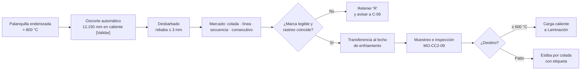

# MO-CC2-08 — Corte, marcado, lecho de enfriamiento y despacho de palanquilla

| Código | Versión | Estado | Área | Dueño del proceso | Elaboró | Revisión técnica | Revisión de seguridad | Aprobó | Fecha | Próxima revisión |
|---|---|---|---|---|---|---|---|---|---|---|
| MO-CC2-08 | 0.1 | Borrador para validación | Colada Continua 2 (palanquilla) | C-06 Supervisor de Colada Continua | sind-servicio-clientes + experto-operativo-metalurgia | experto-operativo-metalurgia — visto bueno con observaciones, 2026-09-25 | experto-seguridad-salud | Pendiente (Gerente de Acería / Director) | 2026-09-25 | 2027-09-25 |

> **Mensaje clave para el operador:** cada palanquilla de 12 m pesa **≈ 2.4 t** y sale a **más de 800 °C**. Córtala **a la medida en caliente** (el acero caliente mide más que frío), márcala con **colada, línea, secuencia y consecutivo**, y nunca la mezcles con otra colada. Si la marca no se lee, **la palanquilla pierde su identidad** y se retiene.

## 1. Objetivo y alcance
**Objetivo:** cortar cada línea a **12,000 mm ± 50 mm en frío [Validar con Laminación]**, sin rebaba > 3 mm, marcar el 100% de las palanquillas con su identificación, enfriarlas en el lecho sin doblarlas y despacharlas a Laminación de largos (carga caliente o patio) con trazabilidad completa.

**Alcance:** desde que la palanquilla llega al oxicorte hasta que se entrega a Laminación o queda estibada en el patio. La inspección de calidad y la disposición de defectos están en MO-CC2-09.

## 2. Roles y responsabilidades
| Rol | Responsabilidad en este proceso | R/A/C/I |
|---|---|---|
| C-06 Supervisor de Colada Continua | Autoriza cambios de longitud y la disposición de palanquillas sin marca | A |
| S-16 Operador de Corte y Marcado | Opera los 6 oxicortes, la desbarbadora y la marcadora; verifica longitud y marca | R |
| S-17 Operador de Mesa de Enfriamiento y Despacho | Opera la transferencia y el lecho; forma lotes; opera o dirige la grúa de producto; despacha | R |
| S-12 Operador de Púlpito de Colada | Vigila el rastreo (colada por línea) y las alarmas de corte | C |
| S-18 Inspector de Calidad | Toma muestras e inspecciona (MO-CC2-09) | C |
| C-09 Metalurgista de Producto | Define la disposición de palanquillas retenidas | I |
| Operador de grúa de producto (25 t con electroimán) — sin código en CAT-ACE-001 (propuesta S-27; hoy lo cubre S-17) | Manejo de palanquilla con electroimán o tenaza | R (izaje) |

## 3. Descripción del proceso
Después de los extractores-enderezadores, cada línea tiene un **oxicorte automático** (oxígeno + gas natural) que se sujeta a la palanquilla y viaja con ella mientras corta. La longitud se mide con un **encoder o rodillo de medición**. Como el acero caliente está dilatado, el punto de corte en caliente es **≈ 1.2% mayor** que la longitud en frío [Validar]: para 12,000 mm en frío se corta a ≈ 12,150 mm en caliente.

Después del corte: **desbarbado** (quitar la escoria de corte), **marcado** en la cara del extremo, **transferencia** al **lecho de enfriamiento** y despacho: **carga caliente** a Laminación (≥ 600 °C [Validar]) o **estiba** en el patio por colada.

**Formato de marca [Supuesto — validar con Calidad y Laminación]:** `CCCCCC-L-SS-NN`
- `CCCCCC` = número de colada (6 dígitos) · `L` = línea (1–6) · `SS` = posición de la colada en la secuencia (01–99) · `NN` = consecutivo de la palanquilla de esa colada en esa línea (01–99).
- Ejemplo: `612345-3-07-14` = colada 612345, línea 3, séptima colada de la secuencia, palanquilla 14.
- Letras de condición (se agregan al final): **A** arranque, **T** transición de colada, **B** cambio de buza, **E** EMS apagado, **C** cola, **R** retenida.

**Por qué importa (para aprender):**
- **Dilatación.** El acero a ≈ 900 °C mide ≈ 1.2% más que frío: 12 m en frío son ≈ 12.15 m en caliente. Si cortas a 12,000 mm en caliente, la palanquilla fría queda ≈ 150 mm corta.
- **La marca es la identidad.** Laminación y el cliente final rastrean la varilla hasta la colada con esa marca; una palanquilla sin marca no se puede certificar.
- **Electroimán y temperatura.** Arriba de ≈ 600–700 °C el acero pierde su magnetismo y el electroimán puede soltar la carga: por eso se usa tenaza para palanquilla muy caliente.
- **Enfriamiento parejo.** Si la palanquilla se enfría más de un lado (lecho trabado, apoyos desiguales) se curva y ya no entra al horno de recalentamiento.

## 4. Equipos y maquinaria
| Equipo / componente | Función | Especificación clave | Condición para operar (verificación) |
|---|---|---|---|
| Oxicorte automático (6) | Cortar la palanquilla en movimiento | O₂ + gas natural; carrera del carro ≥ 3 m [Validar OEM] | Prueba de flama; antirretornos de llama instalados; boquilla limpia |
| Encoder / rodillo de medición | Medir la longitud | Resolución ≤ 5 mm [Validar] | Verificación por turno contra cinta (± 10 mm) |
| Desbarbadora | Quitar la escoria de corte | Rebaba residual ≤ 3 mm | Cuchilla o martillo en buen estado |
| Marcadora | Marcar la cara del extremo | Pintura para alta temperatura; caracteres ≥ 50 mm [Validar] | Prueba de marca legible al inicio del turno |
| Mesa de transferencia y lecho de enfriamiento | Enfriar sin doblar | Lecho de vigas galopantes o rastrillos [Validar OEM] | Sin atoramientos; separación entre palanquillas uniforme |
| Grúa de producto 25 t con electroimán o tenaza | Estibar y despachar | Electroimán para palanquilla caliente hasta 600 °C [Validar OEM]; más caliente: tenaza | Inspección previa al uso |
| Sistema de rastreo | Asignar identidad | Colada y posición por línea | Coincide con la marca física |

## 5. Parámetros de operación
| Parámetro | Unidad | Objetivo | Rango normal | Alarma / límite | Acción si está fuera de rango | Dónde se mide |
|---|---|---|---|---|---|---|
| Longitud en frío | mm | 12,000 | ± 50 [Validar con Laminación] | Fuera de tolerancia | Ajusta el punto de corte; retén las palanquillas afectadas | Cinta en palanquilla fría (1 por línea por turno) |
| Punto de corte en caliente | mm | 12,150 [Validar] | Según temperatura de corte | — | C-08 ajusta el factor de dilatación | HMI del oxicorte |
| Escuadra del corte | mm | 0 | ≤ 5 [Validar] | > 5 | Revisa la boquilla y la velocidad del soplete | Escuadra |
| Rebaba de corte | mm | 0 | ≤ 3 | > 3 | Revisa la desbarbadora | Visual / galga |
| Presión de oxígeno de corte | bar | [Validar OEM] | [Validar OEM] | Baja presión | No cortes; revisa el suministro | Manómetro |
| Presión de gas natural | bar | [Validar OEM] | [Validar OEM] | Alta o baja | Cierra el gas y revisa | Manómetro |
| Tiempo de corte (160 mm) | s | 45 | 35–55 [Validar] | > 60 s | Revisa la boquilla y el O₂ | HMI |
| Longitud mínima de palanquilla corta (cola) | m | — | ≥ 6 [Validar] | < 6 m | A chatarra | HMI |
| Temperatura para carga caliente | °C | ≥ 650 | ≥ 600 [Validar] | < 600 °C | Envía a patio | Pirómetro a la salida del lecho |
| Temperatura máxima para electroimán | °C | ≤ 550 | ≤ 600 [Validar OEM] | > 600 °C | Usa tenaza | Pirómetro |
| Altura de estiba en patio | m | ≤ 2.0 | ≤ 2.5 [Validar con C-16] | > 2.5 m | Reestiba | Visual / regla |
| Legibilidad de la marca | % | 100 | 100 | Marca ilegible | Remarca a mano con crayón térmico y verifica contra el rastreo | Visual |

**Peso de referencia:** 0.16 × 0.16 × 12 m × 7.85 t/m³ ≈ **2.41 t** por palanquilla; una colada de 150 t ≈ **60–62 palanquillas** (≈ 10 por línea con 6 líneas).

## 6. Seguridad
### 6.1 Peligros y controles críticos
| Peligro | Consecuencia | Control crítico | Verificación |
|---|---|---|---|
| Oxígeno y gas natural del oxicorte | Retroceso de llama, incendio, enriquecimiento de O₂ | Antirretornos de llama, prueba de fugas, sin grasa en conexiones de O₂ (MS-ACE-06; NOM-027-STPS-2008) | Prueba de fugas por turno |
| Palanquilla caliente en movimiento | Atrapamiento, golpe, quemadura | Nadie en el camino de rodillos ni en el lecho; cruces solo por pasarelas (MS-ACE-02 para intervenir) | Barreras y pasarelas |
| Carga suspendida (2.4 t por palanquilla, varias por izaje) | Aplastamiento | Nadie bajo la carga; electroimán con respaldo de batería; tenaza para palanquilla > 600 °C (MS-ACE-04) | Inspección de grúa; señalero |
| Caída de palanquilla del electroimán | Aplastamiento | No usar electroimán sobre su límite de temperatura | Pirómetro antes del izaje |
| Calor radiante del lecho | Estrés térmico | Cabina con aire acondicionado; pausas e hidratación (MS-ACE-08) | Programa de hidratación |
| Estiba inestable | Caída de palanquillas | Altura ≤ 2.5 m [Validar]; capas cruzadas; separadores | Inspección de patio |

### 6.2 EPP obligatorio
Casco, lentes, careta para el área de corte, ropa retardante a la flama, guantes de carnaza, botas de seguridad con casquillo, protección auditiva, chaleco de alta visibilidad en el patio.

### 6.3 Permisos, bloqueos y zonas de exclusión
- LOTO del oxicorte y del camino de rodillos antes de cambiar boquillas o liberar palanquillas atoradas.
- Zona de exclusión del lecho de enfriamiento y del patio bajo la grúa.
- Permiso de trabajo en caliente para cortes manuales con soplete (palanquilla atorada).

## 7. Calidad
| Variable crítica de calidad | Especificación | Método / frecuencia | Registro | Defecto si falla |
|---|---|---|---|---|
| Longitud | 12,000 ± 50 mm en frío | 1 por línea por turno y cada cambio de ajuste | Registro de corte | No entra al horno de recalentamiento; rendimiento |
| Escuadra y rebaba | ≤ 5 mm; ≤ 3 mm | 1 por línea por colada | Registro de corte | Atoramiento en el horno de Laminación |
| Identificación | 100% marcadas y legibles; coincide con el rastreo | Cada palanquilla; verificación de la primera y la última de cada colada por línea | Rastreo | Pérdida de trazabilidad; mezcla de coladas |
| Rectitud en el lecho | Flecha ≤ 5 mm/m y ≤ 40 mm total [Validar] | Visual; medición si hay duda | Registro de inspección | Palanquilla doblada (MO-CC2-09) |
| Separación de coladas | Cada lote o estiba = una sola colada | Cada estiba | Etiqueta de estiba | Mezcla de coladas |

## 8. Procedimiento paso a paso
| # | Paso | Cómo hacerlo (detalle y medición) | Criterio de aceptación | ★ | Rol |
|---|---|---|---|---|---|
| 1 | Prueba los oxicortes al inicio del turno | Prueba de fugas, antirretornos, flama de precalentamiento | Sin fugas; flama estable | ★ | S-16 |
| 2 | Verifica el ajuste de longitud | Punto de corte en caliente cargado para el grado y la sección | 12,150 mm [Validar] | | S-16 |
| 3 | Verifica la medición | Compara una palanquilla fría por línea con cinta | ± 10 mm contra el encoder | 🔎 | S-16 |
| 4 | Vigila el corte | Corte completo en 35–55 s; sin arrastre | Corte limpio y a escuadra | | S-16 |
| 5 | Desbarba | Verifica que la escoria de corte se retire | Rebaba ≤ 3 mm | | S-16 |
| 6 | Marca | Marcadora automática; letras de condición si aplica | Marca legible, coincide con el rastreo | ★ | S-16 |
| 7 | Verifica la identidad | Primera y última palanquilla de cada colada por línea; cambio de colada en la zona de transición | Marca = rastreo | ★ | S-16, S-12 |
| 8 | Transfiere al lecho | Mesa de transferencia; separación uniforme | Sin choques; sin doblez | | S-17 |
| 9 | Aparta las palanquillas para inspección | Las que pida S-18 y las marcadas A, T, B, E, C, R | En la zona de inspección | 🔎 | S-17 |
| 10 | Mide la temperatura para despacho | Pirómetro al final del lecho | ≥ 600 °C para carga caliente | | S-17 |
| 11 | Despacha a carga caliente o patio | Por colada completa; aviso a Laminación | Lote de una sola colada | | S-17 |
| 12 | Iza con electroimán o tenaza | Electroimán solo ≤ 600 °C; nadie bajo la carga | Izaje sin personas en la zona | ★ | Operador de grúa, S-17 |
| 13 | Estiba en patio | Capas cruzadas; altura ≤ 2.5 m; etiqueta de estiba | Estiba estable e identificada | | S-17 |
| 14 | Registra | Palanquillas por colada, destino, retenidas | Registro completo | | S-17 |

## 9. Condiciones anormales y respuesta
| Síntoma / alarma | Causa probable | Acción inmediata | A quién avisar |
|---|---|---|---|
| Corte incompleto; la palanquilla arrastra el carro | O₂ bajo, boquilla tapada | Detén la línea de corte (la palanquilla sigue avanzando: C-06 decide bajar velocidad); corte manual con permiso | C-06, S-12 |
| Retroceso de llama o fuga de gas | Antirretorno dañado, manguera | Cierra O₂ y gas en la válvula general; evacúa; no reencender sin revisión | C-06, C-16 |
| Longitud fuera de tolerancia | Encoder sucio, factor de dilatación | Ajusta; retén las palanquillas desde el último control bueno | C-06, S-18 |
| Marca ilegible o marcadora fuera de servicio | Pintura, boquilla | Marca a mano con crayón térmico, verifica contra el rastreo; repara la marcadora | C-06 |
| Marca no coincide con el rastreo | Error de asignación en el cambio de colada | Retén "R" todas las palanquillas dudosas; C-09 decide (análisis químico si hace falta) | C-06, C-09 |
| **Palanquilla doblada o atorada** en camino o lecho | Enderezado frío, choque, lecho trabado | Detén transferencia; LOTO; libera con grúa o corte manual; nadie entre rodillos | C-06, C-11 |
| Palanquilla cae del electroimán | Sobretemperatura, pérdida de energía | Acordona; no te acerques hasta que esté asentada; revisa el electroimán | C-06, C-16 |

## 10. Registros
- Registro de corte por línea (longitud medida, escuadra, rebaba, ajustes).
- Rastreo: identidad de cada palanquilla y letras de condición.
- Registro de despacho (colada, número de palanquillas, destino, temperatura).
- Etiquetas de estiba en patio.

## 11. Competencia requerida y certificación
| Rol | Nivel requerido (1–4) | Formación teórica (h) | OJT supervisado (h / eventos) | Evaluación (pasos ★) | Vigencia |
|---|---|---|---|---|---|
| S-16 Operador de Corte y Marcado | 3 | 16 (oxicorte, gases, rastreo) | 80 h / 10 coladas | Pasos 1, 6, 7 | 24 meses (TD-P07) |
| S-17 Operador de Mesa y Despacho | 3 | 16 + grúa de producto si la opera (40) | 80 h / 10 coladas | Paso 12 | 24 meses (TD-P07) |

**Lista corta de verificación de pasos ★ (TD-P07):**
- [ ] Hace la prueba de fugas y de antirretornos del oxicorte.
- [ ] Explica por qué se corta a ≈ 12,150 mm en caliente para 12,000 mm en frío.
- [ ] Verifica que la marca coincida con el rastreo en el cambio de colada.
- [ ] Retiene una palanquilla sin identidad.
- [ ] Iza sin personas bajo la carga y respeta el límite de temperatura del electroimán.

## 12. Referencias
- FT-ACE-001 §5 y §6 · CAT-ACE-001 · MO-CC2-05, MO-CC2-07, MO-CC2-09.
- MS-ACE-02, MS-ACE-04, MS-ACE-06, MS-ACE-08.
- NOM-027-STPS-2008 (soldadura y corte), NOM-006-STPS-2014 (manejo de materiales), NOM-017-STPS-2008, NOM-015-STPS-2001 — verificar con Jurídico Laboral / SSO.
- Manual del OEM: oxicorte, marcadora, lecho de enfriamiento [por referenciar].

## 13. Control de cambios
| Versión | Fecha | Cambio | Elaboró |
|---|---|---|---|
| 0.1 | 2026-09-25 | Creación del borrador para validación | sind-servicio-clientes + experto-operativo-metalurgia |
| 0.1 | 2026-09-25 | Revisión técnica cruzada contra FT-ACE-001 v0.3: rol del operador de grúa de producto referido al pendiente S-27 del catálogo. | experto-operativo-metalurgia |
