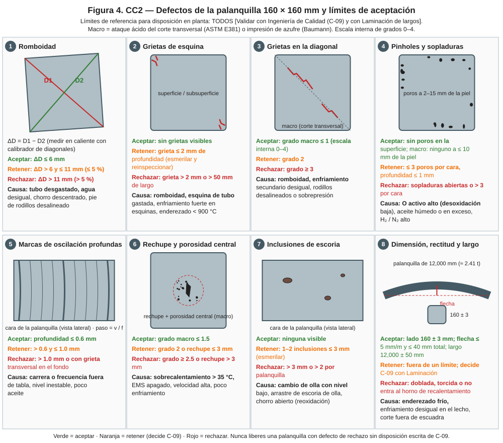
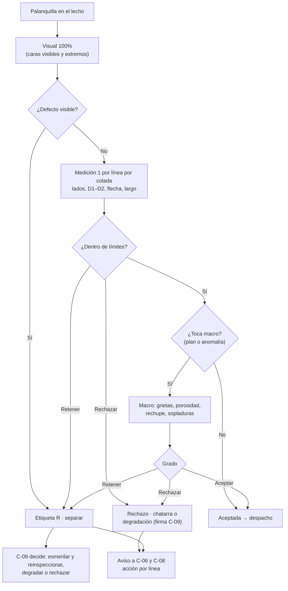

# MO-CC2-09 — Inspección de calidad de la palanquilla y disposición de defectos

| Código | Versión | Estado | Área | Dueño del proceso | Elaboró | Revisión técnica | Revisión de seguridad | Aprobó | Fecha | Próxima revisión |
|---|---|---|---|---|---|---|---|---|---|---|
| MO-CC2-09 | 0.1 | Borrador para validación | Colada Continua 2 (palanquilla) — Calidad | C-09 Metalurgista de Producto / Ingeniero de Calidad de Acería | sind-servicio-clientes + experto-operativo-metalurgia | experto-operativo-metalurgia — visto bueno sin observaciones, 2026-09-25 | experto-seguridad-salud | Pendiente (Gerente de Acería / Director) | 2026-09-25 | 2027-09-25 |

> **Mensaje clave para el inspector:** tu trabajo es que **ninguna palanquilla con defecto de rechazo llegue a Laminación** y que la operación **se entere a tiempo** para corregir. Mide la **romboidad** en cada línea en cada colada: es el primer aviso de un molde gastado o un rociado tapado. Ante la duda, **retén** y deja que C-09 decida por escrito.

## 1. Objetivo y alcance
**Objetivo:** inspeccionar la palanquilla de 160 × 160 mm contra los límites de aceptación, disponer cada defecto (aceptar, retener o rechazar) y retroalimentar al proceso por línea.

**Alcance:** palanquilla de CC2 en el lecho de enfriamiento y en la zona de inspección: superficie, dimensiones, romboidad, rectitud, longitud, calidad interna (macro) e identificación. Grados de varilla NMX-B-506 / ASTM A615 y barras comerciales (FT-ACE-001 §7).

## 2. Roles y responsabilidades
| Rol | Responsabilidad en este proceso | R/A/C/I |
|---|---|---|
| C-09 Metalurgista de Producto / Ingeniero de Calidad | Define límites y plan de muestreo; firma la disposición de retenidas y rechazos | A |
| S-18 Inspector de Calidad de Semiterminado | Inspecciona, mide, toma muestras de macro, etiqueta, registra y avisa | R |
| S-11 Muestrero / Analista de Laboratorio | Prepara y ataca las muestras de macro; reporta química | R |
| S-17 Operador de Mesa y Despacho | Aparta las palanquillas a inspeccionar y separa las retenidas | R |
| C-06 Supervisor de Colada Continua | Recibe los avisos y corrige la operación | C |
| C-08 Ingeniero de Proceso | Analiza tendencias por línea (romboidad, grietas, porosidad) | C |
| Laminación de largos (cliente interno) | Acuerda límites de aceptación y recibe retroalimentación | C |

## 3. Descripción del proceso
La inspección combina tres niveles: (1) **visual** de todas las palanquillas al pasar por el lecho; (2) **medición** de una palanquilla por línea por colada (lados, diagonales, rectitud, longitud, marcas de oscilación); (3) **macro** (ataque ácido del corte transversal o impresión de azufre) según el plan de muestreo y siempre que hubo una anomalía. Cada palanquilla queda en uno de tres estados: **Aceptada**, **Retenida** (etiqueta roja "R", decide C-09) o **Rechazada**.

**Romboidad:** diferencia de diagonales ΔD = D1 − D2. En 160 × 160 mm la diagonal nominal es ≈ 226 mm; 6 mm ≈ 2.7% y 11 mm ≈ 5%.

**Por qué importa (para aprender):**
- **La romboidad es un aviso.** Casi siempre nace en el molde (tubo gastado, agua desigual, chorro descentrado) o en el pie de rodillos; medirla por línea permite corregir antes de que aparezcan grietas.
- **Cada defecto tiene una "firma" de proceso:** esquina → molde y enfriamiento de esquinas; diagonal → romboidad y rociado; pinholes → aceite y desoxidación; centro → sobrecalentamiento y EMS; escoria → cambio de olla y nivel del distribuidor.
- **Retener no es rechazar.** La etiqueta roja detiene la palanquilla hasta que C-09 decide con datos (esmerilar, degradar o rechazar). Liberar por presión de producción es una falta grave.
- **La macro muestra lo que no se ve.** Un corte transversal atacado con ácido revela grietas internas, porosidad y rechupe que la inspección visual nunca verá.

## 4. Equipos y maquinaria
| Equipo / componente | Función | Especificación clave | Condición para operar (verificación) |
|---|---|---|---|
| Calibrador de lados y de diagonales | Medir sección y romboidad | Rango 0–300 mm; resolución 0.5 mm | Verificación diaria con patrón [Validar] |
| Regla / hilo tenso de 3 m y cinta de 15 m | Rectitud y largo | — | Cinta calibrada |
| Medidor de profundidad (galga) | Marcas de oscilación y grietas | Resolución 0.05 mm | Verificado |
| Pirómetro portátil | Temperatura de la palanquilla | 0–1,200 °C | Calibrado |
| Sierra u oxicorte de muestras | Cortar rebanadas para macro | Rebanada de 20–30 mm [Validar] | Guarda y LOTO para mantenimiento |
| Estación de ataque ácido (laboratorio) | Revelar la macroestructura | HCl 1:1 a 70–80 °C (ASTM E381) [Validar] | Campana de extracción operando; regadera de emergencia |
| Papel fotográfico para impresión de azufre (Baumann) | Revelar segregación de S | — | Vigente |
| Esmeril de palanquilla | Acondicionar defectos superficiales | Profundidad máxima de esmerilado [Validar] | Guardas instaladas |
| Carta de grados de macro (escala interna 0–4) | Clasificar calidad interna | [Validar con C-09] | Versión vigente en el laboratorio |

## 5. Parámetros de operación
| Parámetro | Unidad | Objetivo | Rango normal (aceptar) | Alarma / límite (retener → rechazar) | Acción si está fuera de rango | Dónde se mide |
|---|---|---|---|---|---|---|
| Lado de la sección (frío) | mm | 160 | ± 3 [Validar] | Fuera de ± 3 → retener | Avisa a C-06; revisa el molde | Calibrador |
| Romboidad ΔD | mm | ≤ 3 | ≤ 6 | > 6 y ≤ 11 → retener; > 11 (> 5%) → rechazar | Aviso inmediato a C-06: revisar chorro, agua de molde, rociado, pie de rodillos; si ΔD > 6 en 2 coladas seguidas en la misma línea: cambio de molde [Validar] | Calibrador de diagonales |
| Rectitud (flecha) | mm | 0 | ≤ 5 mm/m y ≤ 40 mm total [Validar] | Fuera → retener; doblada → rechazar | Revisa enderezado y lecho | Regla / hilo |
| Longitud (frío) | mm | 12,000 | ± 50 [Validar] | Fuera → retener | Aviso a S-16 | Cinta |
| Grietas de esquina | mm prof. | 0 | Sin grietas | ≤ 2 mm → retener (esmerilar); > 2 mm o > 50 mm de largo → rechazar | Aviso a C-06 / C-08 | Visual + galga |
| Grietas en la diagonal (macro) | grado | 0 | ≤ 1 | 2 → retener; ≥ 3 → rechazar | Retén toda la colada de esa línea hasta nueva macro | Macro |
| Pinholes / sopladuras | n.º por cara | 0 | Ninguno en superficie; macro: ninguno a ≤ 10 mm de la piel | ≤ 3 por cara y ≤ 1 mm de prof. → retener; abiertas o > 3 → rechazar | Revisa aceite (humedad, exceso) y desoxidación | Visual + macro |
| Marcas de oscilación | mm prof. | ≤ 0.4 | ≤ 0.6 | > 0.6 y ≤ 1.0 → retener; > 1.0 o con grieta → rechazar | Revisa la tabla de oscilación y el nivel | Galga |
| Rechupe y porosidad central | grado | ≤ 1 | ≤ 1.5 | 2 o rechupe ≤ 3 mm → retener; ≥ 2.5 o rechupe > 3 mm → rechazar | Revisa sobrecalentamiento y EMS | Macro |
| Inclusiones de escoria (superficie) | n.º / tamaño | 0 | Ninguna | 1–2 de ≤ 3 mm → retener (esmerilar); > 3 mm o > 2 → rechazar | Revisa cambio de olla y nivel del distribuidor | Visual |
| Química (varilla) | % | Según grado | FT-ACE-001 §7; CE ≤ 0.55 | Fuera → retener la colada completa | C-09 dispone | LIMS |

**Plan de muestreo [Validar con C-09]:**
- **Visual:** 100% de las palanquillas en el lecho.
- **Dimensional y romboidad:** 1 palanquilla por línea por colada (6 por colada).
- **Macro:** 1 rebanada por línea al inicio de cada secuencia; 1 rebanada por colada rotando la línea; y **siempre** en palanquillas marcadas **A** (arranque), **E** (EMS apagado), **B** (cambio de buza con anomalía), con sobrecalentamiento > 35 °C o cerca de un breakout.
- **Palanquillas T y C:** visual reforzada; macro de la cola si C-09 lo pide.

## 6. Seguridad
### 6.1 Peligros y controles críticos
| Peligro | Consecuencia | Control crítico | Verificación |
|---|---|---|---|
| Palanquilla caliente (> 500 °C) y en movimiento | Quemaduras, atrapamiento | Inspección solo desde pasarelas o en la zona de inspección con el lecho detenido; nadie sobre el lecho en movimiento (MS-ACE-02) | Zona delimitada |
| Carga suspendida (manejo de muestras y retenidas) | Aplastamiento | Nadie bajo la carga (MS-ACE-04) | Señalero |
| Ácido clorhídrico caliente (macro) | Quemaduras químicas, vapores | Campana, careta, guantes y mandil para ácido, regadera y lavaojos (NOM-005-STPS-1998, NOM-010-STPS-2014) | Hoja de seguridad; prueba semanal de regadera |
| Corte de muestras con sierra u oxicorte | Cortes, proyecciones, quemaduras | Guardas, LOTO para mantenimiento, permiso de trabajo en caliente (NOM-027-STPS-2008) | Inspección de guardas |
| Esmerilado | Proyección de partículas, ruido | Careta, protección auditiva, guardas | Observación |
| Estrés térmico en el lecho | Golpe de calor | Pausas e hidratación (MS-ACE-08) | Programa |

### 6.2 EPP obligatorio
Casco, lentes y careta, ropa retardante a la flama, guantes de carnaza (y para ácido en laboratorio), botas de seguridad, protección auditiva, chaleco de alta visibilidad; mandil y guantes de neopreno o PVC para el ataque ácido.

### 6.3 Permisos, bloqueos y zonas de exclusión
- Zona de inspección delimitada fuera del recorrido de la grúa.
- LOTO del lecho si hay que medir sobre él.
- Área de retenidas separada y señalizada (etiqueta roja).

## 7. Calidad
| Variable crítica de calidad | Especificación | Método / frecuencia | Registro | Defecto si falla |
|---|---|---|---|---|
| Romboidad por línea | ΔD ≤ 6 mm | 1 por línea por colada | Registro de inspección; gráfica de control por línea | Grietas en la diagonal; problemas de laminación |
| Calidad interna | Macro dentro de grados | Plan de muestreo | Registro de macro con foto | Porosidad, rechupe, grietas internas |
| Superficie | Sin grietas, sopladuras abiertas ni escoria | Visual 100% | Registro de inspección | Defectos en la varilla |
| Trazabilidad de retenidas | 100% etiquetadas y separadas | Cada retención | Reporte de no conformidad | Liberación de producto no conforme |
| Tiempo de disposición de retenidas | ≤ 24 h [Validar] | Cada retención | Reporte de no conformidad | Bloqueo de patio |

## 8. Procedimiento paso a paso
| # | Paso | Cómo hacerlo (detalle y medición) | Criterio de aceptación | ★ | Rol |
|---|---|---|---|---|---|
| 1 | Revisa la hoja de colada | Anomalías del turno: A, T, B, E, C, sobrecalentamiento, cierres de línea | Lista de palanquillas a inspeccionar | | S-18 |
| 2 | Inspecciona visualmente | Caras visibles y extremos al pasar por el lecho, desde la pasarela | Sin defectos de rechazo | 🔎 | S-18 |
| 3 | Pide las palanquillas de muestra | 1 por línea por colada más las marcadas | Palanquillas en la zona de inspección | | S-18, S-17 |
| 4 | Mide los lados | 2 lados a 1 m de cada extremo | 160 ± 3 mm | 🔎 | S-18 |
| 5 | Mide las diagonales | D1 y D2 en los mismos puntos; calcula ΔD | ΔD ≤ 6 mm | ★ | S-18 |
| 6 | Mide rectitud y largo | Regla o hilo; cinta | Flecha ≤ 5 mm/m, ≤ 40 mm; 12,000 ± 50 mm | 🔎 | S-18 |
| 7 | Mide marcas de oscilación | Galga en 3 puntos por cara | ≤ 0.6 mm | 🔎 | S-18 |
| 8 | Corta la rebanada para macro | Según el plan; identifica la rebanada con la marca | Rebanada identificada | | S-18 |
| 9 | Ataca y clasifica | Ataque ácido o impresión de azufre; compara con la carta | Grado registrado con foto | 🔎 | S-11, S-18 |
| 10 | Revisa química | LIMS: grado y CE | Dentro de especificación | | S-18 |
| 11 | Dispone | Aceptar / retener (etiqueta roja "R") / rechazar | Estado registrado en el rastreo | ★ | S-18 |
| 12 | Separa las retenidas | Área de retenidas; etiqueta con colada, línea, defecto | Separadas y trazables | ★ | S-17, S-18 |
| 13 | Avisa a la operación | Romboidad > 6 mm, grietas o macro de rechazo: radio a C-06 de inmediato | C-06 enterado en ≤ 15 min | ★ | S-18 |
| 14 | Pide disposición | Reporte de no conformidad a C-09 | Disposición escrita ≤ 24 h | | S-18, C-09 |
| 15 | Actualiza la gráfica por línea | Romboidad y grados de macro | Tendencias al día | | S-18 |

## 9. Condiciones anormales y respuesta
| Síntoma / alarma | Causa probable | Acción inmediata | A quién avisar |
|---|---|---|---|
| Romboidad creciente en una línea (2 coladas > 6 mm) | Molde gastado, agua desigual, pie de rodillos, chorro descentrado | Retén la línea desde la última buena; C-06 revisa la línea; propone cambio de molde | C-06, C-08, S-25 |
| Grietas de esquina repetidas | Esquina del tubo gastada, rociado de esquina fuerte, enderezado frío | Retén; macro adicional | C-06, C-08 |
| Macro con grietas en la diagonal ≥ 3 | Romboidad, rociado desigual | Retén toda la colada de esa línea; macro de la siguiente colada | C-08, C-09 |
| Porosidad o rechupe central ≥ 2.5 | Sobrecalentamiento alto, EMS apagado | Retén; revisa la hoja de temperatura y EMS | C-08, C-09 |
| Sopladuras abiertas | Aceite húmedo, O activo alto | Retén la colada; revisa el aceite y la desoxidación en el LF | C-06, C-07 |
| Química fuera de grado | Ajuste en el LF | Retén la colada completa | C-09, C-07 |
| **Palanquilla doblada** | Enderezado frío, lecho | Rechaza si no entra al horno de Laminación; avisa | C-06, C-11 |
| Palanquilla sin marca o marca dudosa | Falla de marcadora o de rastreo | Retén "R"; identificación por química si hace falta | C-06, C-09 |

## 10. Registros
- Registro de inspección por colada y línea (lados, diagonales, ΔD, flecha, largo, marcas de oscilación, visual).
- Registro de macro con foto y grado.
- Reportes de no conformidad y disposición firmada por C-09.
- Gráficas de control por línea (romboidad, grados de macro) — base para el Cp/Cpk de C-08.
- Certificado de calidad por colada para Laminación.

## 11. Competencia requerida y certificación
| Rol | Nivel requerido (1–4) | Formación teórica (h) | OJT supervisado (h / eventos) | Evaluación (pasos ★) | Vigencia |
|---|---|---|---|---|---|
| S-18 Inspector de Calidad | 3 | 24 (defectos de solidificación, metrología, macro, disposición) | 80 h / 20 coladas inspeccionadas; 20 macros clasificadas | Pasos 5, 11, 12, 13; prueba de clasificación de 10 macros con ≥ 90% de acuerdo con C-09 [Validar] | 24 meses (TD-P07) |
| S-11 Analista de Laboratorio | 3 | 16 (ataque ácido, seguridad química) | 20 macros | Paso 9 con seguridad química | 24 meses (TD-P07) |
| C-09 Metalurgista de Producto | 4 | — | — | Calibración anual de la carta de grados | 12 meses [Validar] |

**Lista corta de verificación de pasos ★ (TD-P07):**
- [ ] Mide D1 y D2 correctamente y calcula ΔD.
- [ ] Clasifica un defecto con la figura 4 y decide aceptar, retener o rechazar.
- [ ] Etiqueta y separa una palanquilla retenida con su trazabilidad.
- [ ] Avisa a C-06 en ≤ 15 min ante romboidad > 6 mm o macro de rechazo.

## 12. Referencias
- FT-ACE-001 §5 y §7 · CAT-ACE-001 · MO-CC2-04, MO-CC2-08.
- NMX-B-506-CANACERO y ASTM A615 (varilla), ASTM E381 (macroataque) — verificar ediciones vigentes con C-09.
- NOM-005-STPS-1998 (sustancias químicas), NOM-010-STPS-2014, NOM-027-STPS-2008, NOM-017-STPS-2008 — verificar con Jurídico Laboral / SSO.
- MS-ACE-02, MS-ACE-04, MS-ACE-08.

## 13. Control de cambios
| Versión | Fecha | Cambio | Elaboró |
|---|---|---|---|
| 0.1 | 2026-09-25 | Creación del borrador para validación | sind-servicio-clientes + experto-operativo-metalurgia |
| 0.1 | 2026-09-25 | Revisión técnica cruzada contra FT-ACE-001 v0.3: sin cambios de contenido. | experto-operativo-metalurgia |
