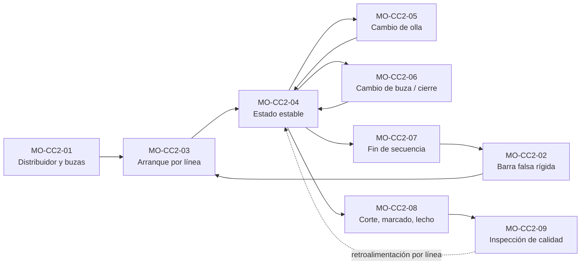

# Manuales de Operación — Colada Continua 2 (CC2, palanquilla)

| Código | Versión | Estado | Custodios |
|---|---|---|---|
| Índice MO-CC2 | 0.1 | **Borrador para validación** (2026-09-25) | experto-operativo-metalurgia (técnico) · Gerente Sindicalizado / sind-servicio-clientes (TD-10, socio de C&D de Acería) |

> **Mensaje clave:** estos 9 manuales cubren los procesos críticos de la CC2 (máquina curva de 6 líneas, radio 9 m, palanquilla de 160 × 160 mm, colada abierta con buza calibrada y aceite, EMS y control de nivel radiométrico con Cs-137). Están escritos para que el operador aprenda: pasos simples, cada medición con objetivo, rango, alarma y acción. **No se usan en planta hasta que Ingeniería de Proceso valide los valores marcados [Validar] contra el OEM** y se resuelva la inconsistencia de buza contra velocidad (ver la sección 5).

## 1. Índice de manuales
| Código | Proceso crítico | Dueño | Ejecutan | Pasos ★ | Figuras |
|---|---|---|---|---|---|
| [MO-CC2-01](MO-CC2-01-preparacion-distribuidor-buzas.md) | Preparación y precalentamiento del distribuidor y las buzas calibradas | C-06 | S-15, S-13 | 7 | 2 |
| [MO-CC2-02](MO-CC2-02-insercion-barra-falsa-rigida.md) | Preparación de máquina: inserción y sellado de la barra falsa rígida (6 líneas) | C-06 | S-12, S-14, ESR | 10 | 1, 3 |
| [MO-CC2-03](MO-CC2-03-arranque-colada-por-linea.md) | Arranque de colada por línea | C-06 | S-12, S-13, S-14 | 8 | 1 |
| [MO-CC2-04](MO-CC2-04-colada-estado-estable.md) | Colada en estado estable: nivel, aceite, EMS, velocidad, enfriamiento | C-08 | S-12, S-13, S-14 | 4 | 3 |
| [MO-CC2-05](MO-CC2-05-cambio-olla-secuencia.md) | Cambio de olla en secuencia (torreta) | C-06 | S-13, S-09, S-12 | 7 | 1 |
| [MO-CC2-06](MO-CC2-06-cambio-rapido-buza-cierre-linea.md) | Cambio rápido de buza calibrada y taponeo o cierre de línea | C-06 | S-13, S-14 | 7 | 2 |
| [MO-CC2-07](MO-CC2-07-fin-colada-cierre-secuencia.md) | Fin de colada y cierre de secuencia | C-06 | S-12, S-13, S-14 | 9 | 2 |
| [MO-CC2-08](MO-CC2-08-corte-marcado-lecho-enfriamiento.md) | Corte, marcado, lecho de enfriamiento y despacho | C-06 | S-16, S-17 | 4 | 1 |
| [MO-CC2-09](MO-CC2-09-inspeccion-calidad-palanquilla.md) | Inspección de calidad de la palanquilla y disposición de defectos | C-09 | S-18, S-11 | 4 | 4 |

## 2. Cómo se conectan los procesos

## 3. Figuras (carpeta `../../img/`)
| Figura | Archivo | Contenido |
|---|---|---|
| 1 | [cc2-perfil-maquina.svg](../../img/cc2-perfil-maquina.svg) | Vista lateral de una línea: torreta, olla, distribuidor, buza, molde con EMS, Cs-137, oscilador, pie de rodillos, Z1–Z3, R = 9 m, enderezadores, oxicorte, marcadora, lecho, agua de emergencia |
| 2 | [cc2-distribuidor-6-lineas.svg](../../img/cc2-distribuidor-6-lineas.svg) | Planta y corte del distribuidor de 30 t: 6 buzas a 1,250 mm, zona de impacto, niveles 850/700/500/300 mm, cambio rápido de buza y placa ciega |
| 3 | [cc2-molde-tubo.svg](../../img/cc2-molde-tubo.svg) | Tubo de Cu-Ag de 1,000 mm, conicidad, ranura de agua (2,000 L/min, 10–12 m/s, ΔT), aceite, EMS, fuente de Cs-137 y detector, zona controlada |
| 4 | [cc2-defectos-palanquilla.svg](../../img/cc2-defectos-palanquilla.svg) | 8 defectos con límites de aceptar / retener / rechazar |

## 4. Parámetros clave de la CC2 usados en los manuales
| Variable | Valor | Fuente |
|---|---|---|
| Sección / velocidad | 160 × 160 mm; 2.5–3.5 m/min (nominal 3.0) | FT-ACE-001 §5 |
| Sobrecalentamiento | 20–35 °C (líquidus de varilla ≈ 1,505 °C, se calcula por colada) | FT §5; líquidus [Validar] |
| Distribuidor | 30 t; 700–850 mm; mínimo en cambio de olla 500 mm; fin de colada ≥ 300 mm | FT §5; mínimos [Validar] |
| Buza calibrada | ZrO₂ Ø 15–17 mm; vida 8–12 h; cambio rápido ≤ 2 s | FT §5; vida y tiempo [Validar] |
| Orden de apertura | L3-L4 → L2-L5 → L1-L6; cierre al revés | [Validar] |
| Arranque | Extracción a 0.5 m/min con nivel a ≈ 150 mm bajo el borde; rampa a ≥ 2.5 m/min en ≈ 2 min | [Validar OEM] |
| Nivel de molde | Radiométrico Cs-137, ± 5 mm; alarma ± 10 mm | FT §5; alarma [Validar] |
| Aceite | Colza, 15–25 mL/min por línea | FT §5 |
| EMS | 250–400 A; 2–5 Hz | [Validar OEM] — no está en la ficha |
| Agua de molde | ≈ 2,000 L/min; 10–12 m/s; ΔT 6–10 °C; alarma ΔT > 12 °C o caudal < 90%; emergencia ≤ 15 s | FT §5 |
| Enfriamiento secundario | Pie de rodillos + 3 zonas; 1.5–2.0 L/kg | FT §5 |
| Oscilación | 150–250 cpm; carrera 6–10 mm | FT §5 |
| Corte | 12,000 ± 50 mm en frío (≈ 12,150 mm en caliente); ≈ 2.41 t por palanquilla | FT §5; tolerancia [Validar] |
| Romboidad | Aceptar ΔD ≤ 6 mm; retener 6–11 mm; rechazar > 11 mm (> 5%) | [Validar con C-09 y Laminación] |

## 5. Pendientes de validación e inconsistencias detectadas
1. **Buza contra velocidad (crítico):** por balance de masa, buzas de 15–17 mm con 700–850 mm de nivel entregan ≈ 0.25–0.35 t/min por línea, que en 160 × 160 mm equivale a ≈ 1.3–1.8 m/min, no a 2.5–3.5 m/min. Para 2.5–3.5 m/min hacen falta ≈ 20–24 mm (o los valores de 15–17 mm corresponden a 130 × 130 mm). **Ingeniería de Proceso (C-08) debe confirmar el valor con el OEM.**
2. La ficha cita la fuente de Cs-137 como **"SEG-ACE-07"**; el catálogo la codifica como **MS-ACE-07**.
3. El catálogo no tiene código de rol para el **operador de grúa de CC y de producto** (grúas de 50 t y 25 t); los manuales lo citan sin código.
4. En el catálogo, MS-ACE-07 "aplica a" S-05, S-12, S-14 y S-21; MS-ACE-07 ya incluye a S-25 en su texto, pero ninguno de los dos incluye a **S-13** (cambio de buza y taponeo junto a los moldes): conviene agregar S-13 y S-25 al catálogo.
5. Faltan en la ficha: parámetros del EMS, tabla de buza por velocidad, vida de buza, niveles mínimos del distribuidor, punto del menisco, alarmas de nivel, velocidad y rampa de arranque, longitud metalúrgica (≈ 20–29 m a 2.5–3.5 m/min) y posición del corte, tolerancia de longitud, límites de romboidad y defectos, química para colada abierta (Al ≤ 0.005%, Mn/Si ≥ 3) y precalentamiento del distribuidor.

## 6. Radiación: regla única para todos los manuales
Antes de meter manos, herramientas o el cuerpo en la zona del molde (sellado de barra falsa, limpieza, inspección, cambio de molde, atención a un breakout): **(1)** el **Encargado de Seguridad Radiológica (ESR)** cierra el obturador, **(2)** pone su candado y tarjeta, **(3)** mide la tasa de dosis en el punto de trabajo (criterio < 2 × fondo, MS-ACE-07) y la registra en el permiso de trabajo que él firma, **(4)** el trabajador trae su **dosímetro personal**. Solo el ESR abre el obturador, después de confirmar que no hay nadie en el molde. Base: MS-ACE-07, NOM-012-STPS-2012 y la licencia de la CNSNS (verificar con Jurídico Laboral / SSO).

## 7. Revisión cruzada requerida
- **experto-seguridad-salud:** visto bueno de pasos ★, radiación (MS-ACE-07), metal líquido y respuesta a emergencias.
- **experto-relaciones-laborales:** los manuales definen tareas certificables para 10 categorías sindicalizadas (S-09, S-11 a S-18) y OJT; revisar el impacto en escalafón y el plan DC-2 con la CMCAP.
- **experto-documentacion-mejora:** alta en el control documental y en el LMS.
- **Ingeniería de Proceso (C-08) y OEM:** todos los valores [Validar].

## Decisión requerida del Director
**Tema:** cómo liberar los manuales MO-CC2 para uso en capacitación y en planta.

| Opción | Descripción | Riesgos | Costo |
|---|---|---|---|
| **A** | Usarlos de inmediato en capacitación teórica (aula / LMS) con la leyenda "borrador", mientras C-08 valida | Aprender valores que luego cambien (sobre todo buza y velocidad) | Bajo; horas de instructor ya presupuestadas [Supuesto] |
| **B (recomendada)** | Validación técnica rápida por C-08 con el OEM (4 semanas), ajuste de la ficha FT-ACE-001 y después piloto de OJT y certificación TD-P07 con una cuadrilla de la CC2 | Retraso de ≈ 1 mes en el arranque de la certificación | Bajo: ≈ 40 h de ingeniería y 1 visita del OEM [Supuesto] |
| **C** | Esperar a tener todos los manuales de la Acería (EAF, LF, CC1) para validar en bloque | Retraso de meses con procesos críticos sin estándar escrito | Bajo en costo, alto en riesgo |

**Recomendación:** opción **B**, porque la inconsistencia de buza contra velocidad cambia pasos ★ del arranque y del cambio de buza, y los pasos ★ son la base de la certificación.
**Fecha límite sugerida para decidir:** 2026-10-09.
