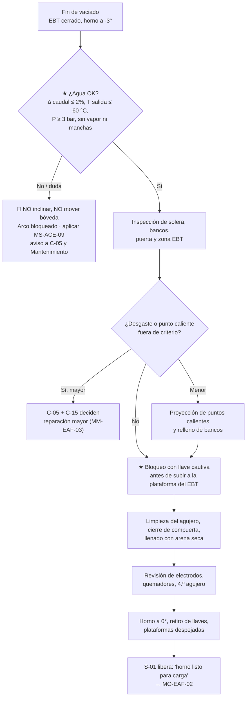

# MO-EAF-01 — Preparación del horno entre coladas

| Código | Versión | Estado | Área | Dueño del proceso | Elaboró | Revisión técnica | Revisión de seguridad | Aprobó | Fecha | Próxima revisión |
|---|---|---|---|---|---|---|---|---|---|---|
| MO-EAF-01 | 0.1 | Borrador para validación | Hornos — EAF-1 / EAF-2 | C-05 Supervisor de Hornos | experto-operativo-metalurgia | experto-operativo-metalurgia — visto bueno sin observaciones, 2026-09-25 | experto-seguridad-salud | Pendiente (Gerente de Acería / Director) | 2026-09-25 | 2027-09-25 |

> Valores técnicos tomados de `FT-ACE-001` v0.3. Lo marcado **[Validar con OEM / Ingeniería de Proceso]** o **[Supuesto]** no se usa en planta hasta que C-07 lo valide.

## 1. Objetivo y alcance
**Objetivo:** dejar el horno en condición segura y lista para la siguiente carga en **≤ 5 min** (ventana de preparación del tap-to-tap de 55 min): sin fugas de agua, con refractario reparado, EBT cerrado y lleno de arena seca, talón líquido de 20–30 t y electrodos, quemadores y humos en condición de operar.

**Alcance:** desde que termina el vaciado (EBT cerrado y horno retroinclinado) hasta que S-01 libera el horno para la carga de canasta (MO-EAF-02). Aplica a EAF-1 y EAF-2.
**No incluye:** reparaciones mayores de refractario o cambio del tubo del EBT (MM-EAF-03), reparación de fugas (MM-EAF-01) ni adición de electrodos (MO-EAF-08).

## 2. Roles y responsabilidades
| Rol | Responsabilidad en este proceso | R/A/C/I |
|---|---|---|
| C-05 Supervisor de Hornos | Dueño del proceso. Autoriza la liberación del horno si hubo cualquier desviación. Decide si se detiene el horno por refractario o agua. | A |
| S-01 Operador de Púlpito de Horno (Primer Hornero) | Verifica en la HMI el balance de agua, presiones, temperaturas y presión del horno. Mueve inclinación y bóveda. Libera el horno para carga. | R |
| S-02 Operador de Horno de Piso (Segundo Hornero) | Inspecciona solera, bancos, puerta y EBT. Ejecuta la proyección (gunning) y el llenado del EBT. | R |
| S-03 Ayudante de Horno (Tercer Hornero) | Limpia puerta, prepara arena y mezcla de proyección, apoya el llenado del EBT y la verificación visual. | R |
| C-15 Especialista de Refractarios | Define la práctica de proyección y los criterios de reparación / retiro. | C |
| C-07 Ingeniero de Proceso EAF / LF | Define los límites de proceso y analiza desviaciones repetitivas. | C |
| S-04 Operador de Grúa de Carga | Recibe el aviso de "horno listo" para traer la canasta. | I |

## 3. Descripción del proceso
Al cerrar el vaciado quedan en el horno el talón líquido (20–30 t) y una parte de la escoria. En la ventana de preparación se revisa primero el **agua** (la amenaza más grave: agua bajo metal líquido = explosión), después el **refractario** (solera, bancos, línea de escoria, puerta, zona del EBT) y el **EBT**, que se cierra por abajo y se llena de arena por arriba. Al final se nivela el horno y se libera para la carga.

## 4. Equipos y maquinaria
| Equipo / componente | Función | Especificación clave | Condición para operar (verificación) |
|---|---|---|---|
| Sistema de agua de paneles y bóveda | Enfría la coraza superior y la bóveda | ≈ 2,200 m³/h a 4–6 bar | Δ caudal entrada–salida ≤ 2%; T de salida por panel ≤ 60 °C; P ≥ 3 bar (HMI) |
| Solera y bancos refractarios | Contienen el talón y el baño | Masa de MgO apisonada / ladrillo MgO-C [Validar con OEM / Ingeniería de Proceso] | Sin cavidades visibles; termografía de coraza inferior sin punto caliente |
| EBT (agujero de vaciado excéntrico) | Vaciado por el fondo sin escoria | Tubo y bloque refractario reemplazables; compuerta inferior (flap) | Compuerta cerrada y enclavada; agujero limpio; arena seca disponible |
| Tolva y tubo de llenado de EBT | Llena el agujero con arena | Arena de olivino/magnesia [Validar con OEM / Ingeniería de Proceso] | Arena en tolva cerrada, humedad ≤ 0.5% [Supuesto] |
| Máquina de proyección (gunning) | Repara puntos calientes | Mezcla de MgO; boquilla con agua dosificada | Boquilla libre, caudal de agua ajustado según proveedor [Validar con OEM / Ingeniería de Proceso] |
| Sistema de inclinación (hidráulico) | Inclina a EBT (+) y a puerta (−) | Rango típico −10° a +15° [Validar con OEM / Ingeniería de Proceso] | Enclavamiento de posición 0° funcionando; sin fugas de aceite |
| Cámara / pirómetro de coraza | Detecta puntos calientes | — | Imagen disponible en púlpito |
| 4.º agujero (DES) | Extrae humos | Presión del horno −5 a −15 Pa | Compuerta (damper) en automático |
| Quemadores / lanzas (4) | O₂ y gas natural | Hasta 2,500 Nm³/h cada uno | Boquillas libres, agua de bloque de cobre normal, purga de N₂ activa en espera [Validar con OEM / Ingeniería de Proceso] |

## 5. Parámetros de operación
| Parámetro | Unidad | Objetivo | Rango normal | Alarma / límite | Acción si está fuera de rango | Dónde se mide |
|---|---|---|---|---|---|---|
| Diferencia de caudal de agua entrada–salida | % | ≤ 1 | 0–2 | > 2% alarma; > 4% disparo del arco | > 2%: 🛑 no inclinar ni cargar; identifica el circuito; aviso a C-05 y Mantenimiento (MM-EAF-01) | HMI de agua del púlpito |
| Temperatura de salida de panel | °C | ≤ 50 [Supuesto] | 35–55 | > 60 °C | Revisa caudal del panel; si no baja, aísla el panel y avisa a C-05 | HMI por panel |
| Presión de suministro de agua | bar | 5 | 4–6 | < 3 bar | No cargar ni energizar; verifica bombas | HMI |
| Caudal total de agua | m³/h | 2,200 | ± 5% [Supuesto] | Caída > 5% | Revisa válvulas y bombas | HMI |
| Talón líquido remanente | t | 25 | 20–30 | < 20 t o > 30 t | < 20 t: avisa a C-07 (ajusta la próxima colada); > 30 t: reduce la siguiente carga | Balance de báscula de olla vs. carga (sistema de nivel 2) |
| Tiempo de preparación | min | 5 | 4–6 | > 8 min [Supuesto] | Registra la demora y su causa | Nivel 2 / bitácora |
| Proyección refractaria | kg/colada | 150–300 [Supuesto] | 1–2 kg/t | > 450 kg en 3 coladas seguidas | C-15 evalúa reparación mayor | Contador de máquina |
| Humedad de la arena del EBT | % | ≤ 0.3 [Supuesto] | — | > 0.5% | No usar; cambia el lote | Certificado del lote / prueba rápida |
| Temperatura de coraza inferior (termografía) | °C | ≤ 250 [Supuesto] | — | > 300 °C [Supuesto] | 🛑 no cargar; C-05 + C-15 evalúan | Cámara IR |
| Presión del horno | Pa | −10 | −5 a −15 | > 0 Pa (positiva) | Revisa damper del 4.º agujero y casa de bolsas | HMI de humos |

## 6. Seguridad
### 6.1 Peligros y controles críticos
| Peligro | Consecuencia | Control crítico | Verificación |
|---|---|---|---|
| Fuga de agua de panel o bóveda hacia el baño | Explosión vapor–metal, fatalidad | ★ Verificación de balance de agua y visual antes de mover el horno; no inclinar con fuga; disparo automático > 4% | S-01 registra valores en la lista de preparación; VCC mensual |
| Humedad en arena de EBT o en mezcla de proyección mal dosificada | Proyección de metal | ★ Arena en tolva cerrada; proyección solo sobre refractario caliente, nunca sobre el baño ni formando charcos | Inspección del lote; observación del supervisor |
| Energía eléctrica y movimiento del horno con personas en plataforma | Electrocución, aplastamiento | ★ Llave cautiva para el acceso de rutina a la plataforma del EBT (una llave por persona); LOTO completo para cualquier intervención en el equipo (MS-ACE-02 §6.4) | Llave en poder de cada persona que sube; confirmación en HMI de S-01; prueba mensual del sistema de llaves |
| Radiación térmica y salpicaduras en puerta | Quemaduras graves | Trabajo desde posición protegida, EPP aluminizado, tiempo de exposición limitado | EPP revisado al inicio de turno |
| Caída de costras / escoria al limpiar puerta | Golpes, quemaduras | Máquina de limpieza de puerta; nadie en la trayectoria | Supervisor |
| Enriquecimiento de O₂ al limpiar el EBT con lanza | Incendio de ropa | Ropa sin grasa, válvula de lanza con cierre rápido | Revisión de manguera y válvula |
| CO en plataforma superior | Intoxicación | Detector personal multigás: CO 25 ppm → salir; CO 200 ppm → evacuación del sector [Verificar NOM-010]; O₂ fuera de 19.5–23.5 % → salir (MS-ACE-06) | Bump test al inicio de turno |

### 6.2 EPP obligatorio
Casco con barbiquejo, careta con visor dorado (filtro IR), chaqueta y polainas aluminizadas para puerta y EBT, ropa ignífuga (algodón FR o lana; nada sintético), guantes aluminizados, botas de seguridad con protección metatarsal, protección auditiva (nivel de ruido del EAF > 100 dB(A) con arco encendido, NOM-011), lentes de seguridad y detector personal de CO. Arnés con línea de vida en plataformas sin barandal (NOM-009).

### 6.3 Permisos, bloqueos y zonas de exclusión
- ★ **Antes de subir a la plataforma del EBT o a la de bóveda/electrodos:** arco apagado, interruptor del horno abierto, inclinación y giro de bóveda inhibidos. **Llave cautiva** solo para el acceso de rutina (inspección y llenado del EBT, inspección visual), con una llave por persona y confirmación de S-01 en la HMI. **LOTO completo** para cualquier intervención en el equipo (reparación, destrabe, cambio de componentes), entrada a la bóveda, bajo el horno o a la fosa, sistema de llaves en falla o con prueba mensual vencida, o si la tarea no está en la lista de rutina. Criterio único: MS-ACE-02 §6.4.
- Nadie entra bajo el horno ni a la fosa de vaciado con metal en el horno sin LOTO de inclinación y permiso de C-05.
- Con sospecha de fuga de agua: nadie a menos de 25 m del horno hasta que C-05 y C-07 autoricen (MS-ACE-03). Arena, mezcla de proyección y herramientas secas (MS-ACE-03).
- Zona de exclusión frente a la puerta de escoria durante la proyección y la limpieza de puerta: solo S-02/S-03 con EPP completo.
- Referencias: MS-ACE-01 (metal líquido), MS-ACE-02 (LOTO), MS-ACE-03 (agua–metal), MS-ACE-09 (emergencias).

## 7. Calidad
| Variable crítica de calidad | Especificación | Método / frecuencia | Registro | Defecto si falla |
|---|---|---|---|---|
| Llenado del EBT | Agujero lleno hasta formar corona de 50–100 mm [Validar con OEM / Ingeniería de Proceso] | Visual, cada colada | Lista de preparación | EBT no abre → lanceo, retraso, reoxidación |
| Talón líquido | 20–30 t | Balance de masa, cada colada | Nivel 2 | Talón bajo: fusión lenta del DRI; talón alto: sobrellenado |
| Escoria remanente | Mínima, sin costras en la puerta | Visual | Bitácora | Arrastre de P a la siguiente colada |
| Estado de la línea de escoria y bancos | Sin cavidad visible; proyección según C-15 | Visual + IR, cada colada | Lista de preparación | Perforación de coraza |

**Criterios de reparación del refractario del EAF (referencia)** [Validar con C-15 / proveedor de refractarios]:

| Zona | Condición observada | Criterio | Acción |
|---|---|---|---|
| Línea de escoria / bancos | Cavidad o escalón visible | Profundidad estimada > 100 mm [Supuesto] | Proyección en esta preparación; si se repite 3 coladas, reparación programada |
| Zona frente a quemadores y puerta | Desgaste localizado | Refractario brillante / delgado | Proyección dirigida |
| Solera | Agujero o "pozo" visible con el horno a 0° | Cualquier pozo que retenga metal | C-05 + C-15 evalúan; posible vaciado total del talón |
| Zona del EBT (asiento y bloque) | Erosión del bloque, costra | Tiempo de vaciado < 2.5 min o coladas del tubo al límite | Programar cambio de tubo (MM-EAF-03) |
| Coraza inferior (termografía) | Punto caliente | > 300 °C [Supuesto] | 🛑 No cargar; evaluación inmediata |

**Distribución típica de los 5 min de preparación** [Supuesto]: verificación de agua 0.5 min · inspección 1 min · proyección 1.5 min · EBT (limpieza, cierre y llenado) 1.5 min · liberación 0.5 min. Las tareas de proyección y EBT pueden hacerse en paralelo si hay dos personas certificadas y bloqueos independientes.

## 8. Procedimiento paso a paso
| # | Paso | Cómo hacerlo (detalle y medición) | Criterio de aceptación | ★ | Rol |
|---|---|---|---|---|---|
| 1 | Confirma fin de vaciado | Verifica en HMI: EBT cerrado, horno retroinclinado a −3°, carro de olla fuera de la fosa. | Estado "vaciado terminado" en nivel 2 | | S-01 |
| 2 | Verifica el agua en HMI | Lee Δ caudal entrada–salida de cada circuito, T de salida por panel y presión. Registra los tres valores. | Δ ≤ 2%, T ≤ 60 °C, P 4–6 bar | ★ | S-01 |
| 3 | Verifica el agua visualmente | Con la bóveda cerrada y desde posición protegida, observa por la cámara y la puerta: chorros de vapor, manchas oscuras o húmedas en la escoria, llama anormal. | Sin evidencia de agua | ★ | S-02 |
| 4 | Decide si se puede mover el horno | Si hay duda en 2 o 3: 🛑 no inclines, no gires bóveda, deja el arco bloqueado y aplica §9. | Sin duda de fuga | ★ | S-01 / C-05 |
| 5 | Nivela a 0° para inspección | Inclina a 0° lentamente. | Enclavamiento de 0° activo | | S-01 |
| 6 | Inspecciona el refractario | Desde la puerta con careta: solera, bancos, línea de escoria, jambas de puerta, zona del EBT. Revisa la termografía de la coraza inferior. | Sin cavidades; coraza ≤ 300 °C | 🔎 | S-02 |
| 7 | Estima el talón | Consulta el balance en nivel 2 (carga metálica − peso vaciado). | 20–30 t | 🔎 | S-01 |
| 8 | Proyecta puntos calientes | Aplica mezcla de MgO sobre puntos desgastados, desde la puerta. No proyectes sobre el baño ni formes charcos. | 150–300 kg; superficie cubierta | ★ | S-02 |
| 9 | Rellena bancos | Agrega dolomita/MgO granular a bancos erosionados [Supuesto: 0.5–1 t]. | Banco con pendiente continua | | S-02 / S-03 |
| 10 | Limpia la puerta | Retira costras con la máquina de limpieza; nadie en la trayectoria de caída. | Umbral de puerta libre | | S-03 |
| 11 | Bloquea antes de subir a la plataforma del EBT | Interruptor del horno abierto; inclinación y bóveda bloqueadas con llave cautiva; cada persona que sube retira y lleva su propia llave; S-01 confirma en HMI interruptor abierto y movimientos inhibidos (MS-ACE-02 §6.4). Si hay que intervenir el equipo: LOTO completo. | Una llave en poder de cada trabajador; confirmación de S-01 | ★ | S-02, S-01 |
| 12 | Inspecciona y limpia el agujero del EBT | Revisa el diámetro visible y costras. Si hay costra, limpia con lanza de O₂ desde arriba, con EPP aluminizado. Registra el número de coladas del tubo. | Agujero libre; coladas del tubo < límite [Validar con OEM / Ingeniería de Proceso] | | S-02 |
| 13 | Cierra la compuerta inferior del EBT | Acciona el cierre desde el mando local; confirma el indicador de "cerrado y enclavado". | Indicador cerrado | ★ | S-02 |
| 14 | Llena el EBT con arena seca | Descarga la arena de la tolva cerrada hasta formar corona de 50–100 mm. Verifica que la arena esté seca y sin grumos. | Corona uniforme; arena ≤ 0.5% humedad | ★ | S-02 / S-03 |
| 15 | Revisa electrodos | Desde el púlpito/cámara: longitud bajo mordaza, grietas, juntas. Si falta longitud, programa MO-EAF-08. | Longitud suficiente para la colada | 🔎 | S-01 |
| 16 | Revisa quemadores y 4.º agujero | Boquillas libres, agua de bloques normal, presión del horno −5 a −15 Pa. | Sin alarmas | | S-01 |
| 17 | Retira el bloqueo | Bajan todos de la plataforma; cada persona devuelve su propia llave al tablero; conteo de personas = conteo de llaves. | Plataforma vacía; llaves completas | ★ | S-02 / S-01 |
| 18 | Libera el horno | Registra la lista de preparación en nivel 2 y avisa por radio a S-04 y S-05: "EAF-x listo para carga". | Lista completa sin pendientes | | S-01 |

## 9. Condiciones anormales y respuesta
| Síntoma / alarma | Causa probable | Acción inmediata | A quién avisar |
|---|---|---|---|
| Δ caudal > 2%, vapor, manchas húmedas o llama anormal (fuga de agua) | Panel o bóveda perforados; fuga en manguera | 🛑 Arco bloqueado. **No inclines el horno ni muevas electrodos** (el agua quedaría atrapada bajo el metal). Cierra el agua del circuito identificado desde el púlpito. Evacúa a ≥ 25 m del horno (MS-ACE-03). Deja que el agua se evapore con el horno quieto (sin vapor visible ≥ 30 min [Supuesto]); reanuda solo con C-05 + C-07. | C-05, C-04, Mantenimiento (MM-EAF-01), C-16 |
| Punto caliente en coraza > 300 °C | Solera o banco adelgazado | 🛑 No cargar. Evalúa con C-15; si se decide vaciar el talón, hazlo con el procedimiento de C-05 | C-05, C-15 |
| Costra que no se retira del EBT | Metal solidificado en el agujero | Lanza de O₂ desde arriba con EPP; si tras 2 intentos no abre, C-05 decide | C-05 |
| Compuerta del EBT no cierra o no enclava | Falla mecánica / hidráulica, costra en el asiento | No llenes con arena; no cargues. Mantenimiento revisa con LOTO | C-05, Mantenimiento |
| Arena húmeda o apelmazada | Tolva abierta, lote húmedo | Cambia el lote; no uses la arena | C-05, C-17 |
| Talón < 20 t | Vaciado excesivo | Informa; C-07 ajusta la siguiente colada (más potencia inicial, menor tasa de DRI al inicio) | C-07 |
| Talón > 30 t | Vaciado incompleto | Reduce la siguiente carga; vigila bordo de la puerta | C-05 |
| Presión del horno positiva | Damper o casa de bolsas | No cargues hasta restablecer | C-05, Mantenimiento |
| Electrodo con grieta visible | Golpe, choque térmico | No energices; cambia o repara según MO-EAF-08 | C-05 |

## 10. Registros
- Lista de verificación de preparación entre coladas (nivel 2), por colada: Δ caudal, T máxima de panel, presión, talón estimado, proyección (kg), estado del EBT, coladas del tubo del EBT, observaciones.
- Bitácora del horno (demoras y causas).
- Registro de uso de llaves cautivas / LOTO (MS-ACE-02).
- Reporte de fuga o casi-accidente (MS-ACE-09), si aplica.

## 11. Competencia requerida y certificación
| Rol | Nivel requerido (1–4) | Formación teórica (h) | OJT supervisado (h / eventos) | Evaluación (pasos ★) | Vigencia |
|---|---|---|---|---|---|
| S-01 Primer Hornero | 3 | 16 | 80 h / 30 preparaciones | Pasos 2, 4, 17 + escenario de fuga simulada | 24 meses (TD-P07) |
| S-02 Segundo Hornero | 3 | 16 | 80 h / 30 preparaciones | Pasos 3, 8, 11, 13, 14, 17 | 24 meses (TD-P07) |
| S-03 Tercer Hornero | 2 (3 para suplir a S-02) | 12 | 40 h / 15 preparaciones | Pasos 11, 14 y 17 bajo supervisión | 24 meses (TD-P07) |
| C-05 Supervisor de Hornos | 4 (evaluador) | 24 + formación de evaluador | — | Evaluación de la respuesta a fuga de agua | 24 meses (TD-P07) |

Lista corta de verificación de pasos ★ (evaluación práctica, todos deben aprobarse):
1. Lee e interpreta el balance de agua, la T de panel y la presión; conoce los límites 2% / 4% / 60 °C / 3 bar.
2. Explica por qué **no se inclina** el horno con sospecha de fuga y ejecuta la respuesta.
3. Distingue llave cautiva (acceso de rutina, una llave por persona) de LOTO completo (intervención) según MS-ACE-02 §6.4; aplica el bloqueo antes de subir y lo retira con conteo de personas (pasos 11 y 17).
4. Verifica la compuerta cerrada y el llenado del EBT con arena seca.
5. Proyecta sin formar charcos ni proyectar sobre el baño (paso 8).
6. Verifica visualmente que no hay agua en el horno y decide no mover el horno si hay duda (pasos 3 y 4).

## 12. Referencias
- FT-ACE-001 Ficha técnica de la Acería §2; CAT-ACE-001; Guía de estilo `00-guia-de-estilo-y-plantillas.md`.
- MS-ACE-01, MS-ACE-02, MS-ACE-03, MS-ACE-09; MM-EAF-01, MM-EAF-03; MO-EAF-02, MO-EAF-07, MO-EAF-08.
- NOM-017-STPS (EPP), NOM-004-STPS (maquinaria), NOM-009-STPS (altura), NOM-011-STPS (ruido), NOM-015-STPS (condiciones térmicas), NOM-010-STPS (agentes químicos) — verificar con Jurídico Laboral / SSO.
- Manual OEM del EAF (sistema de agua, EBT, inclinación) [por referenciar]; práctica de refractarios del proveedor [por referenciar].
- TD-P07 Certificación de tareas críticas (`04-processes/process-manual.md`).

## 13. Control de cambios
| Versión | Fecha | Cambio | Autor |
|---|---|---|---|
| 0.1 | 2026-09-25 | Emisión inicial para validación | experto-operativo-metalurgia |
| 0.1 | 2026-09-25 | Revisión técnica cruzada contra FT-ACE-001 v0.3: sin cambios de contenido (solo referencia a la ficha v0.3). | experto-operativo-metalurgia |
