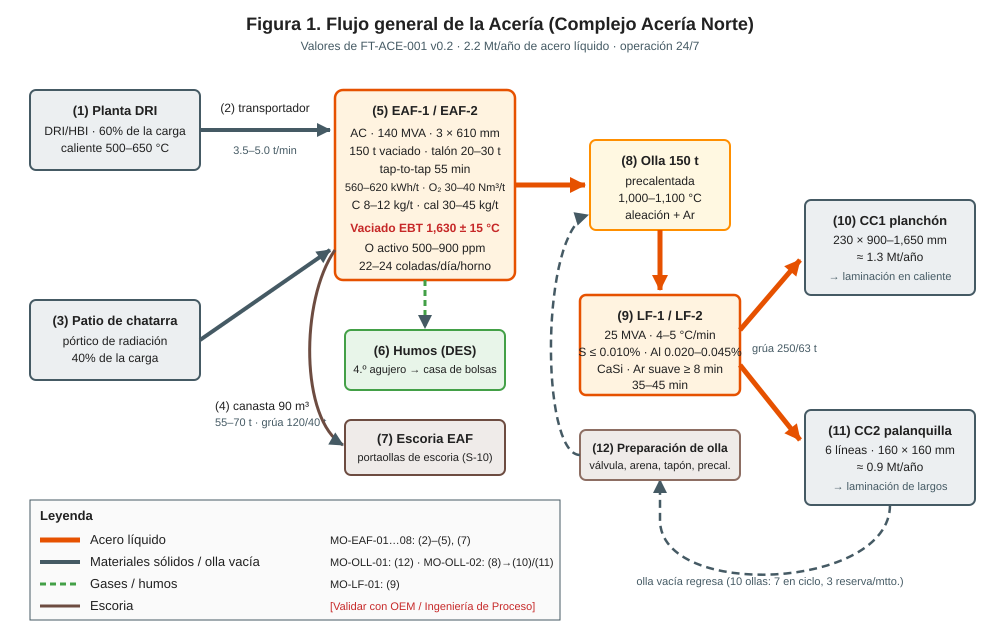
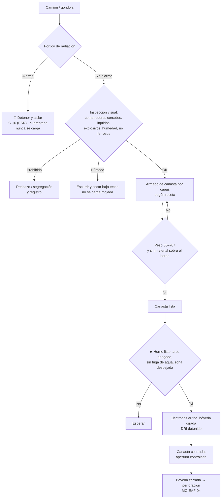

# MO-EAF-02 — Carga de chatarra con canasta

| Código | Versión | Estado | Área | Dueño del proceso | Elaboró | Revisión técnica | Revisión de seguridad | Aprobó | Fecha | Próxima revisión |
|---|---|---|---|---|---|---|---|---|---|---|
| MO-EAF-02 | 0.1 | Borrador para validación | Hornos — Patio de chatarra y EAF-1 / EAF-2 | C-05 Supervisor de Hornos | experto-operativo-metalurgia | experto-operativo-metalurgia — visto bueno con observaciones, 2026-09-25 | experto-seguridad-salud — visto bueno con observaciones, 2026-09-25 | Pendiente (Gerente de Acería / Director) | 2026-09-25 | 2027-09-25 |

> Valores técnicos tomados de `FT-ACE-001` v0.3. Lo marcado **[Validar con OEM / Ingeniería de Proceso]** o **[Supuesto]** no se usa en planta hasta que C-07 lo valide.

## 1. Objetivo y alcance
**Objetivo:** cargar al horno una canasta de **55–70 t** (objetivo 65 t) de chatarra **seca, libre de materiales prohibidos**, bien acomodada, en **≤ 3 min** por canasta y sin personas expuestas.

**Alcance:** desde la recepción de chatarra en el patio (pórtico de radiación e inspección) y el armado de la canasta, hasta que la bóveda cierra sobre la carga y S-01 inicia la perforación (MO-EAF-04). Incluye la 2.ª canasta cuando la receta la pide (40% de la carga metálica es chatarra en 1–2 canastas).
**No incluye:** mantenimiento de la grúa (MM-GR-01) ni la alimentación de DRI (MO-EAF-03).

## 2. Roles y responsabilidades
| Rol | Responsabilidad en este proceso | R/A/C/I |
|---|---|---|
| C-05 Supervisor de Hornos | Dueño. Autoriza cargas con desviación de peso o mezcla. Detiene la carga ante cualquier duda de humedad o material prohibido. | A |
| C-17 Supervisor de Patio de Chatarra y Materiales | Asegura la mezcla (receta), la inspección de chatarra y la cuarentena de rechazos. | A (patio) |
| S-05 Operador de Patio de Chatarra | Inspecciona, segrega, arma la canasta por capas, pesa y registra. Atiende el pórtico de radiación. | R |
| S-04 Operador de Grúa de Carga | Traslada la canasta (grúa 120/40 t), la centra sobre el horno y la abre. | R |
| S-01 Primer Hornero | Prepara el horno para recibir la carga (arco apagado, electrodos arriba, bóveda girada) y confirma zona despejada. | R |
| C-16 Especialista de Seguridad e Higiene de Acería (función de Encargado de Seguridad Radiológica, ESR, con licencia de la CNSNS; CAT-ACE-001) | Atiende como ESR las alarmas del pórtico de radiación (MS-ACE-07). | C |
| C-07 Ingeniero de Proceso | Define la receta de carga y los límites de residuales (Cu, Sn, Ni, Cr). | C |

## 3. Descripción del proceso
La chatarra entra por el **pórtico de radiación**, se inspecciona y se clasifica por tipo. S-05 arma la canasta de **90 m³** en capas según la receta, la pesa y la deja lista. Cuando S-01 declara el horno listo (MO-EAF-01), S-04 lleva la canasta, S-01 sube los electrodos y gira la bóveda, y la canasta se abre en el centro del horno sobre el talón líquido. La bóveda regresa y comienza la perforación.

**Acomodo de la canasta (de abajo hacia arriba):** (1) capa de chatarra ligera/rebaba ≈ 10–15% que amortigua el golpe sobre el fondo de la canasta y la solera; (2) chatarra pesada ≤ 20% de la carga, en el centro, lejos de las paredes; (3) chatarra media; (4) chatarra ligera arriba para una perforación rápida. Nunca pesados arriba (rompen electrodos) [Validar con Ingeniería de Proceso].

## 4. Equipos y maquinaria
| Equipo / componente | Función | Especificación clave | Condición para operar (verificación) |
|---|---|---|---|
| Pórtico de radiación | Detecta fuentes radiactivas en camiones y góndolas | Umbral de alarma fijado por el ESR (C-16) [Validar con OEM / Ingeniería de Proceso] | Prueba con fuente de verificación al inicio de turno; sin alarma de falla |
| Grúa electroimán / pulpo del patio | Arma la canasta | — | Inspección previa al uso |
| Canasta de chatarra | Transporta y descarga la carga | 90 m³; apertura de concha (clamshell) | Concha cierra sin holgura; seguros y orejas sin grieta; canasta seca (sin agua acumulada) |
| Báscula de canasta o celda de carga de grúa | Pesa la carga | Exactitud ± 0.5 t [Supuesto] | Verificación de cero antes de pesar |
| Grúa de carga (nave de hornos) | Traslada y abre la canasta | 2 × 120/40 t | Frenos, límites, gancho y cable revisados (misma práctica de MM-GR-01, que en CAT-ACE-001 cubre solo las grúas de colada); gancho auxiliar para apertura |
| Bóveda y sistema de giro | Descubre el horno para la carga | — | Enclavamientos: sin arco con bóveda abierta |
| Electrodos (3 × 610 mm) | — | Se elevan al tope antes de girar la bóveda | Posición "arriba" confirmada en HMI |

## 5. Parámetros de operación
| Parámetro | Unidad | Objetivo | Rango normal | Alarma / límite | Acción si está fuera de rango | Dónde se mide |
|---|---|---|---|---|---|---|
| Peso de canasta | t | 65 | 55–70 | > 70 t o < 50 t | > 70 t: retira material; < 50 t: completa o avisa a C-05 para ajustar DRI | Báscula / celda de grúa |
| Volumen / llenado | m³ | ≤ 90 | — | Material sobre el borde | Retira el excedente: la bóveda no cierra y se rompen electrodos | Visual |
| Densidad aparente de la carga | t/m³ | 0.70 | 0.6–0.8 [Supuesto] | < 0.55 | Avisa a C-17: requiere 2.ª canasta | Cálculo nivel 2 |
| Chatarra pesada en la canasta | % | ≤ 20 | 10–20 | > 20% o pieza > 1.5 t [Supuesto] | Redistribuye; pieza pesada al centro, nunca arriba | Receta / S-05 |
| Dimensión máxima de pieza | m | ≤ 1.5 × 0.6 [Supuesto] | — | Mayor | Corta con oxicorte en patio | Visual |
| Humedad de la chatarra | — | Sin agua visible ni escurrimiento | — | Agua, hielo, lodo o nieve visibles | ★ No cargar: escurrir/secar bajo techo | Visual S-05 |
| Pórtico de radiación | cps sobre fondo | Sin alarma | — | Alarma | 🛑 Detener e aislar el vehículo; C-16 (ESR) | Consola del pórtico |
| Residuales (Cu) de la mezcla calculada | % | ≤ 0.15 [Supuesto] | — | > 0.20% [Supuesto] | Ajusta receta con C-07 (más DRI/chatarra limpia) | Nivel 2 |
| Tiempo de carga (arco apagado) | min | 3 | 2–4 | > 5 min | Registra demora | Nivel 2 |
| Altura de la canasta sobre el borde de la coraza al abrir | m | 0.5–1.0 [Validar con OEM / Ingeniería de Proceso] | — | > 1.5 m | Baja la canasta: la caída alta proyecta metal y daña la solera | Visual S-04 |

**Chatarra prohibida (rechazo obligatorio):** contenedores cerrados (tanques, tambores, cilindros, tubos tapados, amortiguadores), líquidos (aceite, agua, combustible, refrigerante), explosivos, municiones o artefactos sin detonar, fuentes radiactivas o **cualquier rechazo del pórtico**, baterías, materiales con plomo o cobre en exceso, hielo, nieve, lodo, llantas y plásticos en exceso.

**Clasificación de chatarra y posición en la canasta (referencia)** [Validar con C-17 / C-07]:

| Tipo de chatarra | Densidad aparente típica (t/m³) [Supuesto] | Posición en la canasta | Observaciones |
|---|---|---|---|
| Rebaba / viruta (ligera) | 0.4–0.6 | Fondo (10–15%) | Amortigua; libre de aceite y refrigerante |
| Paquete ligero (lámina prensada) | 0.8–1.2 | Fondo o arriba | Revisar que no contenga contenedores cerrados |
| Fragmentada (shredded) | 1.0–1.3 | Centro y arriba | Buena fusión; baja en residuales |
| Pesada (vigas, placa, rieles cortados) | 1.0–1.5 | Centro, lejos de paredes, nunca arriba | Pieza ≤ 1.5 t [Supuesto]; corta la sobredimensión |
| Retorno interno (despuntes, colas, costras) | 1.5–2.5 | Centro | Conocida en residuales; sin escoria adherida en exceso |
| Hierro de primera fusión frío (si se usa) | 3.0–3.5 | Centro | Aporta C; seco |

## 6. Seguridad
### 6.1 Peligros y controles críticos
| Peligro | Consecuencia | Control crítico | Verificación |
|---|---|---|---|
| Humedad, líquidos o contenedores cerrados en la carga | Explosión al contacto con el talón líquido; proyección de metal | ★ Inspección visual en patio, segregación, chatarra húmeda no se carga; canasta seca | Registro de inspección por canasta; VCC mensual |
| Explosivos / municiones | Explosión | ★ Inspección y rechazo; protocolo con autoridades | Registro de rechazos |
| Fuente radiactiva | Exposición a radiación, contaminación de acero y planta | ★ Pórtico de radiación en todo ingreso; segunda pasada; rechazo no se toca; ESR (C-16) y CNSNS (MS-ACE-07) | Prueba diaria del pórtico |
| Carga suspendida (canasta de hasta ≈ 105 t con tara [Supuesto]) | Aplastamiento | ★ Nadie bajo la canasta ni en su trayectoria; ruta definida; señalero | Supervisor / VCC |
| Personas cerca del horno al abrir la canasta | Quemaduras por flama y proyección | ★ Zona de exclusión en piso de carga; bocina de aviso; conteo antes de abrir | S-01 confirma zona libre por radio |
| Arco o movimiento con bóveda abierta | Electrocución, arco sin control | Enclavamiento eléctrico bóveda–interruptor | Prueba de enclavamiento (mantenimiento) |
| Polvo y humos al abrir | Exposición a partículas y CO | Extracción en nave (canopy), cabina presurizada de grúa | Monitoreo de higiene |

### 6.2 EPP obligatorio
Patio: casco, lentes, guantes de carnaza, botas con metatarsal, chaleco de alta visibilidad, protección auditiva, dosímetro/detector si lo exige el ESR (C-16). Piso de hornos durante la carga: además ropa ignífuga, careta con visor dorado y chaqueta aluminizada si la persona debe estar en el piso (solo fuera de la zona de exclusión). Operador de grúa: cabina cerrada y presurizada.

### 6.3 Permisos, bloqueos y zonas de exclusión
- ★ **Zona de exclusión de carga (MS-ACE-01):** zona roja ≤ 15 m del horno con la plataforma despejada, y ruta de la canasta ± 5 m; zona amarilla 15–30 m. Nadie a pie en la roja (el señalero, en el refugio) desde que la canasta se levanta hasta que la bóveda cierra; delimitada y con bocina.
- ★ **Humedad (MS-ACE-03):** no se carga una canasta que gotea ni chatarra con agua, hielo o lodo; se escurre y C-17 la libera. Recipientes cerrados se cortan o perforan antes de cargarse.
- La grúa no pasa la canasta sobre púlpitos, pasillos ni personas (MS-ACE-04).
- Rechazos del pórtico: camión a la zona de aislamiento, perímetro inicial de 10 m; solo el ESR (C-16) autoriza el manejo (MS-ACE-07).
- No se requiere LOTO para la carga normal; el enclavamiento bóveda–interruptor es el control de ingeniería. Cualquier trabajo sobre la canasta atorada o en la bóveda requiere LOTO (MS-ACE-02).

## 7. Calidad
| Variable crítica de calidad | Especificación | Método / frecuencia | Registro | Defecto si falla |
|---|---|---|---|---|
| Mezcla según receta | Tipos y % según grado (C-07) | Registro de cargas del electroimán, por canasta | Nivel 2 | Residuales fuera de especificación (Cu, Sn, Ni, Cr) |
| Peso de canasta | 55–70 t | Báscula, por canasta | Nivel 2 | Peso de vaciado fuera de 150 t; energía mal calculada |
| Limpieza de la chatarra | Sin no ferrosos visibles, tierra ni plásticos en exceso | Visual, por canasta | Inspección de patio | Más escoria, más kWh/t, menor rendimiento metálico |
| Rendimiento metálico | Según balance de C-07 [Supuesto: ≥ 88% de la carga metálica total] | Por colada | Nivel 2 | Costo |

## 8. Procedimiento paso a paso
| # | Paso | Cómo hacerlo (detalle y medición) | Criterio de aceptación | ★ | Rol |
|---|---|---|---|---|---|
| 1 | Verifica el pórtico al inicio de turno | Prueba con la fuente de verificación; registra. Si no responde: 🛑 no se recibe chatarra; avisa al ESR (C-16). | Pórtico responde | ★ | S-05 |
| 2 | Pasa cada camión/góndola por el pórtico | ≤ 8 km/h [Validar con OEM]; espera el "libre". Si hay alarma: segunda pasada; si confirma, detén, aísla a 10 m, no descargues, avisa al ESR (C-16) y a C-17 (MS-ACE-07). | Sin alarma | ★ | S-05 |
| 3 | Inspecciona la chatarra descargada | Busca contenedores cerrados, líquidos, explosivos, humedad, no ferrosos. Separa lo prohibido en el área de rechazo. | Sin material prohibido | ★ | S-05 |
| 4 | Revisa la canasta vacía | Concha cerrada, seguros, orejas; sin agua acumulada en el fondo. Una canasta cargada que gotea no se traslada: se escurre y C-17 la libera (MS-ACE-03). | Canasta seca y sin daño | ★ | S-05 |
| 5 | Arma por capas según receta | Ligera al fondo (10–15%), pesada al centro (≤ 20%), media, ligera arriba. | Receta cumplida; nada sobre el borde | 🔎 | S-05 |
| 6 | Pesa y registra | Cero de báscula, pesa, registra número de canasta, peso y mezcla. | 55–70 t | 🔎 | S-05 |
| 7 | Espera "horno listo" | S-01 avisa por radio (MO-EAF-01 completo). | Aviso recibido | | S-04 |
| 8 | Prepara el horno | Detén el DRI, apaga el arco, abre el interruptor, sube electrodos al tope, levanta y gira la bóveda. | HMI: interruptor abierto, electrodos arriba, bóveda girada | ★ | S-01 |
| 9 | Verifica agua y baño a la vista | Con el horno abierto, observa: sin chorros de agua, sin vapor, talón cubierto de escoria. | Sin evidencia de agua | ★ | S-01 |
| 10 | Despeja la zona de exclusión | Bocina; confirma por radio y CCTV que nadie está a ≤ 15 m del horno ni a ± 5 m de la ruta (MS-ACE-01). | Confirmación "zona libre" | ★ | S-01 / S-04 |
| 11 | Traslada la canasta | Altura mínima segura; velocidad reducida; sin pasar sobre personas. | Ruta libre | ★ | S-04 |
| 12 | Centra y baja la canasta | Centro de la canasta sobre el centro del horno; fondo a 0.5–1.0 m sobre el borde de la coraza. | Canasta centrada | | S-04 |
| 13 | Abre la concha | Apertura controlada con el gancho auxiliar; observa flama y proyecciones. | Carga completa dentro del horno | | S-04 |
| 14 | Retira la canasta | Sube y retira por la ruta; verifica que no quedó material colgado. | Canasta vacía | | S-04 |
| 15 | Cierra la bóveda | Gira y baja la bóveda; verifica asiento (sin chatarra sobre el borde que impida cerrar). | Bóveda asentada; enclavamiento OK | | S-01 |
| 16 | Inicia perforación | Pasa a MO-EAF-04 con tap bajo. | Arco estable | | S-01 |
| 17 | 2.ª canasta (si aplica) | Repite 7–16 cuando la 1.ª esté fundida ≥ 70% y haya volumen [Validar con Ingeniería de Proceso]. | Mismo criterio | ★ | S-01 / S-04 |

## 9. Condiciones anormales y respuesta
| Síntoma / alarma | Causa probable | Acción inmediata | A quién avisar |
|---|---|---|---|
| Alarma del pórtico de radiación | Fuente sellada o material contaminado | 🛑 Detén el vehículo, segunda pasada ≤ 8 km/h; si confirma: no descargues, camión a la zona de aislamiento, perímetro de 10 m [Validar con el ESR], chofer fuera, registra placas (MS-ACE-07) | C-16 (ESR), C-17, C-04 |
| Explosión o proyección fuerte al abrir la canasta | Humedad o contenedor cerrado | Todos fuera de la zona; no se abre otra canasta; revisa daños (agua, electrodos, bóveda) | C-05, C-04, C-16 |
| Colapso de chatarra (derrumbe sobre electrodos) durante la perforación | Carga mal acomodada, pesados arriba, perforación rápida | Sube electrodos, baja el tap, revisa corriente y electrodos; si hay electrodo roto, aplica MO-EAF-08 §9 | C-05 |
| Bóveda no cierra | Chatarra sobre el borde de la coraza | No energices; empuja o retira con equipo desde fuera; nunca a mano | C-05 |
| Concha no abre o abre parcialmente | Falla mecánica, chatarra atorada | Retira la canasta sobre zona segura; nadie se acerca; revisa con LOTO de la grúa | C-05, Mantenimiento |
| Peso de canasta > 70 t | Error de armado | No trasladar; retira material | C-17 |
| Chatarra mojada (lluvia) o canasta que gotea | Almacén descubierto | 🛑 No cargar; escurrir y secar bajo techo; C-17 libera la canasta (MS-ACE-03); priorizar chatarra seca | C-17 |

## 10. Registros
- Registro del pórtico: prueba diaria, alarmas, rechazos y actas con el ESR (C-16).
- Registro de inspección y rechazos de chatarra (tipo, origen, proveedor).
- Registro de canasta: número, peso, mezcla, hora de carga, horno y colada (nivel 2).
- Bitácora de la grúa de carga (inspección previa al uso).
- Reporte de incidente o casi-accidente, si aplica.

## 11. Competencia requerida y certificación
| Rol | Nivel requerido (1–4) | Formación teórica (h) | OJT supervisado (h / eventos) | Evaluación (pasos ★) | Vigencia |
|---|---|---|---|---|---|
| S-05 Operador de Patio | 3 | 16 (incluye 4 h de radiación con el ESR, C-16) | 60 h / 40 canastas | Pasos 1, 2, 3, 4 + identificación de material prohibido con muestras | 24 meses (TD-P07); pórtico y fuentes radiactivas 12 meses (MS-ACE-07) |
| S-04 Operador de Grúa de Carga | 3 | 24 (NOM-006 + grúa) | 80 h / 40 cargas | Pasos 10, 11, 17 + inspección previa de la grúa | 12 meses (grúas/izaje) |
| S-01 Primer Hornero | 3 | 8 | 20 cargas | Pasos 8, 9, 10, 17 | 24 meses (TD-P07) |
| C-17 Supervisor de Patio | 4 (evaluador) | 16 + evaluador | — | Evaluación de la respuesta a alarma del pórtico | 12 meses (fuentes radiactivas, MS-ACE-07) |

Lista corta de verificación de pasos ★:
1. Identifica los 6 grupos de chatarra prohibida y lo que se hace con cada uno.
2. Responde correctamente a una alarma del pórtico (detener, aislar, avisar; no tocar).
3. No carga chatarra húmeda ni una canasta con agua.
4. Confirma el horno abierto sin agua y la zona de exclusión despejada antes de trasladar.
5. Traslada sin pasar la carga sobre personas.
6. Prueba el pórtico al inicio del turno y no recibe chatarra si falla (paso 1).
7. Prepara el horno (interruptor abierto, electrodos arriba) y verifica que no hay agua a la vista antes de cargar (pasos 8 y 9).

## 12. Referencias
- FT-ACE-001 §2 y §6; CAT-ACE-001; MO-EAF-01, MO-EAF-03, MO-EAF-04, MO-EAF-08.
- MS-ACE-01, MS-ACE-03, MS-ACE-04, MS-ACE-07; MM-GR-01.
- NOM-006-STPS (manejo de materiales), NOM-012-STPS (radiaciones ionizantes), NOM-017-STPS (EPP), NOM-011-STPS (ruido); regulación de la CNSNS; manejo de artefactos explosivos con autoridad competente — verificar con Jurídico Laboral / SSO.
- Manual OEM de la canasta, la grúa y el pórtico [por referenciar]; especificación de compra de chatarra de GASM [por referenciar].
- TD-P07.

## 13. Control de cambios
| Versión | Fecha | Cambio | Autor |
|---|---|---|---|
| 0.1 | 2026-09-25 | Emisión inicial para validación | experto-operativo-metalurgia |
| 0.1 | 2026-09-25 | Revisión técnica cruzada contra FT-ACE-001 v0.3: C-16 citado como ESR (se retira "OSR" fuera de §6); nota sobre MM-GR-01 para la grúa de carga. §6 conserva "OSR": lo corrige experto-seguridad-salud. | experto-operativo-metalurgia |
