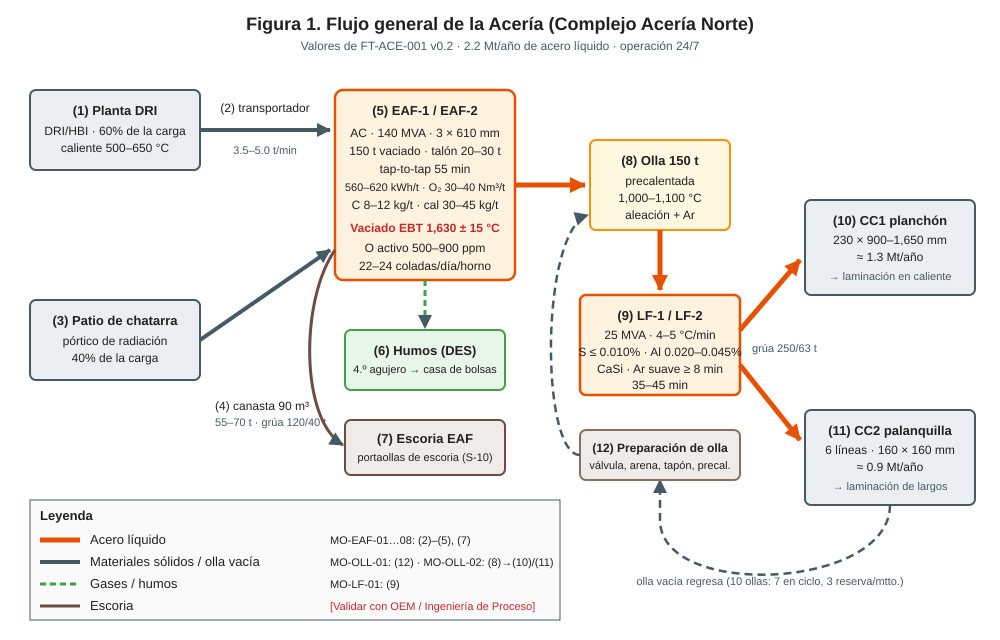
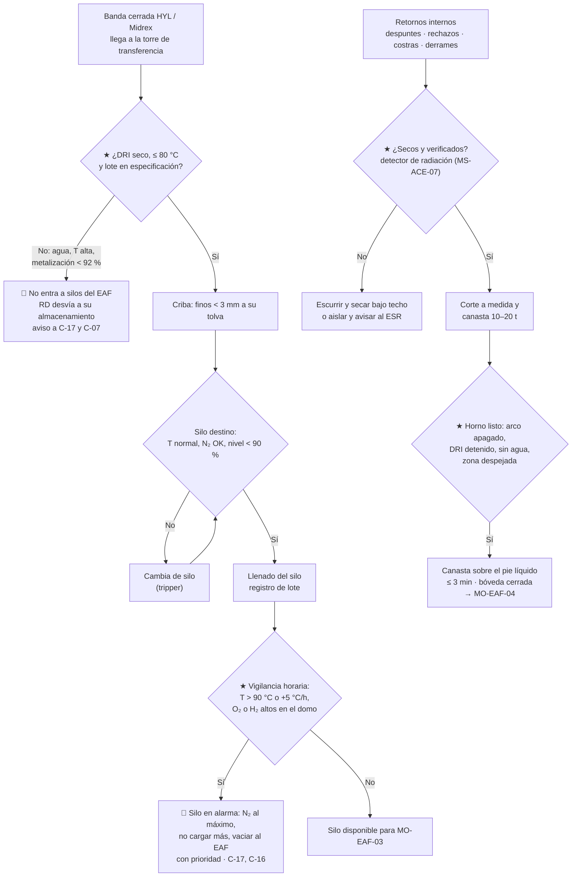

# MO-EAF-02 — Recepción de DRI por bandas, silos de día y carga de retornos internos

| Código | Versión | Estado | Área | Dueño del proceso | Elaboró | Revisión técnica | Revisión de seguridad | Aprobó | Fecha | Próxima revisión |
|---|---|---|---|---|---|---|---|---|---|---|
| MO-EAF-02 | 0.2 | Borrador para validación | Hornos — Manejo de materiales (bandas de DRI, silos de día, fundentes, retornos) y EAF-1 / EAF-2 | C-17 Supervisor de Manejo de Materiales (DRI, fundentes y retornos) | experto-operativo-metalurgia | experto-operativo-metalurgia — visto bueno técnico v0.2, 2026-09-28 | experto-seguridad-salud — **pendiente para v0.2** (v0.1 con observaciones, 2026-09-25) | Pendiente (Gerente de Acería / Director) | 2026-09-28 | 2027-09-28 |

> Valores técnicos tomados de `FT-ACE-001` v0.4 (§2, §2.1, §2.2 y §6) y de `CV-GASM-001` §4.2. Lo marcado **[Validar con OEM / Ingeniería de Proceso]** o **[Supuesto]** no se usa en planta hasta que C-07 lo valide.
>
> **Por qué cambió este manual (D-010):** GASM no compra chatarra. Ya no hay patio de chatarra, electroimanes de patio ni pórtico de radiación para camiones. La carga del EAF es **≈ 95–100 % DRI de pelet propio** que llega por **bandas cerradas desde HYL y Midrex**, y solo se recirculan **retornos internos ≤ 5 %**.

## 1. Objetivo y alcance
**Objetivo:** recibir el DRI de las plantas HYL y Midrex **seco, frío o tibio (≤ 80 °C) y en especificación**; guardarlo en los **silos de día** sin autocalentamiento; tener siempre **≥ 8 h de autonomía** (objetivo 12 h) para los dos hornos; tener cal y dolomita disponibles; y preparar y cargar los **retornos internos** secos en una canasta de **10–20 t** cuando C-05 la programe, en **≤ 3 min** con el arco apagado y sin personas expuestas.

**Alcance:**
- **Parte A — DRI:** desde la **torre de transferencia** a la entrada de la nave de silos (límite de batería con Reducción Directa [Supuesto]) hasta la salida de los silos hacia las básculas dosificadoras.
- **Parte B — Fundentes:** recepción y nivel de las tolvas de cal y dolomita calcinada.
- **Parte C — Retornos internos:** recepción, verificación, secado, corte y armado de la canasta.
- **Parte D — Carga de la canasta de retornos** al horno sobre el pie líquido (1 de cada 2–4 coladas) y en el **arranque en frío** (40–60 t).

**No incluye:** la operación de las plantas HYL y Midrex ni de sus bandas antes de la torre de transferencia (`10-plantas/03-reduccion-directa/`); la dosificación de DRI al horno por kg/min/MW (MO-EAF-03); el mantenimiento de bandas, silos y grúa (plan de mantenimiento de Acería y MM-GR-01).

## 2. Roles y responsabilidades
| Rol | Responsabilidad en este proceso | R/A/C/I |
|---|---|---|
| C-17 Supervisor de Manejo de Materiales (DRI, fundentes y retornos) | Dueño. Asegura inventario, calidad y temperatura del DRI en silos; decide el silo en servicio; libera o retiene lotes; enlace en turno con Reducción Directa; autoriza cada canasta de retornos con C-05. | A |
| S-05 Operador de Manejo de DRI y Retornos | Vigila bandas, torre de transferencia, criba, silos (nivel, temperatura, N₂, gases) y tolvas de fundentes; registra; recibe, verifica, seca, corta y arma los retornos; pesa la canasta. | R |
| S-04 Operador de Grúa de Carga | Traslada la canasta de retornos (grúa 120/40 t), la centra sobre el horno y la abre. | R |
| S-01 Primer Hornero | Prepara el horno para recibir la canasta (DRI detenido, arco apagado, electrodos arriba, bóveda girada) y confirma zona despejada. Confirma el silo en servicio para su horno. | R |
| C-05 Supervisor de Hornos | Programa la canasta de retornos en la secuencia de coladas y el arranque en frío. | C |
| C-07 Ingeniero de Proceso EAF / LF | Fija la proporción HYL/Midrex por el carbono objetivo, los límites de calidad del DRI y las reglas de uso de retornos por grado. | C |
| C-16 Especialista de Seguridad e Higiene de Acería (ESR, con licencia de la CNSNS) | Atiende alarmas de gases en silos y galerías y las alarmas del detector de radiación de retornos (MS-ACE-06, MS-ACE-07). | C |
| Operador de banda / panel de Reducción Directa (fuera de la Acería) | Informa la calidad de cada lote (metalización, C, finos, temperatura) y cualquier evento de agua o de calentamiento; desvía el DRI a su almacenamiento si la Acería no puede recibir. | I / C |

## 3. Descripción del proceso
Cada planta de reducción directa descarga su DRI **frío o tibio** a una **banda cerrada** que llega a la **torre de transferencia** de la Acería. Ahí se pesa (báscula de banda), se muestrea y se mide la temperatura. Una **criba** separa los finos (< 3 mm), que van a su propia tolva y **no se alimentan por el 5.º agujero**. Un carro distribuidor (tripper) llena uno de los **4 silos de día** (≈ 1,000 t cada uno, 2 por horno). Los silos están cerrados, **inertizados con N₂** y tienen termopares en varios niveles y medición de gases en el domo, porque el DRI se reoxida y se calienta solo si entra aire o agua. Desde los silos, las básculas dosificadoras entregan el DRI a la banda del 5.º agujero (MO-EAF-03), junto con la cal y la dolomita.

Los **retornos internos** (despuntes y colas de CC, planchones y palanquillas rechazados, costras de olla y de distribuidor, derrames) se juntan en un **área techada** de la nave de hornos, se verifican, se secan, se cortan a medida y se cargan en una **canasta de 90 m³** que entra al horno solo de vez en cuando.

## 4. Equipos y maquinaria
| Equipo / componente | Función | Especificación clave | Condición para operar (verificación) |
|---|---|---|---|
| Bandas de DRI desde HYL y desde Midrex (tramo de la Acería) | Traen el DRI | 2 bandas cerradas, ≈ 250 t/h cada una [Supuesto] | Cubiertas y sellos en buen estado; sin goteras ni fugas de agua cerca; cordones de paro de emergencia probados |
| Torre de transferencia | Límite de batería RD / Acería | Báscula de banda, muestreador automático, pirómetro o termografía [Validar con OEM] | Báscula verificada; muestreador sin atasco |
| Criba de finos | Separa < 3 mm | Finos a tolva propia | Malla sin rotura; tolva de finos con nivel |
| Carro distribuidor (tripper) | Elige el silo destino | — | Posición confirmada en HMI |
| Silos de día (4) | Almacenan DRI para 12 h | ≈ 1,000 t cada uno; 2 por EAF [Supuesto] | Cerrados; N₂ en servicio; termopares y analizadores de gases sin falla; nivel por radar |
| Sistema de inertización con N₂ | Evita la reoxidación | Caudal y presión según OEM [Validar con OEM] | Presión de suministro en rango; sin alarma de bajo flujo |
| Analizadores de gases del domo | Detectan O₂, CO e H₂ | Alarmas en §5 | Calibración vigente (C-16) |
| Tolvas de cal y dolomita calcinada | Fundentes para MO-EAF-03 / 05 | Cal 45–65 kg/t; dolomita 15–25 kg/t | Material seco; descarga neumática sin fugas |
| Área techada de retornos | Guarda y prepara retornos | Separada por tipo y grado; piso seco | Techo sin goteras; sin charcos |
| Detector de radiación de retornos | Verifica metal que vuelve de otras áreas | Umbral fijado por el ESR (C-16) (MS-ACE-07) | Prueba con fuente de verificación al inicio de turno |
| Equipo de corte (oxicorte) y cargador / grúa con electroimán del área de retornos | Corta y acomoda retornos | Pieza ≤ 1.5 × 0.6 m [Supuesto] | Inspección previa al uso |
| Canasta de 90 m³ | Carga de retornos al horno | Concha (clamshell) | Concha cierra sin holgura; seguros y orejas sin grieta; **canasta seca** |
| Báscula de canasta o celda de carga de grúa | Pesa la canasta | ± 0.5 t [Supuesto] | Verificación de cero antes de pesar |
| Grúa de carga (nave de hornos) | Traslada y abre la canasta | 2 × 120/40 t | Frenos, límites, gancho y cable revisados (misma práctica de MM-GR-01); gancho auxiliar para apertura |
| Bóveda, giro y electrodos | Descubren el horno para la canasta | Enclavamiento: sin arco con bóveda abierta | Electrodos "arriba" confirmados en HMI |

## 5. Parámetros de operación
| Parámetro | Unidad | Objetivo | Rango normal | Alarma / límite | Acción si está fuera de rango | Dónde se mide |
|---|---|---|---|---|---|---|
| Autonomía de silos (ambos EAF) | h | 12 | 8–14 | < 8 h; < 4 h crítico | < 8 h: avisa a C-17 y a RD; < 4 h: C-05 baja el ritmo de colada | HMI de silos |
| Nivel de cada silo | % | 50–85 | 30–90 | < 20 % o > 95 % | Cambia el silo destino; nunca llenes sobre 95 % | Radar |
| Temperatura del DRI en banda | °C | ≤ 60 | ≤ 80 | > 80 °C | Avisa a RD; si > 100 °C, no lo mandes a silo: RD desvía | Pirómetro de la torre |
| Temperatura del DRI en silo (cualquier nivel) | °C | ≤ 60 | ≤ 80 | **> 90 °C o subida > 5 °C/h** [Validar con OEM] | ★ 🛑 Silo en alarma: N₂ al máximo, no cargar más, vaciar al EAF con prioridad; C-17 y C-16 | Termopares del silo |
| O₂ en el domo del silo | % vol | ≤ 2 | ≤ 5 [Validar con OEM] | > 5 % | Revisa N₂ y sellos; no cargar al silo | Analizador |
| H₂ en el domo del silo | % vol | ≈ 0 | < 0.5 [Validar con OEM] | > 1 % (≈ 25 % del límite inferior de explosividad) | 🛑 Detén el llenado; N₂ al máximo; nadie arriba del silo; C-16 | Analizador |
| CO en el domo del silo | ppm | Bajo | [Validar con OEM] | Subida sostenida | Indica reoxidación: trata como alarma de temperatura | Analizador |
| Metalización del lote | % | ≥ 93 | ≥ 92 | < 92 % | C-07 decide: mezclar con otro silo o bajar la tasa en MO-EAF-03 | Muestreo / certificado de RD |
| Carbono de la mezcla HYL/Midrex | % | 2.8 | 2.2–3.0 | > 3.2 % o < 1.8 % | C-07 ajusta la proporción HYL/Midrex | Nivel 2 (cálculo por lote) |
| Finos < 3 mm a la llegada | % | ≤ 3 | ≤ 5 | > 5 % | Avisa a RD; revisa la criba | Muestreo |
| Humedad del DRI | — | Seco | Sin agua visible | Cualquier evidencia de agua o reporte de RD | ★ 🛑 No entra a silos del EAF; RD desvía | Visual / reporte de RD |
| Nivel de tolvas de cal y dolomita | % | ≥ 50 | 30–90 | < 20 % | Pide descarga; C-17 | HMI |
| Retornos en la carga | % de la carga metálica | ≈ 3 | ≤ 5 | > 5 % promedio en el turno | C-17 y C-05 espacian las canastas | Nivel 2 |
| Peso de la canasta de retornos | t | 15 | 10–20 (arranque en frío 40–60) | > 20 t en colada normal; > 60 t en arranque en frío | Retira material | Báscula / celda |
| Dimensión máxima de pieza | m | ≤ 1.5 × 0.6 [Supuesto] | — | Mayor | Corta con oxicorte | Visual |
| Humedad de los retornos | — | Secos | — | Agua, lodo o escurrimiento visibles | ★ No cargar: escurrir y secar bajo techo; C-17 libera | Visual S-05 |
| Tiempo de carga de la canasta (arco apagado) | min | 3 | 2–4 | > 5 min | Registra la demora | Nivel 2 |
| Altura de la canasta sobre el borde de la coraza al abrir | m | 0.5–1.0 [Validar con OEM] | — | > 1.5 m | Baja la canasta: la caída alta proyecta metal y daña la solera | Visual S-04 |

**Reglas de uso de retornos por grado** [Validar con C-07]:

| Tipo de retorno | Densidad aparente típica (t/m³) [Supuesto] | Se puede cargar en | No se carga en | Observaciones |
|---|---|---|---|---|
| Despuntes y colas de palanquilla de varilla (C 0.25–0.35 %, Mn 0.8–1.2 %) | 2.0–3.0 | Varilla y barras | Bajo carbono al Al (sube Mn y C) | Secos; sin escoria de corte |
| Despuntes y rechazos de planchón bajo carbono | 2.0–3.0 | Todos los grados | — | El retorno más "limpio" |
| Despuntes y rechazos de HSLA (Nb 0.02–0.05 %) | 2.0–3.0 | HSLA | Bajo carbono al Al | Nb residual |
| Costras de olla y de distribuidor, derrames | 1.5–2.5 | Varilla y barras | Bajo carbono al Al (arrastran escoria y Al₂O₃) | ★ Si se enfriaron con agua: escurrir y secar bajo techo antes de cargar |
| Metal recuperado de escoria | 1.5–2.5 | Varilla y barras | Bajo carbono al Al | Con escoria adherida: más escoria y P |

## 6. Seguridad
### 6.1 Peligros y controles críticos
| Peligro | Consecuencia | Control crítico | Verificación |
|---|---|---|---|
| DRI húmedo (lluvia, gotera, fuga de agua en banda o silo) | Vapor e H₂ al llegar al baño: explosión en el horno; reoxidación y calentamiento en el silo | ★ Bandas cubiertas y silos cerrados; lote con agua no entra a silos del EAF; nunca rociar agua sobre DRI | Rondín por turno; registro de lote; VCC |
| Autocalentamiento del DRI en silo (reoxidación) | Incendio en silo, CO e H₂ | ★ Inertización con N₂; alarma de T > 90 °C o +5 °C/h; silo en alarma se vacía al EAF; agente de extinción definido por Seguridad (no agua) | Tendencia horaria de T; prueba de alarmas |
| Acumulación de H₂ o CO en el domo del silo o en galerías | Explosión, intoxicación | ★ Analizadores con alarma; ventilación; nadie arriba del silo con alarma | Registro de alarmas; calibración |
| Nitrógeno de inertización | Asfixia en silos, galerías cerradas y torre | ★ Entrada solo con permiso de espacio confinado, purga y medición: O₂ 19.5–23.5 %, CO < 25 ppm, H₂ y combustibles < 10 % LEL (MS-ACE-05, MS-ACE-06) | Permiso firmado con lecturas |
| Partes móviles de bandas y criba | Atrapamiento, amputación | Guardas; cordones de paro; limpieza de derrames solo con LOTO (MS-ACE-02) | Inspección de guardas |
| Polvo de DRI y de cal | Inhalación; explosión de polvo; quemadura química (cal) | Colección de polvo, limpieza programada, sin fuentes de ignición; respirador y lentes | Programa de limpieza |
| Retornos mojados o con recipientes cerrados (tubos tapados, piezas huecas) | Explosión al contacto con el pie líquido | ★ Retornos secos; costras enfriadas con agua se escurren y secan bajo techo; piezas huecas se cortan o abren | Registro de inspección por canasta |
| Metal con contaminación radiactiva que vuelve de otra área | Exposición | Detector de radiación de retornos; aislar y avisar al ESR (MS-ACE-07) | Prueba diaria del detector |
| Carga suspendida (canasta con retornos: ≈ 55–65 t con tara; hasta ≈ 105 t en arranque en frío [Supuesto]) | Aplastamiento | ★ Nadie bajo la canasta ni en su trayectoria; ruta definida; señalero | Supervisor / VCC |
| Personas cerca del horno al abrir la canasta | Quemaduras por flama y proyección | ★ Zona de exclusión en piso de carga; bocina; conteo antes de abrir | S-01 confirma zona libre por radio |
| Arco o movimiento con bóveda abierta | Electrocución, arco sin control | Enclavamiento eléctrico bóveda–interruptor | Prueba de enclavamiento (mantenimiento) |

> ⚠️ Esta sección cambió en v0.2 por la redefinición de la carga. **experto-seguridad-salud debe validarla** (en particular el agente de extinción de silos, los límites de H₂/CO/O₂ y la verificación radiológica de retornos).

### 6.2 EPP obligatorio
Bandas, torre y silos: casco, lentes, guantes, botas de seguridad, chaleco de alta visibilidad, protección auditiva, **detector personal multigás (O₂, CO, H₂)** y respirador para polvo según evaluación de NOM-010. Área de retornos: además guantes de carnaza y botas con metatarsal; careta para oxicorte. Piso de hornos durante la carga: además ropa ignífuga, careta con visor dorado y chaqueta aluminizada si la persona debe estar en el piso (solo fuera de la zona de exclusión). Operador de grúa: cabina cerrada y presurizada.

### 6.3 Permisos, bloqueos y zonas de exclusión
- ★ **Espacios confinados:** silos, tolvas, galerías cerradas de bandas y chutes. Entrada solo con permiso, purga de N₂, medición continua y vigía (MS-ACE-05, MS-ACE-06).
- **Bandas, criba, tripper y dosificadores:** limpieza, destrabe o cambio de componentes con LOTO (MS-ACE-02); nunca con la banda en movimiento.
- ★ **Zona de exclusión de carga (MS-ACE-01):** zona roja ≤ 15 m del horno y ruta de la canasta ± 5 m; zona amarilla 15–30 m. Nadie a pie en la roja desde que la canasta se levanta hasta que la bóveda cierra.
- ★ **Humedad (MS-ACE-03):** no se carga una canasta que gotea ni retornos con agua, hielo o lodo; C-17 libera la canasta.
- La grúa no pasa la canasta sobre púlpitos, pasillos ni personas (MS-ACE-04).
- Alarma del detector de radiación: aislar la pieza, perímetro según el ESR (C-16); solo el ESR autoriza el manejo (MS-ACE-07).

## 7. Calidad
| Variable crítica de calidad | Especificación | Método / frecuencia | Registro | Defecto si falla |
|---|---|---|---|---|
| Metalización del DRI | ≥ 92 % (objetivo ≥ 93 %) | Muestreo automático por turno + certificado de RD por lote | Nivel 2 | Más kWh/t (≈ +12 kWh/t por punto), más C, más FeO en escoria |
| Carbono de la mezcla | 2.2–3.0 % | Cálculo por lote y proporción HYL/Midrex | Nivel 2 | C alto: descarburación larga y ebullición; C bajo: FeO alto y pérdida de hierro |
| Finos al 5.º agujero | ≤ 2 % (tras la criba) | Muestreo | Nivel 2 | Pérdida de hierro al 4.º agujero y a la casa de bolsas |
| Ganga ácida del DRI (SiO₂ + Al₂O₃) | 3.5–4.5 % [Supuesto] | Análisis por lote | Laboratorio | Más escoria y más cal; B2 fuera de rango |
| Trazabilidad | Silo y lote de cada colada | Por colada | Nivel 2 | No se puede investigar una colada fuera de grado |
| Retornos por grado | Según la tabla de §5 | Por canasta | Registro de canasta | Mn, C o Nb fuera de rango en bajo carbono |
| Peso de canasta | 10–20 t | Por canasta | Nivel 2 | Peso de vaciado fuera de 150 t |

## 8. Procedimiento paso a paso
| # | Paso | Cómo hacerlo (detalle y medición) | Criterio de aceptación | ★ | Rol |
|---|---|---|---|---|---|
| **A** | **Recepción de DRI** | | | | |
| 1 | Revisa el panel al inicio de turno | Estado de las 2 bandas, niveles y T de los 4 silos, N₂ (presión y caudal), O₂/CO/H₂ en domos, báscula de banda, criba. Registra. | Sin alarmas; autonomía ≥ 8 h | ★ | S-05 |
| 2 | Revisa la calidad de los lotes | Lee en nivel 2 el certificado de RD y el muestreo: metalización, C, finos, ganga, T. | Dentro de §5 | 🔎 | S-05 |
| 3 | Haz el rondín de bandas y torre | Lado Acería: cubiertas cerradas, sin goteras ni agua cerca, sin derrames, guardas en su lugar; detector multigás encendido. No entres a galerías cerradas ni a silos sin permiso (§6.3). | Sin agua ni derrames | ★ | S-05 |
| 4 | Elige el silo destino | Silo con T normal, N₂ OK, nivel < 90 %; posiciona el tripper y confirma en HMI. Nunca a un silo en alarma. | Silo confirmado | | S-05 |
| 5 | Vigila la criba y los finos | Finos a su tolva; malla sin rotura. | Finos separados | | S-05 |
| 6 | Vigila los silos cada hora | Registra T por nivel, O₂, CO, H₂ y nivel. Si T > 90 °C, subida > 5 °C/h, H₂ > 1 % u O₂ > 5 %: aplica §9. | Tendencia estable | ★ | S-05 |
| 7 | Rechaza DRI húmedo o fuera de especificación | Con agua, T > 100 °C en banda o metalización < 92 %: pide a RD que desvíe; avisa a C-17 y C-07. | Lote fuera de los silos del EAF | ★ | S-05 / C-17 |
| 8 | Confirma el silo en servicio con cada horno | Avisa a S-01 qué silo alimenta a cada EAF y la proporción HYL/Midrex fijada por C-07. | Confirmación por radio | | S-05 / S-01 |
| **B** | **Fundentes** | | | | |
| 9 | Revisa las tolvas de cal y dolomita | Nivel ≥ 30 %; material seco; pide descarga con tiempo. | Nivel suficiente para el turno | | S-05 |
| **C** | **Retornos internos** | | | | |
| 10 | Prueba el detector de radiación | Con la fuente de verificación al inicio de turno; registra. Si falla: no recibas retornos de otras áreas; avisa al ESR (C-16). | Detector responde | ★ | S-05 |
| 11 | Recibe y verifica los retornos | Identifica origen y grado; pasa por el detector el metal que viene de otras áreas; sepáralo por tipo según §5. | Retorno identificado | 🔎 | S-05 |
| 12 | Verifica que estén secos | Costras y derrames enfriados con agua: escurrir y secar bajo techo; piezas huecas: cortar o abrir. | Sin agua visible | ★ | S-05 |
| 13 | Corta la sobredimensión | Oxicorte a ≤ 1.5 × 0.6 m [Supuesto], con permiso de trabajo en caliente. | Piezas a medida | | S-05 |
| 14 | Arma la canasta | Revisa la canasta vacía (seca, concha y seguros). Pesados al centro, lejos de las paredes; nada sobre el borde; respeta la regla por grado. | 10–20 t (arranque en frío 40–60 t) | 🔎 | S-05 |
| 15 | Pesa y registra | Cero de báscula; registra número de canasta, peso, tipos y grado destino. | Registro completo | 🔎 | S-05 |
| **D** | **Carga de la canasta de retornos** (cuando C-05 la programa) | | | | |
| 16 | Prepara el horno | Detén el DRI, apaga el arco, abre el interruptor, horno a 0°, sube electrodos al tope, levanta y gira la bóveda. | HMI: interruptor abierto, electrodos arriba, bóveda girada | ★ | S-01 |
| 17 | Verifica agua y baño a la vista | Sin chorros de agua, sin vapor, pie líquido cubierto de escoria. | Sin evidencia de agua | ★ | S-01 |
| 18 | Despeja la zona de exclusión | Bocina; confirma por radio y CCTV que nadie está a ≤ 15 m del horno ni a ± 5 m de la ruta (MS-ACE-01). | "Zona libre" | ★ | S-01 / S-04 |
| 19 | Traslada la canasta | Altura mínima segura; velocidad reducida; sin pasar sobre personas. | Ruta libre | ★ | S-04 |
| 20 | Centra, baja y abre | Centro de la canasta sobre el centro del horno; fondo a 0.5–1.0 m sobre el borde de la coraza; apertura controlada con el gancho auxiliar. | Carga dentro del horno | | S-04 |
| 21 | Retira la canasta y cierra la bóveda | Verifica que no quedó material colgado; gira y baja la bóveda; verifica asiento. | Bóveda asentada; enclavamiento OK | | S-04 / S-01 |
| 22 | Inicia el arranque | Pasa a MO-EAF-04 (arranque con retornos: arco corto 1–2 min hasta cubrir la carga) y reanuda el DRI con rampa (MO-EAF-03). | Arco estable | | S-01 |

## 9. Condiciones anormales y respuesta
| Síntoma / alarma | Causa probable | Acción inmediata | A quién avisar |
|---|---|---|---|
| T de silo > 90 °C o subida > 5 °C/h | Entrada de aire o agua; reoxidación | 🛑 No cargues más a ese silo; N₂ al máximo; prioriza su vaciado al EAF; nadie arriba del silo; sigue el protocolo de Seguridad (no agua) | C-17, C-16, C-07, C-04 |
| H₂ > 1 % u O₂ > 5 % en el domo | DRI húmedo; falla de N₂ o de sellos | 🛑 Detén el llenado; N₂ al máximo; evacua la parte alta del silo; no hay trabajos en caliente cerca | C-16, C-17 |
| Agua en banda o silo (gotera, fuga, lluvia) | Cubierta dañada, fuga de tubería | 🛑 Detén la banda; aísla el lote; RD desvía; el silo afectado no alimenta al EAF hasta que C-07 lo libere | C-17, C-07, RD |
| Autonomía < 8 h | Paro o baja de HYL o Midrex | Avisa a RD y a C-05; con < 4 h, C-05 baja el ritmo de colada. **No hay chatarra de respaldo** | C-17, C-05, C-04 |
| Metalización < 92 % o C fuera de 1.8–3.2 % | Problema en el reactor de RD | C-07 decide mezcla de silos o ajuste de tasa, O₂ y C (MO-EAF-03 / 05) | C-07, RD |
| Finos > 5 % | Degradación del DRI; criba dañada | Revisa la criba; avisa a RD | C-17 |
| Banda detenida o dosificador atascado | Falla mecánica, material grueso | LOTO antes de intervenir; cambia al otro silo del horno | C-17, Mantenimiento |
| Alarma del detector de radiación | Metal contaminado | 🛑 Aísla la pieza, no la toques; perímetro según el ESR (MS-ACE-07) | C-16 (ESR), C-17 |
| Explosión o proyección al abrir la canasta | Retorno mojado o pieza hueca | Todos fuera de la zona; no se abre otra canasta; revisa daños (agua, electrodos, bóveda) | C-05, C-04, C-16 |
| Bóveda no cierra | Retorno sobre el borde de la coraza | No energices; retira con equipo desde fuera; nunca a mano | C-05 |
| Concha no abre o abre parcialmente | Falla mecánica, pieza atorada | Retira la canasta sobre zona segura; nadie se acerca; LOTO de la grúa | C-05, Mantenimiento |

## 10. Registros
- Registro de turno de silos: nivel, T por nivel, O₂/CO/H₂, N₂ y alarmas (nivel 2).
- Registro de lotes de DRI: planta de origen, t, metalización, C, finos, ganga, T y silo destino.
- Trazabilidad silo → colada (nivel 2).
- Rechazos y desvíos de DRI a Reducción Directa, con causa.
- Registro del detector de radiación: prueba diaria y alarmas (actas con el ESR, C-16).
- Registro de canasta de retornos: número, peso, tipos, grado destino, hora, horno y colada.
- Permisos de espacio confinado y LOTO de bandas y silos.
- Reporte de incidente o casi-accidente, si aplica.

## 11. Competencia requerida y certificación
| Rol | Nivel requerido (1–4) | Formación teórica (h) | OJT supervisado (h / eventos) | Evaluación (pasos ★) | Vigencia |
|---|---|---|---|---|---|
| S-05 Operador de Manejo de DRI y Retornos | 3 | 24 (DRI: reoxidación, H₂, N₂; bandas y silos; retornos; 4 h de radiación con el ESR, C-16) | 80 h / 20 turnos de panel + 20 canastas | Pasos 1, 3, 6, 7, 10, 12 + simulacro de silo en alarma | 24 meses (TD-P07); espacios confinados y fuentes radiactivas 12 meses |
| S-04 Operador de Grúa de Carga | 3 | 24 (NOM-006 + grúa) | 40 h / 20 cargas | Pasos 18, 19 + inspección previa de la grúa | 12 meses (grúas/izaje) |
| S-01 Primer Hornero | 3 | 4 (solo parte D y paso 8) | 10 cargas | Pasos 16, 17, 18 | 24 meses (TD-P07) |
| C-17 Supervisor de Manejo de Materiales | 4 (evaluador) | 24 + evaluador | — | Respuesta a silo en alarma y a DRI húmedo | 12 meses (espacios confinados y fuentes radiactivas) |

Lista corta de verificación de pasos ★:
1. Explica por qué el DRI húmedo o caliente es peligroso (reoxidación, H₂, vapor) y rechaza un lote con agua.
2. Lee la tendencia de T de un silo y reconoce la alarma (> 90 °C o +5 °C/h); ejecuta la respuesta sin usar agua.
3. No entra a silos, tolvas ni galerías cerradas sin permiso de espacio confinado y medición de O₂/CO/H₂.
4. Verifica que los retornos estén secos y aplica la regla de retornos por grado.
5. Prueba el detector de radiación al inicio del turno y responde a una alarma (aislar, avisar; no tocar).
6. Prepara el horno (interruptor abierto, electrodos arriba), verifica que no hay agua y despeja la zona antes de trasladar la canasta.

## 12. Referencias
- FT-ACE-001 v0.4 §2, §2.1, §2.2 y §6; CV-GASM-001 §4.2 y §4.3; CAT-ACE-001 v0.2; MO-EAF-01, MO-EAF-03, MO-EAF-04, MO-EAF-08.
- MS-ACE-01, MS-ACE-02, MS-ACE-03, MS-ACE-04, MS-ACE-05, MS-ACE-06, MS-ACE-07; MM-GR-01.
- NOM-006-STPS (manejo de materiales), NOM-033-STPS (espacios confinados), NOM-010-STPS (agentes químicos), NOM-012-STPS (radiaciones ionizantes), NOM-017-STPS (EPP), NOM-004-STPS (maquinaria: bandas); regulación de la CNSNS — verificar con Jurídico Laboral / SSO.
- Manual OEM de bandas, silos, inertización y dosificación [por referenciar]; especificación de DRI de Reducción Directa (`10-plantas/03-reduccion-directa/`) [por referenciar].
- TD-P07.

## 13. Control de cambios
| Versión | Fecha | Cambio | Autor |
|---|---|---|---|
| 0.1 | 2026-09-25 | Emisión inicial para validación como "Carga de chatarra con canasta" | experto-operativo-metalurgia |
| 0.1 | 2026-09-25 | Revisión técnica cruzada contra FT-ACE-001 v0.3: C-16 citado como ESR; nota sobre MM-GR-01 para la grúa de carga. | experto-operativo-metalurgia |
| 0.2 | 2026-09-28 | **Reescritura por la decisión D-010.** Nuevo nombre y archivo (`git mv` desde `MO-EAF-02-carga-chatarra-canasta.md`). Se retiran patio de chatarra, pórtico de camiones, clasificación y chatarra prohibida de compra. Se agregan recepción de DRI por bandas desde HYL y Midrex, silos de día (N₂, T, gases), fundentes, retornos internos por grado y canasta de retornos (10–20 t; arranque en frío 40–60 t). Dueño: C-17 (antes C-05). S-05 = Operador de Manejo de DRI y Retornos. Valores de FT-ACE-001 v0.4. Figura 9 nueva (eaf-manejo-dri-silos.svg). Requiere nueva revisión de seguridad | experto-operativo-metalurgia |
