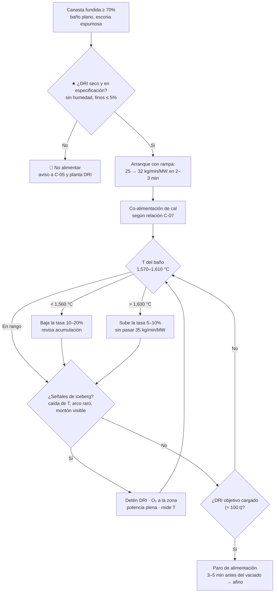

# MO-EAF-03 — Alimentación continua de DRI/HBI por el 5.º agujero

| Código | Versión | Estado | Área | Dueño del proceso | Elaboró | Revisión técnica | Revisión de seguridad | Aprobó | Fecha | Próxima revisión |
|---|---|---|---|---|---|---|---|---|---|---|
| MO-EAF-03 | 0.1 | Borrador para validación | Hornos — EAF-1 / EAF-2 | C-07 Ingeniero de Proceso EAF / LF | experto-operativo-metalurgia | experto-operativo-metalurgia | experto-seguridad-salud | Pendiente (Gerente de Acería / Director) | 2026-09-25 | 2027-09-25 |

> Valores técnicos tomados de `FT-ACE-001` v0.1. Lo marcado **[Validar con OEM / Ingeniería de Proceso]** o **[Supuesto]** no se usa en planta hasta que C-07 lo valide.

## 1. Objetivo y alcance
**Objetivo:** fundir el 60% de la carga metálica (≈ 100 t de DRI/HBI por colada) alimentándolo en continuo **al ritmo que la potencia puede fundir**: 30–35 kg/min/MW (≈ 3.5–5.0 t/min), con baño plano, escoria espumosa estable y temperatura controlada, **sin acumulaciones ("icebergs")** y **sin DRI húmedo**.

**Alcance:** desde el arranque de la alimentación (canasta fundida ≥ 70%) hasta el paro de la alimentación antes del afino. Incluye la co-alimentación de cal y dolomita por la misma vía. Aplica a DRI caliente (500–650 °C) y frío/HBI.
**No incluye:** operación de la planta DRI ni del transporte fuera de la nave, perfil eléctrico (MO-EAF-04) ni la práctica de O₂/C (MO-EAF-05).

## 2. Roles y responsabilidades
| Rol | Responsabilidad en este proceso | R/A/C/I |
|---|---|---|
| C-07 Ingeniero de Proceso EAF / LF | Dueño. Define consignas de kg/min/MW, rampas, relación cal/DRI y límites de temperatura. Analiza desviaciones. | A |
| S-01 Primer Hornero | Arranca, ajusta y detiene la alimentación; vigila temperatura, escoria y señales de acumulación. | R |
| S-02 Segundo Hornero | Mide temperatura durante la alimentación (MO-EAF-06); observa el baño por la puerta/cámara. | R |
| C-05 Supervisor de Hornos | Autoriza cambios de consigna fuera de rango y la alimentación con DRI de calidad dudosa. | C |
| Operador de la planta DRI / transporte (fuera de la Acería) | Informa calidad (metalización, C, finos, temperatura) y avisa de cualquier humedad. | I / C |

## 3. Descripción del proceso
El DRI llega por transportador (caliente, con atmósfera inerte de N₂, o frío desde silos) a las tolvas de día del horno, pasa por un alimentador con báscula y cae por el **5.º agujero de la bóveda** al centro del baño, entre los electrodos, donde la temperatura es más alta. El sistema calcula la tasa con la potencia activa: **tasa (t/min) = consigna (kg/min/MW) × MW / 1,000**. S-01 corrige la consigna con la temperatura medida del baño. Junto al DRI entra cal para neutralizar la ganga (SiO₂ + Al₂O₃) y mantener la basicidad B2 = 1.8–2.2.

**Ejemplo de cálculo:** a 124 MW y 32 kg/min/MW → 124 × 32 / 1,000 ≈ **4.0 t/min**; 100 t de DRI tardan ≈ 25 min (etapa 3 de la Figura 3).

## 4. Equipos y maquinaria
| Equipo / componente | Función | Especificación clave | Condición para operar (verificación) |
|---|---|---|---|
| Transportador de DRI caliente | Lleva DRI de la planta DRI al horno | 500–650 °C; inertizado con N₂ [Validar con OEM / Ingeniería de Proceso] | Sin alarma de O₂ alto en el ducto; sellos en buen estado |
| Silos / tolvas de día de DRI frío y HBI | Almacenan | Cerrados, secos | Sin entrada de agua; temperatura del silo sin alarma (reoxidación) |
| Alimentador con báscula (weigh feeder) | Dosifica la tasa | Rango 0–5.0 t/min; exactitud ± 1% [Supuesto] | Calibración vigente; sin atascos |
| Tolva de cal y dolomita | Co-alimentación de fundentes | Cal 30–45 kg/t; dolomita 10–15 kg/t (por t de acero) | Nivel suficiente para la colada |
| Ducto del 5.º agujero | Introduce el DRI al centro del horno | Refractario / enfriado por agua [Validar con OEM / Ingeniería de Proceso] | Sin obstrucción; agua del ducto sin alarma |
| Controlador de tasa (nivel 1/2) | Calcula tasa = kg/min/MW × MW | Consigna 30–35 kg/min/MW | Enclavamientos activos (ver §6.3) |
| Cámara del horno | Ver montones de DRI | — | Imagen disponible |

## 5. Parámetros de operación
| Parámetro | Unidad | Objetivo | Rango normal | Alarma / límite | Acción si está fuera de rango | Dónde se mide |
|---|---|---|---|---|---|---|
| Consigna de alimentación | kg/min/MW | 32 | 30–35 | > 35 o < 25 | > 35: riesgo de iceberg, baja; < 25: tap-to-tap largo, revisa causa | HMI de DRI |
| Tasa de DRI | t/min | 4.0 | 3.5–5.0 | > 5.0 | Limita; 5.0 t/min solo con DRI caliente y potencia plena [Validar con Ingeniería de Proceso] | Báscula del alimentador |
| DRI total por colada | t | ≈ 100 | 95–105 (60% de la carga) | ± 10 t del cálculo | Ajusta con C-07 (peso de vaciado 150 t) | Nivel 2 |
| Temperatura del baño durante la alimentación | °C | 1,590 | 1,570–1,610 [Supuesto] | < 1,560 o > 1,630 | Ver diagrama §3 | Termopar desechable (MO-EAF-06) |
| Temperatura del DRI caliente | °C | 600 | 500–650 | < 450 °C | Recalcula consigna (menos energía química) con C-07 | Transportador |
| Metalización del DRI | % | ≥ 93 [Supuesto] | 92–95 | < 91% | Baja la tasa; más O₂/C; aviso a C-07 | Certificado de la planta DRI |
| Carbono del DRI | % | 2.0 [Supuesto] | 1.5–3.0 | < 1.2% | Ajusta inyección de carbono (MO-EAF-05) | Certificado DRI |
| Finos (< 3 mm) | % | ≤ 3 [Supuesto] | — | > 5% | Finos se van al 4.º agujero: baja la tasa y avisa | Muestreo DRI |
| Humedad del DRI/HBI | — | Seco, sin agua visible | — | Cualquier evidencia de agua | ★ 🛑 No alimentar | Visual / reporte DRI |
| Relación cal/DRI | kg cal / t DRI | 50–65 [Supuesto] | según ganga | B2 < 1.6 en muestra de escoria | Sube la relación (MO-EAF-05) | Nivel 2 / análisis de escoria |
| Retraso entre arranque y baño plano | — | Arranca con ≥ 70% de canasta fundida | — | Arranque con chatarra sólida alta | Espera; riesgo de pegado y de iceberg | Energía acumulada ≥ 150 kWh/t |

**Consigna inicial según el tipo de material** [Validar con C-07]:

| Material | Temperatura | Consigna inicial (kg/min/MW) | Tasa típica a ≈ 124 MW | Notas |
|---|---|---|---|---|
| DRI caliente | 500–650 °C | 33–35 | ≈ 4.1–4.3 t/min | Aporta energía sensible; permite la tasa más alta |
| DRI frío | Ambiente | 30–32 | ≈ 3.7–4.0 t/min | Sensible a finos y reoxidación |
| HBI | Ambiente | 30–32 | ≈ 3.7–4.0 t/min | Más denso; menor pérdida de finos; vigilar que no se acumule |
| Mezcla con DRI de baja metalización (< 91%) | — | 28–30 | ≈ 3.5–3.7 t/min | Más FeO que reducir: más C y más energía |

## 6. Seguridad
### 6.1 Peligros y controles críticos
| Peligro | Consecuencia | Control crítico | Verificación |
|---|---|---|---|
| DRI o HBI húmedo | Generación de vapor e H₂: explosión en el horno | ★ Silos y transportadores cerrados; no alimentar DRI mojado; reporte obligatorio de la planta DRI | Registro por lote; VCC |
| Acumulación de DRI (iceberg) que se funde de golpe | Ebullición violenta, derrame de escoria por la puerta | ★ Consigna ≤ 35 kg/min/MW, arranque con baño plano, T mínima 1,560 °C | Tendencia de T y tasa en nivel 2 |
| Reoxidación del DRI en silos (calentamiento espontáneo) | Incendio, CO | Silos inertizados; alarma de temperatura [Validar con OEM / Ingeniería de Proceso] | Monitoreo continuo |
| Nitrógeno de inertización | Asfixia en galerías y cámaras del transportador | ★ Entrada solo con permiso de espacio confinado y medición de O₂ ≥ 19.5% (MS-ACE-05/06) | Permiso firmado |
| CO en plataforma de la bóveda | Intoxicación | Detector personal de CO | Prueba diaria |
| Polvo de DRI | Exposición, explosión de polvo | Colección de polvo, limpieza, sin fuentes de ignición | Programa de limpieza |

### 6.2 EPP obligatorio
Casco, lentes, ropa ignífuga, guantes, botas con metatarsal, protección auditiva, detector personal de CO y de O₂ en galerías del transportador. Respirador para polvo (según evaluación de NOM-010) en tolvas y transportadores.

### 6.3 Permisos, bloqueos y zonas de exclusión
- **Enclavamientos que detienen el DRI** [Validar con OEM / Ingeniería de Proceso]: arco apagado o potencia < 40 MW; bóveda no asentada; horno fuera de 0° ± 2°; disparo por fuga de agua (> 4%); presión del horno positiva.
- Mantenimiento de alimentadores y transportadores: LOTO (MS-ACE-02) + purga de N₂ y medición de atmósfera antes de abrir.
- Zona bajo el 5.º agujero en la plataforma de bóveda: sin personas durante la alimentación.

## 7. Calidad
| Variable crítica de calidad | Especificación | Método / frecuencia | Registro | Defecto si falla |
|---|---|---|---|---|
| Nitrógeno del acero | Bajo (el DRI diluye el N); objetivo al vaciado ≤ 50 ppm [Supuesto] | Muestra al vaciado | Laboratorio | Envejecimiento, pérdida de ductilidad en bajo carbono |
| Fósforo al vaciado | ≤ 0.015% | Muestra antes de vaciar (MO-EAF-06) | Laboratorio | P fuera de especificación |
| Carbono del baño | 0.04–0.08% al vaciado | O activo + muestra | Nivel 2 | Sobreoxidación o C alto |
| Residuales (Cu, Sn, Ni, Cr) | Diluidos por el DRI; según grado | Muestra | Laboratorio | Grietas superficiales en laminación |
| Rendimiento metálico | Según balance de C-07 | Por colada | Nivel 2 | FeO alto en escoria = pérdida de hierro |

## 8. Procedimiento paso a paso
| # | Paso | Cómo hacerlo (detalle y medición) | Criterio de aceptación | ★ | Rol |
|---|---|---|---|---|---|
| 1 | Revisa la calidad del lote | Lee en nivel 2 metalización, C, finos, temperatura y reporte de humedad de la planta DRI. | Dentro de §5; sin reporte de humedad | ★ | S-01 |
| 2 | Verifica el sistema | Tolvas con inventario para la colada; alimentador sin alarmas; ducto del 5.º agujero libre; cal disponible. | Sin alarmas | | S-01 |
| 3 | Confirma condición de arranque | Energía acumulada ≥ 150 kWh/t, baño plano (corriente estable), escoria espumosa formándose. | Canasta ≥ 70% fundida | | S-01 |
| 4 | Arranca con rampa | Inicia a 25 kg/min/MW y sube a 32 kg/min/MW en 2–3 min. | Tasa estable | | S-01 |
| 5 | Arranca la cal | Relación cal/DRI según C-07; dolomita según MgO objetivo. | Relación en consigna | 🔎 | S-01 |
| 6 | Mide temperatura a mitad de la alimentación | Solicita a S-02 medición con la lanza manipuladora (≈ minuto 25–28 del ciclo). | 1,570–1,610 °C | 🔎 | S-02 |
| 7 | Ajusta la consigna | < 1,560 °C: baja 10–20%; > 1,630 °C: sube 5–10% sin pasar 35 kg/min/MW. | T en rango | | S-01 |
| 8 | Vigila señales de iceberg | Caída de T, arco inestable en una fase, montón visible bajo el 5.º agujero, caída de CO en humos. | Sin señales | ★ | S-01 / S-02 |
| 9 | Corrige un iceberg | Detén el DRI, dirige O₂ a la zona, potencia plena, mide T; reanuda con 25 kg/min/MW cuando se funda. | Montón fundido; T ≥ 1,580 °C | ★ | S-01 |
| 10 | Controla el total | Sigue el acumulado contra el objetivo (≈ 100 t) calculado por nivel 2. | ± 5 t del objetivo | 🔎 | S-01 |
| 11 | Detén la alimentación | 3–5 min antes del vaciado (fin de la etapa 3) o al llegar al total. | DRI detenido | | S-01 |
| 12 | Registra | Total de DRI, tasa promedio, kg/min/MW promedio, T medidas, eventos. | Registro completo | | S-01 |

## 9. Condiciones anormales y respuesta
| Síntoma / alarma | Causa probable | Acción inmediata | A quién avisar |
|---|---|---|---|
| Reporte o evidencia de humedad en DRI | Agua en silo o transportador | 🛑 Detén el DRI; aísla el lote; no se usa hasta que C-07 y la planta DRI lo liberen | C-05, C-07, planta DRI |
| Caída de T > 20 °C en 5 min o T < 1,560 °C | Tasa excesiva, iceberg | Baja o detén el DRI; potencia plena; O₂ a la zona | C-07 |
| Ebullición violenta y escoria saliendo por la puerta (boiling) | Iceberg fundiendo de golpe; FeO alto + C | Detén DRI y C; baja el O₂; todos fuera del frente de la puerta; no agregues carbono en masa | C-05, C-04 |
| Arco inestable con DRI | Escoria poco espumosa, DRI cayendo sobre el arco | Baja la tasa; ajusta O₂/C (MO-EAF-05) | C-07 |
| Alimentador atascado / tasa cero | Material grueso, falla de banda | Cambia a DRI frío/HBI si hay; mantenimiento con LOTO | C-05, Mantenimiento |
| Alarma de O₂ alto o T alta en silo/transportador | Entrada de aire, reoxidación | Protocolo de la planta DRI; purga de N₂; no entrar | C-05, C-16 |
| Humo o finos excesivos en el 4.º agujero | Finos > 5% | Baja la tasa; avisa a la planta DRI | C-07 |
| Fuga de agua (Δ caudal > 2%) | Panel o ducto del 5.º agujero | DRI se detiene; aplica MO-EAF-01 §9 y MS-ACE-09 | C-05, C-04 |

## 10. Registros
- Registro de calidad por lote de DRI (metalización, C, finos, T, humedad).
- Tendencia de tasa, kg/min/MW, MW y T por colada (nivel 2).
- Eventos de iceberg, paros de alimentación y humedad (bitácora del horno).
- Permisos de espacio confinado en galerías de transporte.

## 11. Competencia requerida y certificación
| Rol | Nivel requerido (1–4) | Formación teórica (h) | OJT supervisado (h / eventos) | Evaluación (pasos ★) | Vigencia |
|---|---|---|---|---|---|
| S-01 Primer Hornero | 3 | 20 (balance de masa y energía, DRI, escoria) | 120 h / 40 coladas | Pasos 1, 8, 9 + simulador de iceberg | 24 meses (TD-P07) |
| S-02 Segundo Hornero | 2 | 8 | 20 coladas | Paso 6 y reconocimiento de señales (paso 8) | 24 meses |
| C-07 Ingeniero de Proceso | 4 | 24 | — | Diseño de consignas y análisis de desviación | 24 meses |

Lista corta de verificación de pasos ★:
1. Rechaza un lote con humedad y explica el mecanismo de explosión (vapor + H₂).
2. Calcula la tasa en t/min a partir de MW y kg/min/MW.
3. Reconoce 3 señales de iceberg y ejecuta la corrección.
4. Conoce los enclavamientos que detienen el DRI.
5. Actúa ante una ebullición violenta (boiling): despeja el frente de la puerta.

## 12. Referencias
- FT-ACE-001 §2; CAT-ACE-001; MO-EAF-04, MO-EAF-05, MO-EAF-06.
- MS-ACE-03 (agua–metal), MS-ACE-05 (espacios confinados), MS-ACE-06 (gases: N₂, CO).
- NOM-033-STPS (espacios confinados), NOM-010-STPS (agentes químicos), NOM-017-STPS (EPP) — verificar con Jurídico Laboral / SSO.
- Manual OEM del sistema de alimentación de DRI y del 5.º agujero [por referenciar]; especificación de DRI de la planta de reducción directa [por referenciar].
- TD-P07.

## 13. Control de cambios
| Versión | Fecha | Cambio | Autor |
|---|---|---|---|
| 0.1 | 2026-09-25 | Emisión inicial para validación. Se registra que 5.0 t/min requiere > 140 MW a 35 kg/min/MW (ver README, inconsistencias). | experto-operativo-metalurgia |
