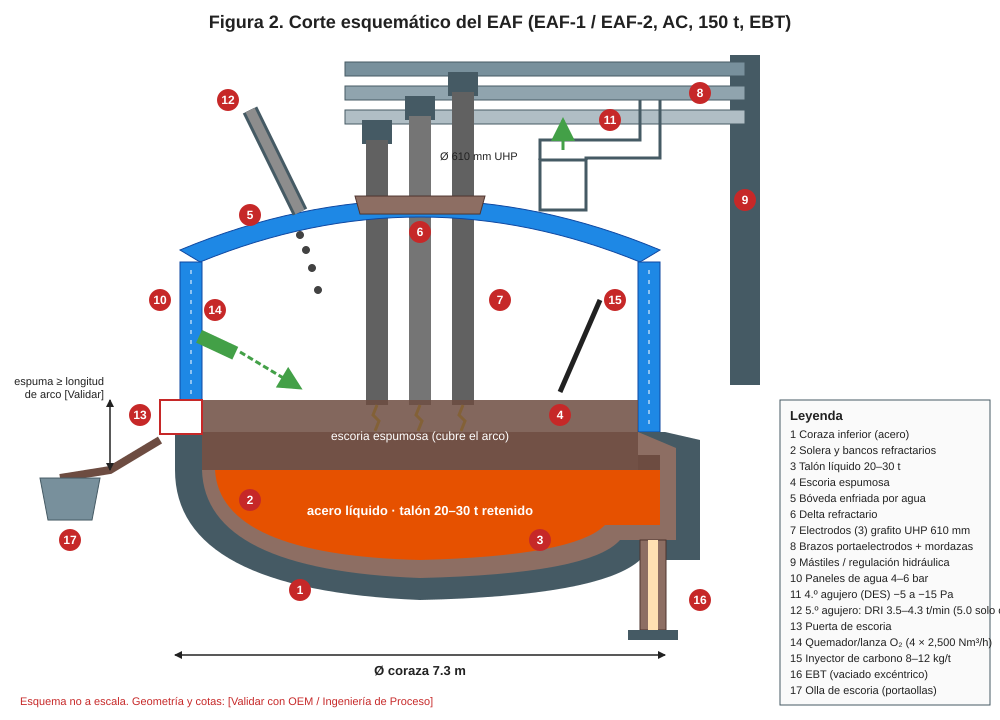
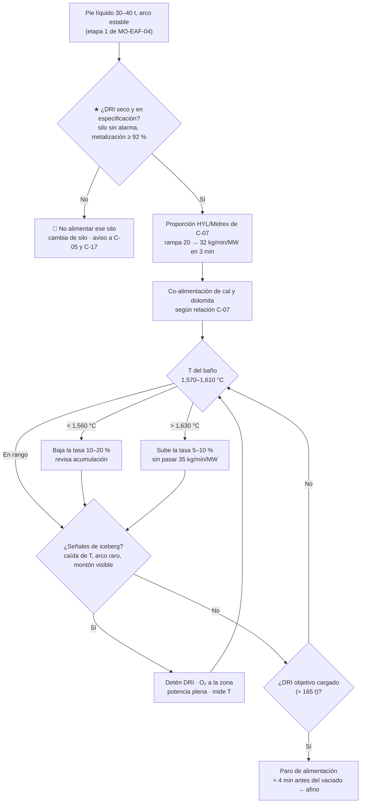

# MO-EAF-03 — Alimentación continua de DRI por el 5.º agujero

| Código | Versión | Estado | Área | Dueño del proceso | Elaboró | Revisión técnica | Revisión de seguridad | Aprobó | Fecha | Próxima revisión |
|---|---|---|---|---|---|---|---|---|---|---|
| MO-EAF-03 | 0.2 | Borrador para validación | Hornos — EAF-1 / EAF-2 | C-07 Ingeniero de Proceso EAF / LF | experto-operativo-metalurgia | experto-operativo-metalurgia — visto bueno técnico v0.2, 2026-09-28 | experto-seguridad-salud — **pendiente para v0.2** (v0.1 con observaciones, 2026-09-25) | Pendiente (Gerente de Acería / Director) | 2026-09-28 | 2027-09-28 |

> Valores técnicos tomados de `FT-ACE-001` v0.4 (§2, §2.1 y §9). Lo marcado **[Validar con OEM / Ingeniería de Proceso]** o **[Supuesto]** no se usa en planta hasta que C-07 lo valide.
>
> **Cambio de v0.2 (D-010):** el DRI ya no es el 60 % de la carga: es **≈ 95–100 %**. Se alimenta **desde el arranque sobre el pie líquido**, no después de fundir una canasta. Llega **frío o tibio (≤ 80 °C)** por bandas desde HYL y Midrex; ya no hay DRI caliente ni HBI.

## 1. Objetivo y alcance
**Objetivo:** fundir **≈ 165 t de DRI por colada** (160–170 t; ≈ 1.13 t de DRI por t de acero líquido) alimentándolo en continuo **al ritmo que la potencia puede fundir**: **30–35 kg/min/MW** (≈ 3.5–4.3 t/min; objetivo 3.7–3.8 t/min a ≈ 115–117 MW), **desde el minuto 0–3 de arco** sobre el pie líquido de 30–40 t, con baño plano, escoria espumosa estable y temperatura controlada, **sin acumulaciones ("icebergs")**, **sin DRI húmedo** y con la **mezcla HYL/Midrex** que da el carbono objetivo.

**Alcance:** desde que S-01 arranca la alimentación en la etapa 1 del perfil (MO-EAF-04) hasta el paro de la alimentación antes del afino. Incluye la selección del silo y la proporción HYL/Midrex en las básculas dosificadoras, y la co-alimentación de cal y dolomita por la misma banda.
**No incluye:** la recepción del DRI y los silos de día (MO-EAF-02), la operación de las plantas de reducción directa, el perfil eléctrico (MO-EAF-04) ni la práctica de O₂/C (MO-EAF-05).

## 2. Roles y responsabilidades
| Rol | Responsabilidad en este proceso | R/A/C/I |
|---|---|---|
| C-07 Ingeniero de Proceso EAF / LF | Dueño. Define consignas de kg/min/MW, rampas, proporción HYL/Midrex por carbono objetivo, relación cal/DRI y límites de temperatura. Analiza desviaciones. | A |
| S-01 Primer Hornero | Arranca, ajusta y detiene la alimentación; vigila temperatura, escoria y señales de acumulación. | R |
| S-05 Operador de Manejo de DRI y Retornos | Confirma el silo en servicio para cada horno, vigila las básculas dosificadoras y avisa cualquier alarma de silo o lote. | R |
| S-02 Segundo Hornero | Mide temperatura durante la alimentación (MO-EAF-06); observa el baño por la puerta/cámara. | R |
| C-05 Supervisor de Hornos | Autoriza cambios de consigna fuera de rango y la alimentación con DRI de calidad dudosa. | C |
| C-17 Supervisor de Manejo de Materiales | Informa inventario, calidad y alarmas de silos; enlace con Reducción Directa. | C |

## 3. Descripción del proceso
El DRI de los **silos de día** (MO-EAF-02) sale por dos **básculas dosificadoras**, una de DRI HYL y otra de DRI Midrex, cae a la **banda del 5.º agujero** junto con la cal y la dolomita, y entra al horno por el **5.º agujero de la bóveda** al centro del baño, entre los electrodos, donde la temperatura es más alta. El sistema calcula la tasa con la potencia activa: **tasa (t/min) = consigna (kg/min/MW) × MW / 1,000**. S-01 corrige la consigna con la temperatura medida del baño.

Con 100 % DRI **no hay canasta que fundir antes**: el horno conserva un **pie líquido de 30–40 t** y el DRI empieza a entrar en rampa en cuanto el arco es estable (etapa 1 de MO-EAF-04, min 0–3 de arco). El DRI trae **FeO sin reducir** (6–9 %) y **carbono** (HYL 3.0–4.5 %, Midrex 1.5–2.5 %): ese carbono reduce el FeO dentro del baño, genera CO y ayuda a espumar la escoria. La cal neutraliza la **ganga** del DRI (SiO₂ + Al₂O₃): por eso hay más escoria que con chatarra (160–200 kg/t).

**Ejemplo de cálculo:** a 117 MW y 32 kg/min/MW → 117 × 32 / 1,000 ≈ **3.7 t/min**. En la etapa 2 del perfil (43 min de baño plano) entran ≈ 160 t; más ≈ 8 t en la rampa de la etapa 1 ≈ **168 t** por colada.

**Carbono de la mezcla:** C mezcla = %HYL × C_HYL + %Midrex × C_Midrex. Ejemplo con 50 % HYL a 3.7 % C y 50 % Midrex a 2.0 % C: 0.5 × 3.7 + 0.5 × 2.0 ≈ **2.85 %** (objetivo 2.2–3.0 %).

```mermaid
flowchart TD
    A["Pie líquido 30–40 t, arco estable<br/>(etapa 1 de MO-EAF-04)"] --> B{"★ ¿DRI seco y en especificación?<br/>silo sin alarma, metalización ≥ 92 %"}
    B -- "No" --> X["🛑 No alimentar ese silo<br/>cambia de silo · aviso a C-05 y C-17"]
    B -- "Sí" --> C["Proporción HYL/Midrex de C-07<br/>rampa 20 → 32 kg/min/MW en 3 min"]
    C --> D["Co-alimentación de cal y dolomita<br/>según relación C-07"]
    D --> E{"T del baño<br/>1,570–1,610 °C"}
    E -- "< 1,560 °C" --> F["Baja la tasa 10–20 %<br/>revisa acumulación"]
    E -- "> 1,630 °C" --> G["Sube la tasa 5–10 %<br/>sin pasar 35 kg/min/MW"]
    E -- "En rango" --> H{"¿Señales de iceberg?<br/>caída de T, arco raro, montón visible"}
    F --> H
    G --> H
    H -- "Sí" --> I["Detén DRI · O₂ a la zona<br/>potencia plena · mide T"]
    I --> E
    H -- "No" --> J{"¿DRI objetivo cargado<br/>(≈ 165 t)?"}
    J -- "No" --> E
    J -- "Sí" --> K["Paro de alimentación<br/>≈ 4 min antes del vaciado → afino"]
```

## 4. Equipos y maquinaria
| Equipo / componente | Función | Especificación clave | Condición para operar (verificación) |
|---|---|---|---|
| Silos de día (2 por EAF) | Entregan el DRI | ≈ 1,000 t cada uno; N₂; T ≤ 80 °C (MO-EAF-02) | Silo en servicio sin alarma de T, O₂ o H₂; autonomía ≥ 8 h |
| Básculas dosificadoras (weigh feeders), 1 por fuente | Dosifican HYL y Midrex | Rango 0–4.5 t/min cada una; exactitud ± 1 % [Supuesto] | Calibración vigente; sin atascos |
| Tolvas de cal y dolomita calcinada | Co-alimentación de fundentes | Cal 45–65 kg/t; dolomita 15–25 kg/t (por t de acero) | Nivel suficiente para la colada; material seco |
| Banda y tolva de compensación del 5.º agujero | Llevan la mezcla a la bóveda | Cerradas [Validar con OEM] | Sin derrames; sellos en buen estado |
| Ducto del 5.º agujero | Introduce el DRI al centro del horno | Refractario / enfriado por agua [Validar con OEM / Ingeniería de Proceso] | Sin obstrucción; agua del ducto sin alarma |
| Controlador de tasa (nivel 1/2) | Calcula tasa = kg/min/MW × MW y reparte HYL/Midrex | Consigna 30–35 kg/min/MW; máximo 35 | Enclavamientos activos (ver §6.3) |
| Cámara del horno | Ver montones de DRI | — | Imagen disponible |

## 5. Parámetros de operación
| Parámetro | Unidad | Objetivo | Rango normal | Alarma / límite | Acción si está fuera de rango | Dónde se mide |
|---|---|---|---|---|---|---|
| Consigna de alimentación | kg/min/MW | 32 | 30–35 | > 35 o < 25 | > 35: riesgo de iceberg, baja; < 25: tap-to-tap largo, revisa causa | HMI de DRI |
| Tasa de DRI | t/min | 3.7 | 3.5–4.3 | > 4.3 | Baja a 32 kg/min/MW (riesgo de iceberg). **No hay excepción por DRI caliente en v0.2** | Básculas dosificadoras |
| Rampa de arranque | kg/min/MW | 20 → 32 | en 2–3 min | Arranque con arco inestable o sin pie líquido | Espera arco estable; sin pie líquido, arranque en frío (MO-EAF-04 §3) | HMI |
| DRI total por colada | t | ≈ 165 | 160–170 (menos si entró canasta de retornos) | ± 10 t del cálculo | Ajusta con C-07 (peso de vaciado 150 t) | Nivel 2 |
| Proporción HYL en la mezcla | % | 50 | 45–55 [Supuesto] | Fuera de la consigna de C-07 | Corrige en las básculas; avisa a C-07 | HMI |
| Carbono de la mezcla | % | 2.8 | 2.2–3.0 | > 3.2 % o < 1.8 % | > 3.2: baja HYL (descarburación larga, riesgo de ebullición); < 1.8: sube HYL o la inyección de C (MO-EAF-05) | Nivel 2 |
| Temperatura del baño durante la alimentación | °C | 1,590 | 1,570–1,610 [Supuesto] | < 1,560 o > 1,630 | Ver diagrama §3 | Termopar desechable (MO-EAF-06) |
| Temperatura del DRI en silo | °C | ≤ 60 | ≤ 80 | > 90 °C o +5 °C/h | No alimentes desde ese silo sin autorización de C-17; C-17 puede pedir vaciarlo con prioridad (MO-EAF-02 §9) | HMI de silos |
| Metalización del DRI | % | ≥ 93 [Supuesto] | 92–95 | < 92 % | Baja la tasa 1–2 kg/min/MW; más O₂/C; aviso a C-07 (≈ +12 kWh/t por punto) | Muestreo / certificado de RD |
| Finos al 5.º agujero (< 3 mm) | % | ≤ 1 | ≤ 2 | > 3 % | Finos se van al 4.º agujero: baja la tasa y avisa a C-17 (criba) | Muestreo |
| Humedad del DRI | — | Seco, sin agua visible | — | Cualquier evidencia de agua | ★ 🛑 No alimentar | Visual / reporte de silos |
| Relación cal/DRI | kg cal / t DRI | 50 [Supuesto] | 40–60 según ganga | B2 < 1.6 en muestra de escoria | Sube la relación (MO-EAF-05) | Nivel 2 / análisis de escoria |

**Consigna inicial según el DRI** [Validar con C-07]:

| Material | Temperatura | Consigna inicial (kg/min/MW) | Tasa típica a ≈ 117 MW | Notas |
|---|---|---|---|---|
| Mezcla HYL/Midrex en especificación | ≤ 80 °C | 31–33 | ≈ 3.6–3.9 t/min | Caso normal |
| Mezcla con más HYL (C > 3.0 %) | ≤ 80 °C | 30–32 | ≈ 3.5–3.7 t/min | Más CO: vigila espuma y ebullición; más O₂ para descarburar |
| Mezcla con más Midrex (C < 2.2 %) | ≤ 80 °C | 31–33 | ≈ 3.6–3.9 t/min | Sube la inyección de C para reducir el FeO y espumar |
| DRI de baja metalización (< 92 %) | ≤ 80 °C | 28–30 | ≈ 3.3–3.5 t/min | Más FeO que reducir: más C y más energía |

## 6. Seguridad
### 6.1 Peligros y controles críticos
| Peligro | Consecuencia | Control crítico | Verificación |
|---|---|---|---|
| DRI húmedo | Generación de vapor e H₂: explosión en el horno | ★ Silos y bandas cerrados; no alimentar DRI mojado ni de un silo con agua; reporte obligatorio de S-05/C-17 | Registro por lote; VCC |
| Acumulación de DRI (iceberg) que se funde de golpe | Ebullición violenta, derrame de escoria por la puerta | ★ **Consigna ≤ 35 kg/min/MW** (≈ 4.1 t/min a 117 MW; ficha 3.5–4.3 t/min), arranque con pie líquido de 30–40 t y arco estable, T mínima 1,560 °C | Tendencia de T y tasa en nivel 2 |
| Carbono alto en la mezcla + FeO alto | Ebullición violenta (CO súbito) | ★ C mezcla ≤ 3.2 %; no agregar C en masa a escoria muy oxidada (MO-EAF-05) | Nivel 2 |
| Reoxidación del DRI en silos (calentamiento espontáneo) | Incendio, CO, H₂ | Silos inertizados; alarma de temperatura y gases (MO-EAF-02) [Validar con OEM / Ingeniería de Proceso] | Monitoreo continuo |
| Nitrógeno de inertización | Asfixia en tolvas, chutes y galerías | ★ Entrada solo con permiso de espacio confinado, purga de N₂ y medición: O₂ 19.5–23.5 %, CO < 25 ppm y < 10 % LEL (0 % LEL detectable, ≤ 1 % de lectura, si hay trabajo en caliente) (MS-ACE-05/06) | Permiso firmado con lecturas |
| CO en plataforma de la bóveda | Intoxicación | Detector personal multigás: CO 25 ppm → salir; 200 ppm → evacuación del sector [Verificar NOM-010] (MS-ACE-06) | Bump test diario |
| Polvo de DRI | Exposición, explosión de polvo | Colección de polvo, limpieza, sin fuentes de ignición | Programa de limpieza |

> ⚠️ En v0.2 se retira el caso "DRI caliente hasta 5.0 t/min"; el control crítico queda en **35 kg/min/MW sin excepción** (cierra la observación S-2 de RT-MO-ACE-001). **experto-seguridad-salud debe validar esta sección.**

### 6.2 EPP obligatorio
Casco, lentes, ropa ignífuga, guantes, botas con metatarsal, protección auditiva, detector personal multigás (O₂, CO, H₂) en tolvas, chutes y plataforma de bóveda. Respirador para polvo (según evaluación de NOM-010) en tolvas y bandas.

### 6.3 Permisos, bloqueos y zonas de exclusión
- **Enclavamientos que detienen el DRI** [Validar con OEM / Ingeniería de Proceso]: arco apagado o potencia < 40 MW; bóveda no asentada; horno fuera de 0° ± 2°; disparo por fuga de agua (> 4 %); presión del horno positiva; silo en servicio con alarma de T o de H₂.
- Mantenimiento de básculas, banda y ducto del 5.º agujero: LOTO (MS-ACE-02) + purga de N₂ y medición de atmósfera antes de abrir.
- Zona bajo el 5.º agujero en la plataforma de bóveda: sin personas durante la alimentación.

## 7. Calidad
| Variable crítica de calidad | Especificación | Método / frecuencia | Registro | Defecto si falla |
|---|---|---|---|---|
| Nitrógeno del acero | Bajo (el DRI no trae N y el CO lo arrastra); objetivo al vaciado ≤ 40 ppm [Supuesto] | Muestra al vaciado | Laboratorio | Envejecimiento, pérdida de ductilidad en bajo carbono |
| Fósforo al vaciado | ≤ 0.015 % | Muestra antes de vaciar (MO-EAF-06) | Laboratorio | P fuera de especificación (depende del P del pelet) |
| Carbono del baño | 0.04–0.08 % al vaciado | O activo + muestra | Nivel 2 | Sobreoxidación o C alto |
| Residuales (Cu, Sn, Ni, Cr) | Muy bajos: Cu ≤ 0.03 % [Supuesto]; solo vienen de los retornos | Muestra | Laboratorio | Grietas superficiales en laminación |
| Rendimiento metálico | ≈ 1.13 t de DRI por t de acero (CV-GASM-001) | Por colada | Nivel 2 | FeO alto en escoria = pérdida de hierro |
| Trazabilidad | Silo y proporción HYL/Midrex por colada | Por colada | Nivel 2 | No se puede investigar una desviación |

## 8. Procedimiento paso a paso
| # | Paso | Cómo hacerlo (detalle y medición) | Criterio de aceptación | ★ | Rol |
|---|---|---|---|---|---|
| 1 | Revisa el silo y el lote | Lee en nivel 2: silo en servicio, T y gases del silo sin alarma, metalización, C, finos; confirma con S-05. | Dentro de §5; sin alarma ni reporte de humedad | ★ | S-01 |
| 2 | Verifica el sistema | Básculas sin alarmas; banda y ducto del 5.º agujero libres; cal y dolomita disponibles. | Sin alarmas | | S-01 |
| 3 | Fija la proporción HYL/Midrex | Carga la consigna de C-07 (típica 50/50) en las básculas. | Proporción en consigna | 🔎 | S-01 |
| 4 | Confirma condición de arranque | Pie líquido 30–40 t (MO-EAF-01), arco estable en las 3 fases, escoria espumosa formándose (etapa 1 de MO-EAF-04). | Arco estable | | S-01 |
| 5 | Arranca con rampa | Inicia a 20 kg/min/MW y sube a 32 kg/min/MW en 2–3 min. | Tasa estable | | S-01 |
| 6 | Arranca la cal y la dolomita | Relación cal/DRI según C-07; dolomita según MgO objetivo. | Relación en consigna | 🔎 | S-01 |
| 7 | Mide temperatura a mitad de la alimentación | Solicita a S-02 medición con la lanza manipuladora (≈ min 24–26 de arco, mitad de la etapa 2 de MO-EAF-04). | 1,570–1,610 °C | 🔎 | S-02 |
| 8 | Ajusta la consigna | < 1,560 °C: baja 10–20 %; > 1,630 °C: sube 5–10 % sin pasar 35 kg/min/MW. | T en rango | | S-01 |
| 9 | Vigila señales de iceberg | Caída de T, arco inestable en una fase, montón visible bajo el 5.º agujero, caída de CO en humos. | Sin señales | ★ | S-01 / S-02 |
| 10 | Corrige un iceberg | Detén el DRI, dirige O₂ a la zona, potencia plena, mide T; reanuda con 20 kg/min/MW cuando se funda. | Montón fundido; T ≥ 1,580 °C | ★ | S-01 |
| 11 | Controla el total | Sigue el acumulado contra el objetivo (≈ 165 t, o menos si entró canasta de retornos) calculado por nivel 2. | ± 5 t del objetivo | 🔎 | S-01 |
| 12 | Detén la alimentación | ≈ 4 min antes del vaciado (fin de la etapa 2) o al llegar al total. | DRI detenido | | S-01 |
| 13 | Registra | Silo, proporción HYL/Midrex, total de DRI, tasa promedio, kg/min/MW promedio, T medidas, eventos. | Registro completo | | S-01 |

## 9. Condiciones anormales y respuesta
| Síntoma / alarma | Causa probable | Acción inmediata | A quién avisar |
|---|---|---|---|
| Reporte o evidencia de humedad en DRI | Agua en silo o banda | 🛑 Detén el DRI; cambia al otro silo; el lote no se usa hasta que C-07 y C-17 lo liberen | C-05, C-07, C-17 |
| Caída de T > 20 °C en 5 min o T < 1,560 °C | Tasa excesiva, iceberg | Baja o detén el DRI; potencia plena; O₂ a la zona | C-07 |
| Ebullición violenta y escoria saliendo por la puerta (boiling) | Iceberg fundiendo de golpe; FeO alto + C alto de la mezcla | Detén DRI y C; baja el O₂; todos fuera del frente de la puerta; no agregues carbono en masa | C-05, C-04 |
| Arco inestable con DRI | Escoria poco espumosa, DRI cayendo sobre el arco | Baja la tasa; ajusta O₂/C (MO-EAF-05) | C-07 |
| Báscula atascada / tasa cero | Material grueso, falla de banda | Cambia al otro silo o a la otra fuente con la misma consigna total; mantenimiento con LOTO | C-05, C-17, Mantenimiento |
| Alarma de T, O₂ o H₂ en el silo en servicio | Reoxidación, entrada de aire o agua | Cambia al otro silo; S-05 aplica MO-EAF-02 §9; no entrar | C-17, C-16 |
| Autonomía de silos < 4 h | Paro de HYL o Midrex | C-05 baja el ritmo de colada. **No hay chatarra de respaldo** | C-05, C-17, C-04 |
| Humo o finos excesivos en el 4.º agujero | Finos > 3 % | Baja la tasa; avisa a C-17 (criba) | C-07 |
| Fuga de agua (Δ caudal > 2 %) | Panel o ducto del 5.º agujero | DRI se detiene; con disparo (> 4 %) o agua visible: arco fuera, no inclines, evacúa a ≥ 25 m (MS-ACE-03); aplica MO-EAF-01 §9 y MS-ACE-09 | C-05, C-04 |

## 10. Registros
- Silo, lote y proporción HYL/Midrex por colada (nivel 2).
- Tendencia de tasa, kg/min/MW, MW y T por colada (nivel 2).
- Eventos de iceberg, paros de alimentación y humedad (bitácora del horno).
- Permisos de espacio confinado en tolvas, chutes y galerías.

## 11. Competencia requerida y certificación
| Rol | Nivel requerido (1–4) | Formación teórica (h) | OJT supervisado (h / eventos) | Evaluación (pasos ★) | Vigencia |
|---|---|---|---|---|---|
| S-01 Primer Hornero | 3 | 24 (balance de masa y energía con 100 % DRI, carbono de la mezcla, DRI, escoria) | 120 h / 40 coladas | Pasos 1, 9, 10 + simulador de iceberg | 24 meses (TD-P07) |
| S-02 Segundo Hornero | 2 | 8 | 20 coladas | Paso 7 y reconocimiento de señales (paso 9) | 24 meses |
| S-05 Operador de Manejo de DRI y Retornos | 2 (para este proceso) | 4 (básculas y silos en servicio) | 10 turnos | Confirmación de silo y respuesta a báscula atascada | 24 meses |
| C-07 Ingeniero de Proceso | 4 | 24 | — | Diseño de consignas, carbono de mezcla y análisis de desviación | 24 meses |

Lista corta de verificación de pasos ★:
1. Rechaza un lote o un silo con humedad y explica el mecanismo de explosión (vapor + H₂).
2. Calcula la tasa en t/min a partir de MW y kg/min/MW, y el carbono de la mezcla HYL/Midrex.
3. Reconoce 3 señales de iceberg y ejecuta la corrección.
4. Conoce los enclavamientos que detienen el DRI.
5. Actúa ante una ebullición violenta (boiling): despeja el frente de la puerta.

## 12. Referencias
- FT-ACE-001 v0.4 §2, §2.1 y §9; CV-GASM-001 §4.2; CAT-ACE-001 v0.2; MO-EAF-02, MO-EAF-04, MO-EAF-05, MO-EAF-06.
- MS-ACE-03 (agua–metal, DRI húmedo), MS-ACE-05 (espacios confinados), MS-ACE-06 (gases: N₂, CO, H₂).
- NOM-033-STPS (espacios confinados), NOM-010-STPS (agentes químicos), NOM-017-STPS (EPP) — verificar con Jurídico Laboral / SSO.
- Manual OEM del sistema de dosificación de DRI y del 5.º agujero [por referenciar]; especificación de DRI de Reducción Directa [por referenciar].
- TD-P07.

## 13. Control de cambios
| Versión | Fecha | Cambio | Autor |
|---|---|---|---|
| 0.1 | 2026-09-25 | Emisión inicial para validación. Se registra que 5.0 t/min requiere > 140 MW a 35 kg/min/MW (ver README, inconsistencias). | experto-operativo-metalurgia |
| 0.1 | 2026-09-25 | Revisión técnica cruzada contra FT-ACE-001 v0.3: potencia activa ≈ 119 MW, tasa de DRI 3.5–4.3 t/min (5.0 solo con DRI caliente validado), ejemplo de cálculo y momento de medición M1. | experto-operativo-metalurgia |
| 0.2 | 2026-09-28 | **Decisión D-010:** DRI ≈ 95–100 % de la carga (≈ 165 t por colada), alimentación desde el arranque sobre pie líquido de 30–40 t (ya no espera a fundir canasta), DRI frío o tibio desde silos de día por básculas HYL y Midrex, proporción HYL/Midrex por carbono objetivo, relación cal/DRI 40–60 kg/t, finos ≤ 2 % al 5.º agujero. Se retiran DRI caliente, HBI y la excepción de 5.0 t/min (límite 35 kg/min/MW sin excepción). S-05 participa. Valores de FT-ACE-001 v0.4. Requiere nueva revisión de seguridad | experto-operativo-metalurgia |
