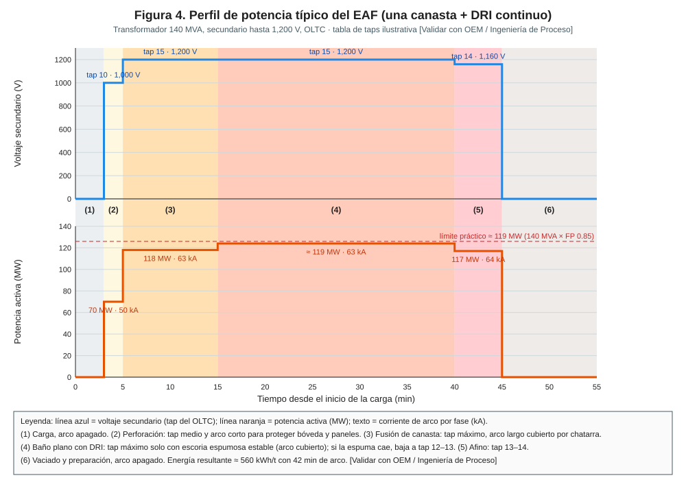
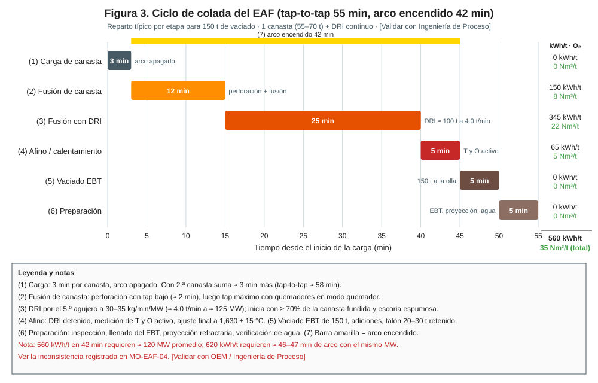
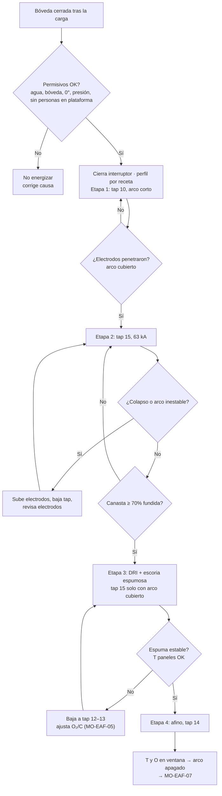

# MO-EAF-04 — Fusión: perfil de potencia y regulación de electrodos

| Código | Versión | Estado | Área | Dueño del proceso | Elaboró | Revisión técnica | Revisión de seguridad | Aprobó | Fecha | Próxima revisión |
|---|---|---|---|---|---|---|---|---|---|---|
| MO-EAF-04 | 0.1 | Borrador para validación | Hornos — EAF-1 / EAF-2 | C-07 Ingeniero de Proceso EAF / LF | experto-operativo-metalurgia | experto-operativo-metalurgia | experto-seguridad-salud | Pendiente (Gerente de Acería / Director) | 2026-09-25 | 2027-09-25 |

> Valores técnicos tomados de `FT-ACE-001` v0.2. Lo marcado **[Validar con OEM / Ingeniería de Proceso]** o **[Supuesto]** no se usa en planta hasta que C-07 lo valide.

## 1. Objetivo y alcance
**Objetivo:** fundir la carga en **42 min de arco** con **560–620 kWh/t**, arco estable, sin daño a bóveda y paneles, y con consumo de electrodo de **1.3–1.6 kg/t**, siguiendo el perfil de potencia (taps del transformador y corriente) de cada etapa.

**Alcance:** desde el cierre de la bóveda tras la carga (MO-EAF-02) hasta el apagado del arco para el vaciado (MO-EAF-07): perforación, fusión de canasta, fusión con DRI en baño plano y afino. Incluye la vigilancia de la regulación automática de electrodos.
**No incluye:** maniobras de alta tensión y mantenimiento del transformador (MM-EAF-04) ni de la hidráulica de brazos (MM-EAF-02).

## 2. Roles y responsabilidades
| Rol | Responsabilidad en este proceso | R/A/C/I |
|---|---|---|
| C-07 Ingeniero de Proceso EAF / LF | Dueño. Define y mantiene los perfiles de potencia por receta, las consignas de impedancia y los límites. | A |
| S-01 Primer Hornero | Selecciona el perfil, energiza, vigila la regulación, cambia de etapa y responde a alarmas. | R |
| C-05 Supervisor de Hornos | Autoriza desviaciones del perfil y la operación con una fase en falla. | C |
| S-20 Electricista / S-21 Instrumentista | Atienden fallas del interruptor, del OLTC, de la regulación y de la medición. | C |
| S-02 Segundo Hornero | Informa de lo que ve en el horno (colapso, arco expuesto, escoria). | I |

## 3. Descripción del proceso
El transformador de **140 MVA** (secundario hasta **1,200 V**, OLTC) alimenta 3 electrodos de grafito de **610 mm**. El voltaje (tap) fija la longitud del arco; la regulación de electrodos mueve cada brazo con hidráulica para mantener la **impedancia de consigna** (Z = V/I) y con ello la corriente. **Arco largo = más potencia y más radiación a paredes**: solo se usa cuando el arco está **cubierto** (por chatarra o por escoria espumosa). Con arco expuesto se baja el tap.

**Perfil de referencia (1 canasta + DRI)** — tabla de taps ilustrativa [Validar con OEM / Ingeniería de Proceso]:

| Etapa | Tiempo (min de arco) | Tap / voltaje secundario | Corriente por fase | Potencia activa | Energía acumulada al final | Condición para pasar a la siguiente etapa |
|---|---|---|---|---|---|---|
| 1. Perforación (bore-in) | 0–2 | Tap 10 · ≈ 1,000 V | ≈ 50 kA | ≈ 70 MW | ≈ 15 kWh/t | Electrodos penetraron la chatarra (≈ 1 m [Validar]); arco cubierto |
| 2. Fusión de canasta | 2–12 | Tap 15 · 1,200 V | ≈ 63 kA | ≈ 118 MW | ≈ 150 kWh/t | Canasta ≥ 70% fundida, corriente estable (baño plano) |
| 3. Baño plano con DRI | 12–37 | Tap 15 · 1,200 V (13–14 si la espuma baja) | ≈ 66 kA | ≈ 124 MW | ≈ 495 kWh/t | DRI total cargado |
| 4. Afino / calentamiento | 37–42 | Tap 14 · ≈ 1,160 V | ≈ 64 kA | ≈ 117 MW | ≈ 560 kWh/t | T y O activo en ventana de vaciado (MO-EAF-06) |

> **Inconsistencia registrada:** 560 kWh/t × 150 t = 84 MWh en 42 min exige ≈ 120 MW promedio, casi el máximo práctico de 140 MVA (≈ 126 MW con cos φ 0.9). El extremo de 620 kWh/t de la ficha requeriría ≈ 46–47 min de arco. Ingeniería de Proceso debe validar potencia real, tap-to-tap y energía (ver README).

## 4. Equipos y maquinaria
| Equipo / componente | Función | Especificación clave | Condición para operar (verificación) |
|---|---|---|---|
| Transformador del horno | Suministra potencia | 140 MVA; secundario hasta 1,200 V | Sin alarma de temperatura de aceite ni Buchholz; enfriamiento en servicio |
| Cambiador de derivaciones bajo carga (OLTC) | Cambia el voltaje (tap) | 15 posiciones ilustrativas [Validar con OEM / Ingeniería de Proceso] | Contador de operaciones dentro de mantenimiento |
| Interruptor de vacío del horno | Energiza / desenergiza | Operaciones por colada ≈ 2–4 | Contador y estado sin alarma |
| Compensación (SVC/STATCOM) si existe | Controla flicker y factor de potencia | [Validar con OEM / Ingeniería de Proceso] | En servicio antes de energizar |
| Brazos, mástiles y regulación hidráulica | Posicionan electrodos | Regulación por impedancia; servoválvulas | Presión hidráulica en rango; sin fugas |
| Electrodos | Conducen la corriente | 610 mm UHP; niple 4TPI | Longitud suficiente; sin grietas; juntas apretadas (MO-EAF-08) |
| Medición de corriente, voltaje y potencia | Control y registro | kA, V, MW, kWh | Lectura estable en las 3 fases |
| Termopares / flujo de calor de paneles | Detectan arco expuesto | Alarma T salida > 60 °C | Sin alarma |

## 5. Parámetros de operación
| Parámetro | Unidad | Objetivo | Rango normal | Alarma / límite | Acción si está fuera de rango | Dónde se mide |
|---|---|---|---|---|---|---|
| Energía eléctrica | kWh/t | 560–590 | 560–620 | > 640 [Supuesto] | Revisa pérdidas de tiempo, O₂, escoria, calidad DRI; reporte a C-07 | Nivel 2 |
| Tiempo de arco encendido | min | 42 | 40–46 | > 48 | Registra causa (demoras, DRI, escoria) | Nivel 2 |
| Potencia activa en baño plano | MW | ≈ 124 | 115–126 | < 105 sostenido | Revisa espuma, tap, regulación | HMI |
| Corriente por fase (etapas 2–3) | kA | 63–66 | 58–67 | > 67 kA (≈ corriente nominal a 1,200 V) | La regulación reduce; si persiste, baja tap | HMI |
| Desbalance de corriente entre fases | % | ≤ 5 | 0–10 [Supuesto] | > 10% por > 30 s | Revisa electrodo corto, colapso o falla de regulación | HMI |
| Cortocircuitos (electrodo en contacto con carga) | n/min | 0 | ≤ 2 en perforación | > 5/min | Revisa consigna de impedancia y velocidad de regulación | HMI / nivel 2 |
| T de salida de panel | °C | ≤ 50 | 35–55 | > 60 °C | Baja tap 2 posiciones; mejora espuma (MO-EAF-05) | HMI |
| Δ caudal de agua | % | ≤ 1 | 0–2 | > 2% alarma; > 4% disparo | Ver MO-EAF-01 §9 | HMI |
| Consumo de electrodo | kg/t | 1.4 | 1.3–1.6 | > 1.7 | Revisa roturas, oxidación lateral (O₂ cerca de columnas), corriente | Nivel 2 (por turno) |
| Presión del horno | Pa | −10 | −5 a −15 | > 0 Pa | Revisa DES; no subas tap | HMI |
| Ruido de arco / THD de corriente | — | Bajo con espuma | — | Alto en baño plano | Arco expuesto: mejora espuma, baja tap | HMI / percepción |

## 6. Seguridad
### 6.1 Peligros y controles críticos
| Peligro | Consecuencia | Control crítico | Verificación |
|---|---|---|---|
| Energizar con personas en plataforma de bóveda o de electrodos | Electrocución, quemadura por arco | ★ LOTO / llave cautiva: sin llaves en el tablero no cierra el interruptor | Tablero de llaves; VCC |
| Arco con fuga de agua | Explosión | ★ Disparo automático > 4%; no rearmar sin liberar la fuga | Prueba del enclavamiento (mantenimiento) |
| Arco expuesto con tap alto | Perforación de paneles → fuga de agua | ★ Tap alto solo con arco cubierto; bajar tap ante T de panel > 60 °C | Tendencias de panel |
| Rotura de electrodo | Caída de trozos, cortocircuito, proyección | Perfil de perforación; acomodo de canasta; juntas apretadas | Registro de roturas |
| Campo magnético y alta corriente | Afecta marcapasos; calentamiento de objetos | Señalización; personal con implantes no entra a zona de barras | Examen médico |
| Ruido > 100 dB(A) y radiación UV/IR | Hipoacusia; lesiones oculares | Púlpito cerrado; EPP auditivo y visual en piso | Dosimetría (NOM-011) |
| Colapso de chatarra | Salpicadura, rotura de electrodo | Subir electrodos y bajar tap | Observación S-02 |

### 6.2 EPP obligatorio
En púlpito: ropa ignífuga y calzado de seguridad. En piso del horno: casco, careta con visor dorado, ropa ignífuga, chaqueta aluminizada frente a la puerta, guantes, botas metatarsales, doble protección auditiva con arco encendido, detector de CO.

### 6.3 Permisos, bloqueos y zonas de exclusión
- **Permisivos para energizar** [Validar con OEM / Ingeniería de Proceso]: bóveda cerrada y asentada, horno a 0° ± 2°, agua en rango (Δ ≤ 2%, P ≥ 3 bar), hidráulica en presión, presión del horno negativa, todas las llaves cautivas en el tablero, compensación en servicio.
- ★ Nadie sube a la plataforma de electrodos o de bóveda con el interruptor cerrado. Toda entrada = interruptor abierto + LOTO (MS-ACE-02).
- Zona de barras (bus) y transformador: acceso solo para S-20 con permiso eléctrico (NOM-029).

## 7. Calidad
| Variable crítica de calidad | Especificación | Método / frecuencia | Registro | Defecto si falla |
|---|---|---|---|---|
| Temperatura al final del afino | 1,630 ± 15 °C (según grado) | Termopar desechable (MO-EAF-06) | Nivel 2 | Sobre-T: refractario, N; baja T: congelamiento en olla |
| Captura de nitrógeno | Mínima: arco cubierto por espuma | N al vaciado ≤ 50 ppm [Supuesto] | Laboratorio | N alto en bajo carbono |
| Energía por colada | 560–620 kWh/t | Por colada | Nivel 2 | Costo; indica problema de escoria o DRI |
| Consumo de electrodo | 1.3–1.6 kg/t | Por turno | Nivel 2 | Costo; roturas |

## 8. Procedimiento paso a paso
| # | Paso | Cómo hacerlo (detalle y medición) | Criterio de aceptación | ★ | Rol |
|---|---|---|---|---|---|
| 1 | Verifica permisivos | Revisa en HMI: bóveda, 0°, agua, hidráulica, presión, llaves cautivas completas. | Todos en verde | ★ | S-01 |
| 2 | Selecciona el perfil | Elige el perfil de la receta del grado y número de canastas. | Perfil correcto en nivel 2 | | S-01 |
| 3 | Energiza | Avisa por radio "arco en 10 s"; cierra el interruptor. | Arco en las 3 fases | ★ | S-01 |
| 4 | Perfora | Tap 10, regulación automática. Vigila cortocircuitos y desbalance. | Penetración en ≈ 2 min | | S-01 |
| 5 | Pasa a fusión | Tap 15 con arco cubierto por chatarra. Quemadores en modo quemador (MO-EAF-05). | ≈ 63 kA, ≈ 118 MW | | S-01 |
| 6 | Vigila colapsos | Si la corriente se dispara o cae de golpe, sube electrodos, baja tap y confirma integridad. | Sin rotura | ★ | S-01 |
| 7 | Detecta baño plano | Corriente estable, ruido baja, energía ≥ 150 kWh/t. | Baño plano | 🔎 | S-01 |
| 8 | Inicia DRI y espuma | Arranca MO-EAF-03 y MO-EAF-05. Mantén tap 15 solo si la espuma cubre el arco. | T panel ≤ 60 °C | ★ | S-01 |
| 9 | Ajusta tap por espuma | Espuma baja: tap 12–13 y corrige O₂/C. Espuma estable: tap 15. | Arco estable | | S-01 |
| 10 | Afino | DRI detenido; tap 14; medición de T y O (MO-EAF-06). | T y O en ventana | 🔎 | S-01 / S-02 |
| 11 | Apaga el arco | Abre el interruptor; sube electrodos a posición de vaciado. | Interruptor abierto | | S-01 |
| 12 | Registra | kWh/t, min de arco, MW promedio, roturas, alarmas. | Registro completo | | S-01 |

## 9. Condiciones anormales y respuesta
| Síntoma / alarma | Causa probable | Acción inmediata | A quién avisar |
|---|---|---|---|
| Arco inestable (corriente oscilante, ruido alto) | Arco expuesto, escoria poco espumosa, colapso | Baja tap 2 posiciones; corrige O₂/C; baja tasa de DRI | C-07 |
| Colapso de chatarra | Canasta mal acomodada, pesados arriba | Sube electrodos, baja tap, revisa electrodos y corriente | C-05 |
| Rotura de electrodo | Colapso, junta floja, pieza pesada | Abre interruptor; evalúa: trozo en el baño se funde; columna corta → MO-EAF-08 | C-05 |
| Disparo por fuga de agua (> 4%) | Panel o bóveda perforado | 🛑 No rearmes; no inclines; aplica MO-EAF-01 §9 y MS-ACE-09 | C-05, C-04, Mantenimiento |
| T de panel > 60 °C | Arco expuesto, escoria baja | Baja tap; mejora espuma; si no baja, aísla el panel con C-05 | C-05 |
| Desbalance > 10% | Electrodo corto, regulación en falla | Revisa longitudes; pasa la fase a manual solo con autorización de C-05 | C-05, S-21 |
| Disparo de sobrecorriente o del interruptor | Cortocircuito prolongado, falla eléctrica | No rearmes más de 1 vez sin revisar; S-20 investiga | S-20, C-05 |
| Electrodo baja solo (deriva hidráulica) | Fuga o falla de servoválvula | Abre interruptor; bloquea hidráulica; LOTO | S-22, C-05 |
| Alarma del transformador | Temperatura, Buchholz | Desenergiza según OEM | S-20, C-12 |

## 10. Registros
- Perfil ejecutado por colada: taps, kA, MW, kWh/t, min de arco, cortocircuitos (nivel 2).
- Consumo de electrodos y roturas (bitácora).
- Alarmas y disparos eléctricos con causa.
- Operaciones del OLTC y del interruptor (mantenimiento).

## 11. Competencia requerida y certificación
| Rol | Nivel requerido (1–4) | Formación teórica (h) | OJT supervisado (h / eventos) | Evaluación (pasos ★) | Vigencia |
|---|---|---|---|---|---|
| S-01 Primer Hornero | 3 | 32 (eléctrica del EAF, regulación, perfiles, escoria) | 160 h / 60 coladas + simulador | Pasos 1, 3, 6, 8 + escenarios de disparo por agua y arco inestable | 24 meses (TD-P07) |
| C-05 Supervisor de Hornos | 4 | 32 + evaluador | — | Evaluación de perfiles y respuesta a anormalidades | 24 meses |
| C-07 Ingeniero de Proceso | 4 | 40 | — | Diseño de perfil y análisis energético | 24 meses |

Lista corta de verificación de pasos ★:
1. Enumera los permisivos para energizar y verifica las llaves cautivas.
2. Explica por qué el tap alto solo se usa con arco cubierto.
3. Responde a un colapso de chatarra sin romper electrodos.
4. No rearma tras un disparo por fuga de agua.
5. Lee T de panel y reacciona antes de 60 °C.

## 12. Referencias
- FT-ACE-001 §2; CAT-ACE-001; MO-EAF-02, MO-EAF-03, MO-EAF-05, MO-EAF-06, MO-EAF-08; MM-EAF-02, MM-EAF-04.
- MS-ACE-02 (LOTO), MS-ACE-03, MS-ACE-09.
- NOM-029-STPS (mantenimiento eléctrico), NOM-022-STPS (electricidad estática), NOM-011-STPS (ruido), NOM-017-STPS — verificar con Jurídico Laboral / SSO.
- Manual OEM del transformador, OLTC, interruptor y regulación de electrodos [por referenciar].
- TD-P07.

## 13. Control de cambios
| Versión | Fecha | Cambio | Autor |
|---|---|---|---|
| 0.1 | 2026-09-25 | Emisión inicial para validación. Registra inconsistencia energía vs. tiempo de arco. | experto-operativo-metalurgia |
