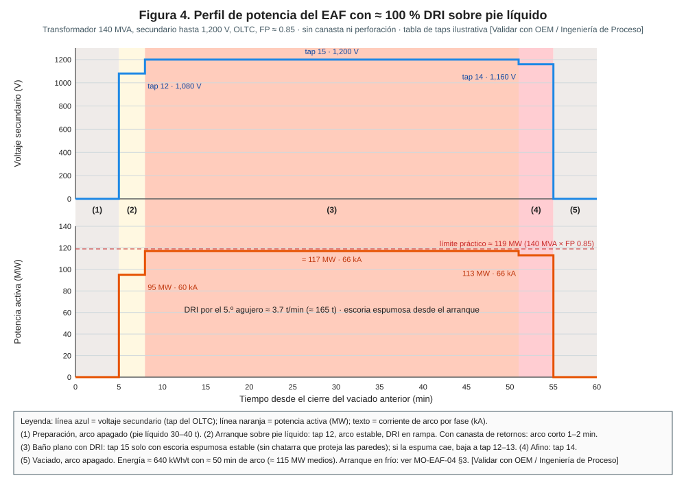
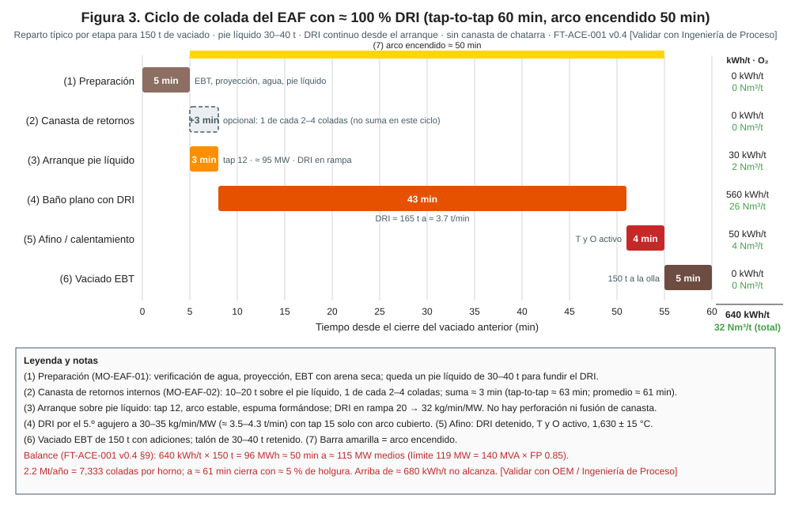
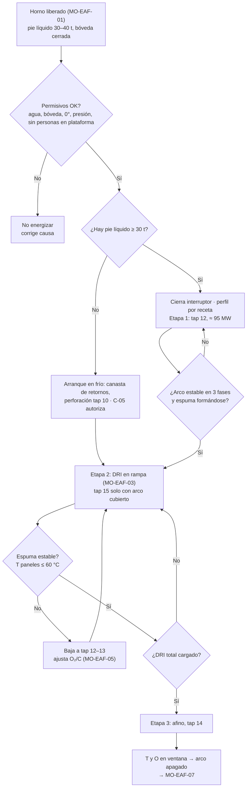

# MO-EAF-04 — Fusión: perfil de potencia y regulación de electrodos

| Código | Versión | Estado | Área | Dueño del proceso | Elaboró | Revisión técnica | Revisión de seguridad | Aprobó | Fecha | Próxima revisión |
|---|---|---|---|---|---|---|---|---|---|---|
| MO-EAF-04 | 0.2 | Borrador para validación | Hornos — EAF-1 / EAF-2 | C-07 Ingeniero de Proceso EAF / LF | experto-operativo-metalurgia | experto-operativo-metalurgia — visto bueno técnico v0.2, 2026-09-28 | experto-seguridad-salud — **pendiente para v0.2** (v0.1 con observaciones, 2026-09-25) | Pendiente (Gerente de Acería / Director) | 2026-09-28 | 2027-09-28 |

> Valores técnicos tomados de `FT-ACE-001` v0.4 (§2 y §9). Lo marcado **[Validar con OEM / Ingeniería de Proceso]** o **[Supuesto]** no se usa en planta hasta que C-07 lo valide.

## 1. Objetivo y alcance
**Objetivo:** fundir ≈ 165 t de DRI sobre el pie líquido en **≈ 50 min de arco** (48–53) con **640 kWh/t (rango 620–680)** y ≈ 115 MW medios, arco estable y cubierto por escoria espumosa, sin daño a bóveda y paneles, y con consumo de electrodo de **1.4–1.7 kg/t**, siguiendo el perfil de potencia (taps del transformador y corriente) de cada etapa.

**Alcance:** desde la liberación del horno (MO-EAF-01) o el cierre de la bóveda tras una canasta de retornos (MO-EAF-02) hasta el apagado del arco para el vaciado (MO-EAF-07): **arranque sobre pie líquido, baño plano con DRI desde el inicio y afino**. Con 100 % DRI **no hay fase de canasta ni de perforación** en la colada normal. Incluye el **perfil de arranque en frío** (horno sin pie líquido) y la vigilancia de la regulación automática de electrodos.
**No incluye:** maniobras de alta tensión y mantenimiento del transformador (MM-EAF-04) ni de la hidráulica de brazos (MM-EAF-02).

## 2. Roles y responsabilidades
| Rol | Responsabilidad en este proceso | R/A/C/I |
|---|---|---|
| C-07 Ingeniero de Proceso EAF / LF | Dueño. Define y mantiene los perfiles de potencia por receta, las consignas de impedancia y los límites. | A |
| S-01 Primer Hornero | Selecciona el perfil, energiza, vigila la regulación, cambia de etapa y responde a alarmas. | R |
| C-05 Supervisor de Hornos | Autoriza desviaciones del perfil y la operación con una fase en falla. | C |
| S-20 Electricista / S-21 Instrumentista | Atienden fallas del interruptor, del OLTC, de la regulación y de la medición. | C |
| S-02 Segundo Hornero | Informa de lo que ve en el horno (colapso, arco expuesto, escoria). | I |

## 3. Descripción del proceso
El transformador de **140 MVA** (secundario hasta **1,200 V**, OLTC) alimenta 3 electrodos de grafito de **610 mm**. El voltaje (tap) fija la longitud del arco; la regulación de electrodos mueve cada brazo con hidráulica para mantener la **impedancia de consigna** (Z = V/I) y con ello la corriente. **Arco largo = más potencia y más radiación a paredes**: solo se usa cuando el arco está **cubierto por escoria espumosa**. Con 100 % DRI el baño está plano desde el inicio: **no hay carga sólida que proteja las paredes**, así que la escoria espumosa es la única protección y se vigila desde el minuto 0. Con arco expuesto se baja el tap.

**Perfil de referencia (100 % DRI sobre pie líquido)** — tabla de taps ilustrativa [Validar con OEM / Ingeniería de Proceso]:

| Etapa | Tiempo (min de arco) | Tap / voltaje secundario | Corriente por fase | Potencia activa | Energía acumulada al final | Condición para pasar a la siguiente etapa |
|---|---|---|---|---|---|---|
| 1. Arranque sobre pie líquido | 0–3 | Tap 12 · ≈ 1,080 V | ≈ 60 kA | ≈ 95 MW | ≈ 30 kWh/t | Arco estable en las 3 fases; escoria espumosa formándose; DRI en rampa 20 → 32 kg/min/MW (MO-EAF-03) |
| 2. Baño plano con DRI | 3–46 | Tap 15 · 1,200 V (12–13 si la espuma baja) | ≈ 66 kA | ≈ 117 MW | ≈ 590 kWh/t | DRI total cargado (≈ 165 t a ≈ 3.7 t/min) |
| 3. Afino / calentamiento | 46–50 | Tap 14 · ≈ 1,160 V | ≈ 66 kA | ≈ 113 MW | ≈ 640 kWh/t | T y O activo en ventana de vaciado (MO-EAF-06) |

> **Balance (FT-ACE-001 v0.4 §9):** 140 MVA × FP ≈ 0.85 ≈ **119 MW activos** como límite. 640 kWh/t × 150 t = 96 MWh; a ≈ 115 MW medios son **≈ 50 min de arco**. Con preparación (5 min) y vaciado (5 min), el tap-to-tap es **≈ 60 min** (63 min cuando entra canasta de retornos). Cada +10 kWh/t alarga el arco ≈ 0.8 min. El balance anual de 2.2 Mt cierra con ≈ 5 % de holgura: **por arriba de ≈ 680 kWh/t ya no alcanza**. La incoherencia de v0.3 (560 kWh/t contra 42 min) queda sustituida por este balance.

**Variantes del arranque** [Validar con OEM / Ingeniería de Proceso]:

| Caso | Qué cambia | Perfil |
|---|---|---|
| Colada con canasta de retornos (10–20 t, 1 de cada 2–4) | Hay carga sólida sobre el pie líquido | Etapa 1 con tap 10–12 y arco corto 1–2 min hasta cubrir y fundir los retornos; luego igual. Arranca el DRI cuando la corriente esté estable |
| **Arranque en frío** (sin pie líquido: tras reparación de solera, vaciado total o paro largo) | No hay baño que reciba el DRI | Canasta de retornos de 40–60 t. Perforación con tap 10 (≈ 1,000 V, ≈ 50 kA, ≈ 70–75 MW) ≈ 2–3 min; fusión con tap 15 hasta tener ≥ 70 % fundido y ≥ 30 t líquidas (≈ 12–15 min); DRI en rampa lenta (20 → 28 kg/min/MW). La primera colada dura ≈ 70–80 min y puede vaciarse corta para rehacer el pie líquido. **C-05 autoriza y C-07 da la receta** |
| Pie líquido < 30 t | Menos baño para fundir el DRI | Rampa más lenta (20 → 28 kg/min/MW en 5 min); tap 12–13 hasta que la T suba |

```mermaid
flowchart TD
    A["Horno liberado (MO-EAF-01)<br/>pie líquido 30–40 t, bóveda cerrada"] --> B{"Permisivos OK?<br/>agua, bóveda, 0°, presión, sin personas en plataforma"}
    B -- "No" --> X["No energizar<br/>corrige causa"]
    B -- "Sí" --> P{"¿Hay pie líquido ≥ 30 t?"}
    P -- "No" --> Q["Arranque en frío: canasta de retornos,<br/>perforación tap 10 · C-05 autoriza"]
    Q --> E
    P -- "Sí" --> C["Cierra interruptor · perfil por receta<br/>Etapa 1: tap 12, ≈ 95 MW"]
    C --> D{"¿Arco estable en 3 fases<br/>y espuma formándose?"}
    D -- "No" --> C
    D -- "Sí" --> E["Etapa 2: DRI en rampa (MO-EAF-03)<br/>tap 15 solo con arco cubierto"]
    E --> J{"Espuma estable?<br/>T paneles ≤ 60 °C"}
    J -- "No" --> K["Baja a tap 12–13<br/>ajusta O₂/C (MO-EAF-05)"]
    K --> E
    J -- "Sí" --> H{"¿DRI total cargado?"}
    H -- "No" --> E
    H -- "Sí" --> L["Etapa 3: afino, tap 14"]
    L --> M["T y O en ventana → arco apagado<br/>→ MO-EAF-07"]
```

## 4. Equipos y maquinaria
| Equipo / componente | Función | Especificación clave | Condición para operar (verificación) |
|---|---|---|---|
| Transformador del horno | Suministra potencia | 140 MVA; secundario hasta 1,200 V | Sin alarma de temperatura de aceite ni Buchholz; enfriamiento en servicio |
| Cambiador de derivaciones bajo carga (OLTC) | Cambia el voltaje (tap) | 15 posiciones ilustrativas [Validar con OEM / Ingeniería de Proceso] | Contador de operaciones dentro de mantenimiento |
| Interruptor de vacío del horno | Energiza / desenergiza | Operaciones por colada ≈ 2–4 | Contador y estado sin alarma |
| Compensación (SVC/STATCOM) si existe | Controla flicker y factor de potencia | [Validar con OEM / Ingeniería de Proceso] | En servicio antes de energizar |
| Brazos, mástiles y regulación hidráulica | Posicionan electrodos | Regulación por impedancia; servoválvulas | Presión hidráulica en rango; sin fugas |
| Electrodos | Conducen la corriente | 610 mm UHP; niple 4TPI | Longitud suficiente; sin grietas; juntas apretadas (MO-EAF-08) |
| Medición de corriente, voltaje y potencia | Control y registro | kA, V, MW, kWh | Lectura estable en las 3 fases |
| Termopares / flujo de calor de paneles | Detectan arco expuesto | Alarma T salida > 60 °C | Sin alarma |

## 5. Parámetros de operación
| Parámetro | Unidad | Objetivo | Rango normal | Alarma / límite | Acción si está fuera de rango | Dónde se mide |
|---|---|---|---|---|---|---|
| Energía eléctrica | kWh/t | 640 | 620–680 | > 680 o < 600 | > 680: revisa metalización y C del DRI, ganga, espuma, O₂ y demoras con arco; reporte a C-07 (arriba de 680 no se sostienen 2.2 Mt/año). < 600: verifica medición y balance | Nivel 2 |
| Tiempo de arco encendido | min | 50 | 48–53 | > 55 | Registra causa (DRI de baja metalización, escoria, demoras) | Nivel 2 |
| Potencia activa en baño plano | MW | ≈ 117 | 112–119 | < 108 sostenido | Revisa espuma, tap, regulación. No se puede pasar de ≈ 119 MW (140 MVA × FP 0.85). Con < 108 MW medios no se sostienen 2.2 Mt/año | HMI |
| Corriente por fase (etapas 2–3) | kA | 66–67 | 58–67 | > 67 kA (nominal: 140 MVA / (√3 × 1,200 V) ≈ 67 kA) | La regulación reduce; si persiste, baja tap | HMI |
| Desbalance de corriente entre fases | % | ≤ 5 | 0–10 [Supuesto] | > 10% por > 30 s | Revisa electrodo corto, colapso o falla de regulación | HMI |
| Cortocircuitos (electrodo en contacto con el baño o la carga) | n/min | 0 | ≤ 2 en arranque o con retornos | > 5/min | Revisa consigna de impedancia y velocidad de regulación | HMI / nivel 2 |
| T de salida de panel | °C | ≤ 50 | 35–55 | > 60 °C | Baja tap 2 posiciones; mejora espuma (MO-EAF-05) | HMI |
| Δ caudal de agua | % | ≤ 1 | 0–2 | > 2% alarma; > 4% disparo | Ver MO-EAF-01 §9 | HMI |
| Consumo de electrodo | kg/t | 1.5 | 1.4–1.7 | > 1.8 | Revisa roturas, oxidación lateral (O₂ cerca de columnas), corriente | Nivel 2 (por turno) |
| Presión del horno | Pa | −10 | −5 a −15 | > 0 Pa | Revisa DES; no subas tap | HMI |
| Ruido de arco / THD de corriente | — | Bajo con espuma | — | Alto en baño plano | Arco expuesto: mejora espuma, baja tap | HMI / percepción |
| Tap-to-tap | min | 60 | 58–64 (63 con canasta de retornos) | > 66 | Analiza tiempos sin arco (preparación, vaciado, esperas de olla) con C-05 | Nivel 2 |

## 6. Seguridad
### 6.1 Peligros y controles críticos
| Peligro | Consecuencia | Control crítico | Verificación |
|---|---|---|---|
| Energizar con personas en plataforma de bóveda o de electrodos | Electrocución, quemadura por arco | ★ Llave cautiva para el acceso de rutina (una llave por persona; sin todas las llaves en el tablero no cierra el interruptor) o LOTO completo para intervenir el equipo (MS-ACE-02 §6.4) | Tablero de llaves completo; prueba mensual del sistema; VCC |
| Arco con fuga de agua | Explosión | ★ Disparo automático > 4%; no rearmar sin liberar la fuga | Prueba del enclavamiento (mantenimiento) |
| Arco expuesto con tap alto | Perforación de paneles → fuga de agua | ★ Tap alto solo con arco cubierto; bajar tap ante T de panel > 60 °C | Tendencias de panel |
| Rotura de electrodo | Caída de trozos, cortocircuito, proyección | Arco corto con retornos o en arranque en frío; juntas apretadas | Registro de roturas |
| Campo magnético y alta corriente | Afecta marcapasos; calentamiento de objetos | Señalización; personal con implantes no entra a zona de barras | Examen médico |
| Ruido > 100 dB(A) y radiación UV/IR | Hipoacusia; lesiones oculares | Púlpito cerrado; EPP auditivo y visual en piso | Dosimetría (NOM-011) |
| Arco expuesto en baño plano desde el inicio (sin carga sólida que proteja paredes) | Perforación de paneles → fuga de agua | ★ Espuma desde el minuto 0; tap 15 solo con arco cubierto; bajar tap ante T de panel > 60 °C | Tendencias de panel |
| Colapso de retornos (solo con canasta o en arranque en frío) | Salpicadura, rotura de electrodo | Subir electrodos y bajar tap | Observación S-02 |

### 6.2 EPP obligatorio
En púlpito: ropa ignífuga y calzado de seguridad. En piso del horno: casco, careta con visor dorado, ropa ignífuga, chaqueta aluminizada frente a la puerta, guantes, botas metatarsales, doble protección auditiva con arco encendido, detector personal multigás (CO 25/200 ppm; MS-ACE-06).

### 6.3 Permisos, bloqueos y zonas de exclusión
- **Permisivos para energizar** [Validar con OEM / Ingeniería de Proceso]: bóveda cerrada y asentada, horno a 0° ± 2°, agua en rango (Δ ≤ 2%, P ≥ 3 bar), hidráulica en presión, presión del horno negativa, todas las llaves cautivas en el tablero, compensación en servicio.
- ★ Nadie sube a la plataforma de electrodos o de bóveda con el interruptor cerrado. Toda subida = interruptor abierto + **llave cautiva** (acceso de rutina, una llave por persona) o **LOTO completo** (intervención en el equipo, entrada a la bóveda o sistema de llaves en falla), según MS-ACE-02 §6.4.
- Con disparo por fuga de agua: nadie a menos de 25 m del horno hasta que C-05 y C-07 autoricen (MS-ACE-03).
- Zona de barras (bus) y transformador: acceso solo para S-20 con permiso eléctrico (NOM-029).

## 7. Calidad
| Variable crítica de calidad | Especificación | Método / frecuencia | Registro | Defecto si falla |
|---|---|---|---|---|
| Temperatura al final del afino | 1,630 ± 15 °C (según grado) | Termopar desechable (MO-EAF-06) | Nivel 2 | Sobre-T: refractario, N; baja T: congelamiento en olla |
| Captura de nitrógeno | Mínima: arco cubierto por espuma | N al vaciado ≤ 40 ppm [Supuesto] | Laboratorio | N alto en bajo carbono |
| Energía por colada | 640 kWh/t (620–680) | Por colada | Nivel 2 | Costo y capacidad; indica problema de escoria o de calidad del DRI |
| Consumo de electrodo | 1.4–1.7 kg/t | Por turno | Nivel 2 | Costo; roturas |

## 8. Procedimiento paso a paso
| # | Paso | Cómo hacerlo (detalle y medición) | Criterio de aceptación | ★ | Rol |
|---|---|---|---|---|---|
| 1 | Verifica permisivos | Revisa en HMI: bóveda, 0°, agua, hidráulica, presión, llaves cautivas completas. | Todos en verde | ★ | S-01 |
| 2 | Selecciona el perfil | Elige el perfil de la receta del grado: normal (pie líquido), con canasta de retornos o arranque en frío (§3). Confirma el pie líquido en nivel 2 (MO-EAF-01). | Perfil correcto en nivel 2 | | S-01 |
| 3 | Energiza | Confirma por CCTV y radio plataformas vacías y todas las llaves cautivas en el tablero; avisa por radio "arco en 10 s"; cierra el interruptor. | Arco en las 3 fases | ★ | S-01 |
| 4 | Arranca sobre el pie líquido | Tap 12, regulación automática; con retornos, arco corto 1–2 min hasta cubrirlos. Vigila cortocircuitos y desbalance. | Arco estable en ≈ 2–3 min | | S-01 |
| 5 | Inicia DRI y espuma | Arranca MO-EAF-03 (rampa 20 → 32 kg/min/MW) y MO-EAF-05 (lanzas e inyección de C). | Espuma visible en puerta/cámara | ★ | S-01 |
| 6 | Pasa a potencia plena | Tap 15 **solo si la espuma cubre el arco**. | ≈ 66 kA, ≈ 117 MW; T panel ≤ 60 °C | ★ | S-01 |
| 7 | Ajusta tap por espuma | Espuma baja: tap 12–13 y corrige O₂/C. Espuma estable: tap 15. | Arco estable | | S-01 |
| 8 | Vigila energía y tiempo | Sigue kWh/t acumulados contra el perfil (≈ 590 kWh/t al terminar el DRI). Con retraso > 3 min, avisa a C-07. | Dentro del perfil ± 3 min | 🔎 | S-01 |
| 9 | Vigila roturas y colapsos (retornos o arranque en frío) | Si la corriente se dispara o cae de golpe, sube electrodos, baja tap y confirma integridad. | Sin rotura | ★ | S-01 |
| 10 | Afino | DRI detenido; tap 14; medición de T y O (MO-EAF-06). | T y O en ventana | 🔎 | S-01 / S-02 |
| 11 | Apaga el arco | Abre el interruptor; sube electrodos a posición de vaciado. | Interruptor abierto | | S-01 |
| 12 | Registra | kWh/t, min de arco, MW promedio, tap-to-tap, roturas, alarmas. | Registro completo | | S-01 |

## 9. Condiciones anormales y respuesta
| Síntoma / alarma | Causa probable | Acción inmediata | A quién avisar |
|---|---|---|---|
| Arco inestable (corriente oscilante, ruido alto) | Arco expuesto, escoria poco espumosa, colapso | Baja tap 2 posiciones; corrige O₂/C; baja tasa de DRI | C-07 |
| Colapso de retornos (canasta o arranque en frío) | Retornos grandes o mal acomodados | Sube electrodos, baja tap, revisa electrodos y corriente | C-05 |
| kWh/t acumulados > 20 kWh/t sobre el perfil | Metalización baja, ganga alta, espuma pobre, iceberg | Revisa lote y silo con C-17; ajusta O₂/C; revisa T | C-07 |
| Rotura de electrodo | Colapso de retornos, junta floja, pieza pesada | Abre interruptor; evalúa: trozo en el baño se funde; columna corta → MO-EAF-08 | C-05 |
| Disparo por fuga de agua (> 4%) | Panel o bóveda perforado | 🛑 No rearmes; no inclines ni muevas electrodos; evacúa a ≥ 25 m (MS-ACE-03); aplica MO-EAF-01 §9 y MS-ACE-09 | C-05, C-04, C-07, Mantenimiento |
| T de panel > 60 °C | Arco expuesto, escoria baja | Baja tap; mejora espuma; si no baja, aísla el panel con C-05 | C-05 |
| Desbalance > 10% | Electrodo corto, regulación en falla | Revisa longitudes; pasa la fase a manual solo con autorización de C-05 | C-05, S-21 |
| Disparo de sobrecorriente o del interruptor | Cortocircuito prolongado, falla eléctrica | No rearmes más de 1 vez sin revisar; S-20 investiga | S-20, C-05 |
| Electrodo baja solo (deriva hidráulica) | Fuga o falla de servoválvula | Abre interruptor; bloquea hidráulica; LOTO completo (no basta la llave cautiva) | S-22, C-05 |
| Alarma del transformador | Temperatura, Buchholz | Desenergiza según OEM | S-20, C-12 |

## 10. Registros
- Perfil ejecutado por colada: taps, kA, MW, kWh/t, min de arco, cortocircuitos (nivel 2).
- Consumo de electrodos y roturas (bitácora).
- Alarmas y disparos eléctricos con causa.
- Operaciones del OLTC y del interruptor (mantenimiento).

## 11. Competencia requerida y certificación
| Rol | Nivel requerido (1–4) | Formación teórica (h) | OJT supervisado (h / eventos) | Evaluación (pasos ★) | Vigencia |
|---|---|---|---|---|---|
| S-01 Primer Hornero | 3 | 32 (eléctrica del EAF, regulación, perfiles con 100 % DRI, escoria) | 160 h / 60 coladas + simulador (incluye 1 arranque en frío simulado) | Pasos 1, 3, 5, 6, 9 + escenarios de disparo por agua, arco expuesto y arranque en frío | 24 meses (TD-P07) |
| C-05 Supervisor de Hornos | 4 | 32 + evaluador | — | Evaluación de perfiles y respuesta a anormalidades | 24 meses |
| C-07 Ingeniero de Proceso | 4 | 40 | — | Diseño de perfil y análisis energético | 24 meses |

Lista corta de verificación de pasos ★:
1. Enumera los permisivos para energizar, verifica las llaves cautivas completas y confirma plataformas vacías antes de cerrar el interruptor (pasos 1 y 3); distingue llave cautiva de LOTO completo (MS-ACE-02 §6.4).
2. Explica por qué el tap alto solo se usa con arco cubierto.
3. Explica por qué con 100 % DRI la espuma es la única protección de las paredes y sube el tap solo con arco cubierto; responde a un colapso de retornos sin romper electrodos.
4. No rearma tras un disparo por fuga de agua.
5. Lee T de panel y reacciona antes de 60 °C.

## 12. Referencias
- FT-ACE-001 v0.4 §2 y §9; CAT-ACE-001 v0.2; MO-EAF-01, MO-EAF-02, MO-EAF-03, MO-EAF-05, MO-EAF-06, MO-EAF-08; MM-EAF-02, MM-EAF-04.
- MS-ACE-02 (LOTO), MS-ACE-03, MS-ACE-09.
- NOM-029-STPS (mantenimiento eléctrico), NOM-022-STPS (electricidad estática), NOM-011-STPS (ruido), NOM-017-STPS — verificar con Jurídico Laboral / SSO.
- Manual OEM del transformador, OLTC, interruptor y regulación de electrodos [por referenciar].
- TD-P07.

## 13. Control de cambios
| Versión | Fecha | Cambio | Autor |
|---|---|---|---|
| 0.1 | 2026-09-25 | Emisión inicial para validación. Registra inconsistencia energía vs. tiempo de arco. | experto-operativo-metalurgia |
| 0.1 | 2026-09-25 | Revisión técnica cruzada contra FT-ACE-001 v0.3: energía 560 kWh/t (520–600), potencia activa ≤ 119 MW, corrientes por etapa y perfil de referencia recalculado (≈ 44 min de arco a 560 kWh/t; propuesta a la ficha). | experto-operativo-metalurgia |
| 0.2 | 2026-09-28 | **Decisión D-010 (≈ 95–100 % DRI):** perfil de 3 etapas sin canasta ni perforación: arranque sobre pie líquido (tap 12, ≈ 95 MW, 0–3 min), baño plano con DRI desde el inicio (tap 15, ≈ 117 MW, 3–46 min) y afino (tap 14, ≈ 113 MW, 46–50 min). Energía 640 kWh/t (620–680), arco ≈ 50 min, tap-to-tap 60 min, electrodo 1.4–1.7 kg/t, N ≤ 40 ppm. Variantes: canasta de retornos y arranque en frío. Pasos 2–11 reescritos. Cierra la propuesta P-1 de RT-MO-ACE-001 con el balance de FT-ACE-001 v0.4 §9. Requiere nueva revisión de seguridad | experto-operativo-metalurgia |
