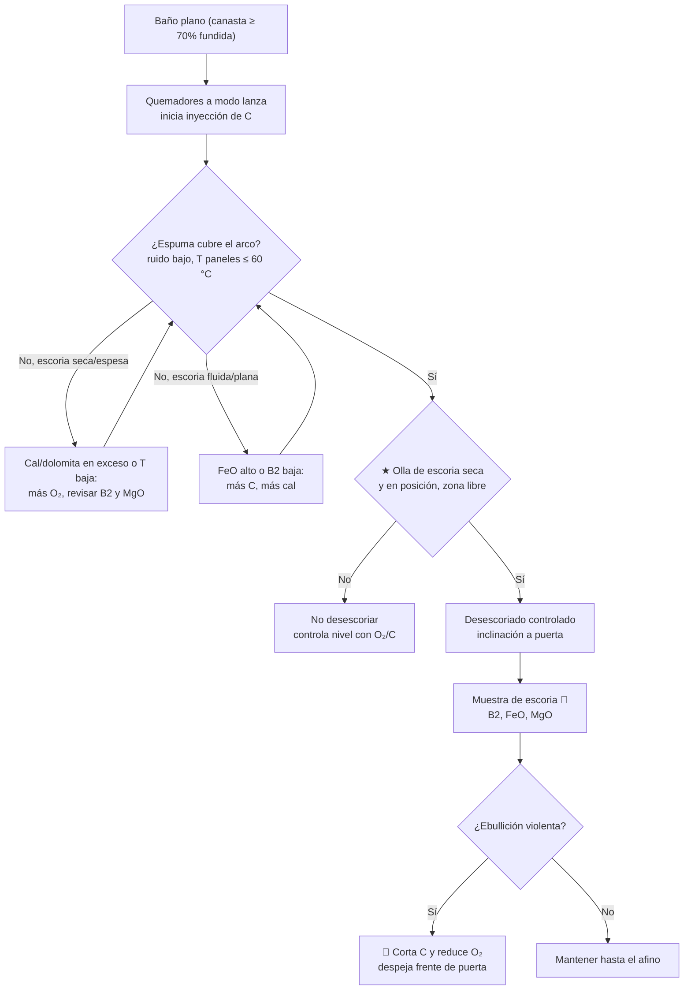

# MO-EAF-05 — Escoria espumosa: inyección de O₂ y carbono, desescoriado

| Código | Versión | Estado | Área | Dueño del proceso | Elaboró | Revisión técnica | Revisión de seguridad | Aprobó | Fecha | Próxima revisión |
|---|---|---|---|---|---|---|---|---|---|---|
| MO-EAF-05 | 0.1 | Borrador para validación | Hornos — EAF-1 / EAF-2 | C-07 Ingeniero de Proceso EAF / LF | experto-operativo-metalurgia | experto-operativo-metalurgia | experto-seguridad-salud | Pendiente (Gerente de Acería / Director) | 2026-09-25 | 2027-09-25 |

> Valores técnicos tomados de `FT-ACE-001` v0.2. Lo marcado **[Validar con OEM / Ingeniería de Proceso]** o **[Supuesto]** no se usa en planta hasta que C-07 lo valide.

## 1. Objetivo y alcance
**Objetivo:** formar y mantener una **escoria espumosa** que cubra el arco durante el baño plano, con **B2 (CaO/SiO₂) 1.8–2.2, FeO 25–35% y MgO 8–10%**, usando **O₂ 30–40 Nm³/t** y **carbono 8–12 kg/t**, y retirar la escoria por la puerta de forma controlada, sin exponer a nadie y sin contacto con agua.

**Alcance:** operación de los 4 quemadores/lanzas de pared (modo quemador y modo lanza), inyección de carbono, adición de cal y dolomita, control de espuma y desescoriado hacia la olla de escoria; incluye la coordinación con S-10 para el retiro de la olla de escoria.
**No incluye:** manejo de la escoria fuera de la nave (patio de escoria) ni el mantenimiento de lanzas.

## 2. Roles y responsabilidades
| Rol | Responsabilidad en este proceso | R/A/C/I |
|---|---|---|
| C-07 Ingeniero de Proceso EAF / LF | Dueño. Define los programas de O₂/gas/C por etapa y la química objetivo de la escoria. | A |
| S-01 Primer Hornero | Opera quemadores, lanzas e inyección de C desde el púlpito; ajusta según espuma, T y análisis. | R |
| S-02 Segundo Hornero | Observa la puerta, controla el flujo de escoria, toma muestra de escoria, limpia la puerta. | R |
| S-10 Operador de Manejo de Escoria | Coloca la olla de escoria seca bajo la puerta, la retira llena y la vacía en el patio. | R |
| S-11 Muestrero / Analista | Analiza la escoria (CaO, SiO₂, FeO, MgO, P₂O₅). | C |
| C-05 Supervisor de Hornos | Autoriza desviaciones y detiene el desescoriado ante riesgo. | C |

## 3. Descripción del proceso
El **O₂** oxida parte del hierro a FeO; el **carbono** inyectado reduce ese FeO y forma **CO**, cuyas burbujas hacen crecer ("espumar") la escoria. Con la basicidad y el MgO correctos, la escoria tiene la viscosidad para retener el gas y **cubrir el arco**: el arco transfiere su energía al baño y no a paredes y bóveda. Al subir el nivel, la escoria sale por la puerta a la olla de escoria (desescoriado), lo que además retira P.

**Programa de O₂ por etapa (referencia, Figura 3)** [Validar con Ingeniería de Proceso]:

| Etapa | Modo | O₂ por quemador | O₂ acumulado | Carbono |
|---|---|---|---|---|
| Fusión de canasta | Quemador (O₂ + gas natural, relación ≈ 2:1) | 1,500–2,500 Nm³/h | ≈ 8 Nm³/t | Opcional, bajo |
| Baño plano con DRI | Lanza (jet coherente) | 1,800–2,500 Nm³/h | ≈ 30 Nm³/t | 40–60 kg/min total [Supuesto] |
| Afino | Lanza, flujo reducido | 1,000–2,000 Nm³/h | ≈ 35 Nm³/t | Según O activo |

## 4. Equipos y maquinaria
| Equipo / componente | Función | Especificación clave | Condición para operar (verificación) |
|---|---|---|---|
| Quemadores/lanzas de pared (4) | Fundir chatarra (quemador) y afinar/espumar (lanza) | Hasta 2,500 Nm³/h de O₂ cada uno; gas natural para modo quemador | Bloque de cobre con agua normal; boquilla libre; purga de N₂/aire en espera |
| Estación de válvulas O₂ / gas natural | Regula flujos | Presión de O₂ y gas según OEM [Validar con OEM / Ingeniería de Proceso] | Sin fugas; válvulas de corte rápido probadas |
| Inyectores de carbono | Inyectan finos de coque/antracita | 8–12 kg/t | Silo con nivel; transporte neumático sin tapones |
| Tolvas de cal y dolomita | Fundentes | Cal 30–45 kg/t; dolomita 10–15 kg/t | Material seco |
| Puerta de escoria | Salida de escoria y acceso para medición | — | Umbral libre de costras |
| Olla de escoria y portaollas | Recibe la escoria | ≈ 20 m³ [Supuesto] | ★ Seca, sin agua ni hielo; recubierta con cal/polvo si aplica |
| Fosa/zona bajo la puerta | Aloja la olla de escoria | — | ★ Seca, sin charcos ni tuberías con fuga |

## 5. Parámetros de operación
| Parámetro | Unidad | Objetivo | Rango normal | Alarma / límite | Acción si está fuera de rango | Dónde se mide |
|---|---|---|---|---|---|---|
| Consumo de O₂ | Nm³/t | 35 | 30–40 | > 42 | Sobreoxidación: revisa O activo y FeO; reduce | Nivel 2 |
| Flujo por quemador/lanza | Nm³/h | según etapa | ≤ 2,500 | > 2,500 | Limitado por válvula; revisa control | HMI |
| Inyección de carbono | kg/t | 10 | 8–12 | < 7 o > 14 | Ajusta según espuma y FeO | Nivel 2 |
| Cal | kg/t | 38 | 30–45 | < 28 o > 50 | Ajusta relación con DRI (MO-EAF-03) | Nivel 2 |
| Dolomita | kg/t | 12 | 10–15 | < 8 | MgO bajo: agrega | Nivel 2 |
| Basicidad B2 = CaO/SiO₂ | — | 2.0 | 1.8–2.2 | < 1.6 o > 2.5 | < 1.6: más cal (ataque al refractario, mala desfosforación); > 2.5: escoria seca, no espuma → revisa exceso de cal | Análisis de escoria |
| FeO en escoria | % | 30 | 25–35 | > 38 o < 20 | > 38: más C, menos O₂ (pérdida de Fe); < 20: más O₂ (espuma pobre, poca desfosforación) | Análisis de escoria |
| MgO en escoria | % | 9 | 8–10 (saturación) | < 7 | Más dolomita (protege refractario) | Análisis de escoria |
| Altura de espuma | — | Cubre el arco | ≥ longitud de arco [Validar con OEM / Ingeniería de Proceso] | Arco expuesto (ruido, T panel) | Más C; baja tap (MO-EAF-04) | Ruido, THD, T de panel, cámara |
| Cantidad de escoria | kg/t | 110 [Supuesto] | 100–130 | > 150 | Revisa ganga del DRI y cal | Balance nivel 2 |
| P₂O₅ en escoria | % | según balance | [Validar con Ingeniería de Proceso] | P en acero > 0.015% | Más desescoriado; FeO y B2 en rango; T no excesiva | Análisis |

**Diagnóstico rápido de la escoria por observación (en la puerta o la cámara)** [Validar con C-07]:

| Lo que se ve / oye | Diagnóstico probable | Corrección |
|---|---|---|
| Escoria que sale en "pan" esponjoso y continuo; arco silencioso | Espuma correcta | Mantener |
| Escoria líquida, brillante, corre como agua; arco ruidoso | FeO alto y/o B2 baja; T alta | Más C, más cal |
| Escoria seca, en terrones, no fluye | Cal o MgO en exceso; T baja | Más O₂; menos cal; revisar T |
| Espuma que sube de golpe con llama larga | Inicio de ebullición | Cortar C, reducir O₂ (§9) |
| Escoria con gotas metálicas brillantes | Arrastre de metal por inclinación | Reducir inclinación |

## 6. Seguridad
### 6.1 Peligros y controles críticos
| Peligro | Consecuencia | Control crítico | Verificación |
|---|---|---|---|
| Escoria sobre agua u olla de escoria húmeda | Explosión | ★ Olla y fosa secas; verificación visual antes de cada desescoriado; no lanzar agua a escoria líquida | S-10 confirma "olla seca" por radio |
| Ebullición violenta (boiling) | Escoria y metal proyectados por la puerta | ★ No agregar C en masa a escoria muy oxidada; cortar C y reducir O₂; frente de la puerta despejado | Tendencia de FeO/O₂; supervisor |
| Enriquecimiento de O₂ | Incendio de ropa o de equipo | Ropa sin grasa; válvulas de corte rápido; detección de fuga | Prueba de válvulas |
| Retroceso de llama en quemador | Quemaduras, daño | Secuencia de encendido automática con purga | Mantenimiento OEM |
| Fuga de agua de bloque de quemador | Explosión | Monitoreo de agua del bloque; disparo | HMI |
| CO por la puerta | Intoxicación | Extracción; detector de CO; presión del horno negativa | Detector |
| Tránsito del portaollas | Atropellamiento | Rutas señalizadas; peatones fuera; claxon | VCC |

### 6.2 EPP obligatorio
S-02 en la puerta: careta con visor dorado, capucha y chaqueta aluminizadas, polainas, guantes aluminizados, ropa ignífuga, botas metatarsales, auditiva, detector de CO. S-10: cabina del portaollas cerrada; fuera de ella, el mismo EPP que S-02.

### 6.3 Permisos, bloqueos y zonas de exclusión
- ★ Zona de exclusión frente y bajo la puerta de escoria mientras sale escoria: solo el portaollas en posición; peatones fuera.
- Antes de colocar la olla de escoria: fosa inspeccionada, sin agua ni tuberías con fuga.
- Cambio de boquillas de lanza: arco apagado, O₂ y gas cerrados y bloqueados (LOTO de válvulas, MS-ACE-02 y MS-ACE-06).

## 7. Calidad
| Variable crítica de calidad | Especificación | Método / frecuencia | Registro | Defecto si falla |
|---|---|---|---|---|
| Fósforo del acero al vaciado | ≤ 0.015% | Muestra (MO-EAF-06) | Laboratorio | P fuera de especificación; fragilidad |
| Química de escoria | B2 1.8–2.2; FeO 25–35%; MgO 8–10% | Muestra de escoria en el afino, cada colada [Supuesto] | Laboratorio | Refractario atacado; pérdida de Fe; mala espuma |
| O activo al vaciado | 500–900 ppm | Sonda (MO-EAF-06) | Nivel 2 | Sobreoxidación → más Al en olla e inclusiones |
| Nitrógeno | Bajo con espuma estable | Muestra | Laboratorio | N alto |

## 8. Procedimiento paso a paso
| # | Paso | Cómo hacerlo (detalle y medición) | Criterio de aceptación | ★ | Rol |
|---|---|---|---|---|---|
| 1 | Verifica equipos | Agua de bloques de quemador normal; presiones de O₂, gas y aire de transporte de C; silos con nivel. | Sin alarmas | | S-01 |
| 2 | Opera en modo quemador | Durante la fusión de canasta, relación O₂:gas ≈ 2:1, 1,500–2,500 Nm³/h. | Chatarra frente a quemador fundida | | S-01 |
| 3 | Cambia a modo lanza | Con baño plano; lanzas al programa de la etapa. | Transición sin retroceso de llama | | S-01 |
| 4 | Inicia carbono | Inyección 40–60 kg/min total; ajusta según espuma. | Espuma visible en puerta/cámara | | S-01 |
| 5 | Agrega fundentes | Cal y dolomita con el DRI (MO-EAF-03). | B2 y MgO en rango | 🔎 | S-01 |
| 6 | Verifica olla de escoria | S-10 coloca la olla; S-02 confirma seca y fosa sin agua. | "Olla seca" confirmada | ★ | S-10 / S-02 |
| 7 | Despeja la zona | Frente y bajo la puerta sin personas; bocina. | Zona libre | ★ | S-02 |
| 8 | Desescoria | Inclina hacia la puerta (−3 a −8° [Validar con OEM]); deja salir escoria a flujo continuo, sin arrastrar metal. | Flujo controlado | | S-01 |
| 9 | Toma muestra de escoria | Con cuchara o probador desde posición protegida, en el afino. | Muestra enviada | 🔎 | S-02 / S-11 |
| 10 | Corrige la química | FeO > 38%: más C / menos O₂; B2 < 1.8: más cal; MgO < 8%: dolomita. | En rango en la siguiente muestra | | S-01 |
| 11 | Vigila ebullición | Subida súbita de espuma, llama larga en la puerta, CO alto: aplica §9. | Sin ebullición | ★ | S-01 / S-02 |
| 12 | Retira la olla de escoria | Llena ≤ 80% [Supuesto]; S-10 la retira por la ruta. | Sin derrame | | S-10 |
| 13 | Registra | O₂, C, cal, dolomita, análisis de escoria, eventos. | Registro completo | | S-01 |

## 9. Condiciones anormales y respuesta
| Síntoma / alarma | Causa probable | Acción inmediata | A quién avisar |
|---|---|---|---|
| Ebullición violenta (boiling), escoria saliendo en masa | Acumulación de FeO + C; iceberg de DRI fundiendo | 🛑 Corta C, reduce O₂, detén DRI; todos fuera del frente de la puerta; no inclines más | C-05, C-04 |
| Escoria plana, arco ruidoso | FeO alto / B2 baja / T alta | Más C, más cal; baja tap | C-07 |
| Escoria seca o espesa | Cal en exceso, T baja, MgO alto | Más O₂, menos cal, revisa T | C-07 |
| Olla de escoria húmeda o fosa con agua | Lluvia, fuga de tubería | 🛑 No desescoriar; controla el nivel con O₂/C; cambia olla | C-05 |
| Escoria con metal (arrastre) | Inclinación excesiva | Reduce inclinación | S-01 |
| Retroceso de llama / alarma de quemador | Boquilla tapada, presión baja | Corta ese quemador; purga; mantenimiento | C-05 |
| Fuga de agua de bloque de quemador | Daño del cobre | Corta O₂ y agua del bloque; aplica MO-EAF-01 §9 | C-05, Mantenimiento |
| Tapón en inyector de carbono | Humedad en finos, presión baja | Cambia a otro inyector; limpia con LOTO | C-05 |
| P > 0.015% antes de vaciar | FeO o B2 bajos, poco desescoriado, T alta | Más desescoriado, cal y O₂; C-05 decide si se vacía | C-05, C-09 |

## 10. Registros
- Consumos por colada: O₂ (Nm³/t), gas natural, carbono, cal, dolomita (nivel 2).
- Análisis de escoria (B2, FeO, MgO, P₂O₅) por colada.
- Registro de ollas de escoria (número, estado seco, llenado).
- Eventos de ebullición y retrocesos de llama.

## 11. Competencia requerida y certificación
| Rol | Nivel requerido (1–4) | Formación teórica (h) | OJT supervisado (h / eventos) | Evaluación (pasos ★) | Vigencia |
|---|---|---|---|---|---|
| S-01 Primer Hornero | 3 | 24 (química de escoria, O₂, C) | 120 h / 50 coladas | Pasos 11 y control químico (10) + escenario de boiling | 24 meses (TD-P07) |
| S-02 Segundo Hornero | 3 | 12 | 60 h / 30 desescoriados | Pasos 6, 7, 9, 11 | 24 meses |
| S-10 Operador de Escoria | 3 | 16 (portaollas, rutas, escoria–agua) | 60 h / 40 ollas | Paso 6 (olla y fosa secas) y rutas | 24 meses |

Lista corta de verificación de pasos ★:
1. Confirma olla de escoria y fosa secas antes de desescoriar.
2. Despeja la zona frente a la puerta.
3. Reconoce una ebullición violenta y ejecuta la respuesta (cortar C, reducir O₂, retirar personas).
4. Interpreta B2, FeO y MgO y elige la corrección correcta.

## 12. Referencias
- FT-ACE-001 §2; CAT-ACE-001; MO-EAF-03, MO-EAF-04, MO-EAF-06.
- MS-ACE-01, MS-ACE-03, MS-ACE-06 (O₂, CO, gas natural), MS-ACE-09.
- NOM-017-STPS, NOM-015-STPS, NOM-010-STPS, NOM-006-STPS (portaollas), NOM-020-STPS (sistemas a presión) — verificar con Jurídico Laboral / SSO.
- Manual OEM de quemadores/lanzas y sistema de inyección [por referenciar].
- TD-P07.

## 13. Control de cambios
| Versión | Fecha | Cambio | Autor |
|---|---|---|---|
| 0.1 | 2026-09-25 | Emisión inicial para validación | experto-operativo-metalurgia |
