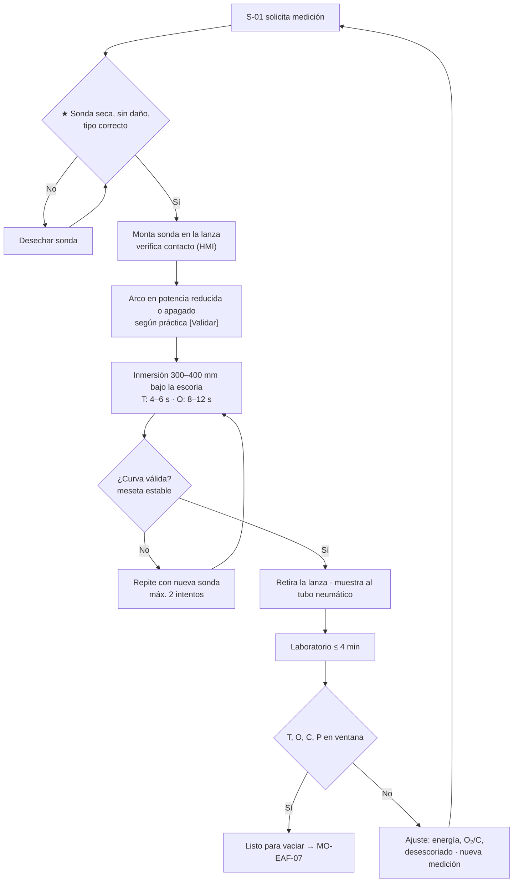

# MO-EAF-06 — Medición de temperatura, oxígeno activo y muestreo

| Código | Versión | Estado | Área | Dueño del proceso | Elaboró | Revisión técnica | Revisión de seguridad | Aprobó | Fecha | Próxima revisión |
|---|---|---|---|---|---|---|---|---|---|---|
| MO-EAF-06 | 0.1 | Borrador para validación | Hornos — EAF-1 / EAF-2 | C-05 Supervisor de Hornos | experto-operativo-metalurgia | experto-operativo-metalurgia | experto-seguridad-salud | Pendiente (Gerente de Acería / Director) | 2026-09-25 | 2027-09-25 |

> Valores técnicos tomados de `FT-ACE-001` v0.1. Lo marcado **[Validar con OEM / Ingeniería de Proceso]** o **[Supuesto]** no se usa en planta hasta que C-07 lo valide.

## 1. Objetivo y alcance
**Objetivo:** obtener lecturas **confiables** de temperatura (T) y oxígeno activo (O) y una **muestra representativa** del acero para decidir el vaciado dentro de la ventana: **T 1,630 ± 15 °C (según grado), O activo 500–900 ppm, C 0.04–0.08%, P ≤ 0.015%**, sin exponer al personal.

**Alcance:** mediciones con **lanza manipuladora** (robot) y **sondas desechables** (termopar, sonda combinada T + O y muestreador) durante la alimentación de DRI y en el afino; envío de la muestra al laboratorio y liberación del resultado. Incluye la medición manual de respaldo.
**No incluye:** mediciones en horno olla (MO-LF-01) ni en colada continua.

## 2. Roles y responsabilidades
| Rol | Responsabilidad en este proceso | R/A/C/I |
|---|---|---|
| C-05 Supervisor de Hornos | Dueño. Autoriza la medición manual de respaldo y el vaciado con datos incompletos. | A |
| S-02 Segundo Hornero | Monta la sonda, opera la lanza manipuladora, valida la curva, recupera y envía la muestra. | R |
| S-11 Muestrero / Analista | Recibe y analiza la muestra (espectrómetro), reporta en ≤ 4 min [Supuesto]. | R |
| S-01 Primer Hornero | Solicita la medición en el momento correcto, decide ajustes y la hora de vaciado. | R |
| C-07 Ingeniero de Proceso | Define momentos de medición, tipos de sonda y reglas de validación. | C |
| C-09 Metalurgista de Producto | Define límites químicos por grado. | C |

## 3. Descripción del proceso
La lanza manipuladora entra por la puerta de escoria (o por el puerto de medición) e inmerge la sonda **a través de la escoria** hasta el acero. El **termopar desechable** entrega una curva que debe estabilizar (meseta). La **sonda combinada** mide además el O activo con una celda de ZrO₂. El **muestreador** toma una "paleta" de acero que viaja al laboratorio por tubo neumático. El O activo permite estimar el C antes de tener el análisis: en el EAF el producto [%C]·[%O] suele ser ≈ 0.0030–0.0040 a 1,600–1,650 °C [Validar con Ingeniería de Proceso] (ejemplo: O 600 ppm → C ≈ 0.05–0.065%).

**Momentos de medición (referencia, Figura 3):**
| # | Momento | Qué se mide | Para qué |
|---|---|---|---|
| M1 | Mitad de la alimentación de DRI (≈ min 25–28 del ciclo) | T | Ajustar kg/min/MW (MO-EAF-03) |
| M2 | Inicio del afino (DRI detenido) | T + O + muestra | Química (C, P, S, Cu, Ni, Cr, Mo) y energía faltante |
| M3 | 1–2 min antes de vaciar | T + O | Confirmar ventana de vaciado y calcular Al/aleaciones de la olla (MO-EAF-07) |

## 4. Equipos y maquinaria
| Equipo / componente | Función | Especificación clave | Condición para operar (verificación) |
|---|---|---|---|
| Lanza manipuladora (robot) | Inmerge sondas sin exponer al operador | Profundidad y tiempo programados [Validar con OEM / Ingeniería de Proceso] | Prueba de contacto del portasondas; movimiento libre; sin alarmas |
| Termopar desechable | Temperatura | Tipo S o B según proveedor [Validar con OEM / Ingeniería de Proceso]; exactitud ± 3 °C [Supuesto] | Lote vigente, almacenado seco |
| Sonda combinada T + O (celda ZrO₂) | Temperatura y O activo | Rango de O según proveedor | Lote vigente, seca, sin golpes |
| Muestreador (paleta) | Muestra para espectrómetro | Con desoxidante (Al/Zr) para evitar porosidad | Seco, sin daño |
| Instrumento de lectura (HMI) | Muestra la curva y el valor | Validación automática de meseta | Calibración periódica con simulador [Supuesto: mensual] |
| Tubo neumático al laboratorio | Envía la muestra | — | Sin atascos |
| Espectrómetro de emisión óptica (OES) | Análisis químico | C, P, S, Mn, Cu, Ni, Cr, Mo, Sn, N (si aplica) | Estandarización por turno |
| Lanza manual de respaldo | Medición si falla el robot | — | Guardada seca; solo con autorización |

## 5. Parámetros de operación
| Parámetro | Unidad | Objetivo | Rango normal | Alarma / límite | Acción si está fuera de rango | Dónde se mide |
|---|---|---|---|---|---|---|
| Temperatura de vaciado | °C | 1,630 (según grado) | 1,615–1,645 | < 1,610 o > 1,650 | < 1,610: calentar (tap 14, ≈ 1 min por 8–10 °C [Supuesto]); > 1,650: esperar/ajustar y avisar a LF | Sonda en M3 |
| O activo al vaciado | ppm | 700 | 500–900 | > 1,000 o < 400 | > 1,000: reduce O₂, agrega C (más Al en olla, más inclusiones); < 400: C alto, revisa | Sonda combinada |
| C al vaciado | % | 0.06 | 0.04–0.08 | > 0.10 | Más O₂ en el afino (grado bajo C) | OES / estimado por O |
| P al vaciado | % | ≤ 0.012 | ≤ 0.015 | > 0.015 | No vaciar sin decisión de C-05/C-09; desescoriar más (MO-EAF-05) | OES |
| Cu, Sn, Ni, Cr (residuales) | % | según grado | según C-09 | Fuera de grado | C-09 decide reasignación de grado | OES |
| Profundidad de inmersión | mm bajo la interfaz escoria–metal | 350 | 300–400 [Validar con OEM / Ingeniería de Proceso] | < 250 | Repite; lectura en escoria da T falsa | Programa de la lanza |
| Tiempo de inmersión | s | T: 5; O: 10 | T 4–6; O 8–12 | > 15 s | La sonda se destruye; repite | HMI |
| Meseta de T válida | °C | Variación ≤ 2 °C por ≥ 1.5 s [Supuesto] | — | Sin meseta | Repite con otra sonda | HMI |
| Tiempo de análisis | min | ≤ 4 [Supuesto] | 3–5 | > 6 | Avisa a S-11; S-01 decide con O y T | Nivel 2 |
| Diferencia T entre dos lecturas consecutivas sin energía | °C | ≤ 5 | — | > 10 | Revisa lote de sondas y profundidad | HMI |

**Interpretación de curvas de medición** [Validar con proveedor de sondas]:

| Forma de la curva | Significado | Acción |
|---|---|---|
| Subida rápida y meseta plana de ≥ 1.5 s | Lectura válida | Registrar |
| Subida lenta sin meseta | Sonda en escoria o inmersión insuficiente | Repetir con mayor profundidad |
| Picos y caídas bruscas | Contacto intermitente o termopar dañado | Limpiar contactos; nueva sonda |
| Meseta baja y luego subida | Sonda húmeda o recubrimiento de escoria | Desechar lote si se repite; revisar almacén |
| Señal de O inestable | Celda dañada o T no estabilizada | Repetir; no usar para cálculo de Al |

## 6. Seguridad
### 6.1 Peligros y controles críticos
| Peligro | Consecuencia | Control crítico | Verificación |
|---|---|---|---|
| Sonda o muestreador húmedo | Explosión/proyección de metal por la puerta | ★ Sondas en almacén seco y cerrado; tubos de cartón íntegros; desechar las mojadas o golpeadas | Inspección antes de montar |
| Exposición en la puerta durante la inmersión | Quemaduras graves, radiación térmica | ★ Uso de la lanza manipuladora; nadie frente a la puerta durante la inmersión | Supervisor |
| Medición manual de respaldo | Exposición directa | ★ Solo con autorización de C-05, arco apagado, EPP aluminizado completo, máx. 1 intento por persona [Supuesto] | Registro de autorización |
| Arco encendido durante la medición | Arco a la lanza, campo magnético | Potencia reducida o apagada según práctica [Validar con OEM / Ingeniería de Proceso] | Enclavamiento de la lanza |
| Salpicadura al retirar la muestra | Quemaduras | Retiro lento; muestra se enfría en posición protegida | Observación |
| Tubo neumático | Golpes | Estación cerrada | — |

### 6.2 EPP obligatorio
S-02: careta con visor dorado, capucha y chaqueta aluminizadas, polainas, guantes aluminizados, ropa ignífuga, botas metatarsales, protección auditiva, detector de CO. S-11 en laboratorio: lentes y guantes para manejo de muestras calientes.

### 6.3 Permisos, bloqueos y zonas de exclusión
- ★ Zona de exclusión frente a la puerta mientras la lanza está dentro del horno.
- Mantenimiento de la lanza manipuladora: LOTO del robot (energía eléctrica, hidráulica/neumática) — MS-ACE-02.
- Medición manual: permiso verbal registrado de C-05 y verificación de EPP por un segundo trabajador.

## 7. Calidad
| Variable crítica de calidad | Especificación | Método / frecuencia | Registro | Defecto si falla |
|---|---|---|---|---|
| Temperatura de vaciado | 1,630 ± 15 °C (según grado) | Sonda en M3, cada colada | Nivel 2 | Congelamiento en olla / sobre-T en refractario |
| O activo | 500–900 ppm | Sonda combinada en M2 y M3 | Nivel 2 | Error en Al de la olla → Al fuera de rango o exceso de inclusiones |
| Química del baño | C 0.04–0.08%; P ≤ 0.015%; residuales por grado | Muestra en M2 | Laboratorio / nivel 2 | Colada fuera de grado |
| Representatividad de la muestra | Paleta sin porosidad ni escoria | Inspección visual en laboratorio | Laboratorio | Análisis falso |
| Trazabilidad | Número de colada, momento, hora | Etiqueta automática | Nivel 2 | Error de asignación |

## 8. Procedimiento paso a paso
| # | Paso | Cómo hacerlo (detalle y medición) | Criterio de aceptación | ★ | Rol |
|---|---|---|---|---|---|
| 1 | Prepara sondas | Toma del almacén seco el tipo requerido (T, T + O, muestreador). Revisa que el cartón no esté húmedo, roto ni golpeado. | Sonda íntegra y seca | ★ | S-02 |
| 2 | Monta la sonda | Coloca en el portasondas hasta el tope; verifica "contacto OK" en la HMI. | Contacto OK | | S-02 |
| 3 | Coordina con el púlpito | S-01 reduce potencia o apaga el arco según la práctica; DRI detenido en M2/M3. | Confirmación por radio | | S-01 |
| 4 | Despeja la puerta | Nadie frente a la puerta ni en la trayectoria de la lanza. | Zona libre | ★ | S-02 |
| 5 | Inmerge | Ejecuta el ciclo automático: 300–400 mm bajo la escoria; T 4–6 s, O 8–12 s. | Ciclo completo | | S-02 |
| 6 | Valida la curva | Meseta estable (≤ 2 °C por ≥ 1.5 s). Si no es válida, repite con otra sonda (máx. 2 intentos). | Lectura válida | 🔎 | S-02 |
| 7 | Retira y envía la muestra | Retira la paleta sin golpear; deja enfriar en posición protegida; envía por tubo neumático con identificación. | Muestra en laboratorio | 🔎 | S-02 |
| 8 | Analiza | Prepara la superficie, analiza, reporta en ≤ 4 min. | Resultado en nivel 2 | 🔎 | S-11 |
| 9 | Decide | Compara T, O, C, P con la ventana del grado; decide ajuste o vaciado. | Ventana cumplida | | S-01 |
| 10 | Informa a olla/LF | Envía T y O finales para el cálculo de adiciones (MO-EAF-07) y a LF. | Datos transmitidos | | S-01 |
| 11 | Respaldo manual (solo si falla el robot) | Con autorización de C-05, arco apagado, EPP completo, un solo intento, segundo trabajador observando. | Lectura válida sin exposición prolongada | ★ | S-02 / C-05 |

## 9. Condiciones anormales y respuesta
| Síntoma / alarma | Causa probable | Acción inmediata | A quién avisar |
|---|---|---|---|
| Sin meseta / lectura errática | Sonda defectuosa, inmersión en escoria, contacto sucio | Repite con otra sonda; limpia contactos; revisa profundidad | S-01; C-07 si se repite en el lote |
| Proyección al inmergir | Sonda húmeda | Retira; aparta el lote; revisa almacén | C-05, C-16 |
| Muestra con porosidad o escoria | Muestreador sin desoxidante, inmersión corta | Nueva muestra | S-11 |
| Lanza manipuladora fuera de servicio | Falla mecánica/eléctrica | Mantenimiento; respaldo manual solo con autorización (paso 11) | C-05, Mantenimiento |
| Laboratorio sin resultado > 6 min | Espectrómetro o tubo neumático | S-01 decide con T y O; C-05 autoriza vaciar solo si el grado lo permite | C-05, C-09 |
| T muy diferente a lo esperado por energía (> 30 °C) | Iceberg, sonda mala | Repite medición; revisa DRI (MO-EAF-03) | C-07 |
| P > 0.015% | Escoria/FeO/B2 fuera; T alta | No vaciar; aplica MO-EAF-05 §9 | C-05, C-09 |

## 10. Registros
- Lecturas por colada (M1, M2, M3): T, O, hora, sonda (lote), resultado válido/no válido (nivel 2).
- Análisis químico con número de colada (laboratorio / nivel 2).
- Consumo de sondas y lecturas fallidas por lote (control de calidad del proveedor).
- Autorizaciones de medición manual.

## 11. Competencia requerida y certificación
| Rol | Nivel requerido (1–4) | Formación teórica (h) | OJT supervisado (h / eventos) | Evaluación (pasos ★) | Vigencia |
|---|---|---|---|---|---|
| S-02 Segundo Hornero | 3 | 12 (sondas, curvas, ventana de vaciado) | 40 h / 50 mediciones | Pasos 1, 4, 11 + interpretación de 5 curvas | 24 meses (TD-P07) |
| S-11 Muestrero / Analista | 3 | 24 (OES, preparación, trazabilidad) | 80 h / 100 análisis | Preparación y reporte; identificación de muestra no representativa | 24 meses |
| S-01 Primer Hornero | 3 | 8 | 20 decisiones de vaciado | Decisión con T, O, C, P | 24 meses |

Lista corta de verificación de pasos ★:
1. Rechaza una sonda húmeda o dañada.
2. Mantiene la zona de la puerta libre durante la inmersión.
3. Reconoce una curva válida y una no válida.
4. Conoce las condiciones para la medición manual y no la hace sin autorización.

## 12. Referencias
- FT-ACE-001 §2; CAT-ACE-001; MO-EAF-03, MO-EAF-05, MO-EAF-07; MO-LF-01.
- MS-ACE-01, MS-ACE-03, MS-ACE-08 (estrés térmico).
- NOM-017-STPS, NOM-015-STPS — verificar con Jurídico Laboral / SSO.
- Manual OEM de la lanza manipuladora y fichas técnicas de sondas [por referenciar]; procedimiento de laboratorio de acería [por referenciar].
- TD-P07.

## 13. Control de cambios
| Versión | Fecha | Cambio | Autor |
|---|---|---|---|
| 0.1 | 2026-09-25 | Emisión inicial para validación | experto-operativo-metalurgia |
