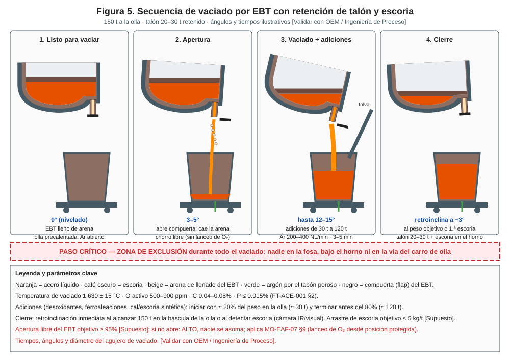
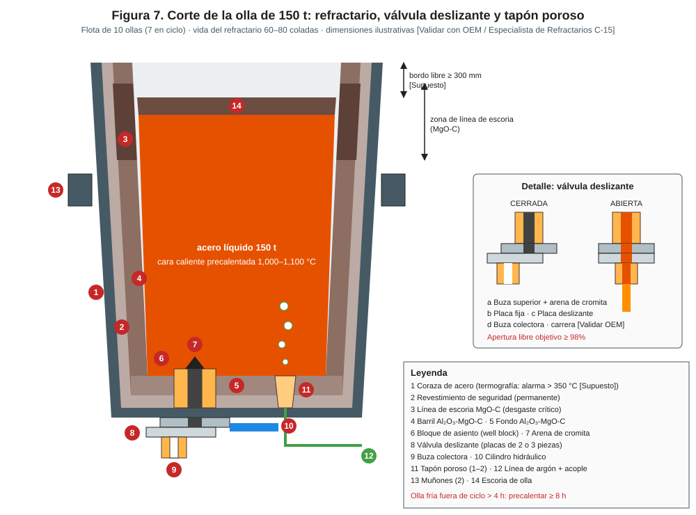
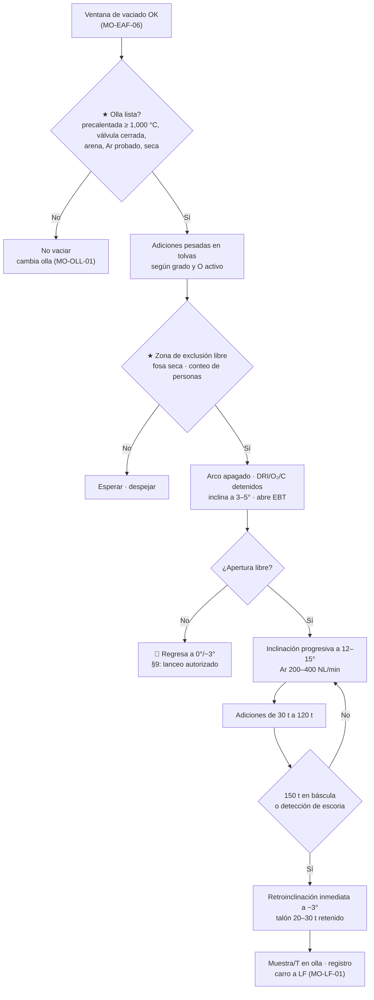

# MO-EAF-07 — Vaciado por EBT y adiciones en olla

| Código | Versión | Estado | Área | Dueño del proceso | Elaboró | Revisión técnica | Revisión de seguridad | Aprobó | Fecha | Próxima revisión |
|---|---|---|---|---|---|---|---|---|---|---|
| MO-EAF-07 | 0.1 | Borrador para validación | Hornos — EAF-1 / EAF-2 y fosa de vaciado | C-05 Supervisor de Hornos | experto-operativo-metalurgia | experto-operativo-metalurgia — visto bueno con observaciones, 2026-09-25 | experto-seguridad-salud | Pendiente (Gerente de Acería / Director) | 2026-09-25 | 2027-09-25 |

> Valores técnicos tomados de `FT-ACE-001` v0.3. Lo marcado **[Validar con OEM / Ingeniería de Proceso]** o **[Supuesto]** no se usa en planta hasta que C-07 lo valide.

## 1. Objetivo y alcance
**Objetivo:** vaciar **150 t** de acero a una olla precalentada, **dentro de la ventana** (T 1,630 ± 15 °C, O activo 500–900 ppm, C 0.04–0.08%, P ≤ 0.015%), con **desoxidación y aleación** correctas para el grado, **arrastre mínimo de escoria** (≤ 5 kg/t [Supuesto]) y **retención del talón de 20–30 t**, con **nadie dentro de la zona de exclusión**.

**Alcance:** desde la liberación de la ventana de vaciado (MO-EAF-06) y la recepción de la olla preparada (MO-OLL-01) hasta el cierre del EBT y la salida del carro de olla hacia el horno olla (MO-LF-01).
**No incluye:** llenado del EBT (MO-EAF-01) ni el traslado con grúa (MO-OLL-02).

## 2. Roles y responsabilidades
| Rol | Responsabilidad en este proceso | R/A/C/I |
|---|---|---|
| C-05 Supervisor de Hornos | Dueño. Autoriza el vaciado fuera de ventana y las acciones ante EBT que no abre. | A |
| S-01 Primer Hornero | Verifica permisivos, inclina, abre y cierra el EBT, controla peso y detección de escoria. | R |
| S-02 Segundo Hornero | Confirma olla y zona de exclusión; opera adiciones; ejecuta el lanceo de EBT si se autoriza. | R |
| S-03 Tercer Hornero | Prepara las adiciones pesadas en tolvas; conecta el argón de la olla antes del vaciado. | R |
| S-09 Operador de Grúa de Colada | Coloca la olla en el carro de vaciado cuando aplica y está disponible para emergencia. | R |
| S-08 Preparador de Ollas | Entrega la olla con su lista de verificación (MO-OLL-01). | C |
| S-06 Operador de Horno Olla | Recibe los datos de vaciado (T, O, adiciones, arrastre). | I |
| C-09 Metalurgista de Producto | Define la práctica de adiciones por grado. | C |

## 3. Descripción del proceso
Con el arco apagado, el horno se inclina hacia el EBT (3–5°). Se abre la compuerta inferior: la arena cae y el acero sale libre por el agujero excéntrico a la olla (apertura libre). S-01 aumenta la inclinación (hasta 12–15°) para mantener la carga hidrostática y la escoria lejos del agujero. Entre el 20% (≈ 30 t) y el 80% (≈ 120 t) del peso en la olla se agregan desoxidantes, ferroaleaciones y formadores de escoria, con argón agitando por el tapón poroso. Al llegar a 150 t o al detectar escoria, el horno **retroinclina de inmediato**: quedan en el horno el talón (20–30 t) y la escoria oxidada, que tiene P y FeO altos.

## 4. Equipos y maquinaria
| Equipo / componente | Función | Especificación clave | Condición para operar (verificación) |
|---|---|---|---|
| EBT y compuerta inferior | Vaciado excéntrico por el fondo | Diámetro del agujero y vida del tubo [Validar con OEM / Ingeniería de Proceso] | Llenado con arena correcto (MO-EAF-01); compuerta operable |
| Sistema de inclinación | Inclina a EBT y retroinclina | Retroinclinación rápida (≤ 3 s a −3° [Validar con OEM / Ingeniería de Proceso]) | Prueba de velocidad de retroinclinación en mantenimiento |
| Carro de olla con báscula | Posiciona la olla y pesa el vaciado | Exactitud ± 0.5 t [Supuesto] | Cero de báscula con olla vacía; vía libre |
| Olla de 150 t | Recibe el acero | Precalentada 1,000–1,100 °C; válvula cerrada con arena | Lista de verificación de MO-OLL-01 firmada |
| Tolvas de adiciones y chute | Dosifican aleaciones a la olla | Pesaje por tolva ± 1% [Supuesto] | Materiales secos; chute libre |
| Argón de olla (conexión en fosa) | Agita durante el vaciado | 200–400 NL/min [Supuesto] | Burbujeo visible o caudal/presión en rango |
| Detección de escoria (cámara IR/visual) | Detecta el paso de escoria | [Validar con OEM / Ingeniería de Proceso] | Imagen disponible en púlpito |
| Fosa de vaciado | Contiene derrames | — | ★ Seca, sin agua ni tuberías con fuga, limpia de metal y escoria |

## 5. Parámetros de operación
| Parámetro | Unidad | Objetivo | Rango normal | Alarma / límite | Acción si está fuera de rango | Dónde se mide |
|---|---|---|---|---|---|---|
| Temperatura de vaciado | °C | 1,630 (según grado) | 1,615–1,645 | < 1,610 o > 1,650 | No vaciar sin autorización de C-05; ajustar (MO-EAF-06) | Sonda M3 |
| O activo | ppm | 700 | 500–900 | > 1,000 | Recalcula Al; avisa a LF | Sonda M3 |
| C / P | % | C 0.06 / P ≤ 0.012 | C 0.04–0.08 / P ≤ 0.015 | P > 0.015 | No vaciar sin decisión de C-05/C-09 | OES |
| Peso vaciado | t | 150 | 145–152 | > 153 (bordo libre) | Cierre inmediato | Báscula del carro |
| Talón retenido | t | 25 | 20–30 | < 20 | Cierra antes; informa (MO-EAF-01) | Balance nivel 2 |
| Tiempo de vaciado | min | 4 | 3–5 [Validar con OEM / Ingeniería de Proceso] | < 2.5 o > 6 | < 2.5: agujero desgastado, programa cambio de tubo; > 6: agujero cerrado/costra, limpiar | Nivel 2 |
| Apertura libre del EBT | % de coladas | ≥ 95 [Supuesto] | — | < 90% en el turno | Revisa arena y práctica de llenado con C-15 | Registro |
| Ángulo máximo de inclinación | ° | 12 | 10–15 [Validar con OEM / Ingeniería de Proceso] | > 15 | Riesgo de escoria al agujero | HMI |
| Ventana de adiciones | t en olla | 30 → 120 | 20–80% del peso | Adición antes de 20 t o después de 120 t | Antes: ataca el fondo/tapón; después: mala mezcla | Báscula |
| Argón durante el vaciado | NL/min | 300 | 200–400 [Supuesto] | Sin flujo | Revisa conexión; LF intentará abrir el tapón | Caudalímetro |
| Arrastre de escoria | kg/t | ≤ 5 [Supuesto] | — | Espesor de escoria en LF > 100 mm [Supuesto] | Registra; LF evalúa desescoriado; análisis de P | Detección de escoria / medición en LF |
| Caída de T en el vaciado | °C | 45 [Supuesto] | 40–60 | > 70 | Revisa precalentamiento de olla | T en LF vs. M3 |

**Adiciones de referencia por familia de grado** (valores de partida para 150 t; C-09 y C-07 fijan la tabla oficial) [Validar con Ingeniería de Proceso]:

| Familia (FT-ACE-001 §7) | Desoxidación | Aleación en el vaciado | Escoria en olla | Notas |
|---|---|---|---|---|
| Bajo carbono calmado al Al (CC1) | Al en pieza/lingote: 1.5–2.5 kg/t según O activo (fórmula abajo) | FeMn de medio C: 3–4 kg/t (Mn 0.20–0.35%) | Cal 5–7 kg/t + aluminato de calcio 2–3 kg/t [Supuesto] | Al fino y CaSi en LF |
| HSLA (CC1) | Al como arriba | FeMn medio C: 10–15 kg/t (Mn 0.8–1.4%) | Igual que arriba | FeNb en LF (Nb 0.02–0.05%) |
| Varilla corrugada (CC2) | **Sin Al**: Al soluble ≤ 0.005% (calmado al Si-Mn, Mn/Si ≥ 3; el Al tapa las buzas calibradas) | SiMn 15–18 kg/t; FeSi 75% 0–2 kg/t; recarburante 2.5–3.5 kg/t (C 0.25–0.35%) | Cal 4–6 kg/t | Vigilar CE ≤ 0.55 |
| Barras comerciales (CC2) | Sin Al (Al soluble ≤ 0.005%) | SiMn 10–13 kg/t; recarburante 1.5–2.5 kg/t (C 0.15–0.25%) | Cal 4–6 kg/t | — |

**Cálculo de Al en el vaciado (guía):** Al (kg) ≈ W (kg) × [1.125 × O (ppm) + Al objetivo (ppm)] × 10⁻⁶ / η, con W = 150,000 kg y rendimiento η ≈ 0.5–0.6 [Validar con Ingeniería de Proceso]. Ejemplo: O = 700 ppm, Al objetivo 400 ppm, η = 0.55 → ≈ 324 kg (2.2 kg/t).

## 6. Seguridad
### 6.1 Peligros y controles críticos
| Peligro | Consecuencia | Control crítico | Verificación |
|---|---|---|---|
| Personas en la fosa, bajo el horno o en la vía del carro durante el vaciado | Fatalidad por metal líquido | ★ Zona de exclusión con barrera física/señal y conteo; nadie entra hasta que el EBT cierre y el carro salga | S-02 confirma "zona libre" por radio; VCC |
| Olla húmeda o fría, adiciones húmedas, fosa con agua | Explosión | ★ Olla precalentada ≥ 1,000 °C en cara caliente; ferroaleaciones y cal secas y cubiertas; fosa seca | Lista MO-OLL-01; inspección de fosa |
| Perforación de olla | Derrame de metal | Olla con refractario vigente; termografía; fosa seca | Registro de vida de olla |
| Sobrellenado | Derrame por el borde | Cierre a 150 t; bordo libre ≥ 300 mm [Supuesto] | Báscula |
| EBT que no abre: intervención con lanza | Proyección, quemaduras | ★ Solo con autorización de C-05, horno a 0°/−3°, posición protegida, EPP completo | Registro de autorización |
| Reacción violenta en la olla (escoria oxidada + Al/C) | Ebullición y derrame | Retener escoria del horno; adiciones en la ventana 30–120 t | Detección de escoria |
| Humos y CO en la fosa | Intoxicación | Extracción; detector personal multigás: CO 25 ppm → salir, 200 ppm → evacuación del sector [Verificar NOM-010] (MS-ACE-06) | Bump test diario |

### 6.2 EPP obligatorio
En piso de vaciado y plataforma de adiciones: casco, careta con visor dorado, capucha y chaqueta aluminizadas, polainas, guantes aluminizados, ropa ignífuga (algodón FR/lana), botas metatarsales, protección auditiva, detector personal multigás (MS-ACE-06). Púlpito: ropa ignífuga.

### 6.3 Permisos, bloqueos y zonas de exclusión
- ★ **Zona de exclusión de vaciado** (Figura 5, MS-ACE-01): zona roja ≤ 10 m de la olla y del EBT, incluida la fosa de vaciado, bajo el horno y la vía del carro ± 5 m; zona amarilla 10–25 m. Nadie a pie en la roja (mando desde el púlpito; S-02 solo para adiciones desde la posición protegida). Aviso con sirena y semáforo ≥ 30 s antes. Activa desde que la olla entra hasta que el EBT cierra y el carro sale.
- ★ **Humedad (MS-ACE-03):** olla ≥ 1,000 °C en cara caliente (fría > 4 h: ≥ 8 h de precalentamiento), adiciones de bodega techada y fosa sin agua estancada; si hay agua, 🛑 no se vacía.
- Entrada a la fosa para limpieza: horno a 0° con inclinación bloqueada (LOTO, MS-ACE-02), carro bloqueado, permiso de C-05.
- Grúa de colada no pasa sobre la fosa durante el vaciado.

## 7. Calidad
| Variable crítica de calidad | Especificación | Método / frecuencia | Registro | Defecto si falla |
|---|---|---|---|---|
| Arrastre de escoria | ≤ 5 kg/t [Supuesto] | Detección de escoria + espesor en LF, cada colada | Nivel 2 | Reversión de P; mayor consumo de Al y cal en LF; inclusiones |
| Reversión de P | ΔP ≤ 0.003% [Supuesto] | Análisis EAF vs. LF | Laboratorio | P fuera de especificación |
| Desoxidación | Al según grado (CC1) / Si-Mn sin Al (CC2) | Muestra de llegada a LF | Laboratorio | Al fuera de rango; obstrucción de buzas en CC2 |
| Rendimiento de aleación | Según C-07 | Balance | Nivel 2 | Química fuera de rango; costo |
| Temperatura de llegada a LF | ≈ 1,570–1,590 °C [Supuesto] | Medición en LF | Nivel 2 | Tiempo largo en LF |

## 8. Procedimiento paso a paso
| # | Paso | Cómo hacerlo (detalle y medición) | Criterio de aceptación | ★ | Rol |
|---|---|---|---|---|---|
| 1 | Recibe la olla | Revisa la lista de MO-OLL-01: T de cara caliente ≥ 1,000 °C, válvula cerrada, arena, tapón probado, número de olla y coladas. | Lista completa y firmada | ★ | S-02 |
| 2 | Posiciona y conecta | Carro en posición de vaciado; conecta argón; verifica flujo. Cero de báscula con olla vacía. | Ar con flujo; báscula en cero | | S-03 |
| 3 | Prepara adiciones | Carga las tolvas con la tabla del grado y el Al calculado con el O de M3. Verifica que los materiales estén secos. | Pesos correctos ± 1% | ★ | S-03 / S-01 |
| 4 | Inspecciona la fosa | Seca, sin agua, sin metal suelto. | Fosa en condición | ★ | S-02 |
| 5 | Despeja la zona de exclusión | Barreras en posición; conteo de personas; visual + CCTV: nadie a ≤ 10 m de la olla y del EBT; sirena y semáforo rojo ≥ 30 s antes de abrir (MS-ACE-01). | "Zona libre" por radio | ★ | S-02 |
| 6 | Prepara el horno | Arco apagado, interruptor abierto; DRI, O₂ y C detenidos; electrodos arriba. | Estado en HMI | | S-01 |
| 7 | Inclina y abre | Inclina a 3–5°; abre la compuerta del EBT. | Chorro libre | | S-01 |
| 8 | Vacía | Aumenta la inclinación progresivamente (hasta 12–15°) para mantener el chorro compacto. | Chorro compacto, sin escoria | | S-01 |
| 9 | Agrega | Inicia adiciones a ≈ 30 t y termina antes de 120 t; Ar 200–400 NL/min. | Adiciones completas en ventana | 🔎 | S-02 |
| 10 | Vigila escoria | Observa la cámara/detector y el peso. | Sin escoria | 🔎 | S-01 |
| 11 | Cierra | A 150 t o al primer indicio de escoria: retroinclinación inmediata a −3°. | Talón 20–30 t; escoria en el horno | ★ | S-01 |
| 12 | Confirma cierre | Chorro detenido; horno estable; EBT listo para preparación. | Sin flujo | | S-01 |
| 13 | Libera la zona | Carro sale hacia LF; se levanta la exclusión. | Carro fuera | | S-02 |
| 14 | Registra | Peso, tiempo de vaciado, apertura libre (sí/no), adiciones reales, argón, arrastre estimado. | Registro completo | | S-01 |

## 9. Condiciones anormales y respuesta
| Síntoma / alarma | Causa probable | Acción inmediata | A quién avisar |
|---|---|---|---|
| EBT no abre (sin chorro al abrir la compuerta) | Arena sinterizada, costra, agujero cerrado | 🛑 Regresa el horno a 0°/−3°. Nadie se asoma. Con autorización de C-05, S-02 lancea con O₂ desde la posición protegida definida por el OEM [Validar con OEM / Ingeniería de Proceso]. Máx. 2 intentos; luego C-05 decide (mantener T con arco a 0°). | C-05 |
| Chorro abierto en forma de abanico o chorro débil | Agujero desgastado o parcialmente obstruido | Continúa si es seguro; programa cambio de tubo | C-05, C-15 |
| Escoria arrastrada detectada antes de 150 t | Vórtice, inclinación excesiva, talón bajo | Cierra de inmediato; registra peso; avisa a LF (desescoriado, P) | S-06, C-05 |
| Perforación de olla (metal por la coraza o el fondo) | Refractario desgastado, olla fría | 🛑 Retroinclina de inmediato; evacúa a ≥ 25 m; deja que el metal caiga a la fosa seca; no uses agua | C-05, C-04, C-16 (MS-ACE-09) |
| Olla se llena en exceso | Báscula fallada | Cierra por nivel visual; calibra báscula | C-05 |
| Ebullición en la olla | Escoria oxidada + desoxidante, adiciones húmedas | Detén adiciones y, si es posible desde el púlpito, el vaciado; evacúa a zona verde o refugio en ≤ 30 s (MS-ACE-01) | C-05, C-07 |
| Sin argón en la olla | Tapón tapado, conexión | Continúa el vaciado; avisa a LF (MO-LF-01 §9) | S-06 |
| Retroinclinación lenta o falla hidráulica | Hidráulica | Cierre de emergencia del EBT según OEM; evacua | C-05, S-22 |

## 10. Registros
- Registro de vaciado por colada (nivel 2): T y O de M3, peso, tiempo, apertura libre, ángulo máximo, adiciones reales, argón, número de olla y coladas del EBT.
- Registro de eventos: EBT que no abre, lanceo autorizado, escoria arrastrada, perforaciones.
- Lista de verificación de la olla recibida (MO-OLL-01).
- Verificación de zona de exclusión (VCC mensual).

## 11. Competencia requerida y certificación
| Rol | Nivel requerido (1–4) | Formación teórica (h) | OJT supervisado (h / eventos) | Evaluación (pasos ★) | Vigencia |
|---|---|---|---|---|---|
| S-01 Primer Hornero | 3 | 16 | 80 h / 40 vaciados | Pasos 3, 11 + escenario de escoria y de EBT que no abre | 24 meses (TD-P07) |
| S-02 Segundo Hornero | 3 | 16 | 80 h / 40 vaciados | Pasos 1, 4, 5 + lanceo simulado en posición protegida | 24 meses (TD-P07) |
| S-03 Tercer Hornero | 3 | 8 | 40 h / 20 vaciados | Paso 3 (pesos y materiales secos) | 24 meses (TD-P07) |
| S-09 Operador de Grúa de Colada | 3 | según MO-OLL-02 | — | Respuesta a emergencia de olla | 12 meses (grúas/izaje) |

Lista corta de verificación de pasos ★:
1. Verifica la olla (precalentamiento, válvula, arena, tapón) antes de aceptar el vaciado.
2. Establece y confirma la zona de exclusión y la fosa seca.
3. Calcula el Al con el O activo y usa adiciones secas.
4. Retroinclina a tiempo reteniendo talón y escoria.
5. Responde a EBT que no abre sin exponer a nadie.

## 12. Referencias
- FT-ACE-001 §2, §3 y §7; CAT-ACE-001; MO-EAF-01, MO-EAF-06, MO-OLL-01, MO-OLL-02, MO-LF-01; MM-EAF-03.
- MS-ACE-01, MS-ACE-02, MS-ACE-03, MS-ACE-09.
- NOM-017-STPS, NOM-015-STPS, NOM-006-STPS — verificar con Jurídico Laboral / SSO.
- Manual OEM del EBT y del sistema de inclinación; práctica de refractario del EBT [por referenciar].
- TD-P07.

## 13. Control de cambios
| Versión | Fecha | Cambio | Autor |
|---|---|---|---|
| 0.1 | 2026-09-25 | Emisión inicial para validación | experto-operativo-metalurgia |
| 0.1 | 2026-09-25 | Revisión técnica cruzada contra FT-ACE-001 v0.3: límite de Al soluble ≤ 0.005% para grados de CC2 (colada abierta), igual que MO-LF-01 y MO-CC2-04. | experto-operativo-metalurgia |
