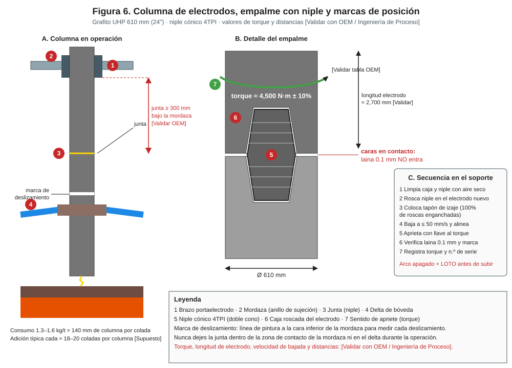
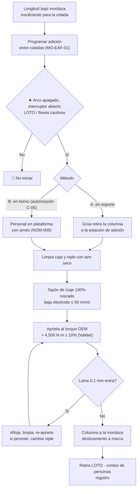

# MO-EAF-08 — Adición y empalme de electrodos

| Código | Versión | Estado | Área | Dueño del proceso | Elaboró | Revisión técnica | Revisión de seguridad | Aprobó | Fecha | Próxima revisión |
|---|---|---|---|---|---|---|---|---|---|---|
| MO-EAF-08 | 0.1 | Borrador para validación | Hornos — EAF-1 / EAF-2 | C-05 Supervisor de Hornos | experto-operativo-metalurgia | experto-operativo-metalurgia | experto-seguridad-salud | Pendiente (Gerente de Acería / Director) | 2026-09-25 | 2027-09-25 |

> Valores técnicos tomados de `FT-ACE-001` v0.2. Lo marcado **[Validar con OEM / Ingeniería de Proceso]** o **[Supuesto]** no se usa en planta hasta que C-07 lo valide.

## 1. Objetivo y alcance
**Objetivo:** mantener cada columna de electrodos (grafito UHP **610 mm**, niple cónico **4TPI**) con la longitud necesaria, agregando electrodos con un **empalme apretado al torque del fabricante** y **sin holgura entre caras**, para evitar roturas, juntas flojas y caídas, con el consumo dentro de **1.3–1.6 kg/t**.

**Alcance:** (A) **método preferente:** adición en el soporte de adición (stand) del piso de hornos, cambiando la columna completa con la grúa de carga; (B) **método alterno:** adición sobre la columna en el horno, con personal en la plataforma de electrodos. Incluye el deslizamiento (slipping) de columnas y la respuesta a roturas.
**No incluye:** mantenimiento de brazos, mordazas e hidráulica (MM-EAF-02).

## 2. Roles y responsabilidades
| Rol | Responsabilidad en este proceso | R/A/C/I |
|---|---|---|
| C-05 Supervisor de Hornos | Dueño. Autoriza el método B y cualquier trabajo con columna dañada. Verifica el LOTO. | A |
| S-02 Segundo Hornero | Prepara el electrodo, rosca el niple, aplica el torque, verifica la holgura y registra. Señalero de la grúa. | R |
| S-03 Tercer Hornero | Limpia caras y roscas, coloca el tapón de izaje, apoya la maniobra. | R |
| S-04 Operador de Grúa de Carga | Iza y baja electrodos y columnas (grúa 120/40 t, gancho auxiliar). | R |
| S-01 Primer Hornero | Desenergiza, bloquea y libera el horno; ejecuta el deslizamiento desde el púlpito. | R |
| S-19 Mecánico / S-22 Técnico Hidráulico | Atienden fallas de mordaza o de la llave de torque. | C |

## 3. Descripción del proceso
El electrodo se consume en la punta (≈ 140 mm de columna por colada con 1.45 kg/t [Supuesto]). Cuando la longitud bajo la mordaza no alcanza para la siguiente colada, se agrega un electrodo nuevo arriba de la columna. El niple (doble cono roscado) une dos electrodos; el apriete correcto deja **las caras en contacto total** (una laina de 0.1 mm no debe entrar). Una junta floja se calienta, se oxida y se rompe. Después, la columna se **desliza** en la mordaza para dejar la punta en posición y la junta **fuera de la zona de contacto de la mordaza**.

## 4. Equipos y maquinaria
| Equipo / componente | Función | Especificación clave | Condición para operar (verificación) |
|---|---|---|---|
| Electrodo de grafito UHP | Conduce la corriente al arco | 610 mm × ≈ 2,700 mm, ≈ 1.4 t [Validar con OEM / Ingeniería de Proceso] | Sin grietas ni golpes; cajas roscadas limpias; almacenado seco y horizontal |
| Niple cónico 4TPI | Une electrodos | Del mismo fabricante y grado que el electrodo | Roscas sin daño; sin polvo |
| Tapón de izaje (lifting plug) | Iza el electrodo | Capacidad ≥ peso de columna con factor de seguridad [Validar con OEM / Ingeniería de Proceso] | Roscas sin desgaste; inspección vigente |
| Soporte / estación de adición | Sostiene la columna vertical para empalmar | Con mordaza de sujeción | Mordaza cierra; base limpia |
| Llave de torque (hidráulica o neumática) | Aprieta la junta | Rango que cubre el torque OEM; calibración vigente | Certificado de calibración ≤ 12 meses [Supuesto] |
| Laina (galga) de 0.1 mm | Verifica holgura entre caras | — | Íntegra |
| Grúa de carga | Maniobra | 120/40 t; gancho auxiliar | Inspección previa al uso (MM-GR-01) |
| Mordaza del brazo | Sujeta la columna | Presión de resorte / hidráulica según OEM | Sin arco en la mordaza (quemaduras) |

## 5. Parámetros de operación
| Parámetro | Unidad | Objetivo | Rango normal | Alarma / límite | Acción si está fuera de rango | Dónde se mide |
|---|---|---|---|---|---|---|
| Torque de apriete | N·m | ≈ 4,500 [Validar con OEM / Ingeniería de Proceso] | ± 10% | < 90% o > 110% | Re-aprieta o afloja y repite; no exceder (rompe el niple) | Llave de torque |
| Holgura entre caras | mm | 0 | < 0.1 | Laina 0.1 mm entra | Afloja, limpia, re-aprieta; si persiste cambia niple/electrodo | Laina |
| Velocidad de bajada al roscar | mm/s | ≤ 50 [Validar con OEM / Ingeniería de Proceso] | — | Golpe entre electrodos | Detén; inspecciona roscas | Grúa (modo fino) |
| Posición de la junta | mm bajo la mordaza | ≥ 300 [Validar con OEM / Ingeniería de Proceso] | — | Junta en la zona de mordaza o en el delta | Desliza hasta posición correcta | Marca de deslizamiento |
| Deslizamiento por colada | mm | ≈ 140 [Supuesto] | 120–170 | > 200 | Revisa roturas y oxidación | Marca / nivel 2 |
| Consumo de electrodo | kg/t | 1.4 | 1.3–1.6 | > 1.7 | Análisis con C-07 (roturas, oxidación, corriente) | Nivel 2 |
| Frecuencia de adición por columna | coladas | ≈ 18–20 [Supuesto] | — | < 12 | Investiga consumo anormal | Registro |
| Tiempo de adición (método A) | min | ≤ 10 [Supuesto] | — | > 15 | Registra la demora | Bitácora |

**Recepción y almacenamiento de electrodos y niples** [Validar con el fabricante]:

| Punto | Criterio | Acción si no cumple |
|---|---|---|
| Embalaje y protectores de rosca | Íntegros al recibir | Rechazar o inspeccionar rosca a detalle |
| Almacenamiento | Bajo techo, seco, horizontal sobre apoyos de madera, máx. estiba según fabricante | Reubicar; secar si hubo humedad (según fabricante) |
| Manejo | Con tapón de izaje o eslingas protegidas; sin golpes en extremos | Inspeccionar caras y roscas |
| Roscas y caras | Sin despostillados, grietas ni polvo | Limpiar; separar para reclamo si hay daño |
| Pareo electrodo–niple | Mismo fabricante, grado y lote compatible | No mezclar |

## 6. Seguridad
### 6.1 Peligros y controles críticos
| Peligro | Consecuencia | Control crítico | Verificación |
|---|---|---|---|
| Energización con personas en plataforma de electrodos | Electrocución, arco | ★ Interruptor abierto + LOTO o llaves cautivas en poder del personal antes de subir (MS-ACE-02) | Tablero de llaves; VCC |
| Movimiento de brazos o bóveda con personas cerca | Aplastamiento | ★ Hidráulica de brazos y giro de bóveda bloqueados | LOTO verificado por C-05 |
| Caída del electrodo/columna (tapón mal roscado) | Aplastamiento, fatalidad | ★ Tapón roscado 100%; nadie bajo la carga; señalero | Observación de S-02 |
| Trabajo en altura (método B) | Caída | ★ Arnés y línea de vida (NOM-009); barandales | Permiso de altura |
| Superficies calientes de la columna | Quemaduras | Guantes; tiempo de enfriamiento | — |
| Polvo de grafito | Irritación | Aire seco, lentes, mascarilla | — |
| Humedad en cajas o niples | Oxidación y rotura; vapor en el horno | Almacén seco; limpieza con aire seco sin aceite | Inspección |

### 6.2 EPP obligatorio
Casco con barbiquejo, lentes, careta si hay columna caliente, guantes de carnaza o aluminizados, ropa ignífuga, botas metatarsales, protección auditiva, arnés con doble cola en método B, detector de CO en plataforma.

### 6.3 Permisos, bloqueos y zonas de exclusión
- ★ **Antes de subir a la plataforma de electrodos o de bóveda:** interruptor del horno abierto y bloqueado, hidráulica de brazos y giro de bóveda bloqueados, llaves en poder de cada trabajador (MS-ACE-02). Verificación de ausencia de energía por C-05.
- Permiso de trabajo en altura para el método B (MS-ACE-10).
- Zona de exclusión bajo la trayectoria de la grúa y alrededor del soporte de adición (MS-ACE-04).

## 7. Calidad
| Variable crítica de calidad | Especificación | Método / frecuencia | Registro | Defecto si falla |
|---|---|---|---|---|
| Torque y holgura | Torque OEM ± 10%; laina 0.1 mm no entra | Cada empalme | Registro de empalme | Junta floja → rotura, pérdida de punta al baño |
| Trazabilidad | Número de serie de electrodo y niple | Cada adición | Registro | Sin trazabilidad para reclamo al proveedor |
| Consumo | 1.3–1.6 kg/t | Por turno | Nivel 2 | Costo |
| Carbono en acero por rotura | Punta rota en baño aumenta C | Muestra después de rotura | Laboratorio | C fuera de rango en grados bajo C |

## 8. Procedimiento paso a paso
| # | Paso | Cómo hacerlo (detalle y medición) | Criterio de aceptación | ★ | Rol |
|---|---|---|---|---|---|
| 1 | Prepara el electrodo nuevo | En el soporte: inspecciona grietas y roscas; limpia la caja con aire seco sin aceite. | Sin daño ni polvo | 🔎 | S-03 |
| 2 | Rosca el niple | Rosca el niple a mano en la caja superior del electrodo nuevo hasta el tope. | Niple asentado | | S-02 |
| 3 | Desenergiza y bloquea | Arco apagado, interruptor abierto; LOTO/llaves cautivas; hidráulica bloqueada. | Llaves en poder del personal | ★ | S-01 / C-05 |
| 4 | Retira la columna (método A) | Grúa toma la columna con el tapón de izaje; S-01 abre la mordaza; lleva la columna al soporte. | Columna en soporte, mordaza del soporte cerrada | ★ | S-04 / S-02 |
| 5 | Limpia la columna | Limpia la caja superior de la columna con aire seco. | Rosca limpia | | S-03 |
| 6 | Coloca el tapón de izaje | Rosca el tapón al electrodo nuevo con el 100% de las roscas enganchadas. | Tapón a fondo | ★ | S-03 |
| 7 | Baja y rosca | Grúa en modo fino, ≤ 50 mm/s; alinea el niple con la caja de la columna; rosca sin forzar. | Roscado sin golpe | | S-04 / S-02 |
| 8 | Aprieta | Aplica el torque OEM con la llave calibrada. | Torque ± 10% | ★ | S-02 |
| 9 | Verifica la holgura | Pasa la laina de 0.1 mm alrededor de toda la junta. | No entra en ningún punto | ★ | S-02 |
| 10 | Marca | Pinta la marca de deslizamiento; registra serie de electrodo y niple, torque y hora. | Registro completo | 🔎 | S-02 |
| 11 | Regresa la columna | Grúa lleva la columna a la mordaza; S-01 cierra la mordaza. | Columna sujeta | | S-04 / S-01 |
| 12 | Desliza | Ajusta la posición: junta ≥ 300 mm bajo la mordaza; punta a la altura de trabajo. | Junta fuera de la mordaza y del delta | ★ | S-01 |
| 13 | Retira bloqueos | Todos bajan; conteo; llaves al tablero. | Plataforma vacía | ★ | S-02 / C-05 |
| 14 | Método B (alterno) | Igual a pasos 1–3, 6–10 y 12–13, con arnés y permiso de altura, electrodo nuevo bajado sobre la columna en el horno. | Mismos criterios | ★ | S-02 / S-03 |

## 9. Condiciones anormales y respuesta
| Síntoma / alarma | Causa probable | Acción inmediata | A quién avisar |
|---|---|---|---|
| Rotura de electrodo en operación | Colapso de chatarra, junta floja, pieza pesada | Abre interruptor; si la punta cayó al baño, déjala fundir (vigila C); retira la columna dañada con método A | C-05, C-07 |
| Junta al rojo, chispas o arco en la junta | Junta floja, torque insuficiente | Abre interruptor; revisa y re-aprieta en frío o cambia | C-05 |
| Laina entra tras re-aprietar | Rosca dañada, niple defectuoso | Cambia niple o electrodo; registra lote | C-05, proveedor |
| Tapón de izaje no rosca completo | Rosca dañada | 🛑 No izar; cambia tapón o electrodo | C-05 |
| Arco en la mordaza (quemadura de mordaza) | Presión baja, contacto sucio | Detén; mantenimiento con LOTO | S-19, S-22 |
| Columna muy corta (no alcanza) | Adición atrasada | No energices esa fase; adición inmediata | C-05 |
| Electrodo con grieta visible | Choque térmico, humedad | No usar; separar; reclamo al proveedor | C-05 |
| Falla de la llave de torque | Calibración, presión | No aprietes a estimación; usa llave de respaldo calibrada | C-05 |

## 10. Registros
- Registro de empalme: horno, fase, fecha, hora, serie de electrodo y niple, torque aplicado, verificación de laina, responsable.
- Consumo de electrodos por turno (kg/t) y roturas (causa).
- LOTO / llaves cautivas y permiso de altura (método B).
- Certificado de calibración de la llave de torque.

## 11. Competencia requerida y certificación
| Rol | Nivel requerido (1–4) | Formación teórica (h) | OJT supervisado (h / eventos) | Evaluación (pasos ★) | Vigencia |
|---|---|---|---|---|---|
| S-02 Segundo Hornero | 3 | 12 (electrodos, niples, torque, LOTO) | 30 h / 10 empalmes | Pasos 3, 6, 8, 9, 12, 13 | 24 meses (TD-P07) |
| S-03 Tercer Hornero | 3 | 8 | 20 h / 10 empalmes | Pasos 1, 6 | 24 meses |
| S-04 Operador de Grúa de Carga | 3 | NOM-006 + grúa | 10 maniobras de electrodo | Pasos 4, 7 (modo fino, nadie bajo carga) | 24 meses |
| C-05 Supervisor de Hornos | 4 | 8 + evaluador | — | Verificación de LOTO | 24 meses |

Lista corta de verificación de pasos ★:
1. Aplica LOTO / llaves cautivas antes de subir y verifica ausencia de energía.
2. Rosca el tapón de izaje al 100% y mantiene a todos fuera de la trayectoria.
3. Aprieta al torque OEM con llave calibrada y verifica con laina 0.1 mm.
4. Deja la junta fuera de la zona de la mordaza.

## 12. Referencias
- FT-ACE-001 §2 y §6; CAT-ACE-001; MO-EAF-01, MO-EAF-04; MM-EAF-02; MM-GR-01.
- MS-ACE-02 (LOTO), MS-ACE-04 (izaje), MS-ACE-10 (altura).
- NOM-009-STPS (altura), NOM-006-STPS (manejo de materiales), NOM-004-STPS, NOM-029-STPS, NOM-017-STPS — verificar con Jurídico Laboral / SSO.
- Manual del fabricante de electrodos (tabla de torque, manejo, almacenamiento) [por referenciar].
- TD-P07.

## 13. Control de cambios
| Versión | Fecha | Cambio | Autor |
|---|---|---|---|
| 0.1 | 2026-09-25 | Emisión inicial para validación | experto-operativo-metalurgia |
