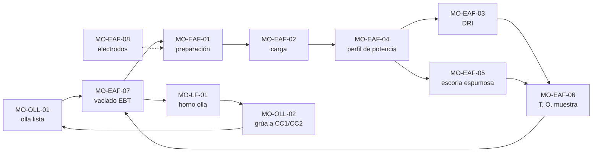

# Manuales de Operación — Hornos EAF, Ollas y Horno Olla (Acería)

| Código | Versión | Estado | Custodios |
|---|---|---|---|
| IDX-MO-EAF-LF | 0.1 | Borrador para validación | experto-operativo-metalurgia (técnico) · experto-seguridad-salud (seguridad) · Gerente Sindicalizado (uso en capacitación) |

**Mensaje clave:** hay 11 manuales de procesos críticos (8 de EAF y 3 de Ollas/LF) con la plantilla de 13 secciones de la guía de estilo. Todos toman sus valores de `FT-ACE-001` v0.1 y **no se usan en planta hasta que Ingeniería de Proceso (C-07) y el Especialista de Refractarios (C-15) validen los valores marcados como [Validar con OEM / Ingeniería de Proceso] o [Supuesto]**. Los pasos ★ de cada manual forman la lista de evaluación de la certificación TD-P07.

## 1. Manuales de EAF (`02-operacion/eaf/`)
| Código | Manual | Propósito | Dueño | Ejecutan | Figuras |
|---|---|---|---|---|---|
| MO-EAF-01 | [Preparación del horno entre coladas](MO-EAF-01-preparacion-horno-entre-coladas.md) | Dejar el horno sin fugas de agua, con refractario reparado, EBT lleno de arena seca y talón de 20–30 t en ≤ 5 min | C-05 | S-01, S-02, S-03 | Fig. 2, 3 |
| MO-EAF-02 | [Carga de chatarra con canasta](MO-EAF-02-carga-chatarra-canasta.md) | Cargar 55–70 t de chatarra seca y sin materiales prohibidos (pórtico de radiación), sin personas expuestas | C-05 | S-04, S-05, S-01 | Fig. 1 |
| MO-EAF-03 | [Alimentación continua de DRI/HBI](MO-EAF-03-alimentacion-continua-dri.md) | Fundir ≈ 100 t de DRI a 30–35 kg/min/MW sin acumulaciones ni humedad | C-07 | S-01 | Fig. 2 |
| MO-EAF-04 | [Fusión: perfil de potencia y regulación de electrodos](MO-EAF-04-fusion-perfil-potencia-electrodos.md) | Seguir el perfil de taps y corriente por etapa: 42 min de arco, 560–620 kWh/t | C-07 | S-01 | Fig. 3, 4 |
| MO-EAF-05 | [Escoria espumosa: O₂, carbono y desescoriado](MO-EAF-05-escoria-espumosa-oxigeno-carbono.md) | Mantener la escoria espumosa (B2 1.8–2.2, FeO 25–35%, MgO 8–10%) y desescoriar sin contacto con agua | C-07 | S-01, S-02, S-10 | Fig. 2 |
| MO-EAF-06 | [Medición de temperatura, O activo y muestreo](MO-EAF-06-temperatura-oxigeno-muestreo.md) | Lecturas válidas con lanza manipuladora y sondas desechables para decidir el vaciado (1,630 ± 15 °C; O 500–900 ppm) | C-05 | S-02, S-11 | Fig. 2 |
| MO-EAF-07 | [Vaciado por EBT y adiciones en olla](MO-EAF-07-vaciado-ebt-adiciones.md) | Vaciar 150 t con desoxidación/aleación por grado, arrastre mínimo de escoria y zona de exclusión | C-05 | S-01, S-02, S-03, S-09 | Fig. 5, 7 |
| MO-EAF-08 | [Adición y empalme de electrodos](MO-EAF-08-adicion-empalme-electrodos.md) | Empalmar electrodos de 610 mm al torque OEM, sin holgura, con LOTO antes de subir a la plataforma | C-05 | S-02, S-03, S-04 | Fig. 6 |

## 2. Manuales de Ollas y Horno Olla (`02-operacion/ollas-lf/`)
| Código | Manual | Propósito | Dueño | Ejecutan | Figuras |
|---|---|---|---|---|---|
| MO-OLL-01 | [Preparación de olla](../ollas-lf/MO-OLL-01-preparacion-olla.md) | Entregar ollas secas, a 1,000–1,100 °C, con válvula y tapón probados y arena seca (apertura libre ≥ 98%) | C-15 | S-08, S-24 | Fig. 7 |
| MO-OLL-02 | [Traslado de ollas llenas con grúa de colada](../ollas-lf/MO-OLL-02-traslado-ollas-grua-colada.md) | Mover ollas de ≈ 230 t con grúa 250/63 t sin personas bajo la carga | C-04 | S-09, S-13 | Fig. 1, 7 |
| MO-LF-01 | [Tratamiento en horno olla](../ollas-lf/MO-LF-01-tratamiento-horno-olla.md) | Calentar, ajustar química, desulfurar (S ≤ 0.010%), tratar con CaSi y agitar suave ≥ 8 min en 35–45 min | C-07 | S-06, S-07, S-11 | Fig. 7, 8 |

## 3. Figuras (`../../img/`)
| Fig. | Archivo | Contenido |
|---|---|---|
| 1 | [eaf-flujo-acería.svg](../../img/eaf-flujo-acería.svg) | Flujo general: patio/DRI → EAF → olla → LF → CC1/CC2 |
| 2 | [eaf-corte-horno.svg](../../img/eaf-corte-horno.svg) | Corte del EAF con 17 partes numeradas |
| 3 | [eaf-ciclo-colada.svg](../../img/eaf-ciclo-colada.svg) | Gantt del tap-to-tap de 55 min con kWh/t y O₂ por etapa |
| 4 | [eaf-perfil-potencia.svg](../../img/eaf-perfil-potencia.svg) | Voltaje/tap y MW contra tiempo |
| 5 | [eaf-vaciado-ebt.svg](../../img/eaf-vaciado-ebt.svg) | Secuencia de vaciado EBT con retención de talón y escoria |
| 6 | [eaf-empalme-electrodo.svg](../../img/eaf-empalme-electrodo.svg) | Columna, niple, torque y marcas |
| 7 | [olla-corte-valvula-tapon.svg](../../img/olla-corte-valvula-tapon.svg) | Corte de olla: refractario, válvula deslizante, arena, tapón, muñones |
| 8 | [lf-horno-olla.svg](../../img/lf-horno-olla.svg) | Estación LF: bóveda, electrodos, argón, alambre, muestreo |

## 4. Secuencia de una colada y enlace entre manuales

## 5. Pasos ★ transversales (controles críticos que se repiten)
| Control crítico | Manuales | Estándar de seguridad |
|---|---|---|
| Humedad: chatarra, DRI, arena, sondas, adiciones, ollas y fosas secas | EAF-01, 02, 03, 05, 06, 07; OLL-01; LF-01 | MS-ACE-03 |
| Fuga de agua: no inclinar, no energizar, evacuar | EAF-01, 04, 05; LF-01 | MS-ACE-03, MS-ACE-09 |
| Zona de exclusión (carga, puerta, vaciado, olla suspendida) | EAF-02, 05, 06, 07; OLL-02 | MS-ACE-01, MS-ACE-04 |
| Bloqueo (LOTO / llave cautiva) antes de subir a plataforma de EBT, bóveda o electrodos | EAF-01, 04, 08; LF-01 | MS-ACE-02 |
| Grúa: inspección previa, prueba de frenos con carga, nadie bajo la carga | EAF-02, 08; OLL-02 | MS-ACE-04 |
| Radiación en chatarra | EAF-02 | MS-ACE-07 |
| Gases: N₂/argón (asfixia), CO, O₂ | EAF-03, 05; LF-01 | MS-ACE-05, MS-ACE-06 |

## 6. Inconsistencias detectadas en la ficha técnica (para C-07 / C-01)
| # | Tema | Hallazgo | Propuesta |
|---|---|---|---|
| 1 | Energía vs. tiempo de arco (FT §2) | 560–620 kWh/t × 150 t = 84–93 MWh; en 42 min de arco exige 120–133 MW promedio. Un transformador de 140 MVA entrega ≈ 115–126 MW activos (cos φ 0.82–0.9). Solo el extremo bajo (560 kWh/t) es factible, al límite. | Validar potencia activa real. Opción: arco 45–47 min (tap-to-tap ≈ 58–60 min) o energía objetivo 540–580 kWh/t con DRI caliente. |
| 2 | Tasa de DRI (FT §2) | 5.0 t/min a 30–35 kg/min/MW requiere 143–167 MW; con ≈ 124 MW la tasa máxima es ≈ 3.7–4.3 t/min. | Cambiar a "3.5–4.3 t/min (hasta 5.0 t/min solo con DRI caliente y validación)". |
| 3 | Peso de olla llena vs. grúa (FT §3 y §6) | 150 t de acero + tara de olla ≈ 70–80 t [Supuesto] + escoria ≈ 225–235 t frente a 250 t nominales: margen de 6–10%. | Registrar en la ficha la tara real de olla y el peso máximo admisible con olla llena. |
| 4 | Temperatura de envío del LF (FT §3) | La ficha da la fórmula pero no valores por familia ni pérdidas de transporte. | Agregar tabla de T de envío por familia y primera olla de secuencia (propuesta en MO-LF-01 §5). |
| 5 | Datos faltantes | No hay valores de: torque de empalme de 610 mm, tabla de taps del OLTC, tiempo/ángulo de vaciado, química de escoria de LF, Al máximo en CC2, relación Ca/Al, criterios de retiro de ollas. | Completar con OEM y C-07/C-15; se usaron valores de referencia marcados. |

## 7. Revisión cruzada requerida
- **experto-seguridad-salud:** visto bueno de pasos ★, zonas de exclusión, esquema de llave cautiva vs. LOTO completo y NOMs citadas.
- **experto-relaciones-laborales:** uso de los manuales para certificación y escalafón de roles S-01 a S-24 (TD-P07, CMCAP).
- **experto-documentacion-mejora:** control documental y alta en el sistema de gestión.
- **Ingeniería de Proceso (C-07) y Refractarios (C-15):** validación de todos los valores [Validar]/[Supuesto].

## 8. Decisión requerida del Director
**Tema:** cómo resolver las inconsistencias de la ficha técnica antes de liberar los manuales para capacitación.

| Opción | Descripción | Riesgo | Costo |
|---|---|---|---|
| A | Liberar los manuales para capacitación teórica ya, con las marcas [Validar], y en paralelo pedir a C-07 la validación de la ficha en 30 días | Bajo si se aclara en el curso que los valores son de referencia | Horas de C-07 (sin costo externo) |
| B | Esperar la validación completa de la ficha y los OEM antes de usar los manuales | Retrasa la certificación TD-P07 de ≈ 380 personas de hornos | Costo de oportunidad |
| C | Contratar al OEM una revisión de parámetros | Mayor precisión | Por cotizar [Supuesto] |

**Recomendación:** A, con fecha límite de validación de la ficha (inconsistencias 1–3) en 30 días y bloqueo del uso en planta hasta la firma de C-07 y C-01.
**Fecha límite sugerida para decidir:** 2026-10-09.
