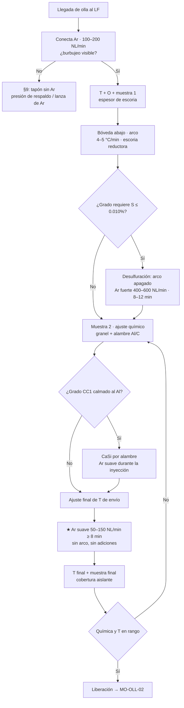

# MO-LF-01 — Tratamiento en horno olla: calentamiento, ajuste químico, desulfuración, argón y alambre

| Código | Versión | Estado | Área | Dueño del proceso | Elaboró | Revisión técnica | Revisión de seguridad | Aprobó | Fecha | Próxima revisión |
|---|---|---|---|---|---|---|---|---|---|---|
| MO-LF-01 | 0.1 | Borrador para validación | Metalurgia secundaria — LF-1 / LF-2 | C-07 Ingeniero de Proceso EAF / LF | experto-operativo-metalurgia | experto-operativo-metalurgia | experto-seguridad-salud | Pendiente (Gerente de Acería / Director) | 2026-09-25 | 2027-09-25 |

> Valores técnicos tomados de `FT-ACE-001` v0.1. Lo marcado **[Validar con OEM / Ingeniería de Proceso]** o **[Supuesto]** no se usa en planta hasta que C-07 lo valide.

## 1. Objetivo y alcance
**Objetivo:** entregar a la colada continua, en **35–45 min**, acero en **composición del grado**, **limpio** y a la **temperatura de envío** (líquidus + sobrecalentamiento + pérdidas de transporte), con **S ≤ 0.010%** y **Al soluble 0.020–0.045%** en grados calmados al Al (CC1), y con **agitación suave de argón ≥ 8 min** antes del envío.

**Alcance:** desde la llegada de la olla a la estación LF (carro) hasta su liberación a la grúa de colada (MO-OLL-02): conexión de argón, medición y muestreo, calentamiento con arco, formación de escoria reductora, desulfuración, ajuste químico (granel y alambre), tratamiento con CaSi, agitación suave y cobertura.
**No incluye:** mantenimiento del LF (transformador 25 MVA, electrodos, bóveda), ni la preparación de la olla (MO-OLL-01).

## 2. Roles y responsabilidades
| Rol | Responsabilidad en este proceso | R/A/C/I |
|---|---|---|
| C-07 Ingeniero de Proceso EAF / LF | Dueño. Define prácticas por grado (escoria, adiciones, argón, CaSi, T de envío). | A |
| S-06 Operador de Horno Olla | Opera el LF: argón, arco, adiciones, decisiones de ajuste; libera la olla. | R |
| S-07 Ayudante de Horno Olla / Alimentación de Alambre | Conecta argón, mide T/O, toma muestras, opera el alimentador de alambre, mide espesor de escoria. | R |
| S-11 Muestrero / Analista | Analiza muestras en ≤ 4 min [Supuesto]. | R |
| C-09 Metalurgista de Producto | Define rangos químicos por grado y decide desviaciones. | C |
| C-05 Supervisor de Hornos | Supervisa el turno; decide en condiciones anormales. | C |
| S-12 Operador de Púlpito de Colada | Informa hora de requerimiento de la olla y T objetivo en distribuidor. | I |

## 3. Descripción del proceso
La olla llega del EAF con el acero ya desoxidado parcialmente y ≈ 1,570–1,590 °C [Supuesto]. Con **argón** por el tapón poroso se homogeniza y se mide. Los **3 electrodos de 457 mm** (25 MVA) calientan el acero **a 4–5 °C/min** bajo una **escoria reductora** que cubre el arco. Con escoria desoxidada (FeO + MnO bajos) y **agitación fuerte (400–600 NL/min)**, el azufre pasa del acero a la escoria (**desulfuración**). Luego se ajusta la química con aleaciones a granel y **alambre** (Al, C), se trata con **CaSi** para modificar las inclusiones de alúmina (grados de CC1) y se termina con **agitación suave (50–150 NL/min) ≥ 8 min** para flotar inclusiones.

## 4. Equipos y maquinaria
| Equipo / componente | Función | Especificación clave | Condición para operar (verificación) |
|---|---|---|---|
| Transformador del LF | Potencia para calentar | 25 MVA; taps según OEM [Validar con OEM / Ingeniería de Proceso] | Sin alarmas de aceite/temperatura |
| Electrodos (3) | Arco | Grafito 457 mm (18") | Longitud suficiente; juntas apretadas (práctica análoga a MO-EAF-08) |
| Bóveda enfriada por agua | Cubre la olla, capta humos | Circuito de agua con monitoreo de caudal [Validar con OEM / Ingeniería de Proceso] | Sin fuga; caudal y T en rango |
| Estación de argón | Agitación por tapón poroso | Fuerte 400–600 NL/min; suave 50–150 NL/min | Conexión rápida sin fuga; presión de respaldo disponible |
| Lanza de argón de emergencia (superior) | Agitación si el tapón falla | [Validar con OEM / Ingeniería de Proceso] | Disponible |
| Alimentador de alambre | CaSi, Al, C | 2 líneas; velocidad 150–250 m/min [Supuesto] | Guías sin obstrucción; contador de metros calibrado |
| Tolvas de aleación y báscula | Adiciones a granel | Cal, aluminato de Ca, FeMn, FeSi, SiMn, FeNb, recarburante | Materiales secos; báscula verificada |
| Lanza manipuladora | T, O, muestra, espesor de escoria | Sondas desechables | Contacto OK |
| Carro de olla con báscula | Posiciona la olla | — | Vía libre; enclavamiento con bóveda |
| Extracción de humos | Capta humos y polvo | — | En servicio |

## 5. Parámetros de operación
| Parámetro | Unidad | Objetivo | Rango normal | Alarma / límite | Acción si está fuera de rango | Dónde se mide |
|---|---|---|---|---|---|---|
| Tiempo de tratamiento | min | 40 | 35–45 | > 50 | Informa a S-12 (secuencia); registra causa | Nivel 2 |
| Velocidad de calentamiento | °C/min | 4.5 | 4–5 | < 3 | Revisa escoria (arco expuesto), tap, argón excesivo | Cálculo T1–T2 |
| Espesor de escoria a la llegada | mm | 60 [Supuesto] | 40–100 | > 100 | Arrastre del EAF: desescoriar o más desoxidante/cal; analizar P | Varilla/sonda |
| Argón inicial / homogenización | NL/min | 150 | 100–200 | Sin burbujeo | §9 | Caudalímetro / visual |
| Argón fuerte (desulfuración) | NL/min | 500 | 400–600 | > 600 | Salpicaduras, ojo abierto (N y reoxidación): reduce | Caudalímetro |
| Argón suave final | NL/min | 100 | 50–150 | "Ojo" abierto > 200 mm [Supuesto] | Reduce flujo | Caudalímetro / visual |
| Duración de agitación suave antes del envío | min | 10 | ≥ 8 | < 8 | No liberar | Nivel 2 |
| Azufre final (CC1 bajo C y HSLA) | % | ≤ 0.008 | ≤ 0.010 | > 0.010 | Repite desulfuración con escoria desoxidada; C-09 decide | OES |
| Al soluble (CC1) | % | 0.035 | 0.020–0.045 | < 0.020 o > 0.045 | Bajo: alambre de Al; alto: no se puede quitar → C-09 decide | OES |
| Al (CC2, varilla/barras) | % | ≤ 0.005 [Validar con Ingeniería de Proceso] | — | > 0.005 | Riesgo de obstrucción de buzas calibradas: C-09/C-08 deciden | OES |
| FeO + MnO en escoria (grados desulfurados) | % | ≤ 1.0 [Validar con Ingeniería de Proceso] | — | > 2.0 | Desoxida escoria (Al granulado / CaC₂ según práctica) | Análisis de escoria |
| Composición de escoria reductora (CC1) | % | CaO 50–58; Al₂O₃ 25–35; SiO₂ ≤ 8; MgO 6–10 [Validar con Ingeniería de Proceso] | — | MgO < 6 | Agrega fuente de MgO (protege línea de escoria) | Análisis de escoria |
| CaSi (CC1 calmado al Al) | kg/t | 0.4 [Supuesto] | 0.3–0.5 | Ca/Al fuera de 0.08–0.14 [Validar con Ingeniería de Proceso] | Ajusta con C-07 (exceso → CaS; defecto → alúmina sólida, obstrucción) | Alimentador / OES |
| Velocidad de alambre | m/min | 200 [Supuesto] | 150–250 | Alambre sale o flota | Ajusta; verifica que penetre bajo la escoria | Alimentador |
| Nitrógeno captado en LF | ppm | ≤ 10 [Supuesto] | — | > 15 | Menos arco expuesto; menos ojo abierto | Muestra |
| Temperatura de envío | °C | Ver tabla abajo | ± 5 °C del objetivo | Fuera de ± 10 °C | Ajusta con arco (baja T: calentar antes del Ar suave); alta T: espera con Ar suave | Sonda final |

**Temperatura de envío (guía de cálculo)** — T envío = T líquidus + sobrecalentamiento objetivo en distribuidor + pérdidas (olla en espera, traslado, apertura y llenado del distribuidor). Líquidus aproximado: T liq ≈ 1,536 − (78·C + 7.6·Si + 4.9·Mn + 34·P + 30·S + 3.6·Al) °C (composición en %) [Validar con Ingeniería de Proceso].

| Familia | Líquidus típico | Sobrecalentamiento (FT-ACE-001) | Pérdidas LF → distribuidor [Supuesto] | T de envío de referencia |
|---|---|---|---|---|
| Bajo C calmado al Al (CC1) | ≈ 1,525–1,530 °C | 20–30 °C | 35–45 °C | ≈ 1,585–1,600 °C |
| HSLA (CC1) | ≈ 1,518–1,523 °C | 20–30 °C | 35–45 °C | ≈ 1,575–1,595 °C |
| Varilla corrugada (CC2) | ≈ 1,500–1,505 °C | 20–35 °C | 35–45 °C | ≈ 1,560–1,580 °C |
| Barras comerciales (CC2) | ≈ 1,510–1,515 °C | 20–35 °C | 35–45 °C | ≈ 1,570–1,590 °C |

La primera olla de secuencia requiere T más alta (distribuidor frío) según C-08 [Validar con Ingeniería de Proceso].

## 6. Seguridad
### 6.1 Peligros y controles críticos
| Peligro | Consecuencia | Control crítico | Verificación |
|---|---|---|---|
| Fuga de agua de la bóveda del LF | Explosión vapor–metal | ★ Monitoreo de caudal; ante alarma: arco fuera, bóveda arriba solo si no hay agua sobre el baño, evacuación (MS-ACE-09) | Tendencias; VCC |
| Adiciones o alambre húmedos | Proyección de metal | ★ Materiales en tolvas cerradas; bobinas de alambre bajo techo | Inspección de lote |
| Argón en fosas, bajo el carro y espacios cerrados | Asfixia | ★ Monitor de O₂ fijo en fosas (alarma < 19.5%); entrada con permiso (MS-ACE-05/06) | Prueba del monitor |
| Agitación fuerte con bordo libre bajo | Derrame de escoria/acero | Bordo libre ≥ 300 mm [Supuesto]; flujo ≤ 600 NL/min | Visual |
| Reacción del CaSi (vapor de Ca, llamarada) | Quemaduras | Bóveda abajo; nadie frente a la ventana durante la inyección | Supervisor |
| Latigazo o rotura de alambre | Golpes, cortes | Guías cerradas; nadie en la trayectoria; LOTO al desatascar | Observación |
| Energía eléctrica del LF | Electrocución | ★ Nadie en la bóveda/plataforma de electrodos con el interruptor cerrado; LOTO (MS-ACE-02) | Tablero de llaves |
| Perforación de olla en la estación | Derrame | Termografía; fosa bajo la estación seca | Inspección |
| CO y humos | Intoxicación | Extracción; detector de CO | Detector |

### 6.2 EPP obligatorio
S-06 / S-07 en plataforma: casco, careta con visor dorado, chaqueta y guantes aluminizados para medición y muestreo, ropa ignífuga, botas metatarsales, protección auditiva, detector personal de CO y de O₂. Alimentador de alambre: además guantes de carnaza y protección facial.

### 6.3 Permisos, bloqueos y zonas de exclusión
- ★ Plataforma de electrodos y bóveda: interruptor abierto + LOTO antes de subir (MS-ACE-02).
- ★ Fosa del carro y túneles de argón: espacio confinado con medición de O₂ (MS-ACE-05).
- Zona de exclusión frente a la ventana de adiciones durante la inyección de CaSi y la agitación fuerte.
- Movimiento del carro: bóveda arriba y electrodos arriba (enclavamiento).

## 7. Calidad
| Variable crítica de calidad | Especificación | Método / frecuencia | Registro | Defecto si falla |
|---|---|---|---|---|
| Química final | Rango del grado (FT-ACE-001 §7; C-09) | Muestra final por colada | Laboratorio / nivel 2 | Colada fuera de grado |
| Azufre | ≤ 0.010% (CC1) | Muestra | Laboratorio | Inclusiones de MnS; grietas; baja tenacidad |
| Al soluble | 0.020–0.045% (CC1); ≤ 0.005% (CC2) [Validar] | Muestra | Laboratorio | Obstrucción de buza (clogging); envejecimiento |
| Tratamiento con Ca | Ca/Al 0.08–0.14 [Validar con Ingeniería de Proceso] | Muestra | Laboratorio | Clogging por alúmina o CaS |
| Agitación suave | ≥ 8 min | Registro de argón | Nivel 2 | Inclusiones en planchón/palanquilla |
| Temperatura de envío | ± 5 °C del objetivo | Sonda final | Nivel 2 | Sobrecalentamiento fuera de 20–30 °C (CC1) / 20–35 °C (CC2): breakout, segregación, congelamiento |
| Nitrógeno | Captación ≤ 10 ppm [Supuesto] | Muestra inicial y final | Laboratorio | N alto |

## 8. Procedimiento paso a paso
| # | Paso | Cómo hacerlo (detalle y medición) | Criterio de aceptación | ★ | Rol |
|---|---|---|---|---|---|
| 1 | Recibe datos | Lee del EAF: T y O de vaciado, adiciones, arrastre estimado, número de olla. Lee de CC: hora requerida y T objetivo. | Datos en nivel 2 | | S-06 |
| 2 | Posiciona la olla | Carro en estación; verifica bordo libre ≥ 300 mm y ausencia de fuga/punto caliente. | Bordo libre y coraza OK | ★ | S-06 / S-07 |
| 3 | Conecta argón | Conexión rápida; 100–200 NL/min; confirma burbujeo. | Burbujeo visible | | S-07 |
| 4 | Mide y muestrea (1) | Tras 2–3 min de argón: T, O (si aplica), muestra, espesor de escoria. | Lecturas válidas | 🔎 | S-07 |
| 5 | Baja bóveda y calienta | Electrodos abajo; tap según práctica; Ar 100–200 NL/min. Agrega cal y aluminato de calcio para escoria reductora. | 4–5 °C/min; arco cubierto | | S-06 |
| 6 | Desoxida la escoria | Agrega desoxidante de escoria según práctica (Al granulado / CaC₂ [Validar con Ingeniería de Proceso]). | Escoria clara, FeO + MnO bajo | 🔎 | S-06 |
| 7 | Desulfura (si el grado lo pide) | Arco apagado; Ar 400–600 NL/min por 8–12 min; vigila salpicaduras y bordo libre. | S ≤ 0.010% en muestra 2 | 🔎 | S-06 |
| 8 | Muestra 2 y ajuste | Calcula y agrega aleaciones a granel (FeMn, FeSi, SiMn, FeNb, C) con rendimientos de C-07; ajusta Al con alambre. | Química en rango en muestra 3 | 🔎 | S-06 / S-07 |
| 9 | Trata con CaSi (CC1 al Al) | Después del Al final y con T cercana a envío: alambre CaSi 0.3–0.5 kg/t, 150–250 m/min, Ar suave; bóveda abajo, nadie frente a la ventana. | Metros inyectados según cálculo | ★ | S-07 |
| 10 | Ajusta temperatura | Calienta hasta T de envío + margen de la agitación suave. | T en objetivo | | S-06 |
| 11 | Agitación suave | Arco apagado; Ar 50–150 NL/min, ojo ≤ 200 mm; ≥ 8 min sin adiciones. | ≥ 8 min cumplidos | ★ | S-06 |
| 12 | Medición final | T y muestra final. | T ± 5 °C; química en rango | 🔎 | S-07 |
| 13 | Cubre | Agrega cobertura aislante según práctica [Validar con Ingeniería de Proceso]. | Superficie cubierta | | S-07 |
| 14 | Libera | Desconecta argón; bóveda arriba; confirma a S-09 y S-12: olla, colada, T, destino. | Liberación registrada | | S-06 |

## 9. Condiciones anormales y respuesta
| Síntoma / alarma | Causa probable | Acción inmediata | A quién avisar |
|---|---|---|---|
| Tapón sin argón (no hay burbujeo) | Tapón tapado, fuga en la conexión | Revisa conexión; aplica presión de respaldo (bypass) [Validar con OEM / Ingeniería de Proceso]; si falla, lanza de argón superior; sin agitación no hay desulfuración | C-05, C-07 |
| Perforación o fuga de olla en la estación | Refractario agotado | 🛑 Arco fuera, electrodos y bóveda arriba, corta argón si la fuga está en el fondo, evacua; metal a fosa seca | C-04, C-16 (MS-ACE-09) |
| Alarma de fuga de agua en bóveda | Panel de bóveda dañado | 🛑 Arco fuera; no muevas la olla si hay agua sobre la escoria; evacua; corta el agua del circuito | C-05, Mantenimiento |
| Escoria espumando fuera de la olla | Escoria oxidada + desoxidante, argón excesivo | Reduce argón; detén adiciones; arco fuera | C-05 |
| Arco inestable / ruidoso | Escoria delgada o seca | Agrega cal/aluminato; baja tap | S-06 |
| S no baja de 0.010% | Escoria oxidada, poca agitación, poca escoria, T baja | Desoxida escoria, más cal, repite agitación fuerte | C-07, C-09 |
| Al alto (> 0.045%) | Sobre-adición | No se corrige hacia abajo: C-09 decide reasignación | C-09 |
| Alambre no entra / se atasca | Guía obstruida, velocidad, escoria gruesa | Detén; LOTO para desatascar; reanuda | S-07, C-05 |
| Tiempo > 50 min | Varias correcciones, falta de potencia | Informa a S-12; C-04 ajusta secuencia | C-04 |
| Electrodo roto | Golpe, junta floja | Arco fuera; práctica de MO-EAF-08 | C-05 |

## 10. Registros
- Registro de tratamiento por colada (nivel 2): T y química de cada muestra, adiciones (kg), metros de alambre por tipo, argón (NL/min y min por etapa), energía (kWh), tiempo total, T de envío.
- Análisis de escoria (cuando la práctica lo pide).
- Eventos: tapón sin argón, fugas, desviaciones de química y decisiones de C-09.
- Permisos de espacio confinado (fosas) y LOTO.

## 11. Competencia requerida y certificación
| Rol | Nivel requerido (1–4) | Formación teórica (h) | OJT supervisado (h / eventos) | Evaluación (pasos ★) | Vigencia |
|---|---|---|---|---|---|
| S-06 Operador de Horno Olla | 3 | 40 (metalurgia secundaria: desoxidación, desulfuración, inclusiones, T de envío) | 160 h / 60 tratamientos | Pasos 2, 7, 9, 11 + cálculo de aleaciones y T de envío | 24 meses (TD-P07) |
| S-07 Ayudante / Alambre | 3 | 24 | 80 h / 40 tratamientos | Pasos 3, 4, 9, 12; manejo seguro del alimentador | 24 meses |
| S-11 Muestrero / Analista | 3 | 24 | 80 h / 100 análisis | Preparación y reporte | 24 meses |
| C-07 Ingeniero de Proceso | 4 | 40 | — | Diseño de prácticas por grado | 24 meses |

Lista corta de verificación de pasos ★:
1. Verifica bordo libre y coraza antes de agitar.
2. Ejecuta la desulfuración con escoria desoxidada y argón fuerte sin derrame.
3. Inyecta CaSi con la zona despejada y la bóveda abajo.
4. Cumple ≥ 8 min de argón suave sin adiciones antes de liberar.
5. Responde a tapón sin argón y a fuga de agua en bóveda.

## 12. Referencias
- FT-ACE-001 §3, §4, §5 y §7; CAT-ACE-001; MO-EAF-07, MO-OLL-01, MO-OLL-02, MO-CC1-04, MO-CC2-04.
- MS-ACE-01, MS-ACE-02, MS-ACE-03, MS-ACE-05, MS-ACE-06, MS-ACE-09.
- NOM-029-STPS, NOM-033-STPS, NOM-017-STPS, NOM-015-STPS, NOM-010-STPS — verificar con Jurídico Laboral / SSO.
- Manuales OEM del LF, alimentador de alambre y estación de argón [por referenciar]; prácticas de C-07 por grado [por referenciar].
- TD-P07.

## 13. Control de cambios
| Versión | Fecha | Cambio | Autor |
|---|---|---|---|
| 0.1 | 2026-09-25 | Emisión inicial para validación | experto-operativo-metalurgia |
