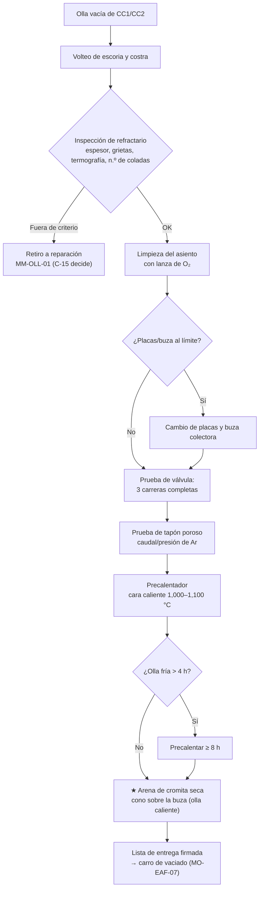

# MO-OLL-01 — Preparación de olla: válvula deslizante, arena de sello, tapón poroso y precalentamiento

| Código | Versión | Estado | Área | Dueño del proceso | Elaboró | Revisión técnica | Revisión de seguridad | Aprobó | Fecha | Próxima revisión |
|---|---|---|---|---|---|---|---|---|---|---|
| MO-OLL-01 | 0.1 | Borrador para validación | Metalurgia secundaria — Taller y estación de preparación de ollas | C-15 Especialista de Refractarios | experto-operativo-metalurgia | experto-operativo-metalurgia — visto bueno con observaciones, 2026-09-25 | experto-seguridad-salud — visto bueno con observaciones, 2026-09-25 | Pendiente (Gerente de Acería / Director) | 2026-09-25 | 2027-09-25 |

> Valores técnicos tomados de `FT-ACE-001` v0.3. Lo marcado **[Validar con OEM / Ingeniería de Proceso]** o **[Supuesto]** no se usa en planta hasta que C-07 / C-15 lo validen.

## 1. Objetivo y alcance
**Objetivo:** entregar al EAF una olla de 150 t **seca, caliente (cara caliente 1,000–1,100 °C), con refractario vigente, válvula deslizante probada y cerrada, arena de sello colocada y tapón poroso con paso de argón**, para lograr **apertura libre ≥ 98%** en la colada continua y **cero perforaciones**.

**Alcance:** desde que la olla vacía regresa de la colada continua hasta que se entrega al carro de vaciado del EAF. Incluye volteo de escoria y costra, inspección de refractario, cambio de placas y buzas, prueba de tapón, llenado de arena y precalentamiento (olla en ciclo y olla fría).
**No incluye:** revestimiento completo y reparaciones mayores (MM-OLL-01) ni el traslado con olla llena (MO-OLL-02).

## 2. Roles y responsabilidades
| Rol | Responsabilidad en este proceso | R/A/C/I |
|---|---|---|
| C-15 Especialista de Refractarios | Dueño. Define criterios de retiro, vida, reparaciones y curvas de secado/calentamiento. Decide el retiro de una olla. | A |
| S-08 Preparador de Ollas (Ollero) | Ejecuta la preparación, las pruebas, el llenado de arena y el precalentamiento; firma la lista de entrega. | R |
| S-24 Refractarista | Cambia placas, buzas y tapón; repara la línea de escoria y la zona de impacto. | R |
| S-09 Operador de Grúa de Colada | Mueve la olla entre estaciones (volteo, preparación, precalentador, carro). | R |
| C-04 Jefe de Turno de Acería | Asigna ollas a coladas según la secuencia y la disponibilidad. | C |
| S-02 Segundo Hornero | Recibe la olla y verifica la lista (MO-EAF-07). | I |

## 3. Descripción del proceso
Una olla hace un ciclo de ≈ 3.5 h (7 ollas en ciclo para ≈ 46 coladas/día). Al regresar de la CC se voltea para retirar escoria y costra. En la estación de preparación se inspecciona el refractario, se limpia el asiento de la buza con lanza de O₂, se revisan o cambian las placas de la válvula deslizante, se prueba la válvula (carrera completa) y el tapón poroso (paso de argón). La olla va al precalentador hasta que la cara caliente llegue a **1,000–1,100 °C**. Una olla fría fuera de ciclo > 4 h se precalienta **≥ 8 h**. Al final, con la olla caliente y justo antes de entregarla, se llena la buza superior con **arena de cromita seca** formando un cono: si la arena pasa horas en el precalentador se sinteriza y baja la apertura libre.

## 4. Equipos y maquinaria
| Equipo / componente | Función | Especificación clave | Condición para operar (verificación) |
|---|---|---|---|
| Olla de 150 t (flota de 10) | Contiene el acero | 7 en ciclo, 3 en mantenimiento/reserva; vida 60–80 coladas | Número de coladas en registro; muñones inspeccionados (MM-OLL-01) |
| Refractario de trabajo | Protege la coraza | Línea de escoria MgO-C; barril y fondo Al₂O₃-MgO-C | Espesor residual ≥ criterio de C-15 |
| Válvula deslizante | Abre/cierra el flujo en la CC | Placas de 2 o 3 piezas; buza colectora | Carrera completa, sin trabas; resortes/presión de cierre según OEM [Validar con OEM / Ingeniería de Proceso] |
| Arena de sello (cromita) | Evita que el acero solidifique en la buza | Granulometría y cantidad según proveedor [Validar con OEM / Ingeniería de Proceso] | Seca (≤ 0.2% humedad [Supuesto]); tolva cerrada |
| Tapón poroso (1–2) | Inyecta argón | Conexión rápida al carro/estación | Paso de argón en prueba |
| Estación de volteo | Retira escoria y costra | — | Fosa seca; área despejada |
| Precalentador (horizontal o vertical) | Calienta la cara caliente | Quemador de gas natural con control de flama [Validar con OEM / Ingeniería de Proceso] | Detector de flama y purga automática funcionando |
| Pirómetro / cámara IR | Mide cara caliente y coraza | — | Calibración vigente |
| Lanza de O₂ | Limpia el asiento de la buza | — | Manguera y válvula sin grasa ni daño |

## 5. Parámetros de operación
| Parámetro | Unidad | Objetivo | Rango normal | Alarma / límite | Acción si está fuera de rango | Dónde se mide |
|---|---|---|---|---|---|---|
| Temperatura de cara caliente al entregar | °C | 1,050 | 1,000–1,100 | < 1,000 | No entregar; continúa precalentando | Pirómetro IR |
| Tiempo fuera de ciclo (olla fría) | h | — | ≤ 4 h: olla en ciclo | > 4 h | Precalienta ≥ 8 h antes de recibir acero | Registro de ollas |
| Tiempo de precalentamiento de olla fría | h | ≥ 8 | 8–12 | < 8 | No entregar | Registro del precalentador |
| Olla nueva o recién revestida | — | Curva de secado y calentamiento del proveedor | [Validar con OEM / Ingeniería de Proceso: típico 24–48 h] | Curva incompleta | No entregar | Registro del precalentador |
| Coladas del refractario | coladas | — | 60–80 | ≥ 80 o criterio de inspección | Retiro a MM-OLL-01 | Registro de ollas |
| Espesor residual en línea de escoria | mm | — | ≥ 50 [Supuesto] | < 50 | Retiro o reparación de línea de escoria (C-15) | Medición / escáner láser si existe |
| Espesor residual en barril | mm | — | ≥ 40 [Supuesto] | < 40 | Retiro (C-15) | Medición |
| Temperatura de coraza (termografía en servicio anterior) | °C | ≤ 300 [Supuesto] | — | > 350 alarma; > 400 retiro [Supuesto] | Retiro y revisión | Cámara IR |
| Coladas por juego de placas | coladas | según OEM | 2–5 [Validar con OEM / Ingeniería de Proceso] | Erosión del orificio > criterio OEM | Cambio de placas | Inspección visual / calibre |
| Prueba de válvula | carreras | 3 completas | sin traba | Carrera incompleta o lenta | Revisar mecanismo/hidráulica; no entregar | Visual / tiempo |
| Prueba de tapón poroso | NL/min a presión de prueba | 100–200 NL/min [Supuesto] | presión según OEM | Caudal bajo con presión alta (tapón tapado) | Limpieza con O₂ o cambio de tapón | Estación de prueba |
| Humedad de la arena | % | ≤ 0.2 [Supuesto] | — | > 0.5 | No usar; cambiar lote | Certificado / prueba rápida |
| Apertura libre en CC (KPI) | % de coladas | ≥ 98 | — | < 98% semanal | Análisis con C-15 (arena, tiempo de espera, T) | Registro de CC |

**Plan de precalentamiento por condición de la olla** [Validar con C-15 / proveedor de refractarios]:

| Condición | Definición | Precalentamiento mínimo | Criterio de entrega |
|---|---|---|---|
| Olla en ciclo | Regresó de CC y estuvo fuera ≤ 4 h | Hasta cara caliente 1,000–1,100 °C (típico 30–60 min [Supuesto]) | ≥ 1,000 °C |
| Olla fría | Fuera de ciclo > 4 h | ≥ 8 h | ≥ 1,000 °C y 8 h cumplidas |
| Olla con reparación de línea de escoria | Reparación con material nuevo | Curva del proveedor para el material de reparación | Curva completa + ≥ 1,000 °C |
| Olla nueva o revestida | Refractario de trabajo nuevo | Curva de secado y calentamiento completa (típico 24–48 h) | Curva firmada por C-15 |
| Olla con 1.ª colada después de revestir | — | Igual que la anterior; preferir grados no críticos [Supuesto] | Autorización de C-15 |

## 6. Seguridad
### 6.1 Peligros y controles críticos
| Peligro | Consecuencia | Control crítico | Verificación |
|---|---|---|---|
| Olla húmeda o fría que recibe acero | Explosión, perforación | ★ Cara caliente ≥ 1,000 °C; regla de olla fría (> 4 h → ≥ 8 h); curva de secado completa en ollas nuevas | Lista de entrega firmada; VCC |
| Arena o refractario con humedad | Proyección de metal en la CC; explosión | ★ Arena en tolva cerrada; materiales refractarios almacenados secos | Inspección de lote |
| Reencendido del precalentador sin purga | Explosión de gas | ★ Purga automática antes de encender; detector de flama; nunca reencender a mano sin purga | Prueba del sistema de flama (mantenimiento) |
| Radiación térmica de la olla caliente (incluye el llenado de arena con la olla ya precalentada, paso 11) | Quemaduras, estrés térmico | ★ Llenado desde la posición o plataforma designada con el tubo/embudo de llenado, sin asomarse sobre la boca de la olla; EPP aluminizado; ≤ 2 min frente a la olla por intervención; hidratación (MS-ACE-01, MS-ACE-08) | Supervisor |
| Lanza de O₂ | Incendio de ropa, quemaduras | Ropa limpia sin grasa; válvula de cierre rápido | Revisión de lanza |
| Movimiento del mecanismo de la válvula | Atrapamiento de manos | ★ Hidráulica desconectada/bloqueada al cambiar placas (MS-ACE-02) | Verificación por S-24 |
| Entrada a la olla (reparación) | Atmósfera, calor, caída de refractario | Espacio confinado (MS-ACE-05, NOM-033); olla fría y ventilada; argón desconectado; entrada con O₂ 19.5–23.5 %, CO < 25 ppm y < 10 % LEL (0 % LEL detectable, ≤ 1 % de lectura, para trabajo en caliente) | Permiso de entrada con lecturas |
| Olla suspendida | Aplastamiento | Nadie bajo la olla; señalero (MS-ACE-04) | VCC |

### 6.2 EPP obligatorio
Casco, careta con visor dorado, chaqueta, polainas y guantes aluminizados junto a olla caliente, ropa ignífuga, botas metatarsales, lentes, protección auditiva, mascarilla para polvo de cromita/refractario (según NOM-010), detector personal multigás en zona del precalentador (CO 25 ppm → salir, 200 ppm → evacuar [Verificar NOM-010]; GN 10 % LEL → salir, 20 % LEL → evacuar; MS-ACE-06).

### 6.3 Permisos, bloqueos y zonas de exclusión
- Cambio de placas y buzas: hidráulica de la válvula desconectada y bloqueada; olla asentada en su soporte (no suspendida).
- ★ Nadie bajo una olla suspendida ni en la trayectoria de la grúa.
- Volteo de escoria: zona roja ≤ 15 m del punto de volteo, amarilla 15–30 m, nadie a pie (MS-ACE-01); fosa seca, sin agua estancada (MS-ACE-03).
- Entrada a olla: permiso de espacio confinado, aislamiento positivo del argón y medición de atmósfera en el orden O₂ → LEL → CO (MS-ACE-05).
- ★ Secuencia precalentamiento → arena (pasos 10 y 11): la arena se coloca con la olla ya caliente, justo antes de entregar, para que no se sinterice; el llenado se hace desde la posición protegida con EPP aluminizado y la arena debe estar seca (MS-ACE-03). Visto bueno de seguridad a esta secuencia (revisión 2026-09-25).

## 7. Calidad
| Variable crítica de calidad | Especificación | Método / frecuencia | Registro | Defecto si falla |
|---|---|---|---|---|
| Apertura libre | ≥ 98% de coladas | Registro en CC por colada | Registro de ollas | Lanceo de O₂ en la CC → reoxidación, inclusiones, riesgo al operador |
| Temperatura de la olla | 1,000–1,100 °C cara caliente | Pirómetro por entrega | Lista de entrega | Caída de T excesiva, costras, tiempo de LF |
| Limpieza de la olla (costra/escoria residual) | Sin costra en fondo y asiento | Visual por ciclo | Lista | Reoxidación, inclusiones, válvula que no abre |
| Tapón poroso | Con paso de argón | Prueba por ciclo | Lista | Sin desulfuración ni flotación de inclusiones |

## 8. Procedimiento paso a paso
| # | Paso | Cómo hacerlo (detalle y medición) | Criterio de aceptación | ★ | Rol |
|---|---|---|---|---|---|
| 1 | Recibe la olla vacía | Registra número de olla, coladas acumuladas y observaciones de la CC (apertura libre, flujo). | Registro | | S-08 |
| 2 | Voltea escoria y costra | Con grúa de colada, voltea en la estación sobre fosa seca; zona despejada. | Olla limpia | ★ | S-09 / S-08 |
| 3 | Inspecciona el refractario | Visual y medición: línea de escoria, barril, fondo, zona de impacto, asiento de buza y tapón. Revisa termografía del ciclo anterior. | Dentro de criterio de §5 | 🔎 | S-08 / S-24 |
| 4 | Decide retiro | Si algún criterio falla: avisa a C-15 y retira la olla. | Decisión registrada | ★ | C-15 |
| 5 | Limpia el asiento | Lanza de O₂ desde arriba para limpiar el asiento de la buza superior, sin dañar el bloque. | Asiento limpio | | S-08 |
| 6 | Revisa/cambia placas | Con hidráulica desconectada: inspecciona orificio y superficie de placas; cambia según criterio OEM y el conteo. | Placas vigentes | ★ | S-24 |
| 7 | Cambia buza colectora | Si está erosionada o con costra. | Buza nueva/íntegra | | S-24 |
| 8 | Prueba la válvula | Reconecta; ejecuta 3 carreras completas; verifica tiempo y suavidad; deja cerrada. | Carrera completa, cerrada | | S-24 |
| 9 | Prueba el tapón | Conecta argón; mide caudal a la presión de prueba; confirma burbujeo o caudal. | 100–200 NL/min [Supuesto] | 🔎 | S-08 |
| 10 | Precalienta | Coloca en el precalentador; purga automática y encendido; controla hasta 1,000–1,100 °C. Olla fría > 4 h: ≥ 8 h. Olla nueva: curva completa. | T de cara caliente en rango | ★ | S-08 |
| 11 | Llena con arena | Con la olla caliente y fuera del precalentador: verifica que la arena esté seca; desde la posición designada, con tubo/embudo de llenado y EPP aluminizado, sin asomarte sobre la boca de la olla, llena la buza superior y forma un cono sobre ella con la cantidad del proveedor. | Cono completo, sin huecos; exposición ≤ 2 min | ★ | S-08 |
| 12 | Verifica antes de entregar | Mide T de cara caliente; revisa arena (no removida), válvula cerrada, conexión de Ar. | Todo conforme | ★ | S-08 |
| 13 | Entrega | Firma la lista de entrega; la olla va al carro de vaciado (MO-EAF-07) en ≤ 10 min [Supuesto] para no perder temperatura. | Lista firmada | | S-08 / S-09 |

## 9. Condiciones anormales y respuesta
| Síntoma / alarma | Causa probable | Acción inmediata | A quién avisar |
|---|---|---|---|
| Punto caliente en coraza > 350 °C (en servicio o preparación) | Refractario adelgazado | Retira la olla; C-15 evalúa | C-15, C-04 |
| Perforación de olla (en cualquier estación) | Refractario agotado | 🛑 Evacúa a ≥ 25 m; metal a fosa seca; no uses agua; aplica MS-ACE-09 | C-04, C-16, C-15 |
| Tapón sin paso de argón | Tapón tapado con escoria/metal | Limpieza con O₂ en caliente según práctica; si falla, cambio de tapón o marcar olla "sin Ar" (C-04 decide) | C-15, C-04 |
| Válvula con carrera incompleta | Costra, resortes, hidráulica | No entregar; S-24 corrige | C-15 |
| Olla no alcanza 1,000 °C | Precalentador con falla, olla fría | Continuar; si no hay otra olla, C-04 decide ajuste de T de vaciado con C-07 | C-04, C-07 |
| Falla de flama del precalentador | Detector, gas | Corte automático; purga antes de reencender; mantenimiento | Mantenimiento |
| Arena húmeda | Tolva abierta, lote | Cambia lote; revisa almacenamiento | C-15, C-17 |
| Apertura libre < 98% en la semana | Arena, tiempo de espera, T baja, costra | Análisis de causa con C-15 y CC | C-15, C-06 |

## 10. Registros
- Registro de olla por ciclo: número, coladas, inspección, placas (coladas por juego), buzas, tapón (prueba), arena (lote), T de cara caliente, horas de precalentamiento, firma de entrega.
- Registro de apertura libre (desde CC) por olla.
- Registro de retiros y reparaciones (MM-OLL-01).
- Registro de termografía de coraza.

## 11. Competencia requerida y certificación
| Rol | Nivel requerido (1–4) | Formación teórica (h) | OJT supervisado (h / eventos) | Evaluación (pasos ★) | Vigencia |
|---|---|---|---|---|---|
| S-08 Preparador de Ollas | 3 | 24 (refractarios, válvula, tapón, precalentador, agua–metal) | 120 h / 40 ollas | Pasos 2, 10, 11, 12 + criterio de retiro | 24 meses (TD-P07) |
| S-24 Refractarista | 3 | 24 | 120 h / 30 cambios de placas | Paso 6 con LOTO; prueba de válvula | 24 meses (TD-P07); entrada a olla (espacio confinado) 12 meses |
| S-09 Operador de Grúa de Colada | 3 | según MO-OLL-02 | 20 volteos | Paso 2 | 12 meses (grúas/izaje) |
| C-15 Especialista de Refractarios | 4 | 32 + evaluador | — | Criterios de retiro y curvas de calentamiento | 24 meses (TD-P07) |

Lista corta de verificación de pasos ★:
1. Aplica la regla de olla fría (> 4 h → ≥ 8 h) y mide la cara caliente ≥ 1,000 °C.
2. Usa solo arena seca y forma el cono correcto.
3. Cambia placas con la hidráulica bloqueada.
4. Conoce los criterios de retiro (coladas, espesor, termografía).
5. Nunca reenciende el precalentador sin purga.
6. Voltea la escoria sobre fosa seca, sin nadie a ≤ 15 m ni bajo la olla (paso 2).
7. Llena la arena con la olla caliente desde la posición protegida y verifica T, arena y válvula antes de entregar (pasos 11 y 12).

## 12. Referencias
- FT-ACE-001 §3; CAT-ACE-001; MO-EAF-07, MO-OLL-02, MO-LF-01; MM-OLL-01.
- MS-ACE-01, MS-ACE-02, MS-ACE-03, MS-ACE-05, MS-ACE-06 (gas natural), MS-ACE-08.
- NOM-033-STPS, NOM-017-STPS, NOM-015-STPS, NOM-010-STPS, NOM-006-STPS — verificar con Jurídico Laboral / SSO.
- Manuales OEM de la válvula deslizante, tapón poroso y precalentador; práctica del proveedor de refractarios [por referenciar].
- TD-P07.

## 13. Control de cambios
| Versión | Fecha | Cambio | Autor |
|---|---|---|---|
| 0.1 | 2026-09-25 | Emisión inicial para validación | experto-operativo-metalurgia |
| 0.1 | 2026-09-25 | Revisión técnica cruzada contra FT-ACE-001 v0.3: orden real de planta: el llenado con arena (ahora paso 11) va después del precalentamiento (ahora paso 10), justo antes de entregar; se intercambian los números sin cambiar el contenido de los pasos ★. | experto-operativo-metalurgia |
