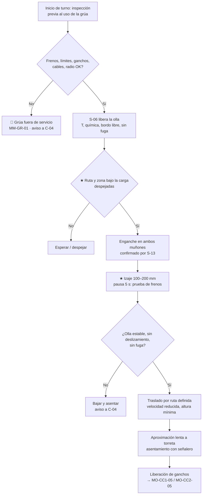

# MO-OLL-02 — Traslado de ollas llenas con grúa de colada

| Código | Versión | Estado | Área | Dueño del proceso | Elaboró | Revisión técnica | Revisión de seguridad | Aprobó | Fecha | Próxima revisión |
|---|---|---|---|---|---|---|---|---|---|---|
| MO-OLL-02 | 0.1 | Borrador para validación | Nave de ollas — LF-1 / LF-2 a CC1 / CC2 | C-04 Jefe de Turno de Acería | experto-operativo-metalurgia | experto-operativo-metalurgia | experto-seguridad-salud | Pendiente (Gerente de Acería / Director) | 2026-09-25 | 2027-09-25 |

> Valores técnicos tomados de `FT-ACE-001` v0.2. Lo marcado **[Validar con OEM / Ingeniería de Proceso]** o **[Supuesto]** no se usa en planta hasta que C-07 / Mantenimiento lo validen.

## 1. Objetivo y alcance
**Objetivo:** trasladar ollas con **≈ 150 t de acero líquido** (carga total ≈ 225–235 t [Supuesto]) desde el horno olla hasta la torreta de CC1 o CC2 —y las ollas vacías de regreso— **sin personas bajo la carga, sin choques, sin derrames y a tiempo** para la secuencia de colada.

**Alcance:** izaje, traslado y asentamiento de ollas llenas y vacías con las grúas de colada de **250/63 t** (doble sistema de freno y límites redundantes): LF → torreta CC1/CC2; olla vacía → volteo/preparación; olla en emergencia → fosa o área de emergencia. Incluye la inspección previa al uso de la grúa por el operador.
**No incluye:** la operación en la torreta (MO-CC1-05 / MO-CC2-05) ni el mantenimiento de la grúa (MM-GR-01).

## 2. Roles y responsabilidades
| Rol | Responsabilidad en este proceso | R/A/C/I |
|---|---|---|
| C-04 Jefe de Turno de Acería | Dueño. Prioriza movimientos, autoriza rutas alternas y decide en emergencias de olla o de grúa. | A |
| S-09 Operador de Grúa de Colada | Inspecciona la grúa, iza, traslada y asienta. Tiene autoridad para no mover una olla insegura. | R |
| S-13 Operador de Plataforma de Colada | Señalero en la torreta y en el LF: confirma enganche de ganchos y asentamiento. | R |
| S-06 Operador de Horno Olla | Libera la olla (T, química, argón suave cumplido, bordo libre, sin fuga). | R |
| S-12 Operador de Púlpito de Colada | Confirma que la torreta está lista para recibir. | C |
| S-19 / S-20 Mantenimiento | Atienden fallas de grúa. | C |
| C-16 Especialista de Seguridad | Define rutas y zonas de exclusión con C-04. | C |

## 3. Descripción del proceso
El acero tratado sale del LF en el carro de olla hacia la posición de izaje. S-06 libera la olla; S-09 baja el gancho principal (doble gancho/traviesa) a los **muñones**, S-13 confirma el enganche de ambos lados y S-09 levanta despacio, **prueba frenos con carga** y traslada por la **ruta definida** hasta el brazo libre de la torreta de la máquina de colada. Asienta suave, S-13 confirma el asiento y se liberan los ganchos. La olla vacía regresa por la misma disciplina a volteo y preparación (MO-OLL-01).

## 4. Equipos y maquinaria
| Equipo / componente | Función | Especificación clave | Condición para operar (verificación) |
|---|---|---|---|
| Grúa de colada (2) | Iza y traslada ollas llenas | 250/63 t; doble sistema de freno; límites redundantes | Inspección previa al uso firmada; sin alarmas; mantenimiento vigente (MM-GR-01) |
| Traviesa con ganchos laminares | Toma la olla por los muñones | Capacidad ≥ 250 t | Sin grietas; seguros; inspección de ganchos (END) vigente [Validar con OEM / Ingeniería de Proceso] |
| Cables de izaje | Soportan la carga | Criterio de descarte OEM/NOM-006 | Sin alambres rotos, aplastamiento ni corrosión fuera de criterio |
| Límites de izaje (superior redundante) | Evitan el choque del bloque | 2 límites independientes | Prueba sin carga al inicio de turno |
| Celda de carga | Indica el peso de la olla | Alarma de sobrecarga | Lectura coherente con la olla vacía/llena |
| Radio y bocina / luces | Comunicación y alerta | Canal dedicado | Prueba de radio al inicio de turno |
| Muñones de la olla | Puntos de izaje | Inspección END según programa [Validar con OEM / Ingeniería de Proceso] | Sin grietas ni desgaste visible |
| Torreta de CC1/CC2 | Recibe la olla | Pesaje de olla | Brazo libre y en posición de carga |

## 5. Parámetros de operación
| Parámetro | Unidad | Objetivo | Rango normal | Alarma / límite | Acción si está fuera de rango | Dónde se mide |
|---|---|---|---|---|---|---|
| Peso de la olla llena (acero + tara + escoria) | t | ≈ 230 [Supuesto] | 220–240 | > 240 [Supuesto]; 250 capacidad nominal | > 240 t: no izar sin C-04; revisar sobrellenado | Celda de carga |
| Bordo libre (acero/escoria al borde) | mm | ≥ 300 [Supuesto] | — | < 300 | No trasladar hasta que C-04 decida (riesgo de derrame) | Visual / nivel |
| Prueba de frenos con carga | mm / s | Levantar 100–200 mm y pausar 5 s | — | Deslizamiento de la carga | Bajar y asentar; grúa fuera de servicio | Visual |
| Altura sobre obstáculos durante el traslado | mm | Mínima segura (≥ 500 [Validar con OEM / Ingeniería de Proceso]) | — | Carga alta sin necesidad | Bajar a la altura de ruta | Visual |
| Velocidad de traslación con olla llena | % de nominal | ≤ 50 [Validar con OEM / Ingeniería de Proceso] | — | Balanceo de la olla | Reduce; frena suave | Mandos |
| Velocidad en aproximación a torreta | % | Marcha lenta | — | — | — | Mandos |
| Tiempo LF → torreta | min | ≤ 8 [Supuesto] | 5–10 | > 12 | Informa a S-12/S-06: pérdida de T | Nivel 2 |
| Temperatura de coraza visible (termografía de ruta) | °C | ≤ 300 [Supuesto] | — | > 350 [Supuesto] | Trasladar a la ruta de emergencia; C-04 decide | Cámara IR |

**Lista de inspección previa al uso de la grúa de colada (resumen)** [Validar con OEM / MM-GR-01]:

| Punto | Cómo se verifica | Criterio |
|---|---|---|
| Frenos de izaje (2 sistemas) | Prueba sin carga: detener y retener | Detienen sin deslizamiento |
| Límite superior principal y de respaldo | Acercamiento lento sin carga | Ambos actúan |
| Límites de traslación y anticolisión | Aproximación lenta | Actúan y reducen velocidad |
| Ganchos, seguros y traviesa | Visual | Sin grietas, deformación ni desgaste visible |
| Cables | Visual en tramos visibles | Sin alambres rotos, aplastamiento o "jaula de pájaro" |
| Celda de carga | Lectura sin carga | Cero coherente |
| Radio, bocina, luces, paro de emergencia | Prueba | Funcionan |
| Cabina (aire acondicionado, extintor, visibilidad) | Visual | En condición |

## 6. Seguridad
### 6.1 Peligros y controles críticos
| Peligro | Consecuencia | Control crítico | Verificación |
|---|---|---|---|
| Personas bajo la olla o en la ruta | Fatalidad por caída de carga o derrame | ★ Nadie bajo la carga; ruta definida y señalizada; bocina y luces; peatones en pasillos protegidos | VCC mensual; bitácora de rutas |
| Falla de freno o de límite | Caída de la olla | ★ Inspección previa al uso; prueba de frenos con carga a 100–200 mm; doble freno | Lista del operador |
| Enganche incompleto de un muñón | Volteo de la olla | ★ Confirmación visual de ambos ganchos por S-13 antes de levantar | Señal "enganche OK" |
| Choque con estructuras u otra grúa | Balanceo, derrame | Anticolisión; velocidad reducida; ruta libre | Prueba de anticolisión |
| Perforación de olla durante el traslado | Derrame sobre la ruta | Termografía; ruta de emergencia; áreas bajo ruta sin agua ni personas | Plan de emergencia MS-ACE-09 |
| Sobrellenado / derrame por el borde | Quemaduras | Bordo libre ≥ 300 mm; traslado suave | S-06 libera con bordo libre |
| Pérdida de energía con olla suspendida | Olla detenida en el aire | Frenos a prueba de falla; evacuar debajo; procedimiento OEM de descenso de emergencia [Validar con OEM / Ingeniería de Proceso] | Simulacro anual |
| Radiación térmica sobre la cabina | Estrés térmico del operador | Cabina aislada y climatizada; pausas | MS-ACE-08 |

### 6.2 EPP obligatorio
S-09: ropa ignífuga, casco, lentes, botas; cabina climatizada con extintor. S-13 (señalero): careta con visor dorado, chaqueta aluminizada, guantes, ropa ignífuga, botas metatarsales, radio. Todos en nave de ollas: protección auditiva.

### 6.3 Permisos, bloqueos y zonas de exclusión
- ★ **Zona de exclusión móvil:** proyección de la olla sobre el piso + margen [Validar con Seguridad: típico ≥ 5 m] durante todo el traslado.
- Rutas definidas en plano (MS-ACE-04): nunca sobre púlpitos, oficinas, comedores, fosas con agua ni vías peatonales sin protección.
- Mantenimiento de grúa: LOTO de la alimentación (conductores/barras) y de la grúa vecina (MS-ACE-02); trabajo en altura (MS-ACE-10).
- Solo S-09 certificado opera; el relevo se hace con la grúa sin carga.

## 7. Calidad
| Variable crítica de calidad | Especificación | Método / frecuencia | Registro | Defecto si falla |
|---|---|---|---|---|
| Tiempo de traslado LF → torreta | ≤ 8 min [Supuesto] | Por colada | Nivel 2 | Pérdida de T; sobrecalentamiento bajo en el distribuidor |
| Olla correcta a la máquina correcta | Grado y destino según programa | Verificación de número de olla y colada con S-12 | Nivel 2 | Grado equivocado en la máquina |
| Traslado suave | Sin balanceo | Observación | — | Salpicadura de escoria, pérdida de capa aislante, reoxidación |

## 8. Procedimiento paso a paso
| # | Paso | Cómo hacerlo (detalle y medición) | Criterio de aceptación | ★ | Rol |
|---|---|---|---|---|---|
| 1 | Inspección previa al uso | Revisa frenos (prueba sin carga), límites superiores (ambos), ganchos y seguros, cables, radio, bocina, luces, anticolisión, celda de carga. | Lista sin pendientes | ★ | S-09 |
| 2 | Recibe la liberación | S-06 confirma: colada, T, química, argón suave cumplido, bordo libre ≥ 300 mm, sin fuga ni punto caliente. | Liberación por radio | | S-06 |
| 3 | Confirma destino | S-12 confirma la torreta y el brazo libre. | Destino confirmado | | S-12 |
| 4 | Despeja la ruta | Bocina; verifica la ruta y el área bajo la trayectoria. | Ruta libre | ★ | S-09 |
| 5 | Engancha | Baja la traviesa, engancha ambos muñones. | Ambos ganchos enganchados | ★ | S-09 |
| 6 | Confirma enganche | S-13, desde posición segura, confirma visualmente ambos lados. | "Enganche OK" | ★ | S-13 |
| 7 | Levanta y prueba frenos | Levanta 100–200 mm, pausa 5 s; observa deslizamiento y peso. | Sin deslizamiento; peso ≤ 240 t | ★ | S-09 |
| 8 | Traslada | Altura mínima segura; ≤ 50% de velocidad; arranques y frenados suaves. | Sin balanceo | | S-09 |
| 9 | Aproxima a la torreta | Marcha lenta; alinea muñones con el brazo; señales de S-13. | Alineado | | S-09 / S-13 |
| 10 | Asienta | Baja suave hasta asentar; S-13 confirma asiento completo. | "Asentada OK" | ★ | S-09 / S-13 |
| 11 | Libera ganchos | Baja la traviesa, desengancha, sube y retira. | Ganchos libres | | S-09 |
| 12 | Olla vacía | Cuando la CC la libera, repite 4–11 hacia volteo/preparación (MO-OLL-01). | Olla en preparación | | S-09 |
| 13 | Registra | Hora, olla, colada, destino, peso, eventos. | Registro | | S-09 |

## 9. Condiciones anormales y respuesta
| Síntoma / alarma | Causa probable | Acción inmediata | A quién avisar |
|---|---|---|---|
| Perforación o fuga de olla durante el traslado | Refractario agotado | 🛑 Si es seguro, lleva la olla a la fosa/área de emergencia más cercana por la ruta de emergencia; si no, bájala en el área segura más cercana. Evacua. No uses agua. | C-04, C-16 (MS-ACE-09) |
| Olla deslizándose en la prueba de frenos | Freno desajustado | Baja y asienta; grúa fuera de servicio | C-04, MM-GR-01 |
| Pérdida de energía con olla suspendida | Falla eléctrica | Frenos retienen; evacua debajo; no intentes descenso sin procedimiento OEM | C-04, S-20 |
| Actuación de un límite superior | Error de maniobra / falla | Detén; no rearmes el límite de respaldo sin mantenimiento | C-04, S-20 |
| Choque o balanceo fuerte | Maniobra brusca | Detén, estabiliza; revisa derrame y daños | C-04 |
| Bordo libre < 300 mm | Sobrellenado en EAF | No trasladar sin decisión de C-04 | C-04 |
| Punto caliente en coraza en la ruta | Refractario | Tratar como fuga potencial: ruta de emergencia | C-04, C-15 |
| Torreta no disponible | Falla en CC | Mantén la olla en el LF (argón suave, T) | C-04, S-12 |

## 10. Registros
- Lista de inspección previa al uso de la grúa (por turno y operador).
- Registro de movimientos: olla, colada, origen, destino, hora, peso.
- Bitácora de fallas y eventos de la grúa.
- Registro de simulacros de emergencia de olla (anual [Supuesto]).

## 11. Competencia requerida y certificación
| Rol | Nivel requerido (1–4) | Formación teórica (h) | OJT supervisado (h / eventos) | Evaluación (pasos ★) | Vigencia |
|---|---|---|---|---|---|
| S-09 Operador de Grúa de Colada | 3 | 40 (NOM-006, grúa de colada, metal líquido, emergencias) | 160 h / 60 movimientos con olla llena | Pasos 1, 4, 5, 7, 10 + simulacro de fuga y de pérdida de energía | 24 meses (TD-P07) |
| S-13 Operador de Plataforma (señalero) | 3 | 16 (señales, NOM-006) | 40 h / 30 movimientos | Pasos 6, 10 | 24 meses |
| C-04 Jefe de Turno | 4 | 16 + evaluador | — | Decisión en emergencia de olla | 24 meses |

Lista corta de verificación de pasos ★:
1. Realiza la inspección previa al uso y rechaza la grúa con falla.
2. No mueve la olla sin la ruta despejada ni con personas bajo la carga.
3. Exige la confirmación de enganche de ambos muñones.
4. Ejecuta la prueba de frenos con carga a 100–200 mm.
5. Aplica la respuesta a fuga de olla durante el traslado.

## 12. Referencias
- FT-ACE-001 §3 y §6; CAT-ACE-001; MO-OLL-01, MO-LF-01, MO-CC1-05, MO-CC2-05; MM-GR-01.
- MS-ACE-01, MS-ACE-04, MS-ACE-08, MS-ACE-09.
- NOM-006-STPS (manejo de materiales / grúas), NOM-004-STPS, NOM-017-STPS — verificar con Jurídico Laboral / SSO.
- Manual OEM de las grúas de colada [por referenciar]; plano de rutas de la nave de ollas [por referenciar].
- TD-P07.

## 13. Control de cambios
| Versión | Fecha | Cambio | Autor |
|---|---|---|---|
| 0.1 | 2026-09-25 | Emisión inicial para validación | experto-operativo-metalurgia |
