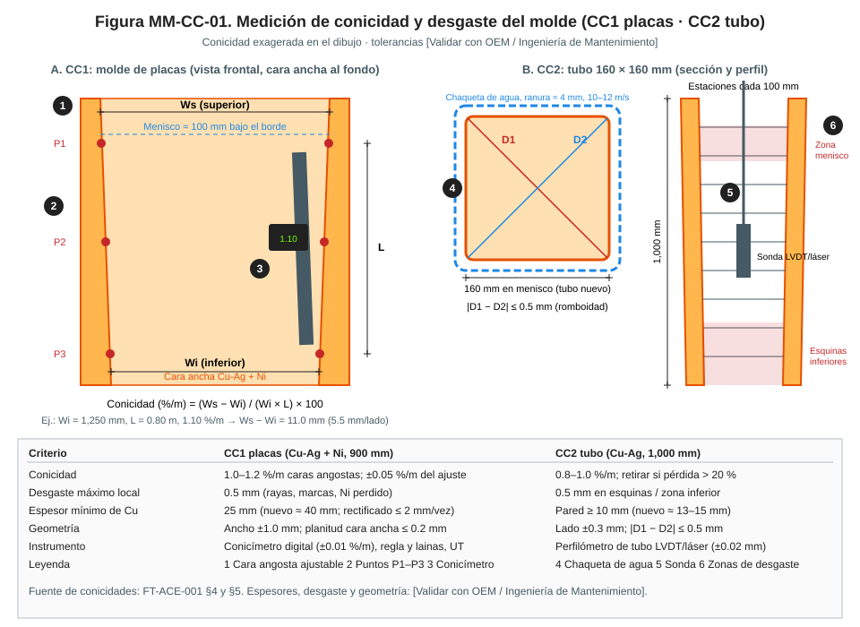
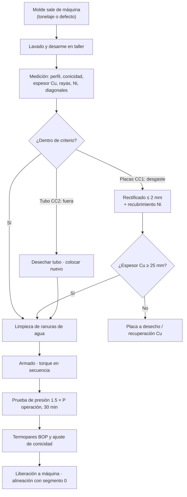

# MM-CC-01 — Cambio y preparación de moldes (placas CC1 / tubos CC2): medición de conicidad y desgaste

| Código | Versión | Estado | Área | Dueño del proceso | Elaboró | Revisión técnica | Revisión de seguridad | Aprobó | Fecha | Próxima revisión |
|---|---|---|---|---|---|---|---|---|---|---|
| MM-CC-01 | 0.2 | Borrador para validación | Acería · CC1, CC2 y taller de moldes | C-11 Supervisor de Mantenimiento Mecánico | gerente-personal-sindicalizado (Líder Academia de Mantenimiento y Confiabilidad) | experto-operativo-metalurgia | experto-seguridad-salud — visto bueno con observaciones, 2026-09-25 | Pendiente (Gerente de Acería / Director) | 2026-09-25 | 2027-09-25 |

> ⚠️ Base: FT-ACE-001 §4 (CC1: placas Cu-Ag con Ni, 900 mm, conicidad caras angostas 1.0–1.2 %/m, ancho 900–1,650 mm × 230 mm) y §5 (CC2: tubo Cu-Ag 1,000 mm, 160 × 160 mm, conicidad 0.8–1.0 %/m, ranura de agua 10–12 m/s, EMS). Espesores, desgastes, torques y presiones de prueba: **[Validar con OEM / Ingeniería de Mantenimiento]**. **El molde es la primera barrera contra el breakout.**

## 1. Objetivo y alcance
Entregar a la máquina moldes con geometría, conicidad, superficie y enfriamiento correctos, y cambiarlos sin riesgo.
**Incluye:** cambio del molde en máquina (CC1 conjunto de molde; CC2 conjunto de tubo por línea), desarme, medición y rectificado de placas, cambio de tubos, prueba de presión, ajuste y verificación de conicidad, verificación de termopares (BOP), centrado de chaqueta, alineación del molde con el segmento 0 / pie de rodillos.
**No incluye:** gap y alineación de segmentos (MM-CC-02), sistema de agua (MM-CC-03), oscilación y nivel (MM-CC-04).

## 2. Roles y responsabilidades
| Rol | Responsabilidad en este proceso | R/A/C/I |
|---|---|---|
| C-11 Supervisor de Mantenimiento Mecánico | Dueño; programa de moldes, liberación del molde a máquina | A |
| S-25 Mecánico de Taller de Moldes y Segmentos | Desarme, medición, rectificado (coordinación), armado, pruebas | R |
| S-19 Mecánico de Acería | Cambio del molde en máquina, conexiones de agua, alineación | R |
| S-21 Instrumentista | Termopares BOP, sensor de nivel (CC1), EMS (CC2) | R |
| Grúa de CC (50 t) — operador asignado | Izaje del molde | R |
| C-08 Ingeniero de Proceso de CC | Define conicidad por grado/ancho; analiza defectos | C |
| C-06 Supervisor de CC | Recibe y firma la liberación por operación | A (operación) |
| C-16 en función de ESR (Encargado de Seguridad Radiológica, licencia CNSNS) | Cierra el obturador de Cs-137, pone su candado y mide < 2 × fondo (CC2) | R (CC2) |
| S-22 Técnico Hidráulico | LOTO y descarga de acumuladores de oscilación y ajuste de ancho | R |
| S-20 Electricista | LOTO eléctrico del EMS y de tableros (NOM-029) | R |

## 3. Descripción del proceso
El molde gira entre la máquina y el taller. En taller se mide todo contra criterio y se decide: **reutilizar**, **rectificar** (placas CC1) o **desechar** (tubo CC2). Antes de subir a máquina se prueba a presión, se ajusta la conicidad y se verifican los termopares.

## 4. Equipos y maquinaria
| Equipo / componente | Función | Especificación clave | Condición para operar (verificación) |
|---|---|---|---|
| Placas anchas CC1 (Cu-Ag + Ni) | Solidificar la cáscara | Largo 900 mm; Cu nuevo ≈ 40 mm [Validar] | Cu ≥ 25 mm; sin rayas > 0.5 mm |
| Placas angostas CC1 ajustables | Ancho y conicidad | 1.0–1.2 %/m | Conicidad ±0.05 %/m del ajuste |
| Mecanismo de ajuste de ancho | Cambio de ancho en caliente | Husillos/servo | Ancho ±1.0 mm |
| Termopares BOP (3 filas) | Predicción de breakout | Tipo K / T [Validar] | Todos leen; respuesta a calor |
| Tubo CC2 (Cu-Ag) | Molde de palanquilla | 1,000 mm, 160 × 160 mm, 0.8–1.0 %/m | Diagonales y conicidad en criterio |
| Chaqueta de agua CC2 | Canal de agua de alta velocidad | Ranura ≈ 4 mm [Validar]; 10–12 m/s | Ranura uniforme ±0.2 mm |
| Agitador electromagnético (EMS) CC2 | Mejorar solidificación | Bobina enfriada | Aislamiento ≥ OEM; sin fuga de agua |
| Pie de rodillos (CC2) / segmento 0 (CC1) | Soporte bajo el molde | Alineado con el molde | ±0.3 mm |
| Conicímetro digital | Medir conicidad | ±0.01 %/m | Calibrado |
| Perfilómetro de tubo (LVDT/láser) | Medir perfil del tubo | ±0.02 mm | Calibrado |
| Medidor de espesores UT | Espesor de Cu | ±0.1 mm | Calibrado en bloque patrón de Cu |
| Banco de prueba de presión | Hermeticidad | Hasta 25 bar | Manómetro calibrado |

## 5. Especificaciones, tolerancias y frecuencias
| Especificación | Unidad | Objetivo | Rango / tolerancia | Límite (alarma / rechazo) | Acción si está fuera | Instrumento | Frecuencia |
|---|---|---|---|---|---|---|---|
| Conicidad caras angostas CC1 | %/m | Según tabla de C-08 (1.0–1.2) | ±0.05 del ajuste | > ±0.1 | Reajustar; si no se logra, revisar mecanismo | Conicímetro | Cada armado y en máquina en cada paro |
| Ancho del molde CC1 | mm | Programado | ±1.0 | > ±2.0 | Recalibrar ajuste de ancho | Regla calibrada / láser | Cada armado |
| Planitud de cara ancha | mm | ≤ 0.1 | ≤ 0.2 | > 0.3 | Rectificar | Regla de precisión + lainas | Cada desarme |
| Espesor de Cu (placa ancha) | mm | ≥ 35 | ≥ 25 | **< 25: desechar** | Rectificar o desechar | UT | Cada desarme |
| Rectificado por intervención | mm | 1.0 | ≤ 2.0 | — | — | Registro de taller | Cada rectificado |
| Rayas / marcas / Ni perdido | mm prof. | 0 | ≤ 0.3 | **> 0.5 mm** | Rectificar y recubrir | Profundímetro / réplica | Cada salida de máquina |
| Recubrimiento Ni (zona baja) | mm | OEM | Sin desprendimiento | Desprendido > 20 mm² o Cu expuesto | Recubrir | Visual / medidor de recubrimientos | Cada salida |
| Conicidad del tubo CC2 | %/m | 0.9 | 0.8–1.0 | **Pérdida > 20 % del nominal** | Desechar tubo | Perfilómetro cada 100 mm | Cada salida de máquina |
| Lado del tubo CC2 (menisco) | mm | 160.0 | ±0.3 | > ±0.5 | Desechar | Perfilómetro | Cada salida |
| Diferencia de diagonales \|D1 − D2\| | mm | ≤ 0.3 | ≤ 0.5 | **> 0.5** | Desechar tubo | Perfilómetro / calibrador de diagonales | Cada salida |
| Desgaste local (esquinas inferiores) | mm | ≤ 0.2 | ≤ 0.5 | **> 0.5** | Desechar tubo | Perfilómetro | Cada salida |
| Ranura de chaqueta CC2 | mm | 4.0 [Validar] | ±0.2 | > ±0.3 | Recentrar tubo/chaqueta | Lainas / galgas en 4 lados y 3 alturas | Cada armado |
| Prueba de presión del molde | bar / min | 1.5 × P operación (típ. 15 bar [Validar]) / 30 min | — | Cualquier caída o goteo | Rehacer juntas | Manómetro clase 0.5 | Cada armado |
| Torque de espárragos placa–caja de agua | N·m | OEM (típ. 100–150 [Validar]) | ±5 % | — | Secuencia del centro hacia afuera, 3 pasadas (30/70/100 %) | Torquímetro calibrado | Cada armado |
| Termopares BOP | °C | Todos leen ±3 °C entre vecinos | — | TC abierto o sin respuesta | Cambiar TC antes de liberar | Pistola de calor + HMI | Cada armado |
| Alineación molde → segmento 0 / pie de rodillos | mm | 0 | ±0.3 | > ±0.5 | Lainas / reajuste | Regla de alineación + lainas | Cada cambio de molde |
| Vida del molde en máquina | t o coladas | CC1 por tonelaje; CC2 400–700 coladas [Validar] | — | Defecto de producto atribuible | Cambio anticipado | Contador de colada | Continuo |

### 5.1 Rutina preventiva y predictiva
| Tarea | Frecuencia | Rol | Duración | Ventana |
|---|---|---|---|---|
| Inspección visual del molde en máquina (fugas, marcas, Ni) | Cada fin de secuencia | S-14 / S-19 | 10 min | Entre secuencias |
| Medición de conicidad CC1 en máquina | Cada paro de CC1 | S-25 | 30 min | Paro entre secuencias |
| Cambio de molde CC1 | Por tonelaje / condición | S-19, S-25, S-21 | 3–4 h [Validar] | Paro programado CC1 |
| Cambio de tubo CC2 (por línea) | 400–700 coladas o por condición | S-19, S-25 | 45–60 min por línea | Línea fuera, máquina colando o en paro |
| Medición completa en taller | Cada salida de máquina | S-25 | 2 h (CC1) / 45 min (CC2) | Taller |
| Rectificado y recubrimiento de placas | Por condición | Proveedor / taller | Días | Rotación de juegos |
| Limpieza de ranuras de agua y análisis de incrustación | Cada desarme | S-25 | 1 h | Taller |
| Calibración de conicímetro, perfilómetro, UT | Semestral | Metrología | — | Taller |

## 6. Seguridad
### 6.1 Peligros y controles críticos
| Peligro | Consecuencia | Control crítico | Verificación |
|---|---|---|---|
| Molde mal armado (fuga de agua, conicidad) | Breakout, explosión agua–acero | Prueba de presión, conicidad y liberación firmada | Registro de prueba y checklist |
| Izaje del molde (CC1 ≈ 20–30 t [Validar]) | Caída de carga | Plan de izaje, aparejos certificados, nadie bajo la carga | Permiso de izaje |
| Energía hidráulica (oscilación, ajuste de ancho) | Aplastamiento | LOTO de HPU y acumuladores a 0 bar | Manómetro 0 bar |
| Agua a presión | Golpe, quemadura | Drenar y ventear antes de desconectar | Manómetro 0 bar |
| Radiación Cs-137 (CC2) | Exposición | **Obturador cerrado y bloqueado con el candado del ESR (C-16)** antes de trabajar en el molde (MS-ACE-07) | Radiámetro en el punto de trabajo < 2 × fondo |
| EMS energizado (CC2) | Electrocución, campo magnético | LOTO eléctrico del EMS | Detector de tensión |
| Rectificado/esmerilado en taller | Proyección, ruido | Guardas, careta, protección auditiva | Inspección de guardas |

### 6.2 EPP obligatorio
Casco, lentes, careta (esmerilado), guantes anticorte, botas metatarsales, protección auditiva; en máquina caliente: ropa FR y guantes para calor; dosímetro personal si se trabaja cerca de la fuente (CC2).

### 6.3 Permisos, bloqueos y zonas de exclusión
**Permisos:** LOTO grupal, izaje, altura (plataforma de colada si hay borde abierto), trabajo con fuente radiactiva (CC2, lo emite el ESR).
**Puntos de aislamiento:** E-W agua de molde de la línea (válvulas de entrada/salida + dren); E-H oscilación y ajuste de ancho (CCM HPU + descarga de acumuladores); E1 EMS y sensor de nivel (tableros); E-R obturador de Cs-137 cerrado con candado del ESR (CC2); E-S enfriamiento secundario de la zona 0 / pie de rodillos; E-M molde apoyado o sujeto por la grúa; barra falsa estacionada y bloqueada. **Prueba de energía cero:** intento de oscilar desde HMI rechazado, manómetros 0 bar, detector de tensión en EMS, radiámetro < 2 × fondo en el punto de trabajo (MS-ACE-02, MS-ACE-07).
**Zona de exclusión:** bajo el molde en izaje y ± 5 m de la proyección de la carga (MS-ACE-04); alrededor de la fuente, la zona controlada que delimita el ESR (MS-ACE-07).

## 7. Calidad
| Variable crítica de calidad | Especificación | Método / frecuencia | Registro | Defecto si falla |
|---|---|---|---|---|
| 🔎 Conicidad CC1 | 1.0–1.2 %/m ±0.05 | Conicímetro, cada armado y paro | Hoja de molde | Poca: grietas longitudinales, depresiones, breakout. Mucha: desgaste, pegado, grietas transversales |
| 🔎 Desgaste / Ni en CC1 | ≤ 0.5 mm; Ni íntegro | Visual + profundímetro | Hoja de molde | Grietas en estrella (contaminación por Cu), marcas superficiales |
| 🔎 Diagonales CC2 | \|D1 − D2\| ≤ 0.5 mm | Perfilómetro | Hoja de tubo | Romboidad, grietas en esquinas, breakout |
| 🔎 Conicidad CC2 | 0.8–1.0 %/m | Perfilómetro | Hoja de tubo | Cáscara delgada, grietas de esquina, abultamiento |
| 🔎 Ranura de agua uniforme | ±0.2 mm | Lainas | Hoja de armado | Enfriamiento desigual → romboidad, grietas |
| 🔎 Termopares BOP | 100 % funcionales | Prueba con calor | Checklist | Breakout no detectado (sticker) |

## 8. Procedimiento paso a paso (cambio y liberación de molde)
| # | Paso | Cómo hacerlo (detalle y medición) | Criterio de aceptación | ★ | Rol |
|---|---|---|---|---|---|
| 1 | Verifica el molde de reemplazo | Hoja de liberación de taller: prueba de presión, conicidad/perfil, TC, torques | Hoja completa y firmada | ★ | S-25, C-11 |
| 2 | Asegura la máquina | Fin de secuencia; sin acero en molde ni hebra sin solidificar; barra falsa estacionada. Nunca se cierra el agua de molde con acero en la máquina (MS-ACE-02) | Máquina vacía; entrega firmada por C-06 | ★ | C-06 |
| 3 | Cierra la fuente (CC2) | El ESR (C-16) cierra el obturador, pone su candado y tarjeta y mide en el punto de trabajo y a 1 m | Radiámetro < 2 × fondo, anotado en el permiso | ★ | C-16 (ESR) |
| 4 | Aplica LOTO | E-W, E-H, E1, E-S; candados personales | Candados puestos | ★ | S-19, S-22, S-20 |
| 5 | Prueba energía cero | Intento de oscilación; manómetros 0 bar; detector de tensión | Sin energía | ★ | C-11 |
| 6 | Drena y desconecta | Drena agua hasta 0 bar, desconecta mangueras/acoples, tapa conexiones | 0 bar; sin agua | ★ | S-19 |
| 7 | Retira el molde | Aparejo certificado, prueba de levante 100 mm, traslado a taller | Sin personas bajo carga | ★ | Grúa, S-19 |
| 8 | Limpia asientos | Mesa de oscilación y asientos sin salpicaduras | Superficies limpias | | S-19 |
| 9 | Instala el molde | Baja guiado; asienta en pernos de centrado; aprieta anclajes al torque OEM | Asentado | ★ | S-19 |
| 10 | Conecta agua y prueba fugas | Presuriza a P de operación 10 min | Sin fugas | ★ | S-19 |
| 11 | Alinea con segmento 0 / pie de rodillos | Regla de alineación + lainas en 4 puntos | ±0.3 mm | 🔎 | S-25 |
| 12 | Verifica conicidad en máquina (CC1) | Conicímetro en ambas caras angostas, P1–P3 | Valor de tabla ±0.05 %/m | 🔎 | S-25 |
| 13 | Verifica TC y nivel | Todos los TC leen; sensor de nivel (CC1) o detector (CC2) conectado | 100 % | 🔎 | S-21 |
| 14 | Retira LOTO | Orden inverso; personal fuera del molde; al final el ESR (C-16) retira su candado, abre el obturador y verifica la señal de nivel con el púlpito | Candados retirados; señal ± 5 mm | ★ | Todos, C-16 (ESR) |
| 15 | Prueba funcional | Agua a caudal nominal (CC1 anchas ≈ 4,200 L/min, angostas ≈ 450 L/min; CC2 ≈ 2,000 L/min/línea); oscilación en vacío | Caudal ≥ 100 % nominal, oscilación sin alarmas | ★ | S-21, S-12 |
| 16 | Libera | Checklist firmado por C-11 y C-06 | Firmado | ★ | C-11, C-06 |

**Checklist de liberación (Mantenimiento + Operación):** [ ] prueba de presión aprobada · [ ] conicidad/perfil en criterio (valor: ____ %/m) · [ ] alineación ±0.3 mm · [ ] TC 100 % · [ ] caudales de agua nominales · [ ] obturador abierto y verificado por ESR (CC2) · [ ] candados retirados · Firma C-11/S-25: ____ Firma C-06/S-12: ____ Fecha/hora: ____

## 9. Condiciones anormales y respuesta
| Síntoma / alarma | Causa probable | Acción inmediata | A quién avisar |
|---|---|---|---|
| Fuga de agua en molde con acero | Junta, placa fisurada | 🛑 Fin de colada controlado; MS-ACE-09 | C-06, C-04 |
| Alarma BOP repetitiva | TC dañado o conicidad | Reducir velocidad (MO-CC1-04); revisar TC y conicidad al paro | C-08, S-21 |
| Grietas longitudinales recurrentes | Conicidad baja, desgaste, polvo | Medir conicidad y desgaste; análisis con C-08 | C-08, C-11 |
| Romboidad en palanquilla | Tubo deformado, ranura desigual, EMS | Cambiar tubo de la línea | C-08, S-25 |
| Prueba de presión cae | Junta dañada | Rehacer armado | S-25 |
| Radiámetro ≥ 2 × fondo con obturador "cerrado" | Obturador trabado o dañado | 🛑 No trabajar; alejarse ≥ 3 m y delimitar; el ESR (C-16) aplica el plan de emergencia radiológica (MS-ACE-07) | C-16 (ESR), C-06 |

## 10. Registros
Hoja de vida de cada placa/tubo (coladas, toneladas, rectificados, espesores, conicidades, diagonales) · prueba de presión · torques · verificación de TC · alineación · permisos, LOTO y constancia del ESR (CC2) · checklist de liberación.

## 11. Competencia requerida y certificación
| Rol | Nivel requerido (1–4) | Formación teórica (h) | OJT supervisado (h / eventos) | Evaluación (pasos ★) | Vigencia |
|---|---|---|---|---|---|
| S-25 Mecánico de Taller | 3 | 32 (metrología de moldes, conicidad, torque, pruebas de presión) | 80 h / 5 armados CC1 + 10 tubos CC2 | Pasos 1, 11, 12 + medición en taller | 24 meses (TD-P07) |
| S-19 Mecánico de Acería | 3 | 16 (cambio de molde, LOTO de CC, izaje) | 3 cambios | Pasos 4–7, 9, 10, 14 | 24 meses (TD-P07); maniobras de izaje 12 meses (MS-ACE-04) |
| S-21 Instrumentista | 3 | 8 (TC BOP, nivel) | 3 verificaciones | Paso 13 | 24 meses (TD-P07) |
| S-22 Técnico Hidráulico | 3 | 8 (LOTO de HPU de CC, acumuladores NOM-020) | 3 bloqueos | Pasos 4, 5 | 24 meses (TD-P07) |
| S-20 Electricista | 3 | NOM-029 + 4 (EMS) | 3 bloqueos | Pasos 4, 5 (E1, detector de tensión) | 12 meses (eléctrico, NOM-029) |
| Operador de grúa de CC (50 t) | 3 | NOM-006 (MS-ACE-04) | 3 izajes de molde | Paso 7 | 12 meses (grúas/izaje) |
| Personal que trabaja cerca de la fuente (CC2: S-19, S-21, S-25) | 2 | Protección radiológica básica NOM-012 (8) | — | Paso 3 (observa al ESR) | 12 meses (fuentes radiactivas) |

**Normas:** NOM-004-STPS, NOM-006-STPS (izaje), NOM-012-STPS (radiaciones ionizantes, CC2), NOM-029-STPS (EMS), NOM-017-STPS; licencia CNSNS de la fuente. Verificar con Jurídico Laboral / SSO.
**Verificación ★:** ¿revisó la hoja de liberación de taller antes de montar (paso 1)? · ¿máquina vacía entregada por C-06 (paso 2)? · ¿el ESR (C-16) cerró el obturador con su candado y midió < 2 × fondo (paso 3)? · ¿LOTO con candado personal y energía cero probada (pasos 4, 5)? · ¿drenó a 0 bar (paso 6)? · ¿nadie bajo la carga en el izaje (paso 7)? · ¿molde asentado a torque y sin fugas (pasos 9, 10)? · ¿retiró LOTO con personal fuera y el ESR verificó la señal (paso 14)? · ¿conicidad y alineación medidas con instrumento calibrado? · ¿caudal nominal antes de liberar (paso 15)? · ¿liberación firmada (paso 16)?

## 12. Referencias
FT-ACE-001 §4, §5 · MO-CC1-02, MO-CC1-04, MO-CC2-02, MO-CC2-04 · MM-CC-02, MM-CC-03, MM-CC-04 · MS-ACE-02, -07 · Manual OEM de molde, ajuste de ancho y EMS [por referenciar] · Tabla de conicidades por grado/ancho de C-08 [por referenciar].

## 13. Control de cambios
| Versión | Fecha | Cambio | Autor |
|---|---|---|---|
| 0.1 | 2026-09-25 | Emisión inicial para validación | gerente-personal-sindicalizado |
| 0.2 | 2026-09-25 | Revisión cruzada de seguridad: C-16 como ESR y criterio < 2 × fondo (MS-ACE-07); S-20, S-22 y operador de grúa en las secciones 2 y 11; pasos 2 y 6 marcados ★; vigencias de 12 meses; lista ★ completa | experto-seguridad-salud |
