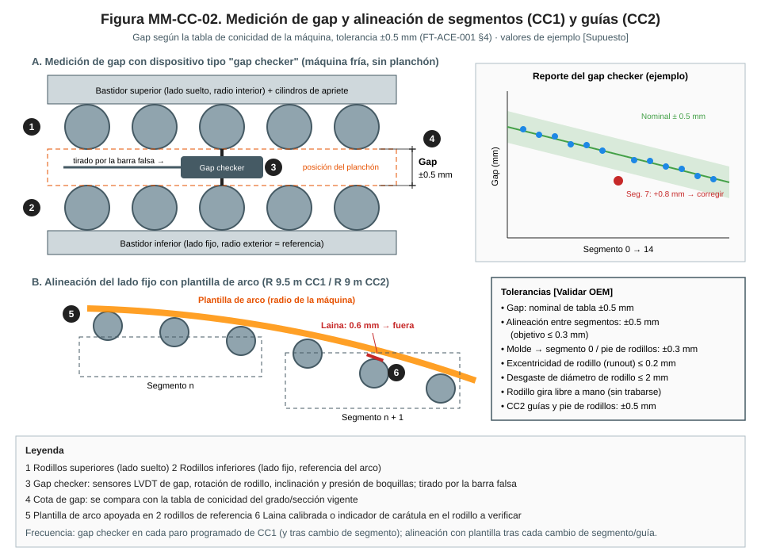
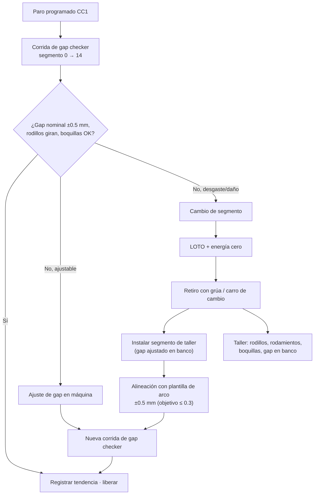

# MM-CC-02 — Cambio y alineación de segmentos (CC1) y guías (CC2): medición de gap y alineación

| Código | Versión | Estado | Área | Dueño del proceso | Elaboró | Revisión técnica | Revisión de seguridad | Aprobó | Fecha | Próxima revisión |
|---|---|---|---|---|---|---|---|---|---|---|
| MM-CC-02 | 0.1 | Borrador para validación | Acería · CC1, CC2 y taller de segmentos | C-11 Supervisor de Mantenimiento Mecánico | gerente-personal-sindicalizado (Líder Academia de Mantenimiento y Confiabilidad) | experto-operativo-metalurgia | experto-seguridad-salud | Pendiente (Gerente de Acería / Director) | 2026-09-25 | 2027-09-25 |

> ⚠️ Base: FT-ACE-001 §4 (CC1: vertical-curva, radio 9.5 m, longitud metalúrgica ≈ 32 m, **14 segmentos, gap según tabla de conicidad ± 0.5 mm**) y §5 (CC2: curva, radio 9 m, 6 líneas, pie de rodillos, enderezado multipunto). Pesos, runout, desgastes y torques: **[Validar con OEM / Ingeniería de Mantenimiento]**.

## 1. Objetivo y alcance
Mantener la **geometría de la línea de colada**: separación correcta entre rodillos (gap), alineación con el radio de la máquina y rodillos que giran libres, para que la cáscara no se abulte ni se agriete.
**Incluye:** medición con gap checker, cambio de segmentos CC1 y de guías/pie de rodillos CC2, reconstrucción en taller (rodillos, rodamientos, boquillas), alineación con plantilla de arco, ajuste de gap, prueba de boquillas, liberación.
**No incluye:** molde (MM-CC-01), bombas y control del agua secundaria (MM-CC-03), oscilación (MM-CC-04).

## 2. Roles y responsabilidades
| Rol | Responsabilidad en este proceso | R/A/C/I |
|---|---|---|
| C-11 Supervisor de Mantenimiento Mecánico | Dueño; programa de segmentos, liberación | A |
| S-25 Mecánico de Taller de Moldes y Segmentos | Reconstrucción, ajuste de gap en banco, prueba de boquillas | R |
| S-19 Mecánico de Acería | Cambio en máquina, alineación, conexiones | R |
| S-22 Técnico Hidráulico | Cilindros de apriete de segmentos, acumuladores | R |
| S-20 Electricista | Motores de rodillos motrices, LOTO eléctrico | R |
| S-21 Instrumentista | Gap checker, transductores de posición | R |
| S-26 Lubricador | Sistema de lubricación aire-aceite / grasa | R |
| C-08 Ingeniero de Proceso de CC | Tabla de conicidad del gap; análisis de defectos internos | C |
| C-06 Supervisor de CC | Firma de liberación por operación | A (operación) |
| C-14 Ingeniero de Confiabilidad | Tendencias de gap, vida de segmentos | C |

## 3. Descripción del proceso
El gap checker viaja por la máquina (tirado por la barra falsa) y mide el gap, la rotación de rodillos y el estado de boquillas. Con esos datos se decide cambiar segmentos o ajustar. Tras cada cambio se verifica la alineación del lado fijo con la plantilla de arco.

## 4. Equipos y maquinaria
| Equipo / componente | Función | Especificación clave | Condición para operar (verificación) |
|---|---|---|---|
| Segmentos CC1 (0–14) | Soportar y guiar el planchón | Peso ≈ 20–40 t [Validar OEM] | Gap en tabla ±0.5 mm |
| Rodillos (partidos o enteros, enfriados por dentro) | Contacto con el planchón | Diámetro nominal por segmento [Validar] | Runout ≤ 0.2 mm; desgaste ≤ 2 mm; giran libres |
| Rodamientos y chumaceras | Apoyo de rodillos | Lubricación aire-aceite / grasa | Sin juego axial > 0.3 mm [Validar] |
| Cilindros de apriete / ajuste | Fijar el gap | Hidráulicos [Validar] | Sin fuga; presión OEM |
| Boquillas de niebla aire–agua | Enfriamiento secundario (10 zonas CC1) | Ángulo y caudal por tipo | Patrón completo en banco de prueba |
| Rodillos motrices y motores | Extraer el planchón | Motores con reductor | Aislamiento y vibración normales |
| Guías y pie de rodillos CC2 | Soporte bajo el molde y en la curva | Radio 9 m | Alineación ±0.5 mm |
| Extractores-enderezadores CC2 | Extraer y enderezar | Presión de rodillo OEM | Rodillos sin desgaste excesivo |
| Gap checker | Medir gap, rotación, boquillas | Exactitud ±0.05 mm [Validar] | Calibrado en bloque patrón |
| Plantilla de arco (R 9.5 m / R 9 m) | Verificar alineación | Certificada por metrología | Sin deformación, certificado vigente |

## 5. Especificaciones, tolerancias y frecuencias
| Especificación | Unidad | Objetivo | Rango / tolerancia | Límite (alarma / rechazo) | Acción si está fuera | Instrumento | Frecuencia |
|---|---|---|---|---|---|---|---|
| Gap por segmento CC1 | mm | Tabla de conicidad (C-08) | **±0.5** | > ±0.5 | Ajustar lainas/cilindros o cambiar segmento | Gap checker | Cada paro programado y tras cambio |
| Diferencia de gap lado fijo vs. suelto (lados izquierdo/derecho) | mm | 0 | ≤ 0.3 | > 0.5 | Ajustar | Gap checker | Cada paro |
| Alineación entre segmentos (lado fijo) | mm | ≤ 0.3 | ±0.5 | > ±0.5 | Lainas en bases; re-alinear | Plantilla de arco + lainas / indicador | Tras cada cambio de segmento y trimestral |
| Alineación molde → segmento 0 | mm | 0 | ±0.3 | > ±0.5 | Ajustar | Regla de alineación | Cada cambio de molde o segmento 0 |
| Runout (excentricidad) de rodillo | mm | ≤ 0.1 | ≤ 0.2 | > 0.3 | Cambiar rodillo | Indicador de carátula en banco | Cada reconstrucción |
| Desgaste de diámetro de rodillo | mm | ≤ 1 | ≤ 2 | > 2 | Cambiar / rectificar | Micrómetro de exteriores | Cada reconstrucción |
| Grietas térmicas en superficie | mm prof. | 0 | ≤ 0.5 | > 1.0 | Rectificar / cambiar | Visual + líquidos penetrantes | Cada reconstrucción |
| Rodillo trabado | — | 0 | 0 | ≥ 1 en segmentos 0–3 = 🛑 no colar | Liberar/cambiar | Gap checker / giro manual | Cada paro |
| Boquillas tapadas | % | 0 | ≤ 2 % por zona | > 5 % en una zona | Limpiar/cambiar boquillas | Prueba de patrón en banco / en máquina con cámara | Cada paro (en máquina) · cada reconstrucción (banco) |
| Presión de cilindros de apriete | bar | OEM | ±5 % | Alarma OEM | Revisar | Manómetro | Semanal |
| Torque de pernos de anclaje de segmento | N·m | OEM | ±5 % | — | Reapretar | Torquímetro | Cada instalación |
| Vida de segmento | t | Segmentos 0–3 ≈ 0.8–1.2 Mt; resto ≈ 1.5–3 Mt [Validar] | — | Criterio por medición | Programar cambio | Contador | Continuo |
| Alineación de guías y enderezadores CC2 | mm | ≤ 0.3 | ±0.5 | > ±0.5 | Ajustar | Plantilla R 9 m | Trimestral y tras cambio |

### 5.1 Rutina preventiva y predictiva
| Tarea | Frecuencia | Rol | Duración | Ventana |
|---|---|---|---|---|
| Revisión visual de rodillos visibles, fugas de agua y aceite | Cada fin de secuencia | S-19 | 20 min | Entre secuencias |
| Corrida de gap checker CC1 | Cada paro programado (≈ semanal [Supuesto]) | S-21, S-25 | 1–1.5 h | Paro programado CC1 |
| Prueba de boquillas en máquina (agua sin acero) | Cada paro | S-19 / S-12 | 30 min | Paro programado |
| Lubricación: revisión de líneas aire-aceite y consumo | Diario | S-26 | 30 min | En operación |
| Vibraciones y temperatura de motores/reductores de rodillos motrices | Mensual | Técnico predictivo / C-14 | 2 h | En operación |
| Cambio de segmentos 0–3 (zona de mayor carga térmica) | Por tonelaje / condición | S-19, S-25, S-22 | 2–3 h por segmento [Validar] | Paro programado CC1 |
| Alineación completa con plantilla de arco | Trimestral y tras cambio | S-25, S-19 | 4–8 h | Paro mensual |
| Reconstrucción en taller (rodillos, rodamientos, boquillas, gap en banco) | Por salida de máquina | S-25 | 2–3 turnos | Taller |
| Alineación de guías y enderezadores CC2 | Trimestral | S-25 | 4 h por línea | Paro de línea / mensual |
| Calibración del gap checker | Semestral | Metrología / S-21 | 2 h | Taller |

## 6. Seguridad
### 6.1 Peligros y controles críticos
| Peligro | Consecuencia | Control crítico | Verificación |
|---|---|---|---|
| Izaje de segmento 20–40 t en espacio reducido | Aplastamiento, caída | Plan de izaje, carro/viga de cambio OEM, nadie bajo carga | Permiso de izaje y aparejos |
| Energía hidráulica (cilindros de apriete) | Movimiento, inyección | HPU fuera, acumuladores 0 bar, calzas | Manómetros 0 bar |
| Rodillos motrices | Atrapamiento | LOTO de motores | Arranque rechazado |
| Agua y vapor en cámara de rociado | Quemadura, resbalón | Agua secundaria aislada; ventilación; T ≤ 45 °C [Validar] | Medición antes de entrar |
| Cámara de rociado como espacio confinado | Atmósfera, rescate difícil | Permiso de espacio confinado (NOM-033) cuando aplique | Gases y vigía |
| Barra falsa en movimiento (corrida de gap checker) | Atrapamiento | Zona despejada; comunicación por radio con púlpito | Recuento de personal |
| Altura (plataformas de segmentos) | Caída | Barandales/arnés NOM-009 | Permiso |

### 6.2 EPP obligatorio
Casco, lentes, guantes anticorte, botas metatarsales, ropa FR, protección auditiva; en cámara de rociado: impermeable, detector de gases; arnés en altura.

### 6.3 Permisos, bloqueos y zonas de exclusión
**Permisos:** LOTO grupal, izaje crítico, espacio confinado (cámara de rociado), altura.
**Puntos de aislamiento:** E1 motores de rodillos motrices del segmento y de los vecinos (CCM); E-H cilindros de apriete (válvula de bloqueo del segmento + descarga de acumuladores); E-S agua secundaria de las zonas afectadas (válvulas + dren); E-W agua de enfriamiento interno de rodillos; E-A aire de atomización; E-L lubricación aire-aceite; E-M barra falsa estacionada y bloqueada; segmento sujeto por grúa o apoyado en su cuna. **Prueba de energía cero:** intento de girar rodillos y mover barra falsa rechazado; manómetros de agua, aire e hidráulica 0 bar.
**Zona de exclusión:** debajo del segmento en izaje y trayectoria de la barra falsa durante la corrida del gap checker.

## 7. Calidad
| Variable crítica de calidad | Especificación | Método / frecuencia | Registro | Defecto si falla |
|---|---|---|---|---|
| 🔎 Gap por segmento | Tabla ±0.5 mm | Gap checker | Reporte de corrida | Gap abierto: abultamiento (bulging), segregación central, grietas internas. Gap cerrado: grietas internas por compresión |
| 🔎 Alineación | ±0.5 mm (objetivo ≤ 0.3) | Plantilla de arco | Reporte | Grietas internas (midway), grietas transversales en esquinas |
| 🔎 Rotación de rodillos | 100 % giran | Gap checker | Reporte | Rayas, marcas en superficie, abultamiento |
| 🔎 Boquillas | ≤ 2 % tapadas por zona | Prueba en máquina | Reporte | Enfriamiento desigual → grietas superficiales, recalentamiento y grietas internas |
| 🔎 Alineación CC2 | ±0.5 mm | Plantilla R 9 m | Reporte | Romboidad, grietas internas, palanquilla torcida |

## 8. Procedimiento paso a paso (cambio de segmento CC1 + verificación)
| # | Paso | Cómo hacerlo (detalle y medición) | Criterio de aceptación | ★ | Rol |
|---|---|---|---|---|---|
| 1 | Verifica el segmento de reemplazo | Hoja de taller: gap en banco, runout, rodamientos, boquillas probadas, prueba de presión de agua interna | Hoja firmada | ★ | S-25 |
| 2 | Asegura la máquina | Sin planchón en la línea; barra falsa estacionada | Máquina vacía | | C-06 |
| 3 | Aplica LOTO | E1, E-H, E-S, E-W, E-A, E-L, E-M | Candados puestos | ★ | S-20, S-22, S-19 |
| 4 | Prueba energía cero | Intentos de arranque; manómetros 0 bar | Sin energía | ★ | C-11 |
| 5 | Desconecta servicios | Agua, aire, hidráulica y cables; tapa conexiones | Sin fugas, conexiones identificadas | | S-19, S-22 |
| 6 | Retira el segmento | Con viga/carro de cambio OEM; prueba de levante 100 mm | Sin personas bajo carga | ★ | Grúa, S-19 |
| 7 | Limpia asientos y bases | Retira escoria, cascarilla y salpicaduras | Asientos limpios | | S-19 |
| 8 | Instala el segmento | Baja guiado a pernos de centrado; aprieta anclajes al torque OEM en secuencia | Asentado, torque registrado | ★ | S-19 |
| 9 | Conecta servicios y prueba | Agua (sin fugas), aire, hidráulica a presión OEM | Sin fugas | | S-19, S-22 |
| 10 | Alinea con plantilla de arco | Apoya plantilla en 2 rodillos de referencia del segmento vecino; mide con lainas en cada rodillo de transición | ±0.5 mm (objetivo ≤ 0.3) | 🔎 | S-25 |
| 11 | Retira LOTO | Orden inverso | Candados retirados | ★ | Todos |
| 12 | Corrida de gap checker | Segmento 0 → 14 a velocidad baja; comunicación con púlpito | Gap ±0.5 mm, 100 % rodillos giran | 🔎 | S-21, S-12 |
| 13 | Prueba de boquillas | Agua secundaria sin acero, inspección visual/cámara | ≤ 2 % tapadas por zona | 🔎 | S-19, S-12 |
| 14 | Libera | Checklist firmado por C-11 y C-06 | Firmado | ★ | C-11, C-06 |

### 8.1 Corrida del gap checker (detalle)
| # | Paso | Cómo hacerlo | Criterio | ★ | Rol |
|---|---|---|---|---|---|
| 1 | Verifica el equipo | Calibración en bloque patrón antes de la corrida; baterías y memoria | Error ≤ ±0.05 mm [Validar] | 🔎 | S-21 |
| 2 | Acopla a la barra falsa | Con máquina en LOTO parcial (solo barra falsa y rodillos habilitados bajo control del púlpito) | Acople seguro | ★ | S-21, S-12 |
| 3 | Despeja la línea | Nadie en la cámara de rociado ni en plataformas de segmentos; aviso por radio | Recuento de personal | ★ | C-06 |
| 4 | Corre a baja velocidad | Velocidad OEM (típ. ≤ 1 m/min [Validar]) de segmento 0 a 14 | Registro completo | | S-12 |
| 5 | Descarga y compara | Gap vs. tabla de C-08; rodillos sin giro; boquillas | Reporte con desviaciones marcadas | 🔎 | S-21, C-08 |

**Checklist de liberación (Mantenimiento + Operación):** [ ] gap checker aprobado (reporte adjunto) · [ ] alineación ±0.5 mm · [ ] 100 % rodillos giran · [ ] boquillas ≤ 2 % tapadas · [ ] sin fugas de agua/hidráulica · [ ] candados retirados · Firma C-11/S-25: ____ Firma C-06/S-12: ____ Fecha/hora: ____

## 9. Condiciones anormales y respuesta
| Síntoma / alarma | Causa probable | Acción inmediata | A quién avisar |
|---|---|---|---|
| Segregación central / grietas internas en macroataque | Gap abierto, desalineación | Corrida de gap checker en siguiente paro; revisar segmentos de zona final | C-08, C-11 |
| Abultamiento (bulging) | Gap abierto, rodillo roto, boquillas tapadas | Reducir velocidad (C-06); inspección | C-06, C-11 |
| Alarma de rodillo trabado / sobrecorriente de motor | Rodamiento dañado | Programar cambio; no colar si es en segmentos 0–3 | C-06, C-11 |
| Presión de apriete baja | Fuga en cilindro/acumulador | Revisar; gap puede abrirse | S-22 |
| Fuga de agua interna de rodillo | Junta rotativa | Programar cambio | S-19 |
| Gap checker no pasa | Rodillo desplazado o segmento fuera | 🛑 No arrancar colada; inspección | C-11, C-06 |

## 10. Registros
Reportes del gap checker con tendencia por segmento · hoja de vida de segmentos (toneladas, reconstrucciones, runout, desgaste) · alineaciones · pruebas de boquillas · torques · permisos, LOTO · checklist de liberación.

## 11. Competencia requerida y certificación
| Rol | Nivel requerido (1–4) | Formación teórica (h) | OJT supervisado (h / eventos) | Evaluación (pasos ★) | Vigencia |
|---|---|---|---|---|---|
| S-25 Mecánico de Taller | 3 | 32 (geometría de máquina, gap, alineación, boquillas, metrología) | 80 h / 3 reconstrucciones + 2 alineaciones | Pasos 1, 10 | 24 meses |
| S-19 Mecánico de Acería | 3 | 16 (cambio de segmento, LOTO de CC, izaje) | 3 cambios | Pasos 3, 4, 6, 8, 11 | 24 meses |
| S-21 Instrumentista | 3 | 8 (gap checker) | 3 corridas | Paso 12 | 24 meses |
| S-22 Técnico Hidráulico | 3 | 16 (cilindros de apriete, acumuladores NOM-020) | 2 intervenciones | Pasos 3, 4 | 24 meses |

**Normas:** NOM-004-STPS, NOM-006-STPS, NOM-009-STPS, NOM-020-STPS (acumuladores), NOM-033-STPS (cámara de rociado, si aplica), NOM-029-STPS (motores), NOM-017-STPS. Verificar con Jurídico Laboral / SSO.
**Verificación ★:** ¿hoja de taller revisada? · ¿energía cero probada incluida la barra falsa? · ¿nadie bajo carga? · ¿alineación medida y registrada? · ¿gap checker aprobado antes de liberar?

## 12. Referencias
FT-ACE-001 §4, §5 · MO-CC1-02, MO-CC1-04, MO-CC2-02, MO-CC2-04 · MM-CC-01, MM-CC-03 · MS-ACE-02, -04, -05, -10 · Manual OEM de segmentos y gap checker [por referenciar] · Tabla de conicidad de gap de C-08 [por referenciar].

## 13. Control de cambios
| Versión | Fecha | Cambio | Autor |
|---|---|---|---|
| 0.1 | 2026-09-25 | Emisión inicial para validación | gerente-personal-sindicalizado |
